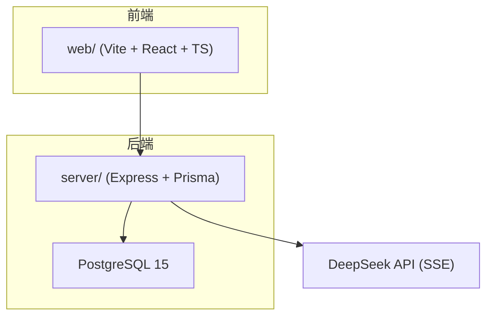
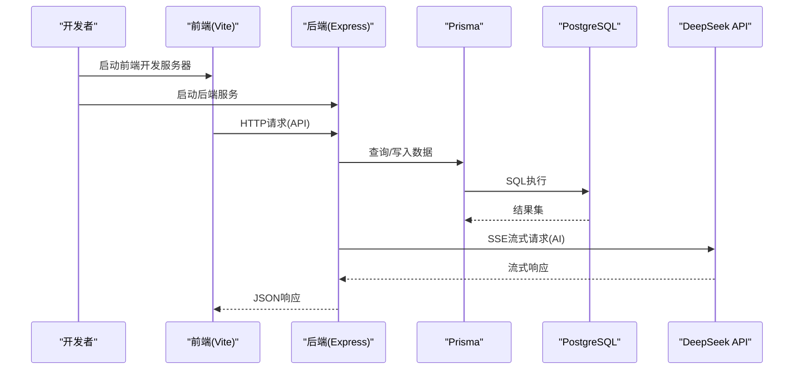
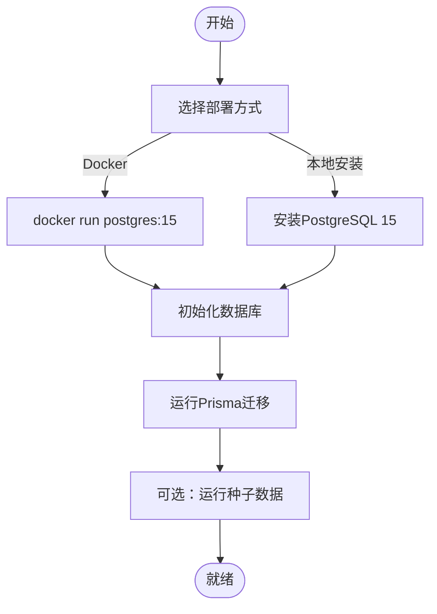
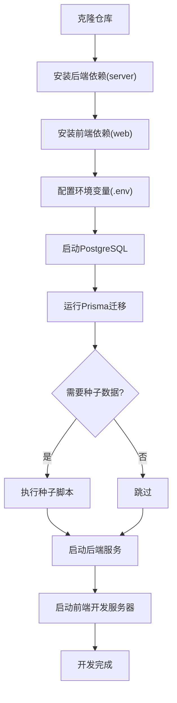
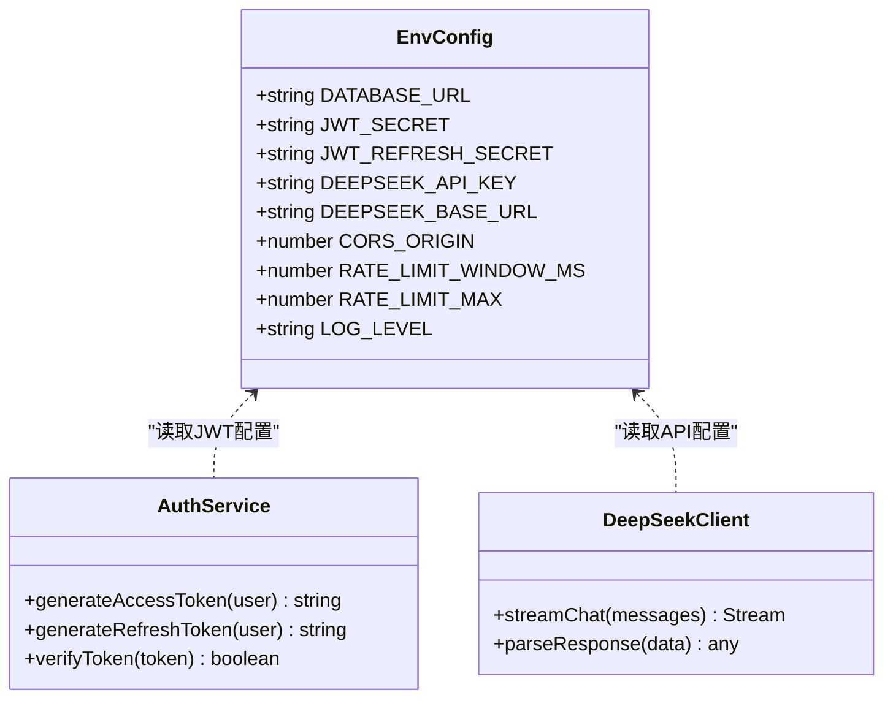
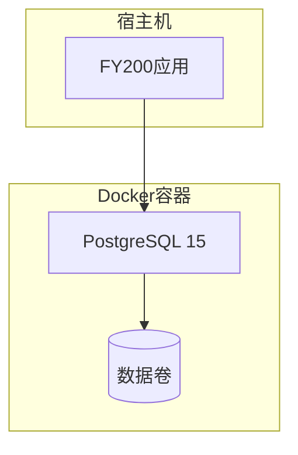
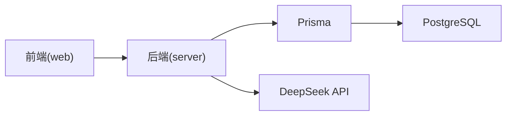

# 开发环境搭建

<cite>
**本文引用的文件**
- [server/package.json](file://server/package.json)
- [web/package.json](file://web/package.json)
- [server/src/config/env.ts](file://server/src/config/env.ts)
- [server/prisma/schema.prisma](file://server/prisma/schema.prisma)
- [server/.pgdata/postgresql.conf](file://server/.pgdata/postgresql.conf)
- [server/scripts/local-db.ts](file://server/scripts/local-db.ts)
- [server/src/lib/deepseek.ts](file://server/src/lib/deepseek.ts)
- [server/src/middleware/auth.ts](file://server/src/middleware/auth.ts)
- [server/src/app.ts](file://server/src/app.ts)
- [server/src/server.ts](file://server/src/server.ts)
- [web/vite.config.ts](file://web/vite.config.ts)
- [web/README.md](file://web/README.md)
</cite>

## 目录
1. [简介](#简介)
2. [项目结构](#项目结构)
3. [核心组件](#核心组件)
4. [架构总览](#架构总览)
5. [详细组件分析](#详细组件分析)
6. [依赖关系分析](#依赖关系分析)
7. [性能注意事项](#性能注意事项)
8. [故障排查指南](#故障排查指南)
9. [结论](#结论)
10. [附录](#附录)

## 简介
本指南面向FY200项目的开发者，目标是帮助你在本地快速搭建完整的开发环境。内容涵盖：
- Node.js版本要求（推荐18+）
- PostgreSQL数据库安装与配置
- IDE推荐设置（VSCode插件：ESLint、Prettier、Prisma等）
- 前后端依赖安装与初始化步骤
- 环境变量配置（数据库连接、JWT密钥、DeepSeek API等）
- Docker开发环境搭建选项
- 常见环境问题排查与解决方案

本项目为“Excel进、看板/报表出”的内部管理口径财务数据平台，后端技术栈为Express 4 + Prisma 5 + PostgreSQL 15 + JWT（access 15分钟 + refresh 7天轮转）+ DeepSeek API（SSE流式）。中间件执行链顺序为：helmet → cors → express.json → rate-limit → auth(JWT+黑名单) → permission(默认拒绝) → scope(Prisma extension) → softDelete → audit → Service → Prisma → PostgreSQL。计算类指标使用安全公式解析（白名单算子 +-*/()，禁止eval），同比/环比由后端实时计算不存库。AI双管道架构：polish（文本→脱敏→LLM→还原）/ analyze（结构化→计算→脱敏→LLM→生成），脱敏规则：绝对金额→区间，公司名→动态映射。

## 项目结构
FY200采用前后端分离的Monorepo结构：
- server：后端服务（Express + Prisma + PostgreSQL）
- web：前端应用（Vite + React + TypeScript）
- .wiki/docs：文档与参考
- server/.pgdata：本地PostgreSQL数据目录（用于Docker或本地进程）

**图示来源**
- [server/src/app.ts](file://server/src/app.ts)
- [server/src/server.ts](file://server/src/server.ts)
- [web/vite.config.ts](file://web/vite.config.ts)

**章节来源**
- [server/package.json](file://server/package.json)
- [web/package.json](file://web/package.json)

## 核心组件
- Node.js运行时：推荐使用Node.js 18+（LTS），确保与TypeScript、Prisma、Vite生态兼容
- 包管理器：npm或yarn均可，建议与仓库锁定文件保持一致
- 数据库：PostgreSQL 15（可通过Docker或本地安装）
- ORM：Prisma 5（迁移与种子脚本）
- 认证：JWT（access token短时效 + refresh token长时效轮转）
- AI集成：DeepSeek API（SSE流式响应）

**章节来源**
- [server/package.json](file://server/package.json)
- [web/package.json](file://web/package.json)
- [server/prisma/schema.prisma](file://server/prisma/schema.prisma)
- [server/src/middleware/auth.ts](file://server/src/middleware/auth.ts)
- [server/src/lib/deepseek.ts](file://server/src/lib/deepseek.ts)

## 架构总览
下图展示了本地开发环境的整体交互流程：前端通过Vite启动开发服务器，请求转发至后端Express；后端通过Prisma访问PostgreSQL；同时调用DeepSeek API进行AI能力增强。

**图示来源**
- [server/src/app.ts](file://server/src/app.ts)
- [server/src/server.ts](file://server/src/server.ts)
- [server/src/lib/deepseek.ts](file://server/src/lib/deepseek.ts)
- [web/vite.config.ts](file://web/vite.config.ts)

## 详细组件分析

### Node.js与包管理器
- 版本要求：Node.js 18+（LTS）
- 包管理器：npm或yarn（与package-lock.json一致）
- 验证命令：node -v、npm -v

**章节来源**
- [server/package.json](file://server/package.json)
- [web/package.json](file://web/package.json)

### PostgreSQL安装与配置
- 版本要求：PostgreSQL 15
- 本地运行方式：
  - 使用Docker镜像快速启动
  - 或使用本地安装的PostgreSQL服务
- 数据目录：server/.pgdata（若使用本地进程模式）
- 配置文件：postgresql.conf（端口、监听地址等）

**图示来源**
- [server/.pgdata/postgresql.conf](file://server/.pgdata/postgresql.conf)
- [server/scripts/local-db.ts](file://server/scripts/local-db.ts)
- [server/prisma/schema.prisma](file://server/prisma/schema.prisma)

**章节来源**
- [server/.pgdata/postgresql.conf](file://server/.pgdata/postgresql.conf)
- [server/scripts/local-db.ts](file://server/scripts/local-db.ts)
- [server/prisma/schema.prisma](file://server/prisma/schema.prisma)

### IDE与插件推荐（VSCode）
- ESLint：代码质量检查
- Prettier：代码格式化
- Prisma：Prisma Schema高亮与提示
- Tailwind CSS IntelliSense（前端）：样式辅助
- Error Lens：错误行内提示
- GitLens：Git历史与差异查看

**章节来源**
- [web/package.json](file://web/package.json)
- [server/package.json](file://server/package.json)

### 依赖安装与初始化
- 后端依赖安装：进入server目录，执行包管理器安装命令
- 前端依赖安装：进入web目录，执行包管理器安装命令
- 数据库初始化：运行Prisma迁移，必要时执行种子数据
- 环境变量准备：创建.env文件并填写必要变量

**图示来源**
- [server/package.json](file://server/package.json)
- [web/package.json](file://web/package.json)
- [server/prisma/schema.prisma](file://server/prisma/schema.prisma)

**章节来源**
- [server/package.json](file://server/package.json)
- [web/package.json](file://web/package.json)
- [server/prisma/schema.prisma](file://server/prisma/schema.prisma)

### 环境变量配置
- 数据库连接：DATABASE_URL（包含主机、端口、用户名、密码、数据库名）
- JWT密钥：JWT_SECRET（签名密钥）、JWT_REFRESH_SECRET（刷新令牌密钥）
- DeepSeek API：DEEPSEEK_API_KEY（API密钥）、DEEPSEEK_BASE_URL（可选基础URL）
- 其他：CORS配置、速率限制阈值、日志级别等

**图示来源**
- [server/src/config/env.ts](file://server/src/config/env.ts)
- [server/src/middleware/auth.ts](file://server/src/middleware/auth.ts)
- [server/src/lib/deepseek.ts](file://server/src/lib/deepseek.ts)

**章节来源**
- [server/src/config/env.ts](file://server/src/config/env.ts)
- [server/src/middleware/auth.ts](file://server/src/middleware/auth.ts)
- [server/src/lib/deepseek.ts](file://server/src/lib/deepseek.ts)

### Docker开发环境搭建
- 使用官方PostgreSQL镜像快速启动数据库容器
- 挂载数据卷持久化数据库文件
- 配置网络以便后端服务访问数据库
- 可选：使用docker-compose统一管理多服务

**图示来源**
- [server/.pgdata/postgresql.conf](file://server/.pgdata/postgresql.conf)
- [server/scripts/local-db.ts](file://server/scripts/local-db.ts)

**章节来源**
- [server/.pgdata/postgresql.conf](file://server/.pgdata/postgresql.conf)
- [server/scripts/local-db.ts](file://server/scripts/local-db.ts)

## 依赖关系分析
- 后端依赖：Express、Prisma、PostgreSQL驱动、JWT库、DeepSeek SDK等
- 前端依赖：React、Vite、TypeScript、Tailwind CSS、图表库等
- 数据库依赖：PostgreSQL 15及以上版本
- 外部服务：DeepSeek API（SSE流式）

**图示来源**
- [server/package.json](file://server/package.json)
- [web/package.json](file://web/package.json)
- [server/prisma/schema.prisma](file://server/prisma/schema.prisma)

**章节来源**
- [server/package.json](file://server/package.json)
- [web/package.json](file://web/package.json)
- [server/prisma/schema.prisma](file://server/prisma/schema.prisma)

## 性能注意事项
- 数据库连接池：合理配置Prisma连接池大小，避免连接耗尽
- 缓存策略：对热点数据使用Redis或内存缓存（可选）
- 异步处理：使用队列处理耗时任务（如AI调用、文件导入）
- 监控与日志：启用结构化日志和性能指标收集
- 前端优化：代码分割、懒加载、图片压缩

[本节为通用指导，无需特定文件引用]

## 故障排查指南
- 数据库连接失败：
  - 检查DATABASE_URL格式是否正确
  - 确认PostgreSQL服务是否正常运行
  - 验证防火墙和网络配置
- JWT认证问题：
  - 检查JWT_SECRET和JWT_REFRESH_SECRET配置
  - 确认token过期时间和刷新机制
- DeepSeek API调用失败：
  - 验证DEEPSEEK_API_KEY有效性
  - 检查网络连接和代理设置
- 端口冲突：
  - 修改服务端口配置
  - 清理占用端口的进程
- 权限问题：
  - 检查文件读写权限
  - 确认数据库用户权限

**章节来源**
- [server/src/config/env.ts](file://server/src/config/env.ts)
- [server/src/middleware/auth.ts](file://server/src/middleware/auth.ts)
- [server/src/lib/deepseek.ts](file://server/src/lib/deepseek.ts)

## 结论
通过本指南，你应该能够成功搭建FY200项目的本地开发环境。关键在于正确配置Node.js、PostgreSQL、环境变量和依赖包。遇到问题时，请参考故障排查指南逐步定位和解决。

[本节为总结性内容，无需特定文件引用]

## 附录
- 常用命令参考
- 环境变量完整列表
- 第三方服务注册指南
- 社区支持资源

[本节为补充信息，无需特定文件引用]