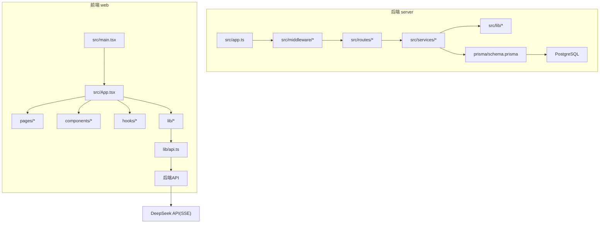
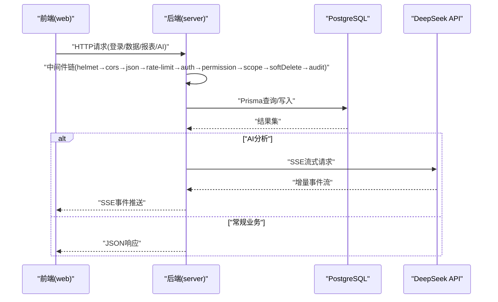
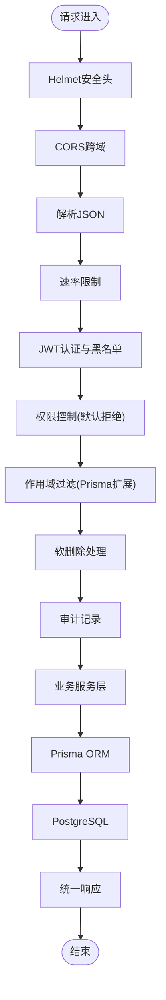
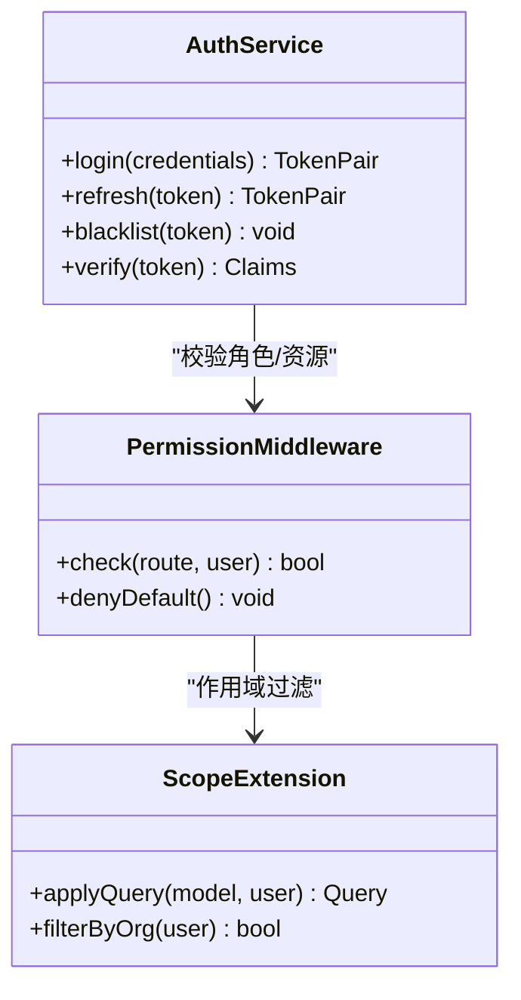
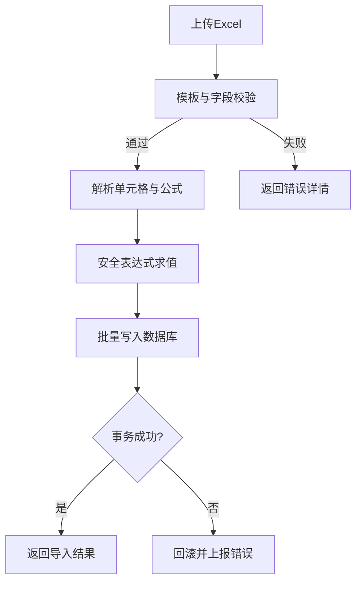
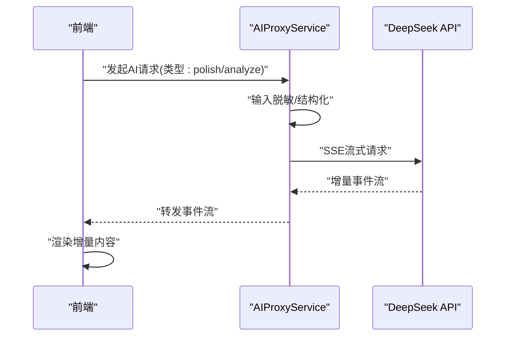
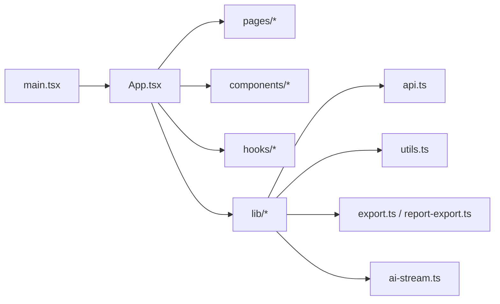
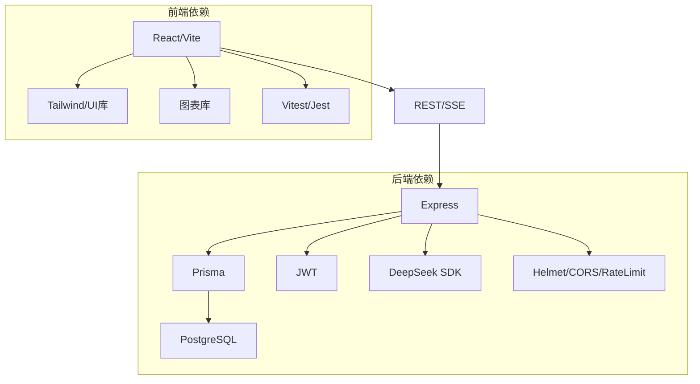

# 开发者指南

<cite>
**本文引用的文件**   
- [server/package.json](file://server/package.json)
- [server/tsconfig.json](file://server/tsconfig.json)
- [server/src/app.ts](file://server/src/app.ts)
- [server/src/server.ts](file://server/src/server.ts)
- [server/src/config/env.ts](file://server/src/config/env.ts)
- [server/src/middleware/helmet.ts](file://server/src/middleware/helmet.ts)
- [server/src/middleware/cors.ts](file://server/src/middleware/cors.ts)
- [server/src/middleware/rate-limit.ts](file://server/src/middleware/rate-limit.ts)
- [server/src/middleware/auth.ts](file://server/src/middleware/auth.ts)
- [server/src/middleware/permission.ts](file://server/src/middleware/permission.ts)
- [server/src/middleware/scope.ts](file://server/src/middleware/scope.ts)
- [server/src/middleware/soft-delete.ts](file://server/src/middleware/soft-delete.ts)
- [server/src/middleware/audit.ts](file://server/src/middleware/audit.ts)
- [server/src/lib/logger.ts](file://server/src/lib/logger.ts)
- [server/src/lib/errors.ts](file://server/src/lib/errors.ts)
- [server/src/lib/formula.ts](file://server/src/lib/formula.ts)
- [server/src/services/AIProxyService.ts](file://server/src/services/AIProxyService.ts)
- [server/prisma/schema.prisma](file://server/prisma/schema.prisma)
- [web/package.json](file://web/package.json)
- [web/vite.config.ts](file://web/vite.config.ts)
- [web/tsconfig.app.json](file://web/tsconfig.app.json)
- [web/src/main.tsx](file://web/src/main.tsx)
- [web/src/App.tsx](file://web/src/App.tsx)
- [web/src/hooks/useAuth.ts](file://web/src/hooks/useAuth.ts)
- [web/src/lib/api.ts](file://web/src/lib/api.ts)
- [web/src/lib/constants.ts](file://web/src/lib/constants.ts)
- [web/src/stores/authStore.ts](file://web/src/stores/authStore.ts)
- [web/src/components/layout/header.tsx](file://web/src/components/layout/header.tsx)
- [web/src/pages/login/index.tsx](file://web/src/pages/login/index.tsx)
- [web/src/pages/dashboard/index.tsx](file://web/src/pages/dashboard/index.tsx)
- [web/src/pages/reports/index.tsx](file://web/src/pages/reports/index.tsx)
- [web/src/pages/data/index.tsx](file://web/src/pages/data/index.tsx)
- [web/src/pages/admin/index.tsx](file://web/src/pages/admin/index.tsx)
- [web/src/lib/export.ts](file://web/src/lib/export.ts)
- [web/src/lib/report-export.ts](file://web/src/lib/report-export.ts)
- [web/src/lib/ai-stream.ts](file://web/src/lib/ai-stream.ts)
- [web/src/lib/utils.ts](file://web/src/lib/utils.ts)
- [web/src/lib/permissions.ts](file://web/src/lib/permissions.ts)
- [web/src/lib/file-validation.ts](file://web/src/lib/file-validation.ts)
- [web/src/lib/import-template.ts](file://web/src/lib/import-template.ts)
- [web/src/lib/metric-values.ts](file://web/src/lib/metric-values.ts)
- [web/src/lib/sanitize.ts](file://web/src/lib/sanitize.ts)
- [web/src/lib/subject-tree.ts](file://web/src/lib/subject-tree.ts)
- [web/src/types/index.ts](file://web/src/types/index.ts)
- [web/src/components/ui/button.tsx](file://web/src/components/ui/button.tsx)
- [web/src/components/ui/dialog.tsx](file://web/src/components/ui/card.tsx](file://web/src/components/ui/card.tsx)
- [web/src/components/charts/kpi-card.tsx](file://web/src/components/charts/kpi-card.tsx)
- [web/src/components/charts/trend-chart.tsx](file://web/src/components/charts/trend-chart.tsx)
- [web/src/components/data-table/pro-data-table.tsx](file://web/src/components/data-table/pro-data-table.tsx)
- [web/src/components/dimension/aggregation-map-panel.tsx](file://web/src/components/dimension/aggregation-map-panel.tsx)
- [web/src/components/editor/rich-text-editor.tsx](file://web/src/components/editor/rich-text-editor.tsx)
- [web/src/components/indicators/analysis-drawer.tsx](file://web/src/components/indicators/analysis-drawer.tsx)
- [web/src/components/subject-tree/subject-tree.tsx](file://web/src/components/subject-tree/subject-tree.tsx)
- [web/src/components/layout/page-container.tsx](file://web/src/components/layout/page-container.tsx)
- [web/src/components/layout/require-permission.tsx](file://web/src/components/layout/require-permission.tsx)
- [web/src/mock/data.ts](file://web/src/mock/data.ts)
- [web/src/mock/static-analysis.ts](file://web/src/mock/static-analysis.ts)
- [web/src/test/setup.ts](file://web/src/test/setup.ts)
- [web/.oxlintrc.json](file://web/.oxlintrc.json)
- [web/postcss.config.js](file://web/postcss.config.js)
- [web/tailwind.config.js](file://web/tailwind.config.js)
- [web/demo.html](file://web/demo.html)
- [web/README.md](file://web/README.md)
- [.wiki/API-Reference.md](file://.wiki/API-Reference.md)
- [.wiki/Database-Schema.md](file://.wiki/Database-Schema.md)
- [.wiki/Getting-Started.md](file://.wiki/Getting-Started.md)
- [docs/references/backend.md](file://docs/references/backend.md)
- [docs/references/frontend.md](file://docs/references/frontend.md)
- [docs/references/devops.md](file://docs/references/devops.md)
- [docs/references/observability.md](file://docs/references/observability.md)
- [docs/references/performance.md](file://docs/references/performance.md)
- [docs/plans/安全与权限规范.md](file://docs/plans/安全与权限规范.md)
- [docs/plans/数据模型规范.md](file://docs/plans/数据模型规范.md)
</cite>

## 目录
1. [简介](#简介)
2. [项目结构](#项目结构)
3. [核心组件](#核心组件)
4. [架构总览](#架构总览)
5. [详细组件分析](#详细组件分析)
6. [依赖关系分析](#依赖关系分析)
7. [性能考量](#性能考量)
8. [故障排除指南](#故障排除指南)
9. [结论](#结论)
10. [附录](#附录)

## 简介
本指南面向FY200项目的开发者，目标是帮助你在本地快速搭建开发环境、遵循统一的代码规范、掌握调试与性能分析方法，并了解Git工作流与贡献流程。项目定位为“Excel进、看板/报表出”的内部管理口径财务数据平台，单位统一为万元/人民币。后端采用Express + Prisma + PostgreSQL + JWT + DeepSeek API（SSE流式），前端基于React + Vite + TailwindCSS。中间件执行链顺序固定：helmet → cors → express.json → rate-limit → auth(JWT+黑名单) → permission(默认拒绝) → scope(Prisma extension) → softDelete → audit → Service → Prisma → PostgreSQL。计算类指标使用安全公式解析（白名单算子 +-*/()，禁止eval），同比/环比由后端实时计算不存库。AI双管道架构：polish（文本→脱敏→LLM→还原）/ analyze（结构化→计算→脱敏→LLM→生成）。

## 项目结构
仓库采用前后端分离的Monorepo风格，根目录下包含server（后端）、web（前端）、docs（文档）、.wiki（Wiki资料）等。后端按功能分层组织：app入口、middleware中间件、routes路由、services服务层、lib工具库、prisma数据库定义与迁移、scripts脚本。前端按页面、组件、hooks、lib、mock、test等划分，便于独立迭代与维护。

图表来源
- [server/src/app.ts](file://server/src/app.ts)
- [server/src/server.ts](file://server/src/server.ts)
- [web/src/main.tsx](file://web/src/main.tsx)
- [web/src/App.tsx](file://web/src/App.tsx)
- [web/src/lib/api.ts](file://web/src/lib/api.ts)
- [server/prisma/schema.prisma](file://server/prisma/schema.prisma)

章节来源
- [server/package.json](file://server/package.json)
- [web/package.json](file://web/package.json)
- [web/README.md](file://web/README.md)

## 核心组件
- 应用启动与配置
  - 后端：Express应用初始化、中间件注册、路由挂载、错误处理、日志与监控集成。
  - 前端：Vite应用入口、路由与布局、全局样式与主题、状态管理初始化。
- 认证与授权
  - JWT访问令牌短期有效（约15分钟）与刷新令牌长期轮转；权限默认拒绝，需显式放行；作用域通过Prisma扩展实现。
- 数据处理与计算
  - Excel导入导出、公式规则引擎（白名单算子）、指标聚合与同比环比实时计算。
- AI能力
  - SSE流式响应，双管道：polish用于文本润色与脱敏还原；analyze用于结构化分析与计算后生成。
- 可观测性与安全
  - Helmet安全头、CORS策略、速率限制、审计日志、TraceID链路追踪、结构化日志。

章节来源
- [server/src/app.ts](file://server/src/app.ts)
- [server/src/server.ts](file://server/src/server.ts)
- [server/src/config/env.ts](file://server/src/config/env.ts)
- [server/src/middleware/auth.ts](file://server/src/middleware/auth.ts)
- [server/src/middleware/permission.ts](file://server/src/middleware/permission.ts)
- [server/src/middleware/scope.ts](file://server/src/middleware/scope.ts)
- [server/src/lib/formula.ts](file://server/src/lib/formula.ts)
- [server/src/services/AIProxyService.ts](file://server/src/services/AIProxyService.ts)
- [web/src/lib/api.ts](file://web/src/lib/api.ts)
- [web/src/lib/ai-stream.ts](file://web/src/lib/ai-stream.ts)

## 架构总览
系统采用前后端分离架构，前端通过REST/SSE与后端交互，后端通过Prisma访问PostgreSQL，并通过OpenAI兼容接口调用DeepSeek进行AI增强。关键路径包括认证鉴权、数据导入导出、指标计算、报表生成与AI分析。

图表来源
- [server/src/app.ts](file://server/src/app.ts)
- [server/src/middleware/auth.ts](file://server/src/middleware/auth.ts)
- [server/src/middleware/permission.ts](file://server/src/middleware/permission.ts)
- [server/src/middleware/scope.ts](file://server/src/middleware/scope.ts)
- [server/src/services/AIProxyService.ts](file://server/src/services/AIProxyService.ts)
- [web/src/lib/api.ts](file://web/src/lib/api.ts)
- [web/src/lib/ai-stream.ts](file://web/src/lib/ai-stream.ts)

## 详细组件分析

### 后端应用与中间件链
- 应用启动：加载环境变量、注册中间件、挂载路由、启动监听端口。
- 中间件链顺序严格固定，确保安全性与可观测性优先，随后进入业务逻辑。
- 错误处理：统一异常捕获、标准化响应格式、敏感信息脱敏。

图表来源
- [server/src/app.ts](file://server/src/app.ts)
- [server/src/middleware/helmet.ts](file://server/src/middleware/helmet.ts)
- [server/src/middleware/cors.ts](file://server/src/middleware/cors.ts)
- [server/src/middleware/rate-limit.ts](file://server/src/middleware/rate-limit.ts)
- [server/src/middleware/auth.ts](file://server/src/middleware/auth.ts)
- [server/src/middleware/permission.ts](file://server/src/middleware/permission.ts)
- [server/src/middleware/scope.ts](file://server/src/middleware/scope.ts)
- [server/src/middleware/soft-delete.ts](file://server/src/middleware/soft-delete.ts)
- [server/src/middleware/audit.ts](file://server/src/middleware/audit.ts)

章节来源
- [server/src/app.ts](file://server/src/app.ts)
- [server/src/middleware/helmet.ts](file://server/src/middleware/helmet.ts)
- [server/src/middleware/cors.ts](file://server/src/middleware/cors.ts)
- [server/src/middleware/rate-limit.ts](file://server/src/middleware/rate-limit.ts)
- [server/src/middleware/auth.ts](file://server/src/middleware/auth.ts)
- [server/src/middleware/permission.ts](file://server/src/middleware/permission.ts)
- [server/src/middleware/scope.ts](file://server/src/middleware/scope.ts)
- [server/src/middleware/soft-delete.ts](file://server/src/middleware/soft-delete.ts)
- [server/src/middleware/audit.ts](file://server/src/middleware/audit.ts)

### 认证与授权
- JWT访问令牌有效期短，刷新令牌支持轮转；黑名单机制拦截已注销或异常会话。
- 权限模型默认拒绝，需在路由或控制器中显式授予；作用域通过Prisma扩展对查询进行行级过滤。

图表来源
- [server/src/middleware/auth.ts](file://server/src/middleware/auth.ts)
- [server/src/middleware/permission.ts](file://server/src/middleware/permission.ts)
- [server/src/middleware/scope.ts](file://server/src/middleware/scope.ts)

章节来源
- [server/src/middleware/auth.ts](file://server/src/middleware/auth.ts)
- [server/src/middleware/permission.ts](file://server/src/middleware/permission.ts)
- [server/src/middleware/scope.ts](file://server/src/middleware/scope.ts)

### 数据导入与公式引擎
- Excel导入：支持模板校验、字段映射、批量写入与错误回滚。
- 公式引擎：白名单算子（加减乘除与括号），禁止eval，保障安全；支持变量替换与上下文注入。

图表来源
- [server/src/lib/excel-import.ts](file://server/src/lib/excel-import.ts)
- [server/src/lib/formula.ts](file://server/src/lib/formula.ts)

章节来源
- [server/src/lib/excel-import.ts](file://server/src/lib/excel-import.ts)
- [server/src/lib/formula.ts](file://server/src/lib/formula.ts)

### AI代理与SSE流式
- 双管道：polish用于文本润色与脱敏还原；analyze用于结构化分析与计算后生成。
- 前端通过SSE接收增量事件，提升交互体验与长任务反馈。

图表来源
- [server/src/services/AIProxyService.ts](file://server/src/services/AIProxyService.ts)
- [web/src/lib/ai-stream.ts](file://web/src/lib/ai-stream.ts)

章节来源
- [server/src/services/AIProxyService.ts](file://server/src/services/AIProxyService.ts)
- [web/src/lib/ai-stream.ts](file://web/src/lib/ai-stream.ts)

### 前端应用与页面模块
- 应用入口：初始化路由、布局、全局状态与主题。
- 页面模块：登录、仪表盘、报表、数据维护、管理员等。
- 组件库：UI基础组件、图表、数据表格、维度面板、编辑器等。
- Hooks与状态：认证、权限、API封装、常量与工具函数。

图表来源
- [web/src/main.tsx](file://web/src/main.tsx)
- [web/src/App.tsx](file://web/src/App.tsx)
- [web/src/lib/api.ts](file://web/src/lib/api.ts)
- [web/src/lib/export.ts](file://web/src/lib/export.ts)
- [web/src/lib/report-export.ts](file://web/src/lib/report-export.ts)
- [web/src/lib/ai-stream.ts](file://web/src/lib/ai-stream.ts)

章节来源
- [web/src/main.tsx](file://web/src/main.tsx)
- [web/src/App.tsx](file://web/src/App.tsx)
- [web/src/pages/login/index.tsx](file://web/src/pages/login/index.tsx)
- [web/src/pages/dashboard/index.tsx](file://web/src/pages/dashboard/index.tsx)
- [web/src/pages/reports/index.tsx](file://web/src/pages/reports/index.tsx)
- [web/src/pages/data/index.tsx](file://web/src/pages/data/index.tsx)
- [web/src/pages/admin/index.tsx](file://web/src/pages/admin/index.tsx)

## 依赖关系分析
- 后端依赖：Express、Prisma、PostgreSQL驱动、JWT库、DeepSeek SDK、安全与监控库。
- 前端依赖：React、Vite、TailwindCSS、图表库、表单与UI库、测试框架。
- 外部服务：PostgreSQL数据库、DeepSeek API（SSE流式）。

图表来源
- [server/package.json](file://server/package.json)
- [web/package.json](file://web/package.json)

章节来源
- [server/package.json](file://server/package.json)
- [web/package.json](file://web/package.json)

## 性能考量
- 后端
  - 使用Prisma连接池与查询优化，避免N+1问题；对热点查询建立索引。
  - 公式计算与指标聚合尽量在数据库层完成，减少内存压力。
  - AI流式响应降低首屏延迟，合理设置超时与重试策略。
- 前端
  - 组件懒加载与路由分割，按需引入图表与重型组件。
  - 列表分页与虚拟滚动，避免大数据量渲染卡顿。
  - 缓存策略：静态资源CDN、API响应缓存（ETag/Cache-Control）。

[本节为通用指导，无需特定文件引用]

## 故障排除指南
- 常见问题
  - 数据库连接失败：检查PostgreSQL服务状态、连接字符串与权限。
  - JWT认证失败：确认令牌是否过期、黑名单是否命中、签名密钥一致。
  - 权限被拒：确认路由权限配置与作用域过滤是否正确。
  - Excel导入失败：检查模板字段映射、数据类型与必填项。
  - AI流中断：检查网络稳定性、SSE事件处理与重试逻辑。
- 调试技巧
  - 断点调试：后端Node.js断点、前端浏览器断点与Source Map。
  - 日志分析：结构化日志、TraceID链路追踪、错误堆栈定位。
  - 性能分析：后端CPU/内存采样、前端Performance面板与Lighthouse。

章节来源
- [server/src/lib/logger.ts](file://server/src/lib/logger.ts)
- [server/src/lib/errors.ts](file://server/src/lib/errors.ts)
- [web/src/lib/utils.ts](file://web/src/lib/utils.ts)

## 结论
本指南提供了FY200项目的开发环境搭建、代码规范、调试方法与性能优化建议。遵循中间件链与安全策略、使用安全公式引擎与AI双管道，可有效提升系统的稳定性与可维护性。建议团队在贡献代码时遵循Git工作流与审查流程，持续改进与优化。

[本节为总结，无需特定文件引用]

## 附录

### 开发环境与IDE推荐
- Node.js与包管理器：建议使用Node LTS版本与npm/yarn/pnpm。
- IDE：VS Code推荐插件（ESLint、Prettier、Tailwind IntelliSense、Prisma VSCode Extension、DotENV、Error Lens）。
- 调试：后端启用source map与断点；前端启用React DevTools与Vue/React Profiler。
- 环境变量：在后端.env中配置数据库、JWT密钥、DeepSeek API Key等。

章节来源
- [server/package.json](file://server/package.json)
- [server/tsconfig.json](file://server/tsconfig.json)
- [web/package.json](file://web/package.json)
- [web/tsconfig.app.json](file://web/tsconfig.app.json)
- [web/.oxlintrc.json](file://web/.oxlintrc.json)

### TypeScript编码规范与最佳实践
- 类型优先：所有函数参数与返回值明确类型，避免any。
- 模块化：单一职责，拆分大文件，合理使用命名空间与模块。
- 错误处理：统一错误类型与响应格式，避免未捕获异常。
- 测试：单元测试覆盖核心逻辑，集成测试验证端到端流程。

章节来源
- [server/src/lib/errors.ts](file://server/src/lib/errors.ts)
- [web/src/types/index.ts](file://web/src/types/index.ts)

### React组件开发规范与命名约定
- 组件命名：PascalCase，文件名与组件名一致。
- Props定义：使用TypeScript接口，提供默认值与校验。
- 状态管理：局部状态useState，全局状态useContext或Zustand/Redux。
- 样式：TailwindCSS原子化，避免内联样式与硬编码。

章节来源
- [web/src/components/ui/button.tsx](file://web/src/components/ui/button.tsx)
- [web/src/components/ui/dialog.tsx](file://web/src/components/ui/dialog.tsx)
- [web/src/components/charts/kpi-card.tsx](file://web/src/components/charts/kpi-card.tsx)
- [web/src/components/data-table/pro-data-table.tsx](file://web/src/components/data-table/pro-data-table.tsx)

### Git工作流与提交规范
- 分支策略：主分支保护，功能分支开发，热修复分支紧急发布。
- 提交信息：遵循Conventional Commits（feat/fix/docs等）。
- 代码审查：Pull Request模板、CI检查、至少一人审查。
- 发布流程：版本号管理、变更日志、灰度发布与回滚预案。

[本节为通用指导，无需特定文件引用]

### 调试技巧与性能分析
- 断点调试：后端Node.js调试器、前端Chrome DevTools。
- 日志分析：结构化日志、TraceID、错误告警。
- 性能分析：后端火焰图、前端Performance与Network面板。

章节来源
- [server/src/lib/logger.ts](file://server/src/lib/logger.ts)
- [web/src/lib/utils.ts](file://web/src/lib/utils.ts)

### 常见问题解决方案
- 数据库迁移失败：检查迁移脚本与数据兼容性。
- 权限不足：确认用户角色与资源权限配置。
- 导入模板错误：核对字段映射与数据类型。
- AI流中断：检查网络与SSE事件处理。

章节来源
- [server/prisma/schema.prisma](file://server/prisma/schema.prisma)
- [server/src/middleware/permission.ts](file://server/src/middleware/permission.ts)
- [server/src/lib/excel-import.ts](file://server/src/lib/excel-import.ts)
- [web/src/lib/ai-stream.ts](file://web/src/lib/ai-stream.ts)

### 代码重构建议与性能优化
- 重构建议：拆分复杂服务、提取公共逻辑、消除重复代码。
- 性能优化：数据库索引、查询优化、缓存策略、前端懒加载。

[本节为通用指导，无需特定文件引用]

### 贡献代码与参与开发
- Fork仓库、创建功能分支、提交PR、等待审查与合并。
- 编写测试用例、更新文档、保持代码整洁。
- 参与讨论与评审，遵循团队规范与价值观。

[本节为通用指导，无需特定文件引用]

### 开发资源与学习材料
- 官方文档：Express、Prisma、PostgreSQL、React、Vite、TailwindCSS。
- 内部文档：API参考、数据库模式、入门指南、后端/前端/DevOps/可观测性/性能参考。
- 计划与规范：安全与权限规范、数据模型规范。

章节来源
- [.wiki/API-Reference.md](file://.wiki/API-Reference.md)
- [.wiki/Database-Schema.md](file://.wiki/Database-Schema.md)
- [.wiki/Getting-Started.md](file://.wiki/Getting-Started.md)
- [docs/references/backend.md](file://docs/references/backend.md)
- [docs/references/frontend.md](file://docs/references/frontend.md)
- [docs/references/devops.md](file://docs/references/devops.md)
- [docs/references/observability.md](file://docs/references/observability.md)
- [docs/references/performance.md](file://docs/references/performance.md)
- [docs/plans/安全与权限规范.md](file://docs/plans/安全与权限规范.md)
- [docs/plans/数据模型规范.md](file://docs/plans/数据模型规范.md)