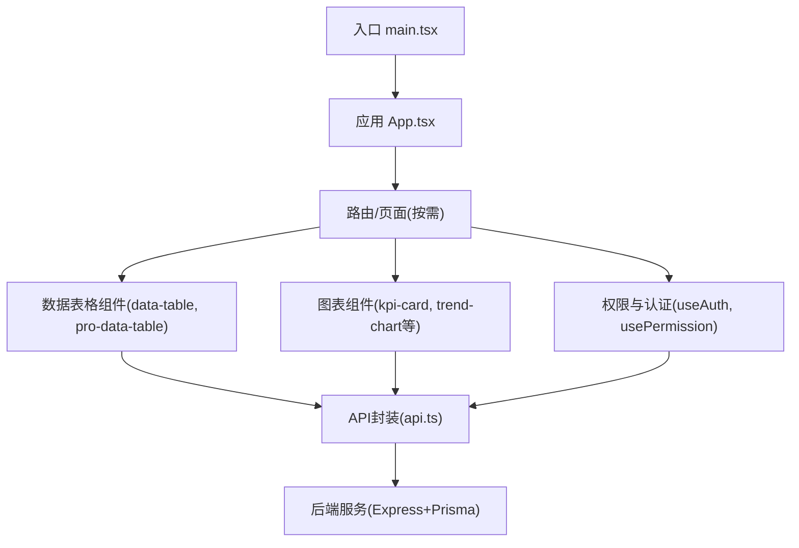
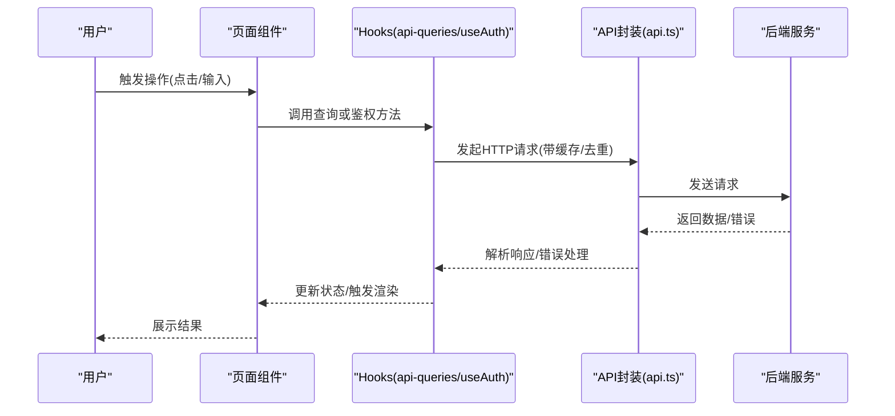
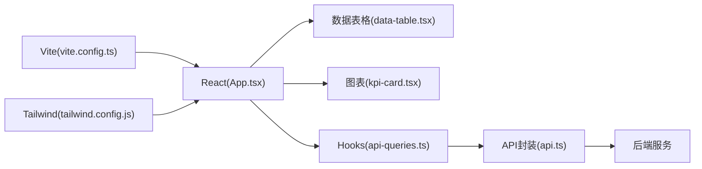

# 前端性能优化

<cite>
**本文引用的文件**   
- [vite.config.ts](file://web/vite.config.ts)
- [package.json](file://web/package.json)
- [main.tsx](file://web/src/main.tsx)
- [App.tsx](file://web/src/App.tsx)
- [api.ts](file://web/src/lib/api.ts)
- [api-queries.ts](file://web/src/hooks/api-queries.ts)
- [data-table.tsx](file://web/src/components/data-table/data-table.tsx)
- [pro-data-table.tsx](file://web/src/components/data-table/pro-data-table.tsx)
- [pro-table-inner.tsx](file://web/src/components/data-table/pro-table-inner.tsx)
- [kpi-card.tsx](file://web/src/components/charts/kpi-card.tsx)
- [kpi-sparkline.tsx](file://web/src/components/charts/kpi-sparkline.tsx)
- [mini-bar-chart.tsx](file://web/src/components/charts/mini-bar-chart.tsx)
- [trend-chart.tsx](file://web/src/components/charts/trend-chart.tsx)
- [authStore.ts](file://web/src/stores/authStore.ts)
- [useAuth.ts](file://web/src/hooks/useAuth.ts)
- [usePermission.ts](file://web/src/hooks/usePermission.ts)
- [index.html](file://web/index.html)
- [tailwind.config.js](file://web/tailwind.config.js)
- [postcss.config.js](file://web/postcss.config.js)
</cite>

## 目录
1. [简介](#简介)
2. [项目结构](#项目结构)
3. [核心组件](#核心组件)
4. [架构总览](#架构总览)
5. [详细组件分析](#详细组件分析)
6. [依赖关系分析](#依赖关系分析)
7. [性能考量](#性能考量)
8. [故障排查指南](#故障排查指南)
9. [结论](#结论)
10. [附录](#附录)

## 简介
本文件面向FY200项目（浙江壹品慧财年经营数据分析平台）的前端性能优化，聚焦React渲染优化、网络请求优化、资源加载优化、状态管理优化、打包构建优化与浏览器级优化。内容结合仓库中的Vite配置、数据表格与图表组件、API封装与查询Hook、以及全局样式与入口文件，给出可落地的最佳实践与改进建议。

## 项目结构
前端位于 web 目录，采用 Vite + React + TypeScript 技术栈，UI层由自研数据表格与图表组件构成，网络层通过统一API封装与Hooks进行数据获取与缓存，状态集中在轻量store中。

**图示来源** 
- [main.tsx:1-50](file://web/src/main.tsx#L1-L50)
- [App.tsx:1-80](file://web/src/App.tsx#L1-L80)
- [api.ts:1-120](file://web/src/lib/api.ts#L1-L120)
- [data-table.tsx:1-120](file://web/src/components/data-table/data-table.tsx#L1-L120)
- [pro-data-table.tsx:1-120](file://web/src/components/data-table/pro-data-table.tsx#L1-L120)
- [kpi-card.tsx:1-80](file://web/src/components/charts/kpi-card.tsx#L1-L80)
- [trend-chart.tsx:1-120](file://web/src/components/charts/trend-chart.tsx#L1-L120)

**章节来源**
- [main.tsx:1-50](file://web/src/main.tsx#L1-L50)
- [App.tsx:1-80](file://web/src/App.tsx#L1-L80)
- [package.json:1-60](file://web/package.json#L1-L60)

## 核心组件
- 数据表格：提供分页、排序、筛选与可扩展列能力，适合大数据量展示场景，需配合虚拟滚动与懒加载提升性能。
- 图表组件：KPI卡片、迷你折线/柱状图、趋势图，常用于指标概览与趋势分析，应避免重复计算与过度重绘。
- API封装与查询Hook：集中处理请求、错误、重试与缓存策略，便于在多处复用并统一优化。
- 权限与认证Hook：控制用户可见性与操作权限，减少不必要的渲染与请求。

**章节来源**
- [data-table.tsx:1-120](file://web/src/components/data-table/data-table.tsx#L1-L120)
- [pro-data-table.tsx:1-120](file://web/src/components/data-table/pro-data-table.tsx#L1-L120)
- [kpi-card.tsx:1-80](file://web/src/components/charts/kpi-card.tsx#L1-L80)
- [trend-chart.tsx:1-120](file://web/src/components/charts/trend-chart.tsx#L1-L120)
- [api.ts:1-120](file://web/src/lib/api.ts#L1-L120)
- [api-queries.ts:1-120](file://web/src/hooks/api-queries.ts#L1-L120)
- [useAuth.ts:1-80](file://web/src/hooks/useAuth.ts#L1-L80)
- [usePermission.ts:1-80](file://web/src/hooks/usePermission.ts#L1-L80)

## 架构总览
前端以Vite为构建工具，React为视图框架，组件按功能划分（图表、表格、布局、权限），数据流从API封装到Hooks再到组件，状态集中在轻量store中。

**图示来源** 
- [api.ts:1-120](file://web/src/lib/api.ts#L1-L120)
- [api-queries.ts:1-120](file://web/src/hooks/api-queries.ts#L1-L120)
- [useAuth.ts:1-80](file://web/src/hooks/useAuth.ts#L1-L80)

## 详细组件分析

### React组件渲染优化
- useMemo：用于昂贵计算（如大型列表过滤、图表数据转换）的结果缓存，避免每次渲染重新计算。
- useCallback：稳定函数引用，防止子组件因props变化而重渲染，适用于事件回调传递。
- React.memo：对纯展示组件进行浅比较包装，减少不必要的重渲染。

建议实践：
- 在图表组件中对数据进行预处理时使用useMemo，确保仅在依赖变化时重算。
- 将表格的列定义、排序/筛选逻辑使用useCallback包裹，避免频繁重建。
- 对无副作用的UI片段使用React.memo包裹，降低渲染成本。

**章节来源**
- [kpi-card.tsx:1-80](file://web/src/components/charts/kpi-card.tsx#L1-L80)
- [trend-chart.tsx:1-120](file://web/src/components/charts/trend-chart.tsx#L1-L120)
- [data-table.tsx:1-120](file://web/src/components/data-table/data-table.tsx#L1-L120)

### 网络请求优化
- 请求去重：同一时刻相同参数请求合并，避免重复网络开销。
- 缓存策略：基于URL+参数的内存缓存，支持TTL与失效策略；对热点数据设置较长缓存时间。
- 懒加载：页面级与组件级按需加载，减少首屏体积。
- 虚拟滚动：大数据表格仅渲染可视区域，显著降低DOM节点数量。

建议实践：
- 在API封装层实现请求去重与缓存，统一处理错误与重试。
- 表格组件集成虚拟滚动，结合分页与增量加载。
- 对图表数据采用按需拉取与增量更新。

**章节来源**
- [api.ts:1-120](file://web/src/lib/api.ts#L1-L120)
- [api-queries.ts:1-120](file://web/src/hooks/api-queries.ts#L1-L120)
- [pro-data-table.tsx:1-120](file://web/src/components/data-table/pro-data-table.tsx#L1-L120)
- [pro-table-inner.tsx:1-120](file://web/src/components/data-table/pro-table-inner.tsx#L1-L120)

### 资源加载优化
- 代码分割：按路由与组件拆分bundle，减少初始加载体积。
- 图片优化：使用现代格式（WebP/AVIF）、懒加载与尺寸适配。
- 字体加载：预加载关键字体，避免FOIT/FOUT。
- CDN部署：静态资源托管至CDN，提升全球访问速度。

建议实践：
- 利用Vite的动态导入实现路由级代码分割。
- 在index.html中预加载关键资源，启用HTTP/2多路复用。
- 配置Tailwind按需生成CSS，减少样式体积。

**章节来源**
- [vite.config.ts:1-120](file://web/vite.config.ts#L1-L120)
- [index.html:1-80](file://web/index.html#L1-L80)
- [tailwind.config.js:1-80](file://web/tailwind.config.js#L1-L80)
- [postcss.config.js:1-40](file://web/postcss.config.js#L1-L40)

### 状态管理优化
- 更新频率控制：对高频状态变更使用节流/防抖，避免频繁重渲染。
- 大对象处理：将大对象拆分为小状态或使用不可变数据结构，减少比较成本。
- 内存泄漏防护：清理定时器、事件监听与订阅，确保组件卸载时释放资源。

建议实践：
- 在useAuth与usePermission中合理使用状态，避免全局状态过大。
- 对表格筛选与搜索输入进行防抖处理。
- 在自定义Hook中统一清理副作用。

**章节来源**
- [authStore.ts:1-80](file://web/src/stores/authStore.ts#L1-L80)
- [useAuth.ts:1-80](file://web/src/hooks/useAuth.ts#L1-L80)
- [usePermission.ts:1-80](file://web/src/hooks/usePermission.ts#L1-L80)

### 打包构建优化
- Vite配置优化：启用生产模式优化、分包策略与缓存。
- Tree Shaking：移除未使用代码，减少包体积。
- 压缩策略：启用JS/CSS压缩与资源压缩插件。

建议实践：
- 在vite.config.ts中配置动态导入与分包策略。
- 使用Rollup插件进行代码分析与优化。
- 开启Source Map以便生产环境调试。

**章节来源**
- [vite.config.ts:1-120](file://web/vite.config.ts#L1-L120)
- [package.json:1-60](file://web/package.json#L1-L60)

### 浏览器性能优化
- 重排重绘避免：批量DOM操作、使用transform代替top/left、避免强制同步布局。
- Web Workers：将耗时计算移至Worker线程，保持主线程流畅。
- Service Worker：缓存静态资源与API响应，提升离线体验与加载速度。

建议实践：
- 在图表渲染中使用requestAnimationFrame优化动画。
- 对大数据处理使用Web Worker分片计算。
- 配置Service Worker缓存策略，优先本地缓存。

**章节来源**
- [trend-chart.tsx:1-120](file://web/src/components/charts/trend-chart.tsx#L1-L120)
- [mini-bar-chart.tsx:1-80](file://web/src/components/charts/mini-bar-chart.tsx#L1-L80)

## 依赖关系分析
前端依赖Vite构建、React生态与Tailwind样式，运行时依赖API服务与第三方库。

**图示来源** 
- [vite.config.ts:1-120](file://web/vite.config.ts#L1-L120)
- [App.tsx:1-80](file://web/src/App.tsx#L1-L80)
- [data-table.tsx:1-120](file://web/src/components/data-table/data-table.tsx#L1-L120)
- [kpi-card.tsx:1-80](file://web/src/components/charts/kpi-card.tsx#L1-L80)
- [api-queries.ts:1-120](file://web/src/hooks/api-queries.ts#L1-L120)
- [api.ts:1-120](file://web/src/lib/api.ts#L1-L120)
- [tailwind.config.js:1-80](file://web/tailwind.config.js#L1-L80)

**章节来源**
- [package.json:1-60](file://web/package.json#L1-L60)
- [vite.config.ts:1-120](file://web/vite.config.ts#L1-L120)

## 性能考量
- 首屏加载：通过代码分割、资源预加载与CDN加速降低TTI。
- 交互响应：使用React.memo与useCallback减少重渲染，提升用户操作反馈速度。
- 内存占用：避免闭包持有大对象，及时清理订阅与定时器。
- 网络开销：合并请求、缓存热点数据、使用虚拟滚动减少DOM压力。

[本节为通用指导，不直接分析具体文件]

## 故障排查指南
- 渲染卡顿：检查是否滥用setState、是否存在未优化的循环依赖。
- 内存泄漏：确认事件监听、定时器与订阅是否正确清理。
- 网络超时：检查API封装的重试与超时配置，验证后端服务状态。
- 构建失败：查看Vite配置与依赖版本兼容性，清理缓存后重试。

**章节来源**
- [api.ts:1-120](file://web/src/lib/api.ts#L1-L120)
- [vite.config.ts:1-120](file://web/vite.config.ts#L1-L120)

## 结论
通过对React渲染、网络请求、资源加载、状态管理与构建流程的系统性优化，FY200前端可在保证功能完整性的同时显著提升性能与用户体验。建议持续监控关键指标（FCP、LCP、FID、CLS），并结合实际业务场景迭代优化策略。

[本节为总结性内容，不直接分析具体文件]

## 附录
- 性能监控：集成浏览器性能API与前端监控SDK，收集关键指标。
- 测试策略：对关键组件与Hooks编写单元测试与集成测试，确保优化效果。
- 文档维护：定期更新性能优化指南与最佳实践，保持团队知识同步。

[本节为补充信息，不直接分析具体文件]