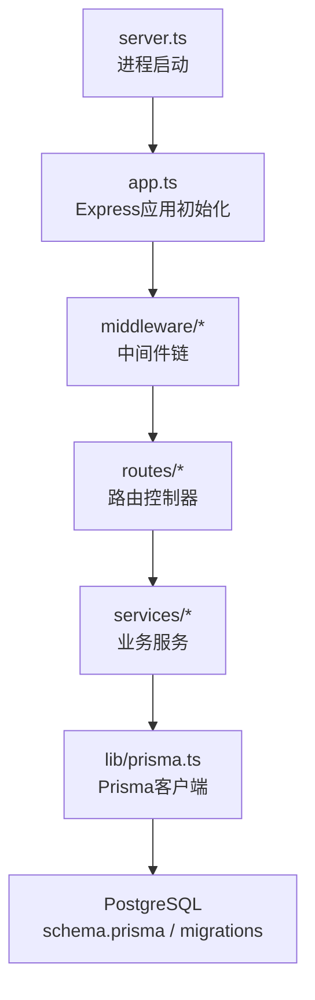
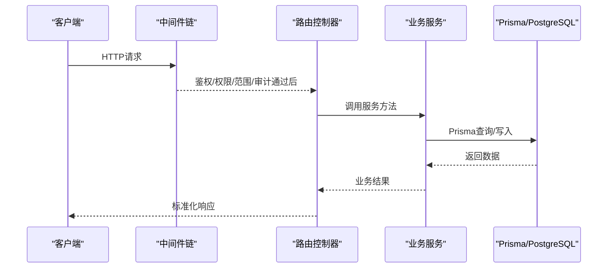
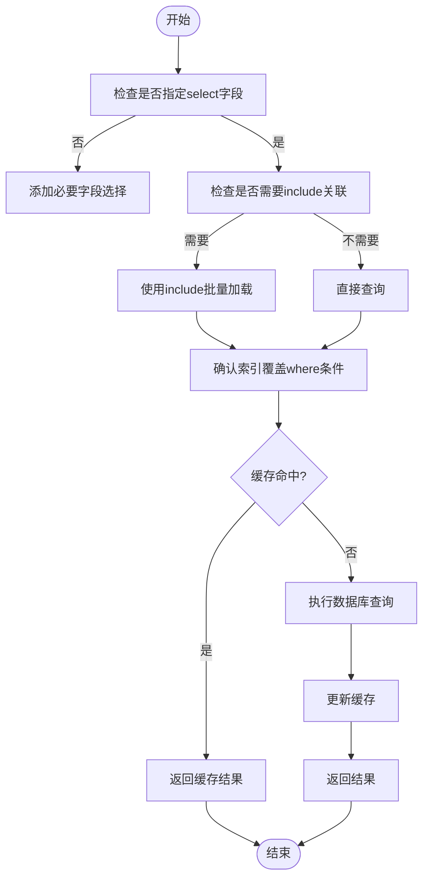
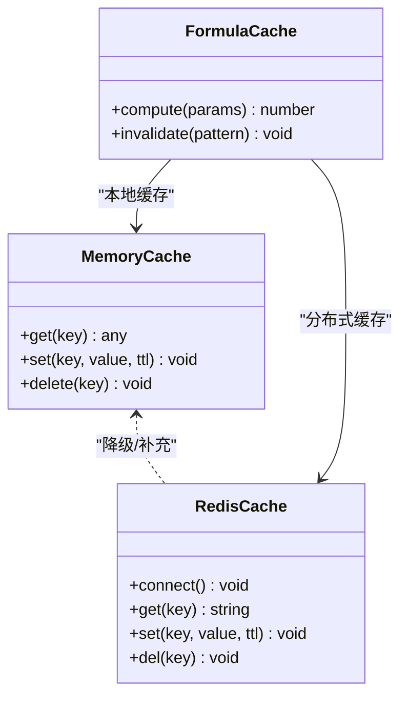
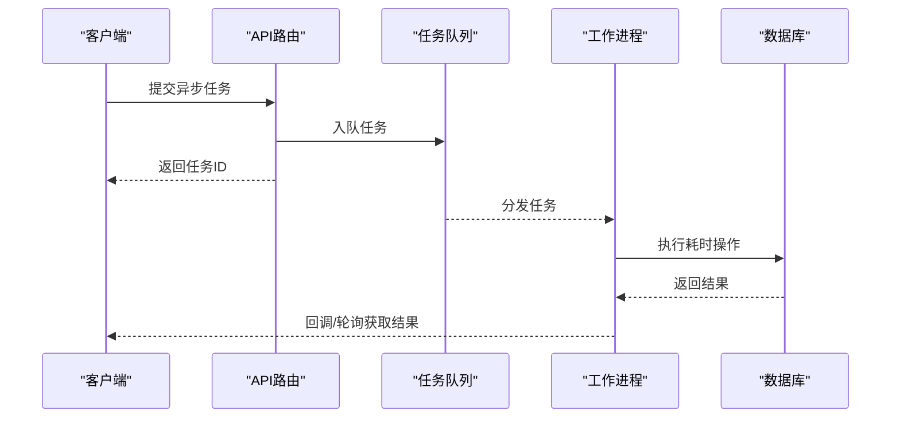
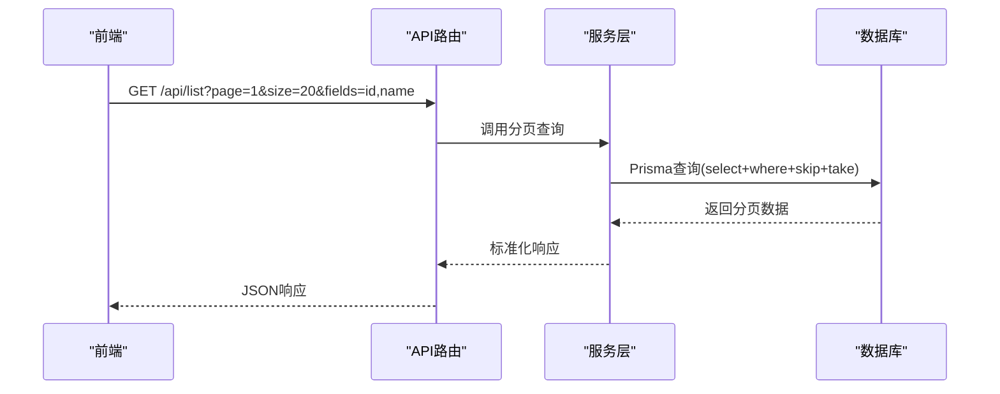
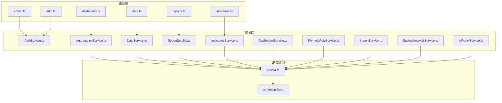

# 后端性能优化

<cite>
**本文引用的文件**   
- [server.ts](file://server/server.ts)
- [app.ts](file://server/src/app.ts)
- [env.ts](file://server/src/config/env.ts)
- [prisma.ts](file://server/src/lib/prisma.ts)
- [schema.prisma](file://server/prisma/schema.prisma)
- [20260722121714_init/migration.sql](file://server/prisma/migrations/20260722121714_init/migration.sql)
- [20260722142144_add_formula_rule/migration.sql](file://server/prisma/migrations/20260722142144_add_formula_rule/migration.sql)
- [20260723120000_add_subject_analysis/migration.sql](file://server/prisma/migrations/20260723120000_add_subject_analysis/migration.sql)
- [20260724120000_remove_business_unit_org_scope/migration.sql](file://server/prisma/migrations/20260724120000_remove_business_unit_org_scope/migration.sql)
- [auth.ts](file://server/src/middleware/auth.ts)
- [permission.ts](file://server/src/middleware/permission.ts)
- [scope.ts](file://server/src/middleware/scope.ts)
- [soft-delete.ts](file://server/src/middleware/soft-delete.ts)
- [audit.ts](file://server/src/middleware/audit.ts)
- [rate-limit.ts](file://server/src/middleware/rate-limit.ts)
- [ai-rate-limit.ts](file://server/src/middleware/ai-rate-limit.ts)
- [error-handler.ts](file://server/src/middleware/error-handler.ts)
- [helmet.ts](file://server/src/middleware/helmet.ts)
- [cors.ts](file://server/src/middleware/cors.ts)
- [trace-id.ts](file://server/src/middleware/trace-id.ts)
- [async-handler.ts](file://server/src/lib/async-handler.ts)
- [response.ts](file://server/src/lib/response.ts)
- [formula.ts](file://server/src/lib/formula.ts)
- [metric-values.ts](file://server/src/lib/metric-values.ts)
- [AuthService.ts](file://server/src/services/AuthService.ts)
- [AggregationService.ts](file://server/src/services/AggregationService.ts)
- [DataService.ts](file://server/src/services/DataService.ts)
- [ReportService.ts](file://server/src/services/ReportService.ts)
- [IndicatorsService.ts](file://server/src/services/IndicatorsService.ts)
- [DashboardService.ts](file://server/src/services/DashboardService.ts)
- [FormulaRuleService.ts](file://server/src/services/FormulaRuleService.ts)
- [ImportService.ts](file://server/src/services/ImportService.ts)
- [SubjectAnalysisService.ts](file://server/src/services/SubjectAnalysisService.ts)
- [AIProxyService.ts](file://server/src/services/AIProxyService.ts)
- [admin.ts](file://server/src/routes/admin.ts)
- [auth.ts](file://server/src/routes/auth.ts)
- [dashboard.ts](file://server/src/routes/dashboard.ts)
- [data.ts](file://server/src/routes/data.ts)
- [indicators.ts](file://server/src/routes/indicators.ts)
- [reports.ts](file://server/src/routes/reports.ts)
- [performance.md](file://docs/references/performance.md)
</cite>

## 目录
1. [简介](#简介)
2. [项目结构](#项目结构)
3. [核心组件](#核心组件)
4. [架构总览](#架构总览)
5. [详细组件分析](#详细组件分析)
6. [依赖关系分析](#依赖关系分析)
7. [性能考量](#性能考量)
8. [故障排查指南](#故障排查指南)
9. [结论](#结论)
10. [附录](#附录)

## 简介
本文件面向FY200项目后端性能优化，聚焦数据库查询优化（Prisma、索引设计、N+1问题）、缓存策略（内存缓存、Redis、公式计算结果缓存）、异步处理（任务队列、并发控制、限流保护）、中间件链优化（请求顺序、响应时间监控、内存泄漏防护）、API响应优化（分页、字段选择、批量操作）以及服务器资源管理（连接池、内存与GC调优）。内容基于仓库现有实现与文档进行系统化梳理，并提供可落地的优化建议。

## 项目结构
后端采用Express + Prisma + PostgreSQL技术栈，服务启动入口位于server.ts，应用初始化在app.ts中完成，中间件按固定顺序装配，路由层按领域划分，服务层封装业务逻辑，数据访问通过Prisma客户端。

**图示来源** 
- [server.ts](file://server/server.ts)
- [app.ts](file://server/src/app.ts)
- [prisma.ts](file://server/src/lib/prisma.ts)
- [schema.prisma](file://server/prisma/schema.prisma)

**章节来源**
- [server.ts](file://server/server.ts)
- [app.ts](file://server/src/app.ts)

## 核心组件
- 中间件链：helmet → cors → express.json → rate-limit → auth(JWT+黑名单) → permission(默认拒绝) → scope(Prisma扩展) → softDelete → audit → Service → Prisma → PostgreSQL
- 服务层：认证、聚合计算、数据导入导出、报表生成、指标分析、看板聚合、公式规则校验、AI代理等
- 数据访问：Prisma客户端统一配置，迁移脚本维护数据库结构
- 工具库：异步处理器、响应包装、公式解析、指标值计算、脱敏与审计等

**章节来源**
- [app.ts](file://server/src/app.ts)
- [auth.ts](file://server/src/middleware/auth.ts)
- [permission.ts](file://server/src/middleware/permission.ts)
- [scope.ts](file://server/src/middleware/scope.ts)
- [soft-delete.ts](file://server/src/middleware/soft-delete.ts)
- [audit.ts](file://server/src/middleware/audit.ts)
- [rate-limit.ts](file://server/src/middleware/rate-limit.ts)
- [ai-rate-limit.ts](file://server/src/middleware/ai-rate-limit.ts)
- [error-handler.ts](file://server/src/middleware/error-handler.ts)
- [helmet.ts](file://server/src/middleware/helmet.ts)
- [cors.ts](file://server/src/middleware/cors.ts)
- [trace-id.ts](file://server/src/middleware/trace-id.ts)
- [async-handler.ts](file://server/src/lib/async-handler.ts)
- [response.ts](file://server/src/lib/response.ts)
- [formula.ts](file://server/src/lib/formula.ts)
- [metric-values.ts](file://server/src/lib/metric-values.ts)

## 架构总览
下图展示从HTTP请求到数据库响应的完整链路，体现中间件顺序、服务调用与数据访问路径。

**图示来源** 
- [app.ts](file://server/src/app.ts)
- [auth.ts](file://server/src/middleware/auth.ts)
- [permission.ts](file://server/src/middleware/permission.ts)
- [scope.ts](file://server/src/middleware/scope.ts)
- [audit.ts](file://server/src/middleware/audit.ts)
- [error-handler.ts](file://server/src/middleware/error-handler.ts)
- [response.ts](file://server/src/lib/response.ts)

## 详细组件分析

### 数据库查询优化（Prisma、索引、N+1）
- Prisma查询优化要点
  - 使用select指定字段，避免拉取冗余列
  - 使用include按需关联加载，避免过度join
  - 对高频条件字段建立索引，结合where过滤提升命中率
  - 使用事务减少多次往返，保证一致性
- 索引设计建议
  - 针对外键、常用过滤条件（如公司、期间、科目树节点）建立B-tree索引
  - 复合索引覆盖常见查询组合（如company_id + period + subject_id）
  - 定期分析慢查询并调整索引，避免写放大
- N+1问题解决方案
  - 在服务层使用Prisma的include或自定义batch加载，合并子查询
  - 对列表接口采用分页+预加载，避免逐条关联查询
  - 对热点数据引入缓存，降低重复查询压力

**图示来源** 
- [prisma.ts](file://server/src/lib/prisma.ts)
- [schema.prisma](file://server/prisma/schema.prisma)
- [20260722121714_init/migration.sql](file://server/prisma/migrations/20260722121714_init/migration.sql)
- [20260722142144_add_formula_rule/migration.sql](file://server/prisma/migrations/20260722142144_add_formula_rule/migration.sql)
- [20260723120000_add_subject_analysis/migration.sql](file://server/prisma/migrations/20260723120000_add_subject_analysis/migration.sql)
- [20260724120000_remove_business_unit_org_scope/migration.sql](file://server/prisma/migrations/20260724120000_remove_business_unit_org_scope/migration.sql)

**章节来源**
- [prisma.ts](file://server/src/lib/prisma.ts)
- [schema.prisma](file://server/prisma/schema.prisma)
- [20260722121714_init/migration.sql](file://server/prisma/migrations/20260722121714_init/migration.sql)
- [20260722142144_add_formula_rule/migration.sql](file://server/prisma/migrations/20260722142144_add_formula_rule/migration.sql)
- [20260723120000_add_subject_analysis/migration.sql](file://server/prisma/migrations/20260723120000_add_subject_analysis/migration.sql)
- [20260724120000_remove_business_unit_org_scope/migration.sql](file://server/prisma/migrations/20260724120000_remove_business_unit_org_scope/migration.sql)

### 缓存策略（内存、Redis、公式计算结果）
- 内存缓存
  - 适用于小体积、短TTL的热点数据（如字典、配置）
  - 注意内存上限与淘汰策略，避免OOM
- Redis缓存
  - 用于跨实例共享的热点数据（如用户会话、权限、指标快照）
  - 设置合理的过期时间与序列化格式，避免大对象
- 公式计算结果缓存
  - 对相同参数组合的计算结果进行缓存，减少CPU消耗
  - 使用稳定的键生成策略（如参数哈希），确保一致性

**图示来源** 
- [formula.ts](file://server/src/lib/formula.ts)
- [metric-values.ts](file://server/src/lib/metric-values.ts)

**章节来源**
- [formula.ts](file://server/src/lib/formula.ts)
- [metric-values.ts](file://server/src/lib/metric-values.ts)

### 异步处理机制（任务队列、并发控制、限流）
- 任务队列
  - 将耗时操作（如Excel导入、报表生成）放入队列异步执行
  - 使用持久化队列（如Redis-backed队列）保障可靠性
- 并发控制
  - 对CPU密集型任务限制并发度，避免阻塞事件循环
  - 对IO密集型任务使用连接池与超时控制
- 限流保护
  - 全局与API级别限流，防止滥用与雪崩
  - AI接口单独限流，保护外部LLM服务

**图示来源** 
- [rate-limit.ts](file://server/src/middleware/rate-limit.ts)
- [ai-rate-limit.ts](file://server/src/middleware/ai-rate-limit.ts)

**章节来源**
- [rate-limit.ts](file://server/src/middleware/rate-limit.ts)
- [ai-rate-limit.ts](file://server/src/middleware/ai-rate-limit.ts)

### 中间件链优化（顺序、监控、内存泄漏防护）
- 请求处理顺序
  - helmet → cors → express.json → rate-limit → auth → permission → scope → softDelete → audit → Service → Prisma → PostgreSQL
- 响应时间监控
  - 在每个中间件记录起止时间，汇总到日志或指标系统
- 内存泄漏防护
  - 避免在中间件中持有大对象引用
  - 及时释放临时资源，使用stream处理大文件

**图示来源** 
- [app.ts](file://server/src/app.ts)
- [helmet.ts](file://server/src/middleware/helmet.ts)
- [cors.ts](file://server/src/middleware/cors.ts)
- [rate-limit.ts](file://server/src/middleware/rate-limit.ts)
- [auth.ts](file://server/src/middleware/auth.ts)
- [permission.ts](file://server/src/middleware/permission.ts)
- [scope.ts](file://server/src/middleware/scope.ts)
- [soft-delete.ts](file://server/src/middleware/soft-delete.ts)
- [audit.ts](file://server/src/middleware/audit.ts)

**章节来源**
- [app.ts](file://server/src/app.ts)
- [helmet.ts](file://server/src/middleware/helmet.ts)
- [cors.ts](file://server/src/middleware/cors.ts)
- [rate-limit.ts](file://server/src/middleware/rate-limit.ts)
- [auth.ts](file://server/src/middleware/auth.ts)
- [permission.ts](file://server/src/middleware/permission.ts)
- [scope.ts](file://server/src/middleware/scope.ts)
- [soft-delete.ts](file://server/src/middleware/soft-delete.ts)
- [audit.ts](file://server/src/middleware/audit.ts)

### API响应优化（分页、字段选择、批量操作）
- 数据分页
  - 所有列表接口支持page/size参数，避免一次性返回大量数据
- 字段选择
  - 前端传递fields参数，后端动态构建select，减少网络传输
- 批量操作
  - 提供批量创建/更新接口，减少往返次数
  - 使用事务保证批量操作的原子性

**图示来源** 
- [response.ts](file://server/src/lib/response.ts)
- [async-handler.ts](file://server/src/lib/async-handler.ts)

**章节来源**
- [response.ts](file://server/src/lib/response.ts)
- [async-handler.ts](file://server/src/lib/async-handler.ts)

### 服务器资源管理（连接池、内存、GC调优）
- 连接池配置
  - Prisma连接池大小根据CPU核数与负载调整，避免过多连接导致上下文切换
  - 设置连接超时与空闲回收，防止连接泄露
- 内存使用优化
  - 避免在事件循环中创建大对象，使用流式处理
  - 定期触发垃圾回收，监控堆内存增长
- GC调优
  - 根据Node.js版本选择合适的GC策略（如--max-old-space-size）
  - 使用性能分析工具定位内存热点

**章节来源**
- [prisma.ts](file://server/src/lib/prisma.ts)
- [env.ts](file://server/src/config/env.ts)

## 依赖关系分析
服务层与路由、中间件、数据访问层的依赖关系如下：

**图示来源** 
- [admin.ts](file://server/src/routes/admin.ts)
- [auth.ts](file://server/src/routes/auth.ts)
- [dashboard.ts](file://server/src/routes/dashboard.ts)
- [data.ts](file://server/src/routes/data.ts)
- [indicators.ts](file://server/src/routes/indicators.ts)
- [reports.ts](file://server/src/routes/reports.ts)
- [AuthService.ts](file://server/src/services/AuthService.ts)
- [AggregationService.ts](file://server/src/services/AggregationService.ts)
- [DataService.ts](file://server/src/services/DataService.ts)
- [ReportService.ts](file://server/src/services/ReportService.ts)
- [IndicatorsService.ts](file://server/src/services/IndicatorsService.ts)
- [DashboardService.ts](file://server/src/services/DashboardService.ts)
- [FormulaRuleService.ts](file://server/src/services/FormulaRuleService.ts)
- [ImportService.ts](file://server/src/services/ImportService.ts)
- [SubjectAnalysisService.ts](file://server/src/services/SubjectAnalysisService.ts)
- [AIProxyService.ts](file://server/src/services/AIProxyService.ts)
- [prisma.ts](file://server/src/lib/prisma.ts)
- [schema.prisma](file://server/prisma/schema.prisma)

**章节来源**
- [admin.ts](file://server/src/routes/admin.ts)
- [auth.ts](file://server/src/routes/auth.ts)
- [dashboard.ts](file://server/src/routes/dashboard.ts)
- [data.ts](file://server/src/routes/data.ts)
- [indicators.ts](file://server/src/routes/indicators.ts)
- [reports.ts](file://server/src/routes/reports.ts)
- [AuthService.ts](file://server/src/services/AuthService.ts)
- [AggregationService.ts](file://server/src/services/AggregationService.ts)
- [DataService.ts](file://server/src/services/DataService.ts)
- [ReportService.ts](file://server/src/services/ReportService.ts)
- [IndicatorsService.ts](file://server/src/services/IndicatorsService.ts)
- [DashboardService.ts](file://server/src/services/DashboardService.ts)
- [FormulaRuleService.ts](file://server/src/services/FormulaRuleService.ts)
- [ImportService.ts](file://server/src/services/ImportService.ts)
- [SubjectAnalysisService.ts](file://server/src/services/SubjectAnalysisService.ts)
- [AIProxyService.ts](file://server/src/services/AIProxyService.ts)
- [prisma.ts](file://server/src/lib/prisma.ts)
- [schema.prisma](file://server/prisma/schema.prisma)

## 性能考量
- 数据库层面
  - 合理使用索引，避免全表扫描
  - 使用EXPLAIN ANALYZE分析慢查询
  - 分区表与归档策略应对历史数据增长
- 缓存层面
  - 多级缓存（内存+Redis）提升命中率
  - 缓存穿透、击穿、雪崩防护
- 异步层面
  - 任务队列削峰填谷
  - 并发控制避免资源争用
- 中间件层面
  - 精简中间件逻辑，避免阻塞
  - 统一错误处理与监控埋点
- API层面
  - 分页与字段选择减少数据传输
  - 批量操作降低RTT
- 服务器层面
  - 连接池大小与超时配置
  - Node.js内存与GC参数调优

[本节为通用指导，不直接分析具体文件]

## 故障排查指南
- 常见问题
  - 数据库连接池耗尽：检查连接泄漏与超时配置
  - 内存泄漏：使用heapdump与Chrome DevTools定位
  - 慢查询：启用慢查询日志与索引分析
  - 缓存失效：检查键空间与TTL策略
- 监控与诊断
  - 中间件耗时统计
  - 错误率与异常堆栈追踪
  - 资源使用监控（CPU、内存、磁盘、网络）

**章节来源**
- [error-handler.ts](file://server/src/middleware/error-handler.ts)
- [trace-id.ts](file://server/src/middleware/trace-id.ts)

## 结论
通过对Prisma查询、索引设计、缓存策略、异步处理、中间件链、API响应与服务器资源的系统性优化，可显著提升FY200后端的吞吐与稳定性。建议持续监控关键指标，结合压测与线上反馈迭代优化。

[本节为总结性内容，不直接分析具体文件]

## 附录
- 参考文档
  - [performance.md](file://docs/references/performance.md)

**章节来源**
- [performance.md](file://docs/references/performance.md)