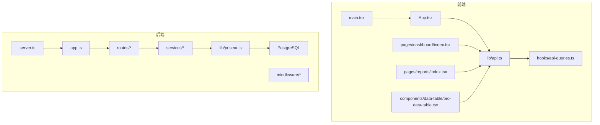
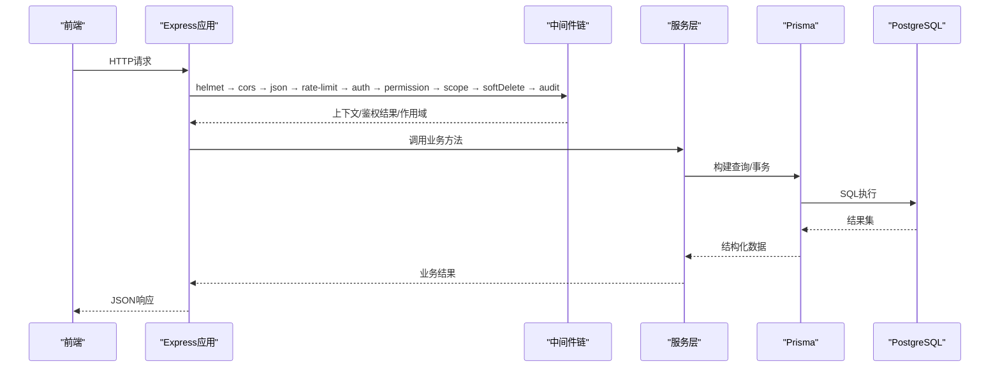
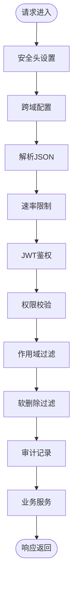
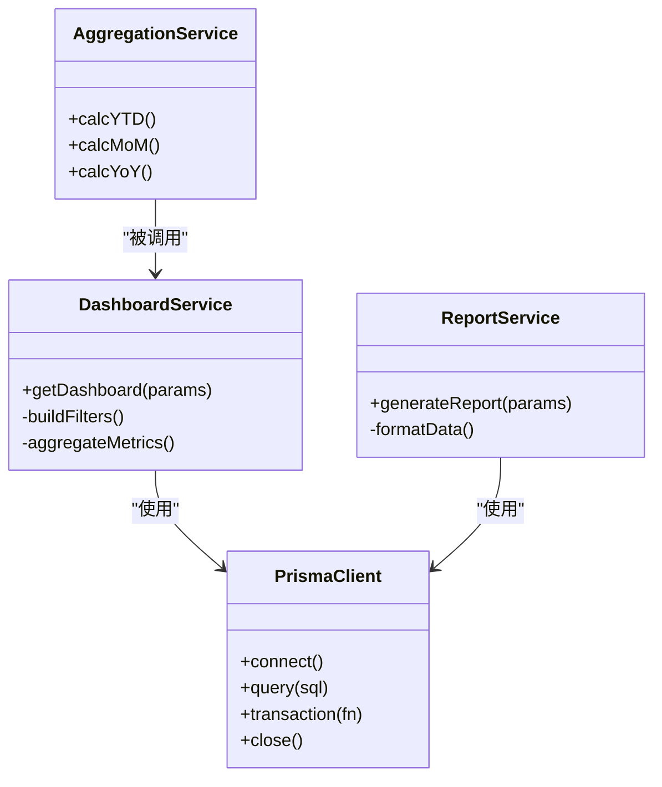
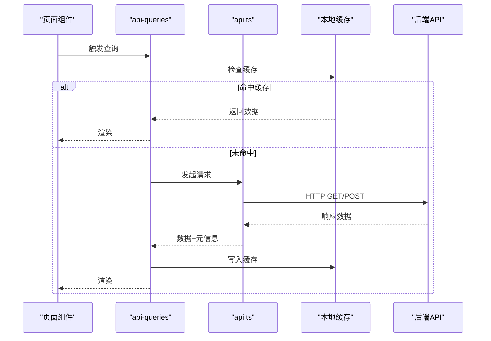
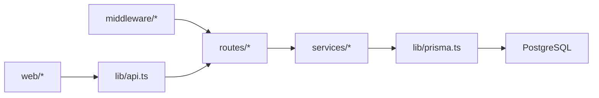

# 性能优化指南

<cite>
**本文引用的文件**   
- [server/src/app.ts](file://server/src/app.ts)
- [server/src/server.ts](file://server/src/server.ts)
- [server/src/middleware/helmet.ts](file://server/src/middleware/helmet.ts)
- [server/src/middleware/cors.ts](file://server/src/middleware/cors.ts)
- [server/src/middleware/rate-limit.ts](file://server/src/middleware/rate-limit.ts)
- [server/src/middleware/auth.ts](file://server/src/middleware/auth.ts)
- [server/src/middleware/permission.ts](file://server/src/middleware/permission.ts)
- [server/src/middleware/scope.ts](file://server/src/middleware/scope.ts)
- [server/src/middleware/soft-delete.ts](file://server/src/middleware/soft-delete.ts)
- [server/src/middleware/audit.ts](file://server/src/middleware/audit.ts)
- [server/src/middleware/error-handler.ts](file://server/src/middleware/error-handler.ts)
- [server/src/lib/prisma.ts](file://server/src/lib/prisma.ts)
- [server/src/lib/logger.ts](file://server/src/lib/logger.ts)
- [server/src/lib/errors.ts](file://server/src/lib/errors.ts)
- [server/src/lib/response.ts](file://server/src/lib/response.ts)
- [server/src/lib/async-handler.ts](file://server/src/lib/async-handler.ts)
- [server/src/routes/dashboard.ts](file://server/src/routes/dashboard.ts)
- [server/src/routes/reports.ts](file://server/src/routes/reports.ts)
- [server/src/services/DashboardService.ts](file://server/src/services/DashboardService.ts)
- [server/src/services/ReportService.ts](file://server/src/services/ReportService.ts)
- [server/src/services/AggregationService.ts](file://server/src/services/AggregationService.ts)
- [server/src/services/AIProxyService.ts](file://server/src/services/AIProxyService.ts)
- [server/prisma/schema.prisma](file://server/prisma/schema.prisma)
- [web/vite.config.ts](file://web/vite.config.ts)
- [web/src/App.tsx](file://web/src/App.tsx)
- [web/src/main.tsx](file://web/src/main.tsx)
- [web/src/hooks/api-queries.ts](file://web/src/hooks/api-queries.ts)
- [web/src/lib/api.ts](file://web/src/lib/api.ts)
- [web/src/components/data-table/pro-data-table.tsx](file://web/src/components/data-table/pro-data-table.tsx)
- [web/src/components/data-table/pagination.tsx](file://web/src/components/data-table/pagination.tsx)
- [web/src/pages/dashboard/index.tsx](file://web/src/pages/dashboard/index.tsx)
- [web/src/pages/reports/index.tsx](file://web/src/pages/reports/index.tsx)
- [docs/references/performance.md](file://docs/references/performance.md)
- [docs/references/backend.md](file://docs/references/backend.md)
- [docs/references/frontend.md](file://docs/references/frontend.md)
- [docs/references/observability.md](file://docs/references/observability.md)
</cite>

## 目录
1. [引言](#引言)
2. [项目结构](#项目结构)
3. [核心组件](#核心组件)
4. [架构总览](#架构总览)
5. [详细组件分析](#详细组件分析)
6. [依赖关系分析](#依赖关系分析)
7. [性能考量](#性能考量)
8. [故障排查指南](#故障排查指南)
9. [结论](#结论)
10. [附录](#附录)

## 引言
本指南面向FY200项目的后端与前端团队，聚焦“Excel进、看板/报表出”的财年经营数据分析平台。目标是在保证数据口径一致性的前提下，系统性提升系统吞吐、降低延迟、减少资源占用，并建立可观测性与回归检测能力。内容覆盖数据库查询优化、缓存策略、异步处理、内存管理；前端渲染优化、网络请求优化、资源加载优化；APM与浏览器/服务器监控；索引与查询调优；API响应时间与并发能力提升；打包优化与CDN部署；基准测试与回归检测。

## 项目结构
- 后端（Express + Prisma + PostgreSQL）：中间件链严格顺序执行，服务层封装业务逻辑，路由仅做参数校验与转发。
- 前端（Vite + React）：按页面与组件拆分，使用统一API客户端与hooks进行数据获取与状态管理。
- 文档与参考：包含前后端与可观测性参考文档，作为性能优化的依据与补充。

图表来源
- [server/src/server.ts](file://server/src/server.ts)
- [server/src/app.ts](file://server/src/app.ts)
- [web/src/main.tsx](file://web/src/main.tsx)
- [web/src/App.tsx](file://web/src/App.tsx)
- [web/src/lib/api.ts](file://web/src/lib/api.ts)
- [web/src/hooks/api-queries.ts](file://web/src/hooks/api-queries.ts)
- [web/src/pages/dashboard/index.tsx](file://web/src/pages/dashboard/index.tsx)
- [web/src/pages/reports/index.tsx](file://web/src/pages/reports/index.tsx)
- [web/src/components/data-table/pro-data-table.tsx](file://web/src/components/data-table/pro-data-table.tsx)

章节来源
- [docs/references/backend.md](file://docs/references/backend.md)
- [docs/references/frontend.md](file://docs/references/frontend.md)

## 核心组件
- 中间件链：安全与限流、鉴权与权限、作用域过滤、软删除、审计、错误处理。
- 服务层：仪表盘聚合、报表生成、指标计算、AI代理。
- 数据访问：Prisma连接池与事务、分页与投影。
- 前端：统一API客户端、React Query风格hooks、专业数据表格与分页。

章节来源
- [server/src/middleware/rate-limit.ts](file://server/src/middleware/rate-limit.ts)
- [server/src/middleware/auth.ts](file://server/src/middleware/auth.ts)
- [server/src/middleware/permission.ts](file://server/src/middleware/permission.ts)
- [server/src/middleware/scope.ts](file://server/src/middleware/scope.ts)
- [server/src/middleware/soft-delete.ts](file://server/src/middleware/soft-delete.ts)
- [server/src/middleware/audit.ts](file://server/src/middleware/audit.ts)
- [server/src/middleware/error-handler.ts](file://server/src/middleware/error-handler.ts)
- [server/src/lib/prisma.ts](file://server/src/lib/prisma.ts)
- [server/src/services/DashboardService.ts](file://server/src/services/DashboardService.ts)
- [server/src/services/ReportService.ts](file://server/src/services/ReportService.ts)
- [server/src/services/AggregationService.ts](file://server/src/services/AggregationService.ts)
- [server/src/services/AIProxyService.ts](file://server/src/services/AIProxyService.ts)
- [web/src/lib/api.ts](file://web/src/lib/api.ts)
- [web/src/hooks/api-queries.ts](file://web/src/hooks/api-queries.ts)
- [web/src/components/data-table/pro-data-table.tsx](file://web/src/components/data-table/pro-data-table.tsx)

## 架构总览
后端采用严格的中间件执行链，确保安全性与可观测性；服务层负责复杂计算与外部调用；Prisma作为ORM对接PostgreSQL。前端通过统一的API客户端与hooks管理数据流，表格组件支持服务端分页与筛选。

图表来源
- [server/src/app.ts](file://server/src/app.ts)
- [server/src/middleware/rate-limit.ts](file://server/src/middleware/rate-limit.ts)
- [server/src/middleware/auth.ts](file://server/src/middleware/auth.ts)
- [server/src/middleware/permission.ts](file://server/src/middleware/permission.ts)
- [server/src/middleware/scope.ts](file://server/src/middleware/scope.ts)
- [server/src/middleware/soft-delete.ts](file://server/src/middleware/soft-delete.ts)
- [server/src/middleware/audit.ts](file://server/src/middleware/audit.ts)
- [server/src/lib/prisma.ts](file://server/src/lib/prisma.ts)

## 详细组件分析

### 后端中间件链与性能要点
- 限流与鉴权：在早期阶段拒绝非法或超限请求，减少后续CPU与IO开销。
- 权限与作用域：基于Prisma扩展注入条件，避免全表扫描与不必要的数据返回。
- 软删除与审计：仅在必要时启用，避免对热点路径造成额外写入。
- 错误处理：统一异常捕获与降级，防止未处理异常导致线程阻塞。

图表来源
- [server/src/middleware/helmet.ts](file://server/src/middleware/helmet.ts)
- [server/src/middleware/cors.ts](file://server/src/middleware/cors.ts)
- [server/src/middleware/rate-limit.ts](file://server/src/middleware/rate-limit.ts)
- [server/src/middleware/auth.ts](file://server/src/middleware/auth.ts)
- [server/src/middleware/permission.ts](file://server/src/middleware/permission.ts)
- [server/src/middleware/scope.ts](file://server/src/middleware/scope.ts)
- [server/src/middleware/soft-delete.ts](file://server/src/middleware/soft-delete.ts)
- [server/src/middleware/audit.ts](file://server/src/middleware/audit.ts)

章节来源
- [server/src/middleware/rate-limit.ts](file://server/src/middleware/rate-limit.ts)
- [server/src/middleware/auth.ts](file://server/src/middleware/auth.ts)
- [server/src/middleware/permission.ts](file://server/src/middleware/permission.ts)
- [server/src/middleware/scope.ts](file://server/src/middleware/scope.ts)
- [server/src/middleware/soft-delete.ts](file://server/src/middleware/soft-delete.ts)
- [server/src/middleware/audit.ts](file://server/src/middleware/audit.ts)

### 数据库访问与查询优化
- 连接池与事务：合理配置连接数，批量操作使用事务减少往返。
- 投影与分页：只选择必要字段，使用skip/take实现分页，避免大对象传输。
- 索引设计：为高频过滤与排序列建立复合索引，避免回表。
- 慢查询治理：结合日志与统计视图定位热点SQL，定期分析执行计划。

图表来源
- [server/src/lib/prisma.ts](file://server/src/lib/prisma.ts)
- [server/src/services/DashboardService.ts](file://server/src/services/DashboardService.ts)
- [server/src/services/ReportService.ts](file://server/src/services/ReportService.ts)
- [server/src/services/AggregationService.ts](file://server/src/services/AggregationService.ts)

章节来源
- [server/src/lib/prisma.ts](file://server/src/lib/prisma.ts)
- [server/prisma/schema.prisma](file://server/prisma/schema.prisma)

### 缓存策略与异步处理
- 多级缓存：热点读（如字典、维度树）使用内存缓存；跨进程共享使用Redis。
- 失效策略：TTL+版本号双保险，写后更新缓存，避免脏读。
- 异步任务：导入、报表导出、AI分析等耗时任务放入队列，前端轮询或SSE推送。
- 背压与限流：对外部AI接口与大数据导出进行限流与退避重试。

章节来源
- [server/src/services/AIProxyService.ts](file://server/src/services/AIProxyService.ts)
- [server/src/services/ImportService.ts](file://server/src/services/ImportService.ts)

### 前端渲染与网络优化
- 组件渲染：列表虚拟化、懒加载、memo化重渲染；骨架屏替代长时间空白。
- 网络请求：合并请求、去抖与节流、失败重试与超时控制、HTTP缓存头利用。
- 资源加载：代码分割、按需加载、图片压缩与WebP、字体子集化。
- 表格优化：服务端分页、列宽自适应、虚拟滚动。

图表来源
- [web/src/hooks/api-queries.ts](file://web/src/hooks/api-queries.ts)
- [web/src/lib/api.ts](file://web/src/lib/api.ts)
- [web/src/components/data-table/pro-data-table.tsx](file://web/src/components/data-table/pro-data-table.tsx)
- [web/src/components/data-table/pagination.tsx](file://web/src/components/data-table/pagination.tsx)

章节来源
- [web/src/hooks/api-queries.ts](file://web/src/hooks/api-queries.ts)
- [web/src/lib/api.ts](file://web/src/lib/api.ts)
- [web/src/components/data-table/pro-data-table.tsx](file://web/src/components/data-table/pro-data-table.tsx)
- [web/src/components/data-table/pagination.tsx](file://web/src/components/data-table/pagination.tsx)

### AI代理与SSE流式
- 双管道：polish用于文本脱敏与还原；analyze用于结构化计算与生成。
- 流式输出：SSE逐步返回，前端增量渲染，降低首屏等待。
- 安全边界：白名单算子与输入校验，禁止任意代码执行。

章节来源
- [server/src/services/AIProxyService.ts](file://server/src/services/AIProxyService.ts)

## 依赖关系分析
- 模块耦合：路由→服务→Prisma→数据库，中间件横切关注点清晰。
- 外部依赖：JWT鉴权、DeepSeek API、PostgreSQL连接池。
- 潜在循环：服务间调用应避免循环依赖，通过接口抽象解耦。

图表来源
- [server/src/app.ts](file://server/src/app.ts)
- [server/src/lib/prisma.ts](file://server/src/lib/prisma.ts)
- [web/src/lib/api.ts](file://web/src/lib/api.ts)

章节来源
- [server/src/app.ts](file://server/src/app.ts)
- [server/src/lib/prisma.ts](file://server/src/lib/prisma.ts)
- [web/src/lib/api.ts](file://web/src/lib/api.ts)

## 性能考量

### 后端性能优化
- 数据库查询优化
  - 使用投影与分页，避免SELECT *与大对象传输。
  - 为高频过滤与排序列建立复合索引，避免临时表与文件排序。
  - 将复杂聚合下推到数据库层，减少Node.js内存压力。
- 缓存策略
  - 热点读数据使用内存缓存（TTL），跨进程共享使用Redis。
  - 写后更新缓存，版本号+TTL双重失效保障一致性。
- 异步处理
  - 导入、报表导出、AI分析等耗时任务入队，前端轮询或SSE推送。
  - 对外部API进行限流与指数退避重试。
- 内存管理
  - 避免大对象常驻内存，及时释放引用，使用流式处理大文件。
  - 监控堆内存与GC频率，调整Node.js启动参数。

章节来源
- [server/src/lib/prisma.ts](file://server/src/lib/prisma.ts)
- [server/src/services/DashboardService.ts](file://server/src/services/DashboardService.ts)
- [server/src/services/ReportService.ts](file://server/src/services/ReportService.ts)
- [server/src/services/AIProxyService.ts](file://server/src/services/AIProxyService.ts)

### 前端性能优化
- 组件渲染优化
  - 列表虚拟化、懒加载、React.memo与useMemo/useCallback减少重渲染。
  - 骨架屏与占位图提升感知性能。
- 网络请求优化
  - 请求合并、去抖与节流、失败重试与超时控制。
  - 合理使用HTTP缓存头（ETag/Last-Modified）。
- 资源加载优化
  - 代码分割、按需加载、图片压缩与WebP、字体子集化。
  - CDN部署静态资源，开启Gzip/Brotli压缩。

章节来源
- [web/src/hooks/api-queries.ts](file://web/src/hooks/api-queries.ts)
- [web/src/lib/api.ts](file://web/src/lib/api.ts)
- [web/src/components/data-table/pro-data-table.tsx](file://web/src/components/data-table/pro-data-table.tsx)
- [web/vite.config.ts](file://web/vite.config.ts)

### 数据库索引优化与查询调优
- 索引设计原则
  - 选择性高的列优先建索引，复合索引遵循最左前缀原则。
  - 避免过多索引影响写入性能，定期评估无用索引。
- 查询调优方法
  - 使用EXPLAIN ANALYZE分析执行计划，关注Seq Scan与Index Scan。
  - 避免函数包裹过滤列，保持索引可用。
  - 分页使用游标或基于主键的范围查询，避免深分页。

章节来源
- [server/prisma/schema.prisma](file://server/prisma/schema.prisma)

### API响应时间优化与并发处理能力提升
- 响应时间优化
  - 缩短冷路径，预热热点数据；减少序列化开销。
  - 使用流式响应处理大结果集。
- 并发能力提升
  - 调整Node.js集群模式与Worker数量，匹配CPU核数。
  - 数据库连接池大小与最大并发请求匹配，避免连接耗尽。
  - 引入消息队列削峰填谷，保护下游服务。

章节来源
- [server/src/server.ts](file://server/src/server.ts)
- [server/src/lib/prisma.ts](file://server/src/lib/prisma.ts)

### 前端打包优化与CDN部署策略
- 打包优化
  - 代码分割与动态导入，减少首屏体积。
  - 启用Tree Shaking与压缩，移除死代码。
- CDN部署
  - 静态资源上CDN，开启缓存与压缩。
  - 版本化文件名，配合CI/CD自动化发布。

章节来源
- [web/vite.config.ts](file://web/vite.config.ts)

### 性能基准测试与回归检测方法
- 基准测试
  - 使用负载工具模拟并发场景，测量TPS、P95/P99延迟、错误率。
  - 建立关键路径基线（登录、看板加载、报表导出）。
- 回归检测
  - 在CI中集成性能测试，阈值超标阻断合并。
  - 结合APM与日志，持续监控回归趋势。

章节来源
- [docs/references/performance.md](file://docs/references/performance.md)

## 故障排查指南
- 常见症状
  - 高延迟：检查慢查询、锁竞争、外部API超时。
  - 内存泄漏：监控堆增长与GC频率，定位大对象持有。
  - 前端卡顿：检查重渲染与大图渲染，启用虚拟化。
- 排查步骤
  - 查看错误日志与追踪ID，定位问题链路。
  - 使用浏览器性能面板与Network面板分析前端瓶颈。
  - 使用数据库慢查询日志与执行计划分析SQL问题。
  - 使用APM工具（如APM探针）采集端到端耗时。

章节来源
- [server/src/middleware/error-handler.ts](file://server/src/middleware/error-handler.ts)
- [server/src/lib/logger.ts](file://server/src/lib/logger.ts)
- [docs/references/observability.md](file://docs/references/observability.md)

## 结论
通过系统化优化数据库查询、缓存、异步与内存管理，以及前端渲染、网络与资源加载，可显著提升FY200平台的性能与稳定性。结合APM与基准测试，建立持续的性能治理闭环，确保在高并发与大数据量场景下的用户体验与可靠性。

## 附录
- 参考文档
  - 后端参考：[backend.md](file://docs/references/backend.md)
  - 前端参考：[frontend.md](file://docs/references/frontend.md)
  - 可观测性参考：[observability.md](file://docs/references/observability.md)
  - 性能参考：[performance.md](file://docs/references/performance.md)