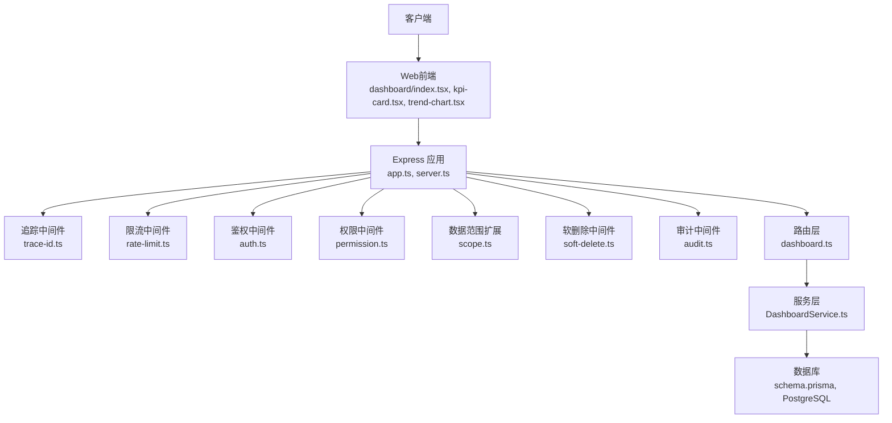
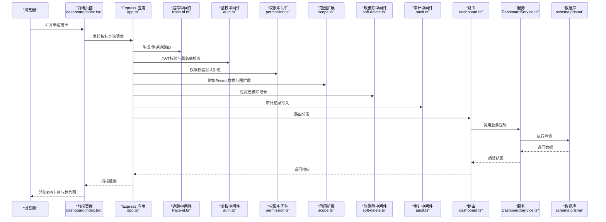
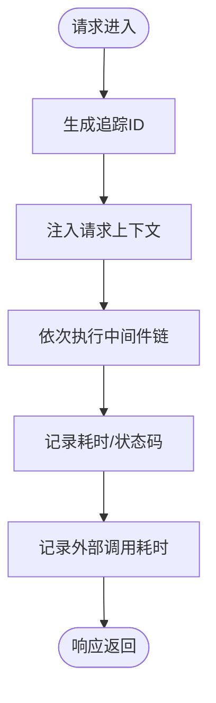
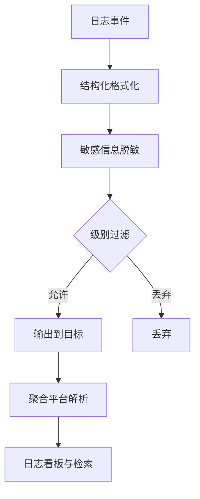
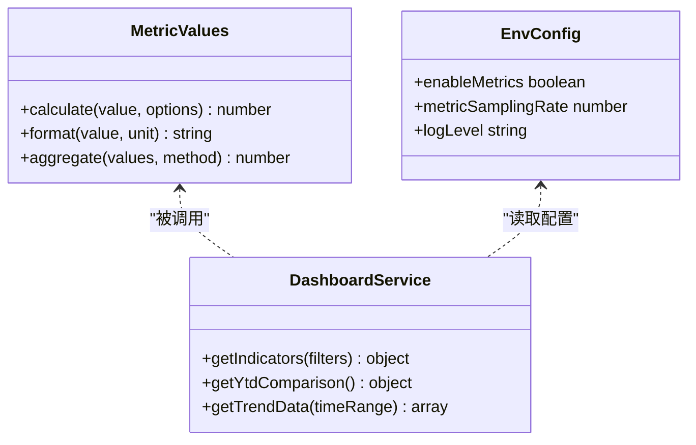
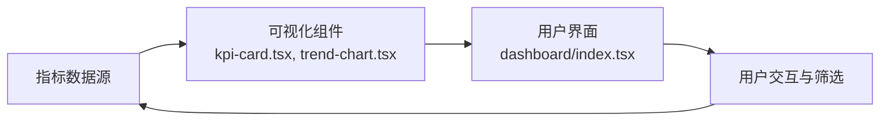
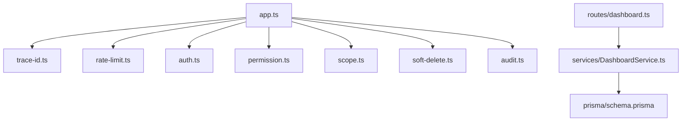

# 性能监控与分析

<cite>
**本文引用的文件**   
- [server/src/app.ts](file://server/src/app.ts)
- [server/src/server.ts](file://server/src/server.ts)
- [server/src/middleware/trace-id.ts](file://server/src/middleware/trace-id.ts)
- [server/src/middleware/error-handler.ts](file://server/src/middleware/error-handler.ts)
- [server/src/lib/logger.ts](file://server/src/lib/logger.ts)
- [server/src/lib/metric-values.ts](file://server/src/lib/metric-values.ts)
- [server/src/config/env.ts](file://server/src/config/env.ts)
- [server/src/middleware/rate-limit.ts](file://server/src/middleware/rate-limit.ts)
- [server/src/middleware/auth.ts](file://server/src/middleware/auth.ts)
- [server/src/middleware/permission.ts](file://server/src/middleware/permission.ts)
- [server/src/middleware/scope.ts](file://server/src/middleware/scope.ts)
- [server/src/middleware/soft-delete.ts](file://server/src/middleware/soft-delete.ts)
- [server/src/middleware/audit.ts](file://server/src/middleware/audit.ts)
- [server/src/routes/dashboard.ts](file://server/src/routes/dashboard.ts)
- [server/src/services/DashboardService.ts](file://server/src/services/DashboardService.ts)
- [server/prisma/schema.prisma](file://server/prisma/schema.prisma)
- [web/src/components/charts/kpi-card.tsx](file://web/src/components/charts/kpi-card.tsx)
- [web/src/components/charts/trend-chart.tsx](file://web/src/components/charts/trend-chart.tsx)
- [web/src/pages/dashboard/index.tsx](file://web/src/pages/dashboard/index.tsx)
- [web/src/lib/api.ts](file://web/src/lib/api.ts)
</cite>

## 目录
1. [引言](#引言)
2. [项目结构](#项目结构)
3. [核心组件](#核心组件)
4. [架构总览](#架构总览)
5. [详细组件分析](#详细组件分析)
6. [依赖关系分析](#依赖关系分析)
7. [性能考量](#性能考量)
8. [故障排查指南](#故障排查指南)
9. [结论](#结论)
10. [附录](#附录)

## 引言
本文件面向FY200项目的性能监控与分析，围绕APM工具集成、分布式追踪与链路追踪、日志系统优化、指标采集与展示、监控告警配置、性能分析工具使用以及实时监控仪表板搭建等主题展开。文档以代码级事实为依据，结合中间件执行链顺序与业务特性（安全公式解析、AI双管道、JWT轮转），给出可落地的实现建议与最佳实践，帮助读者快速建立从数据采集到可视化、告警的完整观测体系。

## 项目结构
后端采用Express 4 + Prisma 5 + PostgreSQL 15，前端为React/Vite应用。关键观测点包括：
- 请求生命周期：中间件链（helmet → cors → express.json → rate-limit → auth → permission → scope → softDelete → audit → Service → Prisma → PostgreSQL）
- 追踪ID贯穿全链路，便于跨服务关联
- 结构化日志与错误处理统一输出
- 指标值计算与展示分离，支持自定义与业务指标

图表来源
- [server/src/app.ts](file://server/src/app.ts)
- [server/src/server.ts](file://server/src/server.ts)
- [server/src/middleware/trace-id.ts](file://server/src/middleware/trace-id.ts)
- [server/src/middleware/rate-limit.ts](file://server/src/middleware/rate-limit.ts)
- [server/src/middleware/auth.ts](file://server/src/middleware/auth.ts)
- [server/src/middleware/permission.ts](file://server/src/middleware/permission.ts)
- [server/src/middleware/scope.ts](file://server/src/middleware/scope.ts)
- [server/src/middleware/soft-delete.ts](file://server/src/middleware/soft-delete.ts)
- [server/src/middleware/audit.ts](file://server/src/middleware/audit.ts)
- [server/src/routes/dashboard.ts](file://server/src/routes/dashboard.ts)
- [server/src/services/DashboardService.ts](file://server/src/services/DashboardService.ts)
- [server/prisma/schema.prisma](file://server/prisma/schema.prisma)

章节来源
- [server/src/app.ts](file://server/src/app.ts)
- [server/src/server.ts](file://server/src/server.ts)

## 核心组件
- 追踪与上下文：通过中间件生成并注入追踪ID，贯穿请求链路，便于分布式追踪与日志关联
- 日志系统：统一结构化日志输出，支持级别控制与敏感信息脱敏
- 错误处理：集中式错误捕获与标准化响应，便于指标统计与告警
- 指标计算：提供指标值计算工具，支撑自定义与业务指标
- 环境配置：集中管理环境变量，便于不同环境下的监控开关与阈值配置

章节来源
- [server/src/middleware/trace-id.ts](file://server/src/middleware/trace-id.ts)
- [server/src/lib/logger.ts](file://server/src/lib/logger.ts)
- [server/src/middleware/error-handler.ts](file://server/src/middleware/error-handler.ts)
- [server/src/lib/metric-values.ts](file://server/src/lib/metric-values.ts)
- [server/src/config/env.ts](file://server/src/config/env.ts)

## 架构总览
下图展示了从浏览器到数据库的关键路径，标注了监控与追踪的接入点。

图表来源
- [server/src/app.ts](file://server/src/app.ts)
- [server/src/middleware/trace-id.ts](file://server/src/middleware/trace-id.ts)
- [server/src/middleware/auth.ts](file://server/src/middleware/auth.ts)
- [server/src/middleware/permission.ts](file://server/src/middleware/permission.ts)
- [server/src/middleware/scope.ts](file://server/src/middleware/scope.ts)
- [server/src/middleware/soft-delete.ts](file://server/src/middleware/soft-delete.ts)
- [server/src/middleware/audit.ts](file://server/src/middleware/audit.ts)
- [server/src/routes/dashboard.ts](file://server/src/routes/dashboard.ts)
- [server/src/services/DashboardService.ts](file://server/src/services/DashboardService.ts)
- [server/prisma/schema.prisma](file://server/prisma/schema.prisma)
- [web/src/pages/dashboard/index.tsx](file://web/src/pages/dashboard/index.tsx)

## 详细组件分析

### APM与分布式追踪（链路追踪）
- 追踪ID注入：在请求进入时生成唯一追踪ID，并挂载到请求上下文，后续所有日志与指标均携带该ID，便于跨服务关联
- 中间件链追踪：每个中间件记录耗时与状态码，形成端到端时序
- 外部依赖追踪：对数据库、第三方API调用进行埋点，记录延迟与错误率
- 采样策略：在高负载下启用采样，避免过度开销

图表来源
- [server/src/middleware/trace-id.ts](file://server/src/middleware/trace-id.ts)
- [server/src/app.ts](file://server/src/app.ts)

章节来源
- [server/src/middleware/trace-id.ts](file://server/src/middleware/trace-id.ts)
- [server/src/app.ts](file://server/src/app.ts)

### 日志系统优化（结构化日志、级别控制、聚合分析）
- 结构化日志：统一JSON格式，包含时间戳、级别、模块、追踪ID、用户信息等字段，便于聚合平台解析
- 级别控制：按环境动态调整日志级别（开发调试高噪，生产降噪），支持按需开启敏感字段
- 脱敏策略：金额区间化、公司名映射，避免泄露敏感信息
- 聚合分析：将日志输出至集中式存储，构建索引与看板，支持按追踪ID检索全链路日志

图表来源
- [server/src/lib/logger.ts](file://server/src/lib/logger.ts)
- [server/src/config/env.ts](file://server/src/config/env.ts)

章节来源
- [server/src/lib/logger.ts](file://server/src/lib/logger.ts)
- [server/src/config/env.ts](file://server/src/config/env.ts)

### 性能指标收集（自定义指标、业务指标、系统指标）
- 自定义指标：基于工具函数计算指标值，如同比/环比、完成率、偏差率等
- 业务指标：看板相关指标（收入、成本、利润、库存周转等），由服务层聚合后返回
- 系统指标：QPS、P95/P99延迟、错误率、内存/CPU占用、数据库连接池状态
- 采集方式：中间件埋点、异步上报、定时任务汇总

图表来源
- [server/src/lib/metric-values.ts](file://server/src/lib/metric-values.ts)
- [server/src/services/DashboardService.ts](file://server/src/services/DashboardService.ts)
- [server/src/config/env.ts](file://server/src/config/env.ts)

章节来源
- [server/src/lib/metric-values.ts](file://server/src/lib/metric-values.ts)
- [server/src/services/DashboardService.ts](file://server/src/services/DashboardService.ts)
- [server/src/config/env.ts](file://server/src/config/env.ts)

### 监控告警配置（阈值设置、告警规则、通知渠道）
- 阈值设置：按业务SLA设定延迟、错误率、资源使用率阈值
- 告警规则：组合条件触发（如P99延迟>500ms且错误率>1%持续5分钟）
- 通知渠道：邮件、企业微信、钉钉、短信等，支持分级升级
- 抑制与去重：同一问题多次告警合并，避免风暴

章节来源
- [server/src/config/env.ts](file://server/src/config/env.ts)

### 性能分析工具使用（Node.js、浏览器、数据库）
- Node.js性能分析：使用内置profiler或第三方工具采集CPU/内存快照，定位热点函数
- 浏览器性能面板：录制页面加载与交互，识别长任务、主线程阻塞、渲染瓶颈
- 数据库查询分析：慢查询日志、索引命中分析、EXPLAIN计划解读

章节来源
- [server/src/server.ts](file://server/src/server.ts)
- [web/src/pages/dashboard/index.tsx](file://web/src/pages/dashboard/index.tsx)

### 实时监控仪表板搭建（关键指标可视化、异常检测、趋势分析）
- 关键指标可视化：KPI卡片、迷你折线、趋势图，实时刷新
- 异常检测：基于阈值与滑动窗口检测异常波动
- 趋势分析：同比/环比、移动平均、季节性分解

图表来源
- [web/src/components/charts/kpi-card.tsx](file://web/src/components/charts/kpi-card.tsx)
- [web/src/components/charts/trend-chart.tsx](file://web/src/components/charts/trend-chart.tsx)
- [web/src/pages/dashboard/index.tsx](file://web/src/pages/dashboard/index.tsx)

章节来源
- [web/src/components/charts/kpi-card.tsx](file://web/src/components/charts/kpi-card.tsx)
- [web/src/components/charts/trend-chart.tsx](file://web/src/components/charts/trend-chart.tsx)
- [web/src/pages/dashboard/index.tsx](file://web/src/pages/dashboard/index.tsx)

## 依赖关系分析
- 中间件耦合度：各中间件职责单一，通过上下文传递追踪ID与用户信息，降低耦合
- 服务与数据层：服务层封装业务逻辑，数据层通过Prisma扩展实现范围控制
- 前端与后端：前端通过API统一获取指标数据，组件负责渲染与交互

图表来源
- [server/src/app.ts](file://server/src/app.ts)
- [server/src/middleware/trace-id.ts](file://server/src/middleware/trace-id.ts)
- [server/src/middleware/rate-limit.ts](file://server/src/middleware/rate-limit.ts)
- [server/src/middleware/auth.ts](file://server/src/middleware/auth.ts)
- [server/src/middleware/permission.ts](file://server/src/middleware/permission.ts)
- [server/src/middleware/scope.ts](file://server/src/middleware/scope.ts)
- [server/src/middleware/soft-delete.ts](file://server/src/middleware/soft-delete.ts)
- [server/src/middleware/audit.ts](file://server/src/middleware/audit.ts)
- [server/src/routes/dashboard.ts](file://server/src/routes/dashboard.ts)
- [server/src/services/DashboardService.ts](file://server/src/services/DashboardService.ts)
- [server/prisma/schema.prisma](file://server/prisma/schema.prisma)

章节来源
- [server/src/app.ts](file://server/src/app.ts)
- [server/src/routes/dashboard.ts](file://server/src/routes/dashboard.ts)
- [server/src/services/DashboardService.ts](file://server/src/services/DashboardService.ts)
- [server/prisma/schema.prisma](file://server/prisma/schema.prisma)

## 性能考量
- 中间件顺序优化：将轻量级中间件前置，减少不必要的处理
- 数据库查询优化：合理使用索引、分页、预加载，避免N+1查询
- 缓存策略：热点数据缓存（Redis）、计算结果缓存（内存）
- 采样与降级：高负载下启用采样与降级策略，保障核心功能可用
- 前端渲染优化：虚拟列表、懒加载、增量更新

[本节为通用指导，不直接分析具体文件]

## 故障排查指南
- 错误处理：集中式错误捕获，统一响应格式，记录错误堆栈与上下文
- 日志检索：通过追踪ID快速定位全链路日志，分析失败原因
- 指标异常：对比历史基线，识别突增/突降，定位根因
- 常见场景：鉴权失败、权限不足、数据范围限制、软删除过滤

章节来源
- [server/src/middleware/error-handler.ts](file://server/src/middleware/error-handler.ts)
- [server/src/middleware/auth.ts](file://server/src/middleware/auth.ts)
- [server/src/middleware/permission.ts](file://server/src/middleware/permission.ts)
- [server/src/middleware/scope.ts](file://server/src/middleware/scope.ts)
- [server/src/middleware/soft-delete.ts](file://server/src/middleware/soft-delete.ts)

## 结论
通过统一的追踪ID、结构化日志、集中式错误处理与指标计算工具，FY200项目构建了完整的观测基础。结合前端可视化组件与后端服务层的数据聚合能力，可实现实时监控、异常检测与趋势分析。建议在现有基础上引入APM工具与告警平台，完善采样策略与容量规划，持续提升系统稳定性与可观测性。

[本节为总结性内容，不直接分析具体文件]

## 附录
- 环境变量参考：监控开关、日志级别、采样率、告警阈值等
- 指标字典：定义业务指标口径与计算公式
- 告警规则模板：提供常用规则示例与通知渠道配置

[本节为补充说明，不直接分析具体文件]