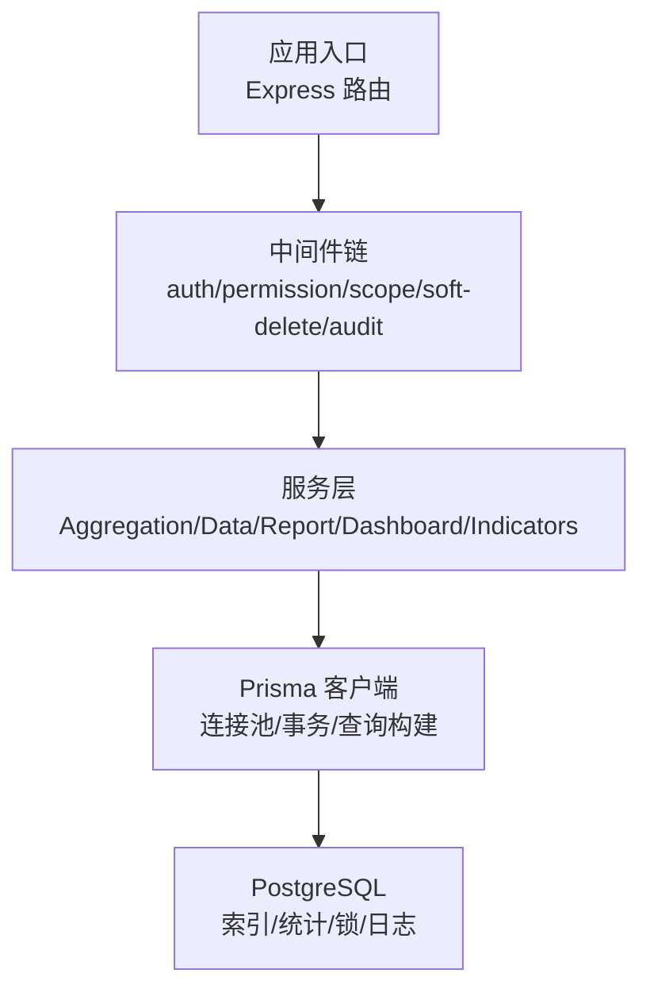
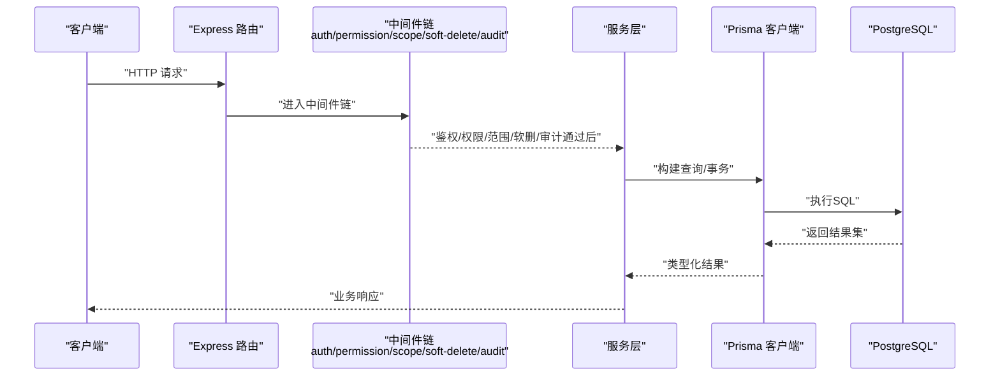
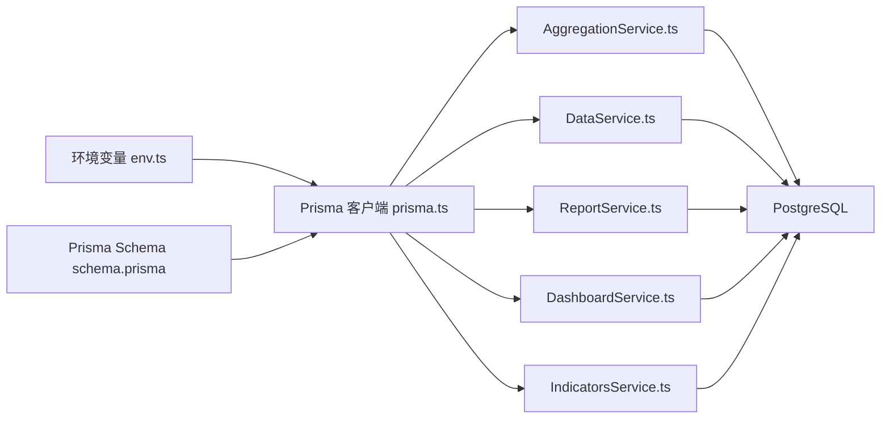

# 数据库性能优化

<cite>
**本文引用的文件**
- [postgresql.conf](file://server/.pgdata/postgresql.conf)
- [schema.prisma](file://server/prisma/schema.prisma)
- [prisma.ts](file://server/src/lib/prisma.ts)
- [env.ts](file://server/src/config/env.ts)
- [AggregationService.ts](file://server/src/services/AggregationService.ts)
- [DataService.ts](file://server/src/services/DataService.ts)
- [ReportService.ts](file://server/src/services/ReportService.ts)
- [DashboardService.ts](file://server/src/services/DashboardService.ts)
- [IndicatorsService.ts](file://server/src/services/IndicatorsService.ts)
- [formula.ts](file://server/src/lib/formula.ts)
- [audit.ts](file://server/src/middleware/audit.ts)
- [scope.ts](file://server/src/middleware/scope.ts)
- [soft-delete.ts](file://server/src/middleware/soft-delete.ts)
- [20260722121714_init/migration.sql](file://server/prisma/migrations/20260722121714_init/migration.sql)
- [20260722142144_add_formula_rule/migration.sql](file://server/prisma/migrations/20260722142144_add_formula_rule/migration.sql)
- [20260723120000_add_subject_analysis/migration.sql](file://server/prisma/migrations/20260723120000_add_subject_analysis/migration.sql)
- [20260724120000_remove_business_unit_org_scope/migration.sql](file://server/prisma/migrations/20260724120000_remove_business_unit_org_scope/migration.sql)
</cite>

## 目录
1. [简介](#简介)
2. [项目结构](#项目结构)
3. [核心组件](#核心组件)
4. [架构总览](#架构总览)
5. [详细组件分析](#详细组件分析)
6. [依赖关系分析](#依赖关系分析)
7. [性能考量](#性能考量)
8. [故障排查指南](#故障排查指南)
9. [结论](#结论)
10. [附录](#附录)

## 简介
本文件面向FY200项目的数据库性能优化，聚焦PostgreSQL索引策略、查询优化、Prisma ORM优化、连接池配置、数据分片与分区、以及监控与维护。目标是帮助读者在“Excel进、看板/报表出”的财务数据分析平台中，系统性地提升查询吞吐、降低延迟、控制资源占用并保障稳定性。

## 项目结构
后端采用Express + Prisma + PostgreSQL技术栈，中间件链顺序为：helmet → cors → express.json → rate-limit → auth(JWT+黑名单) → permission(默认拒绝) → scope(Prisma extension) → softDelete → audit → Service → Prisma → PostgreSQL。数据库相关的关键位置包括：
- PostgreSQL配置：server/.pgdata/postgresql.conf
- Prisma Schema与迁移：server/prisma/schema.prisma、server/prisma/migrations/*
- Prisma客户端初始化：server/src/lib/prisma.ts
- 环境变量：server/src/config/env.ts
- 服务层（聚合、数据、报表、看板、指标）：server/src/services/*
- 公式解析与安全计算：server/src/lib/formula.ts
- 审计与权限扩展：server/src/middleware/audit.ts、scope.ts、soft-delete.ts

**图示来源**
- [prisma.ts](file://server/src/lib/prisma.ts)
- [schema.prisma](file://server/prisma/schema.prisma)
- [postgresql.conf](file://server/.pgdata/postgresql.conf)

**章节来源**
- [prisma.ts](file://server/src/lib/prisma.ts)
- [schema.prisma](file://server/prisma/schema.prisma)
- [postgresql.conf](file://server/.pgdata/postgresql.conf)

## 核心组件
- PostgreSQL配置与参数调优：通过postgresql.conf管理内存、I/O、并发、统计收集等关键参数。
- Prisma Schema与迁移：定义模型、关系、索引与约束，驱动DDL变更。
- Prisma客户端与连接池：集中管理连接数、超时、重试、事务隔离级别。
- 服务层查询编排：聚合、报表、看板、指标等复杂查询由服务层组合生成。
- 安全公式解析：白名单算子与实时同比/环比计算，避免eval风险。
- 审计与范围限制：基于Prisma扩展实现租户/组织范围过滤与审计记录。

**章节来源**
- [postgresql.conf](file://server/.pgdata/postgresql.conf)
- [schema.prisma](file://server/prisma/schema.prisma)
- [prisma.ts](file://server/src/lib/prisma.ts)
- [env.ts](file://server/src/config/env.ts)
- [AggregationService.ts](file://server/src/services/AggregationService.ts)
- [DataService.ts](file://server/src/services/DataService.ts)
- [ReportService.ts](file://server/src/services/ReportService.ts)
- [DashboardService.ts](file://server/src/services/DashboardService.ts)
- [IndicatorsService.ts](file://server/src/services/IndicatorsService.ts)
- [formula.ts](file://server/src/lib/formula.ts)
- [audit.ts](file://server/src/middleware/audit.ts)
- [scope.ts](file://server/src/middleware/scope.ts)
- [soft-delete.ts](file://server/src/middleware/soft-delete.ts)

## 架构总览
下图展示从HTTP请求到数据库访问的完整链路，突出Prisma扩展与审计、软删除对查询的影响。

**图示来源**
- [scope.ts](file://server/src/middleware/scope.ts)
- [soft-delete.ts](file://server/src/middleware/soft-delete.ts)
- [audit.ts](file://server/src/middleware/audit.ts)
- [prisma.ts](file://server/src/lib/prisma.ts)

## 详细组件分析

### PostgreSQL索引优化策略
- 复合索引设计原则
  - 将高频等值条件列放在前导列，范围或排序列放后部；遵循最左前缀匹配。
  - 针对JOIN键建立单列或复合索引，确保连接列数据类型一致且无函数包裹。
  - 覆盖索引用于减少回表，但需权衡写入放大与空间成本。
- 部分索引使用场景
  - 仅对活跃/未删除行建索引（如is_deleted=false），显著缩小索引体积并加速常见查询。
  - 按时间窗口或状态过滤的高频查询可考虑部分索引。
- 函数索引使用场景
  - 对lower(name)、trim(code)、date_trunc('month', created_at)等表达式进行函数索引，以支持函数过滤与分组。
  - 注意函数索引会增大维护成本，仅在确有稳定查询模式时启用。
- 实践建议
  - 结合EXPLAIN/ANALYZE验证索引命中与扫描方式。
  - 定期重建或重组索引，避免膨胀与碎片。
  - 避免过度索引，优先覆盖Top N慢查询。

**章节来源**
- [schema.prisma](file://server/prisma/schema.prisma)
- [20260722121714_init/migration.sql](file://server/prisma/migrations/20260722121714_init/migration.sql)
- [20260722142144_add_formula_rule/migration.sql](file://server/prisma/migrations/20260722142144_add_formula_rule/migration.sql)
- [20260723120000_add_subject_analysis/migration.sql](file://server/prisma/migrations/20260723120000_add_subject_analysis/migration.sql)
- [20260724120000_remove_business_unit_org_scope/migration.sql](file://server/prisma/migrations/20260724120000_remove_business_unit_org_scope/migration.sql)

### 查询优化技术
- EXPLAIN分析
  - 使用EXPLAIN ANALYZE观察计划选择、扫描方式、实际耗时与行数估计偏差。
  - 关注Seq Scan、Index Scan、Bitmap Heap Scan、Nested Loop、Hash Join等节点。
- 慢查询识别
  - 开启log_min_duration_statement，捕获超过阈值的语句；配合pg_stat_statements统计热点SQL。
  - 结合业务高峰时段定位TOP慢查询，优先优化。
- JOIN优化
  - 确保JOIN列有合适索引，避免隐式类型转换导致索引失效。
  - 大表JOIN优先Hash Join，小表驱动大表；必要时调整work_mem。
  - 避免N+1查询，使用批量加载或预取关联数据。
- 子查询优化
  - 将相关子查询改写为JOIN或CTE，减少重复计算。
  - 使用EXISTS替代IN当子查询可能返回大量行时。
  - 避免在WHERE中对列使用函数，必要时改用函数索引。

**章节来源**
- [AggregationService.ts](file://server/src/services/AggregationService.ts)
- [ReportService.ts](file://server/src/services/ReportService.ts)
- [DashboardService.ts](file://server/src/services/DashboardService.ts)
- [IndicatorsService.ts](file://server/src/services/IndicatorsService.ts)

### Prisma ORM优化
- 查询构建优化
  - 使用select/include精准选取字段，避免SELECT *。
  - 合理使用where条件，保持与索引列一致，避免函数包裹。
  - 分页采用cursor-based或limit+offset，避免深分页。
- 关联查询优化
  - 使用include嵌套加载，减少往返次数；对频繁关联建立外键与索引。
  - 对多对多关系使用中间表索引，优化连接性能。
- 批量操作优化
  - 使用createMany/updateMany/deleteMany减少网络往返与事务开销。
  - 大批量写入拆分批次，控制单次事务大小，避免长事务与锁竞争。
- 事务与隔离级别
  - 合理设置事务隔离级别，避免不可重复读与幻读问题。
  - 短事务优先，减少锁持有时间。

**章节来源**
- [schema.prisma](file://server/prisma/schema.prisma)
- [prisma.ts](file://server/src/lib/prisma.ts)
- [AggregationService.ts](file://server/src/services/AggregationService.ts)
- [DataService.ts](file://server/src/services/DataService.ts)
- [ReportService.ts](file://server/src/services/ReportService.ts)

### 数据库连接池配置
- 连接数调优
  - 根据CPU核数与负载估算最大连接数，避免过多连接导致上下文切换。
  - 结合Prisma的maxConnections与PostgreSQL的max_connections协调配置。
- 超时设置
  - 设置statement_timeout、idle_in_transaction_session_timeout防止长事务与空闲会话占用。
  - 客户端连接超时与重试退避策略，避免雪崩。
- 连接复用策略
  - 复用Prisma实例，避免每次请求新建连接。
  - 合理设置keepalive与pool回收策略，减少连接抖动。

**章节来源**
- [prisma.ts](file://server/src/lib/prisma.ts)
- [env.ts](file://server/src/config/env.ts)
- [postgresql.conf](file://server/.pgdata/postgresql.conf)

### 数据分片与分区策略
- 水平分表
  - 按时间（年/月）或租户ID分表，便于归档与并行查询。
  - 使用分区表或逻辑分库分表，结合路由规则。
- 垂直分表
  - 将大字段或低频字段拆分至附属表，减少主表宽度。
- 读写分离
  - 主库写、从库读，分担读压力；注意复制延迟与一致性要求。
- 迁移与治理
  - 通过迁移脚本逐步切流，灰度验证，回滚预案。

[本节为概念性内容，不直接分析具体文件]

### 数据库监控与维护
- 锁等待监控
  - 查询pg_locks、pg_stat_activity，识别阻塞链与长事务。
  - 设置lock_timeout，避免长时间等待。
- 统计信息更新
  - 定期ANALYZE，保证查询计划准确；必要时VACUUM清理死元组。
- 定期维护任务
  - 索引重建、统计收集、表空间整理、备份校验。
  - 使用pg_stat_statements追踪热点SQL，持续优化。

**章节来源**
- [postgresql.conf](file://server/.pgdata/postgresql.conf)
- [audit.ts](file://server/src/middleware/audit.ts)

## 依赖关系分析
Prisma客户端与服务层之间的依赖关系如下：服务层依赖Prisma生成的类型与查询方法，Prisma依赖Schema定义与数据库连接配置。

**图示来源**
- [env.ts](file://server/src/config/env.ts)
- [prisma.ts](file://server/src/lib/prisma.ts)
- [schema.prisma](file://server/prisma/schema.prisma)
- [AggregationService.ts](file://server/src/services/AggregationService.ts)
- [DataService.ts](file://server/src/services/DataService.ts)
- [ReportService.ts](file://server/src/services/ReportService.ts)
- [DashboardService.ts](file://server/src/services/DashboardService.ts)
- [IndicatorsService.ts](file://server/src/services/IndicatorsService.ts)

**章节来源**
- [env.ts](file://server/src/config/env.ts)
- [prisma.ts](file://server/src/lib/prisma.ts)
- [schema.prisma](file://server/prisma/schema.prisma)
- [AggregationService.ts](file://server/src/services/AggregationService.ts)
- [DataService.ts](file://server/src/services/DataService.ts)
- [ReportService.ts](file://server/src/services/ReportService.ts)
- [DashboardService.ts](file://server/src/services/DashboardService.ts)
- [IndicatorsService.ts](file://server/src/services/IndicatorsService.ts)

## 性能考量
- 索引与统计
  - 优先为Top慢查询建立合适索引，定期ANALYZE/VACUUM。
- 查询计划
  - 关注统计偏差导致的错误计划，必要时强制计划或使用提示。
- 连接与事务
  - 控制连接池大小与超时，缩短事务生命周期。
- 计算与缓存
  - 同比/环比实时计算，避免冗余存储；热点数据可引入缓存层。
- 安全与合规
  - 公式解析白名单，禁止eval；敏感数据脱敏后再入LLM管道。

[本节提供通用指导，不直接分析具体文件]

## 故障排查指南
- 慢查询定位
  - 开启log_min_duration_statement，采集慢SQL；结合pg_stat_statements分析热点。
- 锁与阻塞
  - 检查pg_locks与pg_stat_activity，识别阻塞源与长事务；调整lock_timeout。
- 连接池问题
  - 观察连接数峰值与超时错误，调整maxConnections与超时参数。
- 统计与计划
  - 运行ANALYZE，检查计划是否误用Seq Scan；必要时重建索引或调整参数。
- 审计与范围
  - 确认scope与soft-delete中间件生效，避免遗漏过滤条件导致全表扫描。

**章节来源**
- [postgresql.conf](file://server/.pgdata/postgresql.conf)
- [audit.ts](file://server/src/middleware/audit.ts)
- [scope.ts](file://server/src/middleware/scope.ts)
- [soft-delete.ts](file://server/src/middleware/soft-delete.ts)

## 结论
通过系统化的索引设计、查询优化、Prisma ORM最佳实践、连接池调优、分片分区策略与监控维护，FY200项目可在高并发与大数据量场景下保持稳定与高性能。建议以慢查询为导向，持续迭代索引与查询，完善监控告警，形成闭环优化机制。

## 附录
- 常用命令与视图
  - pg_stat_statements：统计热点SQL
  - pg_locks、pg_stat_activity：锁与活动会话
  - EXPLAIN ANALYZE：查看执行计划与实际耗时
- 参考迁移与Schema
  - 初始结构与后续演进见迁移脚本与Schema定义

**章节来源**
- [20260722121714_init/migration.sql](file://server/prisma/migrations/20260722121714_init/migration.sql)
- [20260722142144_add_formula_rule/migration.sql](file://server/prisma/migrations/20260722142144_add_formula_rule/migration.sql)
- [20260723120000_add_subject_analysis/migration.sql](file://server/prisma/migrations/20260723120000_add_subject_analysis/migration.sql)
- [20260724120000_remove_business_unit_org_scope/migration.sql](file://server/prisma/migrations/20260724120000_remove_business_unit_org_scope/migration.sql)
- [schema.prisma](file://server/prisma/schema.prisma)