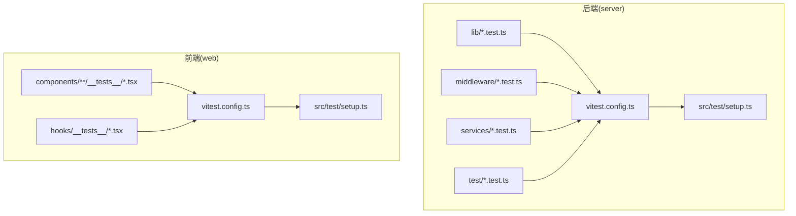
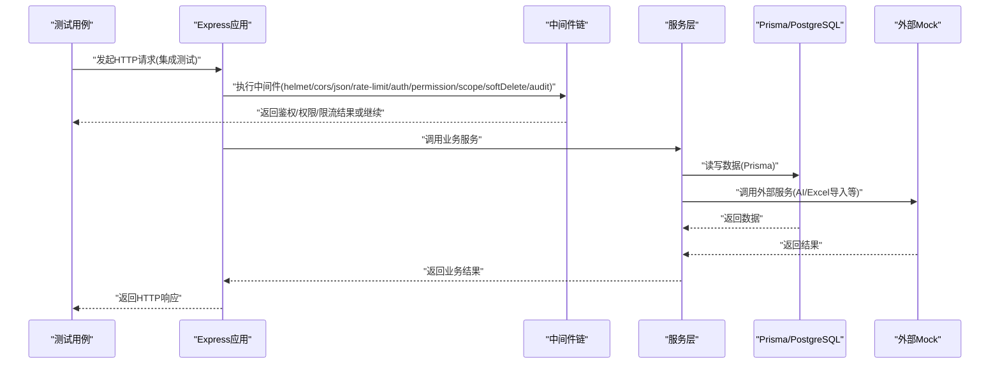
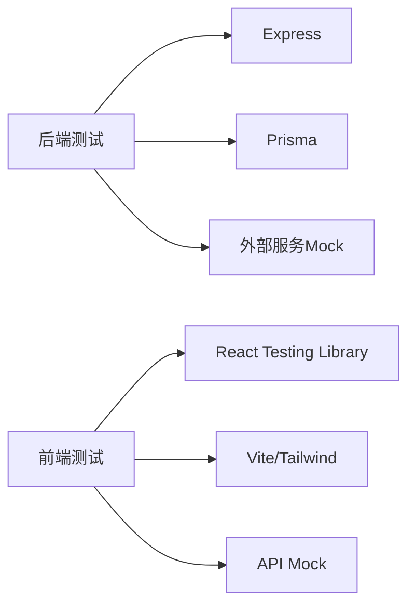

# 单元测试

<cite>
**本文引用的文件**   
- [server/vitest.config.ts](file://server/vitest.config.ts)
- [server/src/test/setup.ts](file://server/src/test/setup.ts)
- [server/src/lib/desensitize.test.ts](file://server/src/lib/desensitize.test.ts)
- [server/src/lib/excel-import.test.ts](file://server/src/lib/excel-import.test.ts)
- [server/src/lib/formula.test.ts](file://server/src/lib/formula.test.ts)
- [server/src/lib/jwt.test.ts](file://server/src/lib/jwt.test.ts)
- [server/src/lib/metric-values.test.ts](file://server/src/lib/metric-values.test.ts)
- [server/src/lib/password.test.ts](file://server/src/lib/password.test.ts)
- [server/src/lib/period.test.ts](file://server/src/lib/period.test.ts)
- [server/src/lib/prompt-guard.test.ts](file://server/src/lib/prompt-guard.test.ts)
- [server/src/lib/sanitize.test.ts](file://server/src/lib/sanitize.test.ts)
- [server/src/middleware/auth.test.ts](file://server/src/middleware/auth.test.ts)
- [server/src/middleware/permission.test.ts](file://server/src/middleware/permission.test.ts)
- [server/src/middleware/scope.test.ts](file://server/src/middleware/scope.test.ts)
- [server/src/middleware/soft-delete.test.ts](file://server/src/middleware/soft-delete.test.ts)
- [server/src/services/AIProxyService.test.ts](file://server/src/services/AIProxyService.test.ts)
- [server/src/services/AggregationService.calc.test.ts](file://server/src/services/AggregationService.calc.test.ts)
- [server/src/services/AggregationService.static.test.ts](file://server/src/services/AggregationService.static.test.ts)
- [server/src/services/AggregationService.ytd.test.ts](file://server/src/services/AggregationService.ytd.test.ts)
- [server/src/services/AuthService.test.ts](file://server/src/services/AuthService.test.ts)
- [server/src/services/DataService.test.ts](file://server/src/services/DataService.test.ts)
- [server/src/services/FormulaRuleService.test.ts](file://server/src/services/FormulaRuleService.test.ts)
- [server/src/services/ImportService.test.ts](file://server/src/services/ImportService.test.ts)
- [server/src/services/ReportService.test.ts](file://server/src/services/ReportService.test.ts)
- [server/src/services/SubjectAnalysisService.test.ts](file://server/src/services/SubjectAnalysisService.test.ts)
- [server/src/services/formula-validation.test.ts](file://server/src/services/formula-validation.test.ts)
- [server/src/test/integration.test.ts](file://server/src/test/integration.test.ts)
- [server/src/test/integration-crud.test.ts](file://server/src/test/integration-crud.test.ts)
- [server/src/test/reports-http.test.ts](file://server/src/test/reports-http.test.ts)
- [server/src/test/ai-http.test.ts](file://server/src/test/ai-http.test.ts)
- [web/vitest.config.ts](file://web/vitest.config.ts)
- [web/src/test/setup.ts](file://web/src/test/setup.ts)
- [web/src/components/data-table/__tests__/data-table.test.tsx](file://web/src/components/data-table/__tests__/data-table.test.tsx)
- [web/src/components/layout/__tests__/require-permission.test.tsx](file://web/src/components/layout/__tests__/require-permission.test.tsx)
- [web/src/hooks/__tests__/usePermission.test.tsx](file://web/src/hooks/__tests__/usePermission.test.tsx)
</cite>

## 目录
1. [简介](#简介)
2. [项目结构](#项目结构)
3. [核心组件](#核心组件)
4. [架构总览](#架构总览)
5. [详细组件分析](#详细组件分析)
6. [依赖分析](#依赖分析)
7. [性能考虑](#性能考虑)
8. [故障排查指南](#故障排查指南)
9. [结论](#结论)
10. [附录](#附录)

## 简介
本文件面向FY200项目的测试工程师与开发者，系统化阐述Vitest在前后端的配置与实践，覆盖测试环境设置、Mock策略、异步测试处理；并给出后端服务层、工具函数、中间件的单元测试规范，以及前端React组件、Hooks与状态管理的测试方法。文档同时提供测试数据准备与清理的最佳实践、断言库使用指南与常见测试模式，帮助编写高质量、高覆盖率且可维护的测试用例。

## 项目结构
本项目采用前后端分离结构，测试统一基于Vitest：
- 后端（server）：Express + Prisma + PostgreSQL，测试覆盖工具函数、中间件、服务层与HTTP集成测试。
- 前端（web）：React + Vite，测试覆盖UI组件、Hooks与权限相关逻辑。

图表来源
- [server/vitest.config.ts](file://server/vitest.config.ts)
- [server/src/test/setup.ts](file://server/src/test/setup.ts)
- [web/vitest.config.ts](file://web/vitest.config.ts)
- [web/src/test/setup.ts](file://web/src/test/setup.ts)

章节来源
- [server/vitest.config.ts](file://server/vitest.config.ts)
- [web/vitest.config.ts](file://web/vitest.config.ts)

## 核心组件
- Vitest配置与全局初始化
  - 后端：通过vitest配置文件定义运行环境与全局setup脚本，确保数据库连接、Prisma客户端、日志与错误处理在测试前就绪。
  - 前端：通过vitest配置文件启用JSX/TSX支持、DOM环境、Mock API与全局样式注入。
- 测试组织方式
  - 工具函数：按模块拆分，文件名以*.test.ts结尾，聚焦纯函数与确定性行为。
  - 中间件：模拟Express请求上下文，验证鉴权、权限、作用域、软删除等逻辑。
  - 服务层：隔离外部依赖（Prisma、AI代理、第三方API），使用Mock或内存实现。
  - 集成测试：端到端HTTP调用，校验路由、中间件链与响应格式。
- 测试数据与清理
  - 使用事务包裹测试，保证失败回滚；或在afterEach中清理种子数据。
  - 对时间敏感逻辑使用固定时钟或可控时间源。

章节来源
- [server/vitest.config.ts](file://server/vitest.config.ts)
- [server/src/test/setup.ts](file://server/src/test/setup.ts)
- [web/vitest.config.ts](file://web/vitest.config.ts)
- [web/src/test/setup.ts](file://web/src/test/setup.ts)

## 架构总览
下图展示后端测试从请求到服务的调用链，以及各层测试如何协作：

图表来源
- [server/src/test/integration.test.ts](file://server/src/test/integration.test.ts)
- [server/src/test/integration-crud.test.ts](file://server/src/test/integration-crud.test.ts)
- [server/src/test/reports-http.test.ts](file://server/src/test/reports-http.test.ts)
- [server/src/test/ai-http.test.ts](file://server/src/test/ai-http.test.ts)

## 详细组件分析

### 后端工具函数测试（lib/*.test.ts）
- 目标：验证脱敏、公式解析、JWT生成/校验、指标值计算、密码哈希、周期计算、提示词防护、输入清洗等确定性逻辑。
- 要点：
  - 使用参数化用例覆盖边界条件与异常路径。
  - 对时间相关逻辑使用固定时间源或Mock Date。
  - 对随机性输出进行范围断言或多次采样统计。
- 示例文件参考：
  - [server/src/lib/desensitize.test.ts](file://server/src/lib/desensitize.test.ts)
  - [server/src/lib/formula.test.ts](file://server/src/lib/formula.test.ts)
  - [server/src/lib/jwt.test.ts](file://server/src/lib/jwt.test.ts)
  - [server/src/lib/metric-values.test.ts](file://server/src/lib/metric-values.test.ts)
  - [server/src/lib/password.test.ts](file://server/src/lib/password.test.ts)
  - [server/src/lib/period.test.ts](file://server/src/lib/period.test.ts)
  - [server/src/lib/prompt-guard.test.ts](file://server/src/lib/prompt-guard.test.ts)
  - [server/src/lib/sanitize.test.ts](file://server/src/lib/sanitize.test.ts)

章节来源
- [server/src/lib/desensitize.test.ts](file://server/src/lib/desensitize.test.ts)
- [server/src/lib/formula.test.ts](file://server/src/lib/formula.test.ts)
- [server/src/lib/jwt.test.ts](file://server/src/lib/jwt.test.ts)
- [server/src/lib/metric-values.test.ts](file://server/src/lib/metric-values.test.ts)
- [server/src/lib/password.test.ts](file://server/src/lib/password.test.ts)
- [server/src/lib/period.test.ts](file://server/src/lib/period.test.ts)
- [server/src/lib/prompt-guard.test.ts](file://server/src/lib/prompt-guard.test.ts)
- [server/src/lib/sanitize.test.ts](file://server/src/lib/sanitize.test.ts)

### 后端中间件测试（middleware/*.test.ts）
- 目标：验证鉴权、权限控制、作用域扩展、软删除过滤等中间件行为。
- 要点：
  - 构造最小化的req/res/next对象，注入用户信息与权限。
  - 针对黑名单、Token过期、权限不足等场景设计用例。
  - 验证scope扩展对查询条件的注入效果。
- 示例文件参考：
  - [server/src/middleware/auth.test.ts](file://server/src/middleware/auth.test.ts)
  - [server/src/middleware/permission.test.ts](file://server/src/middleware/permission.test.ts)
  - [server/src/middleware/scope.test.ts](file://server/src/middleware/scope.test.ts)
  - [server/src/middleware/soft-delete.test.ts](file://server/src/middleware/soft-delete.test.ts)

章节来源
- [server/src/middleware/auth.test.ts](file://server/src/middleware/auth.test.ts)
- [server/src/middleware/permission.test.ts](file://server/src/middleware/permission.test.ts)
- [server/src/middleware/scope.test.ts](file://server/src/middleware/scope.test.ts)
- [server/src/middleware/soft-delete.test.ts](file://server/src/middleware/soft-delete.test.ts)

### 后端服务层测试（services/*.test.ts）
- 目标：隔离外部依赖，验证业务逻辑正确性与异常处理。
- 要点：
  - 使用Mock替换Prisma客户端与外部API（如AI代理、Excel导入）。
  - 对异步流程使用Promise断言与超时保护。
  - 对并发与重试逻辑进行压力与稳定性测试。
- 示例文件参考：
  - [server/src/services/AIProxyService.test.ts](file://server/src/services/AIProxyService.test.ts)
  - [server/src/services/AggregationService.calc.test.ts](file://server/src/services/AggregationService.calc.test.ts)
  - [server/src/services/AggregationService.static.test.ts](file://server/src/services/AggregationService.static.test.ts)
  - [server/src/services/AggregationService.ytd.test.ts](file://server/src/services/AggregationService.ytd.test.ts)
  - [server/src/services/AuthService.test.ts](file://server/src/services/AuthService.test.ts)
  - [server/src/services/DataService.test.ts](file://server/src/services/DataService.test.ts)
  - [server/src/services/FormulaRuleService.test.ts](file://server/src/services/FormulaRuleService.test.ts)
  - [server/src/services/ImportService.test.ts](file://server/src/services/ImportService.test.ts)
  - [server/src/services/ReportService.test.ts](file://server/src/services/ReportService.test.ts)
  - [server/src/services/SubjectAnalysisService.test.ts](file://server/src/services/SubjectAnalysisService.test.ts)
  - [server/src/services/formula-validation.test.ts](file://server/src/services/formula-validation.test.ts)

章节来源
- [server/src/services/AIProxyService.test.ts](file://server/src/services/AIProxyService.test.ts)
- [server/src/services/AggregationService.calc.test.ts](file://server/src/services/AggregationService.calc.test.ts)
- [server/src/services/AggregationService.static.test.ts](file://server/src/services/AggregationService.static.test.ts)
- [server/src/services/AggregationService.ytd.test.ts](file://server/src/services/AggregationService.ytd.test.ts)
- [server/src/services/AuthService.test.ts](file://server/src/services/AuthService.test.ts)
- [server/src/services/DataService.test.ts](file://server/src/services/DataService.test.ts)
- [server/src/services/FormulaRuleService.test.ts](file://server/src/services/FormulaRuleService.test.ts)
- [server/src/services/ImportService.test.ts](file://server/src/services/ImportService.test.ts)
- [server/src/services/ReportService.test.ts](file://server/src/services/ReportService.test.ts)
- [server/src/services/SubjectAnalysisService.test.ts](file://server/src/services/SubjectAnalysisService.test.ts)
- [server/src/services/formula-validation.test.ts](file://server/src/services/formula-validation.test.ts)

### 后端集成测试（test/*.test.ts）
- 目标：验证完整HTTP链路，包括中间件顺序、路由处理、数据库交互与外部服务调用。
- 要点：
  - 使用真实或内存数据库，结合事务与清理策略。
  - 对SSE流式接口进行分段断言与超时保护。
  - 对跨域、速率限制、审计日志等横切关注点进行验证。
- 示例文件参考：
  - [server/src/test/integration.test.ts](file://server/src/test/integration.test.ts)
  - [server/src/test/integration-crud.test.ts](file://server/src/test/integration-crud.test.ts)
  - [server/src/test/reports-http.test.ts](file://server/src/test/reports-http.test.ts)
  - [server/src/test/ai-http.test.ts](file://server/src/test/ai-http.test.ts)

章节来源
- [server/src/test/integration.test.ts](file://server/src/test/integration.test.ts)
- [server/src/test/integration-crud.test.ts](file://server/src/test/integration-crud.test.ts)
- [server/src/test/reports-http.test.ts](file://server/src/test/reports-http.test.ts)
- [server/src/test/ai-http.test.ts](file://server/src/test/ai-http.test.ts)

### 前端组件测试（components/**/__tests__/*.tsx）
- 目标：验证渲染结果、用户交互、副作用与状态更新。
- 要点：
  - 使用Jest/Vitest的DOM环境，配合react-testing-library进行查询与事件触发。
  - Mock网络请求与第三方库，避免外部依赖影响测试稳定性。
  - 对异步渲染与加载态进行等待与断言。
- 示例文件参考：
  - [web/src/components/data-table/__tests__/data-table.test.tsx](file://web/src/components/data-table/__tests__/data-table.test.tsx)
  - [web/src/components/layout/__tests__/require-permission.test.tsx](file://web/src/components/layout/__tests__/require-permission.test.tsx)

章节来源
- [web/src/components/data-table/__tests__/data-table.test.tsx](file://web/src/components/data-table/__tests__/data-table.test.tsx)
- [web/src/components/layout/__tests__/require-permission.test.tsx](file://web/src/components/layout/__tests__/require-permission.test.tsx)

### 前端Hooks测试（hooks/__tests__/*.tsx）
- 目标：验证自定义Hook的状态管理、副作用与生命周期行为。
- 要点：
  - 使用renderHook包装Hook，触发回调并断言状态变化。
  - Mock依赖的服务与API，确保测试隔离。
  - 对异步Hook使用waitFor与flushMicrotasks。
- 示例文件参考：
  - [web/src/hooks/__tests__/usePermission.test.tsx](file://web/src/hooks/__tests__/usePermission.test.tsx)

章节来源
- [web/src/hooks/__tests__/usePermission.test.tsx](file://web/src/hooks/__tests__/usePermission.test.tsx)

## 依赖分析
- 后端测试依赖
  - Express测试框架用于模拟HTTP请求与响应。
  - Prisma客户端在测试环境中需初始化，建议使用内存数据库或事务隔离。
  - AI代理与Excel导入等外部服务通过Mock替代，避免网络抖动。
- 前端测试依赖
  - React Testing Library用于组件渲染与交互。
  - Vite插件支持TSX与CSS模块。
  - Mock API与服务层，确保组件测试稳定。

图表来源
- [server/vitest.config.ts](file://server/vitest.config.ts)
- [web/vitest.config.ts](file://web/vitest.config.ts)

章节来源
- [server/vitest.config.ts](file://server/vitest.config.ts)
- [web/vitest.config.ts](file://web/vitest.config.ts)

## 性能考虑
- 测试并行执行：合理设置Vitest工作进程数，避免数据库锁竞争。
- 数据库操作优化：使用事务与批量插入减少IO开销。
- Mock外部依赖：避免网络延迟与限流影响测试速度。
- 资源清理：及时释放定时器、监听器与临时文件。

## 故障排查指南
- 常见问题
  - 数据库连接失败：检查环境变量与连接字符串，确认测试数据库可用。
  - 中间件顺序问题：核对helmet→cors→json→rate-limit→auth→permission→scope→softDelete→audit顺序。
  - 异步测试超时：增加超时阈值或使用正确的异步断言。
  - 组件渲染错误：检查Mock是否完整，确保依赖服务返回预期结构。
- 调试技巧
  - 启用详细日志，定位错误堆栈。
  - 使用单测聚焦特定用例，逐步缩小问题范围。
  - 对时间敏感逻辑使用固定时钟，避免不确定性。

## 结论
通过统一的Vitest配置与分层测试策略，FY200项目在工具函数、中间件、服务层与前端组件层面均具备完善的测试覆盖。遵循本文档的实践建议，可进一步提升代码质量、可维护性与交付效率。

## 附录
- 测试数据准备与清理最佳实践
  - 使用事务包裹测试，失败自动回滚。
  - 在afterEach中清理种子数据，避免污染后续用例。
  - 对时间相关逻辑使用固定时间源或Mock Date。
- 断言库使用指南
  - 使用Vitest内置断言库，结合expect与匹配器。
  - 对异步操作使用await与rejects/throws断言。
- 常见测试模式
  - 参数化测试：覆盖多组输入输出。
  - 边界条件测试：空值、极值、非法输入。
  - 异常路径测试：错误码、异常消息、恢复逻辑。
- 高质量测试用例原则
  - 单一职责：每个用例验证一个行为。
  - 可读性：命名清晰，描述意图。
  - 稳定性：避免外部依赖与随机性。
  - 覆盖率：关键路径与异常路径全覆盖。