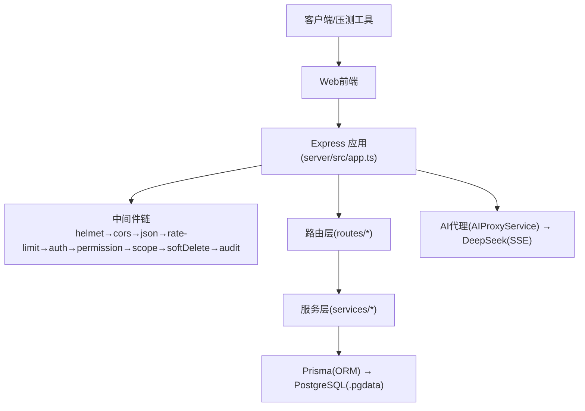
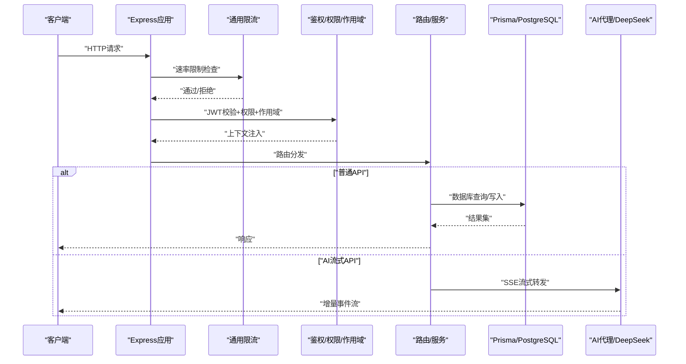
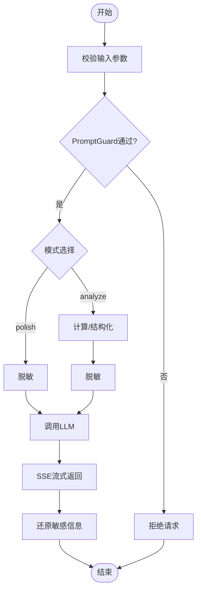
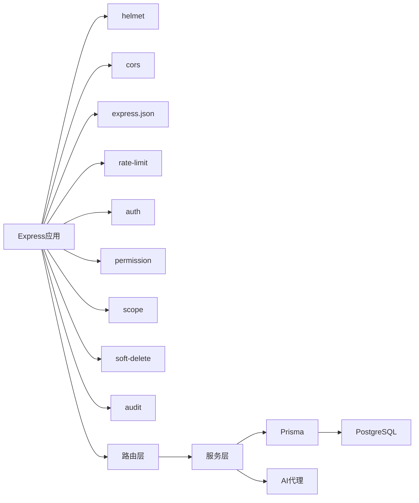

# 性能测试

<cite>
**本文引用的文件**   
- [server/src/app.ts](file://server/src/app.ts)
- [server/src/server.ts](file://server/src/server.ts)
- [server/src/middleware/rate-limit.ts](file://server/src/middleware/rate-limit.ts)
- [server/src/middleware/ai-rate-limit.ts](file://server/src/middleware/ai-rate-limit.ts)
- [server/src/lib/prisma.ts](file://server/src/lib/prisma.ts)
- [server/src/services/AIProxyService.ts](file://server/src/services/AIProxyService.ts)
- [server/src/routes/ai.ts](file://server/src/routes/ai.ts)
- [server/src/lib/deepseek.ts](file://server/src/lib/deepseek.ts)
- [server/src/lib/logger.ts](file://server/src/lib/logger.ts)
- [server/src/lib/errors.ts](file://server/src/lib/errors.ts)
- [server/src/middleware/error-handler.ts](file://server/src/middleware/error-handler.ts)
- [server/src/middleware/auth.ts](file://server/src/middleware/auth.ts)
- [server/src/middleware/scope.ts](file://server/src/middleware/scope.ts)
- [server/src/middleware/audit.ts](file://server/src/middleware/audit.ts)
- [server/src/middleware/soft-delete.ts](file://server/src/middleware/soft-delete.ts)
- [server/src/middleware/permission.ts](file://server/src/middleware/permission.ts)
- [server/src/middleware/cors.ts](file://server/src/middleware/cors.ts)
- [server/src/middleware/helmet.ts](file://server/src/middleware/helmet.ts)
- [server/src/middleware/trace-id.ts](file://server/src/middleware/trace-id.ts)
- [server/src/lib/formula.ts](file://server/src/lib/formula.ts)
- [server/src/lib/excel-import.ts](file://server/src/lib/excel-import.ts)
- [server/src/lib/jwt.ts](file://server/src/lib/jwt.ts)
- [server/src/lib/response.ts](file://server/src/lib/response.ts)
- [server/src/lib/metric-values.ts](file://server/src/lib/metric-values.ts)
- [server/src/lib/prompt-guard.ts](file://server/src/lib/prompt-guard.ts)
- [server/src/lib/desensitize.ts](file://server/src/lib/desensitize.ts)
- [server/src/lib/sanitize.ts](file://server/src/lib/sanitize.ts)
- [server/src/lib/period.ts](file://server/src/lib/period.ts)
- [server/src/lib/password.ts](file://server/src/lib/password.ts)
- [server/src/lib/schema.ts](file://server/src/lib/schema.ts)
- [server/src/lib/async-handler.ts](file://server/src/lib/async-handler.ts)
- [server/src/routes/auth.ts](file://server/src/routes/auth.ts)
- [server/src/routes/data.ts](file://server/src/routes/data.ts)
- [server/src/routes/reports.ts](file://server/src/routes/reports.ts)
- [server/src/routes/dashboard.ts](file://server/src/routes/dashboard.ts)
- [server/src/routes/admin.ts](file://server/src/routes/admin.ts)
- [server/src/routes/indicators.ts](file://server/src/routes/indicators.ts)
- [server/src/services/AuthService.ts](file://server/src/services/AuthService.ts)
- [server/src/services/DataService.ts](file://server/src/services/DataService.ts)
- [server/src/services/ReportService.ts](file://server/src/services/ReportService.ts)
- [server/src/services/DashboardService.ts](file://server/src/services/DashboardService.ts)
- [server/src/services/AdminService.ts](file://server/src/services/AdminService.ts)
- [server/src/services/IndicatorsService.ts](file://server/src/services/IndicatorsService.ts)
- [server/src/services/AggregationService.ts](file://server/src/services/AggregationService.ts)
- [server/src/services/FormulaRuleService.ts](file://server/src/services/FormulaRuleService.ts)
- [server/src/services/ImportService.ts](file://server/src/services/ImportService.ts)
- [server/src/services/SubjectAnalysisService.ts](file://server/src/services/SubjectAnalysisService.ts)
- [server/src/test/integration.test.ts](file://server/src/test/integration.test.ts)
- [server/src/test/ai-http.test.ts](file://server/src/test/ai-http.test.ts)
- [server/src/test/setup.ts](file://server/src/test/setup.ts)
- [server/scripts/ai-http-live.ts](file://server/scripts/ai-http-live.ts)
- [server/scripts/ai-pipeline-smoke.ts](file://server/scripts/ai-pipeline-smoke.ts)
- [server/scripts/ai-smoke.ts](file://server/scripts/ai-smoke.ts)
- [server/scripts/cors-check.ts](file://server/scripts/cors-check.ts)
- [server/scripts/local-db.ts](file://server/scripts/local-db.ts)
- [server/prisma/schema.prisma](file://server/prisma/schema.prisma)
- [server/.pgdata/postgresql.conf](file://server/.pgdata/postgresql.conf)
- [server/package.json](file://server/package.json)
- [web/src/lib/api.ts](file://web/src/lib/api.ts)
- [web/src/lib/ai-stream.ts](file://web/src/lib/ai-stream.ts)
- [docs/references/performance.md](file://docs/references/performance.md)
</cite>

## 目录
1. [引言](#引言)
2. [项目结构](#项目结构)
3. [核心组件](#核心组件)
4. [架构总览](#架构总览)
5. [详细组件分析](#详细组件分析)
6. [依赖关系分析](#依赖关系分析)
7. [性能考量](#性能考量)
8. [故障排查指南](#故障排查指南)
9. [结论](#结论)
10. [附录](#附录)

## 引言
本文件面向FY200项目的性能测试，覆盖工具选型、API基准与吞吐、数据库性能、压力场景设计、AI流式接口与大数据量处理、监控指标采集与瓶颈定位。项目为内部管理口径的财年经营数据分析平台，后端采用Express + Prisma + PostgreSQL，并集成DeepSeek API（SSE流式）。中间件执行链顺序固定，计算类指标使用安全公式解析，AI双管道架构包含脱敏与还原流程。

## 项目结构
- 后端服务位于 server 目录，入口文件为 app.ts 和 server.ts；路由集中在 routes，业务逻辑在 services，通用能力在 lib，鉴权与限流等横切逻辑在 middleware。
- 数据库使用Prisma ORM与PostgreSQL，连接池配置由Prisma驱动管理。
- Web前端位于 web 目录，提供数据交互与AI流式展示能力。
- 文档参考 docs/references/performance.md 可作为性能基线与目标补充。

**图示来源**
- [server/src/app.ts](file://server/src/app.ts)
- [server/src/server.ts](file://server/src/server.ts)
- [server/src/middleware/rate-limit.ts](file://server/src/middleware/rate-limit.ts)
- [server/src/middleware/ai-rate-limit.ts](file://server/src/middleware/ai-rate-limit.ts)
- [server/src/lib/prisma.ts](file://server/src/lib/prisma.ts)
- [server/src/services/AIProxyService.ts](file://server/src/services/AIProxyService.ts)
- [server/src/routes/ai.ts](file://server/src/routes/ai.ts)
- [server/src/lib/deepseek.ts](file://server/src/lib/deepseek.ts)

**章节来源**
- [server/src/app.ts](file://server/src/app.ts)
- [server/src/server.ts](file://server/src/server.ts)
- [server/package.json](file://server/package.json)

## 核心组件
- 应用启动与中间件装配：Express应用初始化、全局中间件注册、路由挂载。
- 限流策略：通用请求限流与AI专用限流，保护下游与系统资源。
- 鉴权与权限：JWT校验、黑名单、权限默认拒绝模型、作用域扩展。
- 数据库访问：Prisma连接池、查询优化、事务与并发控制。
- AI代理：SSE流式转发、双管道（polish/analyze）、脱敏与还原。
- 日志与错误：结构化日志、统一错误处理、可观测性埋点。

**章节来源**
- [server/src/app.ts](file://server/src/app.ts)
- [server/src/middleware/rate-limit.ts](file://server/src/middleware/rate-limit.ts)
- [server/src/middleware/ai-rate-limit.ts](file://server/src/middleware/ai-rate-limit.ts)
- [server/src/middleware/auth.ts](file://server/src/middleware/auth.ts)
- [server/src/middleware/permission.ts](file://server/src/middleware/permission.ts)
- [server/src/middleware/scope.ts](file://server/src/middleware/scope.ts)
- [server/src/lib/prisma.ts](file://server/src/lib/prisma.ts)
- [server/src/services/AIProxyService.ts](file://server/src/services/AIProxyService.ts)
- [server/src/lib/logger.ts](file://server/src/lib/logger.ts)
- [server/src/lib/errors.ts](file://server/src/lib/errors.ts)
- [server/src/middleware/error-handler.ts](file://server/src/middleware/error-handler.ts)

## 架构总览
下图展示了从客户端到数据库与AI外部的完整调用路径，以及关键中间件与服务职责。

**图示来源**
- [server/src/app.ts](file://server/src/app.ts)
- [server/src/middleware/rate-limit.ts](file://server/src/middleware/rate-limit.ts)
- [server/src/middleware/auth.ts](file://server/src/middleware/auth.ts)
- [server/src/middleware/permission.ts](file://server/src/middleware/permission.ts)
- [server/src/middleware/scope.ts](file://server/src/middleware/scope.ts)
- [server/src/routes/ai.ts](file://server/src/routes/ai.ts)
- [server/src/services/AIProxyService.ts](file://server/src/services/AIProxyService.ts)
- [server/src/lib/prisma.ts](file://server/src/lib/prisma.ts)

## 详细组件分析

### API性能基准测试（JMeter/k6）
- 工具选择
  - k6：适合脚本化、持续集成、云原生压测，支持VU并发模型与丰富的指标导出。
  - JMeter：图形化编排、丰富插件生态，适合复杂场景与报告输出。
- 基准指标
  - 响应时间：P50/P90/P99、平均、最大、最小。
  - 吞吐量：QPS/TPS、带宽占用。
  - 错误率：HTTP状态码分布、超时比例。
  - 资源利用率：CPU、内存、GC、网络IO、磁盘IO。
- 场景设计
  - 单接口基准：逐步提升并发，观察拐点。
  - 混合负载：按业务比例组合接口，模拟真实流量。
  - 阶梯加压：线性或指数增长，定位容量上限。
  - 稳定性：长时间运行（如24h），关注内存泄漏与连接泄漏。
- 数据采集
  - 服务端：Node.js进程指标、Prisma慢查询、PostgreSQL统计视图。
  - 客户端：k6/JMeter内置指标、浏览器Network面板（前端）。
  - 外部：DeepSeek API延迟与配额限制。

**章节来源**
- [server/src/app.ts](file://server/src/app.ts)
- [server/src/routes/auth.ts](file://server/src/routes/auth.ts)
- [server/src/routes/data.ts](file://server/src/routes/data.ts)
- [server/src/routes/reports.ts](file://server/src/routes/reports.ts)
- [server/src/routes/dashboard.ts](file://server/src/routes/dashboard.ts)
- [server/src/routes/admin.ts](file://server/src/routes/admin.ts)
- [server/src/routes/indicators.ts](file://server/src/routes/indicators.ts)

### 数据库性能测试（Prisma + PostgreSQL）
- 连接池配置
  - 通过Prisma连接池参数调节最大连接数、空闲回收、超时等，避免连接耗尽与等待队列过长。
- 查询优化
  - 使用EXPLAIN ANALYZE分析执行计划，识别全表扫描、缺失索引、低效JOIN。
  - 针对高频条件列建立合适索引，验证命中与选择性。
- 事务与锁
  - 合理拆分事务边界，减少长事务与锁竞争。
  - 读写分离与只读副本用于报表与聚合查询。
- 压测方法
  - 批量插入/更新：分批提交，避免单次过大事务。
  - 复杂查询：分页、排序、过滤组合，评估索引效果。
  - 连接池饱和：逐步增加并发，观察等待时间与错误率。

**章节来源**
- [server/src/lib/prisma.ts](file://server/src/lib/prisma.ts)
- [server/prisma/schema.prisma](file://server/prisma/schema.prisma)
- [server/.pgdata/postgresql.conf](file://server/.pgdata/postgresql.conf)

### 压力测试场景设计
- 并发用户模拟
  - 基于k6 VU或JMeter线程组，设置不同并发级别，逐步递增。
- 负载增长测试
  - 阶梯加压：每阶段维持一段时间，记录指标变化趋势。
- 稳定性测试
  - 长时间运行，监控内存、句柄、连接池、GC停顿。
- 异常注入
  - 随机延迟、错误返回、下游超时，验证降级与熔断。

**章节来源**
- [server/src/middleware/rate-limit.ts](file://server/src/middleware/rate-limit.ts)
- [server/src/middleware/ai-rate-limit.ts](file://server/src/middleware/ai-rate-limit.ts)
- [server/src/test/integration.test.ts](file://server/src/test/integration.test.ts)

### AI接口流式响应与大数据量处理
- SSE流式转发
  - 使用AI代理将上游请求转发至DeepSeek，逐块推送事件，降低首字节延迟。
- 双管道架构
  - polish：文本→脱敏→LLM→还原。
  - analyze：结构化→计算→脱敏→LLM→生成。
- 性能要点
  - 背压与缓冲：控制上游读取与下游发送速率，避免内存暴涨。
  - 超时与重试：合理设置超时与重试策略，保证可用性。
  - 限流与配额：AI专用限流与下游配额保护。
- 大数据量处理
  - 分片与批处理：对大文件导入进行分片处理，避免阻塞主线程。
  - 流式解析：Excel导入采用流式解析，降低峰值内存。

**图示来源**
- [server/src/routes/ai.ts](file://server/src/routes/ai.ts)
- [server/src/services/AIProxyService.ts](file://server/src/services/AIProxyService.ts)
- [server/src/lib/deepseek.ts](file://server/src/lib/deepseek.ts)
- [server/src/lib/prompt-guard.ts](file://server/src/lib/prompt-guard.ts)
- [server/src/lib/desensitize.ts](file://server/src/lib/desensitize.ts)

**章节来源**
- [server/src/routes/ai.ts](file://server/src/routes/ai.ts)
- [server/src/services/AIProxyService.ts](file://server/src/services/AIProxyService.ts)
- [server/src/lib/deepseek.ts](file://server/src/lib/deepseek.ts)
- [server/src/lib/prompt-guard.ts](file://server/src/lib/prompt-guard.ts)
- [server/src/lib/desensitize.ts](file://server/src/lib/desensitize.ts)

### 监控指标收集与瓶颈分析
- Node.js指标
  - CPU、内存、事件循环延迟、GC停顿、句柄数量。
- 应用指标
  - 接口耗时、错误率、限流触发次数、AI调用成功率。
- 数据库指标
  - 连接池使用率、慢查询、锁等待、缓存命中率。
- 分析方法
  - 热点接口定位：按P99耗时与错误率排序。
  - 资源瓶颈：CPU密集型（公式计算、Excel解析）、IO密集型（DB、网络）。
  - 链路追踪：TraceID贯穿请求，串联中间件、服务与外部调用。

**章节来源**
- [server/src/lib/logger.ts](file://server/src/lib/logger.ts)
- [server/src/middleware/trace-id.ts](file://server/src/middleware/trace-id.ts)
- [server/src/middleware/error-handler.ts](file://server/src/middleware/error-handler.ts)
- [server/src/lib/prisma.ts](file://server/src/lib/prisma.ts)

## 依赖关系分析
- 中间件耦合
  - 限流与鉴权前置，确保系统稳定与安全。
  - 权限与作用域后置，细化数据访问控制。
- 服务与数据
  - 服务层封装业务逻辑，Prisma抽象数据库访问。
  - Excel导入与公式计算属于CPU密集任务，需关注线程与内存。
- AI依赖
  - AI代理对外部SSE流式接口强依赖，需具备超时、重试与降级。

**图示来源**
- [server/src/app.ts](file://server/src/app.ts)
- [server/src/middleware/helmet.ts](file://server/src/middleware/helmet.ts)
- [server/src/middleware/cors.ts](file://server/src/middleware/cors.ts)
- [server/src/middleware/rate-limit.ts](file://server/src/middleware/rate-limit.ts)
- [server/src/middleware/auth.ts](file://server/src/middleware/auth.ts)
- [server/src/middleware/permission.ts](file://server/src/middleware/permission.ts)
- [server/src/middleware/scope.ts](file://server/src/middleware/scope.ts)
- [server/src/middleware/soft-delete.ts](file://server/src/middleware/soft-delete.ts)
- [server/src/middleware/audit.ts](file://server/src/middleware/audit.ts)
- [server/src/lib/prisma.ts](file://server/src/lib/prisma.ts)
- [server/src/services/AIProxyService.ts](file://server/src/services/AIProxyService.ts)

**章节来源**
- [server/src/app.ts](file://server/src/app.ts)
- [server/src/lib/prisma.ts](file://server/src/lib/prisma.ts)
- [server/src/services/AIProxyService.ts](file://server/src/services/AIProxyService.ts)

## 性能考量
- 中间件开销
  - 鉴权、权限、审计、软删除等中间件会增加请求时延，应结合压测评估影响。
- 计算密集型
  - 公式解析、Excel导入、指标计算可能成为CPU瓶颈，考虑异步队列与分片处理。
- 数据库连接池
  - 合理设置最大连接数与超时，避免连接耗尽导致请求堆积。
- AI流式
  - 背压控制与缓冲大小调优，防止内存峰值过高。
- 前端加载
  - 大数据表格渲染与图表绘制需分页与虚拟滚动，减少首屏压力。

[本节为通用指导，不直接分析具体文件]

## 故障排查指南
- 常见错误
  - 鉴权失败：检查JWT有效期、黑名单、权限配置。
  - 限流触发：调整限流阈值与窗口大小，观察是否误伤正常流量。
  - 数据库连接池耗尽：增大连接池、缩短事务、优化慢查询。
  - AI超时：调整超时与重试策略，检查下游配额与网络质量。
- 诊断步骤
  - 启用TraceID，定位问题链路。
  - 查看错误处理器输出与日志上下文。
  - 使用Prisma慢查询与PostgreSQL统计视图定位热点SQL。
  - 监控Node.js进程指标，识别内存泄漏与GC问题。

**章节来源**
- [server/src/middleware/error-handler.ts](file://server/src/middleware/error-handler.ts)
- [server/src/lib/errors.ts](file://server/src/lib/errors.ts)
- [server/src/lib/logger.ts](file://server/src/lib/logger.ts)
- [server/src/middleware/trace-id.ts](file://server/src/middleware/trace-id.ts)
- [server/src/lib/prisma.ts](file://server/src/lib/prisma.ts)

## 结论
FY200项目具备完善的中间件链与分层架构，适合开展系统化性能测试。建议以k6为主、JMeter为辅，构建自动化压测流水线，覆盖API基准、数据库优化、AI流式与大数据处理。通过多维监控与链路追踪，快速定位瓶颈并迭代优化，保障系统在高峰期的稳定性与性能。

[本节为总结，不直接分析具体文件]

## 附录
- 工具与环境
  - k6安装与脚本示例、JMeter测试计划模板。
  - Node.js性能分析工具（clinic.js、0x、perf）。
  - PostgreSQL EXPLAIN ANALYZE与pg_stat_statements。
- 参考文档
  - 项目性能参考：docs/references/performance.md

**章节来源**
- [docs/references/performance.md](file://docs/references/performance.md)