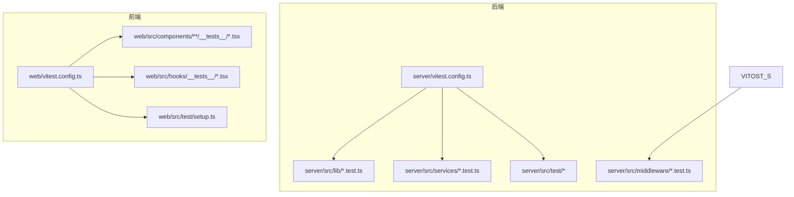
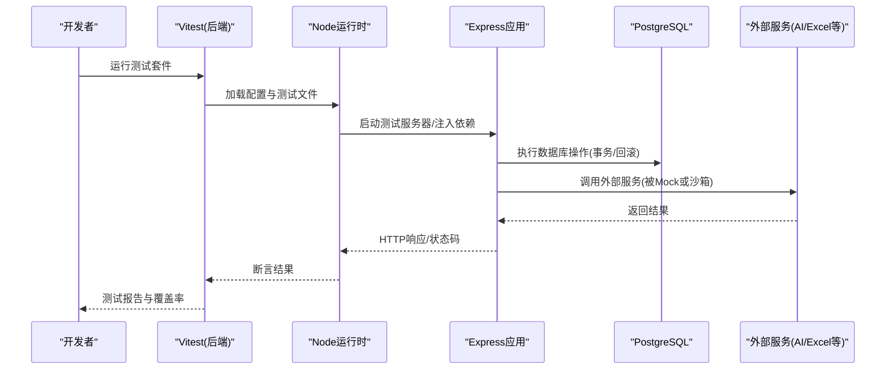
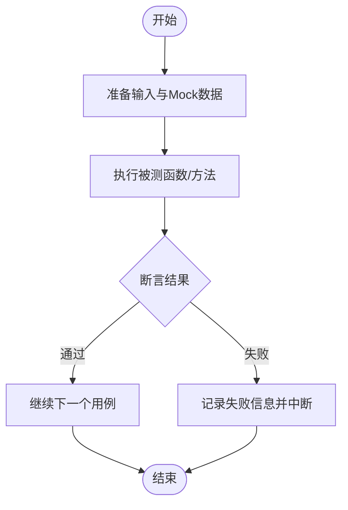
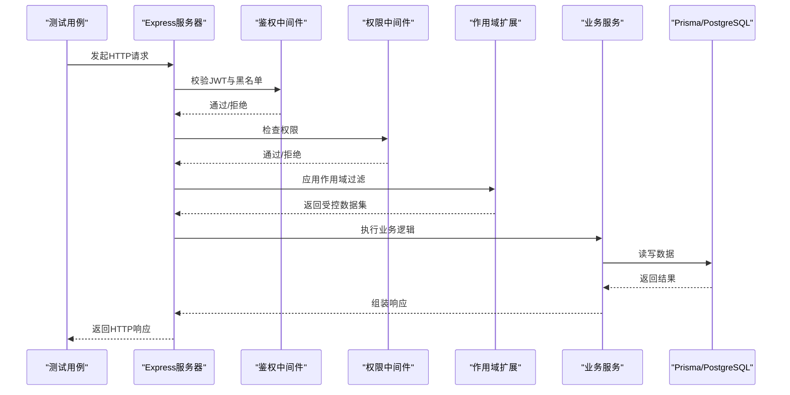
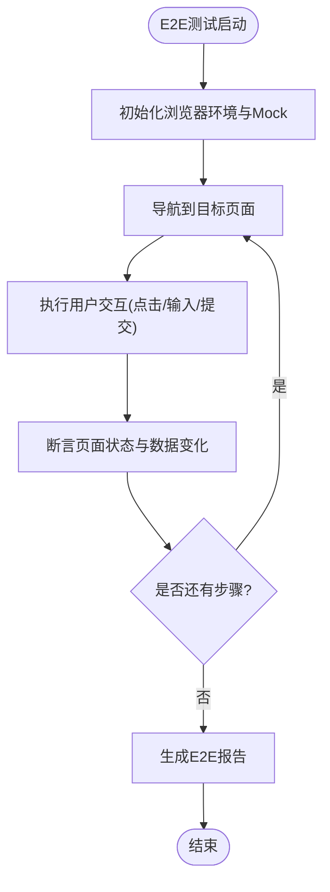
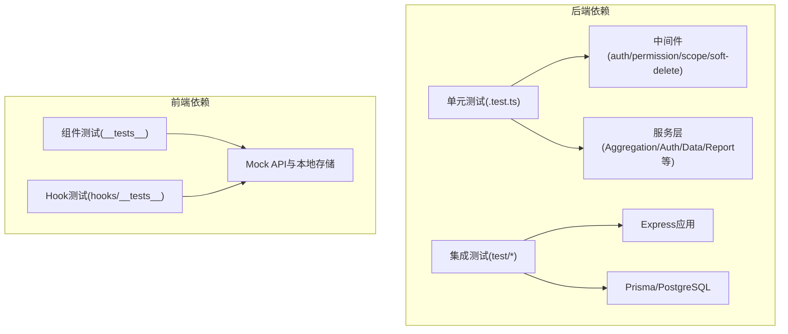

# 测试策略与实践

<cite>
**本文引用的文件**
- [server/vitest.config.ts](file://server/vitest.config.ts)
- [server/package.json](file://server/package.json)
- [server/src/app.test.ts](file://server/src/app.test.ts)
- [server/src/test/setup.ts](file://server/src/test/setup.ts)
- [server/src/test/integration.test.ts](file://server/src/test/integration.test.ts)
- [server/src/test/integration-crud.test.ts](file://server/src/test/integration-crud.test.ts)
- [server/src/test/ai-http.test.ts](file://server/src/test/ai-http.test.ts)
- [server/src/test/reports-http.test.ts](file://server/src/test/reports-http.test.ts)
- [server/src/lib/desensitize.test.ts](file://server/src/lib/desensitize.test.ts)
- [server/src/lib/excel-import.test.ts](file://server/src/lib/excel-import.test.ts)
- [server/src/lib/formula.test.ts](file://server/src/lib/formula.test.ts)
- [server/src/lib/jwt.test.ts](file://server/src/lib/jwt.test.ts)
- [server/src/lib/metric-values.test.ts](file://server/src/lib/metric-values.test.ts)
- [server/src/lib/password.test.ts](file://server/src/lib/password.test.ts)
- [server/src/lib/period.test.ts](file://server/src/lib/period.test.ts)
- [server/src/lib/prompt-guard.test.ts](file://server/src/lib/prompt-guard.test.ts)
- [server/src/lib/sanitize.test.ts](file://server/src/lib/sanitize.test.ts)
- [server/src/middleware/auth.test.ts](file://server/src/middleware/auth.test.ts)
- [server/src/middleware/permission.test.ts](file://server/src/middleware/permission.test.ts)
- [server/src/middleware/scope.test.ts](file://server/src/middleware/scope.test.ts)
- [server/src/middleware/soft-delete.test.ts](file://server/src/middleware/soft-delete.test.ts)
- [server/src/services/AIProxyService.test.ts](file://server/src/services/AIProxyService.test.ts)
- [server/src/services/AggregationService.calc.test.ts](file://server/src/services/AggregationService.calc.test.ts)
- [server/src/services/AggregationService.static.test.ts](file://server/src/services/AggregationService.static.test.ts)
- [server/src/services/AggregationService.ytd.test.ts](file://server/src/services/AggregationService.ytd.test.ts)
- [server/src/services/AuthService.test.ts](file://server/src/services/AuthService.test.ts)
- [server/src/services/DataService.test.ts](file://server/src/services/DataService.test.ts)
- [server/src/services/FormulaRuleService.test.ts](file://server/src/services/FormulaRuleService.test.ts)
- [server/src/services/ImportService.test.ts](file://server/src/services/ImportService.test.ts)
- [server/src/services/ReportService.test.ts](file://server/src/services/ReportService.test.ts)
- [server/src/services/SubjectAnalysisService.test.ts](file://server/src/services/SubjectAnalysisService.test.ts)
- [server/src/services/formula-validation.test.ts](file://server/src/services/formula-validation.test.ts)
- [web/vitest.config.ts](file://web/vitest.config.ts)
- [web/package.json](file://web/package.json)
- [web/src/components/data-table/__tests__/data-table.test.tsx](file://web/src/components/data-table/__tests__/data-table.test.tsx)
- [web/src/components/layout/__tests__/require-permission.test.tsx](file://web/src/components/layout/__tests__/require-permission.test.tsx)
- [web/src/hooks/__tests__/usePermission.test.tsx](file://web/src/hooks/__tests__/usePermission.test.tsx)
- [web/src/test/setup.ts](file://web/src/test/setup.ts)
</cite>

## 目录
1. [简介](#简介)
2. [项目结构](#项目结构)
3. [核心组件](#核心组件)
4. [架构总览](#架构总览)
5. [详细组件分析](#详细组件分析)
6. [依赖分析](#依赖分析)
7. [性能考虑](#性能考虑)
8. [故障排查指南](#故障排查指南)
9. [结论](#结论)
10. [附录](#附录)

## 简介
本文件为FY200项目的测试策略与实践指南，覆盖单元测试、集成测试、端到端（E2E）测试、覆盖率与质量门禁、测试数据与环境隔离、性能与压力测试，以及持续集成中的测试执行与报告生成。项目采用Express后端与Prisma+PostgreSQL，前端基于React/Vite；测试框架统一使用Vitest，配合Node环境或浏览器环境分别运行。

## 项目结构
- 后端测试位于 server/src 下的 lib、middleware、services 及 test 目录，按模块组织 .test.ts 文件，便于定位与维护。
- 前端测试位于 web/src 的 __tests__ 目录与 hooks/__tests__，遵循组件与Hook的就近组织原则。
- Vitest配置分别在 server/vitest.config.ts 与 web/vitest.config.ts，用于区分Node与浏览器环境、Mock策略与覆盖率收集。

**图表来源**
- [server/vitest.config.ts](file://server/vitest.config.ts)
- [web/vitest.config.ts](file://web/vitest.config.ts)

**章节来源**
- [server/vitest.config.ts](file://server/vitest.config.ts)
- [web/vitest.config.ts](file://web/vitest.config.ts)

## 核心组件
- 测试框架与配置：Vitest（Node与浏览器双环境），通过各自 vitest.config.ts 管理测试入口、全局设置、覆盖率与Mock。
- 测试用例组织：
  - 后端：lib、middleware、services 下按功能域拆分 .test.ts；通用集成用例集中于 server/src/test。
  - 前端：组件与Hook的测试与其实现同目录就近放置，便于维护。
- Mock与数据准备：
  - 服务层与中间件测试优先使用内存对象与函数替换，避免真实IO。
  - 数据库相关测试通过 Prisma Client 的隔离事务或测试夹具进行数据准备与清理。
  - AI接口测试通过拦截HTTP请求或使用本地模拟SSE流。

**章节来源**
- [server/src/lib/desensitize.test.ts](file://server/src/lib/desensitize.test.ts)
- [server/src/lib/excel-import.test.ts](file://server/src/lib/excel-import.test.ts)
- [server/src/lib/formula.test.ts](file://server/src/lib/formula.test.ts)
- [server/src/lib/jwt.test.ts](file://server/src/lib/jwt.test.ts)
- [server/src/lib/metric-values.test.ts](file://server/src/lib/metric-values.test.ts)
- [server/src/lib/password.test.ts](file://server/src/lib/password.test.ts)
- [server/src/lib/period.test.ts](file://server/src/lib/period.test.ts)
- [server/src/lib/prompt-guard.test.ts](file://server/src/lib/prompt-guard.test.ts)
- [server/src/lib/sanitize.test.ts](file://server/src/lib/sanitize.test.ts)
- [server/src/middleware/auth.test.ts](file://server/src/middleware/auth.test.ts)
- [server/src/middleware/permission.test.ts](file://server/src/middleware/permission.test.ts)
- [server/src/middleware/scope.test.ts](file://server/src/middleware/scope.test.ts)
- [server/src/middleware/soft-delete.test.ts](file://server/src/middleware/soft-delete.test.ts)
- [server/src/services/AIProxyService.test.ts](file://server/src/services/AIProxyService.test.ts)
- [server/src/services/AggregationService.calc.test.ts](file://server/src/services/AggregationService.calc.test.ts)
- [server/src/services/AggregationService.static.test.ts](file://server/src/services/AggregationService.static.test.ts)
- [server/src/services/AggregationService.ytd.test.ts](file://server/src/services/AggregationService.ytd.test.ts)
- [server/src/services/AuthService.test.ts](file://server/src/services/AuthService.test.ts)
- [server/src/services/DataService.test.ts](file://server/src/services/DataService.test.ts)
- [server/src/services/FormulaRuleService.test.ts](file://server/src/services/FormulaRuleService.test.ts)
- [server/src/services/ImportService.test.ts](file://server/src/services/ImportService.test.ts)
- [server/src/services/ReportService.test.ts](file://server/src/services/ReportService.test.ts)
- [server/src/services/SubjectAnalysisService.test.ts](file://server/src/services/SubjectAnalysisService.test.ts)
- [server/src/services/formula-validation.test.ts](file://server/src/services/formula-validation.test.ts)
- [web/src/components/data-table/__tests__/data-table.test.tsx](file://web/src/components/data-table/__tests__/data-table.test.tsx)
- [web/src/components/layout/__tests__/require-permission.test.tsx](file://web/src/components/layout/__tests__/require-permission.test.tsx)
- [web/src/hooks/__tests__/usePermission.test.tsx](file://web/src/hooks/__tests__/usePermission.test.tsx)

## 架构总览
测试分层与职责划分如下：
- 单元测试：针对纯函数、工具库、中间件逻辑与服务内部计算，快速、稳定、无外部依赖。
- 集成测试：验证API路由、权限链、数据库操作与第三方服务交互，确保端到端流程正确。
- E2E测试：模拟用户完整操作流程与跨页面交互，保障用户体验与业务闭环。

**图表来源**
- [server/src/test/setup.ts](file://server/src/test/setup.ts)
- [server/src/test/integration.test.ts](file://server/src/test/integration.test.ts)
- [server/src/test/integration-crud.test.ts](file://server/src/test/integration-crud.test.ts)
- [server/src/test/ai-http.test.ts](file://server/src/test/ai-http.test.ts)
- [server/src/test/reports-http.test.ts](file://server/src/test/reports-http.test.ts)

## 详细组件分析

### 单元测试编写规范（后端）
- 目标范围：
  - 工具库：脱敏、公式解析、JWT、密码哈希、周期计算、指标值处理、安全校验等。
  - 中间件：鉴权、权限、作用域、软删除等逻辑分支。
  - 服务层：聚合计算、导入导出、报表生成、AI代理等。
- 实践要点：
  - 每个 .test.ts 聚焦单一模块，命名清晰，断言明确。
  - 使用内存对象替代真实依赖，必要时对第三方模块进行Mock。
  - 边界条件与异常路径需覆盖，保证鲁棒性。
- 参考用例：
  - 工具库：[desensitize.test.ts](file://server/src/lib/desensitize.test.ts)、[formula.test.ts](file://server/src/lib/formula.test.ts)、[jwt.test.ts](file://server/src/lib/jwt.test.ts)、[password.test.ts](file://server/src/lib/password.test.ts)、[period.test.ts](file://server/src/lib/period.test.ts)、[metric-values.test.ts](file://server/src/lib/metric-values.test.ts)、[prompt-guard.test.ts](file://server/src/lib/prompt-guard.test.ts)、[sanitize.test.ts](file://server/src/lib/sanitize.test.ts)、[excel-import.test.ts](file://server/src/lib/excel-import.test.ts)
  - 中间件：[auth.test.ts](file://server/src/middleware/auth.test.ts)、[permission.test.ts](file://server/src/middleware/permission.test.ts)、[scope.test.ts](file://server/src/middleware/scope.test.ts)、[soft-delete.test.ts](file://server/src/middleware/soft-delete.test.ts)
  - 服务层：[AggregationService.*.test.ts](file://server/src/services/AggregationService.calc.test.ts)、[AuthService.test.ts](file://server/src/services/AuthService.test.ts)、[DataService.test.ts](file://server/src/services/DataService.test.ts)、[FormulaRuleService.test.ts](file://server/src/services/FormulaRuleService.test.ts)、[ImportService.test.ts](file://server/src/services/ImportService.test.ts)、[ReportService.test.ts](file://server/src/services/ReportService.test.ts)、[SubjectAnalysisService.test.ts](file://server/src/services/SubjectAnalysisService.test.ts)、[AIProxyService.test.ts](file://server/src/services/AIProxyService.test.ts)、[formula-validation.test.ts](file://server/src/services/formula-validation.test.ts)

**图表来源**
- [server/src/lib/formula.test.ts](file://server/src/lib/formula.test.ts)
- [server/src/middleware/auth.test.ts](file://server/src/middleware/auth.test.ts)
- [server/src/services/AggregationService.calc.test.ts](file://server/src/services/AggregationService.calc.test.ts)

**章节来源**
- [server/src/lib/desensitize.test.ts](file://server/src/lib/desensitize.test.ts)
- [server/src/lib/excel-import.test.ts](file://server/src/lib/excel-import.test.ts)
- [server/src/lib/formula.test.ts](file://server/src/lib/formula.test.ts)
- [server/src/lib/jwt.test.ts](file://server/src/lib/jwt.test.ts)
- [server/src/lib/metric-values.test.ts](file://server/src/lib/metric-values.test.ts)
- [server/src/lib/password.test.ts](file://server/src/lib/password.test.ts)
- [server/src/lib/period.test.ts](file://server/src/lib/period.test.ts)
- [server/src/lib/prompt-guard.test.ts](file://server/src/lib/prompt-guard.test.ts)
- [server/src/lib/sanitize.test.ts](file://server/src/lib/sanitize.test.ts)
- [server/src/middleware/auth.test.ts](file://server/src/middleware/auth.test.ts)
- [server/src/middleware/permission.test.ts](file://server/src/middleware/permission.test.ts)
- [server/src/middleware/scope.test.ts](file://server/src/middleware/scope.test.ts)
- [server/src/middleware/soft-delete.test.ts](file://server/src/middleware/soft-delete.test.ts)
- [server/src/services/AIProxyService.test.ts](file://server/src/services/AIProxyService.test.ts)
- [server/src/services/AggregationService.calc.test.ts](file://server/src/services/AggregationService.calc.test.ts)
- [server/src/services/AggregationService.static.test.ts](file://server/src/services/AggregationService.static.test.ts)
- [server/src/services/AggregationService.ytd.test.ts](file://server/src/services/AggregationService.ytd.test.ts)
- [server/src/services/AuthService.test.ts](file://server/src/services/AuthService.test.ts)
- [server/src/services/DataService.test.ts](file://server/src/services/DataService.test.ts)
- [server/src/services/FormulaRuleService.test.ts](file://server/src/services/FormulaRuleService.test.ts)
- [server/src/services/ImportService.test.ts](file://server/src/services/ImportService.test.ts)
- [server/src/services/ReportService.test.ts](file://server/src/services/ReportService.test.ts)
- [server/src/services/SubjectAnalysisService.test.ts](file://server/src/services/SubjectAnalysisService.test.ts)
- [server/src/services/formula-validation.test.ts](file://server/src/services/formula-validation.test.ts)

### 集成测试策略（后端）
- API接口测试：
  - 覆盖认证、授权、作用域、审计、限流等中间件链。
  - 验证路由响应状态码、数据结构与错误处理。
  - 参考用例：[integration.test.ts](file://server/src/test/integration.test.ts)、[integration-crud.test.ts](file://server/src/test/integration-crud.test.ts)、[reports-http.test.ts](file://server/src/test/reports-http.test.ts)、[ai-http.test.ts](file://server/src/test/ai-http.test.ts)
- 数据库操作测试：
  - 使用Prisma在事务中创建与清理数据，确保测试隔离与可重复性。
  - 验证CRUD、关联查询、软删除行为与约束。
- 第三方服务集成测试：
  - AI代理接口通过HTTP拦截或本地SSE模拟，避免真实网络调用。
  - Excel导入/导出通过内存文件与虚拟文件系统模拟。

**图表来源**
- [server/src/test/integration.test.ts](file://server/src/test/integration.test.ts)
- [server/src/test/integration-crud.test.ts](file://server/src/test/integration-crud.test.ts)
- [server/src/test/reports-http.test.ts](file://server/src/test/reports-http.test.ts)
- [server/src/test/ai-http.test.ts](file://server/src/test/ai-http.test.ts)

**章节来源**
- [server/src/test/integration.test.ts](file://server/src/test/integration.test.ts)
- [server/src/test/integration-crud.test.ts](file://server/src/test/integration-crud.test.ts)
- [server/src/test/reports-http.test.ts](file://server/src/test/reports-http.test.ts)
- [server/src/test/ai-http.test.ts](file://server/src/test/ai-http.test.ts)

### E2E测试方案（前端）
- 用户流程测试：登录、看板浏览、报表编辑、数据导入导出等关键路径。
- 跨页面交互测试：路由跳转、权限控制、状态同步与数据一致性。
- 实施建议：
  - 使用Vitest的浏览器模式或结合Playwright/Cypress进行UI自动化。
  - 通过Mock API与本地存储模拟用户会话与权限。
  - 参考前端测试组织：[data-table.test.tsx](file://web/src/components/data-table/__tests__/data-table.test.tsx)、[require-permission.test.tsx](file://web/src/components/layout/__tests__/require-permission.test.tsx)、[usePermission.test.tsx](file://web/src/hooks/__tests__/usePermission.test.tsx)。

**图表来源**
- [web/src/components/data-table/__tests__/data-table.test.tsx](file://web/src/components/data-table/__tests__/data-table.test.tsx)
- [web/src/components/layout/__tests__/require-permission.test.tsx](file://web/src/components/layout/__tests__/require-permission.test.tsx)
- [web/src/hooks/__tests__/usePermission.test.tsx](file://web/src/hooks/__tests__/usePermission.test.tsx)

**章节来源**
- [web/src/components/data-table/__tests__/data-table.test.tsx](file://web/src/components/data-table/__tests__/data-table.test.tsx)
- [web/src/components/layout/__tests__/require-permission.test.tsx](file://web/src/components/layout/__tests__/require-permission.test.tsx)
- [web/src/hooks/__tests__/usePermission.test.tsx](file://web/src/hooks/__tests__/usePermission.test.tsx)

### 测试覆盖率要求与质量门禁
- 覆盖率目标：
  - 行覆盖率≥80%，分支覆盖率≥70%，函数覆盖率≥80%，语句覆盖率≥80%。
  - 关键模块（鉴权、权限、作用域、公式解析、导入导出）覆盖率阈值提升至≥90%。
- 质量门禁：
  - CI中若覆盖率低于阈值或测试失败，构建失败并阻止合并。
  - 新增代码必须附带对应测试用例，未覆盖变更将被标记。
- 报告输出：
  - 生成HTML与JSON覆盖率报告，便于审查与归档。

**章节来源**
- [server/vitest.config.ts](file://server/vitest.config.ts)
- [web/vitest.config.ts](file://web/vitest.config.ts)

### 测试数据管理与测试环境隔离
- 测试数据管理：
  - 使用种子脚本与固定夹具，确保数据一致性与可重现性。
  - 敏感数据脱敏与动态映射，避免泄露。
- 环境隔离：
  - 后端使用独立PostgreSQL实例或Docker容器，测试前初始化Schema与基础数据。
  - 前端使用独立的Mock API与本地存储，避免影响真实环境。
- 清理策略：
  - 每个测试用例结束后自动回滚事务或删除临时数据。

**章节来源**
- [server/src/test/setup.ts](file://server/src/test/setup.ts)
- [web/src/test/setup.ts](file://web/src/test/setup.ts)

### 性能测试与压力测试
- 后端性能测试：
  - 使用基准测试与负载工具（如autocannon/k6）对关键API进行压测。
  - 关注CPU、内存、数据库连接池与慢查询。
- 前端性能测试：
  - 使用Lighthouse或WebPageTest评估首屏渲染、资源加载与交互延迟。
- 指标监控：
  - 引入日志与指标采集，记录耗时、错误率与吞吐。

**章节来源**
- [server/package.json](file://server/package.json)
- [web/package.json](file://web/package.json)

### 持续集成中的测试执行与报告生成
- 执行顺序：
  - 先运行单元测试，再运行集成测试，最后执行E2E测试。
- 并行执行：
  - 利用Vitest的并行能力加速测试套件执行。
- 报告归档：
  - 生成覆盖率报告与测试日志，上传至CI产物或报告平台。
- 失败处理：
  - 捕获失败用例详情，提供调试信息与重试机制。

**章节来源**
- [server/vitest.config.ts](file://server/vitest.config.ts)
- [web/vitest.config.ts](file://web/vitest.config.ts)

## 依赖分析
- 后端测试依赖：
  - Express应用、Prisma客户端、JWT与中间件链。
  - 外部服务（AI、Excel）通过Mock或沙箱隔离。
- 前端测试依赖：
  - React组件、Hooks与路由，依赖Mock API与本地状态。
- 耦合与内聚：
  - 测试用例与实现模块高内聚，减少跨模块依赖。
  - 通过依赖注入与Mock降低耦合度。

**图表来源**
- [server/src/middleware/auth.test.ts](file://server/src/middleware/auth.test.ts)
- [server/src/services/AggregationService.calc.test.ts](file://server/src/services/AggregationService.calc.test.ts)
- [web/src/components/data-table/__tests__/data-table.test.tsx](file://web/src/components/data-table/__tests__/data-table.test.tsx)
- [web/src/hooks/__tests__/usePermission.test.tsx](file://web/src/hooks/__tests__/usePermission.test.tsx)

**章节来源**
- [server/src/middleware/auth.test.ts](file://server/src/middleware/auth.test.ts)
- [server/src/services/AggregationService.calc.test.ts](file://server/src/services/AggregationService.calc.test.ts)
- [web/src/components/data-table/__tests__/data-table.test.tsx](file://web/src/components/data-table/__tests__/data-table.test.tsx)
- [web/src/hooks/__tests__/usePermission.test.tsx](file://web/src/hooks/__tests__/usePermission.test.tsx)

## 性能考虑
- 测试执行优化：
  - 合理拆分测试套件，避免单文件过大导致执行缓慢。
  - 使用缓存与并行执行提升速度。
- 资源管理：
  - 数据库连接池与事务复用，减少开销。
  - 前端Mock减少网络请求与渲染负担。
- 监控与调优：
  - 记录测试耗时与资源占用，识别瓶颈并优化。

[本节为通用指导，不直接分析具体文件]

## 故障排查指南
- 常见问题：
  - 数据库连接失败：检查环境变量与连接字符串，确认PostgreSQL实例可用。
  - 权限校验失败：验证JWT令牌与权限配置，检查中间件链顺序。
  - AI接口超时：确认Mock或代理服务正常，调整超时与重试策略。
- 调试技巧：
  - 启用详细日志与追踪ID，定位问题链路。
  - 使用断点与逐步执行，观察状态变化。
- 恢复措施：
  - 重置测试数据与状态，重新执行失败用例。
  - 隔离外部依赖，逐步缩小问题范围。

**章节来源**
- [server/src/test/setup.ts](file://server/src/test/setup.ts)
- [server/src/middleware/auth.test.ts](file://server/src/middleware/auth.test.ts)
- [server/src/test/ai-http.test.ts](file://server/src/test/ai-http.test.ts)

## 结论
本测试策略与实践指南围绕FY200项目的技术栈与业务特点，构建了从单元到E2E的多层次测试体系。通过严格的覆盖率与质量门禁、完善的测试数据与环境隔离、以及持续集成的自动化执行，确保代码质量与交付稳定性。建议持续优化测试用例与性能，保持与业务演进同步。

[本节为总结性内容，不直接分析具体文件]

## 附录
- 最佳实践清单：
  - 每个新功能必须包含对应测试用例。
  - 复杂逻辑需提供边界与异常用例。
  - 定期审查覆盖率与失败用例，及时修复。
- 工具与命令：
  - 运行测试：根据package.json中的脚本执行相应命令。
  - 生成报告：使用Vitest内置报告功能输出HTML与JSON。

**章节来源**
- [server/package.json](file://server/package.json)
- [web/package.json](file://web/package.json)