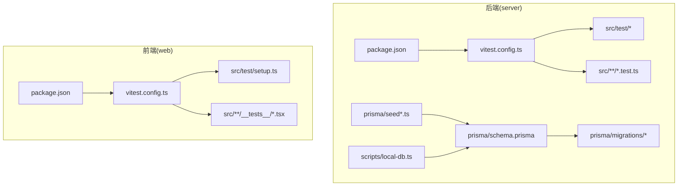
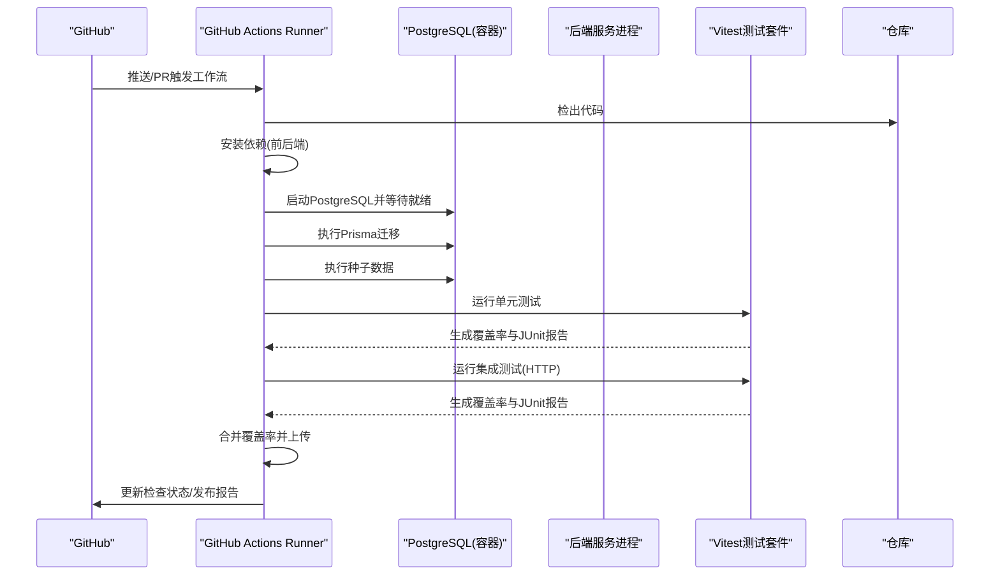
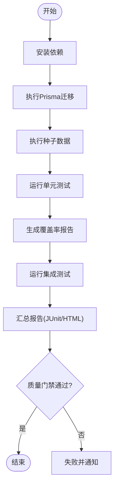
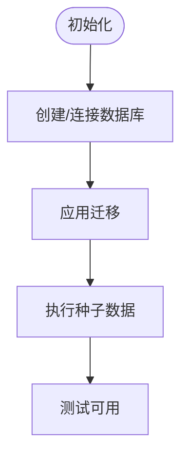
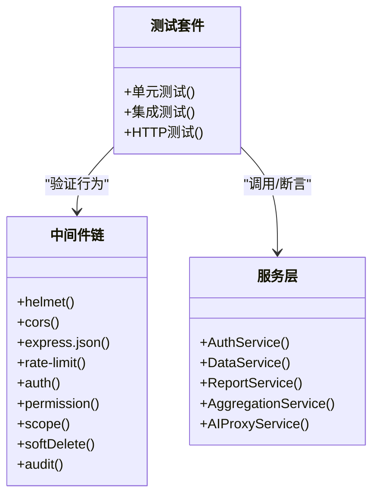
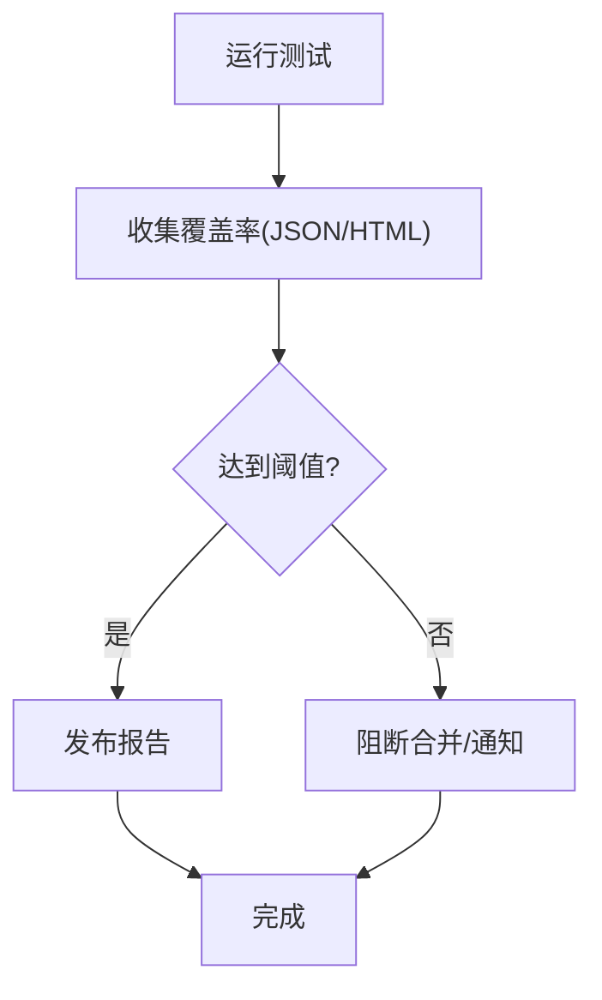
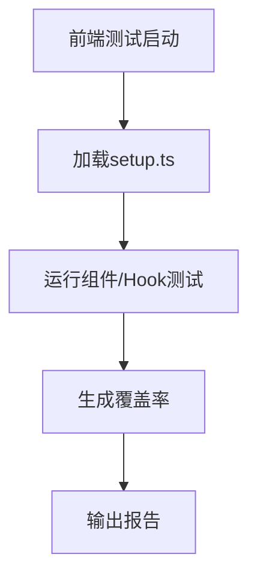
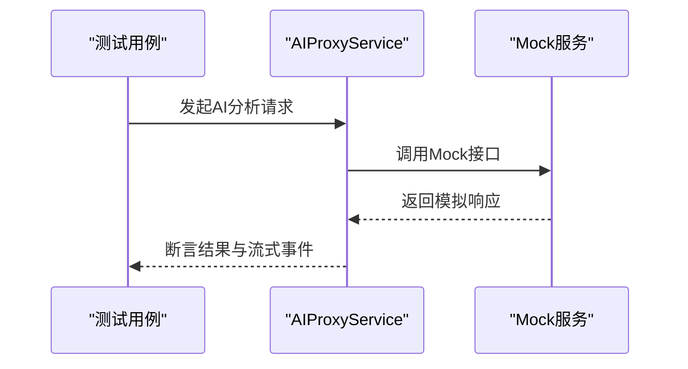
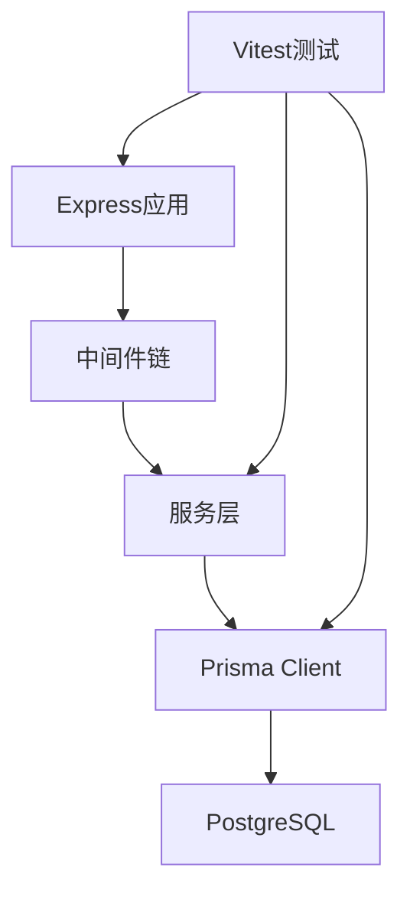

# 测试自动化与CI/CD

<cite>
**本文引用的文件**   
- [server/package.json](file://server/package.json)
- [server/vitest.config.ts](file://server/vitest.config.ts)
- [server/src/test/setup.ts](file://server/src/test/setup.ts)
- [server/src/test/integration.test.ts](file://server/src/test/integration.test.ts)
- [server/src/test/integration-crud.test.ts](file://server/src/test/integration-crud.test.ts)
- [server/src/test/reports-http.test.ts](file://server/src/test/reports-http.test.ts)
- [server/src/test/ai-http.test.ts](file://server/src/test/ai-http.test.ts)
- [server/src/lib/desensitize.test.ts](file://server/src/lib/desensitize.test.ts)
- [server/src/lib/excel-import.test.ts](file://server/src/lib/excel-import.test.ts)
- [server/src/lib/formula.test.ts](file://server/src/lib/formula.test.ts)
- [server/src/lib/jwt.test.ts](file://server/src/lib/jwt.test.ts)
- [server/src/lib/metric-values.test.ts](file://server/src/lib/metric-values.test.ts)
- [server/src/lib/password.test.ts](file://server/src/lib/password.test.ts)
- [server/src/lib/period.test.ts](file://server/src/lib/period.test.ts)
- [server/src/lib/prompt-guard.test.ts](file://server/src/lib/prompt-guard.test.ts)
- [server/src/lib/sanitize.test.ts](file://server/src/lib/sanitize.test.ts)
- [server/src/middleware/auth.test.ts](file://server/src/middleware/auth.test.ts)
- [server/src/middleware/permission.test.ts](file://server/src/middleware/permission.test.ts)
- [server/src/middleware/scope.test.ts](file://server/src/middleware/scope.test.ts)
- [server/src/middleware/soft-delete.test.ts](file://server/src/middleware/soft-delete.test.ts)
- [server/src/services/AIProxyService.test.ts](file://server/src/services/AIProxyService.test.ts)
- [server/src/services/AggregationService.calc.test.ts](file://server/src/services/AggregationService.calc.test.ts)
- [server/src/services/AggregationService.static.test.ts](file://server/src/services/AggregationService.static.test.ts)
- [server/src/services/AggregationService.ytd.test.ts](file://server/src/services/AggregationService.ytd.test.ts)
- [server/src/services/AuthService.test.ts](file://server/src/services/AuthService.test.ts)
- [server/src/services/DataService.test.ts](file://server/src/services/DataService.test.ts)
- [server/src/services/FormulaRuleService.test.ts](file://server/src/services/FormulaRuleService.test.ts)
- [server/src/services/ImportService.test.ts](file://server/src/services/ImportService.test.ts)
- [server/src/services/ReportService.test.ts](file://server/src/services/ReportService.test.ts)
- [server/src/services/SubjectAnalysisService.test.ts](file://server/src/services/SubjectAnalysisService.test.ts)
- [server/src/services/formula-validation.test.ts](file://server/src/services/formula-validation.test.ts)
- [server/src/app.test.ts](file://server/src/app.test.ts)
- [server/prisma/schema.prisma](file://server/prisma/schema.prisma)
- [server/prisma/migrations/20260722121714_init/migration.sql](file://server/prisma/migrations/20260722121714_init/migration.sql)
- [server/prisma/migrations/20260722142144_add_formula_rule/migration.sql](file://server/prisma/migrations/20260722142144_add_formula_rule/migration.sql)
- [server/prisma/migrations/20260723120000_add_subject_analysis/migration.sql](file://server/prisma/migrations/20260723120000_add_subject_analysis/migration.sql)
- [server/prisma/migrations/20260724120000_remove_business_unit_org_scope/migration.sql](file://server/prisma/migrations/20260724120000_remove_business_unit_org_scope/migration.sql)
- [server/prisma/seed.ts](file://server/prisma/seed.ts)
- [server/prisma/seed-companies.ts](file://server/prisma/seed-companies.ts)
- [server/prisma/seed-domain.ts](file://server/prisma/seed-domain.ts)
- [server/scripts/local-db.ts](file://server/scripts/local-db.ts)
- [web/package.json](file://web/package.json)
- [web/vitest.config.ts](file://web/vitest.config.ts)
- [web/src/test/setup.ts](file://web/src/test/setup.ts)
</cite>

## 目录
1. [简介](#简介)
2. [项目结构](#项目结构)
3. [核心组件](#核心组件)
4. [架构总览](#架构总览)
5. [详细组件分析](#详细组件分析)
6. [依赖关系分析](#依赖关系分析)
7. [性能考虑](#性能考虑)
8. [故障排查指南](#故障排查指南)
9. [结论](#结论)
10. [附录](#附录)

## 简介
本文件面向FY200项目的测试自动化与持续集成（CI/CD）实践，目标是：
- 明确GitHub Actions工作流配置要点：自动测试执行、测试报告生成、质量门禁设置。
- 阐述测试覆盖率收集与分析：阈值策略、报告解读与改进建议。
- 自动化测试环境搭建：PostgreSQL初始化、Mock服务启动、测试数据准备。
- 并行执行与缓存优化策略：加速CI流水线。
- 在CI中集成多类型测试：单元测试、集成测试、HTTP接口测试、性能测试。
- 失败通知与故障排查：定位问题、快速恢复。

本项目后端技术栈为Express + Prisma + PostgreSQL + JWT + DeepSeek API（SSE），中间件链顺序固定，计算类指标使用安全公式解析，AI双管道架构包含脱敏与还原流程。

## 项目结构
FY200采用前后端分离结构，测试相关主要位于server与web两个子工程：
- server：后端Express应用，包含Prisma数据库定义、迁移、种子脚本、Vitest测试配置与大量单测/集成测试。
- web：前端React应用，包含Vitest测试配置与部分组件/Hook测试。

图表来源
- [server/package.json](file://server/package.json)
- [server/vitest.config.ts](file://server/vitest.config.ts)
- [server/src/test/setup.ts](file://server/src/test/setup.ts)
- [server/prisma/schema.prisma](file://server/prisma/schema.prisma)
- [server/prisma/migrations/20260722121714_init/migration.sql](file://server/prisma/migrations/20260722121714_init/migration.sql)
- [server/prisma/seed.ts](file://server/prisma/seed.ts)
- [web/package.json](file://web/package.json)
- [web/vitest.config.ts](file://web/vitest.config.ts)
- [web/src/test/setup.ts](file://web/src/test/setup.ts)

章节来源
- [server/package.json](file://server/package.json)
- [server/vitest.config.ts](file://server/vitest.config.ts)
- [web/package.json](file://web/package.json)
- [web/vitest.config.ts](file://web/vitest.config.ts)

## 核心组件
- 测试框架与配置
  - Vitest用于前后端测试，配置文件分别位于server与web根目录。
  - 测试入口与全局初始化脚本位于各自src/test/setup.ts。
- 数据库与迁移
  - Prisma schema定义数据模型，migrations目录存放增量迁移SQL。
  - 种子脚本提供测试数据初始化能力。
- 测试分类
  - 单元测试：lib、middleware、services下的*.test.ts。
  - 集成测试：server/src/test下integration*与HTTP测试。
  - HTTP接口测试：针对路由的端到端请求验证。
  - 性能测试：可通过脚本或专用工具在CI中编排。

章节来源
- [server/vitest.config.ts](file://server/vitest.config.ts)
- [server/src/test/setup.ts](file://server/src/test/setup.ts)
- [server/prisma/schema.prisma](file://server/prisma/schema.prisma)
- [server/prisma/migrations/20260722121714_init/migration.sql](file://server/prisma/migrations/20260722121714_init/migration.sql)
- [server/prisma/seed.ts](file://server/prisma/seed.ts)

## 架构总览
下图展示CI流水线的关键阶段与环境交互：代码提交触发GitHub Actions，拉取代码后安装依赖、构建、运行数据库迁移与种子数据、执行各类测试并生成覆盖率与报告，最后进行质量门禁与通知。

图表来源
- [server/package.json](file://server/package.json)
- [server/vitest.config.ts](file://server/vitest.config.ts)
- [server/src/test/setup.ts](file://server/src/test/setup.ts)
- [server/prisma/schema.prisma](file://server/prisma/schema.prisma)
- [server/prisma/migrations/20260722121714_init/migration.sql](file://server/prisma/migrations/20260722121714_init/migration.sql)
- [server/prisma/seed.ts](file://server/prisma/seed.ts)

## 详细组件分析

### 后端测试配置与执行
- 测试框架：Vitest
- 配置文件：server/vitest.config.ts
- 全局初始化：server/src/test/setup.ts
- 测试覆盖范围：
  - 单元测试：lib、middleware、services等模块的*.test.ts
  - 集成测试：server/src/test下的integration与HTTP测试
- 覆盖率：通过Vitest内置覆盖率插件输出JSON/HTML/JUnit

图表来源
- [server/vitest.config.ts](file://server/vitest.config.ts)
- [server/src/test/setup.ts](file://server/src/test/setup.ts)
- [server/package.json](file://server/package.json)

章节来源
- [server/vitest.config.ts](file://server/vitest.config.ts)
- [server/src/test/setup.ts](file://server/src/test/setup.ts)
- [server/package.json](file://server/package.json)

### 数据库初始化与测试数据
- 数据模型：Prisma schema定义实体与关系
- 迁移：migrations目录按版本管理变更
- 种子：seed*.ts提供基础数据（公司、领域、科目树等）
- 本地脚本：scripts/local-db.ts辅助本地调试

图表来源
- [server/prisma/schema.prisma](file://server/prisma/schema.prisma)
- [server/prisma/migrations/20260722121714_init/migration.sql](file://server/prisma/migrations/20260722121714_init/migration.sql)
- [server/prisma/migrations/20260722142144_add_formula_rule/migration.sql](file://server/prisma/migrations/20260722142144_add_formula_rule/migration.sql)
- [server/prisma/migrations/20260723120000_add_subject_analysis/migration.sql](file://server/prisma/migrations/20260723120000_add_subject_analysis/migration.sql)
- [server/prisma/migrations/20260724120000_remove_business_unit_org_scope/migration.sql](file://server/prisma/migrations/20260724120000_remove_business_unit_org_scope/migration.sql)
- [server/prisma/seed.ts](file://server/prisma/seed.ts)
- [server/prisma/seed-companies.ts](file://server/prisma/seed-companies.ts)
- [server/prisma/seed-domain.ts](file://server/prisma/seed-domain.ts)
- [server/scripts/local-db.ts](file://server/scripts/local-db.ts)

章节来源
- [server/prisma/schema.prisma](file://server/prisma/schema.prisma)
- [server/prisma/seed.ts](file://server/prisma/seed.ts)
- [server/scripts/local-db.ts](file://server/scripts/local-db.ts)

### 单元测试与集成测试组织
- 单元测试：聚焦纯函数、工具库、中间件逻辑、服务层方法
- 集成测试：基于真实数据库与Express应用，模拟HTTP请求验证路由与中间件链
- HTTP测试：覆盖认证、权限、限流、审计、软删除等关键路径

图表来源
- [server/src/middleware/auth.test.ts](file://server/src/middleware/auth.test.ts)
- [server/src/middleware/permission.test.ts](file://server/src/middleware/permission.test.ts)
- [server/src/middleware/scope.test.ts](file://server/src/middleware/scope.test.ts)
- [server/src/middleware/soft-delete.test.ts](file://server/src/middleware/soft-delete.test.ts)
- [server/src/services/AuthService.test.ts](file://server/src/services/AuthService.test.ts)
- [server/src/services/DataService.test.ts](file://server/src/services/DataService.test.ts)
- [server/src/services/ReportService.test.ts](file://server/src/services/ReportService.test.ts)
- [server/src/services/AggregationService.calc.test.ts](file://server/src/services/AggregationService.calc.test.ts)
- [server/src/services/AggregationService.static.test.ts](file://server/src/services/AggregationService.static.test.ts)
- [server/src/services/AggregationService.ytd.test.ts](file://server/src/services/AggregationService.ytd.test.ts)
- [server/src/services/AIProxyService.test.ts](file://server/src/services/AIProxyService.test.ts)

章节来源
- [server/src/test/integration.test.ts](file://server/src/test/integration.test.ts)
- [server/src/test/integration-crud.test.ts](file://server/src/test/integration-crud.test.ts)
- [server/src/test/reports-http.test.ts](file://server/src/test/reports-http.test.ts)
- [server/src/test/ai-http.test.ts](file://server/src/test/ai-http.test.ts)

### 覆盖率收集与质量门禁
- 覆盖率采集：Vitest覆盖率插件输出JSON/HTML/JUnit
- 阈值策略：建议在CI中设置最低覆盖率阈值（如行覆盖率≥80%、分支覆盖率≥70%）
- 报告归档：将HTML与JUnit报告作为工件上传，便于查看历史趋势
- 门禁规则：未达阈值则标记失败并阻止合并

图表来源
- [server/vitest.config.ts](file://server/vitest.config.ts)
- [server/package.json](file://server/package.json)

章节来源
- [server/vitest.config.ts](file://server/vitest.config.ts)
- [server/package.json](file://server/package.json)

### 前端测试与配置
- 测试框架：Vitest
- 配置文件：web/vitest.config.ts
- 全局初始化：web/src/test/setup.ts
- 测试范围：组件、Hook、工具函数等

图表来源
- [web/vitest.config.ts](file://web/vitest.config.ts)
- [web/src/test/setup.ts](file://web/src/test/setup.ts)
- [web/package.json](file://web/package.json)

章节来源
- [web/vitest.config.ts](file://web/vitest.config.ts)
- [web/src/test/setup.ts](file://web/src/test/setup.ts)
- [web/package.json](file://web/package.json)

### AI与外部服务Mock策略
- AI代理服务：AIProxyService.test.ts覆盖SSE流式响应与错误处理
- Mock策略：对第三方API（如DeepSeek）使用本地Mock或内存存储，避免网络依赖
- 隔离性：确保测试不依赖外部服务可用性

图表来源
- [server/src/services/AIProxyService.test.ts](file://server/src/services/AIProxyService.test.ts)

章节来源
- [server/src/services/AIProxyService.test.ts](file://server/src/services/AIProxyService.test.ts)

## 依赖关系分析
- 后端依赖：Express、Prisma、PostgreSQL、JWT、DeepSeek API
- 测试依赖：Vitest、覆盖率插件、可选的HTTP客户端（如supertest）
- 前端依赖：React生态、Vitest、UI测试库（如有）

图表来源
- [server/package.json](file://server/package.json)
- [server/vitest.config.ts](file://server/vitest.config.ts)
- [server/prisma/schema.prisma](file://server/prisma/schema.prisma)

章节来源
- [server/package.json](file://server/package.json)
- [server/vitest.config.ts](file://server/vitest.config.ts)
- [server/prisma/schema.prisma](file://server/prisma/schema.prisma)

## 性能考虑
- 并行执行：按模块或文件并行运行测试，缩短CI时间
- 缓存策略：缓存node_modules、Prisma生成产物、覆盖率缓存
- 数据库预热：复用容器镜像与卷，减少冷启动开销
- 资源限制：合理分配Runner CPU/内存，避免OOM

[本节为通用指导，无需引用具体文件]

## 故障排查指南
- 常见失败原因
  - 数据库连接失败：检查环境变量、端口、迁移是否成功
  - 测试数据缺失：确认种子脚本执行
  - 外部服务不可用：确保Mock生效
  - 覆盖率阈值不达标：定位未覆盖模块并补充测试
- 定位步骤
  - 查看CI日志与JUnit报告
  - 复现本地测试（scripts/local-db.ts）
  - 逐步缩小范围（单测→集成测试→HTTP测试）
- 恢复措施
  - 清理并重建数据库
  - 重置依赖与缓存
  - 回滚可疑变更

章节来源
- [server/scripts/local-db.ts](file://server/scripts/local-db.ts)
- [server/src/test/setup.ts](file://server/src/test/setup.ts)

## 结论
通过统一的Vitest配置、Prisma迁移与种子数据、严格的覆盖率门禁与并行执行策略，FY200项目可在CI中实现稳定高效的测试自动化。结合Mock策略与完善的故障排查流程，可显著降低回归风险并提升交付质量。

[本节为总结，无需引用具体文件]

## 附录
- GitHub Actions工作流建议
  - 触发条件：push到main/release分支、PR事件
  - 阶段：安装依赖、构建、数据库初始化、测试（单元/集成/HTTP）、覆盖率、报告归档、门禁、通知
- 覆盖率阈值建议
  - 行覆盖率≥80%，分支覆盖率≥70%，函数覆盖率≥85%
- 通知渠道
  - Slack/邮件/企业微信机器人，失败时即时提醒

[本节为通用指导，无需引用具体文件]