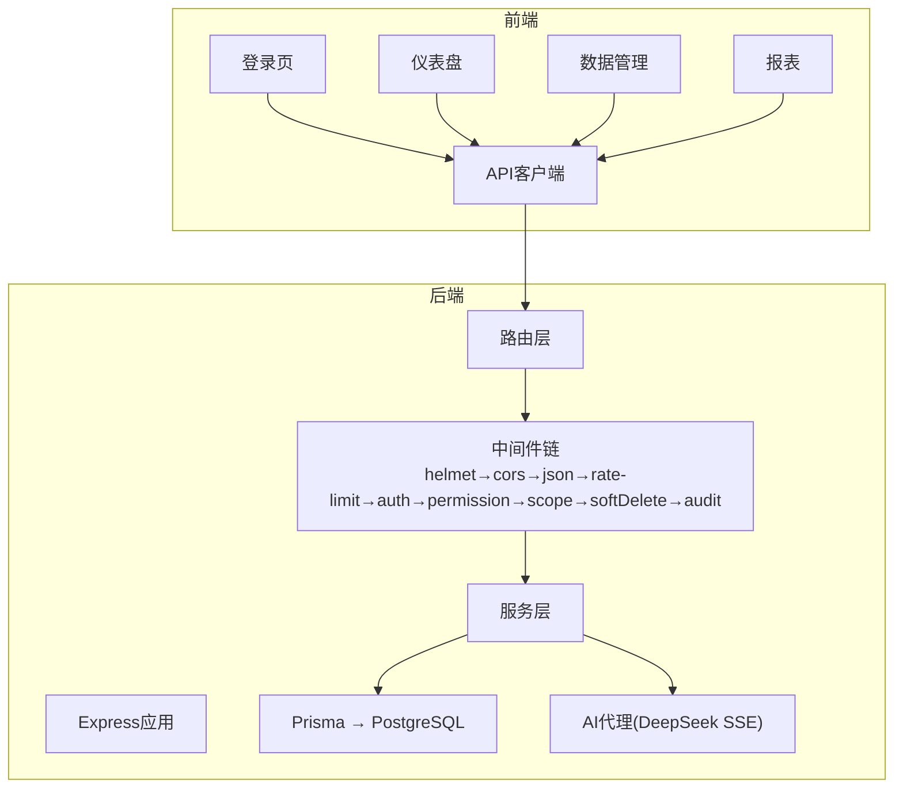
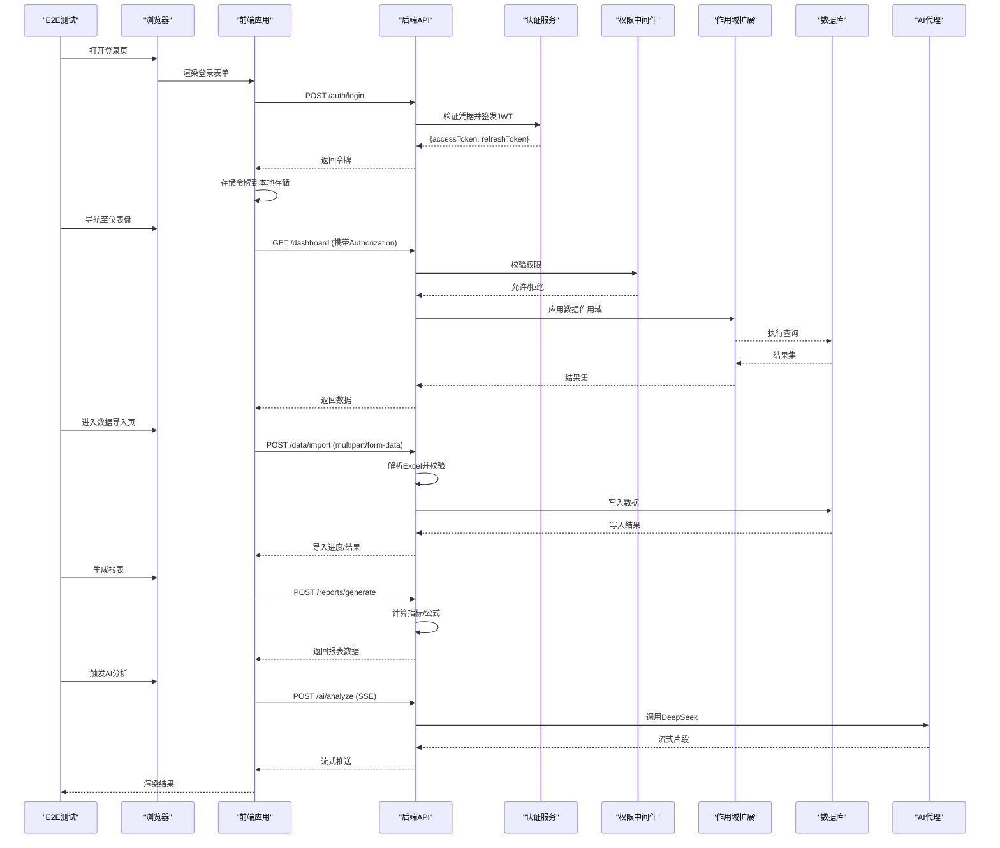
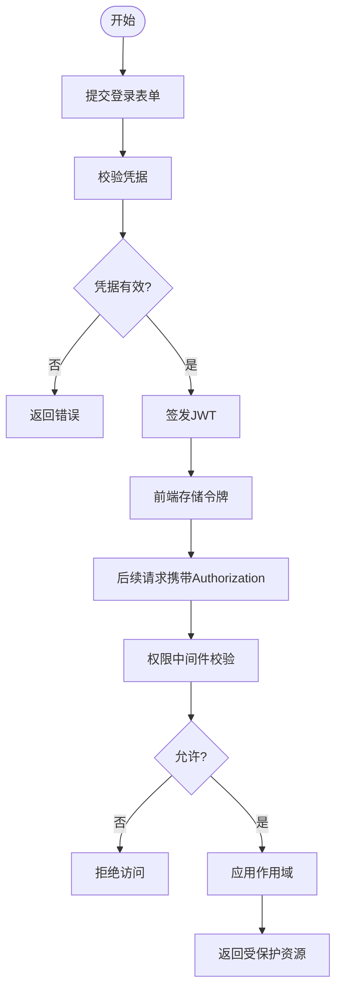
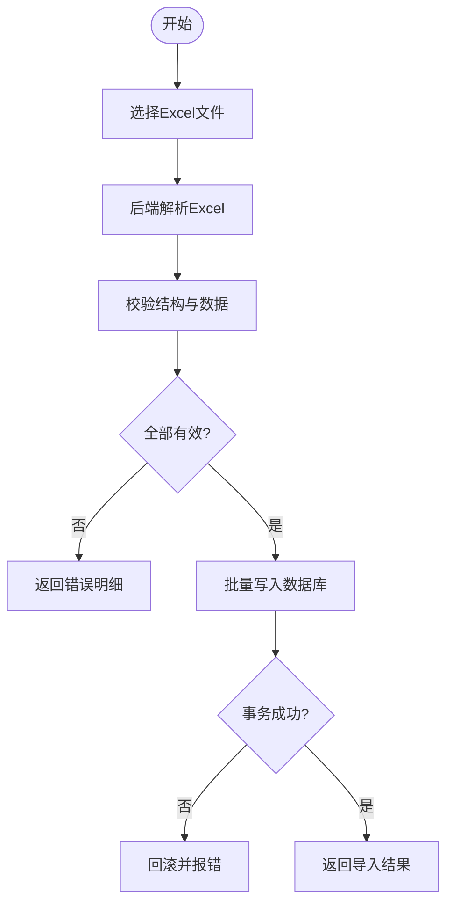
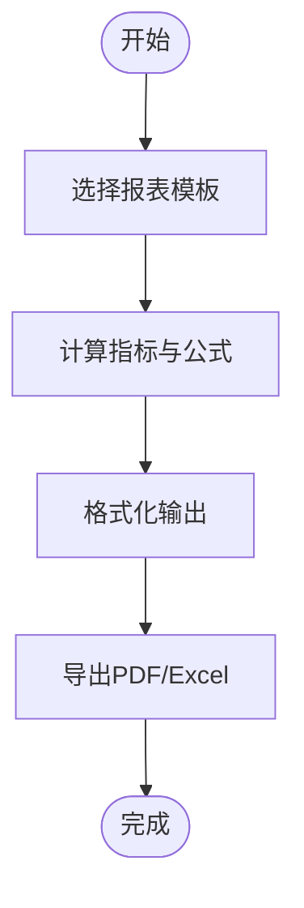
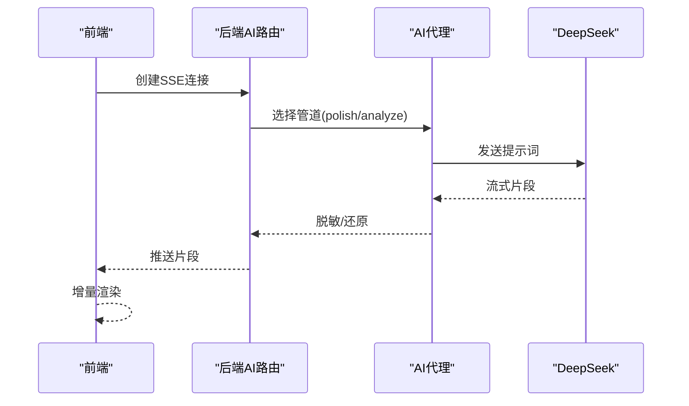
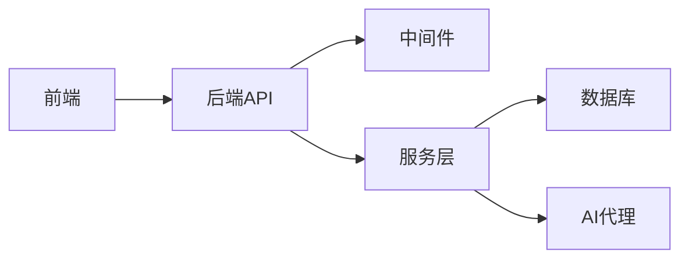

# 端到端测试

<cite>
**本文引用的文件**   
- [server/package.json](file://server/package.json)
- [web/package.json](file://web/package.json)
- [server/src/app.ts](file://server/src/app.ts)
- [server/src/server.ts](file://server/src/server.ts)
- [server/src/config/env.ts](file://server/src/config/env.ts)
- [server/src/middleware/auth.ts](file://server/src/middleware/auth.ts)
- [server/src/middleware/permission.ts](file://server/src/middleware/permission.ts)
- [server/src/middleware/scope.ts](file://server/src/middleware/scope.ts)
- [server/src/routes/auth.ts](file://server/src/routes/auth.ts)
- [server/src/routes/data.ts](file://server/src/routes/data.ts)
- [server/src/routes/reports.ts](file://server/src/routes/reports.ts)
- [server/src/services/AuthService.ts](file://server/src/services/AuthService.ts)
- [server/src/services/ImportService.ts](file://server/src/services/ImportService.ts)
- [server/src/services/ReportService.ts](file://server/src/services/ReportService.ts)
- [server/src/lib/excel-import.ts](file://server/src/lib/excel-import.ts)
- [server/src/lib/jwt.ts](file://server/src/lib/jwt.ts)
- [server/src/lib/deepseek.ts](file://server/src/lib/deepseek.ts)
- [server/src/services/AIProxyService.ts](file://server/src/services/AIProxyService.ts)
- [server/src/routes/ai.ts](file://server/src/routes/ai.ts)
- [server/prisma/schema.prisma](file://server/prisma/schema.prisma)
- [server/prisma/seed.ts](file://server/prisma/seed.ts)
- [server/scripts/local-db.ts](file://server/scripts/local-db.ts)
- [web/src/pages/login/index.tsx](file://web/src/pages/login/index.tsx)
- [web/src/pages/dashboard/index.tsx](file://web/src/pages/dashboard/index.tsx)
- [web/src/pages/data/index.tsx](file://web/src/pages/data/index.tsx)
- [web/src/pages/reports/index.tsx](file://web/src/pages/reports/index.tsx)
- [web/src/hooks/useAuth.ts](file://web/src/hooks/useAuth.ts)
- [web/src/stores/authStore.ts](file://web/src/stores/authStore.ts)
- [web/src/lib/api.ts](file://web/src/lib/api.ts)
- [web/src/lib/export.ts](file://web/src/lib/export.ts)
- [web/src/lib/report-export.ts](file://web/src/lib/report-export.ts)
</cite>

## 目录
1. [简介](#简介)
2. [项目结构](#项目结构)
3. [核心组件](#核心组件)
4. [架构总览](#架构总览)
5. [详细组件分析](#详细组件分析)
6. [依赖分析](#依赖分析)
7. [性能考虑](#性能考虑)
8. [故障排查指南](#故障排查指南)
9. [结论](#结论)
10. [附录](#附录)

## 简介
本文件为FY200项目的端到端（E2E）测试指南，面向“Excel进、看板/报表出”的财年经营数据分析平台。文档覆盖：
- E2E框架选型与配置（Playwright/Cypress）
- 关键用户流程测试（登录、数据导入、报表生成）
- 跨页面交互（路由跳转、状态保持、权限校验）
- 测试环境搭建与数据准备
- 高级能力（浏览器自动化、截图对比、性能监控）
- AI功能交互流程测试（SSE流式响应）

## 项目结构
FY200采用前后端分离架构：
- 后端：Express + Prisma + PostgreSQL，提供认证、数据导入、指标聚合、报表导出、AI代理等API
- 前端：React/Vite应用，包含登录、仪表盘、数据管理、报表编辑等页面
- 测试：服务端集成测试使用Vitest；E2E建议采用Playwright或Cypress

**图表来源** 
- [server/src/app.ts](file://server/src/app.ts)
- [server/src/server.ts](file://server/src/server.ts)
- [server/src/middleware/auth.ts](file://server/src/middleware/auth.ts)
- [server/src/middleware/permission.ts](file://server/src/middleware/permission.ts)
- [server/src/middleware/scope.ts](file://server/src/middleware/scope.ts)
- [server/src/routes/auth.ts](file://server/src/routes/auth.ts)
- [server/src/routes/data.ts](file://server/src/routes/data.ts)
- [server/src/routes/reports.ts](file://server/src/routes/reports.ts)
- [server/src/services/AIProxyService.ts](file://server/src/services/AIProxyService.ts)
- [server/src/lib/deepseek.ts](file://server/src/lib/deepseek.ts)

**章节来源**
- [server/package.json](file://server/package.json)
- [web/package.json](file://web/package.json)

## 核心组件
- 认证与授权
  - JWT访问令牌短期轮转，刷新令牌长期有效；黑名单机制支持登出与强制下线
  - 权限中间件默认拒绝，需显式放行；作用域通过Prisma扩展实现
- 数据导入
  - Excel解析与校验，模板化导入，错误回滚与部分失败处理
- 报表与导出
  - 指标计算（同比/环比）、公式安全解析、导出PDF/Excel
- AI代理
  - 双管道：polish（文本脱敏→LLM→还原）与analyze（结构化→计算→脱敏→LLM→生成），SSE流式返回

**章节来源**
- [server/src/middleware/auth.ts](file://server/src/middleware/auth.ts)
- [server/src/middleware/permission.ts](file://server/src/middleware/permission.ts)
- [server/src/middleware/scope.ts](file://server/src/middleware/scope.ts)
- [server/src/lib/jwt.ts](file://server/src/lib/jwt.ts)
- [server/src/lib/excel-import.ts](file://server/src/lib/excel-import.ts)
- [server/src/services/ImportService.ts](file://server/src/services/ImportService.ts)
- [server/src/services/ReportService.ts](file://server/src/services/ReportService.ts)
- [server/src/services/AIProxyService.ts](file://server/src/services/AIProxyService.ts)
- [server/src/lib/deepseek.ts](file://server/src/lib/deepseek.ts)

## 架构总览
下图展示E2E测试视角下的请求链路，涵盖认证、权限、数据导入、报表生成与AI交互。

**图表来源** 
- [server/src/routes/auth.ts](file://server/src/routes/auth.ts)
- [server/src/routes/data.ts](file://server/src/routes/data.ts)
- [server/src/routes/reports.ts](file://server/src/routes/reports.ts)
- [server/src/routes/ai.ts](file://server/src/routes/ai.ts)
- [server/src/services/AuthService.ts](file://server/src/services/AuthService.ts)
- [server/src/services/ImportService.ts](file://server/src/services/ImportService.ts)
- [server/src/services/ReportService.ts](file://server/src/services/ReportService.ts)
- [server/src/services/AIProxyService.ts](file://server/src/services/AIProxyService.ts)
- [server/src/lib/deepseek.ts](file://server/src/lib/deepseek.ts)

## 详细组件分析

### 认证与授权（登录、鉴权、权限）
- 登录流程
  - 前端提交用户名/密码，后端校验并签发JWT；前端保存令牌并在后续请求中附加
  - 刷新令牌用于续期访问令牌，支持黑名单登出
- 权限与作用域
  - 权限中间件默认拒绝，需在路由或控制器中声明所需权限
  - 作用域通过Prisma扩展限制数据可见性（如公司维度）

**图表来源** 
- [server/src/routes/auth.ts](file://server/src/routes/auth.ts)
- [server/src/middleware/auth.ts](file://server/src/middleware/auth.ts)
- [server/src/middleware/permission.ts](file://server/src/middleware/permission.ts)
- [server/src/middleware/scope.ts](file://server/src/middleware/scope.ts)
- [server/src/lib/jwt.ts](file://server/src/lib/jwt.ts)

**章节来源**
- [server/src/routes/auth.ts](file://server/src/routes/auth.ts)
- [server/src/middleware/auth.ts](file://server/src/middleware/auth.ts)
- [server/src/middleware/permission.ts](file://server/src/middleware/permission.ts)
- [server/src/middleware/scope.ts](file://server/src/middleware/scope.ts)
- [server/src/lib/jwt.ts](file://server/src/lib/jwt.ts)
- [web/src/pages/login/index.tsx](file://web/src/pages/login/index.tsx)
- [web/src/hooks/useAuth.ts](file://web/src/hooks/useAuth.ts)
- [web/src/stores/authStore.ts](file://web/src/stores/authStore.ts)

### 数据导入（Excel上传与校验）
- 导入流程
  - 前端选择Excel文件，后端解析并校验列名、数据类型、必填项
  - 支持批量写入与事务回滚，错误行记录并返回明细
- 关键点
  - 白名单字段映射、单位统一（万元）
  - 并发控制与限流，避免大文件阻塞

**图表来源** 
- [server/src/routes/data.ts](file://server/src/routes/data.ts)
- [server/src/lib/excel-import.ts](file://server/src/lib/excel-import.ts)
- [server/src/services/ImportService.ts](file://server/src/services/ImportService.ts)

**章节来源**
- [server/src/routes/data.ts](file://server/src/routes/data.ts)
- [server/src/lib/excel-import.ts](file://server/src/lib/excel-import.ts)
- [server/src/services/ImportService.ts](file://server/src/services/ImportService.ts)

### 报表生成与导出
- 生成流程
  - 根据指标定义与公式规则计算同比/环比，支持安全表达式解析
  - 导出PDF/Excel，包含分页、表头、单位说明
- 关键点
  - 公式白名单算子，禁止任意代码执行
  - 缓存热点指标，提升生成性能

**图表来源** 
- [server/src/routes/reports.ts](file://server/src/routes/reports.ts)
- [server/src/services/ReportService.ts](file://server/src/services/ReportService.ts)
- [web/src/lib/export.ts](file://web/src/lib/export.ts)
- [web/src/lib/report-export.ts](file://web/src/lib/report-export.ts)

**章节来源**
- [server/src/routes/reports.ts](file://server/src/routes/reports.ts)
- [server/src/services/ReportService.ts](file://server/src/services/ReportService.ts)
- [web/src/lib/export.ts](file://web/src/lib/export.ts)
- [web/src/lib/report-export.ts](file://web/src/lib/report-export.ts)

### AI功能交互（SSE流式）
- 交互流程
  - 前端发起SSE连接，后端按管道处理（polish/analyze），逐步推送片段
  - 前端增量渲染，支持中断与重试
- 关键点
  - 脱敏规则确保敏感信息不泄露
  - 超时与错误恢复策略

**图表来源** 
- [server/src/routes/ai.ts](file://server/src/routes/ai.ts)
- [server/src/services/AIProxyService.ts](file://server/src/services/AIProxyService.ts)
- [server/src/lib/deepseek.ts](file://server/src/lib/deepseek.ts)

**章节来源**
- [server/src/routes/ai.ts](file://server/src/routes/ai.ts)
- [server/src/services/AIProxyService.ts](file://server/src/services/AIProxyService.ts)
- [server/src/lib/deepseek.ts](file://server/src/lib/deepseek.ts)

## 依赖分析
- 模块耦合
  - 路由层依赖中间件与服务层，服务层依赖Prisma与外部AI服务
  - 前端依赖API客户端与状态管理（令牌、权限）
- 外部依赖
  - PostgreSQL、DeepSeek API、Excel解析库
- 潜在风险
  - 循环依赖（应避免）
  - 第三方服务超时与限流

**图表来源** 
- [server/src/app.ts](file://server/src/app.ts)
- [server/src/server.ts](file://server/src/server.ts)

**章节来源**
- [server/src/app.ts](file://server/src/app.ts)
- [server/src/server.ts](file://server/src/server.ts)

## 性能考虑
- 数据库
  - 合理索引与分页，避免全表扫描
  - 读写分离与连接池配置
- 导入与导出
  - 分块处理大文件，异步任务队列
  - 导出时压缩与缓存
- AI调用
  - 流式传输减少首字节延迟
  - 重试与熔断策略

[本节为通用指导，无需特定文件引用]

## 故障排查指南
- 常见问题
  - 登录失败：检查JWT签发与黑名单逻辑
  - 权限拒绝：确认权限声明与角色映射
  - 导入失败：查看错误明细与回滚日志
  - AI无响应：检查SSE连接与第三方API状态
- 调试技巧
  - 启用详细日志与Trace ID
  - 使用浏览器开发者工具网络面板
  - 服务端集成测试定位问题

**章节来源**
- [server/src/middleware/auth.ts](file://server/src/middleware/auth.ts)
- [server/src/middleware/permission.ts](file://server/src/middleware/permission.ts)
- [server/src/lib/excel-import.ts](file://server/src/lib/excel-import.ts)
- [server/src/lib/deepseek.ts](file://server/src/lib/deepseek.ts)

## 结论
本指南为FY200项目提供了完整的E2E测试方案，覆盖认证、数据导入、报表生成与AI交互等关键场景。通过合理的框架选型与环境搭建，结合截图对比与性能监控，可有效保障系统质量与用户体验。

[本节为总结，无需特定文件引用]

## 附录

### E2E框架选型与配置
- Playwright推荐
  - 优势：跨浏览器、内置截图/视频、并行执行、稳定可靠
  - 安装：在根目录添加playwright依赖，初始化配置文件
  - 配置要点：设置base URL、浏览器选项、超时时间、截图路径
- Cypress备选
  - 优势：调试友好、插件生态丰富
  - 配置：安装cypress，编写spec文件，配置环境变量

[本节为通用指导，无需特定文件引用]

### 测试环境搭建与数据准备
- 后端环境
  - 启动PostgreSQL，运行Prisma迁移与种子数据
  - 配置环境变量（数据库连接、JWT密钥、AI API密钥）
- 前端环境
  - 安装依赖，启动开发服务器
  - 配置Mock或真实API地址
- 数据准备
  - 使用种子脚本创建测试用户与基础数据
  - 准备Excel模板与样例数据

**章节来源**
- [server/scripts/local-db.ts](file://server/scripts/local-db.ts)
- [server/prisma/seed.ts](file://server/prisma/seed.ts)
- [server/prisma/schema.prisma](file://server/prisma/schema.prisma)
- [server/src/config/env.ts](file://server/src/config/env.ts)

### 关键业务场景测试用例
- 登录流程
  - 输入正确凭据，验证跳转与令牌存储
  - 输入错误凭据，验证错误提示
  - 刷新令牌过期，验证自动续期
- 数据导入流程
  - 上传有效Excel，验证数据入库与反馈
  - 上传无效文件，验证错误处理
  - 并发导入，验证限流与队列
- 报表生成流程
  - 选择模板，验证计算结果与导出文件
  - 修改公式，验证重新计算
- 跨页面交互
  - 登录后状态保持，刷新后仍有效
  - 权限切换，验证页面访问控制
  - 路由跳转，验证参数传递与状态同步

**章节来源**
- [web/src/pages/login/index.tsx](file://web/src/pages/login/index.tsx)
- [web/src/pages/data/index.tsx](file://web/src/pages/data/index.tsx)
- [web/src/pages/reports/index.tsx](file://web/src/pages/reports/index.tsx)
- [web/src/hooks/useAuth.ts](file://web/src/hooks/useAuth.ts)
- [web/src/stores/authStore.ts](file://web/src/stores/authStore.ts)
- [web/src/lib/api.ts](file://web/src/lib/api.ts)

### 高级功能
- 浏览器自动化
  - 模拟用户操作（点击、输入、拖拽）
  - 等待元素加载与状态变化
- 截图对比
  - 基准截图与回归测试
  - 差异分析与报告生成
- 性能监控
  - 页面加载时间与资源占用
  - API响应时间与错误率

[本节为通用指导，无需特定文件引用]

### AI功能测试要点
- 流式响应
  - 验证片段顺序与完整性
  - 测试中断与恢复
- 脱敏规则
  - 金额区间化、公司名称映射
- 错误处理
  - 超时重试与降级策略

**章节来源**
- [server/src/routes/ai.ts](file://server/src/routes/ai.ts)
- [server/src/services/AIProxyService.ts](file://server/src/services/AIProxyService.ts)
- [server/src/lib/deepseek.ts](file://server/src/lib/deepseek.ts)