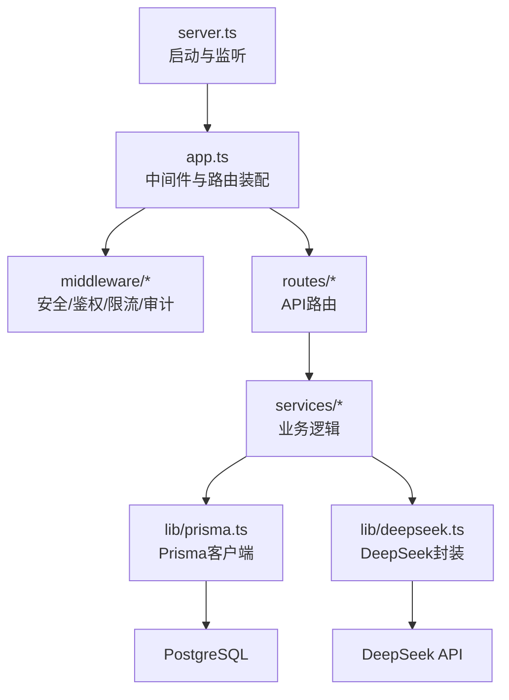
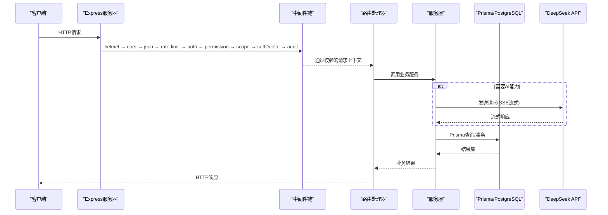
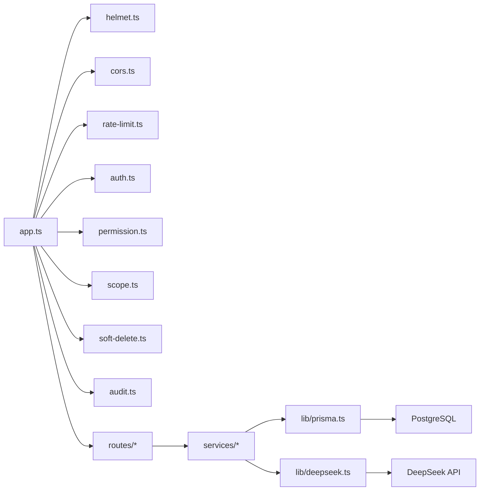

# 集成测试

<cite>
**本文引用的文件**   
- [server/src/app.ts](file://server/src/app.ts)
- [server/src/server.ts](file://server/src/server.ts)
- [server/src/middleware/helmet.ts](file://server/src/middleware/helmet.ts)
- [server/src/middleware/cors.ts](file://server/src/middleware/cors.ts)
- [server/src/middleware/rate-limit.ts](file://server/src/middleware/rate-limit.ts)
- [server/src/middleware/auth.ts](file://server/src/middleware/auth.ts)
- [server/src/middleware/permission.ts](file://server/src/middleware/permission.ts)
- [server/src/middleware/scope.ts](file://server/src/middleware/scope.ts)
- [server/src/middleware/soft-delete.ts](file://server/src/middleware/soft-delete.ts)
- [server/src/middleware/audit.ts](file://server/src/middleware/audit.ts)
- [server/src/middleware/error-handler.ts](file://server/src/middleware/error-handler.ts)
- [server/src/middleware/trace-id.ts](file://server/src/middleware/trace-id.ts)
- [server/src/routes/auth.ts](file://server/src/routes/auth.ts)
- [server/src/routes/ai.ts](file://server/src/routes/ai.ts)
- [server/src/routes/admin.ts](file://server/src/routes/admin.ts)
- [server/src/routes/dashboard.ts](file://server/src/routes/dashboard.ts)
- [server/src/routes/data.ts](file://server/src/routes/data.ts)
- [server/src/routes/indicators.ts](file://server/src/routes/indicators.ts)
- [server/src/routes/reports.ts](file://server/src/routes/reports.ts)
- [server/src/services/AIProxyService.ts](file://server/src/services/AIProxyService.ts)
- [server/src/lib/deepseek.ts](file://server/src/lib/deepseek.ts)
- [server/src/lib/prisma.ts](file://server/src/lib/prisma.ts)
- [server/prisma/schema.prisma](file://server/prisma/schema.prisma)
- [server/src/test/setup.ts](file://server/src/test/setup.ts)
- [server/src/test/integration.test.ts](file://server/src/test/integration.test.ts)
- [server/src/test/integration-crud.test.ts](file://server/src/test/integration-crud.test.ts)
- [server/src/test/ai-http.test.ts](file://server/src/test/ai-http.test.ts)
- [server/src/test/reports-http.test.ts](file://server/src/test/reports-http.test.ts)
- [server/vitest.config.ts](file://server/vitest.config.ts)
- [server/package.json](file://server/package.json)
</cite>

## 目录
1. [简介](#简介)
2. [项目结构](#项目结构)
3. [核心组件](#核心组件)
4. [架构总览](#架构总览)
5. [详细组件分析](#详细组件分析)
6. [依赖关系分析](#依赖关系分析)
7. [性能考量](#性能考量)
8. [故障排查指南](#故障排查指南)
9. [结论](#结论)
10. [附录](#附录)

## 简介
本文件面向FY200项目的集成测试实践，围绕以下目标展开：
- API接口集成测试：HTTP请求模拟、响应断言、错误路径覆盖。
- 数据库操作集成测试：Prisma查询与事务、数据一致性验证。
- 第三方服务集成测试：DeepSeek API模拟与外部依赖Mock策略。
- 测试数据库管理与数据隔离方案。
- 异步与并发测试最佳实践。
- 中间件链执行顺序与可观测性验证。

本项目后端技术栈为Express 4 + Prisma 5 + PostgreSQL 15 + JWT（access 15min + refresh 7day 轮转）+ DeepSeek API（SSE流式）。中间件执行链顺序为：helmet → cors → express.json → rate-limit → auth(JWT+黑名单) → permission(默认拒绝) → scope(Prisma extension) → softDelete → audit → Service → Prisma → PostgreSQL。AI双管道架构：polish（文本→脱敏→LLM→还原）/ analyze（结构化→计算→脱敏→LLM→生成），脱敏规则：绝对金额→区间，公司名→动态映射。

## 项目结构
服务器端关键目录与职责：
- src/app.ts：应用装配与中间件注册、路由挂载。
- src/server.ts：进程启动、端口监听、优雅关闭。
- src/middleware/*：安全、鉴权、限流、审计等中间件。
- src/routes/*：按业务域划分的API路由。
- src/services/*：领域服务实现。
- src/lib/*：通用库（Prisma客户端、DeepSeek封装、JWT、日志等）。
- prisma/*：数据库Schema与迁移、种子数据。
- src/test/*：集成测试用例与测试环境初始化。
- vitest.config.ts：Vitest配置。
- package.json：脚本与依赖。

图表来源
- [server/src/server.ts](file://server/src/server.ts)
- [server/src/app.ts](file://server/src/app.ts)
- [server/src/lib/prisma.ts](file://server/src/lib/prisma.ts)
- [server/src/lib/deepseek.ts](file://server/src/lib/deepseek.ts)

章节来源
- [server/src/app.ts](file://server/src/app.ts)
- [server/src/server.ts](file://server/src/server.ts)
- [server/vitest.config.ts](file://server/vitest.config.ts)
- [server/package.json](file://server/package.json)

## 核心组件
- 应用装配与中间件链：在应用入口集中注册中间件与路由，确保执行顺序符合规范。
- 鉴权与权限：JWT校验、黑名单检查、基于角色的权限控制。
- 数据访问：通过Prisma扩展注入scope，结合软删除与审计。
- AI代理：封装DeepSeek SSE流式调用，提供polish与analyze两条管道。
- 测试基础设施：Vitest + Supertest（或等效HTTP客户端）进行端到端集成测试；独立测试数据库与事务回滚保证隔离。

章节来源
- [server/src/app.ts](file://server/src/app.ts)
- [server/src/middleware/auth.ts](file://server/src/middleware/auth.ts)
- [server/src/middleware/permission.ts](file://server/src/middleware/permission.ts)
- [server/src/middleware/scope.ts](file://server/src/middleware/scope.ts)
- [server/src/middleware/soft-delete.ts](file://server/src/middleware/soft-delete.ts)
- [server/src/middleware/audit.ts](file://server/src/middleware/audit.ts)
- [server/src/lib/prisma.ts](file://server/src/lib/prisma.ts)
- [server/src/services/AIProxyService.ts](file://server/src/services/AIProxyService.ts)
- [server/src/lib/deepseek.ts](file://server/src/lib/deepseek.ts)

## 架构总览
下图展示从HTTP请求到数据库与第三方服务的完整链路，以及中间件链的执行顺序。

图表来源
- [server/src/app.ts](file://server/src/app.ts)
- [server/src/middleware/auth.ts](file://server/src/middleware/auth.ts)
- [server/src/middleware/permission.ts](file://server/src/middleware/permission.ts)
- [server/src/middleware/scope.ts](file://server/src/middleware/scope.ts)
- [server/src/middleware/soft-delete.ts](file://server/src/middleware/soft-delete.ts)
- [server/src/middleware/audit.ts](file://server/src/middleware/audit.ts)
- [server/src/lib/prisma.ts](file://server/src/lib/prisma.ts)
- [server/src/lib/deepseek.ts](file://server/src/lib/deepseek.ts)
- [server/src/services/AIProxyService.ts](file://server/src/services/AIProxyService.ts)

## 详细组件分析

### API接口集成测试
- 目标：对REST API进行端到端验证，包括成功路径、参数校验失败、鉴权失败、权限不足、限流触发、异常处理等。
- 方法：
  - 使用测试框架的HTTP客户端发起请求，设置必要Headers（如Authorization、Content-Type）。
  - 断言状态码、响应体结构与关键字段。
  - 针对流式响应（SSE）需验证事件流与结束标记。
- 建议用例：
  - 认证登录与令牌刷新流程。
  - 资源CRUD操作的权限边界与范围限制。
  - 指标计算与报表导出接口的输入输出验证。
  - 错误场景：非法参数、缺失字段、越权访问、速率限制、超时。

章节来源
- [server/src/test/integration.test.ts](file://server/src/test/integration.test.ts)
- [server/src/test/integration-crud.test.ts](file://server/src/test/integration-crud.test.ts)
- [server/src/test/reports-http.test.ts](file://server/src/test/reports-http.test.ts)
- [server/src/routes/auth.ts](file://server/src/routes/auth.ts)
- [server/src/routes/data.ts](file://server/src/routes/data.ts)
- [server/src/routes/indicators.ts](file://server/src/routes/indicators.ts)
- [server/src/routes/reports.ts](file://server/src/routes/reports.ts)

### 数据库操作集成测试
- 目标：验证Prisma查询、事务语义与数据一致性。
- 方法：
  - 使用独立测试数据库实例，每个测试用例前后清理或回滚数据。
  - 使用Prisma事务包装多步写入，断言原子性与回滚行为。
  - 验证软删除、审计记录、权限范围（scope）生效。
- 建议用例：
  - 创建/更新/删除实体并校验关联完整性。
  - 复杂查询与聚合计算的正确性。
  - 并发写冲突与重试策略。
  - 审计日志与软删除标志的一致性。

章节来源
- [server/src/lib/prisma.ts](file://server/src/lib/prisma.ts)
- [server/prisma/schema.prisma](file://server/prisma/schema.prisma)
- [server/src/middleware/scope.ts](file://server/src/middleware/scope.ts)
- [server/src/middleware/soft-delete.ts](file://server/src/middleware/soft-delete.ts)
- [server/src/middleware/audit.ts](file://server/src/middleware/audit.ts)
- [server/src/test/integration-crud.test.ts](file://server/src/test/integration-crud.test.ts)

### 第三方服务集成测试（DeepSeek API）
- 目标：在不依赖真实外部服务的情况下，稳定地验证AI相关功能。
- 方法：
  - Mock DeepSeek客户端或网络层，返回预设响应或模拟延迟/错误。
  - 验证SSE流式事件的顺序、内容、重连与中断处理。
  - 校验脱敏与还原流程在两条管道中的正确性。
- 建议用例：
  - polish管道：输入文本脱敏→LLM处理→还原后断言。
  - analyze管道：结构化数据→计算→脱敏→LLM→生成报告断言。
  - 错误恢复：网络超时、服务不可用、流中断。

章节来源
- [server/src/lib/deepseek.ts](file://server/src/lib/deepseek.ts)
- [server/src/services/AIProxyService.ts](file://server/src/services/AIProxyService.ts)
- [server/src/test/ai-http.test.ts](file://server/src/test/ai-http.test.ts)

### 测试数据库管理与数据隔离
- 目标：确保测试之间互不干扰，具备快速重建与清理能力。
- 方案：
  - 使用独立的测试数据库连接串，避免污染开发/生产数据。
  - 在每个测试套件开始前迁移Schema并加载种子数据。
  - 使用事务包裹测试用例，结束后自动回滚；或使用快照/清理策略。
  - 针对并发测试，采用隔离表前缀或临时Schema。
- 工具与实践：
  - Vitest生命周期钩子管理测试环境。
  - Prisma迁移与种子脚本自动化。
  - 测试夹具（fixtures）与工厂函数生成数据。

章节来源
- [server/src/test/setup.ts](file://server/src/test/setup.ts)
- [server/vitest.config.ts](file://server/vitest.config.ts)
- [server/prisma/schema.prisma](file://server/prisma/schema.prisma)

### 异步操作与并发测试最佳实践
- 目标：确保异步逻辑与并发场景下的稳定性与正确性。
- 方法：
  - 使用Promise与async/await编写可等待的断言。
  - 对SSE流式响应，验证事件到达顺序与结束信号。
  - 并发写场景下，使用事务与锁机制，断言最终一致性。
  - 引入超时与重试策略，避免测试挂起。
- 建议用例：
  - 批量导入与后台任务完成回调。
  - 高并发登录与令牌刷新。
  - 指标计算任务的并行执行与结果合并。

章节来源
- [server/src/test/ai-http.test.ts](file://server/src/test/ai-http.test.ts)
- [server/src/test/integration.test.ts](file://server/src/test/integration.test.ts)

### 中间件链与执行顺序测试
- 目标：验证中间件链的顺序与副作用，确保安全与可观测性。
- 方法：
  - 构造不同请求头与负载，断言各中间件的拦截与放行行为。
  - 验证trace-id贯穿全链路，审计日志包含必要上下文。
  - 针对rate-limit与auth黑名单，构造触发条件并断言响应。
- 建议用例：
  - 未授权访问被拒绝、权限不足被拒绝。
  - 跨域请求CORS策略生效。
  - 审计记录包含用户、IP、时间戳与操作类型。

章节来源
- [server/src/middleware/helmet.ts](file://server/src/middleware/helmet.ts)
- [server/src/middleware/cors.ts](file://server/src/middleware/cors.ts)
- [server/src/middleware/rate-limit.ts](file://server/src/middleware/rate-limit.ts)
- [server/src/middleware/auth.ts](file://server/src/middleware/auth.ts)
- [server/src/middleware/permission.ts](file://server/src/middleware/permission.ts)
- [server/src/middleware/scope.ts](file://server/src/middleware/scope.ts)
- [server/src/middleware/soft-delete.ts](file://server/src/middleware/soft-delete.ts)
- [server/src/middleware/audit.ts](file://server/src/middleware/audit.ts)
- [server/src/middleware/trace-id.ts](file://server/src/middleware/trace-id.ts)

## 依赖关系分析
- 模块耦合：
  - app.ts集中依赖中间件与路由，形成装配中心。
  - routes依赖services，services依赖lib（prisma、deepseek）。
  - middleware相互独立但共同作用于请求上下文。
- 外部依赖：
  - Prisma与PostgreSQL作为持久化层。
  - DeepSeek API作为AI能力提供方。
- 潜在循环依赖：
  - 应避免services与middleware之间的直接循环引用，通过上下文对象传递数据。

图表来源
- [server/src/app.ts](file://server/src/app.ts)
- [server/src/middleware/helmet.ts](file://server/src/middleware/helmet.ts)
- [server/src/middleware/cors.ts](file://server/src/middleware/cors.ts)
- [server/src/middleware/rate-limit.ts](file://server/src/middleware/rate-limit.ts)
- [server/src/middleware/auth.ts](file://server/src/middleware/auth.ts)
- [server/src/middleware/permission.ts](file://server/src/middleware/permission.ts)
- [server/src/middleware/scope.ts](file://server/src/middleware/scope.ts)
- [server/src/middleware/soft-delete.ts](file://server/src/middleware/soft-delete.ts)
- [server/src/middleware/audit.ts](file://server/src/middleware/audit.ts)
- [server/src/lib/prisma.ts](file://server/src/lib/prisma.ts)
- [server/src/lib/deepseek.ts](file://server/src/lib/deepseek.ts)

章节来源
- [server/src/app.ts](file://server/src/app.ts)
- [server/src/lib/prisma.ts](file://server/src/lib/prisma.ts)
- [server/src/lib/deepseek.ts](file://server/src/lib/deepseek.ts)

## 性能考量
- 数据库连接池：合理配置Prisma连接池大小，避免连接耗尽。
- 缓存策略：对热点查询结果进行短期缓存，减少重复计算。
- 流式处理：SSE流式响应降低内存占用，提升吞吐。
- 限流与降级：在高并发时启用限流与熔断，保护系统稳定性。
- 索引优化：根据查询模式设计索引，提升扫描效率。

[本节为通用指导，无需特定文件引用]

## 故障排查指南
- 常见问题：
  - 鉴权失败：检查JWT签名、过期时间与黑名单。
  - 权限不足：确认角色与权限映射是否正确。
  - 数据库连接失败：核对连接串、迁移状态与权限。
  - AI服务不可用：检查Mock配置与网络连通性。
- 调试技巧：
  - 开启详细日志与trace-id追踪。
  - 使用事务回滚观察中间态数据。
  - 逐步禁用中间件定位问题。

章节来源
- [server/src/middleware/error-handler.ts](file://server/src/middleware/error-handler.ts)
- [server/src/middleware/auth.ts](file://server/src/middleware/auth.ts)
- [server/src/middleware/permission.ts](file://server/src/middleware/permission.ts)
- [server/src/lib/prisma.ts](file://server/src/lib/prisma.ts)
- [server/src/lib/deepseek.ts](file://server/src/lib/deepseek.ts)

## 结论
通过系统的集成测试策略，可以全面覆盖API、数据库与第三方服务的交互路径，确保系统在复杂场景下的稳定性与一致性。建议持续完善测试用例、优化测试数据管理，并结合监控与日志提升可观测性。

[本节为总结，无需特定文件引用]

## 附录
- 测试运行命令与脚本定义请参考package.json。
- 测试环境初始化与生命周期管理请参考vitest.config.ts与setup.ts。
- 数据库Schema与迁移请参考schema.prisma与migrations目录。

章节来源
- [server/package.json](file://server/package.json)
- [server/vitest.config.ts](file://server/vitest.config.ts)
- [server/src/test/setup.ts](file://server/src/test/setup.ts)
- [server/prisma/schema.prisma](file://server/prisma/schema.prisma)