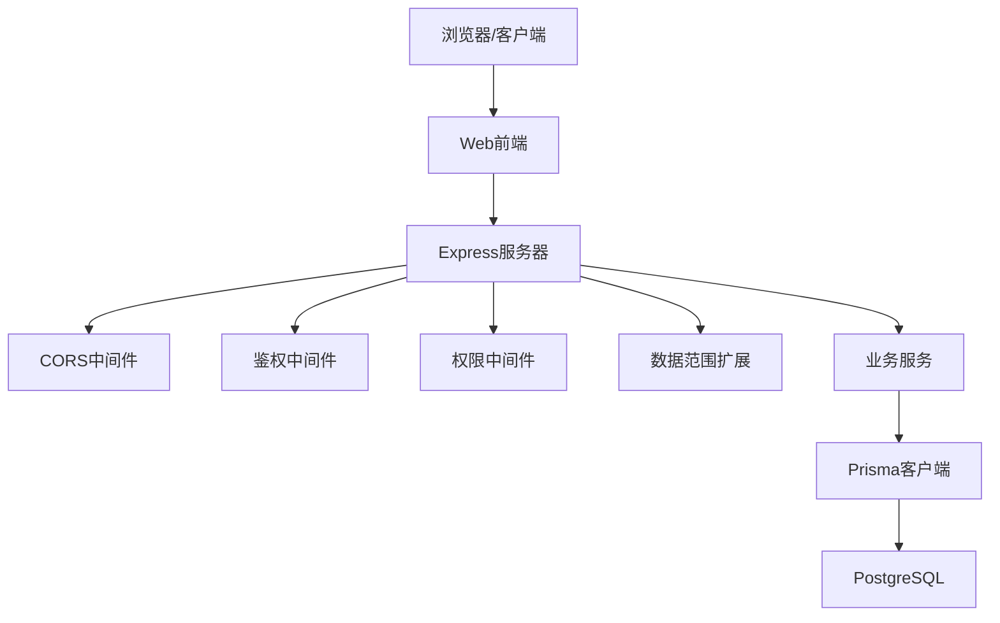
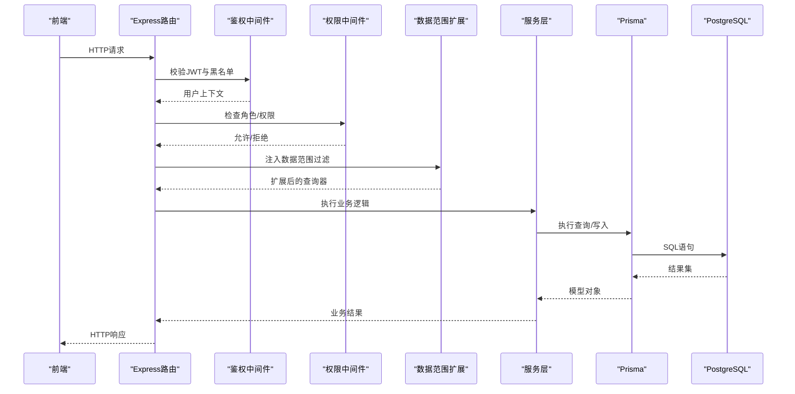
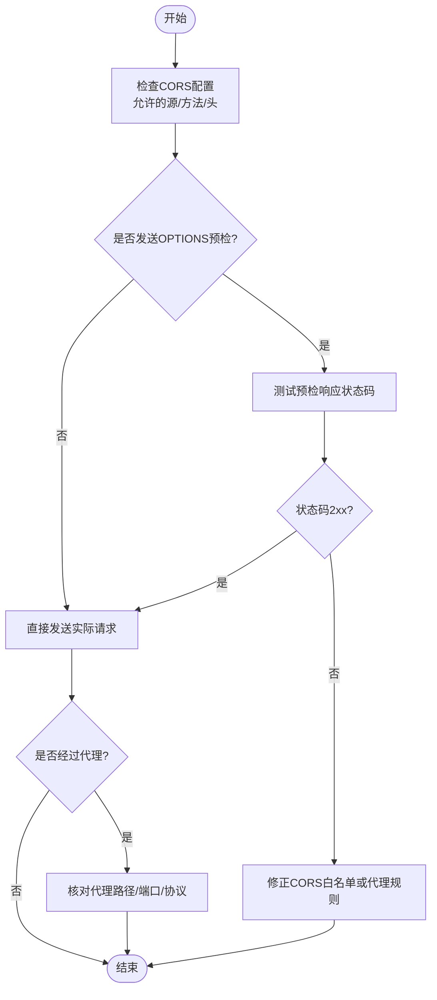
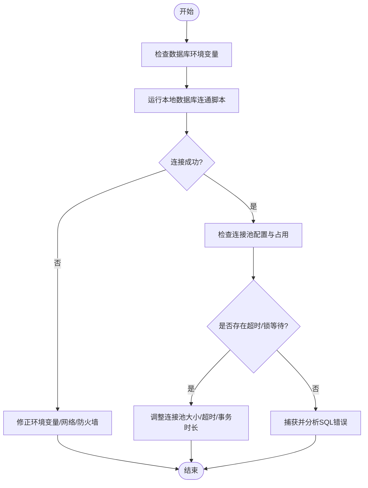
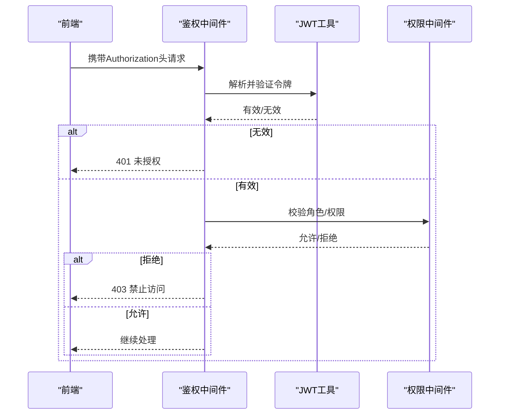
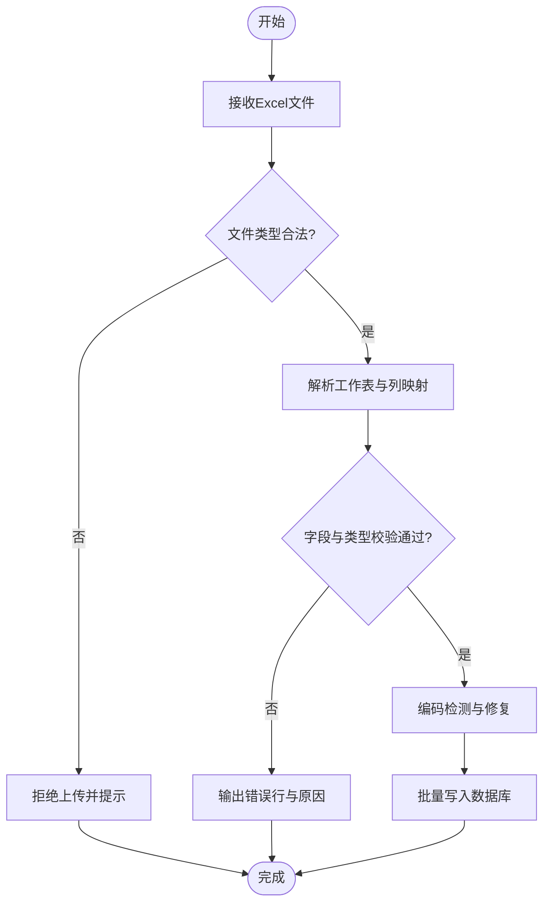
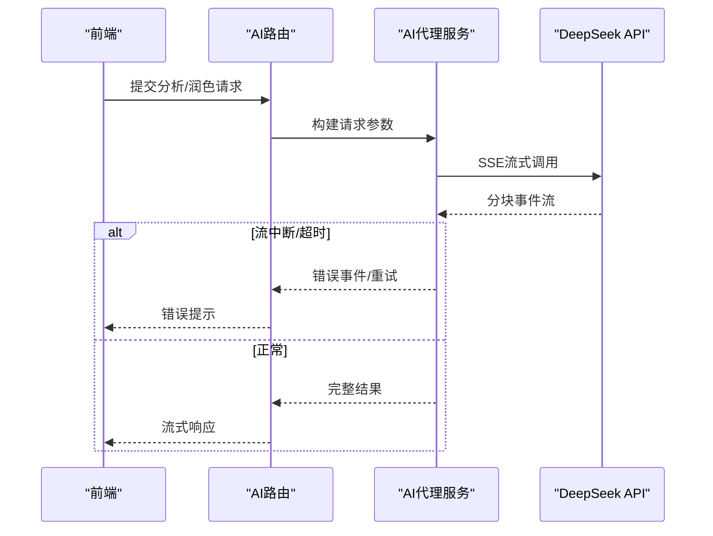
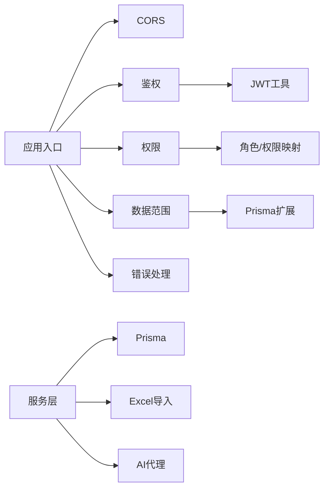

# 常见问题诊断

<cite>
**本文引用的文件**   
- [server/src/app.ts](file://server/src/app.ts)
- [server/src/server.ts](file://server/src/server.ts)
- [server/src/middleware/cors.ts](file://server/src/middleware/cors.ts)
- [server/src/middleware/auth.ts](file://server/src/middleware/auth.ts)
- [server/src/middleware/permission.ts](file://server/src/middleware/permission.ts)
- [server/src/middleware/scope.ts](file://server/src/middleware/scope.ts)
- [server/src/middleware/error-handler.ts](file://server/src/middleware/error-handler.ts)
- [server/src/lib/jwt.ts](file://server/src/lib/jwt.ts)
- [server/src/lib/prisma.ts](file://server/src/lib/prisma.ts)
- [server/src/lib/excel-import.ts](file://server/src/lib/excel-import.ts)
- [server/src/services/AIProxyService.ts](file://server/src/services/AIProxyService.ts)
- [server/src/routes/auth.ts](file://server/src/routes/auth.ts)
- [server/src/routes/ai.ts](file://server/src/routes/ai.ts)
- [server/src/config/env.ts](file://server/src/config/env.ts)
- [server/scripts/cors-check.ts](file://server/scripts/cors-check.ts)
- [server/scripts/local-db.ts](file://server/scripts/local-db.ts)
- [web/src/lib/api.ts](file://web/src/lib/api.ts)
- [web/src/hooks/useAuth.ts](file://web/src/hooks/useAuth.ts)
</cite>

## 目录
1. [简介](#简介)
2. [项目结构](#项目结构)
3. [核心组件](#核心组件)
4. [架构总览](#架构总览)
5. [详细组件分析](#详细组件分析)
6. [依赖关系分析](#依赖关系分析)
7. [性能注意事项](#性能注意事项)
8. [故障排查指南](#故障排查指南)
9. [结论](#结论)

## 简介
本指南面向FY200项目的运维与开发人员，聚焦常见问题的定位与解决。内容覆盖：
- 网络连接问题（CORS、跨域、代理）
- 数据库连接问题（连接池、超时、SQL错误）
- 权限认证问题（JWT验证失败、权限不足、角色配置）
- Excel导入失败（格式、校验、编码）
- AI功能调用（API密钥、网络超时、响应格式）
- 性能问题诊断与优化建议

后端中间件执行链顺序为：helmet → cors → express.json → rate-limit → auth(JWT+黑名单) → permission(默认拒绝) → scope(Prisma extension) → softDelete → audit → Service → Prisma → PostgreSQL。

## 项目结构
- 服务端：Express应用入口、路由、中间件、服务层、工具库、脚本
- Web端：前端API封装、鉴权Hook、权限控制等
- 数据库：PostgreSQL + Prisma迁移与初始化

图表来源
- [server/src/app.ts](file://server/src/app.ts)
- [server/src/middleware/cors.ts](file://server/src/middleware/cors.ts)
- [server/src/middleware/auth.ts](file://server/src/middleware/auth.ts)
- [server/src/middleware/permission.ts](file://server/src/middleware/permission.ts)
- [server/src/middleware/scope.ts](file://server/src/middleware/scope.ts)
- [server/src/lib/prisma.ts](file://server/src/lib/prisma.ts)

章节来源
- [server/src/app.ts](file://server/src/app.ts)
- [server/src/server.ts](file://server/src/server.ts)

## 核心组件
- 应用启动与中间件装配：统一注册安全、CORS、限流、鉴权、权限、审计等中间件
- 鉴权与授权：JWT签发与校验、黑名单、基于角色的权限控制与数据范围
- 数据库访问：Prisma客户端、连接池、事务与查询扩展
- Excel导入：文件解析、字段映射、数据校验与批量入库
- AI代理：SSE流式调用DeepSeek，支持文本与结构化双管道

章节来源
- [server/src/app.ts](file://server/src/app.ts)
- [server/src/middleware/auth.ts](file://server/src/middleware/auth.ts)
- [server/src/middleware/permission.ts](file://server/src/middleware/permission.ts)
- [server/src/middleware/scope.ts](file://server/src/middleware/scope.ts)
- [server/src/lib/prisma.ts](file://server/src/lib/prisma.ts)
- [server/src/lib/excel-import.ts](file://server/src/lib/excel-import.ts)
- [server/src/services/AIProxyService.ts](file://server/src/services/AIProxyService.ts)

## 架构总览
请求从前端发起，经过Nginx或本地代理转发到Express，依次通过安全与CORS策略、限流、鉴权、权限、数据范围、审计后进入服务层，最终由Prisma访问PostgreSQL。AI能力通过代理服务以SSE流式返回。

图表来源
- [server/src/app.ts](file://server/src/app.ts)
- [server/src/middleware/auth.ts](file://server/src/middleware/auth.ts)
- [server/src/middleware/permission.ts](file://server/src/middleware/permission.ts)
- [server/src/middleware/scope.ts](file://server/src/middleware/scope.ts)
- [server/src/lib/prisma.ts](file://server/src/lib/prisma.ts)

## 详细组件分析

### 网络连接与CORS问题诊断
常见问题
- 浏览器控制台报跨域错误（No 'Access-Control-Allow-Origin'）
- 预检请求OPTIONS失败
- 代理转发路径或协议不匹配导致404/502

排查步骤
- 确认CORS中间件已启用且允许的源、方法、头正确
- 使用本地脚本进行CORS连通性测试
- 检查前端请求的Origin与目标地址是否一致
- 若使用反向代理，确认代理规则与端口映射

图表来源
- [server/src/middleware/cors.ts](file://server/src/middleware/cors.ts)
- [server/scripts/cors-check.ts](file://server/scripts/cors-check.ts)
- [web/src/lib/api.ts](file://web/src/lib/api.ts)

章节来源
- [server/src/middleware/cors.ts](file://server/src/middleware/cors.ts)
- [server/scripts/cors-check.ts](file://server/scripts/cors-check.ts)
- [web/src/lib/api.ts](file://web/src/lib/api.ts)

### 数据库连接问题诊断
常见问题
- 连接失败（认证失败、主机不可达、端口不通）
- 连接池耗尽导致请求阻塞
- 查询超时或SQL语法错误

排查步骤
- 校验数据库环境变量（主机、端口、用户名、密码、数据库名）
- 检查Prisma客户端初始化与连接池参数
- 使用本地脚本快速验证数据库连通性
- 查看慢查询与错误日志，定位SQL问题

图表来源
- [server/src/lib/prisma.ts](file://server/src/lib/prisma.ts)
- [server/scripts/local-db.ts](file://server/scripts/local-db.ts)
- [server/src/config/env.ts](file://server/src/config/env.ts)

章节来源
- [server/src/lib/prisma.ts](file://server/src/lib/prisma.ts)
- [server/scripts/local-db.ts](file://server/scripts/local-db.ts)
- [server/src/config/env.ts](file://server/src/config/env.ts)

### 权限认证问题诊断
常见问题
- JWT令牌过期或签名无效
- 黑名单命中导致被拒绝
- 权限不足或角色配置缺失

排查步骤
- 检查JWT签发与校验流程，确认密钥与算法
- 查看黑名单机制与失效策略
- 核对角色与权限映射，确保接口所需权限已授予

图表来源
- [server/src/middleware/auth.ts](file://server/src/middleware/auth.ts)
- [server/src/lib/jwt.ts](file://server/src/lib/jwt.ts)
- [server/src/middleware/permission.ts](file://server/src/middleware/permission.ts)
- [server/src/routes/auth.ts](file://server/src/routes/auth.ts)

章节来源
- [server/src/middleware/auth.ts](file://server/src/middleware/auth.ts)
- [server/src/lib/jwt.ts](file://server/src/lib/jwt.ts)
- [server/src/middleware/permission.ts](file://server/src/middleware/permission.ts)
- [server/src/routes/auth.ts](file://server/src/routes/auth.ts)

### Excel导入失败诊断
常见问题
- 文件格式不支持或损坏
- 列名/类型不匹配导致校验失败
- 编码异常（如中文乱码）

排查步骤
- 确认上传文件的MIME类型与扩展名
- 检查模板列名与字段映射规则
- 对异常数据进行编码检测与转码
- 查看导入日志与错误行定位

图表来源
- [server/src/lib/excel-import.ts](file://server/src/lib/excel-import.ts)

章节来源
- [server/src/lib/excel-import.ts](file://server/src/lib/excel-import.ts)

### AI功能调用故障排除
常见问题
- API密钥未配置或无效
- 网络超时或SSE流中断
- 响应格式不符合预期

排查步骤
- 校验环境变量中的API密钥与端点
- 增加重试与超时控制，观察网络稳定性
- 对SSE流进行断言与容错处理，记录原始响应

图表来源
- [server/src/routes/ai.ts](file://server/src/routes/ai.ts)
- [server/src/services/AIProxyService.ts](file://server/src/services/AIProxyService.ts)
- [server/src/config/env.ts](file://server/src/config/env.ts)

章节来源
- [server/src/routes/ai.ts](file://server/src/routes/ai.ts)
- [server/src/services/AIProxyService.ts](file://server/src/services/AIProxyService.ts)
- [server/src/config/env.ts](file://server/src/config/env.ts)

### 前端鉴权与权限辅助
- 前端封装API调用，统一处理鉴权头与错误
- 鉴权Hook管理登录态与令牌刷新
- 权限Hook用于页面级与按钮级权限控制

章节来源
- [web/src/lib/api.ts](file://web/src/lib/api.ts)
- [web/src/hooks/useAuth.ts](file://web/src/hooks/useAuth.ts)

## 依赖关系分析
- 中间件依赖：cors、auth、permission、scope、error-handler等按固定顺序挂载
- 服务层依赖：Prisma客户端、外部API（DeepSeek）、Excel解析库
- 前端依赖：API封装、鉴权Hook、权限Hook

图表来源
- [server/src/app.ts](file://server/src/app.ts)
- [server/src/middleware/cors.ts](file://server/src/middleware/cors.ts)
- [server/src/middleware/auth.ts](file://server/src/middleware/auth.ts)
- [server/src/middleware/permission.ts](file://server/src/middleware/permission.ts)
- [server/src/middleware/scope.ts](file://server/src/middleware/scope.ts)
- [server/src/lib/prisma.ts](file://server/src/lib/prisma.ts)
- [server/src/lib/excel-import.ts](file://server/src/lib/excel-import.ts)
- [server/src/services/AIProxyService.ts](file://server/src/services/AIProxyService.ts)

章节来源
- [server/src/app.ts](file://server/src/app.ts)

## 性能注意事项
- 连接池调优：根据并发量设置合理的最大连接数与空闲回收策略
- 查询优化：避免N+1查询，合理使用索引与分页
- 缓存策略：热点数据可引入内存缓存，减少数据库压力
- 限流与降级：对AI与导入等高开销接口实施限流与熔断
- 日志与监控：关键路径埋点，收集延迟与错误率指标

[本节为通用指导，无需特定文件引用]

## 故障排查指南
- 网络连接
  - 使用CORS检查脚本验证跨域配置
  - 核对代理规则与端口映射
  - 检查浏览器开发者工具的Network面板
- 数据库连接
  - 运行本地数据库连通脚本
  - 查看Prisma日志与PostgreSQL日志
  - 分析慢查询与锁等待
- 权限认证
  - 检查JWT密钥与有效期
  - 核对黑名单与权限矩阵
  - 确认前端是否正确携带Authorization头
- Excel导入
  - 校验文件类型与编码
  - 对照模板列名与字段映射
  - 查看错误行详情与日志
- AI调用
  - 校验API密钥与端点可达性
  - 增加超时与重试策略
  - 记录SSE事件流以便定位格式问题

章节来源
- [server/scripts/cors-check.ts](file://server/scripts/cors-check.ts)
- [server/scripts/local-db.ts](file://server/scripts/local-db.ts)
- [server/src/middleware/error-handler.ts](file://server/src/middleware/error-handler.ts)
- [server/src/lib/jwt.ts](file://server/src/lib/jwt.ts)
- [server/src/lib/excel-import.ts](file://server/src/lib/excel-import.ts)
- [server/src/services/AIProxyService.ts](file://server/src/services/AIProxyService.ts)

## 结论
通过系统化的中间件链路、清晰的依赖关系与标准化的排查步骤，能够快速定位并解决FY200项目在连接、鉴权、导入与AI调用等方面的常见问题。建议结合监控与日志完善可观测性，持续优化性能与稳定性。