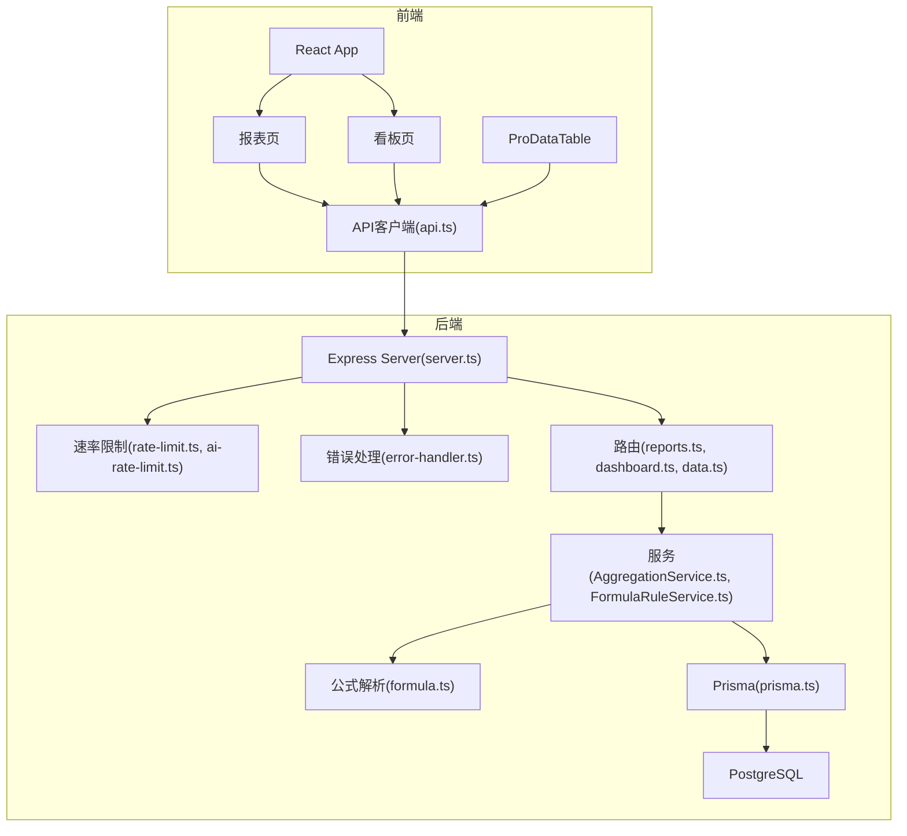
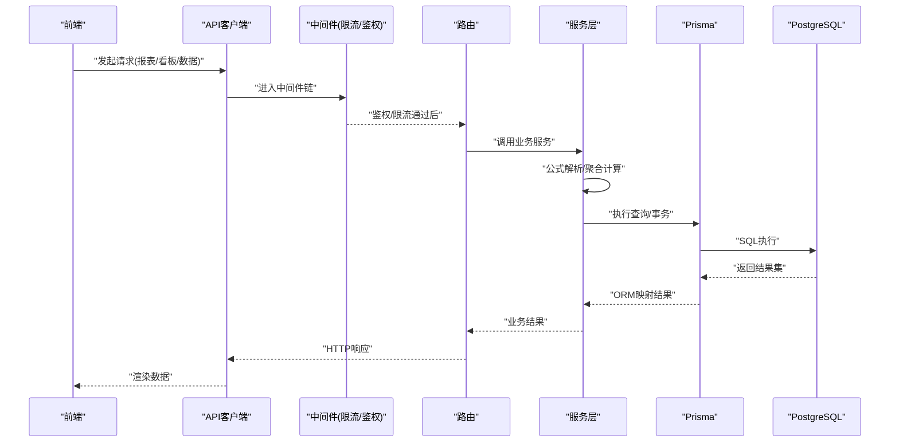
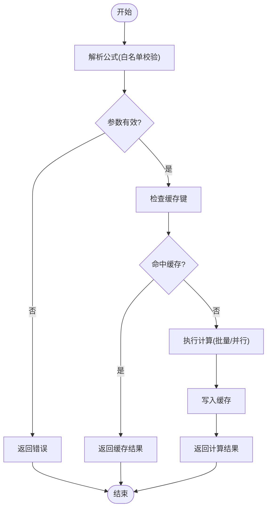
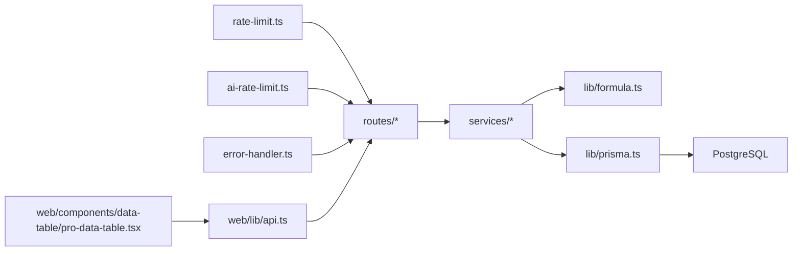

# 性能分析与优化

<cite>
**本文引用的文件**   
- [server/src/app.ts](file://server/src/app.ts)
- [server/src/server.ts](file://server/src/server.ts)
- [server/src/middleware/error-handler.ts](file://server/src/middleware/error-handler.ts)
- [server/src/middleware/rate-limit.ts](file://server/src/middleware/rate-limit.ts)
- [server/src/middleware/ai-rate-limit.ts](file://server/src/middleware/ai-rate-limit.ts)
- [server/src/lib/formula.ts](file://server/src/lib/formula.ts)
- [server/src/services/AggregationService.ts](file://server/src/services/AggregationService.ts)
- [server/src/services/FormulaRuleService.ts](file://server/src/services/FormulaRuleService.ts)
- [server/src/lib/prisma.ts](file://server/src/lib/prisma.ts)
- [server/src/routes/reports.ts](file://server/src/routes/reports.ts)
- [server/src/routes/dashboard.ts](file://server/src/routes/dashboard.ts)
- [server/src/routes/data.ts](file://server/src/routes/data.ts)
- [web/src/pages/reports/index.tsx](file://web/src/pages/reports/index.tsx)
- [web/src/pages/dashboard/index.tsx](file://web/src/pages/dashboard/index.tsx)
- [web/src/components/data-table/pro-data-table.tsx](file://web/src/components/data-table/pro-data-table.tsx)
- [web/src/hooks/api-queries.ts](file://web/src/hooks/api-queries.ts)
- [web/src/lib/api.ts](file://web/src/lib/api.ts)
- [web/vite.config.ts](file://web/vite.config.ts)
- [server/package.json](file://server/package.json)
- [web/package.json](file://web/package.json)
</cite>

## 目录
1. [简介](#简介)
2. [项目结构](#项目结构)
3. [核心组件](#核心组件)
4. [架构总览](#架构总览)
5. [详细组件分析](#详细组件分析)
6. [依赖关系分析](#依赖关系分析)
7. [性能注意事项](#性能注意事项)
8. [故障排查指南](#故障排查指南)
9. [结论](#结论)
10. [附录](#附录)

## 简介
本指南面向FY200项目的开发与运维团队，聚焦“Excel进、看板/报表出”的财年经营数据分析平台。文档围绕以下目标展开：
- 性能分析工具使用：Node.js性能分析器、浏览器性能面板、数据库查询分析器
- 内存泄漏检测：heap快照、内存监控、垃圾回收优化
- API性能优化：缓存策略、数据库查询优化、异步处理优化
- 前端性能优化：组件渲染优化、网络请求优化、资源加载优化
- 公式计算优化：公式解析优化、批量计算、结果缓存
- 生产环境监控与告警：指标采集、阈值告警、回归测试

## 项目结构
本项目采用前后端分离架构：
- 后端Express服务：中间件链（helmet → cors → json → rate-limit → auth → permission → scope → softDelete → audit）→ Service → Prisma → PostgreSQL
- 前端React应用：Vite构建，组件化数据表格、图表与页面路由
- 数据库：PostgreSQL 15，通过Prisma ORM访问

**图示来源** 
- [server/src/server.ts](file://server/src/server.ts)
- [server/src/middleware/rate-limit.ts](file://server/src/middleware/rate-limit.ts)
- [server/src/middleware/ai-rate-limit.ts](file://server/src/middleware/ai-rate-limit.ts)
- [server/src/middleware/error-handler.ts](file://server/src/middleware/error-handler.ts)
- [server/src/routes/reports.ts](file://server/src/routes/reports.ts)
- [server/src/routes/dashboard.ts](file://server/src/routes/dashboard.ts)
- [server/src/routes/data.ts](file://server/src/routes/data.ts)
- [server/src/services/AggregationService.ts](file://server/src/services/AggregationService.ts)
- [server/src/services/FormulaRuleService.ts](file://server/src/services/FormulaRuleService.ts)
- [server/src/lib/formula.ts](file://server/src/lib/formula.ts)
- [server/src/lib/prisma.ts](file://server/src/lib/prisma.ts)
- [web/src/pages/reports/index.tsx](file://web/src/pages/reports/index.tsx)
- [web/src/pages/dashboard/index.tsx](file://web/src/pages/dashboard/index.tsx)
- [web/src/components/data-table/pro-data-table.tsx](file://web/src/components/data-table/pro-data-table.tsx)
- [web/src/lib/api.ts](file://web/src/lib/api.ts)

**章节来源**
- [server/src/app.ts](file://server/src/app.ts)
- [server/src/server.ts](file://server/src/server.ts)

## 核心组件
- 中间件层：限流、鉴权、权限、作用域、软删除、审计、错误处理
- 业务服务层：聚合计算、公式规则、导入导出、报告生成、看板数据
- 数据访问层：Prisma ORM + PostgreSQL
- 公式引擎：安全解析（白名单算子）、同比环比实时计算
- 前端组件：数据表格、图表、页面容器、权限控制

关键实现路径参考：
- 中间件链入口与顺序：[server/src/app.ts](file://server/src/app.ts)
- 服务器启动与监听：[server/src/server.ts](file://server/src/server.ts)
- 错误处理统一出口：[server/src/middleware/error-handler.ts](file://server/src/middleware/error-handler.ts)
- 通用限流与AI限流：[server/src/middleware/rate-limit.ts](file://server/src/middleware/rate-limit.ts), [server/src/middleware/ai-rate-limit.ts](file://server/src/middleware/ai-rate-limit.ts)
- 公式解析与安全校验：[server/src/lib/formula.ts](file://server/src/lib/formula.ts)
- 聚合服务（YTD/同比/环比等）：[server/src/services/AggregationService.ts](file://server/src/services/AggregationService.ts)
- 公式规则管理：[server/src/services/FormulaRuleService.ts](file://server/src/services/FormulaRuleService.ts)
- Prisma连接与事务：[server/src/lib/prisma.ts](file://server/src/lib/prisma.ts)
- 报表与看板路由：[server/src/routes/reports.ts](file://server/src/routes/reports.ts), [server/src/routes/dashboard.ts](file://server/src/routes/dashboard.ts)
- 数据导入与导出：[server/src/routes/data.ts](file://server/src/routes/data.ts)
- 前端API客户端与缓存：[web/src/lib/api.ts](file://web/src/lib/api.ts), [web/src/hooks/api-queries.ts](file://web/src/hooks/api-queries.ts)
- 前端数据表格与分页：[web/src/components/data-table/pro-data-table.tsx](file://web/src/components/data-table/pro-data-table.tsx)
- 前端页面入口：[web/src/pages/reports/index.tsx](file://web/src/pages/reports/index.tsx), [web/src/pages/dashboard/index.tsx](file://web/src/pages/dashboard/index.tsx)
- 构建配置（Vite）：[web/vite.config.ts](file://web/vite.config.ts)

**章节来源**
- [server/src/middleware/error-handler.ts](file://server/src/middleware/error-handler.ts)
- [server/src/middleware/rate-limit.ts](file://server/src/middleware/rate-limit.ts)
- [server/src/middleware/ai-rate-limit.ts](file://server/src/middleware/ai-rate-limit.ts)
- [server/src/lib/formula.ts](file://server/src/lib/formula.ts)
- [server/src/services/AggregationService.ts](file://server/src/services/AggregationService.ts)
- [server/src/services/FormulaRuleService.ts](file://server/src/services/FormulaRuleService.ts)
- [server/src/lib/prisma.ts](file://server/src/lib/prisma.ts)
- [server/src/routes/reports.ts](file://server/src/routes/reports.ts)
- [server/src/routes/dashboard.ts](file://server/src/routes/dashboard.ts)
- [server/src/routes/data.ts](file://server/src/routes/data.ts)
- [web/src/lib/api.ts](file://web/src/lib/api.ts)
- [web/src/hooks/api-queries.ts](file://web/src/hooks/api-queries.ts)
- [web/src/components/data-table/pro-data-table.tsx](file://web/src/components/data-table/pro-data-table.tsx)
- [web/src/pages/reports/index.tsx](file://web/src/pages/reports/index.tsx)
- [web/src/pages/dashboard/index.tsx](file://web/src/pages/dashboard/index.tsx)
- [web/vite.config.ts](file://web/vite.config.ts)

## 架构总览
系统采用分层架构，强调可观测性与稳定性：
- 前端通过REST/SSE调用后端接口，表格与图表按需拉取并本地缓存
- 后端中间件链保障安全与限流，路由分发到服务层
- 服务层进行业务计算（含公式解析、聚合），并通过Prisma访问数据库
- 数据库层提供持久化能力，配合索引与查询优化提升吞吐

**图示来源** 
- [server/src/middleware/rate-limit.ts](file://server/src/middleware/rate-limit.ts)
- [server/src/middleware/ai-rate-limit.ts](file://server/src/middleware/ai-rate-limit.ts)
- [server/src/routes/reports.ts](file://server/src/routes/reports.ts)
- [server/src/routes/dashboard.ts](file://server/src/routes/dashboard.ts)
- [server/src/routes/data.ts](file://server/src/routes/data.ts)
- [server/src/services/AggregationService.ts](file://server/src/services/AggregationService.ts)
- [server/src/lib/formula.ts](file://server/src/lib/formula.ts)
- [server/src/lib/prisma.ts](file://server/src/lib/prisma.ts)
- [web/src/lib/api.ts](file://web/src/lib/api.ts)

## 详细组件分析

### Node.js性能分析器使用指南
- 启动带性能标记的服务进程，捕获CPU与堆快照
- 使用Chrome DevTools或clinic.js对热点函数进行分析
- 结合日志与指标定位慢请求与高内存占用路径

建议步骤：
- 以性能模式启动后端服务
- 触发典型场景（报表生成、看板刷新、数据导入）
- 抓取CPU Profile与Heap Snapshot
- 分析Top调用栈与对象分配热点

**章节来源**
- [server/src/server.ts](file://server/src/server.ts)
- [server/package.json](file://server/package.json)

### 浏览器性能面板使用指南
- 打开DevTools Performance面板，录制用户操作
- 识别长任务、重排重绘、主线程阻塞
- 针对数据表格渲染与图表绘制进行优化

建议关注：
- 首屏渲染时间、交互延迟
- 列表虚拟化与分页加载
- 图片与静态资源压缩

**章节来源**
- [web/src/components/data-table/pro-data-table.tsx](file://web/src/components/data-table/pro-data-table.tsx)
- [web/src/pages/reports/index.tsx](file://web/src/pages/reports/index.tsx)
- [web/src/pages/dashboard/index.tsx](file://web/src/pages/dashboard/index.tsx)

### 数据库查询分析器使用指南
- 启用PostgreSQL慢查询日志与统计扩展
- 使用EXPLAIN/EXPLAIN ANALYZE分析执行计划
- 检查索引命中、扫描方式、排序与过滤成本

建议实践：
- 为高频查询字段建立合适索引
- 避免N+1查询，使用JOIN或批量查询
- 合理分页与投影，减少数据传输量

**章节来源**
- [server/src/lib/prisma.ts](file://server/src/lib/prisma.ts)
- [server/src/services/AggregationService.ts](file://server/src/services/AggregationService.ts)

### 内存泄漏检测技巧
- 定期抓取Heap快照，对比增量增长
- 监控process.memoryUsage与事件循环负载
- 释放闭包引用、清理定时器与全局缓存

优化要点：
- 避免在循环中创建大对象
- 及时断开外部连接与订阅
- 使用弱引用与池化技术

**章节来源**
- [server/src/middleware/error-handler.ts](file://server/src/middleware/error-handler.ts)
- [server/src/lib/prisma.ts](file://server/src/lib/prisma.ts)

### API性能优化策略
- 缓存策略：Redis或内存缓存热点数据，设置合理TTL
- 数据库查询优化：合并请求、批量写入、索引优化
- 异步处理优化：队列化耗时任务，SSE流式返回

实施建议：
- 报表数据按维度缓存，看板指标预聚合
- 导入导出走后台任务，前端轮询状态
- AI管道使用SSE流式输出，降低首字节延迟

**章节来源**
- [server/src/middleware/rate-limit.ts](file://server/src/middleware/rate-limit.ts)
- [server/src/middleware/ai-rate-limit.ts](file://server/src/middleware/ai-rate-limit.ts)
- [server/src/routes/reports.ts](file://server/src/routes/reports.ts)
- [server/src/routes/data.ts](file://server/src/routes/data.ts)

### 前端性能优化方法
- 组件渲染优化：useMemo/useCallback、虚拟列表、懒加载
- 网络请求优化：请求去重、并发控制、错误重试
- 资源加载优化：代码分割、图片压缩、CDN加速

具体实践：
- 数据表格使用分页与虚拟滚动
- 图表按需渲染与增量更新
- API客户端增加缓存与防抖

**章节来源**
- [web/src/components/data-table/pro-data-table.tsx](file://web/src/components/data-table/pro-data-table.tsx)
- [web/src/hooks/api-queries.ts](file://web/src/hooks/api-queries.ts)
- [web/src/lib/api.ts](file://web/src/lib/api.ts)
- [web/vite.config.ts](file://web/vite.config.ts)

### 计算公式的性能优化技巧
- 公式解析优化：白名单算子、AST缓存、表达式编译
- 批量计算：向量化运算、并行处理、分片计算
- 结果缓存：按维度与周期缓存，失效策略明确

算法流程示意：

**图示来源** 
- [server/src/lib/formula.ts](file://server/src/lib/formula.ts)
- [server/src/services/AggregationService.ts](file://server/src/services/AggregationService.ts)
- [server/src/services/FormulaRuleService.ts](file://server/src/services/FormulaRuleService.ts)

**章节来源**
- [server/src/lib/formula.ts](file://server/src/lib/formula.ts)
- [server/src/services/AggregationService.ts](file://server/src/services/AggregationService.ts)
- [server/src/services/FormulaRuleService.ts](file://server/src/services/FormulaRuleService.ts)

## 依赖关系分析
- 中间件依赖：限流、鉴权、权限、作用域、软删除、审计
- 服务依赖：公式解析、聚合计算、导入导出、报告生成
- 数据依赖：Prisma模型、PostgreSQL索引与约束
- 前端依赖：API客户端、状态管理、组件库

**图示来源** 
- [server/src/middleware/rate-limit.ts](file://server/src/middleware/rate-limit.ts)
- [server/src/middleware/ai-rate-limit.ts](file://server/src/middleware/ai-rate-limit.ts)
- [server/src/middleware/error-handler.ts](file://server/src/middleware/error-handler.ts)
- [server/src/routes/reports.ts](file://server/src/routes/reports.ts)
- [server/src/routes/dashboard.ts](file://server/src/routes/dashboard.ts)
- [server/src/routes/data.ts](file://server/src/routes/data.ts)
- [server/src/services/AggregationService.ts](file://server/src/services/AggregationService.ts)
- [server/src/lib/formula.ts](file://server/src/lib/formula.ts)
- [server/src/lib/prisma.ts](file://server/src/lib/prisma.ts)
- [web/src/lib/api.ts](file://web/src/lib/api.ts)
- [web/src/components/data-table/pro-data-table.tsx](file://web/src/components/data-table/pro-data-table.tsx)

**章节来源**
- [server/src/app.ts](file://server/src/app.ts)
- [server/src/server.ts](file://server/src/server.ts)

## 性能注意事项
- 中间件顺序影响性能与安全性，确保鉴权与限流前置
- 数据库查询避免全表扫描，合理使用索引与分页
- 前端避免频繁重渲染，使用记忆化与虚拟列表
- 公式计算避免重复解析，建立表达式缓存
- 监控关键指标：QPS、P95/P99延迟、错误率、内存与CPU

## 故障排查指南
- 错误统一处理：记录上下文、追踪ID、异常分类
- 限流与降级：保护后端免受突发流量冲击
- 日志与指标：结构化日志、Prometheus指标、分布式追踪

常见症状与对策：
- 高CPU：定位热点函数，优化算法与I/O
- 内存增长：抓取Heap快照，查找未释放引用
- 慢查询：分析执行计划，补充索引或改写SQL

**章节来源**
- [server/src/middleware/error-handler.ts](file://server/src/middleware/error-handler.ts)
- [server/src/middleware/rate-limit.ts](file://server/src/middleware/rate-limit.ts)
- [server/src/middleware/ai-rate-limit.ts](file://server/src/middleware/ai-rate-limit.ts)

## 结论
通过系统化的性能分析与优化实践，FY200项目在API响应、数据库吞吐、前端渲染与公式计算方面均可获得显著提升。建议持续引入监控与回归测试，形成闭环优化机制。

## 附录
- 生产环境监控与告警：部署APM、日志聚合、指标采集；设定阈值与告警通道
- 性能回归测试：基准用例覆盖关键路径，CI集成压测与快照对比
- 最佳实践清单：缓存命中率、索引覆盖率、首屏时间、错误率