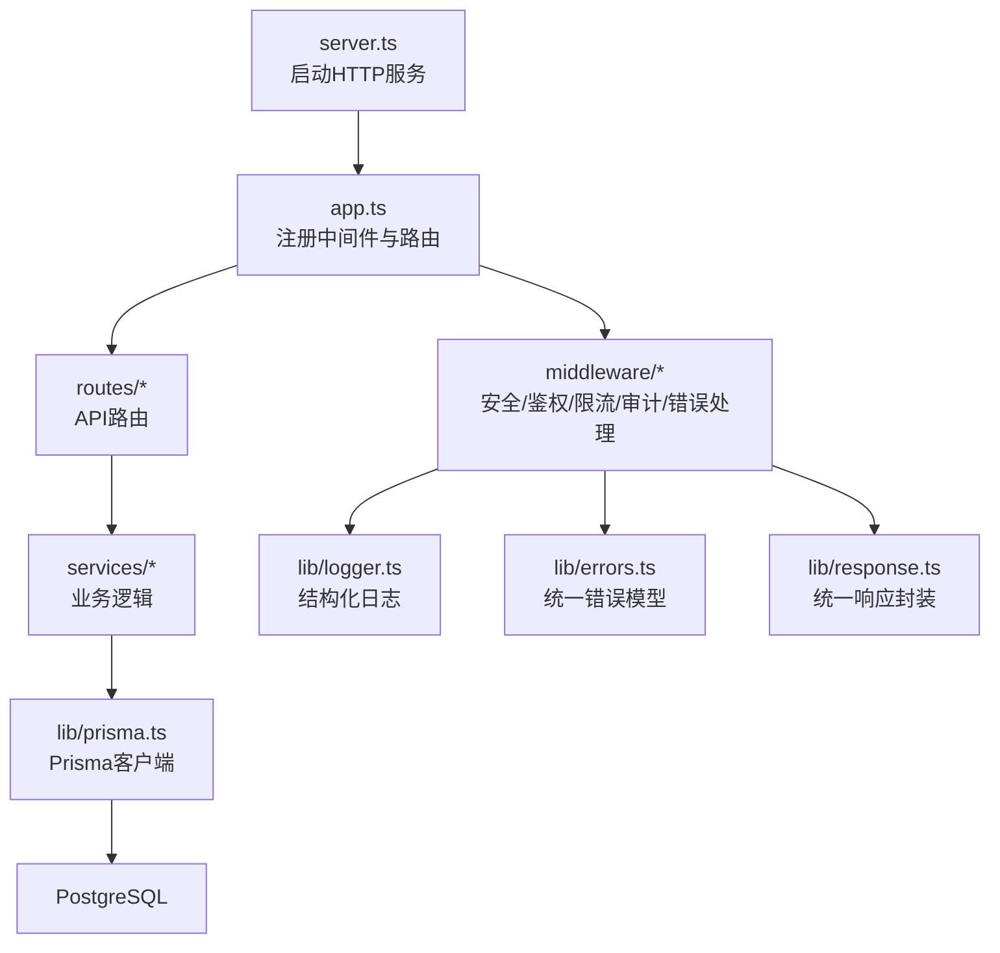
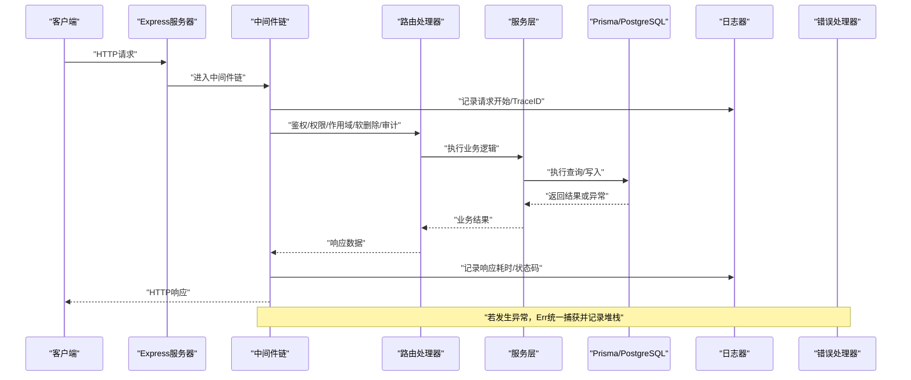
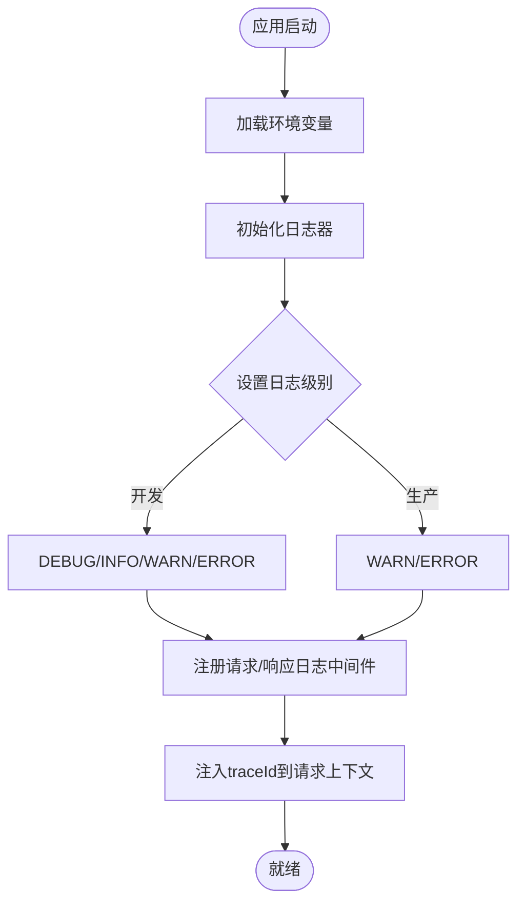
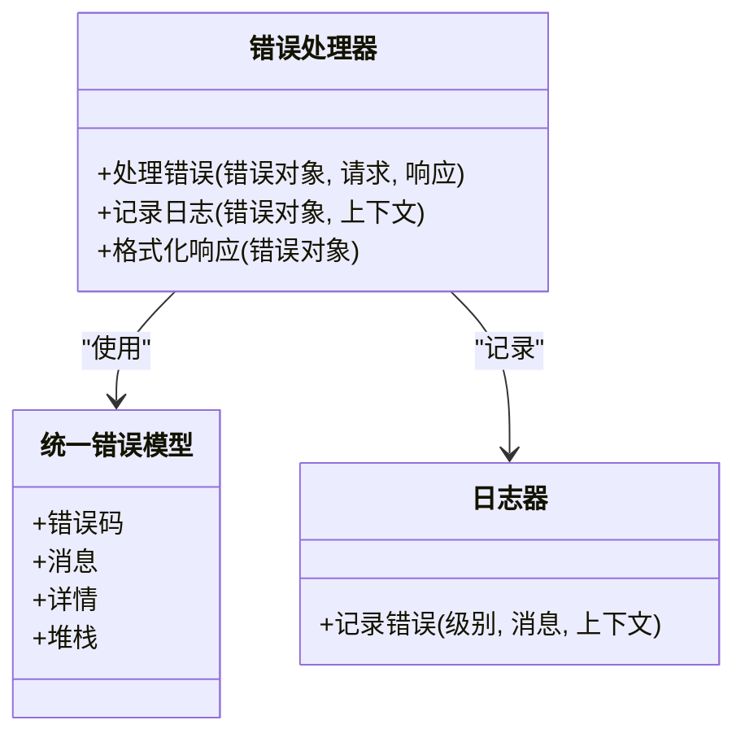
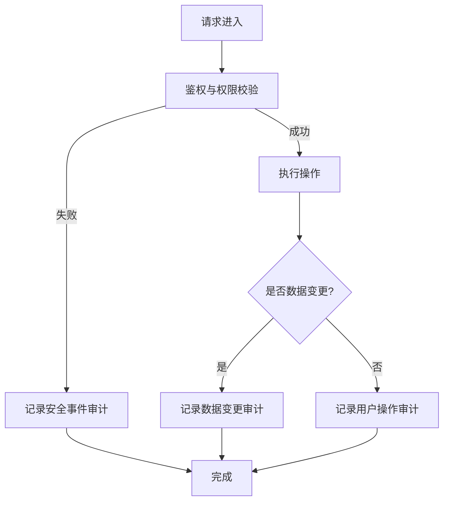
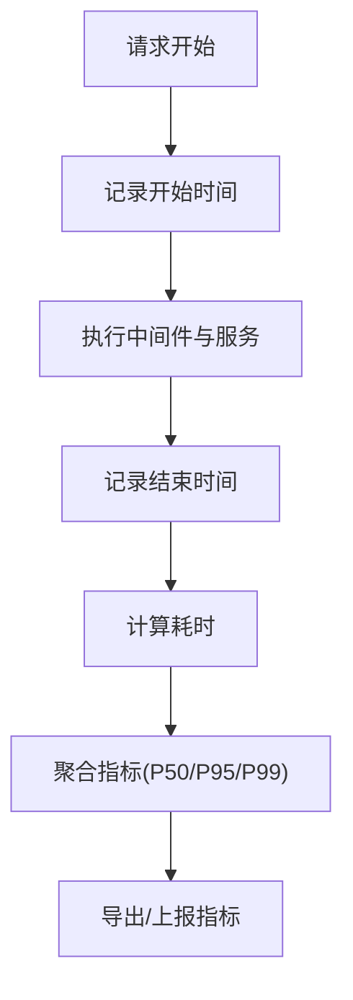
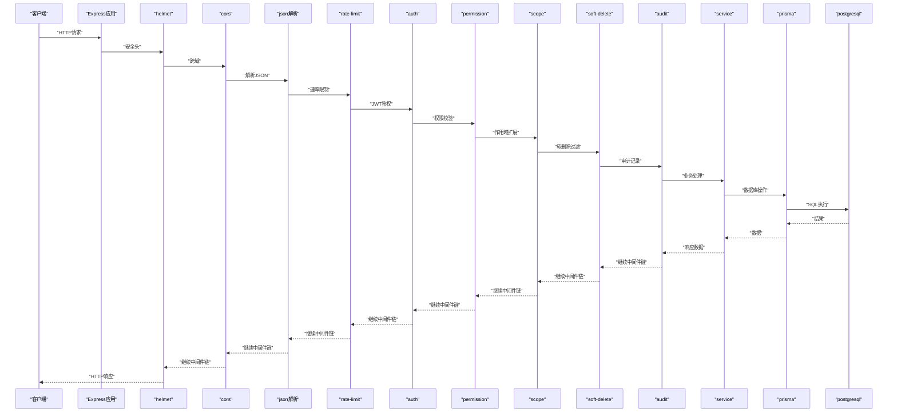
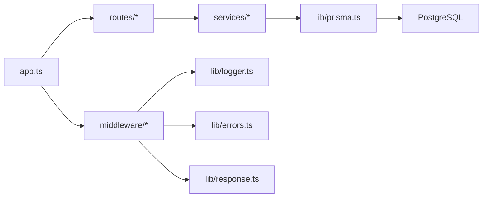

# 日志分析与监控

<cite>
**本文引用的文件**   
- [server/src/app.ts](file://server/src/app.ts)
- [server/src/server.ts](file://server/src/server.ts)
- [server/src/lib/logger.ts](file://server/src/lib/logger.ts)
- [server/src/middleware/error-handler.ts](file://server/src/middleware/error-handler.ts)
- [server/src/middleware/audit.ts](file://server/src/middleware/audit.ts)
- [server/src/middleware/trace-id.ts](file://server/src/middleware/trace-id.ts)
- [server/src/middleware/rate-limit.ts](file://server/src/middleware/rate-limit.ts)
- [server/src/middleware/auth.ts](file://server/src/middleware/auth.ts)
- [server/src/middleware/permission.ts](file://server/src/middleware/permission.ts)
- [server/src/middleware/scope.ts](file://server/src/middleware/scope.ts)
- [server/src/middleware/soft-delete.ts](file://server/src/middleware/soft-delete.ts)
- [server/src/middleware/helmet.ts](file://server/src/middleware/helmet.ts)
- [server/src/middleware/cors.ts](file://server/src/middleware/cors.ts)
- [server/src/lib/errors.ts](file://server/src/lib/errors.ts)
- [server/src/lib/prisma.ts](file://server/src/lib/prisma.ts)
- [server/src/config/env.ts](file://server/src/config/env.ts)
- [server/src/routes/admin.ts](file://server/src/routes/admin.ts)
- [server/src/routes/auth.ts](file://server/src/routes/auth.ts)
- [server/src/routes/data.ts](file://server/src/routes/data.ts)
- [server/src/routes/reports.ts](file://server/src/routes/reports.ts)
- [server/src/services/AdminService.ts](file://server/src/services/AdminService.ts)
- [server/src/services/AuthService.ts](file://server/src/services/AuthService.ts)
- [server/src/services/DataService.ts](file://server/src/services/DataService.ts)
- [server/src/services/ReportService.ts](file://server/src/services/ReportService.ts)
- [server/src/lib/response.ts](file://server/src/lib/response.ts)
- [server/src/lib/metric-values.ts](file://server/src/lib/metric-values.ts)
</cite>

## 目录
1. [引言](#引言)
2. [项目结构](#项目结构)
3. [核心组件](#核心组件)
4. [架构总览](#架构总览)
5. [详细组件分析](#详细组件分析)
6. [依赖关系分析](#依赖关系分析)
7. [性能考虑](#性能考虑)
8. [故障排查指南](#故障排查指南)
9. [结论](#结论)
10. [附录](#附录)

## 引言
本指南面向FY200项目的日志分析与监控，覆盖结构化日志配置与使用、错误追踪机制、审计日志规范、性能监控指标以及生产环境日志收集与告警实践。目标是帮助研发与运维团队快速定位问题、保障系统稳定性并提升可观测性。

## 项目结构
后端采用Express中间件链式处理请求，关键路径包括：应用初始化、中间件注册、路由分发、服务层调用、数据库访问与响应封装。日志与监控贯穿整个链路。

图表来源
- [server/src/server.ts](file://server/src/server.ts)
- [server/src/app.ts](file://server/src/app.ts)
- [server/src/lib/logger.ts](file://server/src/lib/logger.ts)
- [server/src/lib/errors.ts](file://server/src/lib/errors.ts)
- [server/src/lib/response.ts](file://server/src/lib/response.ts)
- [server/src/lib/prisma.ts](file://server/src/lib/prisma.ts)

章节来源
- [server/src/server.ts](file://server/src/server.ts)
- [server/src/app.ts](file://server/src/app.ts)

## 核心组件
- 结构化日志：集中式日志库封装，支持级别控制、字段标准化、上下文注入（如traceId）。
- 错误追踪：全局错误处理中间件捕获异常，统一错误码与堆栈信息输出。
- 审计日志：在数据变更与安全事件处记录操作主体、动作、资源、结果与时间戳。
- 性能指标：API响应时间、数据库查询耗时、内存与连接池状态等。
- 中间件链：按固定顺序执行，确保安全、鉴权、权限、作用域、软删除、审计与错误处理的正确性。

章节来源
- [server/src/lib/logger.ts](file://server/src/lib/logger.ts)
- [server/src/middleware/error-handler.ts](file://server/src/middleware/error-handler.ts)
- [server/src/middleware/audit.ts](file://server/src/middleware/audit.ts)
- [server/src/lib/errors.ts](file://server/src/lib/errors.ts)
- [server/src/lib/response.ts](file://server/src/lib/response.ts)

## 架构总览
下图展示一次典型API请求的完整生命周期，包含日志埋点、错误处理与审计记录的关键节点。

图表来源
- [server/src/app.ts](file://server/src/app.ts)
- [server/src/middleware/error-handler.ts](file://server/src/middleware/error-handler.ts)
- [server/src/middleware/audit.ts](file://server/src/middleware/audit.ts)
- [server/src/lib/logger.ts](file://server/src/lib/logger.ts)
- [server/src/lib/prisma.ts](file://server/src/lib/prisma.ts)

## 详细组件分析

### 结构化日志配置与使用
- 日志级别：根据运行环境动态设置（开发/测试/生产），避免在生产环境输出调试级日志。
- 日志格式：JSON结构化字段包含时间戳、级别、消息、模块、traceId、用户标识、请求方法、URL、状态码、耗时等。
- 上下文注入：通过中间件为每个请求注入traceId与用户上下文，便于跨链路追踪。
- 轮转策略：建议按天或大小进行文件轮转，保留周期与压缩策略由部署平台管理。

图表来源
- [server/src/lib/logger.ts](file://server/src/lib/logger.ts)
- [server/src/config/env.ts](file://server/src/config/env.ts)
- [server/src/middleware/trace-id.ts](file://server/src/middleware/trace-id.ts)

章节来源
- [server/src/lib/logger.ts](file://server/src/lib/logger.ts)
- [server/src/config/env.ts](file://server/src/config/env.ts)
- [server/src/middleware/trace-id.ts](file://server/src/middleware/trace-id.ts)

### 错误追踪机制
- 全局错误处理中间件：捕获未处理异常与显式抛出的业务错误，统一返回错误结构与堆栈信息（生产环境隐藏敏感细节）。
- 异常捕获策略：在服务层与路由层抛出标准错误对象，包含错误码、消息与可选详情；数据库异常与第三方API异常需映射为业务错误。
- 堆栈信息收集：记录调用栈与上下文（traceId、用户、请求体摘要），用于问题定位与复盘。

图表来源
- [server/src/middleware/error-handler.ts](file://server/src/middleware/error-handler.ts)
- [server/src/lib/errors.ts](file://server/src/lib/errors.ts)
- [server/src/lib/logger.ts](file://server/src/lib/logger.ts)

章节来源
- [server/src/middleware/error-handler.ts](file://server/src/middleware/error-handler.ts)
- [server/src/lib/errors.ts](file://server/src/lib/errors.ts)

### 审计日志记录规范
- 用户操作审计：记录登录、登出、权限变更、角色分配等操作，包含用户ID、操作类型、目标资源、结果与时间戳。
- 数据变更审计：对关键表（如公司、科目、报表）的增删改操作记录差异摘要与操作人。
- 安全事件审计：记录鉴权失败、越权尝试、异常访问模式与频率限制触发。

图表来源
- [server/src/middleware/audit.ts](file://server/src/middleware/audit.ts)
- [server/src/middleware/auth.ts](file://server/src/middleware/auth.ts)
- [server/src/middleware/permission.ts](file://server/src/middleware/permission.ts)

章节来源
- [server/src/middleware/audit.ts](file://server/src/middleware/audit.ts)
- [server/src/middleware/auth.ts](file://server/src/middleware/auth.ts)
- [server/src/middleware/permission.ts](file://server/src/middleware/permission.ts)

### 性能监控指标
- API响应时间：在请求开始与结束记录耗时，按接口维度聚合P50/P95/P99。
- 数据库查询性能：通过Prisma钩子或中间件记录慢查询SQL与耗时，识别N+1与索引缺失。
- 内存使用情况：定期采集进程内存峰值、堆占用与GC情况，结合负载评估扩容阈值。
- 指标采集：将关键指标暴露为Prometheus格式或通过日志上报至监控系统。

图表来源
- [server/src/app.ts](file://server/src/app.ts)
- [server/src/lib/metric-values.ts](file://server/src/lib/metric-values.ts)

章节来源
- [server/src/lib/metric-values.ts](file://server/src/lib/metric-values.ts)

### 中间件链与执行顺序
按照项目约定顺序注册中间件，确保安全性与可观测性：
- helmet → cors → express.json → rate-limit → auth(JWT+黑名单) → permission(默认拒绝) → scope(Prisma extension) → softDelete → audit → Service → Prisma → PostgreSQL

图表来源
- [server/src/app.ts](file://server/src/app.ts)
- [server/src/middleware/helmet.ts](file://server/src/middleware/helmet.ts)
- [server/src/middleware/cors.ts](file://server/src/middleware/cors.ts)
- [server/src/middleware/rate-limit.ts](file://server/src/middleware/rate-limit.ts)
- [server/src/middleware/auth.ts](file://server/src/middleware/auth.ts)
- [server/src/middleware/permission.ts](file://server/src/middleware/permission.ts)
- [server/src/middleware/scope.ts](file://server/src/middleware/scope.ts)
- [server/src/middleware/soft-delete.ts](file://server/src/middleware/soft-delete.ts)
- [server/src/middleware/audit.ts](file://server/src/middleware/audit.ts)
- [server/src/lib/prisma.ts](file://server/src/lib/prisma.ts)

章节来源
- [server/src/app.ts](file://server/src/app.ts)

## 依赖关系分析
- 应用入口依赖中间件与路由，路由依赖服务层，服务层依赖Prisma与数据库。
- 日志与错误处理贯穿中间件与服务层，确保全链路可观测。
- 审计中间件依赖鉴权与作用域中间件的结果，以生成准确的审计上下文。

图表来源
- [server/src/app.ts](file://server/src/app.ts)
- [server/src/lib/logger.ts](file://server/src/lib/logger.ts)
- [server/src/lib/errors.ts](file://server/src/lib/errors.ts)
- [server/src/lib/response.ts](file://server/src/lib/response.ts)
- [server/src/lib/prisma.ts](file://server/src/lib/prisma.ts)

章节来源
- [server/src/app.ts](file://server/src/app.ts)

## 性能考虑
- 日志开销：生产环境降低日志级别，避免高频DEBUG输出；异步写入日志以减少阻塞。
- 指标采样：对高QPS接口进行采样统计，避免指标上报成为瓶颈。
- 数据库优化：通过慢查询日志与索引优化减少长事务与锁竞争。
- 内存管理：监控堆增长趋势，及时定位内存泄漏与对象持有过久的问题。

[本节为通用指导，不直接分析具体文件]

## 故障排查指南
- 错误定位：通过traceId串联请求日志与错误堆栈，快速定位问题根因。
- 审计回溯：利用审计日志还原用户操作轨迹，确认数据变更来源与责任。
- 性能瓶颈：结合API耗时与数据库慢查询日志，识别热点接口与低效SQL。
- 告警策略：针对错误率、延迟P95、内存峰值、连接池耗尽等设定阈值告警。

章节来源
- [server/src/middleware/error-handler.ts](file://server/src/middleware/error-handler.ts)
- [server/src/middleware/audit.ts](file://server/src/middleware/audit.ts)
- [server/src/lib/logger.ts](file://server/src/lib/logger.ts)

## 结论
通过统一的日志、错误处理与审计机制，配合性能监控与告警，FY200项目可实现端到端可观测性与稳定性保障。建议在部署阶段完善日志轮转与聚合方案，持续优化指标采集与告警规则，形成闭环的运维体系。

[本节为总结性内容，不直接分析具体文件]

## 附录
- 生产环境日志收集与监控告警配置建议：
  - 日志收集：使用容器日志采集器（如Fluent Bit/Filebeat）将stdout/stderr与文件日志汇聚至ELK/ Loki。
  - 指标上报：Prometheus抓取应用暴露的指标端点，Grafana可视化与告警。
  - 告警规则：基于错误率、延迟、资源使用率设定阈值，通知渠道包括邮件、企业微信、钉钉。
  - 日志轮转：按天切割、保留30天、压缩归档，避免磁盘占满。

[本节为通用指导，不直接分析具体文件]