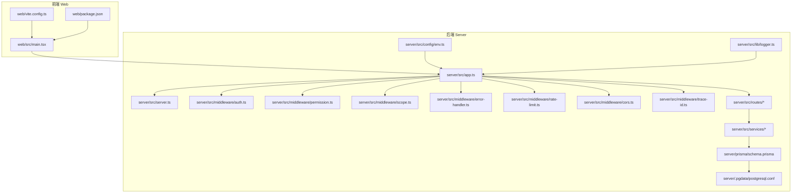
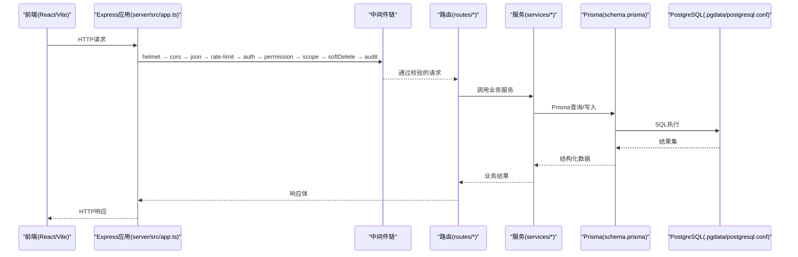
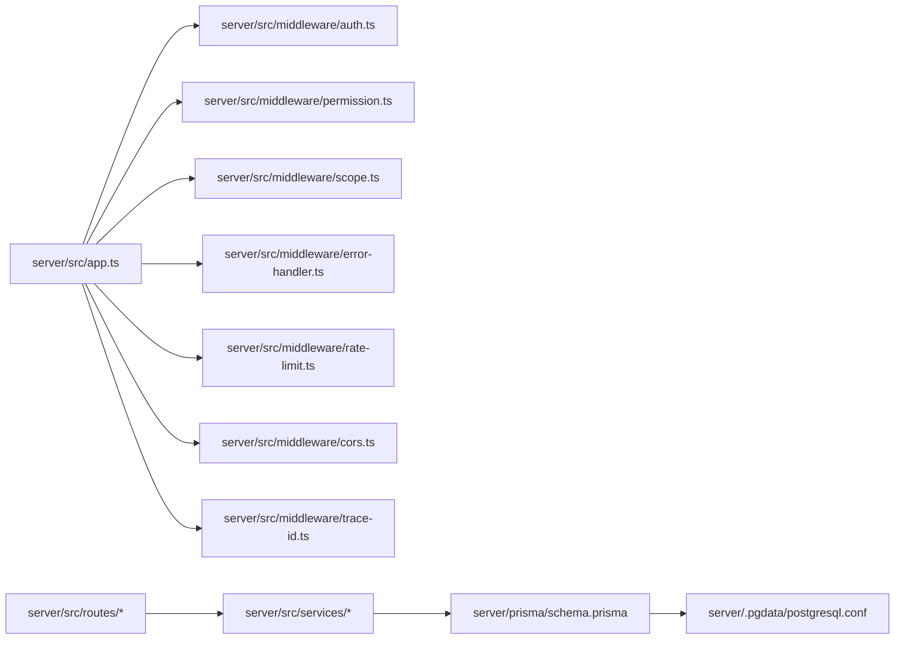

# 调试技巧与故障排除

<cite>
**本文引用的文件**   
- [server/src/app.ts](file://server/src/app.ts)
- [server/src/server.ts](file://server/src/server.ts)
- [server/src/config/env.ts](file://server/src/config/env.ts)
- [server/src/lib/logger.ts](file://server/src/lib/logger.ts)
- [server/src/middleware/auth.ts](file://server/src/middleware/auth.ts)
- [server/src/middleware/permission.ts](file://server/src/middleware/permission.ts)
- [server/src/middleware/scope.ts](file://server/src/middleware/scope.ts)
- [server/src/middleware/error-handler.ts](file://server/src/middleware/error-handler.ts)
- [server/src/middleware/rate-limit.ts](file://server/src/middleware/rate-limit.ts)
- [server/src/middleware/cors.ts](file://server/src/middleware/cors.ts)
- [server/src/middleware/trace-id.ts](file://server/src/middleware/trace-id.ts)
- [server/src/routes/auth.ts](file://server/src/routes/auth.ts)
- [server/src/services/AuthService.ts](file://server/src/services/AuthService.ts)
- [server/prisma/schema.prisma](file://server/prisma/schema.prisma)
- [server/.pgdata/postgresql.conf](file://server/.pgdata/postgresql.conf)
- [web/src/main.tsx](file://web/src/main.tsx)
- [web/vite.config.ts](file://web/vite.config.ts)
- [web/package.json](file://web/package.json)
- [server/package.json](file://server/package.json)
</cite>

## 目录
1. [简介](#简介)
2. [项目结构](#项目结构)
3. [核心组件](#核心组件)
4. [架构总览](#架构总览)
5. [详细组件分析](#详细组件分析)
6. [依赖关系分析](#依赖关系分析)
7. [性能考量](#性能考量)
8. [故障排除指南](#故障排除指南)
9. [结论](#结论)
10. [附录](#附录)

## 简介
本指南面向FY200项目的开发与运维人员，聚焦后端Node.js（Express + Prisma）与前端React（Vite）的调试技巧、日志分析、常用工具、常见问题诊断、性能分析与内存泄漏检测，以及生产环境故障排查流程与应急响应预案。内容基于仓库中的实际代码结构与中间件链路，确保可操作性与可追溯性。

## 项目结构
FY200采用前后端分离：
- 后端位于 server/，使用 Express 路由与中间件链，Prisma 连接 PostgreSQL，JWT 鉴权与权限控制贯穿请求处理。
- 前端位于 web/，使用 Vite 构建与 React 组件化开发。

图表来源
- [server/src/app.ts](file://server/src/app.ts)
- [server/src/server.ts](file://server/src/server.ts)
- [server/src/config/env.ts](file://server/src/config/env.ts)
- [server/src/lib/logger.ts](file://server/src/lib/logger.ts)
- [server/src/middleware/auth.ts](file://server/src/middleware/auth.ts)
- [server/src/middleware/permission.ts](file://server/src/middleware/permission.ts)
- [server/src/middleware/scope.ts](file://server/src/middleware/scope.ts)
- [server/src/middleware/error-handler.ts](file://server/src/middleware/error-handler.ts)
- [server/src/middleware/rate-limit.ts](file://server/src/middleware/rate-limit.ts)
- [server/src/middleware/cors.ts](file://server/src/middleware/cors.ts)
- [server/src/middleware/trace-id.ts](file://server/src/middleware/trace-id.ts)
- [server/prisma/schema.prisma](file://server/prisma/schema.prisma)
- [server/.pgdata/postgresql.conf](file://server/.pgdata/postgresql.conf)
- [web/src/main.tsx](file://web/src/main.tsx)
- [web/vite.config.ts](file://web/vite.config.ts)
- [web/package.json](file://web/package.json)

章节来源
- [server/src/app.ts](file://server/src/app.ts)
- [server/src/server.ts](file://server/src/server.ts)
- [web/src/main.tsx](file://web/src/main.tsx)
- [web/vite.config.ts](file://web/vite.config.ts)

## 核心组件
- 应用启动与配置
  - 入口服务与Express应用装配在 server/src/server.ts 与 server/src/app.ts。
  - 环境变量加载于 server/src/config/env.ts。
- 日志系统
  - 统一日志输出与格式化在 server/src/lib/logger.ts。
- 中间件链
  - 安全与跨域：helmet、cors、express.json、rate-limit、auth、permission、scope、soft-delete、audit、error-handler、trace-id。
  - 关键中间件实现位于 server/src/middleware/*。
- 路由与服务
  - 路由定义在 server/src/routes/*，业务逻辑在 server/src/services/*。
- 数据层
  - Prisma 模型与迁移在 server/prisma/*，数据库配置在 server/.pgdata/postgresql.conf。
- 前端
  - React 应用入口在 web/src/main.tsx，Vite 配置在 web/vite.config.ts。

章节来源
- [server/src/server.ts](file://server/src/server.ts)
- [server/src/app.ts](file://server/src/app.ts)
- [server/src/config/env.ts](file://server/src/config/env.ts)
- [server/src/lib/logger.ts](file://server/src/lib/logger.ts)
- [server/src/middleware/auth.ts](file://server/src/middleware/auth.ts)
- [server/src/middleware/permission.ts](file://server/src/middleware/permission.ts)
- [server/src/middleware/scope.ts](file://server/src/middleware/scope.ts)
- [server/src/middleware/error-handler.ts](file://server/src/middleware/error-handler.ts)
- [server/src/middleware/rate-limit.ts](file://server/src/middleware/rate-limit.ts)
- [server/src/middleware/cors.ts](file://server/src/middleware/cors.ts)
- [server/src/middleware/trace-id.ts](file://server/src/middleware/trace-id.ts)
- [server/prisma/schema.prisma](file://server/prisma/schema.prisma)
- [server/.pgdata/postgresql.conf](file://server/.pgdata/postgresql.conf)
- [web/src/main.tsx](file://web/src/main.tsx)
- [web/vite.config.ts](file://web/vite.config.ts)

## 架构总览
请求从前端发起，经过浏览器开发者工具与网络栈到达后端Express应用，依次通过中间件链完成安全、限流、鉴权、权限校验、作用域扩展、软删除、审计与错误处理，最终进入路由与服务层，调用Prisma访问PostgreSQL。

图表来源
- [server/src/app.ts](file://server/src/app.ts)
- [server/src/middleware/auth.ts](file://server/src/middleware/auth.ts)
- [server/src/middleware/permission.ts](file://server/src/middleware/permission.ts)
- [server/src/middleware/scope.ts](file://server/src/middleware/scope.ts)
- [server/src/middleware/error-handler.ts](file://server/src/middleware/error-handler.ts)
- [server/src/middleware/rate-limit.ts](file://server/src/middleware/rate-limit.ts)
- [server/src/middleware/cors.ts](file://server/src/middleware/cors.ts)
- [server/src/middleware/trace-id.ts](file://server/src/middleware/trace-id.ts)
- [server/prisma/schema.prisma](file://server/prisma/schema.prisma)
- [server/.pgdata/postgresql.conf](file://server/.pgdata/postgresql.conf)

## 详细组件分析

### 断点调试方法（VSCode、Node.js、React）
- VSCode调试配置要点
  - Node.js调试：在VSCode中创建 launch.json，设置 program 指向后端入口（如 server/src/server.ts），runtimeArgs 包含 --inspect 或 --inspect-brk，sourceMaps 指向 TypeScript 编译产物路径。
  - React调试：在 web/vite.config.ts 中启用 sourceMap 与 HMR；在VSCode中配置 Chrome 调试器，Attach 到 localhost 端口，设置 breakpoints 于 web/src/main.tsx 及页面组件。
- 后端Node.js调试
  - 使用 node --inspect 启动，或在 package.json scripts 中添加 debug 命令；在VSCode中 Attach 进程进行断点调试。
  - 针对异步与Promise链，建议在关键函数入口与异常捕获处设置断点，结合日志定位问题。
- 前端React调试
  - 使用浏览器开发者工具的Sources面板设置断点，查看调用栈与变量状态；Network面板检查API请求与响应。
  - 对于Vite热更新，确保 vite.config.ts 的 proxy 配置正确，避免断点失效。

章节来源
- [web/vite.config.ts](file://web/vite.config.ts)
- [web/src/main.tsx](file://web/src/main.tsx)
- [server/src/server.ts](file://server/src/server.ts)
- [server/package.json](file://server/package.json)
- [web/package.json](file://web/package.json)

### 日志分析技巧
- 结构化日志查看
  - 后端日志由 server/src/lib/logger.ts 统一输出，建议按级别（info/warn/error）与模块分类过滤；在生产环境启用JSON格式以便日志聚合平台解析。
- 错误追踪
  - 使用 error-handler 中间件捕获未处理异常，记录堆栈与上下文；结合 trace-id 中间件为每个请求生成唯一标识，便于跨服务关联日志。
- 性能监控
  - 在关键路由与服务方法中记录耗时指标，结合 rate-limit 中间件的统计信息，识别慢查询与瓶颈。

章节来源
- [server/src/lib/logger.ts](file://server/src/lib/logger.ts)
- [server/src/middleware/error-handler.ts](file://server/src/middleware/error-handler.ts)
- [server/src/middleware/trace-id.ts](file://server/src/middleware/trace-id.ts)
- [server/src/middleware/rate-limit.ts](file://server/src/middleware/rate-limit.ts)

### 常用调试工具
- 浏览器开发者工具
  - 使用 Network 面板检查API请求状态码、响应时间与负载大小；Console 面板查看前端错误与警告。
- API测试工具
  - 推荐使用 Postman 或 curl 直接调用后端接口，验证鉴权、权限与作用域逻辑；结合环境变量模拟不同用户角色。
- 数据库查询工具
  - 使用 psql 或图形化工具（如 DBeaver）连接 PostgreSQL，执行SQL验证Prisma生成的查询；开启慢查询日志定位性能问题。

章节来源
- [server/.pgdata/postgresql.conf](file://server/.pgdata/postgresql.conf)
- [server/prisma/schema.prisma](file://server/prisma/schema.prisma)

### 常见问题诊断方法
- 网络连接问题
  - 检查 CORS 配置（server/src/middleware/cors.ts）与代理设置（web/vite.config.ts）；确认防火墙与端口映射。
- 数据库连接问题
  - 验证 PostgreSQL 服务状态与连接参数（server/.pgdata/postgresql.conf）；检查 Prisma 连接池与迁移状态。
- 权限认证问题
  - 审查 JWT 签发与刷新逻辑（server/src/services/AuthService.ts 与 server/src/routes/auth.ts）；确认权限中间件（server/src/middleware/permission.ts）与范围限制（server/src/middleware/scope.ts）。

章节来源
- [server/src/middleware/cors.ts](file://server/src/middleware/cors.ts)
- [web/vite.config.ts](file://web/vite.config.ts)
- [server/.pgdata/postgresql.conf](file://server/.pgdata/postgresql.conf)
- [server/prisma/schema.prisma](file://server/prisma/schema.prisma)
- [server/src/services/AuthService.ts](file://server/src/services/AuthService.ts)
- [server/src/routes/auth.ts](file://server/src/routes/auth.ts)
- [server/src/middleware/permission.ts](file://server/src/middleware/permission.ts)
- [server/src/middleware/scope.ts](file://server/src/middleware/scope.ts)

### 性能分析与内存泄漏检测
- 性能分析
  - 使用 Node.js 内置 --prof 选项生成性能快照，或通过 clinic.js 工具分析CPU与内存使用；前端使用浏览器 Performance 面板录制用户操作。
- 内存泄漏检测
  - 在后端使用 heapdump 模块定期生成堆快照，对比分析对象增长趋势；在前端使用 Chrome Memory 面板查找未释放引用。

章节来源
- [server/package.json](file://server/package.json)
- [web/package.json](file://web/package.json)

### 生产环境故障排查流程与应急响应预案
- 故障排查流程
  - 收集错误日志与trace-id，定位受影响的服务与用户；复现问题并隔离变更；逐步回滚或修复后验证。
- 应急响应预案
  - 启用降级策略（如关闭非核心功能）；通知相关团队与用户；事后复盘并更新监控告警规则。

章节来源
- [server/src/middleware/error-handler.ts](file://server/src/middleware/error-handler.ts)
- [server/src/lib/logger.ts](file://server/src/lib/logger.ts)

## 依赖关系分析
后端模块间依赖清晰，中间件按顺序装配，服务层依赖Prisma与数据库，前端依赖Vite与React生态。

图表来源
- [server/src/app.ts](file://server/src/app.ts)
- [server/src/middleware/auth.ts](file://server/src/middleware/auth.ts)
- [server/src/middleware/permission.ts](file://server/src/middleware/permission.ts)
- [server/src/middleware/scope.ts](file://server/src/middleware/scope.ts)
- [server/src/middleware/error-handler.ts](file://server/src/middleware/error-handler.ts)
- [server/src/middleware/rate-limit.ts](file://server/src/middleware/rate-limit.ts)
- [server/src/middleware/cors.ts](file://server/src/middleware/cors.ts)
- [server/src/middleware/trace-id.ts](file://server/src/middleware/trace-id.ts)
- [server/prisma/schema.prisma](file://server/prisma/schema.prisma)
- [server/.pgdata/postgresql.conf](file://server/.pgdata/postgresql.conf)

章节来源
- [server/src/app.ts](file://server/src/app.ts)
- [server/prisma/schema.prisma](file://server/prisma/schema.prisma)

## 性能考量
- 中间件优化：避免在鉴权与权限校验中进行I/O操作，减少锁竞争。
- 数据库查询：使用Prisma的select字段裁剪与索引优化，避免N+1查询。
- 前端渲染：懒加载组件与虚拟滚动提升大数据表格性能。

[本节为通用指导，无需特定文件来源]

## 故障排除指南
- 快速定位：通过trace-id关联前后端日志，缩小问题范围。
- 常见错误：检查CORS、JWT过期、权限不足、数据库连接失败等。
- 恢复步骤：重启服务、清理缓存、回滚代码或配置。

章节来源
- [server/src/middleware/trace-id.ts](file://server/src/middleware/trace-id.ts)
- [server/src/middleware/cors.ts](file://server/src/middleware/cors.ts)
- [server/src/middleware/auth.ts](file://server/src/middleware/auth.ts)
- [server/src/middleware/permission.ts](file://server/src/middleware/permission.ts)
- [server/.pgdata/postgresql.conf](file://server/.pgdata/postgresql.conf)

## 结论
本指南提供了FY200项目从开发到生产的完整调试与排障方案，涵盖断点调试、日志分析、工具使用、问题诊断、性能优化与应急响应。遵循本文档可显著提升问题定位效率与系统稳定性。

[本节为总结性内容，无需特定文件来源]

## 附录
- 环境变量参考：server/src/config/env.ts
- 数据库Schema：server/prisma/schema.prisma
- 前端入口：web/src/main.tsx
- 构建配置：web/vite.config.ts

章节来源
- [server/src/config/env.ts](file://server/src/config/env.ts)
- [server/prisma/schema.prisma](file://server/prisma/schema.prisma)
- [web/src/main.tsx](file://web/src/main.tsx)
- [web/vite.config.ts](file://web/vite.config.ts)