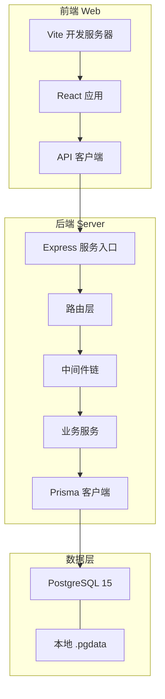
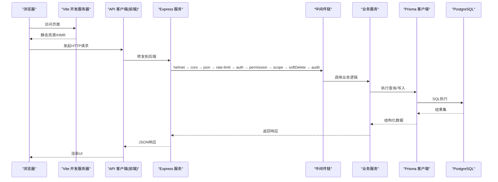
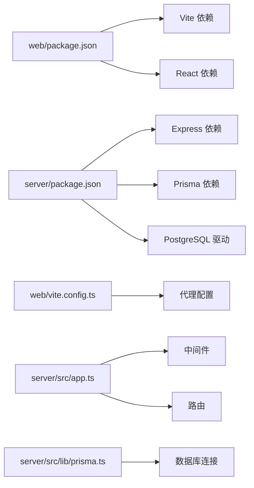

# 调试环境配置

<cite>
**本文引用的文件**   
- [server/package.json](file://server/package.json)
- [server/tsconfig.json](file://server/tsconfig.json)
- [server/src/config/env.ts](file://server/src/config/env.ts)
- [server/src/app.ts](file://server/src/app.ts)
- [server/src/server.ts](file://server/src/server.ts)
- [server/prisma/schema.prisma](file://server/prisma/schema.prisma)
- [server/scripts/local-db.ts](file://server/scripts/local-db.ts)
- [web/package.json](file://web/package.json)
- [web/vite.config.ts](file://web/vite.config.ts)
- [web/src/lib/api.ts](file://web/src/lib/api.ts)
- [web/src/main.tsx](file://web/src/main.tsx)
</cite>

## 目录
1. [简介](#简介)
2. [项目结构](#项目结构)
3. [核心组件](#核心组件)
4. [架构总览](#架构总览)
5. [详细组件分析](#详细组件分析)
6. [依赖分析](#依赖分析)
7. [性能考虑](#性能考虑)
8. [故障排查指南](#故障排查指南)
9. [结论](#结论)
10. [附录](#附录)

## 简介
本指南面向FY200项目的开发与调试，目标是帮助你在本地快速搭建并稳定运行“后端Node.js + Express + Prisma + PostgreSQL”与“前端React + Vite”的联调环境。内容涵盖：
- VSCode调试配置（后端、前端、数据库）
- 环境变量配置（开发/生产差异）
- 调试工具安装与使用（浏览器开发者工具、Postman/Insomnia、DBeaver/pgAdmin）
- 断点调试最佳实践（条件断点、日志断点、异常断点）
- 常见问题解决方案与性能分析工具集成

## 项目结构
FY200采用前后端分离：
- server：Express后端、Prisma数据层、PostgreSQL本地数据目录
- web：Vite驱动的React前端
- docs/.wiki：参考文档与API说明

图表来源
- [server/src/server.ts](file://server/src/server.ts)
- [server/src/app.ts](file://server/src/app.ts)
- [web/vite.config.ts](file://web/vite.config.ts)
- [web/src/lib/api.ts](file://web/src/lib/api.ts)

章节来源
- [server/package.json](file://server/package.json)
- [web/package.json](file://web/package.json)
- [server/src/server.ts](file://server/src/server.ts)
- [server/src/app.ts](file://server/src/app.ts)
- [web/vite.config.ts](file://web/vite.config.ts)
- [web/src/lib/api.ts](file://web/src/lib/api.ts)

## 核心组件
- 后端启动与配置
  - Express应用初始化、中间件注册、路由挂载、端口监听
  - Prisma客户端初始化与连接池配置
- 前端开发服务器
  - Vite开发服务器、代理到后端API、HMR热更新
- 数据库
  - PostgreSQL 15本地实例（含.pgdata），Prisma迁移与种子数据

章节来源
- [server/src/app.ts](file://server/src/app.ts)
- [server/src/server.ts](file://server/src/server.ts)
- [server/prisma/schema.prisma](file://server/prisma/schema.prisma)
- [web/vite.config.ts](file://web/vite.config.ts)

## 架构总览
下图展示从浏览器请求到数据库查询的完整链路，以及关键中间件执行顺序。

图表来源
- [server/src/app.ts](file://server/src/app.ts)
- [server/src/middleware/cors.ts](file://server/src/middleware/cors.ts)
- [server/src/middleware/auth.ts](file://server/src/middleware/auth.ts)
- [server/src/middleware/permission.ts](file://server/src/middleware/permission.ts)
- [server/src/middleware/scope.ts](file://server/src/middleware/scope.ts)
- [server/src/middleware/soft-delete.ts](file://server/src/middleware/soft-delete.ts)
- [server/src/middleware/audit.ts](file://server/src/middleware/audit.ts)
- [server/src/lib/prisma.ts](file://server/src/lib/prisma.ts)

## 详细组件分析

### 后端 Node.js 调试配置（VSCode）
目标：在VSCode中直接调试Express应用，支持源码映射、断点命中、变量查看。

步骤要点
- 安装依赖
  - 进入server目录，执行包管理器安装依赖
- 准备数据库
  - 确保PostgreSQL 15已启动，或使用脚本拉起本地实例
  - 执行Prisma迁移与种子数据
- 创建VSCode调试配置
  - 新增launch.json，选择Node.js调试器
  - 设置程序入口为Express启动文件
  - 启用sourceMaps以映射TypeScript源码
  - 注入环境变量（推荐通过.env或launch.json envFile）
- 常用命令
  - 开发模式：带调试参数启动
  - 重启策略：自动重启以便快速迭代

建议的launch.json字段说明
- name：调试配置名称
- type：node
- request：launch
- program：指向Express入口文件
- cwd：工作目录（server）
- sourceMaps：true
- envFile：指向.env.development或.env
- runtimeArgs：可传入ts-node或tsx等运行时参数

章节来源
- [server/package.json](file://server/package.json)
- [server/tsconfig.json](file://server/tsconfig.json)
- [server/src/server.ts](file://server/src/server.ts)
- [server/src/app.ts](file://server/src/app.ts)

### 前端 React 开发服务器调试（VSCode + Chrome）
目标：在VSCode中调试React代码，并在Chrome中打断点、查看网络请求与状态。

步骤要点
- 安装依赖
  - 进入web目录，执行包管理器安装依赖
- 启动开发服务器
  - 使用Vite开发模式，开启HMR
- 配置VSCode调试
  - 新增launch.json，选择Chrome调试器
  - 将URL指向本地开发服务器地址
  - 启用sourceMaps以映射TSX/JSX源码
- 配置API代理
  - 在Vite配置中将/api等路径代理到后端Express服务
  - 避免CORS问题，便于联调

章节来源
- [web/package.json](file://web/package.json)
- [web/vite.config.ts](file://web/vite.config.ts)
- [web/src/lib/api.ts](file://web/src/lib/api.ts)
- [web/src/main.tsx](file://web/src/main.tsx)

### 数据库连接调试（PostgreSQL + Prisma）
目标：验证数据库连通性、执行迁移、查看慢查询与连接池状态。

步骤要点
- 启动PostgreSQL
  - 使用系统服务或scripts/local-db.ts脚本
- 配置连接字符串
  - 在环境变量中设置数据库连接信息
- 执行迁移与种子
  - 使用Prisma CLI执行迁移与种子脚本
- 使用客户端工具
  - DBeaver或pgAdmin连接数据库，查看表结构与数据
- 调试技巧
  - 在Prisma客户端处添加日志输出
  - 使用数据库客户端监控SQL执行计划

章节来源
- [server/scripts/local-db.ts](file://server/scripts/local-db.ts)
- [server/prisma/schema.prisma](file://server/prisma/schema.prisma)
- [server/src/lib/prisma.ts](file://server/src/lib/prisma.ts)

### 环境变量配置方法
目标：统一管理开发/测试/生产环境配置，避免硬编码敏感信息。

步骤要点
- 使用.env文件管理环境变量
  - 开发环境：.env.development
  - 生产环境：.env.production
- 关键环境变量
  - 数据库连接串、JWT密钥、第三方API密钥、端口号等
- 加载策略
  - 后端在启动时读取环境变量
  - 前端通过构建时注入或运行时环境变量

章节来源
- [server/src/config/env.ts](file://server/src/config/env.ts)
- [server/package.json](file://server/package.json)
- [web/package.json](file://web/package.json)

### 调试工具安装与配置
- 浏览器开发者工具
  - 启用Sources面板进行源码调试
  - 使用Network面板查看请求与响应
  - 启用Preserve log保留日志
- API测试工具
  - Postman/Insomnia：导入集合，配置环境变量
  - 支持批量测试与自动化脚本
- 数据库客户端
  - DBeaver/pgAdmin：连接PostgreSQL，执行SQL，查看执行计划

章节来源
- [web/src/lib/api.ts](file://web/src/lib/api.ts)
- [server/scripts/local-db.ts](file://server/scripts/local-db.ts)

### 断点调试最佳实践
- 条件断点
  - 在特定条件下触发断点，减少干扰
  - 适用于循环、高频请求场景
- 日志断点
  - 不中断执行，仅输出上下文信息
  - 适合记录关键变量与状态
- 异常断点
  - 捕获未处理异常，快速定位错误
  - 结合错误日志分析根因

章节来源
- [server/src/middleware/error-handler.ts](file://server/src/middleware/error-handler.ts)
- [server/src/lib/logger.ts](file://server/src/lib/logger.ts)

### 常见调试问题解决方案
- CORS跨域问题
  - 检查CORS配置，确保允许前端域名
  - 开发时使用代理避免跨域
- 数据库连接失败
  - 验证连接字符串、用户名密码、端口
  - 检查防火墙与安全组规则
- 端口占用
  - 修改端口或终止占用进程
- 环境变量未生效
  - 确认.env文件位置与命名
  - 检查加载顺序与优先级

章节来源
- [server/src/middleware/cors.ts](file://server/src/middleware/cors.ts)
- [server/src/config/env.ts](file://server/src/config/env.ts)

## 依赖分析
前后端依赖关系清晰，模块间耦合度低，便于独立调试与部署。

图表来源
- [web/package.json](file://web/package.json)
- [server/package.json](file://server/package.json)
- [web/vite.config.ts](file://web/vite.config.ts)
- [server/src/app.ts](file://server/src/app.ts)
- [server/src/lib/prisma.ts](file://server/src/lib/prisma.ts)

章节来源
- [web/package.json](file://web/package.json)
- [server/package.json](file://server/package.json)
- [web/vite.config.ts](file://web/vite.config.ts)
- [server/src/app.ts](file://server/src/app.ts)

## 性能考虑
- 后端性能优化
  - 启用连接池，合理设置最大连接数
  - 使用缓存减少重复计算
  - 异步处理耗时操作
- 前端性能优化
  - 代码分割与懒加载
  - 图片与静态资源优化
  - 使用浏览器性能面板分析瓶颈
- 数据库性能优化
  - 索引优化，避免全表扫描
  - 慢查询分析与优化
  - 连接池监控与调优

[本节提供通用指导，无需具体文件引用]

## 故障排查指南
- 启动失败
  - 检查端口占用、依赖安装、环境变量
- 数据库连接问题
  - 验证连接参数、权限、网络连通性
- API调用失败
  - 检查请求头、参数、认证令牌
  - 查看后端日志与错误堆栈
- 前端渲染异常
  - 检查控制台错误、网络请求状态
  - 使用React DevTools调试组件状态

章节来源
- [server/src/middleware/error-handler.ts](file://server/src/middleware/error-handler.ts)
- [server/src/lib/logger.ts](file://server/src/lib/logger.ts)
- [web/src/lib/api.ts](file://web/src/lib/api.ts)

## 结论
通过本指南的配置与实践，你可以在本地高效搭建FY200项目的调试环境，掌握前后端联调、数据库调试、性能分析等核心技能。建议结合团队规范与最佳实践，持续优化调试流程与问题解决效率。

[本节为总结性内容，无需具体文件引用]

## 附录
- 常用命令速查
  - 后端启动：npm run dev
  - 前端启动：npm run dev
  - 数据库迁移：npx prisma migrate dev
  - 种子数据：npx prisma db seed
- 快捷键参考
  - VSCode调试：F5启动，F9断点，F10单步，F11进入函数
  - Chrome调试：F12打开开发者工具，Ctrl+Shift+P命令面板

[本节为补充信息，无需具体文件引用]