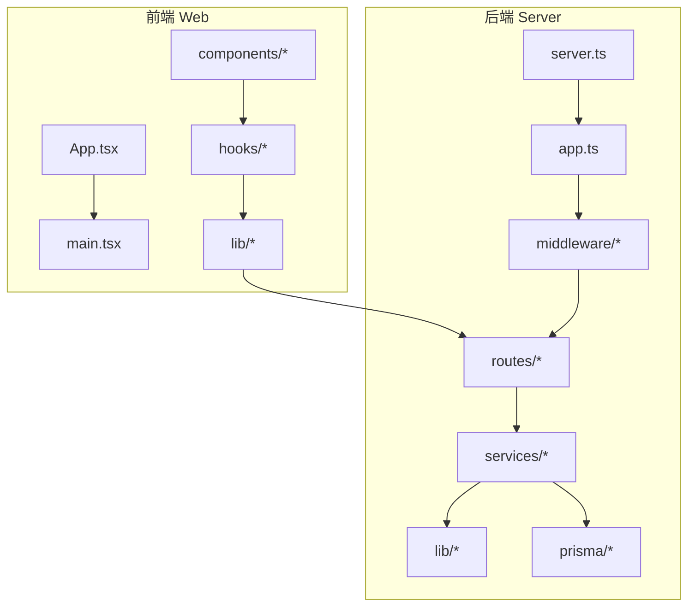
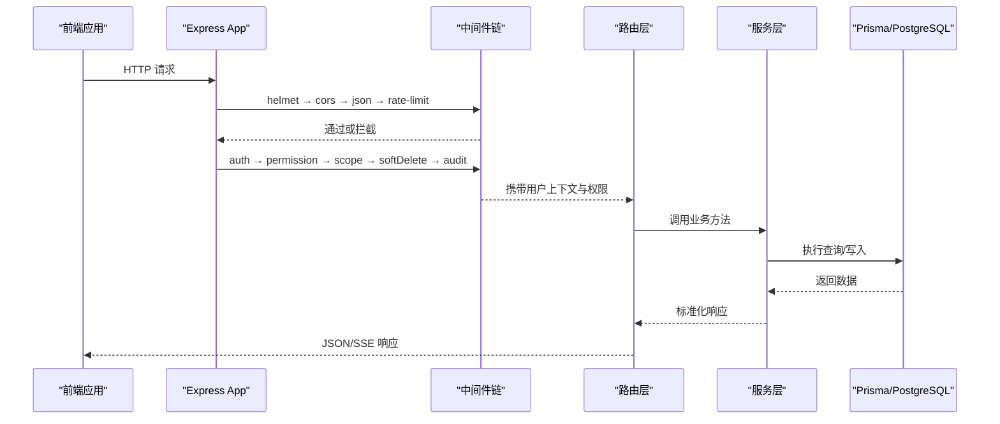
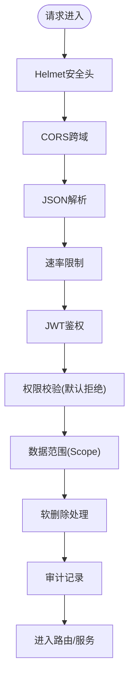
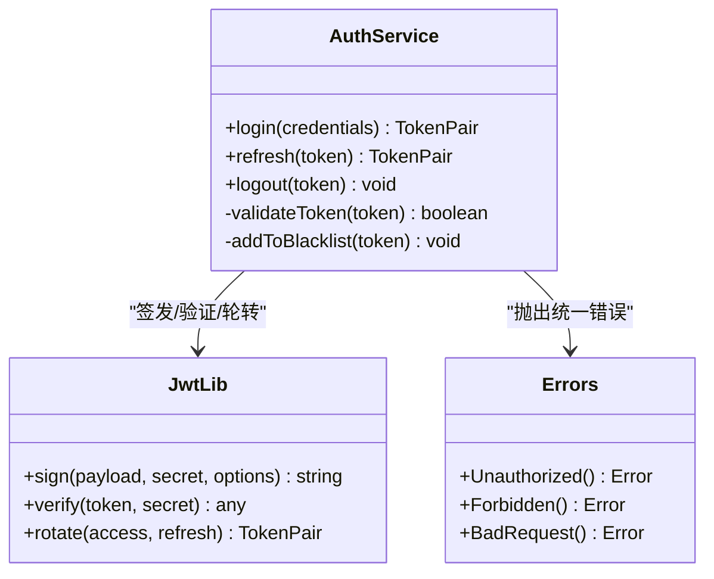
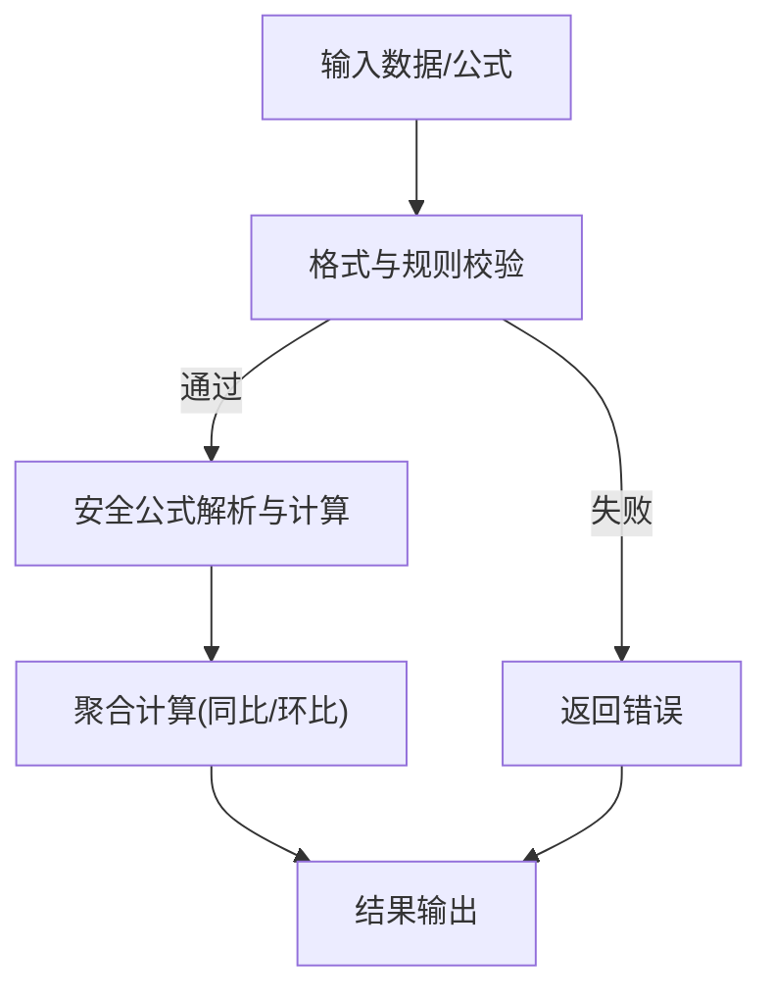
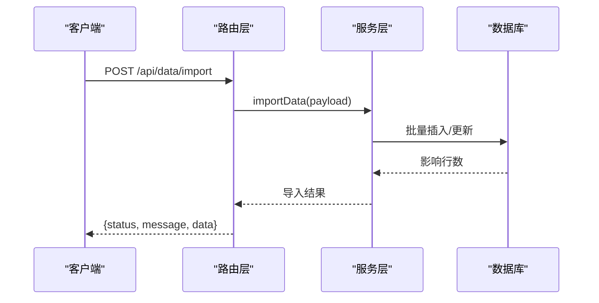
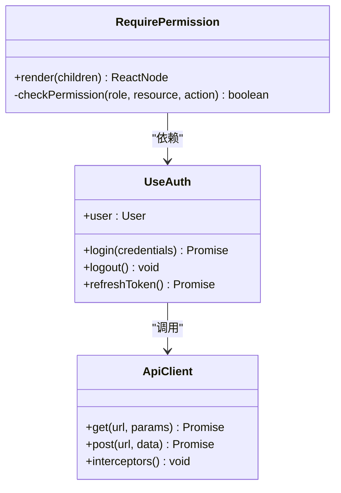
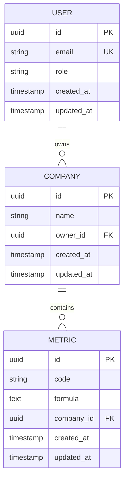
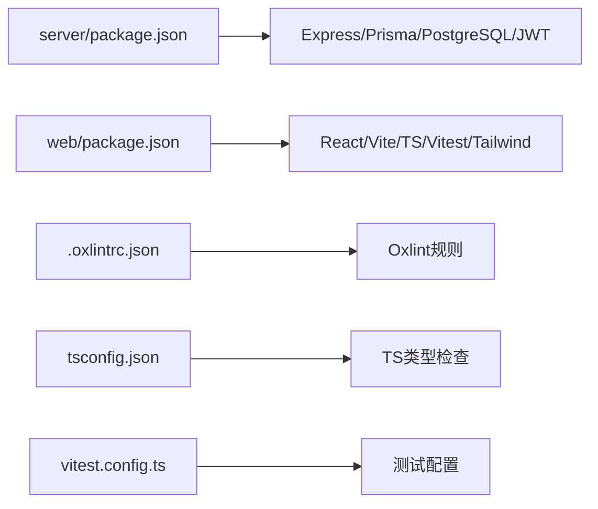

# 代码审查

<cite>
**本文引用的文件**   
- [server/src/app.ts](file://server/src/app.ts)
- [server/src/server.ts](file://server/src/server.ts)
- [server/src/middleware/helmet.ts](file://server/src/middleware/helmet.ts)
- [server/src/middleware/cors.ts](file://server/src/middleware/cors.ts)
- [server/src/middleware/rate-limit.ts](file://server/src/middleware/rate-limit.ts)
- [server/src/middleware/auth.ts](file://server/src/middleware/auth.ts)
- [server/src/middleware/permission.ts](file://server/src/middleware/permission.ts)
- [server/src/middleware/scope.ts](file://server/src/middleware/scope.ts)
- [server/src/middleware/soft-delete.ts](file://server/src/middleware/soft-delete.ts)
- [server/src/middleware/audit.ts](file://server/src/middleware/audit.ts)
- [server/src/lib/jwt.ts](file://server/src/lib/jwt.ts)
- [server/src/lib/errors.ts](file://server/src/lib/errors.ts)
- [server/src/lib/response.ts](file://server/src/lib/response.ts)
- [server/src/lib/formula.ts](file://server/src/lib/formula.ts)
- [server/src/lib/prisma.ts](file://server/src/lib/prisma.ts)
- [server/src/services/AuthService.ts](file://server/src/services/AuthService.ts)
- [server/src/services/DataService.ts](file://server/src/services/DataService.ts)
- [server/src/services/AggregationService.ts](file://server/src/services/AggregationService.ts)
- [server/src/routes/auth.ts](file://server/src/routes/auth.ts)
- [server/src/routes/data.ts](file://server/src/routes/data.ts)
- [server/src/routes/reports.ts](file://server/src/routes/reports.ts)
- [server/prisma/schema.prisma](file://server/prisma/schema.prisma)
- [web/src/App.tsx](file://web/src/App.tsx)
- [web/src/main.tsx](file://web/src/main.tsx)
- [web/src/hooks/useAuth.ts](file://web/src/hooks/useAuth.ts)
- [web/src/hooks/api-queries.ts](file://web/src/hooks/api-queries.ts)
- [web/src/lib/api.ts](file://web/src/lib/api.ts)
- [web/src/components/layout/require-permission.tsx](file://web/src/components/layout/require-permission.tsx)
- [web/vitest.config.ts](file://web/vitest.config.ts)
- [web/tsconfig.json](file://web/tsconfig.json)
- [web/.oxlintrc.json](file://web/.oxlintrc.json)
- [server/package.json](file://server/package.json)
- [web/package.json](file://web/package.json)
- [docs/plans/安全与权限规范.md](file://docs/plans/安全与权限规范.md)
</cite>

## 目录
1. [简介](#简介)
2. [项目结构](#项目结构)
3. [核心组件](#核心组件)
4. [架构总览](#架构总览)
5. [详细组件分析](#详细组件分析)
6. [依赖关系分析](#依赖关系分析)
7. [性能考量](#性能考量)
8. [故障排查指南](#故障排查指南)
9. [结论](#结论)
10. [附录](#附录)

## 简介
本指南面向FY200项目的代码审查，目标是建立统一、可执行的审查标准与流程，覆盖后端服务逻辑、前端组件实现、数据库查询优化、API接口设计，并明确自动化检查工具（ESLint/Oxlint、TypeScript类型检查、单元测试覆盖率）的使用要求。同时提供常见问题的识别与修复建议、审查反馈方式、争议解决机制、快速迭代策略以及合并准入条件。

## 项目结构
FY200采用前后端分离的Monorepo风格：
- server：Express + Prisma + PostgreSQL，JWT鉴权与权限控制，SSE流式AI管道，指标计算与报表生成。
- web：React + Vite + TypeScript，组件化UI、权限守卫、API封装与状态管理。
- docs：项目计划与安全规范等文档。
- prisma：数据模型与迁移脚本。

图表来源
- [server/src/server.ts:1-200](file://server/src/server.ts#L1-L200)
- [server/src/app.ts:1-200](file://server/src/app.ts#L1-L200)
- [web/src/App.tsx:1-200](file://web/src/App.tsx#L1-L200)
- [web/src/main.tsx:1-200](file://web/src/main.tsx#L1-L200)

章节来源
- [server/src/server.ts:1-200](file://server/src/server.ts#L1-L200)
- [server/src/app.ts:1-200](file://server/src/app.ts#L1-L200)
- [web/src/App.tsx:1-200](file://web/src/App.tsx#L1-L200)
- [web/src/main.tsx:1-200](file://web/src/main.tsx#L1-L200)

## 核心组件
- 中间件链：helmet → cors → express.json → rate-limit → auth(JWT+黑名单) → permission(默认拒绝) → scope(Prisma扩展) → softDelete → audit → Service → Prisma → PostgreSQL。
- 鉴权与授权：JWT access(短效)+refresh(长效轮转)，权限默认拒绝，基于scope的数据范围控制。
- 业务服务：认证、数据导入导出、指标聚合、公式规则校验、报表生成、AI代理。
- 前端能力：权限守卫、API封装、表格与图表组件、主题与布局。

章节来源
- [server/src/middleware/auth.ts:1-200](file://server/src/middleware/auth.ts#L1-L200)
- [server/src/middleware/permission.ts:1-200](file://server/src/middleware/permission.ts#L1-L200)
- [server/src/middleware/scope.ts:1-200](file://server/src/middleware/scope.ts#L1-L200)
- [server/src/services/AuthService.ts:1-200](file://server/src/services/AuthService.ts#L1-L200)
- [server/src/services/DataService.ts:1-200](file://server/src/services/DataService.ts#L1-L200)
- [server/src/services/AggregationService.ts:1-200](file://server/src/services/AggregationService.ts#L1-L200)
- [web/src/components/layout/require-permission.tsx:1-200](file://web/src/components/layout/require-permission.tsx#L1-L200)
- [web/src/hooks/useAuth.ts:1-200](file://web/src/hooks/useAuth.ts#L1-L200)
- [web/src/lib/api.ts:1-200](file://web/src/lib/api.ts#L1-L200)

## 架构总览
请求从前端发起，经HTTP进入后端，依次经过安全与限流、鉴权、权限、数据范围、软删除、审计等中间件，最终到达路由与服务层，通过Prisma访问PostgreSQL。AI相关请求走双管道：polish与analyze，包含脱敏与还原。

图表来源
- [server/src/app.ts:1-200](file://server/src/app.ts#L1-L200)
- [server/src/middleware/auth.ts:1-200](file://server/src/middleware/auth.ts#L1-L200)
- [server/src/middleware/permission.ts:1-200](file://server/src/middleware/permission.ts#L1-L200)
- [server/src/middleware/scope.ts:1-200](file://server/src/middleware/scope.ts#L1-L200)
- [server/src/middleware/soft-delete.ts:1-200](file://server/src/middleware/soft-delete.ts#L1-L200)
- [server/src/middleware/audit.ts:1-200](file://server/src/middleware/audit.ts#L1-L200)
- [server/src/lib/prisma.ts:1-200](file://server/src/lib/prisma.ts#L1-L200)

## 详细组件分析

### 后端中间件链与鉴权授权
- Helmet/CORS/RateLimit：安全头、跨域、速率限制配置需严格遵循最小开放原则。
- Auth：解析JWT，校验签名与过期，维护黑名单；支持access/refresh轮转。
- Permission：默认拒绝，白名单放行；结合角色/资源/动作进行细粒度控制。
- Scope：基于Prisma扩展注入数据范围过滤，避免越权读取。
- SoftDelete/Audit：逻辑删除与审计日志记录。

图表来源
- [server/src/middleware/helmet.ts:1-200](file://server/src/middleware/helmet.ts#L1-L200)
- [server/src/middleware/cors.ts:1-200](file://server/src/middleware/cors.ts#L1-L200)
- [server/src/middleware/rate-limit.ts:1-200](file://server/src/middleware/rate-limit.ts#L1-L200)
- [server/src/middleware/auth.ts:1-200](file://server/src/middleware/auth.ts#L1-L200)
- [server/src/middleware/permission.ts:1-200](file://server/src/middleware/permission.ts#L1-L200)
- [server/src/middleware/scope.ts:1-200](file://server/src/middleware/scope.ts#L1-L200)
- [server/src/middleware/soft-delete.ts:1-200](file://server/src/middleware/soft-delete.ts#L1-L200)
- [server/src/middleware/audit.ts:1-200](file://server/src/middleware/audit.ts#L1-L200)

章节来源
- [server/src/middleware/auth.ts:1-200](file://server/src/middleware/auth.ts#L1-L200)
- [server/src/middleware/permission.ts:1-200](file://server/src/middleware/permission.ts#L1-L200)
- [server/src/middleware/scope.ts:1-200](file://server/src/middleware/scope.ts#L1-L200)
- [server/src/middleware/soft-delete.ts:1-200](file://server/src/middleware/soft-delete.ts#L1-L200)
- [server/src/middleware/audit.ts:1-200](file://server/src/middleware/audit.ts#L1-L200)

### 认证与令牌管理
- JWT策略：access短效、refresh长效轮转，黑名单防重放。
- 密码与敏感信息：使用安全哈希与脱敏输出。
- 错误处理：统一错误码与消息，避免泄露内部细节。

图表来源
- [server/src/services/AuthService.ts:1-200](file://server/src/services/AuthService.ts#L1-L200)
- [server/src/lib/jwt.ts:1-200](file://server/src/lib/jwt.ts#L1-L200)
- [server/src/lib/errors.ts:1-200](file://server/src/lib/errors.ts#L1-L200)

章节来源
- [server/src/services/AuthService.ts:1-200](file://server/src/services/AuthService.ts#L1-L200)
- [server/src/lib/jwt.ts:1-200](file://server/src/lib/jwt.ts#L1-L200)
- [server/src/lib/errors.ts:1-200](file://server/src/lib/errors.ts#L1-L200)

### 数据服务与指标聚合
- DataService：数据导入、校验、批量写入、模板映射。
- AggregationService：同比/环比实时计算，安全公式解析（白名单算子），禁止eval。
- 公式规则：FormulaRuleService负责规则定义与校验。

图表来源
- [server/src/services/DataService.ts:1-200](file://server/src/services/DataService.ts#L1-L200)
- [server/src/services/AggregationService.ts:1-200](file://server/src/services/AggregationService.ts#L1-L200)
- [server/src/lib/formula.ts:1-200](file://server/src/lib/formula.ts#L1-L200)

章节来源
- [server/src/services/DataService.ts:1-200](file://server/src/services/DataService.ts#L1-L200)
- [server/src/services/AggregationService.ts:1-200](file://server/src/services/AggregationService.ts#L1-L200)
- [server/src/lib/formula.ts:1-200](file://server/src/lib/formula.ts#L1-L200)

### API接口设计与路由
- 路由职责清晰：auth、data、reports等模块划分明确。
- 请求/响应规范化：统一响应结构与错误码。
- SSE流式：AI分析结果逐步推送。

图表来源
- [server/src/routes/data.ts:1-200](file://server/src/routes/data.ts#L1-L200)
- [server/src/services/DataService.ts:1-200](file://server/src/services/DataService.ts#L1-L200)
- [server/src/lib/response.ts:1-200](file://server/src/lib/response.ts#L1-L200)

章节来源
- [server/src/routes/data.ts:1-200](file://server/src/routes/data.ts#L1-L200)
- [server/src/routes/auth.ts:1-200](file://server/src/routes/auth.ts#L1-L200)
- [server/src/routes/reports.ts:1-200](file://server/src/routes/reports.ts#L1-L200)
- [server/src/lib/response.ts:1-200](file://server/src/lib/response.ts#L1-L200)

### 前端组件与权限控制
- 权限守卫：require-permission组件在渲染前校验权限。
- 认证状态：useAuth钩子管理登录态与令牌刷新。
- API封装：统一的请求拦截、错误处理与重试策略。

图表来源
- [web/src/components/layout/require-permission.tsx:1-200](file://web/src/components/layout/require-permission.tsx#L1-L200)
- [web/src/hooks/useAuth.ts:1-200](file://web/src/hooks/useAuth.ts#L1-L200)
- [web/src/lib/api.ts:1-200](file://web/src/lib/api.ts#L1-L200)

章节来源
- [web/src/components/layout/require-permission.tsx:1-200](file://web/src/components/layout/require-permission.tsx#L1-L200)
- [web/src/hooks/useAuth.ts:1-200](file://web/src/hooks/useAuth.ts#L1-L200)
- [web/src/lib/api.ts:1-200](file://web/src/lib/api.ts#L1-L200)

### 数据库模型与迁移
- Prisma Schema：实体关系、索引、约束定义。
- 迁移脚本：版本化管理，确保一致性。
- 审计字段：created_at/updated_at等时间戳。

图表来源
- [server/prisma/schema.prisma:1-200](file://server/prisma/schema.prisma#L1-L200)

章节来源
- [server/prisma/schema.prisma:1-200](file://server/prisma/schema.prisma#L1-L200)

## 依赖关系分析
- 后端依赖：Express、Prisma、PostgreSQL、JWT库、DeepSeek SDK。
- 前端依赖：React、Vite、TypeScript、测试框架(Vitest)、样式(Tailwind)。
- 工具链：Oxlint/ESLint、TypeScript编译器、Vitest。

图表来源
- [server/package.json:1-200](file://server/package.json#L1-L200)
- [web/package.json:1-200](file://web/package.json#L1-L200)
- [web/.oxlintrc.json:1-200](file://web/.oxlintrc.json#L1-L200)
- [web/tsconfig.json:1-200](file://web/tsconfig.json#L1-L200)
- [web/vitest.config.ts:1-200](file://web/vitest.config.ts#L1-L200)

章节来源
- [server/package.json:1-200](file://server/package.json#L1-L200)
- [web/package.json:1-200](file://web/package.json#L1-L200)
- [web/.oxlintrc.json:1-200](file://web/.oxlintrc.json#L1-L200)
- [web/tsconfig.json:1-200](file://web/tsconfig.json#L1-L200)
- [web/vitest.config.ts:1-200](file://web/vitest.config.ts#L1-L200)

## 性能考量
- 中间件顺序：尽量前置耗时少的校验，减少无效处理。
- 数据库查询：合理使用索引、分页、批量操作，避免N+1问题。
- 公式计算：白名单解析替代eval，缓存热点公式结果。
- AI流式：SSE分片推送，降低首屏延迟。

[本节为通用指导，不直接分析具体文件]

## 故障排查指南
- 统一错误处理：errors.ts定义错误类型与消息，避免泄露敏感信息。
- 日志与追踪：audit中间件记录关键操作，trace-id贯穿请求链路。
- 常见问题：
  - 鉴权失败：检查JWT签名、黑名单、过期时间。
  - 权限不足：确认permission白名单与scope范围。
  - 数据不一致：核对Prisma迁移与schema变更。
  - 性能瓶颈：定位慢查询与CPU密集型计算。

章节来源
- [server/src/lib/errors.ts:1-200](file://server/src/lib/errors.ts#L1-L200)
- [server/src/middleware/audit.ts:1-200](file://server/src/middleware/audit.ts#L1-L200)
- [server/src/middleware/auth.ts:1-200](file://server/src/middleware/auth.ts#L1-L200)
- [server/src/middleware/permission.ts:1-200](file://server/src/middleware/permission.ts#L1-L200)
- [server/src/lib/prisma.ts:1-200](file://server/src/lib/prisma.ts#L1-L200)

## 结论
本指南建立了FY200项目的代码审查标准与流程，涵盖安全、质量、性能、可维护性等多维度。通过明确的清单、自动化工具与最佳实践，确保代码质量与交付效率。建议在CI中集成检查项，形成闭环。

[本节为总结，不直接分析具体文件]

## 附录

### 代码审查清单
- 功能正确性：需求对齐、边界条件、异常路径。
- 安全性：输入校验、SQL注入、XSS、CSRF、敏感信息脱敏。
- 性能：查询优化、内存占用、并发处理。
- 可维护性：命名规范、模块化、注释与文档。
- 测试：单元测试覆盖率、集成测试、端到端测试。
- 合规：遵循公司安全与权限规范。

[本节为通用清单，不直接分析具体文件]

### 自动化检查工具
- Oxlint/ESLint：代码风格与潜在错误检查。
- TypeScript：类型检查与严格模式。
- Vitest：单元测试与覆盖率报告。
- Prisma：数据库迁移与类型生成。

章节来源
- [web/.oxlintrc.json:1-200](file://web/.oxlintrc.json#L1-L200)
- [web/tsconfig.json:1-200](file://web/tsconfig.json#L1-L200)
- [web/vitest.config.ts:1-200](file://web/vitest.config.ts#L1-L200)
- [server/prisma/schema.prisma:1-200](file://server/prisma/schema.prisma#L1-L200)

### 审查反馈与争议解决
- 反馈方式：PR评论、标签分类（建议/必须）、优先级标注。
- 争议解决：技术负责人仲裁，记录决策原因。
- 快速迭代：小步提交、频繁评审、自动化门禁。

[本节为通用流程，不直接分析具体文件]

### 常见代码问题与修复
- 性能陷阱：避免循环内数据库查询、使用批量操作。
- 安全风险：参数化查询、输入净化、最小权限原则。
- 可维护性：拆分大函数、增加单元测试、完善注释。

[本节为通用指导，不直接分析具体文件]

### 审查通过标准与合并条件
- 所有CI检查通过（类型、Lint、测试）。
- 至少一名资深开发者批准。
- 无高危安全问题。
- 文档更新（如适用）。
- 符合安全与权限规范。

章节来源
- [docs/plans/安全与权限规范.md:1-200](file://docs/plans/安全与权限规范.md#L1-L200)