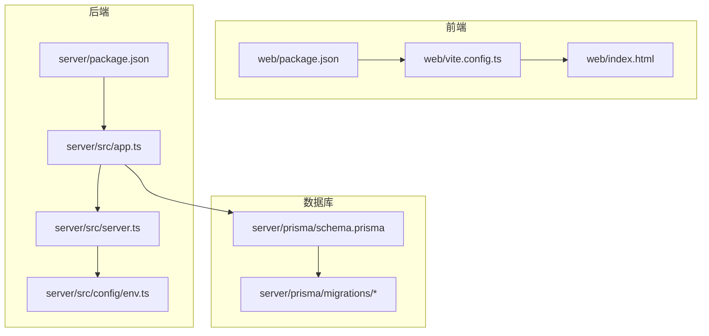
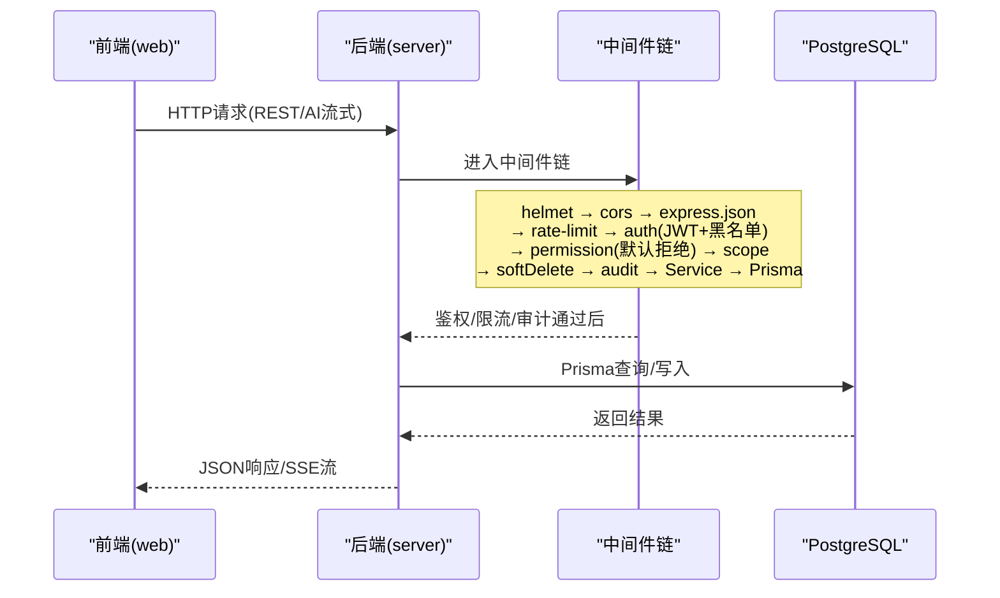
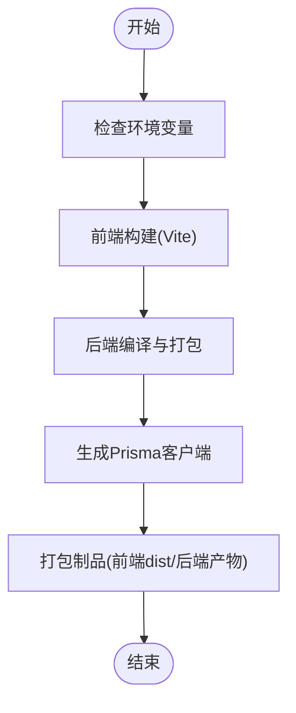
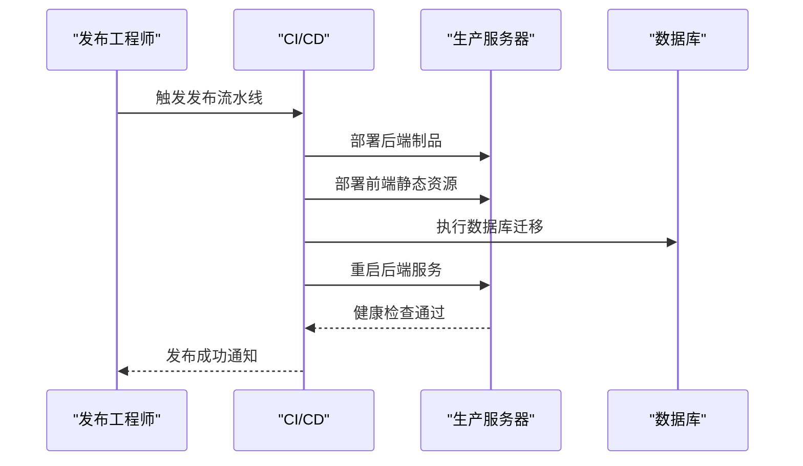
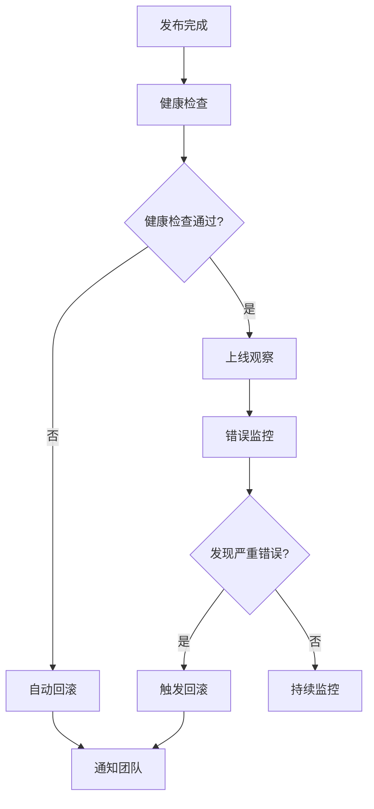

# 发布流程

<cite>
**本文引用的文件**   
- [server/package.json](file://server/package.json)
- [server/src/app.ts](file://server/src/app.ts)
- [server/src/server.ts](file://server/src/server.ts)
- [server/src/config/env.ts](file://server/src/config/env.ts)
- [server/prisma/schema.prisma](file://server/prisma/schema.prisma)
- [server/prisma/migrations/20260722121714_init/migration.sql](file://server/prisma/migrations/20260722121714_init/migration.sql)
- [server/prisma/migrations/20260722142144_add_formula_rule/migration.sql](file://server/prisma/migrations/20260722142144_add_formula_rule/migration.sql)
- [server/prisma/migrations/20260723120000_add_subject_analysis/migration.sql](file://server/prisma/migrations/20260723120000_add_subject_analysis/migration.sql)
- [server/prisma/migrations/20260724120000_remove_business_unit_org_scope/migration.sql](file://server/prisma/migrations/20260724120000_remove_business_unit_org_scope/migration.sql)
- [web/package.json](file://web/package.json)
- [web/vite.config.ts](file://web/vite.config.ts)
- [web/index.html](file://web/index.html)
- [server/.gitignore](file://server/.gitignore)
- [web/.gitignore](file://web/.gitignore)
- [.gitignore](file://.gitignore)
</cite>

## 目录
1. [简介](#简介)
2. [项目结构](#项目结构)
3. [核心组件](#核心组件)
4. [架构总览](#架构总览)
5. [详细组件分析](#详细组件分析)
6. [依赖分析](#依赖分析)
7. [性能考虑](#性能考虑)
8. [故障排查指南](#故障排查指南)
9. [结论](#结论)
10. [附录](#附录)

## 简介
本指南面向FY200项目的发布工作，覆盖版本管理策略、发布前准备、构建与打包、部署步骤、发布后监控与回滚、以及发布记录与变更日志维护。目标是让具备不同技术背景的读者都能按步骤完成一次安全、可追溯、可回滚的发布。

## 项目结构
FY200为前后端分离项目：
- 后端（server）：Express + Prisma + PostgreSQL，提供REST API与AI代理能力。
- 前端（web）：基于Vite的前端工程，生产构建产物由后端或CDN托管。
- 数据库迁移：Prisma Migrations集中管理，按时间戳命名。
- 配置与环境：后端通过环境变量注入，敏感信息不入库。

**图表来源** 
- [web/package.json](file://web/package.json)
- [web/vite.config.ts](file://web/vite.config.ts)
- [web/index.html](file://web/index.html)
- [server/package.json](file://server/package.json)
- [server/src/app.ts](file://server/src/app.ts)
- [server/src/server.ts](file://server/src/server.ts)
- [server/src/config/env.ts](file://server/src/config/env.ts)
- [server/prisma/schema.prisma](file://server/prisma/schema.prisma)
- [server/prisma/migrations/20260722121714_init/migration.sql](file://server/prisma/migrations/20260722121714_init/migration.sql)
- [server/prisma/migrations/20260722142144_add_formula_rule/migration.sql](file://server/prisma/migrations/20260722142144_add_formula_rule/migration.sql)
- [server/prisma/migrations/20260723120000_add_subject_analysis/migration.sql](file://server/prisma/migrations/20260723120000_add_subject_analysis/migration.sql)
- [server/prisma/migrations/20260724120000_remove_business_unit_org_scope/migration.sql](file://server/prisma/migrations/20260724120000_remove_business_unit_org_scope/migration.sql)

**章节来源**
- [server/package.json](file://server/package.json)
- [web/package.json](file://web/package.json)
- [server/src/app.ts](file://server/src/app.ts)
- [server/src/server.ts](file://server/src/server.ts)
- [server/src/config/env.ts](file://server/src/config/env.ts)
- [server/prisma/schema.prisma](file://server/prisma/schema.prisma)

## 核心组件
- 版本管理与脚本入口
  - 后端脚本与依赖定义位于 server/package.json，包含构建、测试、迁移等命令。
  - 前端脚本与依赖定义位于 web/package.json，包含开发、构建、预览等命令。
- 应用启动与中间件链
  - server/src/app.ts 负责路由与中间件装配。
  - server/src/server.ts 负责HTTP服务启动与监听端口。
- 环境配置
  - server/src/config/env.ts 统一读取并校验环境变量，确保运行时安全。
- 数据模型与迁移
  - server/prisma/schema.prisma 定义数据模型。
  - server/prisma/migrations/* 存放增量迁移SQL，按时间戳命名，保证幂等与顺序执行。

**章节来源**
- [server/package.json](file://server/package.json)
- [web/package.json](file://web/package.json)
- [server/src/app.ts](file://server/src/app.ts)
- [server/src/server.ts](file://server/src/server.ts)
- [server/src/config/env.ts](file://server/src/config/env.ts)
- [server/prisma/schema.prisma](file://server/prisma/schema.prisma)

## 架构总览
下图展示从前端到后端再到数据库的调用链路，以及中间件执行顺序。

**图表来源** 
- [server/src/app.ts](file://server/src/app.ts)
- [server/src/server.ts](file://server/src/server.ts)
- [server/src/config/env.ts](file://server/src/config/env.ts)

**章节来源**
- [server/src/app.ts](file://server/src/app.ts)
- [server/src/server.ts](file://server/src/server.ts)

## 详细组件分析

### 版本管理策略
- 语义化版本控制（SemVer）
  - 版本号格式：主版本.次版本.修订号（如 1.2.3）。
  - 主版本：破坏性变更（API不兼容、数据结构变更）。
  - 次版本：向后兼容的功能新增。
  - 修订号：向后兼容的问题修复。
- 分支模型
  - main：稳定主干，仅接受经过完整验证的发布提交。
  - release/x.y.z：发布分支，冻结代码、打标签、生成制品。
  - develop：集成分支，日常功能合并与迭代。
  - feature/*、hotfix/*：特性与紧急修复分支。
- 标签与制品
  - 使用Git标签标记发布版本（如 v1.2.3），同时生成前后端制品包。
  - 制品包包含前端构建产物与后端编译产物，便于快速回滚。

[本节为通用规范说明，不直接分析具体文件]

### 发布前准备清单
- 代码冻结
  - 在release分支上冻结代码，禁止非必要的提交。
- 测试验证
  - 运行单元测试与集成测试，确保关键路径通过。
- 文档更新
  - 更新API参考、数据库Schema、运维手册等必要文档。
- 依赖检查
  - 检查前后端依赖是否存在高危漏洞，必要时升级或替换。
- 配置核对
  - 确认生产环境变量已正确设置，敏感信息未硬编码。

[本节为通用规范说明，不直接分析具体文件]

### 构建与打包流程
- 前端构建优化
  - 使用Vite进行生产构建，启用压缩、Tree Shaking、资源哈希等优化。
  - 输出静态资源至dist目录，供CDN或后端静态服务托管。
- 后端依赖打包
  - 安装生产依赖，编译TypeScript，生成可执行产物。
  - 确保Prisma客户端生成与schema同步。
- 配置文件生成
  - 通过环境变量注入配置，避免将敏感配置打入制品。
  - 校验必需的环境变量存在且格式正确。

**图表来源** 
- [web/package.json](file://web/package.json)
- [web/vite.config.ts](file://web/vite.config.ts)
- [server/package.json](file://server/package.json)
- [server/src/config/env.ts](file://server/src/config/env.ts)

**章节来源**
- [web/package.json](file://web/package.json)
- [web/vite.config.ts](file://web/vite.config.ts)
- [server/package.json](file://server/package.json)
- [server/src/config/env.ts](file://server/src/config/env.ts)

### 发布部署步骤
- 生产环境配置
  - 设置数据库连接、JWT密钥、第三方API密钥等环境变量。
  - 确保端口、域名、CORS、速率限制等参数符合生产要求。
- 数据库迁移执行
  - 执行Prisma迁移，确保数据库结构与schema一致。
  - 迁移失败需立即回滚并通知相关责任人。
- 服务重启与验证
  - 重启后端服务，等待健康检查通过。
  - 访问关键页面与接口，验证核心功能正常。

**图表来源** 
- [server/src/server.ts](file://server/src/server.ts)
- [server/src/config/env.ts](file://server/src/config/env.ts)
- [server/prisma/schema.prisma](file://server/prisma/schema.prisma)
- [server/prisma/migrations/20260722121714_init/migration.sql](file://server/prisma/migrations/20260722121714_init/migration.sql)
- [server/prisma/migrations/20260722142144_add_formula_rule/migration.sql](file://server/prisma/migrations/20260722142144_add_formula_rule/migration.sql)
- [server/prisma/migrations/20260723120000_add_subject_analysis/migration.sql](file://server/prisma/migrations/20260723120000_add_subject_analysis/migration.sql)
- [server/prisma/migrations/20260724120000_remove_business_unit_org_scope/migration.sql](file://server/prisma/migrations/20260724120000_remove_business_unit_org_scope/migration.sql)

**章节来源**
- [server/src/server.ts](file://server/src/server.ts)
- [server/src/config/env.ts](file://server/src/config/env.ts)
- [server/prisma/schema.prisma](file://server/prisma/schema.prisma)
- [server/prisma/migrations/20260722121714_init/migration.sql](file://server/prisma/migrations/20260722121714_init/migration.sql)
- [server/prisma/migrations/20260722142144_add_formula_rule/migration.sql](file://server/prisma/migrations/20260722142144_add_formula_rule/migration.sql)
- [server/prisma/migrations/20260723120000_add_subject_analysis/migration.sql](file://server/prisma/migrations/20260723120000_add_subject_analysis/migration.sql)
- [server/prisma/migrations/20260724120000_remove_business_unit_org_scope/migration.sql](file://server/prisma/migrations/20260724120000_remove_business_unit_org_scope/migration.sql)

### 发布后监控与回滚机制
- 健康检查
  - 提供健康检查接口，用于负载均衡与健康探针。
  - 监控服务状态、错误率、延迟等关键指标。
- 错误监控
  - 收集异常日志与堆栈，设置告警阈值。
  - 对AI流式接口进行SSE错误处理与重试策略。
- 快速回滚
  - 保留上一版本的制品与数据库快照。
  - 一键切换至旧版本，优先恢复业务可用性。

**图表来源** 
- [server/src/server.ts](file://server/src/server.ts)
- [server/src/config/env.ts](file://server/src/config/env.ts)

**章节来源**
- [server/src/server.ts](file://server/src/server.ts)
- [server/src/config/env.ts](file://server/src/config/env.ts)

### 发布记录与变更日志维护规范
- 发布记录
  - 每次发布需记录版本号、发布日期、负责人、变更范围、已知问题。
  - 发布记录应归档至仓库或知识库，便于追溯。
- 变更日志
  - 遵循“Keep a Changelog”规范，区分新增、修复、破坏性变更。
  - 变更日志应与Git标签对应，确保一致性。

[本节为通用规范说明，不直接分析具体文件]

## 依赖分析
前后端依赖关系如下：
- 前端依赖Vite、React生态、Tailwind等，构建产物为静态资源。
- 后端依赖Express、Prisma、PostgreSQL驱动、JWT库等。
- 数据库依赖Prisma Schema与迁移脚本，确保结构一致性。

```mermaid
graph LR
FE["前端依赖(web/package.json)"] --> VITE["Vite构建"]
BE["后端依赖(server/package.json)"] --> EXPRESS["Express框架"]
BE --> PRISMA["Prisma ORM"]
PRISMA --> PG["PostgreSQL"]
VITE --> DIST["静态资源(dist)"]
```

**图表来源** 
- [web/package.json](file://web/package.json)
- [server/package.json](file://server/package.json)
- [server/prisma/schema.prisma](file://server/prisma/schema.prisma)

**章节来源**
- [web/package.json](file://web/package.json)
- [server/package.json](file://server/package.json)
- [server/prisma/schema.prisma](file://server/prisma/schema.prisma)

## 性能考虑
- 前端优化
  - 启用代码分割、懒加载、图片压缩、缓存策略。
  - 减少首屏体积，提升加载速度。
- 后端优化
  - 合理设置连接池大小，避免数据库瓶颈。
  - 对热点接口添加缓存层，降低重复计算。
- 监控与调优
  - 采集QPS、延迟、错误率等指标，定位性能瓶颈。
  - 定期审查慢查询与内存占用。

[本节为通用指导，不直接分析具体文件]

## 故障排查指南
- 常见问题
  - 环境变量缺失或格式错误导致启动失败。
  - 数据库迁移失败导致服务不可用。
  - 前端构建失败因依赖冲突或配置错误。
- 排查步骤
  - 检查服务日志与错误堆栈。
  - 验证数据库连接与权限。
  - 复现本地环境，逐步缩小问题范围。
- 回滚策略
  - 优先恢复服务可用性，再定位根因。
  - 使用预置的回滚脚本或制品快速降级。

**章节来源**
- [server/src/config/env.ts](file://server/src/config/env.ts)
- [server/prisma/schema.prisma](file://server/prisma/schema.prisma)

## 结论
本指南提供了FY200项目从版本管理到发布部署的全流程规范。通过严格的版本控制、完善的构建与部署流程、健壮的监控与回滚机制，确保发布过程安全可控、可追溯、可恢复。建议团队严格执行本规范，并结合实际环境持续优化。

## 附录
- 敏感文件忽略配置
  - .gitignore、server/.gitignore、web/.gitignore 确保敏感信息不入库。
- 前端入口与样式
  - web/index.html 作为前端入口，样式由Tailwind与全局CSS管理。

**章节来源**
- [.gitignore](file://.gitignore)
- [server/.gitignore](file://server/.gitignore)
- [web/.gitignore](file://web/.gitignore)
- [web/index.html](file://web/index.html)