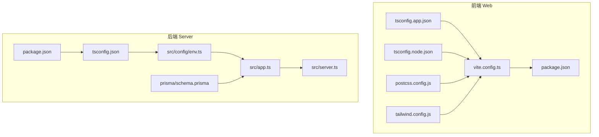
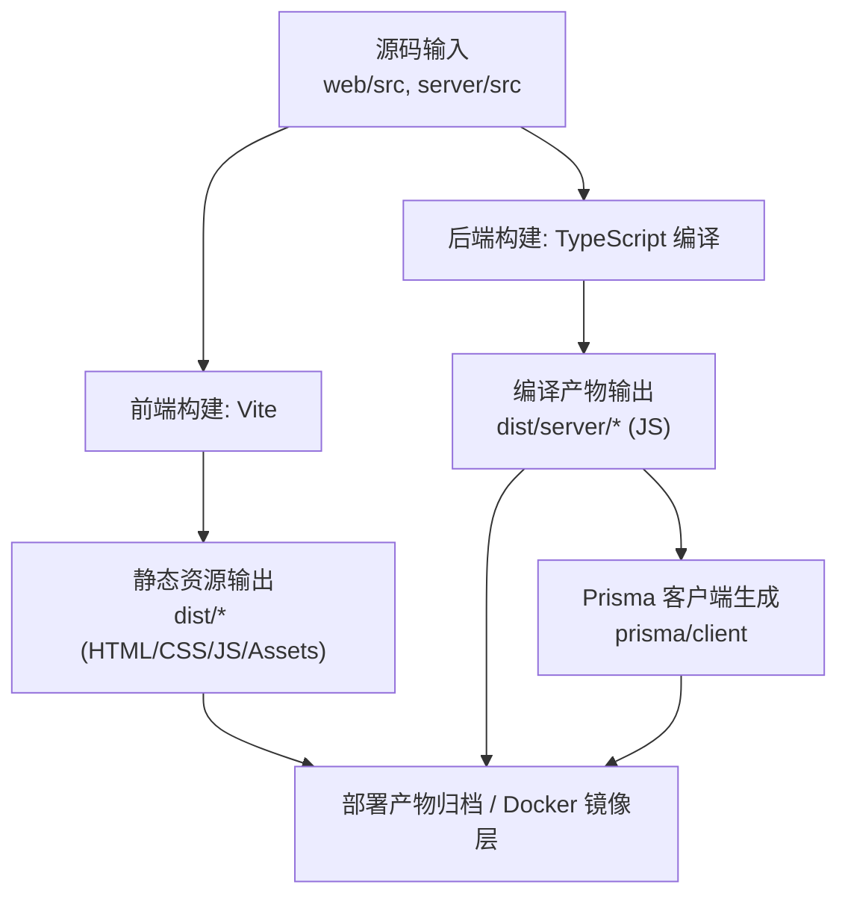
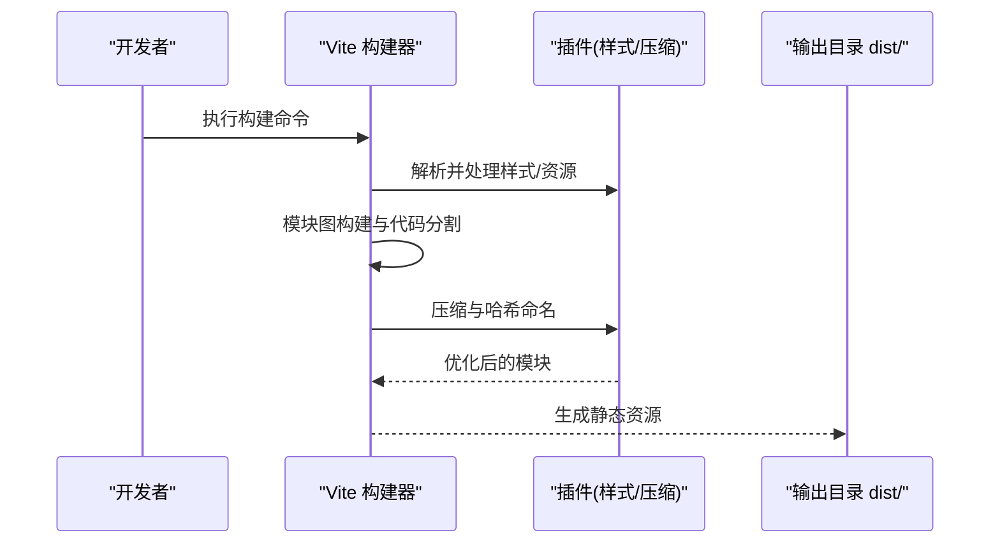
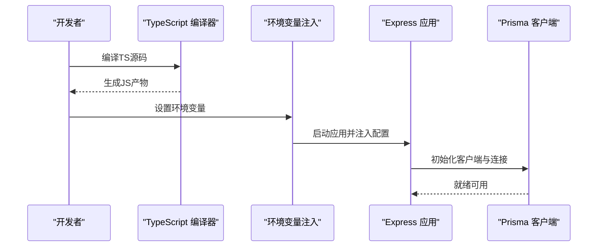
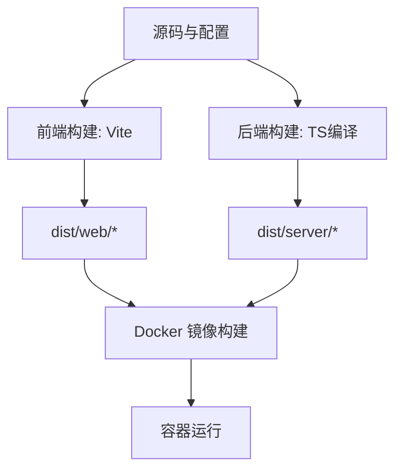
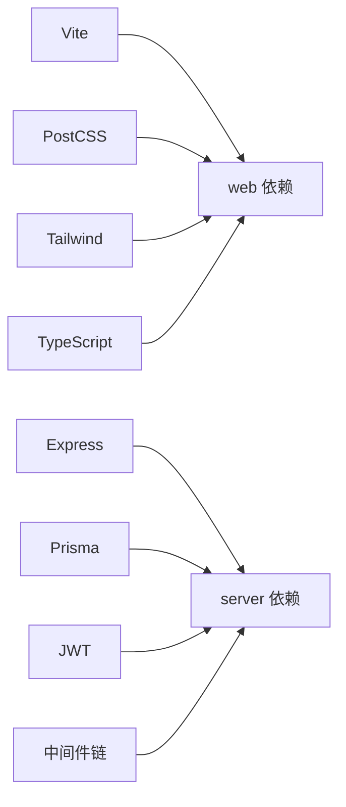

# 构建与打包

<cite>
**本文引用的文件**   
- [web/vite.config.ts](file://web/vite.config.ts)
- [web/package.json](file://web/package.json)
- [web/tsconfig.app.json](file://web/tsconfig.app.json)
- [web/tsconfig.node.json](file://web/tsconfig.node.json)
- [web/postcss.config.js](file://web/postcss.config.js)
- [web/tailwind.config.js](file://web/tailwind.config.js)
- [server/package.json](file://server/package.json)
- [server/tsconfig.json](file://server/tsconfig.json)
- [server/src/config/env.ts](file://server/src/config/env.ts)
- [server/src/app.ts](file://server/src/app.ts)
- [server/src/server.ts](file://server/src/server.ts)
- [server/prisma/schema.prisma](file://server/prisma/schema.prisma)
</cite>

## 目录
1. [简介](#简介)
2. [项目结构](#项目结构)
3. [核心组件](#核心组件)
4. [架构总览](#架构总览)
5. [详细组件分析](#详细组件分析)
6. [依赖关系分析](#依赖关系分析)
7. [性能考量](#性能考量)
8. [故障排查指南](#故障排查指南)
9. [结论](#结论)
10. [附录](#附录)

## 简介
本文件面向FY200项目的构建与打包流程，覆盖前端（Vite）与后端（TypeScript + Express + Prisma）的完整构建链路，包括资源优化、代码分割、静态资源压缩、多环境配置、环境变量注入、Docker镜像构建与缓存策略等。目标是帮助开发者在不同环境下快速、稳定地生成高质量产物，并提供常见问题的定位与解决思路。

## 项目结构
FY200采用前后端分离的双包结构：
- web：基于Vite的前端工程，负责页面渲染、图表、数据表格、权限控制等。
- server：基于Express的后端服务，提供API、鉴权、权限、审计、AI代理、指标计算等能力，并使用Prisma管理数据库。

**图示来源** 
- [web/vite.config.ts](file://web/vite.config.ts)
- [web/package.json](file://web/package.json)
- [web/tsconfig.app.json](file://web/tsconfig.app.json)
- [web/tsconfig.node.json](file://web/tsconfig.node.json)
- [web/postcss.config.js](file://web/postcss.config.js)
- [web/tailwind.config.js](file://web/tailwind.config.js)
- [server/package.json](file://server/package.json)
- [server/tsconfig.json](file://server/tsconfig.json)
- [server/src/config/env.ts](file://server/src/config/env.ts)
- [server/src/app.ts](file://server/src/app.ts)
- [server/src/server.ts](file://server/src/server.ts)
- [server/prisma/schema.prisma](file://server/prisma/schema.prisma)

**章节来源**
- [web/vite.config.ts](file://web/vite.config.ts)
- [web/package.json](file://web/package.json)
- [server/package.json](file://server/package.json)
- [server/tsconfig.json](file://server/tsconfig.json)

## 核心组件
- 前端构建器：Vite（开发服务器、按需编译、插件生态、生产构建）。
- 类型与样式：TypeScript（tsconfig）、PostCSS、Tailwind CSS。
- 后端运行时：Node.js + Express，Prisma ORM，JWT鉴权，中间件链。
- 环境变量：通过配置文件与环境变量注入到应用启动过程。
- 数据库迁移：Prisma Migrations在构建/部署阶段执行。

**章节来源**
- [web/vite.config.ts](file://web/vite.config.ts)
- [web/tsconfig.app.json](file://web/tsconfig.app.json)
- [web/postcss.config.js](file://web/postcss.config.js)
- [web/tailwind.config.js](file://web/tailwind.config.js)
- [server/package.json](file://server/package.json)
- [server/tsconfig.json](file://server/tsconfig.json)
- [server/src/config/env.ts](file://server/src/config/env.ts)
- [server/prisma/schema.prisma](file://server/prisma/schema.prisma)

## 架构总览
下图展示从源码到可运行产物的端到端构建流程，涵盖前端静态资源输出与后端编译产物组织。

**图示来源** 
- [web/vite.config.ts](file://web/vite.config.ts)
- [server/package.json](file://server/package.json)
- [server/tsconfig.json](file://server/tsconfig.json)
- [server/prisma/schema.prisma](file://server/prisma/schema.prisma)

## 详细组件分析

### 前端构建（Vite）
- 构建目标与入口：以index.html为入口，按路由与组件进行懒加载与代码分割。
- 插件与优化：
  - 使用Vite内置优化（ESM、Tree-shaking、预构建依赖）。
  - PostCSS与Tailwind用于样式处理与原子化CSS生成。
  - 可通过插件实现图片/字体等资源压缩与哈希命名。
- 代码分割：
  - 按页面/功能模块拆分chunk，减少首屏体积。
  - 第三方库按需引入，避免全量打包。
- 资源优化：
  - 静态资源启用压缩与缓存策略（文件名含内容哈希）。
  - 图片/字体等二进制资源进行压缩与格式优化。
- 多环境配置：
  - 通过环境变量区分开发、测试、生产环境。
  - 构建时注入前端所需的环境常量（如API基础路径、功能开关）。

**图示来源** 
- [web/vite.config.ts](file://web/vite.config.ts)
- [web/postcss.config.js](file://web/postcss.config.js)
- [web/tailwind.config.js](file://web/tailwind.config.js)

**章节来源**
- [web/vite.config.ts](file://web/vite.config.ts)
- [web/package.json](file://web/package.json)
- [web/tsconfig.app.json](file://web/tsconfig.app.json)
- [web/postcss.config.js](file://web/postcss.config.js)
- [web/tailwind.config.js](file://web/tailwind.config.js)

### 后端构建（TypeScript + Express + Prisma）
- 编译与产物：
  - 使用TypeScript编译器将TS源码编译为JS，输出至dist目录。
  - 保持模块结构与类型声明，便于调试与IDE支持。
- 依赖打包：
  - 通过包管理器安装依赖，确保生产环境仅包含运行时依赖。
  - 可选使用打包工具对依赖进行合并与优化（视需求而定）。
- 配置文件生成：
  - 构建过程中生成或拷贝必要的配置文件（如日志、限流、CORS等）。
- 环境变量注入：
  - 启动前读取环境变量，校验必填项，注入到应用上下文。
  - 敏感信息（密钥、数据库连接串）通过环境变量传入，不硬编码。
- Prisma集成：
  - 构建后生成Prisma客户端，供ORM调用。
  - 部署前执行数据库迁移，确保Schema一致。

**图示来源** 
- [server/package.json](file://server/package.json)
- [server/tsconfig.json](file://server/tsconfig.json)
- [server/src/config/env.ts](file://server/src/config/env.ts)
- [server/src/app.ts](file://server/src/app.ts)
- [server/src/server.ts](file://server/src/server.ts)
- [server/prisma/schema.prisma](file://server/prisma/schema.prisma)

**章节来源**
- [server/package.json](file://server/package.json)
- [server/tsconfig.json](file://server/tsconfig.json)
- [server/src/config/env.ts](file://server/src/config/env.ts)
- [server/src/app.ts](file://server/src/app.ts)
- [server/src/server.ts](file://server/src/server.ts)
- [server/prisma/schema.prisma](file://server/prisma/schema.prisma)

### 多环境构建支持
- 环境划分：
  - 开发环境：开启热更新、详细日志、调试模式。
  - 测试环境：关闭部分优化，增强错误提示，模拟外部依赖。
  - 生产环境：启用最小化、缓存、安全头、限流与审计。
- 差异化配置：
  - 前端通过环境变量注入API地址、功能开关、埋点配置等。
  - 后端通过环境变量注入数据库连接、JWT密钥、第三方API密钥等。
- 构建脚本：
  - 针对不同环境执行不同的构建命令与参数。
  - 支持本地联调与CI流水线自动化构建。

**章节来源**
- [web/vite.config.ts](file://web/vite.config.ts)
- [server/src/config/env.ts](file://server/src/config/env.ts)

### 构建产物管理与Docker镜像
- 产物组织：
  - 前端：静态资源输出至dist目录，包含HTML、CSS、JS与静态资源。
  - 后端：编译后的JS文件与依赖包，以及生成的Prisma客户端。
- Docker镜像：
  - 使用多阶段构建，先构建再运行，减小镜像体积。
  - 将构建产物复制到运行时镜像中，确保环境一致性。
- 缓存策略：
  - 利用Docker层缓存加速重复构建。
  - 合理分层依赖安装与源码复制，提升缓存命中率。

**图示来源** 
- [web/vite.config.ts](file://web/vite.config.ts)
- [server/package.json](file://server/package.json)
- [server/tsconfig.json](file://server/tsconfig.json)

**章节来源**
- [web/vite.config.ts](file://web/vite.config.ts)
- [server/package.json](file://server/package.json)
- [server/tsconfig.json](file://server/tsconfig.json)

## 依赖关系分析
- 前端依赖：
  - Vite为核心构建器，配合PostCSS与Tailwind进行样式处理。
  - TypeScript用于类型检查与编译。
- 后端依赖：
  - Express作为Web框架，Prisma作为ORM。
  - JWT用于鉴权，中间件链实现安全与审计。
- 构建依赖：
  - Node.js与包管理器用于依赖安装与脚本执行。
  - Docker用于容器化与部署。

**图示来源** 
- [web/package.json](file://web/package.json)
- [server/package.json](file://server/package.json)

**章节来源**
- [web/package.json](file://web/package.json)
- [server/package.json](file://server/package.json)

## 性能考量
- 前端优化：
  - 启用代码分割与懒加载，减少首屏体积。
  - 静态资源压缩与缓存，提升加载速度。
  - 图片与字体资源优化，选择合适的格式与尺寸。
- 后端优化：
  - 编译产物最小化，移除调试信息。
  - 依赖去重与按需加载，减少内存占用。
  - 数据库查询优化与索引设计，提升响应速度。
- 构建优化：
  - 并行构建与增量编译，缩短构建时间。
  - 合理使用缓存，避免重复工作。
  - CI流水线优化，提升交付效率。

[本节为通用指导，无需特定文件引用]

## 故障排查指南
- 前端构建失败：
  - 检查Vite配置与插件兼容性。
  - 确认依赖版本与Node.js版本匹配。
  - 查看控制台错误日志，定位具体模块问题。
- 后端编译错误：
  - 检查TypeScript配置与类型定义。
  - 确认环境变量已正确设置。
  - 验证Prisma Schema与数据库连接。
- 运行时异常：
  - 检查中间件链顺序与权限配置。
  - 查看日志与监控指标，定位瓶颈与错误。
  - 使用调试工具逐步排查问题。

**章节来源**
- [web/vite.config.ts](file://web/vite.config.ts)
- [server/src/config/env.ts](file://server/src/config/env.ts)
- [server/src/app.ts](file://server/src/app.ts)

## 结论
FY200项目的构建与打包流程涵盖了前后端完整的工程化体系。通过Vite与TypeScript的组合，实现了高效的前后端构建；结合Prisma与Express，提供了稳定的后端服务。多环境支持与Docker化部署确保了不同场景下的灵活性与一致性。遵循本文档的最佳实践与优化建议，可以进一步提升构建效率与系统性能。

[本节为总结性内容，无需特定文件引用]

## 附录
- 常用命令参考：
  - 前端开发：启动开发服务器与热更新。
  - 前端构建：生成生产环境静态资源。
  - 后端开发：编译并运行后端服务。
  - 后端构建：生成生产环境编译产物。
  - 数据库迁移：执行Prisma迁移与种子数据。
- 环境变量清单：
  - 前端：API基础路径、功能开关、埋点配置等。
  - 后端：数据库连接、JWT密钥、第三方API密钥等。

[本节为补充信息，无需特定文件引用]