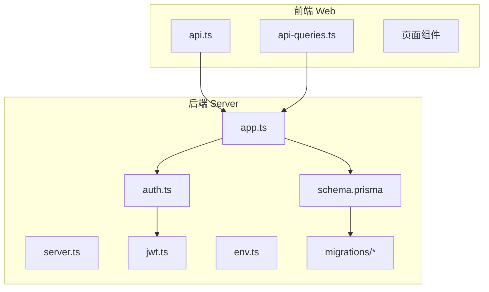
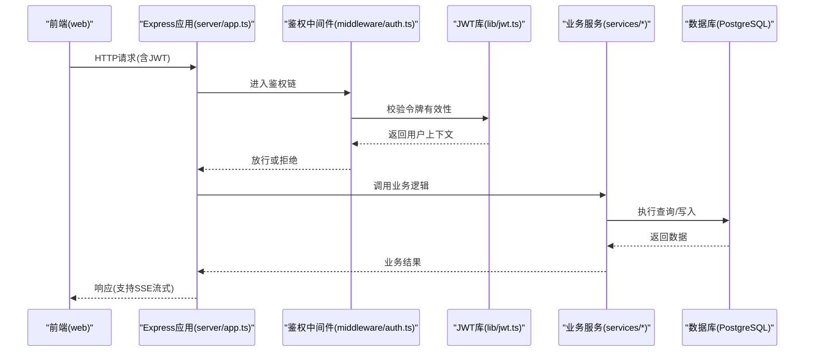
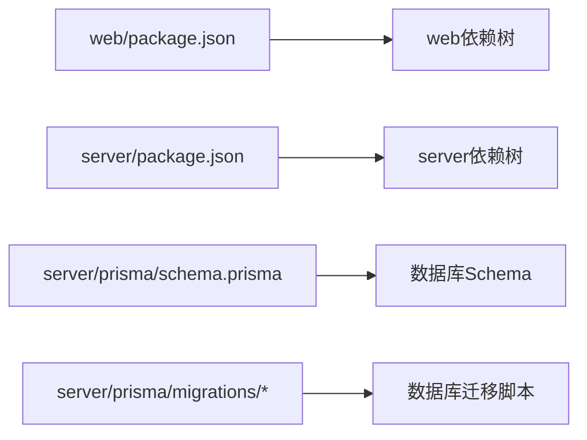

# 版本管理策略

<cite>
**本文引用的文件**   
- [server/package.json](file://server/package.json)
- [web/package.json](file://web/package.json)
- [server/prisma/schema.prisma](file://server/prisma/schema.prisma)
- [server/prisma/migrations/20260722121714_init/migration.sql](file://server/prisma/migrations/20260722121714_init/migration.sql)
- [server/prisma/migrations/20260722142144_add_formula_rule/migration.sql](file://server/prisma/migrations/20260722142144_add_formula_rule/migration.sql)
- [server/prisma/migrations/20260723120000_add_subject_analysis/migration.sql](file://server/prisma/migrations/20260723120000_add_subject_analysis/migration.sql)
- [server/prisma/migrations/20260724120000_remove_business_unit_org_scope/migration.sql](file://server/prisma/migrations/20260724120000_remove_business_unit_org_scope/migration.sql)
- [server/src/app.ts](file://server/src/app.ts)
- [server/src/server.ts](file://server/src/server.ts)
- [server/src/config/env.ts](file://server/src/config/env.ts)
- [server/src/lib/jwt.ts](file://server/src/lib/jwt.ts)
- [server/src/middleware/auth.ts](file://server/src/middleware/auth.ts)
- [server/src/middleware/error-handler.ts](file://server/src/middleware/error-handler.ts)
- [server/src/services/AuthService.ts](file://server/src/services/AuthService.ts)
- [web/src/lib/api.ts](file://web/src/lib/api.ts)
- [web/src/hooks/api-queries.ts](file://web/src/hooks/api-queries.ts)
- [web/src/pages/reports/index.tsx](file://web/src/pages/reports/index.tsx)
- [web/src/pages/admin/index.tsx](file://web/src/pages/admin/index.tsx)
</cite>

## 目录
1. [简介](#简介)
2. [项目结构](#项目结构)
3. [核心组件](#核心组件)
4. [架构总览](#架构总览)
5. [详细组件分析](#详细组件分析)
6. [依赖分析](#依赖分析)
7. [性能考虑](#性能考虑)
8. [故障排查指南](#故障排查指南)
9. [结论](#结论)
10. [附录](#附录)

## 简介
本文件为FY200项目的版本管理策略，面向前后端协同与数据库迁移的发布流程，明确语义化版本控制、分支模型、版本号更新规则、标签与发布流程、以及兼容性矩阵与向后兼容保证。目标是确保在快速迭代的同时，保持API、前端、数据库三者的稳定与可回滚能力。

## 项目结构
FY200采用前后端分离的双包结构：
- server：Express + Prisma + PostgreSQL，包含路由、服务、中间件、配置与Prisma迁移脚本。
- web：React/Vite前端，通过HTTP API与后端交互，使用JWT鉴权与SSE流式AI能力。

图表来源
- [server/src/app.ts](file://server/src/app.ts)
- [server/src/server.ts](file://server/src/server.ts)
- [server/src/middleware/auth.ts](file://server/src/middleware/auth.ts)
- [server/src/lib/jwt.ts](file://server/src/lib/jwt.ts)
- [server/src/config/env.ts](file://server/src/config/env.ts)
- [server/prisma/schema.prisma](file://server/prisma/schema.prisma)
- [server/prisma/migrations/20260722121714_init/migration.sql](file://server/prisma/migrations/20260722121714_init/migration.sql)
- [server/prisma/migrations/20260722142144_add_formula_rule/migration.sql](file://server/prisma/migrations/20260722142144_add_formula_rule/migration.sql)
- [server/prisma/migrations/20260723120000_add_subject_analysis/migration.sql](file://server/prisma/migrations/20260723120000_add_subject_analysis/migration.sql)
- [server/prisma/migrations/20260724120000_remove_business_unit_org_scope/migration.sql](file://server/prisma/migrations/20260724120000_remove_business_unit_org_scope/migration.sql)
- [web/src/lib/api.ts](file://web/src/lib/api.ts)
- [web/src/hooks/api-queries.ts](file://web/src/hooks/api-queries.ts)

章节来源
- [server/package.json](file://server/package.json)
- [web/package.json](file://web/package.json)
- [server/src/app.ts](file://server/src/app.ts)
- [server/src/server.ts](file://server/src/server.ts)
- [server/prisma/schema.prisma](file://server/prisma/schema.prisma)

## 核心组件
- 语义化版本控制（SemVer）：主版本、次版本、修订号定义与触发条件。
- 分支管理策略：main、develop、feature、hotfix命名规范与合并流程。
- 版本号更新规则：前后端同步、依赖版本、数据库迁移版本。
- 标签与发布：Git标签命名、发布分支创建与合并、发布产物。
- 兼容性矩阵与向后兼容：API/Schema/前端兼容性约束与降级策略。

章节来源
- [server/package.json](file://server/package.json)
- [web/package.json](file://web/package.json)

## 架构总览
FY200采用“前端调用后端REST/SSE接口，后端通过Prisma访问PostgreSQL”的标准三层架构。鉴权链路包括Helmet、CORS、限流、JWT校验、权限与范围控制、软删除、审计日志等中间件链。

图表来源
- [server/src/app.ts](file://server/src/app.ts)
- [server/src/middleware/auth.ts](file://server/src/middleware/auth.ts)
- [server/src/lib/jwt.ts](file://server/src/lib/jwt.ts)
- [server/src/services/AuthService.ts](file://server/src/services/AuthService.ts)

章节来源
- [server/src/app.ts](file://server/src/app.ts)
- [server/src/server.ts](file://server/src/server.ts)
- [server/src/middleware/auth.ts](file://server/src/middleware/auth.ts)
- [server/src/lib/jwt.ts](file://server/src/lib/jwt.ts)
- [server/src/services/AuthService.ts](file://server/src/services/AuthService.ts)

## 详细组件分析

### 语义化版本控制规范
- 主版本（X.y.z）：不兼容的API或数据结构变更。例如新增必填字段、删除接口、改变鉴权方式。
- 次版本（x.Y.z）：向后兼容的功能新增。例如新增只读接口、新增可选参数、新增报表维度。
- 修订号（x.y.Z）：向后兼容的问题修复。例如修复计算错误、修复导入导出异常、修复权限边界。

触发建议：
- 当Prisma Schema发生破坏性变更时，提升主版本；仅新增字段或关系时提升次版本；仅修复迁移脚本或数据问题时提升修订号。
- 当前端对后端API的调用契约发生变化时，遵循上述原则统一升级。

章节来源
- [server/prisma/schema.prisma](file://server/prisma/schema.prisma)
- [web/src/lib/api.ts](file://web/src/lib/api.ts)
- [web/src/hooks/api-queries.ts](file://web/src/hooks/api-queries.ts)

### 分支管理策略
- main：生产可用分支，所有发布均打Tag并在此分支合并。禁止直接推送代码。
- develop：集成开发分支，日常功能在此合并，用于构建预发布环境。
- feature/<描述>：新功能分支，从develop拉取，完成后以PR合并至develop。
- hotfix/<问题编号>：紧急修复分支，从main拉取，修复后同时合并到main与develop，并打Tag。

合并流程：
- feature→develop：需通过CI测试、代码审查、API契约检查。
- hotfix→main/develop：优先保障稳定性，必要时跳过非关键检查但需事后补全。

章节来源
- [server/package.json](file://server/package.json)
- [web/package.json](file://web/package.json)

### 版本号更新规则
- 前后端同步策略：
  - 后端发布新版本时，若存在破坏性变更，前端必须同步升级主版本；否则按次版本或修订号对齐。
  - 前端发布前需确认与后端API契约一致，避免运行时错误。
- 依赖版本管理：
  - 锁定关键依赖版本（如Prisma、Express、JWT），在package.json中记录精确版本，便于复现与回滚。
  - 安全补丁优先升级，重大依赖升级需评估兼容性并提升主版本。
- 数据库迁移版本控制：
  - 每个迁移脚本以时间戳命名，顺序不可逆。
  - 发布前必须验证迁移脚本在目标环境可成功执行，且具备回滚方案。

章节来源
- [server/package.json](file://server/package.json)
- [web/package.json](file://web/package.json)
- [server/prisma/migrations/20260722121714_init/migration.sql](file://server/prisma/migrations/20260722121714_init/migration.sql)
- [server/prisma/migrations/20260722142144_add_formula_rule/migration.sql](file://server/prisma/migrations/20260722142144_add_formula_rule/migration.sql)
- [server/prisma/migrations/20260723120000_add_subject_analysis/migration.sql](file://server/prisma/migrations/20260723120000_add_subject_analysis/migration.sql)
- [server/prisma/migrations/20260724120000_remove_business_unit_org_scope/migration.sql](file://server/prisma/migrations/20260724120000_remove_business_unit_org_scope/migration.sql)

### 版本标签管理与发布流程
- Git标签命名：v主.次.修（如v1.2.3），对应一次完整发布。
- 发布分支：release/vX.Y.Z，从develop创建，进行最终验证与文档更新，通过后合并至main并打Tag。
- 发布产物：
  - 后端：打包镜像或压缩包，附带依赖锁定文件与迁移脚本清单。
  - 前端：静态资源构建产物，附带版本元数据。
- 回滚策略：保留最近三个版本的Tag与制品，支持一键回滚。

章节来源
- [server/package.json](file://server/package.json)
- [web/package.json](file://web/package.json)

### 兼容性矩阵与向后兼容保证
- API兼容性：
  - 新增字段默认可选，旧客户端忽略未知字段。
  - 删除字段需保留一段时间并提供迁移脚本，逐步淘汰。
- 前端兼容性：
  - 前端应容忍后端返回的额外字段，避免强类型断言导致崩溃。
  - 对SSE流式响应做超时与重试保护。
- 数据库兼容性：
  - 迁移脚本需幂等，支持重复执行不报错。
  - 大表变更采用增量策略，避免锁表影响线上。

章节来源
- [server/prisma/schema.prisma](file://server/prisma/schema.prisma)
- [web/src/lib/api.ts](file://web/src/lib/api.ts)
- [server/src/lib/jwt.ts](file://server/src/lib/jwt.ts)

### 鉴权与令牌生命周期
- 访问令牌有效期短（如15分钟），刷新令牌有效期长（如7天）。
- 刷新机制：前端在访问令牌过期前主动刷新，失败则引导重新登录。
- 黑名单：支持服务端令牌黑名单，强制下线或安全事件处理。

章节来源
- [server/src/lib/jwt.ts](file://server/src/lib/jwt.ts)
- [server/src/middleware/auth.ts](file://server/src/middleware/auth.ts)
- [server/src/services/AuthService.ts](file://server/src/services/AuthService.ts)

### 数据库迁移流程
- 生成迁移：修改Schema后生成迁移脚本，确保正向与反向均可执行。
- 本地验证：在本地PostgreSQL执行迁移，验证数据完整性。
- 预发布验证：在Staging环境执行迁移，观察性能与锁表情况。
- 生产发布：灰度发布，先小流量验证，再全量推进。

章节来源
- [server/prisma/migrations/20260722121714_init/migration.sql](file://server/prisma/migrations/20260722121714_init/migration.sql)
- [server/prisma/migrations/20260722142144_add_formula_rule/migration.sql](file://server/prisma/migrations/20260722142144_add_formula_rule/migration.sql)
- [server/prisma/migrations/20260723120000_add_subject_analysis/migration.sql](file://server/prisma/migrations/20260723120000_add_subject_analysis/migration.sql)
- [server/prisma/migrations/20260724120000_remove_business_unit_org_scope/migration.sql](file://server/prisma/migrations/20260724120000_remove_business_unit_org_scope/migration.sql)

### 前端API调用与状态管理
- API封装：统一错误处理、重试、超时、鉴权头注入。
- Hooks封装：将API调用封装为React Hooks，提供加载、错误、缓存状态。
- 页面集成：报表、管理等页面通过Hooks获取数据，渲染UI。

章节来源
- [web/src/lib/api.ts](file://web/src/lib/api.ts)
- [web/src/hooks/api-queries.ts](file://web/src/hooks/api-queries.ts)
- [web/src/pages/reports/index.tsx](file://web/src/pages/reports/index.tsx)
- [web/src/pages/admin/index.tsx](file://web/src/pages/admin/index.tsx)

## 依赖分析
- 后端依赖：Express、Prisma、PostgreSQL驱动、JWT、SSE流式库。
- 前端依赖：React、Vite、Axios/Fetch封装、状态管理库。
- 关键依赖锁定：package-lock.json确保构建一致性。

图表来源
- [server/package.json](file://server/package.json)
- [web/package.json](file://web/package.json)
- [server/prisma/schema.prisma](file://server/prisma/schema.prisma)
- [server/prisma/migrations/20260722121714_init/migration.sql](file://server/prisma/migrations/20260722121714_init/migration.sql)

章节来源
- [server/package.json](file://server/package.json)
- [web/package.json](file://web/package.json)

## 性能考虑
- 数据库迁移：大表变更采用在线DDL，避免长时间锁表。
- API响应：分页、索引优化、缓存热点数据。
- SSE流式：限制并发与速率，防止后端过载。
- 前端渲染：虚拟列表、懒加载、按需引入组件。

[本节为通用指导，无需引用具体文件]

## 故障排查指南
- 鉴权失败：检查JWT签名、过期时间、黑名单状态。
- 迁移失败：核对迁移脚本顺序、幂等性、数据库连接配置。
- API错误：查看中间件错误处理器日志，定位具体路由与服务层异常。

章节来源
- [server/src/middleware/error-handler.ts](file://server/src/middleware/error-handler.ts)
- [server/src/lib/jwt.ts](file://server/src/lib/jwt.ts)
- [server/src/middleware/auth.ts](file://server/src/middleware/auth.ts)

## 结论
通过严格的语义化版本控制、清晰的分支模型、严谨的迁移与标签管理，以及完善的兼容性矩阵与回滚策略，FY200项目能够在快速迭代的同时保障系统稳定性与可维护性。建议持续完善自动化测试与CI/CD流水线，进一步提升发布效率与质量。

[本节为总结性内容，无需引用具体文件]

## 附录
- 术语表：SemVer、Prisma、SSE、JWT、CI/CD。
- 参考链接：内部Wiki中的API参考、数据库Schema说明、开发入门指南。

[本节为补充信息，无需引用具体文件]