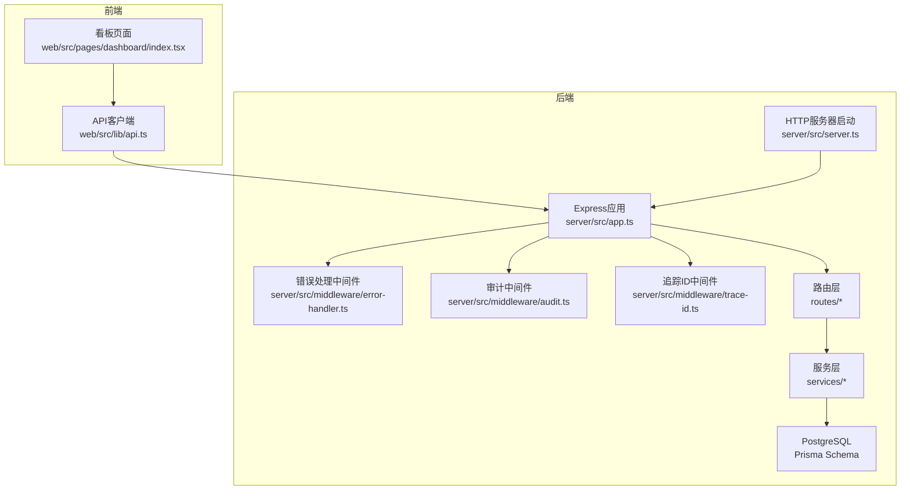
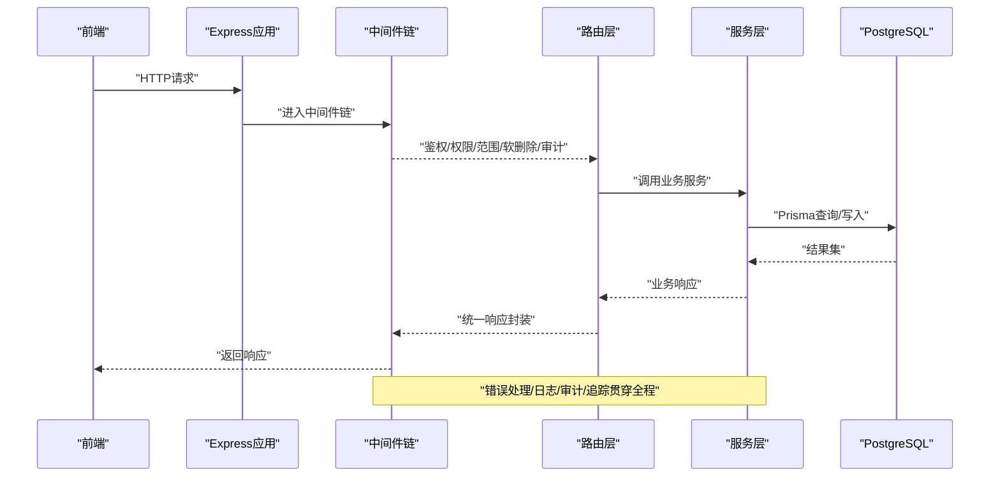
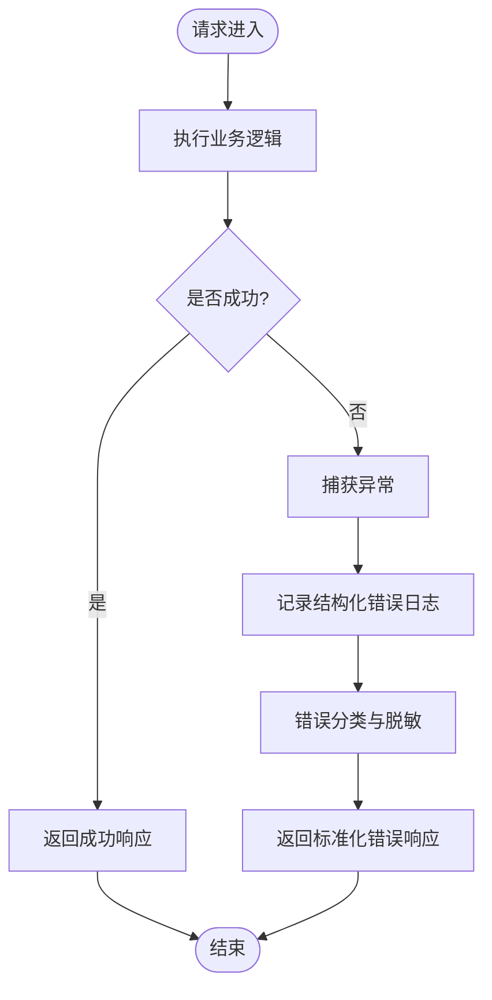
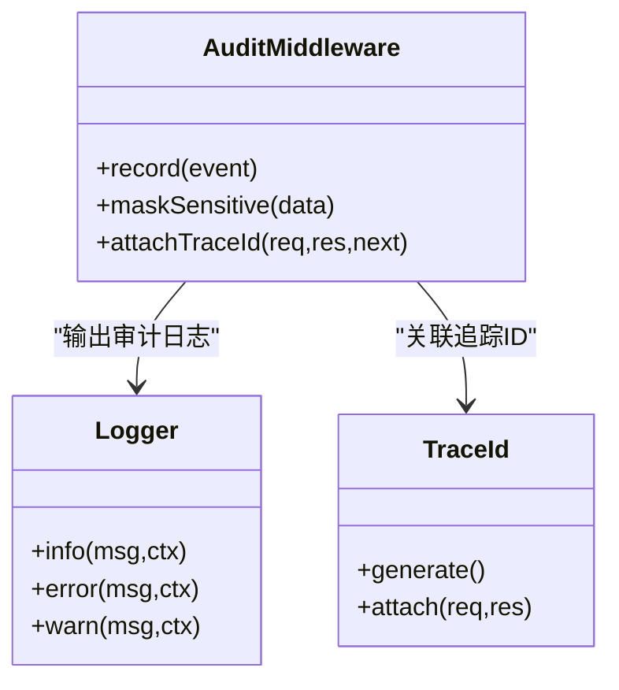
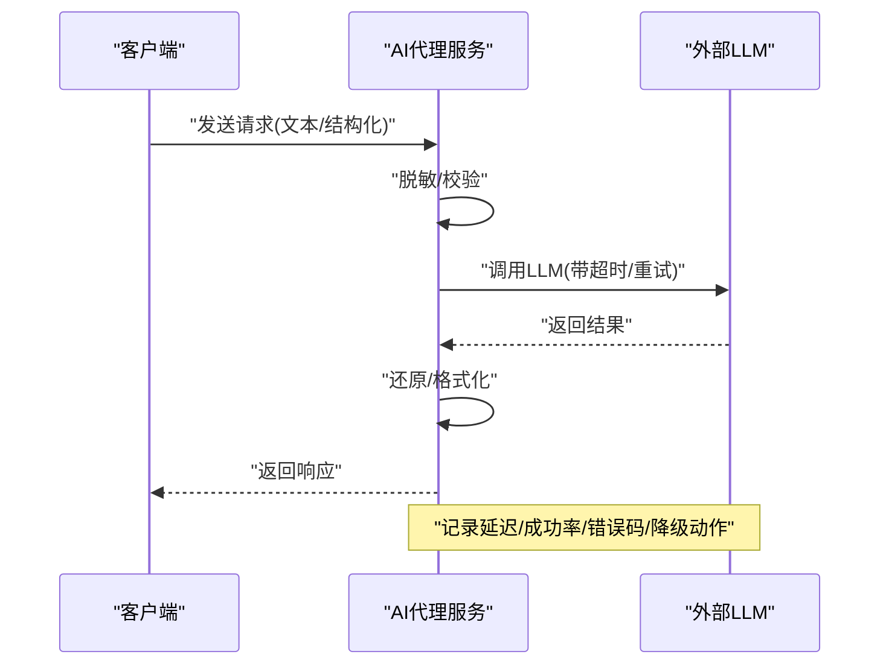
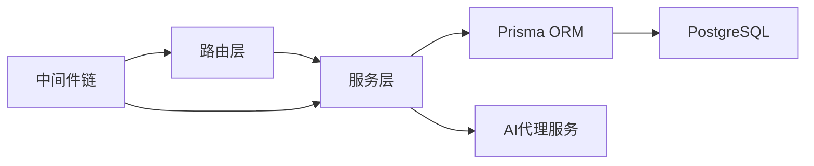

# 监控与回滚

<cite>
**本文引用的文件**   
- [server/src/app.ts](file://server/src/app.ts)
- [server/src/server.ts](file://server/src/server.ts)
- [server/src/middleware/error-handler.ts](file://server/src/middleware/error-handler.ts)
- [server/src/middleware/audit.ts](file://server/src/middleware/audit.ts)
- [server/src/middleware/trace-id.ts](file://server/src/middleware/trace-id.ts)
- [server/src/lib/logger.ts](file://server/src/lib/logger.ts)
- [server/src/lib/errors.ts](file://server/src/lib/errors.ts)
- [server/src/lib/response.ts](file://server/src/lib/response.ts)
- [server/src/config/env.ts](file://server/src/config/env.ts)
- [server/src/middleware/rate-limit.ts](file://server/src/middleware/rate-limit.ts)
- [server/src/middleware/auth.ts](file://server/src/middleware/auth.ts)
- [server/src/middleware/permission.ts](file://server/src/middleware/permission.ts)
- [server/src/middleware/scope.ts](file://server/src/middleware/scope.ts)
- [server/src/middleware/soft-delete.ts](file://server/src/middleware/soft-delete.ts)
- [server/src/routes/admin.ts](file://server/src/routes/admin.ts)
- [server/src/routes/ai.ts](file://server/src/routes/ai.ts)
- [server/src/routes/dashboard.ts](file://server/src/routes/dashboard.ts)
- [server/src/routes/data.ts](file://server/src/routes/data.ts)
- [server/src/routes/indicators.ts](file://server/src/routes/indicators.ts)
- [server/src/routes/reports.ts](file://server/src/routes/reports.ts)
- [server/src/services/AIProxyService.ts](file://server/src/services/AIProxyService.ts)
- [server/src/services/DashboardService.ts](file://server/src/services/DashboardService.ts)
- [server/src/services/DataService.ts](file://server/src/services/DataService.ts)
- [server/src/services/IndicatorsService.ts](file://server/src/services/IndicatorsService.ts)
- [server/src/services/ReportService.ts](file://server/src/services/ReportService.ts)
- [server/prisma/schema.prisma](file://server/prisma/schema.prisma)
- [server/scripts/ai-smoke.ts](file://server/scripts/ai-smoke.ts)
- [server/scripts/ai-pipeline-smoke.ts](file://server/scripts/ai-pipeline-smoke.ts)
- [server/scripts/cors-check.ts](file://server/scripts/cors-check.ts)
- [server/package.json](file://server/package.json)
- [web/src/lib/api.ts](file://web/src/lib/api.ts)
- [web/src/pages/dashboard/index.tsx](file://web/src/pages/dashboard/index.tsx)
- [docs/references/observability.md](file://docs/references/observability.md)
</cite>

## 目录
1. [简介](#简介)
2. [项目结构](#项目结构)
3. [核心组件](#核心组件)
4. [架构总览](#架构总览)
5. [详细组件分析](#详细组件分析)
6. [依赖分析](#依赖分析)
7. [性能考虑](#性能考虑)
8. [故障排查指南](#故障排查指南)
9. [结论](#结论)
10. [附录](#附录)

## 简介
本文件面向FY200项目的发布后监控与回滚机制，覆盖应用健康检查、错误日志收集、性能指标监控、用户行为分析、告警配置、快速回滚、数据一致性保障、服务降级策略以及故障排查流程。文档同时给出监控仪表板配置建议与运维自动化脚本使用方式，确保在复杂业务场景下具备高可用与可观测性。

## 项目结构
FY200采用前后端分离架构：后端基于Express + Prisma + PostgreSQL，前端为React/Vite。中间件执行链顺序明确，便于统一接入监控、审计与限流等横切关注点。

图表来源 
- [server/src/app.ts](file://server/src/app.ts)
- [server/src/server.ts](file://server/src/server.ts)
- [server/src/middleware/error-handler.ts](file://server/src/middleware/error-handler.ts)
- [server/src/middleware/audit.ts](file://server/src/middleware/audit.ts)
- [server/src/middleware/trace-id.ts](file://server/src/middleware/trace-id.ts)
- [server/src/routes/admin.ts](file://server/src/routes/admin.ts)
- [server/src/routes/ai.ts](file://server/src/routes/ai.ts)
- [server/src/routes/dashboard.ts](file://server/src/routes/dashboard.ts)
- [server/src/routes/data.ts](file://server/src/routes/data.ts)
- [server/src/routes/indicators.ts](file://server/src/routes/indicators.ts)
- [server/src/routes/reports.ts](file://server/src/routes/reports.ts)
- [server/src/services/AIProxyService.ts](file://server/src/services/AIProxyService.ts)
- [server/src/services/DashboardService.ts](file://server/src/services/DashboardService.ts)
- [server/src/services/DataService.ts](file://server/src/services/DataService.ts)
- [server/src/services/IndicatorsService.ts](file://server/src/services/IndicatorsService.ts)
- [server/src/services/ReportService.ts](file://server/src/services/ReportService.ts)
- [server/prisma/schema.prisma](file://server/prisma/schema.prisma)

章节来源
- [server/src/app.ts](file://server/src/app.ts)
- [server/src/server.ts](file://server/src/server.ts)
- [server/src/middleware/error-handler.ts](file://server/src/middleware/error-handler.ts)
- [server/src/middleware/audit.ts](file://server/src/middleware/audit.ts)
- [server/src/middleware/trace-id.ts](file://server/src/middleware/trace-id.ts)
- [server/src/lib/logger.ts](file://server/src/lib/logger.ts)
- [server/src/lib/errors.ts](file://server/src/lib/errors.ts)
- [server/src/lib/response.ts](file://server/src/lib/response.ts)
- [server/src/config/env.ts](file://server/src/config/env.ts)
- [server/package.json](file://server/package.json)

## 核心组件
- 健康检查与健康探针
  - 提供轻量健康接口用于Kubernetes或负载均衡器探测，返回服务状态与依赖可用性（如数据库连接）。
  - 建议暴露GET /health与GET /ready两个端点，分别表示进程存活与依赖就绪。
- 错误日志与结构化输出
  - 统一错误处理中间件捕获异常并输出结构化日志，包含请求ID、路径、方法、状态码、耗时与堆栈摘要。
  - 通过logger模块统一格式化，支持按级别过滤与采样。
- 性能指标采集
  - 关键指标包括QPS、P95/P99延迟、错误率、数据库慢查询、AI代理调用成功率与延迟。
  - 建议在中间件层埋点，结合Prometheus导出器或云监控SDK上报。
- 用户行为分析
  - 通过审计中间件记录关键操作（登录、导入、公式变更、报表导出），附带维度信息（租户、部门、角色）。
  - 前端埋点上报页面访问、按钮点击、表单提交等事件，配合后端审计形成闭环。

章节来源
- [server/src/middleware/error-handler.ts](file://server/src/middleware/error-handler.ts)
- [server/src/middleware/audit.ts](file://server/src/middleware/audit.ts)
- [server/src/middleware/trace-id.ts](file://server/src/middleware/trace-id.ts)
- [server/src/lib/logger.ts](file://server/src/lib/logger.ts)
- [server/src/lib/errors.ts](file://server/src/lib/errors.ts)
- [server/src/lib/response.ts](file://server/src/lib/response.ts)
- [server/src/config/env.ts](file://server/src/config/env.ts)

## 架构总览
下图展示从前端到后端再到数据库的完整调用链路，以及监控与审计的接入点。

图表来源 
- [server/src/app.ts](file://server/src/app.ts)
- [server/src/middleware/error-handler.ts](file://server/src/middleware/error-handler.ts)
- [server/src/middleware/audit.ts](file://server/src/middleware/audit.ts)
- [server/src/middleware/trace-id.ts](file://server/src/middleware/trace-id.ts)
- [server/src/routes/dashboard.ts](file://server/src/routes/dashboard.ts)
- [server/src/services/DashboardService.ts](file://server/src/services/DashboardService.ts)
- [server/prisma/schema.prisma](file://server/prisma/schema.prisma)

## 详细组件分析

### 健康检查与就绪探针
- 设计要点
  - /health：进程级健康，返回服务是否存活。
  - /ready：依赖就绪，检查数据库连接、外部依赖（如AI代理）可用性。
- 实现建议
  - 在应用初始化时注册健康路由；/ready中执行轻量依赖探测（如SELECT 1）。
  - 将探针结果纳入容器编排的健康检查与滚动更新策略。

章节来源
- [server/src/app.ts](file://server/src/app.ts)
- [server/src/server.ts](file://server/src/server.ts)

### 错误处理与日志采集
- 统一错误处理
  - 捕获未处理异常与中间件错误，输出结构化日志，包含请求上下文与错误分类。
  - 对外返回标准化错误响应，避免敏感信息泄露。
- 日志规范
  - 使用logger模块统一输出，包含时间戳、级别、请求ID、模块名、消息与字段化上下文。
  - 对敏感信息进行脱敏（金额区间化、公司名映射）。

图表来源 
- [server/src/middleware/error-handler.ts](file://server/src/middleware/error-handler.ts)
- [server/src/lib/logger.ts](file://server/src/lib/logger.ts)
- [server/src/lib/errors.ts](file://server/src/lib/errors.ts)
- [server/src/lib/response.ts](file://server/src/lib/response.ts)

章节来源
- [server/src/middleware/error-handler.ts](file://server/src/middleware/error-handler.ts)
- [server/src/lib/logger.ts](file://server/src/lib/logger.ts)
- [server/src/lib/errors.ts](file://server/src/lib/errors.ts)
- [server/src/lib/response.ts](file://server/src/lib/response.ts)

### 审计与用户行为分析
- 审计中间件
  - 记录关键操作（登录、导入、公式维护、报表导出），包含用户、租户、IP、时间、资源标识与操作类型。
  - 与追踪ID关联，便于跨服务链路定位。
- 前端埋点
  - 页面访问、按钮点击、表单提交、错误弹窗等事件上报至后端审计接口或日志系统。

图表来源 
- [server/src/middleware/audit.ts](file://server/src/middleware/audit.ts)
- [server/src/middleware/trace-id.ts](file://server/src/middleware/trace-id.ts)
- [server/src/lib/logger.ts](file://server/src/lib/logger.ts)

章节来源
- [server/src/middleware/audit.ts](file://server/src/middleware/audit.ts)
- [server/src/middleware/trace-id.ts](file://server/src/middleware/trace-id.ts)
- [server/src/lib/logger.ts](file://server/src/lib/logger.ts)

### 性能指标监控
- 关键指标
  - QPS、平均/分位延迟、错误率、数据库慢查询、AI代理调用成功率与延迟、内存与CPU占用。
- 采集位置
  - 中间件层统计请求耗时与状态码分布；服务层统计外部调用耗时与失败次数。
- 上报方式
  - 可选Prometheus导出器或云监控SDK，定期聚合并暴露指标端点。

章节来源
- [server/src/middleware/rate-limit.ts](file://server/src/middleware/rate-limit.ts)
- [server/src/services/AIProxyService.ts](file://server/src/services/AIProxyService.ts)
- [server/src/lib/logger.ts](file://server/src/lib/logger.ts)

### AI双管道监控
- 管道说明
  - polish：文本→脱敏→LLM→还原；analyze：结构化→计算→脱敏→LLM→生成。
- 监控要点
  - 输入长度、脱敏规则命中率、LLM调用成功率、延迟、重试次数、降级开关。
- 容错策略
  - 超时重试、熔断、降级返回缓存或默认值，记录失败原因与上下文。

图表来源 
- [server/src/services/AIProxyService.ts](file://server/src/services/AIProxyService.ts)
- [server/src/lib/logger.ts](file://server/src/lib/logger.ts)

章节来源
- [server/src/services/AIProxyService.ts](file://server/src/services/AIProxyService.ts)
- [server/src/lib/logger.ts](file://server/src/lib/logger.ts)

### 数据一致性与事务
- 事务边界
  - 写操作（导入、公式维护、报表生成）使用Prisma事务保证原子性。
- 幂等与补偿
  - 对重复导入进行去重；失败时记录补偿任务，支持重试与人工干预。
- 版本控制
  - 公式规则与数据模型变更通过迁移管理，支持回滚迁移。

章节来源
- [server/prisma/schema.prisma](file://server/prisma/schema.prisma)

### 限流与鉴权
- 鉴权链
  - JWT校验+黑名单，权限默认拒绝，作用域扩展限制数据可见性。
- 限流策略
  - 全局与接口级限流，防止滥用与雪崩。

章节来源
- [server/src/middleware/auth.ts](file://server/src/middleware/auth.ts)
- [server/src/middleware/permission.ts](file://server/src/middleware/permission.ts)
- [server/src/middleware/scope.ts](file://server/src/middleware/scope.ts)
- [server/src/middleware/rate-limit.ts](file://server/src/middleware/rate-limit.ts)

## 依赖分析
- 组件耦合
  - 路由层依赖服务层，服务层依赖Prisma与外部依赖（如AI代理）。
  - 中间件横向贯穿，低耦合高内聚。
- 外部依赖
  - PostgreSQL、JWT、DeepSeek API（SSE流式）。
- 潜在风险
  - 外部API不稳定导致级联失败，需引入熔断与降级。
  - 数据库慢查询影响整体延迟，需优化索引与SQL。

图表来源 
- [server/src/routes/dashboard.ts](file://server/src/routes/dashboard.ts)
- [server/src/services/DashboardService.ts](file://server/src/services/DashboardService.ts)
- [server/src/services/AIProxyService.ts](file://server/src/services/AIProxyService.ts)
- [server/prisma/schema.prisma](file://server/prisma/schema.prisma)

章节来源
- [server/src/routes/dashboard.ts](file://server/src/routes/dashboard.ts)
- [server/src/services/DashboardService.ts](file://server/src/services/DashboardService.ts)
- [server/src/services/AIProxyService.ts](file://server/src/services/AIProxyService.ts)
- [server/prisma/schema.prisma](file://server/prisma/schema.prisma)

## 性能考虑
- 指标采集开销
  - 使用采样与异步上报降低对主链路的影响。
- 数据库优化
  - 针对高频查询建立合适索引，避免N+1问题。
- 外部调用
  - 设置合理超时与重试上限，启用熔断与降级。
- 前端体验
  - 分页与懒加载，减少首屏负载。

[本节为通用指导，不直接分析具体文件]

## 故障排查指南
- 日志分析方法
  - 通过请求ID串联全链路日志，定位错误发生点。
  - 区分错误级别与模块，优先处理ERROR与WARN。
- 问题定位技巧
  - 查看健康与就绪探针状态，确认依赖可用性。
  - 检查限流与鉴权拦截日志，排除权限与配额问题。
  - 核对审计日志，复现用户操作路径。
- 性能瓶颈识别
  - 分析分位延迟与错误率突增，定位慢查询与外部调用超时。
  - 观察AI代理调用成功率与延迟，必要时切换降级策略。

章节来源
- [server/src/middleware/error-handler.ts](file://server/src/middleware/error-handler.ts)
- [server/src/middleware/audit.ts](file://server/src/middleware/audit.ts)
- [server/src/middleware/rate-limit.ts](file://server/src/middleware/rate-limit.ts)
- [server/src/lib/logger.ts](file://server/src/lib/logger.ts)

## 结论
FY200项目在监控与回滚方面具备良好基础：统一的错误处理、审计与追踪能力，清晰的中间件链与服务分层。建议进一步完善健康探针、指标采集与告警规则，完善回滚与降级策略，提升系统在发布后的稳定性与可恢复性。

[本节为总结，不直接分析具体文件]

## 附录

### 告警机制配置
- 关键指标阈值
  - 错误率>1%持续5分钟触发P1告警。
  - P99延迟>2s持续3分钟触发P2告警。
  - AI代理调用成功率<95%持续5分钟触发P2告警。
- 异常事件通知
  - 通过企业微信/钉钉/邮件多渠道通知，包含请求ID、错误摘要与链接。
- 运维告警规则
  - 数据库连接池耗尽、慢查询数量突增、内存/CPU超阈。

[本节为通用配置建议，不直接分析具体文件]

### 回滚操作指南
- 快速回滚步骤
  - 停止新版本流量，回滚镜像或代码版本，验证健康与就绪探针。
  - 若涉及数据库迁移，执行反向迁移或恢复到快照。
- 数据一致性保证
  - 使用事务与幂等写入，失败时补偿；回滚前备份关键表。
- 服务降级策略
  - 关闭非核心功能（如AI分析），保留核心读写能力。

[本节为通用操作建议，不直接分析具体文件]

### 监控仪表板配置
- 推荐面板
  - 概览：QPS、错误率、P95/P99延迟、依赖健康。
  - 业务：导入成功率、公式维护操作量、报表导出量。
  - AI：调用成功率、延迟、降级次数。
- 数据来源
  - Prometheus指标、结构化日志、审计事件。

[本节为通用仪表板建议，不直接分析具体文件]

### 运维自动化脚本使用
- 健康检查脚本
  - 定时调用/health与/ready，记录状态与延迟。
- 冒烟测试脚本
  - 模拟关键业务流程（登录、导入、报表导出、AI分析），验证端到端可用性。
- CORS校验脚本
  - 验证跨域配置是否正确，避免前端调用失败。

章节来源
- [server/scripts/ai-smoke.ts](file://server/scripts/ai-smoke.ts)
- [server/scripts/ai-pipeline-smoke.ts](file://server/scripts/ai-pipeline-smoke.ts)
- [server/scripts/cors-check.ts](file://server/scripts/cors-check.ts)

### 前端监控与埋点
- API客户端
  - 统一封装请求与响应，记录耗时与错误，上报至监控平台。
- 看板页面
  - 页面加载耗时、图表渲染失败、数据刷新失败等事件上报。

章节来源
- [web/src/lib/api.ts](file://web/src/lib/api.ts)
- [web/src/pages/dashboard/index.tsx](file://web/src/pages/dashboard/index.tsx)

### 可观测性参考
- 内部参考文档
  - 可观测性、性能、DevOps等参考文档提供进一步实践建议。

章节来源
- [docs/references/observability.md](file://docs/references/observability.md)