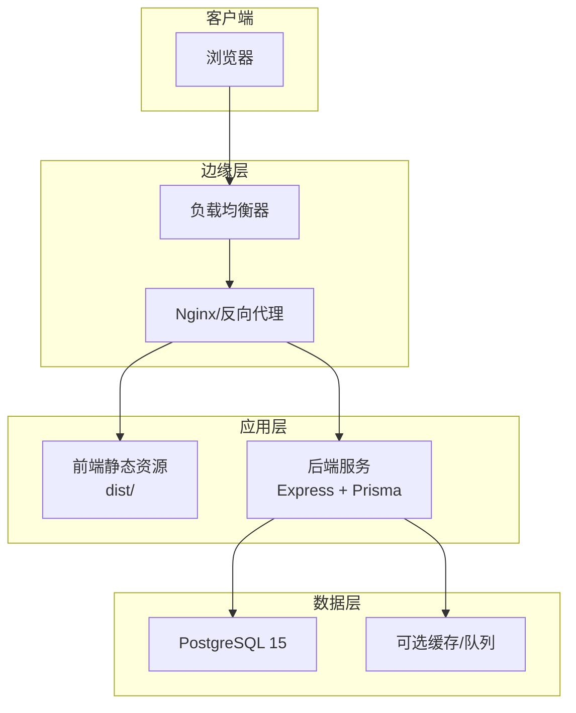
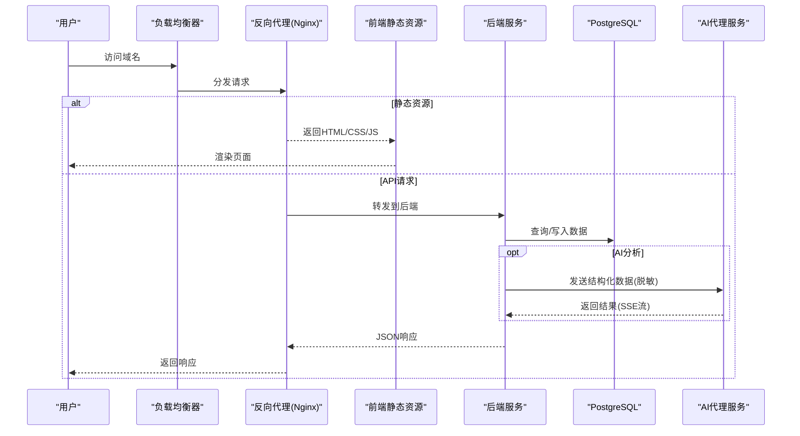
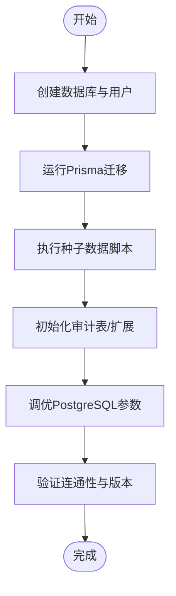
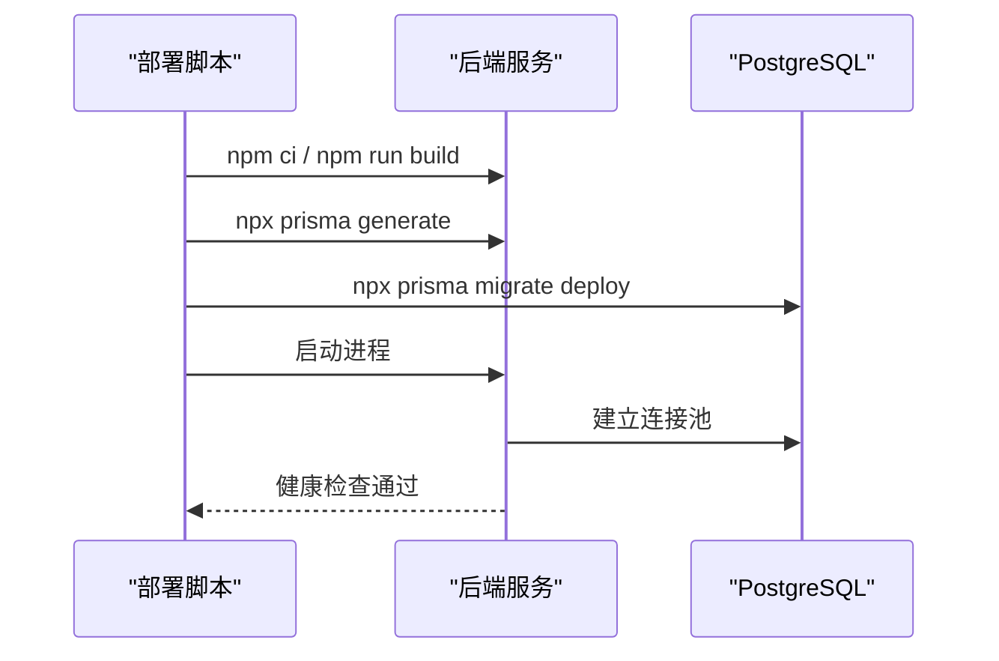
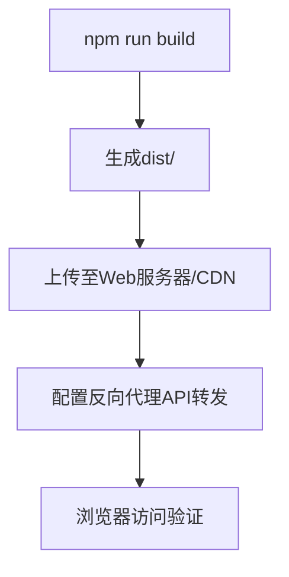
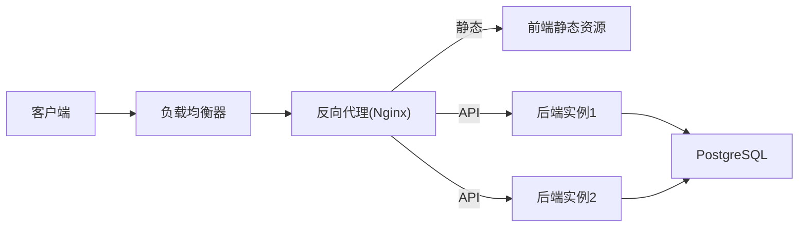
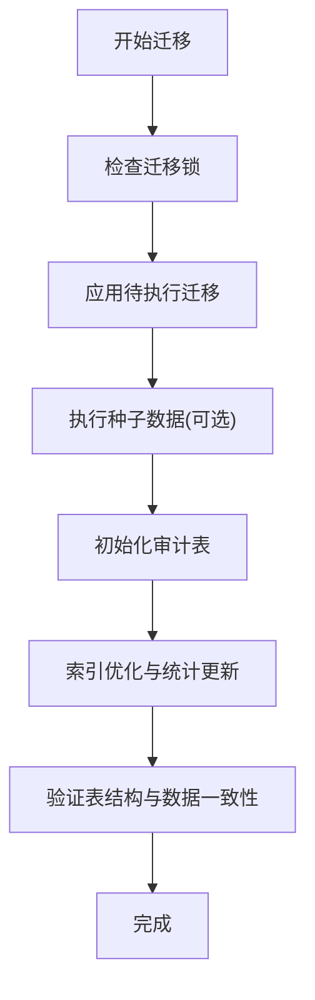
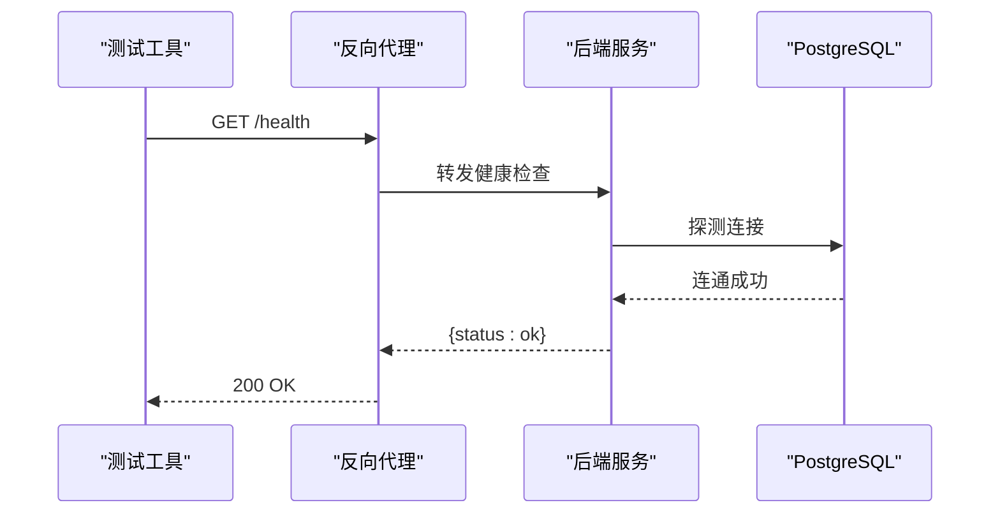
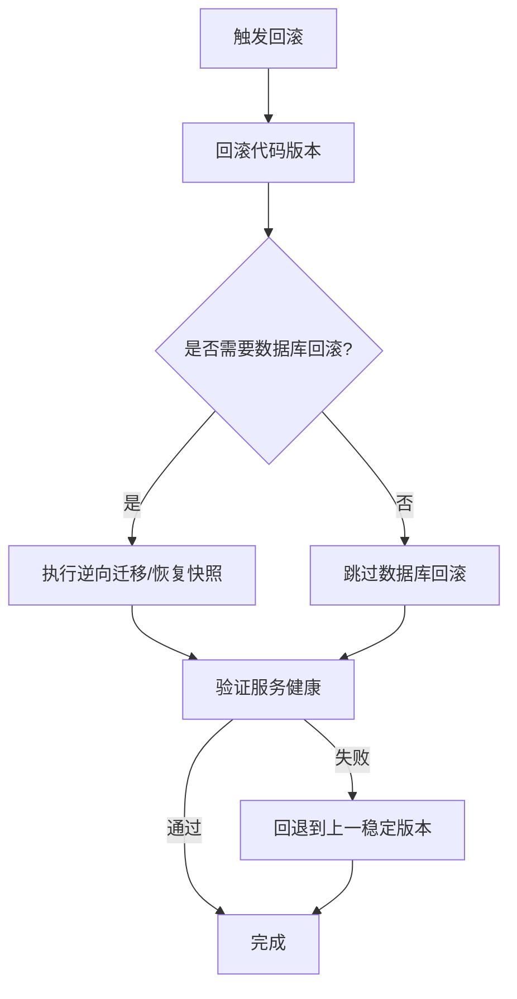
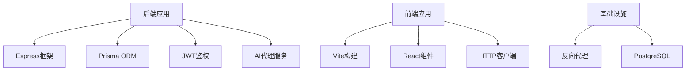

# 部署步骤

<cite>
**本文引用的文件**
- [server/package.json](file://server/package.json)
- [server/tsconfig.json](file://server/tsconfig.json)
- [server/src/app.ts](file://server/src/app.ts)
- [server/src/server.ts](file://server/src/server.ts)
- [server/src/config/env.ts](file://server/src/config/env.ts)
- [server/src/lib/prisma.ts](file://server/src/lib/prisma.ts)
- [server/prisma/schema.prisma](file://server/prisma/schema.prisma)
- [server/prisma/migrations/20260722121714_init/migration.sql](file://server/prisma/migrations/20260722121714_init/migration.sql)
- [server/prisma/migrations/20260722142144_add_formula_rule/migration.sql](file://server/prisma/migrations/20260722142144_add_formula_rule/migration.sql)
- [server/prisma/migrations/20260723120000_add_subject_analysis/migration.sql](file://server/prisma/migrations/20260723120000_add_subject_analysis/migration.sql)
- [server/prisma/migrations/20260724120000_remove_business_unit_org_scope/migration.sql](file://server/prisma/migrations/20260724120000_remove_business_unit_org_scope/migration.sql)
- [server/prisma/migrations/migration_lock.toml](file://server/prisma/migrations/migration_lock.toml)
- [server/prisma/seed.ts](file://server/prisma/seed.ts)
- [server/prisma/seed-companies.ts](file://server/prisma/seed-companies.ts)
- [server/prisma/seed-domain.ts](file://server/prisma/seed-domain.ts)
- [server/prisma/init-audit.sql](file://server/prisma/init-audit.sql)
- [server/.pgdata/postgresql.conf](file://server/.pgdata/postgresql.conf)
- [server/.pgdata/pg_hba.conf](file://server/.pgdata/pg_hba.conf)
- [server/src/middleware/helmet.ts](file://server/src/middleware/helmet.ts)
- [server/src/middleware/cors.ts](file://server/src/middleware/cors.ts)
- [server/src/middleware/rate-limit.ts](file://server/src/middleware/rate-limit.ts)
- [server/src/middleware/auth.ts](file://server/src/middleware/auth.ts)
- [server/src/middleware/permission.ts](file://server/src/middleware/permission.ts)
- [server/src/middleware/scope.ts](file://server/src/middleware/scope.ts)
- [server/src/middleware/soft-delete.ts](file://server/src/middleware/soft-delete.ts)
- [server/src/middleware/audit.ts](file://server/src/middleware/audit.ts)
- [server/src/middleware/error-handler.ts](file://server/src/middleware/error-handler.ts)
- [server/src/middleware/trace-id.ts](file://server/src/middleware/trace-id.ts)
- [server/src/routes/admin.ts](file://server/src/routes/admin.ts)
- [server/src/routes/auth.ts](file://server/src/routes/auth.ts)
- [server/src/routes/dashboard.ts](file://server/src/routes/dashboard.ts)
- [server/src/routes/data.ts](file://server/src/routes/data.ts)
- [server/src/routes/indicators.ts](file://server/src/routes/indicators.ts)
- [server/src/routes/reports.ts](file://server/src/routes/reports.ts)
- [server/src/services/AIProxyService.ts](file://server/src/services/AIProxyService.ts)
- [server/src/services/AuthService.ts](file://server/src/services/AuthService.ts)
- [server/src/services/DashboardService.ts](file://server/src/services/DashboardService.ts)
- [server/src/services/DataService.ts](file://server/src/services/DataService.ts)
- [server/src/services/IndicatorsService.ts](file://server/src/services/IndicatorsService.ts)
- [server/src/services/ReportService.ts](file://server/src/services/ReportService.ts)
- [web/package.json](file://web/package.json)
- [web/vite.config.ts](file://web/vite.config.ts)
- [web/index.html](file://web/index.html)
- [web/src/main.tsx](file://web/src/main.tsx)
- [web/src/App.tsx](file://web/src/App.tsx)
- [web/src/lib/api.ts](file://web/src/lib/api.ts)
- [web/src/lib/constants.ts](file://web/src/lib/constants.ts)
- [docs/references/devops.md](file://docs/references/devops.md)
- [docs/references/backend.md](file://docs/references/backend.md)
- [docs/references/frontend.md](file://docs/references/frontend.md)
- [docs/references/observability.md](file://docs/references/observability.md)
- [docs/references/performance.md](file://docs/references/performance.md)
</cite>

## 目录
1. [简介](#简介)
2. [项目结构](#项目结构)
3. [核心组件](#核心组件)
4. [架构总览](#架构总览)
5. [详细组件分析](#详细组件分析)
6. [依赖分析](#依赖分析)
7. [性能考虑](#性能考虑)
8. [故障排查指南](#故障排查指南)
9. [结论](#结论)
10. [附录](#附录)

## 简介
本指南面向生产环境，提供FY200财年经营数据分析平台的完整部署步骤。内容覆盖服务器准备、PostgreSQL初始化、环境变量与安全证书配置、后端与前端部署、反向代理与负载均衡、数据库迁移与数据备份恢复、索引优化、服务验证与健康检查、回滚与故障恢复等。平台定位“Excel进、看板/报表出”，单位统一为万元/人民币；后端采用Express + Prisma + PostgreSQL + JWT + DeepSeek API（SSE流式），中间件执行链顺序固定，计算类指标使用安全公式解析，AI双管道保障数据安全与合规。

## 项目结构
仓库采用前后端分离：
- server：Node.js后端（Express + Prisma + TypeScript）
- web：前端静态资源（Vite构建产物）
- docs：运维与参考文档
- .pgdata：本地PostgreSQL数据目录（生产建议使用外部托管或容器化持久卷）

**图示来源**
- [server/src/app.ts](file://server/src/app.ts)
- [server/src/server.ts](file://server/src/server.ts)
- [web/vite.config.ts](file://web/vite.config.ts)
- [web/package.json](file://web/package.json)

**章节来源**
- [server/package.json](file://server/package.json)
- [web/package.json](file://web/package.json)
- [docs/references/devops.md](file://docs/references/devops.md)

## 核心组件
- 后端入口与路由：Express应用装配、路由注册、中间件链
- 数据访问：Prisma Client封装与连接池
- 认证与授权：JWT签发与校验、权限与范围控制
- AI代理：DeepSeek SSE流式调用与脱敏还原
- 监控与可观测性：日志、追踪ID、错误处理

关键路径与职责：
- 应用启动：server/src/server.ts → server/src/app.ts
- 配置与环境：server/src/config/env.ts
- 数据库连接：server/src/lib/prisma.ts
- 中间件链：helmet → cors → express.json → rate-limit → auth → permission → scope → softDelete → audit → Service → Prisma → PostgreSQL
- 健康检查：建议暴露 /health 接口（可在routes或app中新增）

**章节来源**
- [server/src/server.ts](file://server/src/server.ts)
- [server/src/app.ts](file://server/src/app.ts)
- [server/src/config/env.ts](file://server/src/config/env.ts)
- [server/src/lib/prisma.ts](file://server/src/lib/prisma.ts)
- [server/src/middleware/helmet.ts](file://server/src/middleware/helmet.ts)
- [server/src/middleware/cors.ts](file://server/src/middleware/cors.ts)
- [server/src/middleware/rate-limit.ts](file://server/src/middleware/rate-limit.ts)
- [server/src/middleware/auth.ts](file://server/src/middleware/auth.ts)
- [server/src/middleware/permission.ts](file://server/src/middleware/permission.ts)
- [server/src/middleware/scope.ts](file://server/src/middleware/scope.ts)
- [server/src/middleware/soft-delete.ts](file://server/src/middleware/soft-delete.ts)
- [server/src/middleware/audit.ts](file://server/src/middleware/audit.ts)
- [server/src/middleware/error-handler.ts](file://server/src/middleware/error-handler.ts)
- [server/src/middleware/trace-id.ts](file://server/src/middleware/trace-id.ts)

## 架构总览
系统由边缘代理、前端静态站点、后端API服务与数据库组成。请求经负载均衡进入反向代理，静态资源直接返回，API请求转发至后端，后端通过Prisma访问PostgreSQL，并可选择调用AI代理服务。

**图示来源**
- [server/src/app.ts](file://server/src/app.ts)
- [server/src/server.ts](file://server/src/server.ts)
- [server/src/services/AIProxyService.ts](file://server/src/services/AIProxyService.ts)
- [web/src/lib/api.ts](file://web/src/lib/api.ts)

## 详细组件分析

### 服务器与运行时要求
- 操作系统：Linux发行版（推荐Ubuntu 22.04 LTS或RHEL 8+）
- CPU/内存：根据并发与报表规模评估，建议至少2核4GB起步
- Node.js版本：与server/package.json指定一致（LTS）
- PostgreSQL：15.x，启用WAL与合理共享缓冲
- 磁盘：SSD优先，预留足够空间用于数据库与日志
- 网络：开放HTTPS端口（默认443），内网访问数据库

**章节来源**
- [server/package.json](file://server/package.json)
- [server/.pgdata/postgresql.conf](file://server/.pgdata/postgresql.conf)
- [docs/references/devops.md](file://docs/references/devops.md)

### PostgreSQL数据库初始化
- 创建数据库与用户，设置密码策略与最小权限
- 初始化审计表与扩展（如需要）
- 导入初始结构与种子数据
- 调整连接池与超时参数

**图示来源**
- [server/prisma/schema.prisma](file://server/prisma/schema.prisma)
- [server/prisma/migrations/20260722121714_init/migration.sql](file://server/prisma/migrations/20260722121714_init/migration.sql)
- [server/prisma/migrations/20260722142144_add_formula_rule/migration.sql](file://server/prisma/migrations/20260722142144_add_formula_rule/migration.sql)
- [server/prisma/migrations/20260723120000_add_subject_analysis/migration.sql](file://server/prisma/migrations/20260723120000_add_subject_analysis/migration.sql)
- [server/prisma/migrations/20260724120000_remove_business_unit_org_scope/migration.sql](file://server/prisma/migrations/20260724120000_remove_business_unit_org_scope/migration.sql)
- [server/prisma/seed.ts](file://server/prisma/seed.ts)
- [server/prisma/seed-companies.ts](file://server/prisma/seed-companies.ts)
- [server/prisma/seed-domain.ts](file://server/prisma/seed-domain.ts)
- [server/prisma/init-audit.sql](file://server/prisma/init-audit.sql)

**章节来源**
- [server/prisma/schema.prisma](file://server/prisma/schema.prisma)
- [server/prisma/migrations/20260722121714_init/migration.sql](file://server/prisma/migrations/20260722121714_init/migration.sql)
- [server/prisma/migrations/20260722142144_add_formula_rule/migration.sql](file://server/prisma/migrations/20260722142144_add_formula_rule/migration.sql)
- [server/prisma/migrations/20260723120000_add_subject_analysis/migration.sql](file://server/prisma/migrations/20260723120000_add_subject_analysis/migration.sql)
- [server/prisma/migrations/20260724120000_remove_business_unit_org_scope/migration.sql](file://server/prisma/migrations/20260724120000_remove_business_unit_org_scope/migration.sql)
- [server/prisma/seed.ts](file://server/prisma/seed.ts)
- [server/prisma/seed-companies.ts](file://server/prisma/seed-companies.ts)
- [server/prisma/seed-domain.ts](file://server/prisma/seed-domain.ts)
- [server/prisma/init-audit.sql](file://server/prisma/init-audit.sql)

### 环境变量与安全证书
- 必要环境变量：数据库连接串、JWT密钥、CORS白名单、速率限制阈值、AI代理地址与密钥、日志级别
- 安全证书：HTTPS证书与私钥放置于受保护目录，配置反向代理TLS终止
- 敏感信息：使用密钥管理服务或环境变量注入，禁止硬编码

**章节来源**
- [server/src/config/env.ts](file://server/src/config/env.ts)
- [server/src/middleware/helmet.ts](file://server/src/middleware/helmet.ts)
- [server/src/middleware/cors.ts](file://server/src/middleware/cors.ts)
- [server/src/middleware/rate-limit.ts](file://server/src/middleware/rate-limit.ts)
- [server/src/middleware/auth.ts](file://server/src/middleware/auth.ts)
- [docs/references/devops.md](file://docs/references/devops.md)

### 后端服务部署
- 安装依赖并编译TypeScript
- 生成Prisma Client
- 执行数据库迁移与种子数据
- 启动服务进程（建议使用PM2或systemd）

**图示来源**
- [server/package.json](file://server/package.json)
- [server/src/lib/prisma.ts](file://server/src/lib/prisma.ts)
- [server/src/server.ts](file://server/src/server.ts)
- [server/src/app.ts](file://server/src/app.ts)

**章节来源**
- [server/package.json](file://server/package.json)
- [server/src/lib/prisma.ts](file://server/src/lib/prisma.ts)
- [server/src/server.ts](file://server/src/server.ts)
- [server/src/app.ts](file://server/src/app.ts)

### 前端静态资源部署
- 构建前端产物（dist目录）
- 将静态资源放置于Web服务器根目录或CDN
- 配置API代理与基础路径

**图示来源**
- [web/package.json](file://web/package.json)
- [web/vite.config.ts](file://web/vite.config.ts)
- [web/index.html](file://web/index.html)
- [web/src/main.tsx](file://web/src/main.tsx)
- [web/src/App.tsx](file://web/src/App.tsx)
- [web/src/lib/api.ts](file://web/src/lib/api.ts)
- [web/src/lib/constants.ts](file://web/src/lib/constants.ts)

**章节来源**
- [web/package.json](file://web/package.json)
- [web/vite.config.ts](file://web/vite.config.ts)
- [web/index.html](file://web/index.html)
- [web/src/main.tsx](file://web/src/main.tsx)
- [web/src/App.tsx](file://web/src/App.tsx)
- [web/src/lib/api.ts](file://web/src/lib/api.ts)
- [web/src/lib/constants.ts](file://web/src/lib/constants.ts)

### 反向代理与负载均衡
- 反向代理：HTTPS终止、静态资源缓存、API转发、限流与防护
- 负载均衡：多实例后端节点，健康检查与滚动更新
- 会话保持：基于JWT无状态，无需粘性会话

**图示来源**
- [server/src/app.ts](file://server/src/app.ts)
- [server/src/server.ts](file://server/src/server.ts)
- [web/vite.config.ts](file://web/vite.config.ts)

**章节来源**
- [docs/references/devops.md](file://docs/references/devops.md)

### 数据库迁移与数据管理
- 迁移脚本：按版本号顺序执行，确保幂等与回滚能力
- 数据备份：全量与增量备份策略，定期演练恢复
- 索引优化：对高频查询字段建立索引，定期分析统计信息

**图示来源**
- [server/prisma/migrations/migration_lock.toml](file://server/prisma/migrations/migration_lock.toml)
- [server/prisma/migrations/20260722121714_init/migration.sql](file://server/prisma/migrations/20260722121714_init/migration.sql)
- [server/prisma/migrations/20260722142144_add_formula_rule/migration.sql](file://server/prisma/migrations/20260722142144_add_formula_rule/migration.sql)
- [server/prisma/migrations/20260723120000_add_subject_analysis/migration.sql](file://server/prisma/migrations/20260723120000_add_subject_analysis/migration.sql)
- [server/prisma/migrations/20260724120000_remove_business_unit_org_scope/migration.sql](file://server/prisma/migrations/20260724120000_remove_business_unit_org_scope/migration.sql)
- [server/prisma/seed.ts](file://server/prisma/seed.ts)
- [server/prisma/init-audit.sql](file://server/prisma/init-audit.sql)

**章节来源**
- [server/prisma/migrations/migration_lock.toml](file://server/prisma/migrations/migration_lock.toml)
- [server/prisma/migrations/20260722121714_init/migration.sql](file://server/prisma/migrations/20260722121714_init/migration.sql)
- [server/prisma/migrations/20260722142144_add_formula_rule/migration.sql](file://server/prisma/migrations/20260722142144_add_formula_rule/migration.sql)
- [server/prisma/migrations/20260723120000_add_subject_analysis/migration.sql](file://server/prisma/migrations/20260723120000_add_subject_analysis/migration.sql)
- [server/prisma/migrations/20260724120000_remove_business_unit_org_scope/migration.sql](file://server/prisma/migrations/20260724120000_remove_business_unit_org_scope/migration.sql)
- [server/prisma/seed.ts](file://server/prisma/seed.ts)
- [server/prisma/init-audit.sql](file://server/prisma/init-audit.sql)

### 服务验证与健康检查
- 健康检查：/health 接口返回服务状态与依赖连通性
- 功能测试：登录、数据导入、看板加载、报表导出
- 性能基准：压测API吞吐与延迟，观察数据库慢查询

**图示来源**
- [server/src/app.ts](file://server/src/app.ts)
- [server/src/server.ts](file://server/src/server.ts)
- [server/src/lib/prisma.ts](file://server/src/lib/prisma.ts)

**章节来源**
- [docs/references/backend.md](file://docs/references/backend.md)
- [docs/references/observability.md](file://docs/references/observability.md)
- [docs/references/performance.md](file://docs/references/performance.md)

### 部署回滚与故障恢复
- 代码回滚：保留上一版本镜像/包，快速切换
- 数据库回滚：谨慎执行逆向迁移，必要时从快照恢复
- 故障恢复：自动重启、健康检查失败降级、流量切流

**图示来源**
- [server/package.json](file://server/package.json)
- [server/prisma/migrations/migration_lock.toml](file://server/prisma/migrations/migration_lock.toml)

**章节来源**
- [docs/references/devops.md](file://docs/references/devops.md)

## 依赖分析
- 后端依赖：Express、Prisma、JWT、AI代理SDK、日志与监控库
- 前端依赖：React/Vite生态、图表库、HTTP客户端
- 运行时依赖：Node.js、PostgreSQL、反向代理软件

**图示来源**
- [server/package.json](file://server/package.json)
- [web/package.json](file://web/package.json)

**章节来源**
- [server/package.json](file://server/package.json)
- [web/package.json](file://web/package.json)

## 性能考虑
- 数据库连接池：合理设置最大连接数与超时
- 缓存策略：热点数据缓存、报表预聚合
- 异步处理：长耗时任务放入队列
- 监控告警：CPU/内存/IO/慢查询阈值

[本节为通用指导，不直接分析具体文件]

## 故障排查指南
- 常见问题：数据库连接失败、JWT校验错误、CORS跨域、速率限制触发
- 日志与追踪：开启Trace ID，集中收集日志
- 诊断工具：数据库慢查询日志、APM链路追踪、负载监控

**章节来源**
- [server/src/middleware/error-handler.ts](file://server/src/middleware/error-handler.ts)
- [server/src/middleware/trace-id.ts](file://server/src/middleware/trace-id.ts)
- [server/src/middleware/auth.ts](file://server/src/middleware/auth.ts)
- [server/src/middleware/cors.ts](file://server/src/middleware/cors.ts)
- [server/src/middleware/rate-limit.ts](file://server/src/middleware/rate-limit.ts)
- [docs/references/observability.md](file://docs/references/observability.md)

## 结论
按照本指南完成服务器准备、数据库初始化、环境变量与安全配置、前后端部署、反向代理与负载均衡、迁移与备份、服务验证与回滚机制后，FY200平台可稳定运行在生产环境。建议持续完善监控与自动化流程，提升交付效率与可靠性。

## 附录
- 常用命令清单（示例）
  - 后端：安装依赖、构建、生成Prisma Client、迁移、启动
  - 前端：构建与预览
  - 数据库：备份与恢复、索引重建
- 参考文档链接
  - 后端参考：docs/references/backend.md
  - 前端参考：docs/references/frontend.md
  - 运维参考：docs/references/devops.md
  - 可观测性：docs/references/observability.md
  - 性能：docs/references/performance.md

**章节来源**
- [docs/references/backend.md](file://docs/references/backend.md)
- [docs/references/frontend.md](file://docs/references/frontend.md)
- [docs/references/devops.md](file://docs/references/devops.md)
- [docs/references/observability.md](file://docs/references/observability.md)
- [docs/references/performance.md](file://docs/references/performance.md)