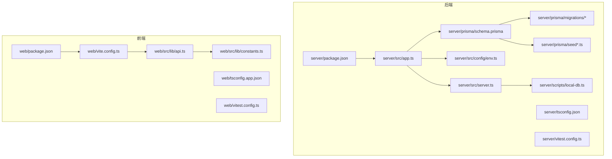
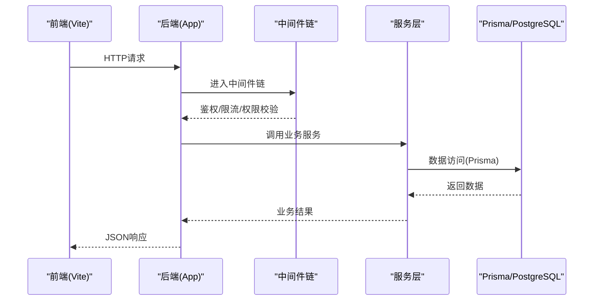
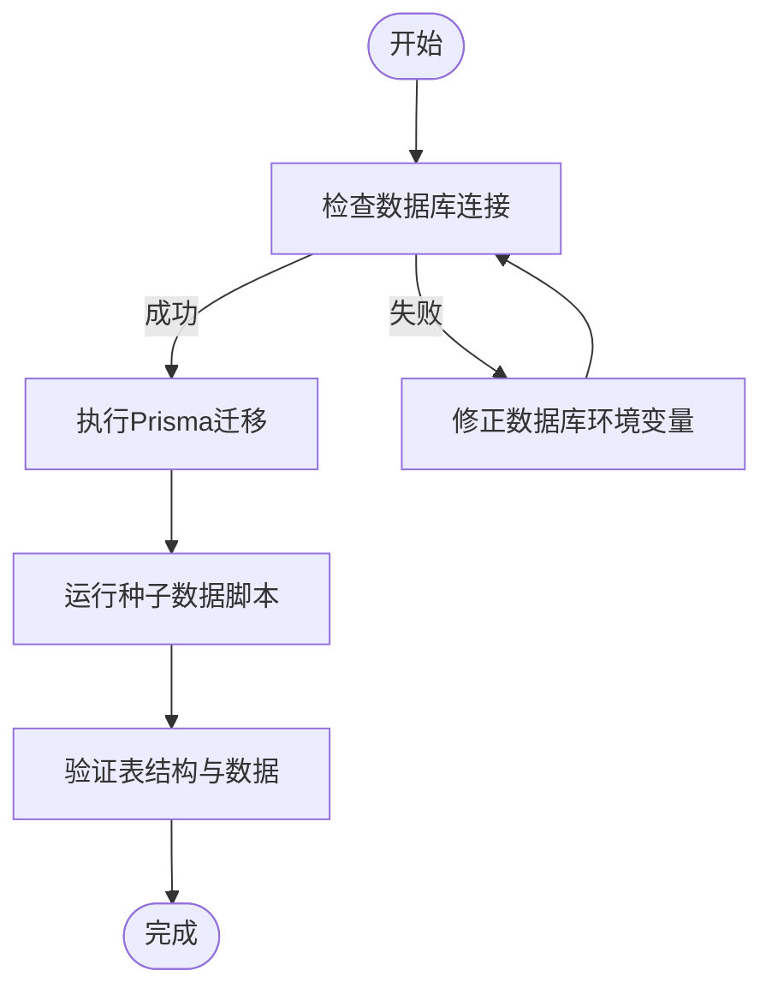
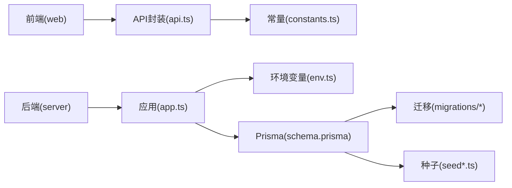

# 开发工作流

<cite>
**本文引用的文件**   
- [server/package.json](file://server/package.json)
- [server/tsconfig.json](file://server/tsconfig.json)
- [server/vitest.config.ts](file://server/vitest.config.ts)
- [server/src/config/env.ts](file://server/src/config/env.ts)
- [server/src/server.ts](file://server/src/server.ts)
- [server/src/app.ts](file://server/src/app.ts)
- [server/prisma/schema.prisma](file://server/prisma/schema.prisma)
- [server/prisma/migrations/20260722121714_init/migration.sql](file://server/prisma/migrations/20260722121714_init/migration.sql)
- [server/prisma/migrations/migration_lock.toml](file://server/prisma/migrations/migration_lock.toml)
- [server/prisma/seed.ts](file://server/prisma/seed.ts)
- [server/prisma/seed-companies.ts](file://server/prisma/seed-companies.ts)
- [server/prisma/seed-domain.ts](file://server/prisma/seed-domain.ts)
- [server/prisma/seed-data/subject-trees.ts](file://server/prisma/seed-data/subject-trees.ts)
- [server/scripts/local-db.ts](file://server/scripts/local-db.ts)
- [web/package.json](file://web/package.json)
- [web/vite.config.ts](file://web/vite.config.ts)
- [web/tsconfig.app.json](file://web/tsconfig.app.json)
- [web/vitest.config.ts](file://web/vitest.config.ts)
- [web/src/lib/api.ts](file://web/src/lib/api.ts)
- [web/src/lib/constants.ts](file://web/src/lib/constants.ts)
- [.gitignore](file://.gitignore)
</cite>

## 目录
1. [简介](#简介)
2. [项目结构](#项目结构)
3. [核心组件](#核心组件)
4. [架构总览](#架构总览)
5. [详细组件分析](#详细组件分析)
6. [依赖关系分析](#依赖关系分析)
7. [性能注意事项](#性能注意事项)
8. [故障排除指南](#故障排除指南)
9. [结论](#结论)
10. [附录](#附录)

## 简介
本文件面向FY200项目的开发者，提供从环境准备、依赖安装、数据库迁移与种子数据初始化，到分支策略、提交规范、本地开发调试、代码质量检查与常见问题的完整工作流说明。后端采用Express + Prisma + PostgreSQL，前端基于Vite + React（TypeScript），测试使用Vitest。中间件链遵循安全优先原则，计算类指标通过安全公式解析实现，AI能力采用双管道架构。

## 项目结构
- server：后端服务（Express + Prisma + TypeScript）
- web：前端应用（Vite + React + TypeScript）
- docs/.wiki：项目文档与参考
- .gitignore：版本控制忽略规则

图表来源
- [server/package.json](file://server/package.json)
- [server/tsconfig.json](file://server/tsconfig.json)
- [server/vitest.config.ts](file://server/vitest.config.ts)
- [server/src/config/env.ts](file://server/src/config/env.ts)
- [server/src/app.ts](file://server/src/app.ts)
- [server/src/server.ts](file://server/src/server.ts)
- [server/prisma/schema.prisma](file://server/prisma/schema.prisma)
- [server/prisma/migrations/20260722121714_init/migration.sql](file://server/prisma/migrations/20260722121714_init/migration.sql)
- [server/prisma/seed.ts](file://server/prisma/seed.ts)
- [server/scripts/local-db.ts](file://server/scripts/local-db.ts)
- [web/package.json](file://web/package.json)
- [web/vite.config.ts](file://web/vite.config.ts)
- [web/tsconfig.app.json](file://web/tsconfig.app.json)
- [web/vitest.config.ts](file://web/vitest.config.ts)
- [web/src/lib/api.ts](file://web/src/lib/api.ts)
- [web/src/lib/constants.ts](file://web/src/lib/constants.ts)

章节来源
- [server/package.json](file://server/package.json)
- [web/package.json](file://web/package.json)

## 核心组件
- 环境变量配置：集中管理数据库连接、JWT密钥、第三方API等敏感信息
- 应用启动：Express应用构建与中间件注册、路由挂载、错误处理
- 数据库层：Prisma Schema定义、迁移脚本、种子数据脚本
- 前后端通信：前端API封装与常量配置，统一请求行为

章节来源
- [server/src/config/env.ts](file://server/src/config/env.ts)
- [server/src/app.ts](file://server/src/app.ts)
- [server/src/server.ts](file://server/src/server.ts)
- [server/prisma/schema.prisma](file://server/prisma/schema.prisma)
- [server/prisma/seed.ts](file://server/prisma/seed.ts)
- [web/src/lib/api.ts](file://web/src/lib/api.ts)
- [web/src/lib/constants.ts](file://web/src/lib/constants.ts)

## 架构总览
后端中间件执行顺序为：helmet → cors → express.json → rate-limit → auth(JWT+黑名单) → permission(默认拒绝) → scope(Prisma extension) → softDelete → audit → Service → Prisma → PostgreSQL。AI能力采用双管道：polish（文本→脱敏→LLM→还原）与analyze（结构化→计算→脱敏→LLM→生成）。

图表来源
- [server/src/app.ts](file://server/src/app.ts)
- [server/src/server.ts](file://server/src/server.ts)
- [server/src/config/env.ts](file://server/src/config/env.ts)

## 详细组件分析

### 环境要求与依赖安装
- Node.js版本：请根据package.json中的engines或scripts推断所需版本；建议使用LTS版本以确保稳定性
- PostgreSQL：确保端口、用户名、密码、数据库名与环境变量一致
- 依赖安装：在后端与前端根目录分别执行包管理器命令安装依赖

章节来源
- [server/package.json](file://server/package.json)
- [web/package.json](file://web/package.json)

### 数据库初始化与迁移
- 初始化数据库：使用本地数据库脚本或外部PostgreSQL实例
- 运行迁移：执行Prisma迁移以创建/更新表结构
- 种子数据：运行种子脚本填充基础数据（公司、领域、科目树等）

图表来源
- [server/scripts/local-db.ts](file://server/scripts/local-db.ts)
- [server/prisma/schema.prisma](file://server/prisma/schema.prisma)
- [server/prisma/migrations/20260722121714_init/migration.sql](file://server/prisma/migrations/20260722121714_init/migration.sql)
- [server/prisma/seed.ts](file://server/prisma/seed.ts)
- [server/prisma/seed-companies.ts](file://server/prisma/seed-companies.ts)
- [server/prisma/seed-domain.ts](file://server/prisma/seed-domain.ts)
- [server/prisma/seed-data/subject-trees.ts](file://server/prisma/seed-data/subject-trees.ts)

章节来源
- [server/prisma/migrations/migration_lock.toml](file://server/prisma/migrations/migration_lock.toml)
- [server/prisma/schema.prisma](file://server/prisma/schema.prisma)
- [server/prisma/seed.ts](file://server/prisma/seed.ts)

### Git分支管理与提交规范
- 主分支保护：禁止直接推送至主分支，必须通过合并请求（MR/PR）并经过审查
- 功能分支命名：feature/模块-描述、fix/问题描述、refactor/重构说明
- 提交信息格式：类型(范围): 描述（如 feat(auth): 新增登录接口）

[本节为通用规范说明，不直接引用具体文件]

### 本地开发环境搭建
- 后端启动：安装依赖后，设置环境变量并启动开发服务器
- 前端启动：安装依赖后，启动Vite开发服务器
- 环境变量：在server与web目录下配置.env文件，包含数据库连接、JWT密钥、第三方API等
- 调试工具：使用浏览器开发者工具、日志输出、单元测试框架进行调试

章节来源
- [server/src/server.ts](file://server/src/server.ts)
- [server/src/app.ts](file://server/src/app.ts)
- [server/src/config/env.ts](file://server/src/config/env.ts)
- [web/vite.config.ts](file://web/vite.config.ts)
- [web/src/lib/api.ts](file://web/src/lib/api.ts)
- [web/src/lib/constants.ts](file://web/src/lib/constants.ts)

### 代码提交前检查流程
- ESLint验证：前端使用Oxlint或ESLint进行代码风格检查
- TypeScript编译检查：前后端分别执行类型检查
- 单元测试运行：使用Vitest运行后端与前端测试用例

章节来源
- [server/vitest.config.ts](file://server/vitest.config.ts)
- [web/vitest.config.ts](file://web/vitest.config.ts)
- [server/tsconfig.json](file://server/tsconfig.json)
- [web/tsconfig.app.json](file://web/tsconfig.app.json)

## 依赖关系分析
- 后端依赖：Express、Prisma、PostgreSQL驱动、JWT库、第三方AI API客户端
- 前端依赖：React、Vite、TypeScript、UI组件库、HTTP客户端
- 测试依赖：Vitest用于前后端单元测试与集成测试

图表来源
- [web/src/lib/api.ts](file://web/src/lib/api.ts)
- [web/src/lib/constants.ts](file://web/src/lib/constants.ts)
- [server/src/app.ts](file://server/src/app.ts)
- [server/src/config/env.ts](file://server/src/config/env.ts)
- [server/prisma/schema.prisma](file://server/prisma/schema.prisma)
- [server/prisma/migrations/20260722121714_init/migration.sql](file://server/prisma/migrations/20260722121714_init/migration.sql)
- [server/prisma/seed.ts](file://server/prisma/seed.ts)

章节来源
- [server/package.json](file://server/package.json)
- [web/package.json](file://web/package.json)

## 性能注意事项
- 数据库查询优化：合理使用Prisma关联查询，避免N+1问题
- 缓存策略：对热点数据实施缓存，减少数据库压力
- 异步处理：使用异步处理器提升并发能力
- 限流与降级：API层实施限流，防止恶意请求

[本节为通用性能建议，不直接引用具体文件]

## 故障排除指南
- 数据库连接失败：检查环境变量配置、PostgreSQL服务状态、防火墙设置
- 迁移失败：确认数据库版本兼容性、迁移脚本完整性
- 前端无法访问API：检查CORS配置、代理设置、网络连通性
- 测试失败：检查测试环境配置、依赖版本一致性

章节来源
- [server/src/config/env.ts](file://server/src/config/env.ts)
- [server/scripts/local-db.ts](file://server/scripts/local-db.ts)
- [web/src/lib/api.ts](file://web/src/lib/api.ts)

## 结论
本工作流文档提供了FY200项目从环境搭建到代码提交的完整指南。通过标准化的分支管理、代码检查和调试流程，确保团队协作效率与代码质量。建议团队成员严格遵守规范，定期更新文档以适应项目演进。

[本节为总结性内容，不直接引用具体文件]

## 附录
- 常用命令：列出前后端开发、测试、构建的常用命令
- 环境变量清单：详细说明各环境变量的作用与示例值
- 故障排查清单：提供常见问题与解决方案的快速参考

[本节为补充信息，不直接引用具体文件]