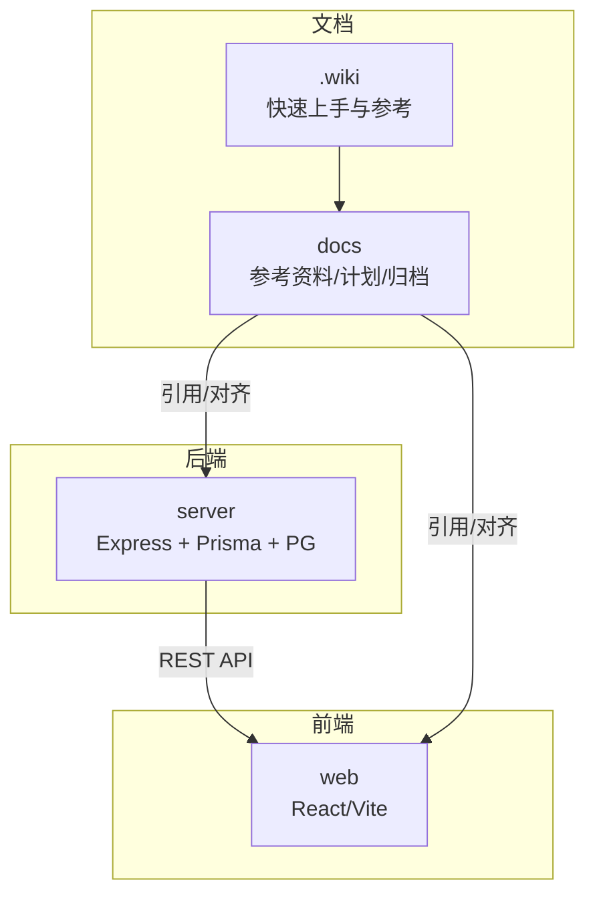
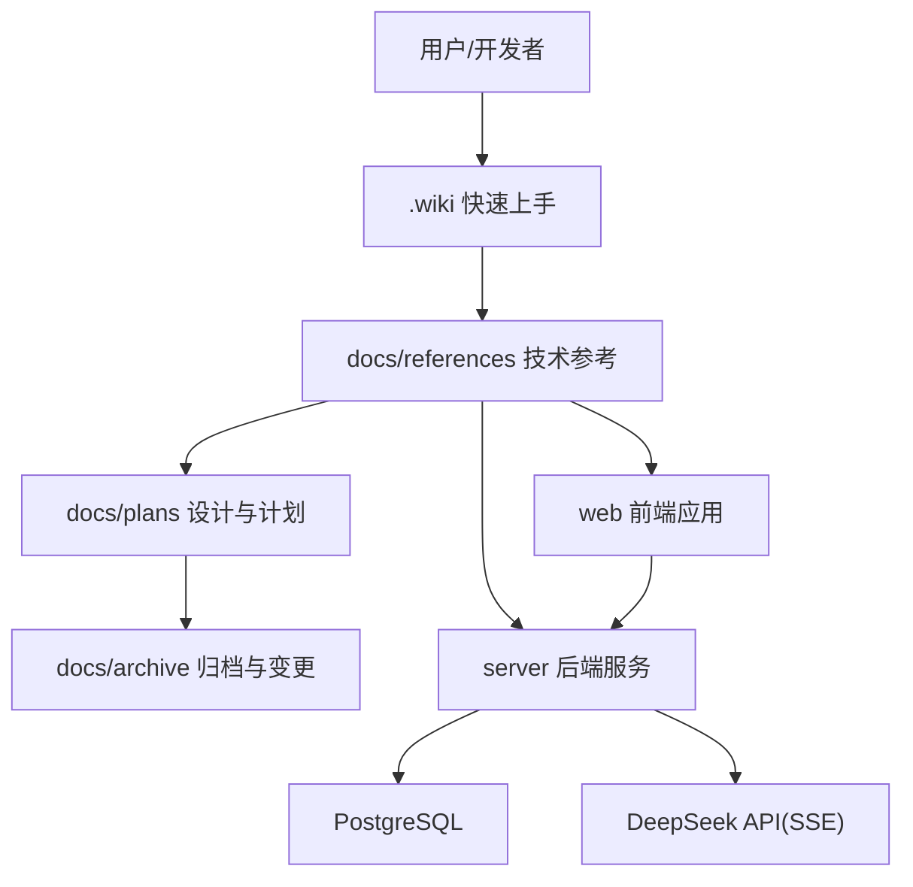
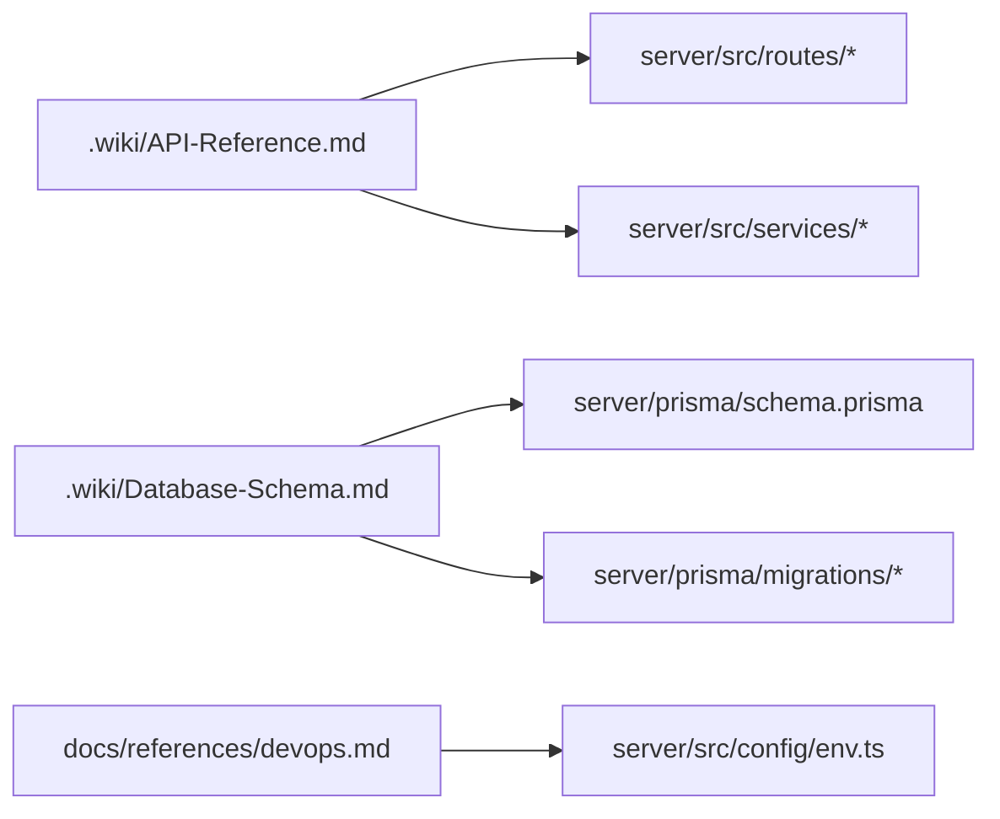
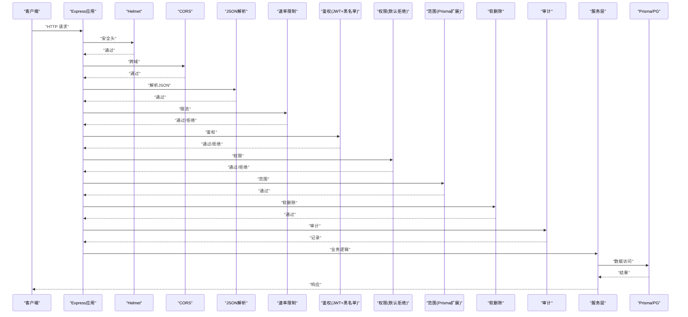
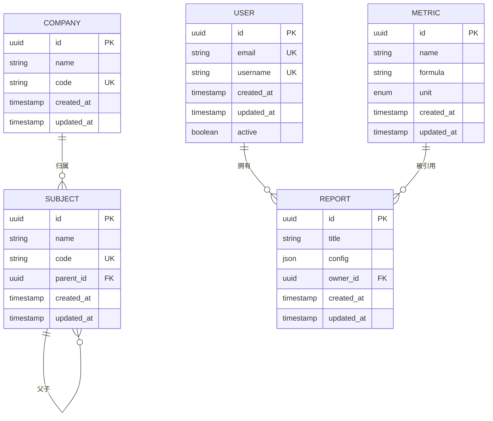
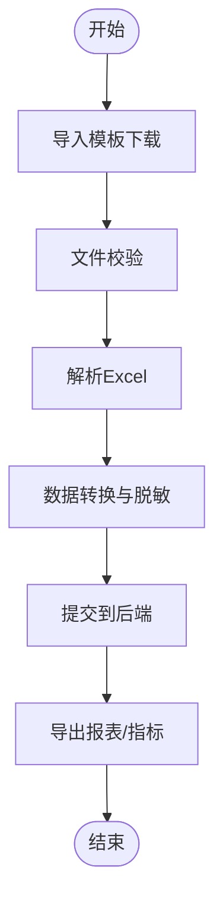

# 文档贡献

<cite>
**本文引用的文件**   
- [Getting-Started.md](file://.wiki/Getting-Started.md)
- [API-Reference.md](file://.wiki/API-Reference.md)
- [Database-Schema.md](file://.wiki/Database-Schema.md)
- [backend.md](file://docs/references/backend.md)
- [frontend.md](file://docs/references/frontend.md)
- [devops.md](file://docs/references/devops.md)
- [observability.md](file://docs/references/observability.md)
- [performance.md](file://docs/references/performance.md)
- [安全与权限规范.md](file://docs/plans/安全与权限规范.md)
- [数据模型规范.md](file://docs/plans/数据模型规范.md)
- [前端设计提案.md](file://docs/plans/frontend-design-proposal.md)
- [项目进度状态报告-2026-07-24.md](file://docs/项目进度状态报告-2026-07-24.md)
- [schema.prisma](file://server/prisma/schema.prisma)
- [app.ts](file://server/src/app.ts)
- [server.ts](file://server/src/server.ts)
- [auth.ts](file://server/src/middleware/auth.ts)
- [permission.ts](file://server/src/middleware/permission.ts)
- [scope.ts](file://server/src/middleware/scope.ts)
- [soft-delete.ts](file://server/src/middleware/soft-delete.ts)
- [audit.ts](file://server/src/middleware/audit.ts)
- [cors.ts](file://server/src/middleware/cors.ts)
- [helmet.ts](file://server/src/middleware/helmet.ts)
- [rate-limit.ts](file://server/src/middleware/rate-limit.ts)
- [ai-rate-limit.ts](file://server/src/middleware/ai-rate-limit.ts)
- [env.ts](file://server/src/config/env.ts)
- [api.ts](file://web/src/lib/api.ts)
- [constants.ts](file://web/src/lib/constants.ts)
- [import-template.ts](file://web/src/lib/import-template.ts)
- [export.ts](file://web/src/lib/export.ts)
- [report-export.ts](file://web/src/lib/report-export.ts)
</cite>

## 目录
1. [简介](#简介)
2. [项目结构](#项目结构)
3. [核心组件](#核心组件)
4. [架构总览](#架构总览)
5. [详细组件分析](#详细组件分析)
6. [依赖关系分析](#依赖关系分析)
7. [性能考虑](#性能考虑)
8. [故障排查指南](#故障排查指南)
9. [结论](#结论)
10. [附录](#附录)

## 简介
本指南面向所有参与 FY200 项目的文档贡献者，目标是统一文档结构与写作规范，明确审核流程、新增与更新方法，并覆盖多语言与国际化要求。FY200 为浙江壹品慧财年经营数据分析平台，定位“Excel进、看板/报表出”的内部管理口径财务数据平台，单位统一为万元/人民币。后端技术栈：Express 4 + Prisma 5 + PostgreSQL 15 + JWT（access 15min + refresh 7day 轮转）+ DeepSeek API（SSE 流式）。中间件执行链顺序：helmet → cors → express.json → rate-limit → auth(JWT+黑名单) → permission(默认拒绝) → scope(Prisma extension) → softDelete → audit → Service → Prisma → PostgreSQL。计算类指标使用安全公式解析（白名单算子 +-*/()，禁止 eval），同比/环比由后端实时计算不存库。AI 双管道架构：polish（文本→脱敏→LLM→还原）/ analyze（结构化→计算→脱敏→LLM→生成），脱敏规则：绝对金额→区间，公司名→动态映射。

## 项目结构
仓库采用前后端分离与文档分层组织：
- .wiki：Wiki 级快速上手与参考文档（Markdown）
- docs：项目级文档，包含参考资料、计划与归档
- server：后端服务（Express + Prisma + PostgreSQL）
- web：前端应用（React/Vite）

章节来源
- [.wiki/Getting-Started.md:1-200](file://.wiki/Getting-Started.md#L1-L200)
- [.wiki/API-Reference.md:1-200](file://.wiki/API-Reference.md#L1-L200)
- [.wiki/Database-Schema.md:1-200](file://.wiki/Database-Schema.md#L1-L200)
- [docs/references/backend.md:1-200](file://docs/references/backend.md#L1-L200)
- [docs/references/frontend.md:1-200](file://docs/references/frontend.md#L1-L200)
- [docs/references/devops.md:1-200](file://docs/references/devops.md#L1-L200)
- [docs/references/observability.md:1-200](file://docs/references/observability.md#L1-L200)
- [docs/references/performance.md:1-200](file://docs/references/performance.md#L1-L200)

## 核心组件
- 文档分类与存放位置
  - 技术文档：docs/references/*（后端、前端、DevOps、可观测性、性能等）
  - 用户手册：.wiki/*（快速上手、数据库模式、API 参考）
  - 设计与计划：docs/plans/*（安全与权限、数据模型、前端设计提案）
  - 归档与历史：docs/archive/*（版本快照、变更记录）
- 元数据与模板
  - 建议在每篇文档头部添加元数据块（标题、作者、日期、版本、状态、适用模块）
  - 模板字段建议：title, author, date, version, status, module, tags, related
- Markdown 语法标准
  - 标题层级：H1 仅用于页面主标题；H2/H3 用于章节与小节
  - 列表与表格：统一使用有序/无序列表；表格需含表头与对齐说明
  - 代码块：标注语言（如 text/json/sql/ts），避免内联长代码
  - 链接：内部链接相对路径，外部链接带 title；定期校验有效性
- 图表绘制要求
  - 架构图/流程图优先使用 Mermaid；保持节点命名简洁，避免样式定制
  - 时序图用于接口调用链；ER 图用于数据模型；状态图用于生命周期
- 代码示例格式
  - 示例需与当前版本一致，标注请求/响应样例、错误码与边界条件
  - 敏感信息必须脱敏（金额→区间，公司名→动态映射）

章节来源
- [docs/plans/安全与权限规范.md:1-200](file://docs/plans/安全与权限规范.md#L1-L200)
- [docs/plans/数据模型规范.md:1-200](file://docs/plans/数据模型规范.md#L1-L200)
- [docs/plans/frontend-design-proposal.md:1-200](file://docs/plans/frontend-design-proposal.md#L1-L200)

## 架构总览
FY200 的文档体系与系统架构相互映射：文档按“快速上手—参考—计划—归档”分层，对应系统的“入口—能力—设计—演进”。

图示来源
- [app.ts:1-200](file://server/src/app.ts#L1-L200)
- [server.ts:1-200](file://server/src/server.ts#L1-L200)
- [schema.prisma:1-200](file://server/prisma/schema.prisma#L1-L200)

章节来源
- [app.ts:1-200](file://server/src/app.ts#L1-L200)
- [server.ts:1-200](file://server/src/server.ts#L1-L200)

## 详细组件分析

### 文档分类与存放规范
- 技术文档（docs/references）
  - backend.md：后端架构、中间件链、路由与服务层约定
  - frontend.md：前端工程化、组件与数据流约定
  - devops.md：部署、环境、CI/CD、密钥管理
  - observability.md：日志、指标、追踪与告警
  - performance.md：性能基线、压测与优化策略
- 用户手册（.wiki）
  - Getting-Started.md：本地开发、首次运行、常用命令
  - API-Reference.md：接口清单、鉴权、错误码
  - Database-Schema.md：实体关系、字段说明、迁移策略
- 设计与计划（docs/plans）
  - 安全与权限规范：JWT、权限模型、范围控制、审计
  - 数据模型规范：领域模型、指标计算、公式规则
  - 前端设计提案：页面结构、交互规范、组件库约定
- 归档（docs/archive）
  - 版本快照、会议纪要、重大变更记录

章节来源
- [docs/references/backend.md:1-200](file://docs/references/backend.md#L1-L200)
- [docs/references/frontend.md:1-200](file://docs/references/frontend.md#L1-L200)
- [docs/references/devops.md:1-200](file://docs/references/devops.md#L1-L200)
- [docs/references/observability.md:1-200](file://docs/references/observability.md#L1-L200)
- [docs/references/performance.md:1-200](file://docs/references/performance.md#L1-L200)
- [.wiki/Getting-Started.md:1-200](file://.wiki/Getting-Started.md#L1-L200)
- [.wiki/API-Reference.md:1-200](file://.wiki/API-Reference.md#L1-L200)
- [.wiki/Database-Schema.md:1-200](file://.wiki/Database-Schema.md#L1-L200)
- [docs/plans/安全与权限规范.md:1-200](file://docs/plans/安全与权限规范.md#L1-L200)
- [docs/plans/数据模型规范.md:1-200](file://docs/plans/数据模型规范.md#L1-L200)
- [docs/plans/frontend-design-proposal.md:1-200](file://docs/plans/frontend-design-proposal.md#L1-L200)

### 文档写作规范
- Markdown 标准
  - 标题层级严格；段落不超过 6 行；列表缩进统一 2 空格
  - 图片与图表置于就近小节，附编号与说明
- 代码示例
  - 使用 fenced code block，标注语言；示例需可复现
  - 敏感信息一律脱敏；金额用区间表示；公司名用占位符
- 术语与风格
  - 统一术语表（如“指标/维度/范围/权限/审计”）
  - 动词先行、被动语态慎用；英文缩写首次出现给出全称

章节来源
- [docs/plans/安全与权限规范.md:1-200](file://docs/plans/安全与权限规范.md#L1-L200)
- [docs/plans/数据模型规范.md:1-200](file://docs/plans/数据模型规范.md#L1-L200)

### 文档审核流程
- 内容准确性检查
  - 接口定义与实现一致性校验（路由/参数/返回码）
  - 数据模型与迁移脚本一致性（字段类型/约束）
- 技术术语统一
  - 对照术语表；跨文档保持一致命名
- 链接有效性验证
  - 内部链接相对路径；外部链接定期巡检
- 审核清单
  - 元数据完整、版本号正确、截图/图表清晰、示例可运行

章节来源
- [docs/references/backend.md:1-200](file://docs/references/backend.md#L1-L200)
- [docs/references/frontend.md:1-200](file://docs/references/frontend.md#L1-L200)

### 新增文档创建流程
- 选择模板
  - 技术参考：参照 docs/references/*.md
  - 用户手册：参照 .wiki/*.md
  - 设计计划：参照 docs/plans/*.md
- 目录结构遵循
  - 新建文件放入对应目录；文件名小写、连字符分隔
- 元数据填写
  - 标题、作者、日期、版本、状态、模块、标签、关联文档
- 提交与评审
  - 分支命名规范；PR 描述包含变更点与影响面；至少一名技术负责人审阅

章节来源
- [docs/references/backend.md:1-200](file://docs/references/backend.md#L1-L200)
- [.wiki/Getting-Started.md:1-200](file://.wiki/Getting-Started.md#L1-L200)

### 现有文档更新方法
- 修改标记
  - 在变更处添加注释或修订标记；重大变更更新版本与日期
- 版本控制
  - 通过 Git 提交；PR 中附上 diff 摘要与影响评估
- 同步机制
  - 跨文档交叉引用需同步更新；必要时提供迁移指引

章节来源
- [docs/项目进度状态报告-2026-07-24.md:1-200](file://docs/项目进度状态报告-2026-07-24.md#L1-L200)

### 多语言与国际化
- 语言策略
  - 中文为主；英文作为可选翻译；README 与关键文档双语
- 文件组织
  - 同主题文档按语言分目录（如 /zh、/en）或后缀（_zh.md/_en.md）
- 内容一致性
  - 术语表双语对照；版本号与发布日期同步
- 自动化
  - CI 检查链接与拼写；构建时生成索引与导航

[本节为概念性说明，无需章节来源]

## 依赖关系分析
文档与代码的依赖关系体现在“接口契约、数据模型、运行时配置”三处：
- 接口契约：API-Reference.md 与 server/routes/*、services/* 保持一致
- 数据模型：Database-Schema.md 与 schema.prisma、migrations/* 保持一致
- 运行时配置：devops.md 与 server/src/config/env.ts 保持一致

图示来源
- [.wiki/API-Reference.md:1-200](file://.wiki/API-Reference.md#L1-L200)
- [schema.prisma:1-200](file://server/prisma/schema.prisma#L1-L200)
- [env.ts:1-200](file://server/src/config/env.ts#L1-L200)

章节来源
- [.wiki/API-Reference.md:1-200](file://.wiki/API-Reference.md#L1-L200)
- [.wiki/Database-Schema.md:1-200](file://.wiki/Database-Schema.md#L1-L200)
- [docs/references/devops.md:1-200](file://docs/references/devops.md#L1-L200)

## 性能考虑
- 文档性能相关条目应包含：
  - 基准指标与测试方法（QPS、延迟、资源占用）
  - 缓存与分页策略（接口与查询）
  - 大文件导入/导出优化（Excel 导入、报表导出）
  - AI 流式处理（SSE）与超时重试策略
- 建议配套压测脚本与结果归档至 docs/archive

[本节为通用指导，无需章节来源]

## 故障排查指南
- 常见问题定位
  - 鉴权失败：检查 JWT 配置、黑名单、权限与范围
  - 权限拒绝：确认 permission 默认拒绝策略与角色映射
  - 软删除冲突：确认 scope 扩展与软删除中间件顺序
  - 审计缺失：核对 audit 中间件是否生效
- 调试步骤
  - 启用 trace-id；查看中间件链日志；核对环境变量
  - 对比 API 参考与实际响应；校验数据库迁移状态

章节来源
- [auth.ts:1-200](file://server/src/middleware/auth.ts#L1-L200)
- [permission.ts:1-200](file://server/src/middleware/permission.ts#L1-L200)
- [scope.ts:1-200](file://server/src/middleware/scope.ts#L1-L200)
- [soft-delete.ts:1-200](file://server/src/middleware/soft-delete.ts#L1-L200)
- [audit.ts:1-200](file://server/src/middleware/audit.ts#L1-L200)
- [cors.ts:1-200](file://server/src/middleware/cors.ts#L1-L200)
- [helmet.ts:1-200](file://server/src/middleware/helmet.ts#L1-L200)
- [rate-limit.ts:1-200](file://server/src/middleware/rate-limit.ts#L1-L200)
- [ai-rate-limit.ts:1-200](file://server/src/middleware/ai-rate-limit.ts#L1-L200)
- [env.ts:1-200](file://server/src/config/env.ts#L1-L200)

## 结论
本指南明确了 FY200 文档的分类、存放、写作与审核规范，以及新增与更新流程和多语言支持策略。通过统一的文档体系与严格的审核机制，确保文档与代码、数据模型、运行时配置保持一致，提升团队协作效率与交付质量。

[本节为总结性内容，无需章节来源]

## 附录

### 中间件执行链与文档映射

图示来源
- [app.ts:1-200](file://server/src/app.ts#L1-L200)
- [server.ts:1-200](file://server/src/server.ts#L1-L200)
- [helmet.ts:1-200](file://server/src/middleware/helmet.ts#L1-L200)
- [cors.ts:1-200](file://server/src/middleware/cors.ts#L1-L200)
- [rate-limit.ts:1-200](file://server/src/middleware/rate-limit.ts#L1-L200)
- [auth.ts:1-200](file://server/src/middleware/auth.ts#L1-L200)
- [permission.ts:1-200](file://server/src/middleware/permission.ts#L1-L200)
- [scope.ts:1-200](file://server/src/middleware/scope.ts#L1-L200)
- [soft-delete.ts:1-200](file://server/src/middleware/soft-delete.ts#L1-L200)
- [audit.ts:1-200](file://server/src/middleware/audit.ts#L1-L200)

### 数据模型与文档对齐

图示来源
- [schema.prisma:1-200](file://server/prisma/schema.prisma#L1-L200)

### 前端导入导出与文档示例

图示来源
- [import-template.ts:1-200](file://web/src/lib/import-template.ts#L1-L200)
- [export.ts:1-200](file://web/src/lib/export.ts#L1-L200)
- [report-export.ts:1-200](file://web/src/lib/report-export.ts#L1-L200)