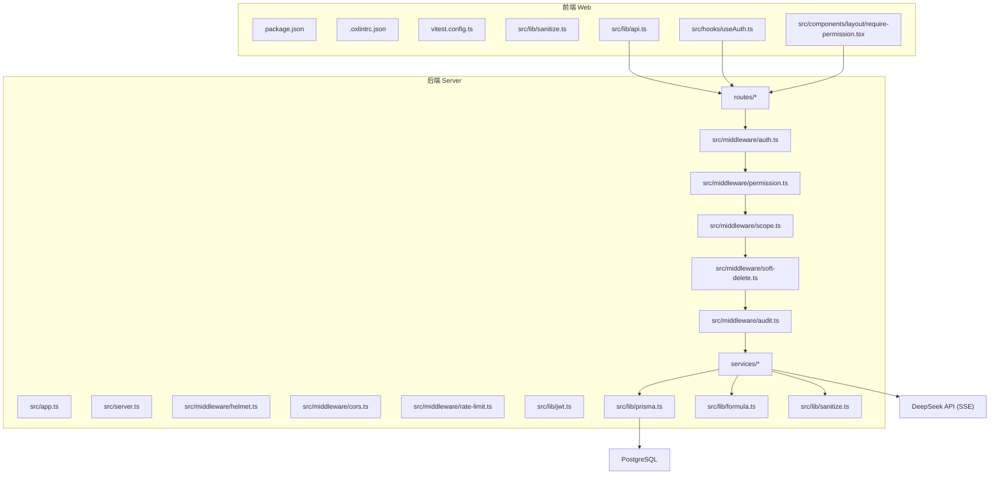
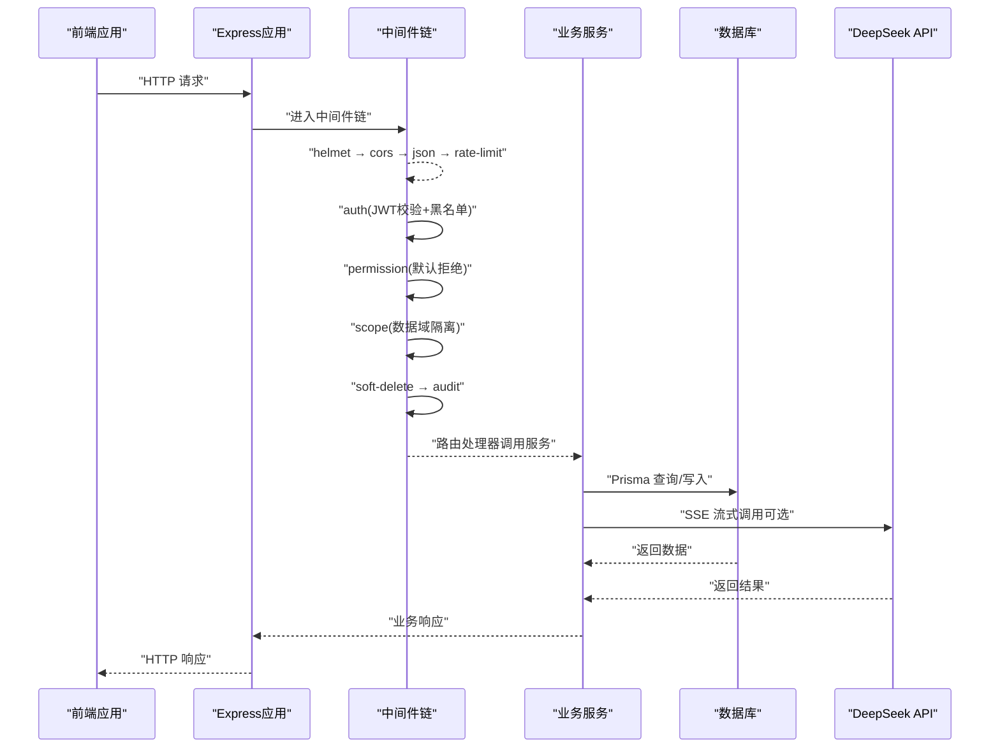
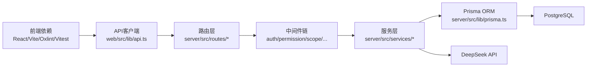

# 代码审查流程

<cite>
**本文引用的文件**   
- [server/src/app.ts](file://server/src/app.ts)
- [server/src/server.ts](file://server/src/server.ts)
- [server/src/middleware/auth.ts](file://server/src/middleware/auth.ts)
- [server/src/middleware/permission.ts](file://server/src/middleware/permission.ts)
- [server/src/middleware/scope.ts](file://server/src/middleware/scope.ts)
- [server/src/middleware/soft-delete.ts](file://server/src/middleware/soft-delete.ts)
- [server/src/middleware/audit.ts](file://server/src/middleware/audit.ts)
- [server/src/middleware/helmet.ts](file://server/src/middleware/helmet.ts)
- [server/src/middleware/cors.ts](file://server/src/middleware/cors.ts)
- [server/src/middleware/rate-limit.ts](file://server/src/middleware/rate-limit.ts)
- [server/src/lib/jwt.ts](file://server/src/lib/jwt.ts)
- [server/src/lib/errors.ts](file://server/src/lib/errors.ts)
- [server/src/lib/response.ts](file://server/src/lib/response.ts)
- [server/src/lib/prisma.ts](file://server/src/lib/prisma.ts)
- [server/src/lib/formula.ts](file://server/src/lib/formula.ts)
- [server/src/lib/sanitize.ts](file://server/src/lib/sanitize.ts)
- [server/src/lib/desensitize.test.ts](file://server/src/lib/desensitize.test.ts)
- [server/src/lib/prompt-guard.ts](file://server/src/lib/prompt-guard.ts)
- [server/src/services/AIProxyService.ts](file://server/src/services/AIProxyService.ts)
- [server/src/routes/auth.ts](file://server/src/routes/auth.ts)
- [server/src/routes/admin.ts](file://server/src/routes/admin.ts)
- [server/src/routes/data.ts](file://server/src/routes/data.ts)
- [server/src/routes/reports.ts](file://server/src/routes/reports.ts)
- [server/src/routes/dashboard.ts](file://server/src/routes/dashboard.ts)
- [server/src/routes/indicators.ts](file://server/src/routes/indicators.ts)
- [server/src/routes/ai.ts](file://server/src/routes/ai.ts)
- [web/package.json](file://web/package.json)
- [web/vitest.config.ts](file://web/vitest.config.ts)
- [web/.oxlintrc.json](file://web/.oxlintrc.json)
- [web/src/lib/sanitize.ts](file://web/src/lib/sanitize.ts)
- [web/src/lib/api.ts](file://web/src/lib/api.ts)
- [web/src/hooks/useAuth.ts](file://web/src/hooks/useAuth.ts)
- [web/src/components/layout/require-permission.tsx](file://web/src/components/layout/require-permission.tsx)
- [server/package.json](file://server/package.json)
- [server/tsconfig.json](file://server/tsconfig.json)
- [server/vitest.config.ts](file://server/vitest.config.ts)
- [server/prisma/schema.prisma](file://server/prisma/schema.prisma)
- [docs/plans/安全与权限规范.md](file://docs/plans/安全与权限规范.md)
</cite>

## 目录
1. [引言](#引言)
2. [项目结构](#项目结构)
3. [核心组件](#核心组件)
4. [架构总览](#架构总览)
5. [详细组件分析](#详细组件分析)
6. [依赖分析](#依赖分析)
7. [性能考量](#性能考量)
8. [故障排查指南](#故障排查指南)
9. [结论](#结论)
10. [附录](#附录)

## 引言
本指南面向FY200项目的Pull Request（PR）创建与代码审查，覆盖分支命名、提交信息、变更范围控制、自动化检查清单、人工审查要点、反馈处理流程与安全审查重点。项目定位为“Excel进、看板/报表出”的内部管理口径财务数据平台，后端采用Express 4 + Prisma 5 + PostgreSQL 15 + JWT + DeepSeek API（SSE流式），中间件执行链顺序固定，计算类指标使用安全公式解析，AI双管道架构包含脱敏与还原流程。

## 项目结构
- 前端：React/Vite + TypeScript，使用Oxlint进行静态检查，Vitest进行单元测试。
- 后端：Express 4 + Prisma ORM + PostgreSQL，JWT鉴权与权限控制，中间件链严格顺序。
- 数据库：Prisma迁移与种子脚本，审计与软删除策略。
- 文档：计划与规范文档集中存放于docs目录。

**图示来源** 
- [server/src/app.ts](file://server/src/app.ts)
- [server/src/server.ts](file://server/src/server.ts)
- [server/src/middleware/auth.ts](file://server/src/middleware/auth.ts)
- [server/src/middleware/permission.ts](file://server/src/middleware/permission.ts)
- [server/src/middleware/scope.ts](file://server/src/middleware/scope.ts)
- [server/src/middleware/soft-delete.ts](file://server/src/middleware/soft-delete.ts)
- [server/src/middleware/audit.ts](file://server/src/middleware/audit.ts)
- [server/src/middleware/helmet.ts](file://server/src/middleware/helmet.ts)
- [server/src/middleware/cors.ts](file://server/src/middleware/cors.ts)
- [server/src/middleware/rate-limit.ts](file://server/src/middleware/rate-limit.ts)
- [server/src/lib/jwt.ts](file://server/src/lib/jwt.ts)
- [server/src/lib/prisma.ts](file://server/src/lib/prisma.ts)
- [server/src/lib/formula.ts](file://server/src/lib/formula.ts)
- [server/src/lib/sanitize.ts](file://server/src/lib/sanitize.ts)
- [web/package.json](file://web/package.json)
- [web/.oxlintrc.json](file://web/.oxlintrc.json)
- [web/vitest.config.ts](file://web/vitest.config.ts)
- [web/src/lib/sanitize.ts](file://web/src/lib/sanitize.ts)
- [web/src/lib/api.ts](file://web/src/lib/api.ts)
- [web/src/hooks/useAuth.ts](file://web/src/hooks/useAuth.ts)
- [web/src/components/layout/require-permission.tsx](file://web/src/components/layout/require-permission.tsx)

**章节来源**
- [server/src/app.ts](file://server/src/app.ts)
- [server/src/server.ts](file://server/src/server.ts)
- [web/package.json](file://web/package.json)
- [web/.oxlintrc.json](file://web/.oxlintrc.json)
- [web/vitest.config.ts](file://web/vitest.config.ts)

## 核心组件
- 中间件链：helmet → cors → express.json → rate-limit → auth(JWT+黑名单) → permission(默认拒绝) → scope(Prisma扩展) → softDelete → audit → Service → Prisma → PostgreSQL。
- 鉴权与授权：JWT access/refresh轮转，权限模型默认拒绝，基于scope的数据隔离。
- 数据安全：敏感数据脱敏、XSS防护、SQL注入防护（参数化查询）。
- 计算与AI：安全公式解析（白名单算子）、同比环比实时计算；AI双管道（polish/analyze）含脱敏与还原。

**章节来源**
- [server/src/middleware/auth.ts](file://server/src/middleware/auth.ts)
- [server/src/middleware/permission.ts](file://server/src/middleware/permission.ts)
- [server/src/middleware/scope.ts](file://server/src/middleware/scope.ts)
- [server/src/middleware/soft-delete.ts](file://server/src/middleware/soft-delete.ts)
- [server/src/middleware/audit.ts](file://server/src/middleware/audit.ts)
- [server/src/lib/jwt.ts](file://server/src/lib/jwt.ts)
- [server/src/lib/formula.ts](file://server/src/lib/formula.ts)
- [server/src/lib/sanitize.ts](file://server/src/lib/sanitize.ts)
- [server/src/services/AIProxyService.ts](file://server/src/services/AIProxyService.ts)

## 架构总览
下图展示从前端请求到后端服务处理的完整调用链，体现中间件顺序、权限控制、数据访问与AI交互。

**图示来源** 
- [server/src/app.ts](file://server/src/app.ts)
- [server/src/middleware/auth.ts](file://server/src/middleware/auth.ts)
- [server/src/middleware/permission.ts](file://server/src/middleware/permission.ts)
- [server/src/middleware/scope.ts](file://server/src/middleware/scope.ts)
- [server/src/middleware/soft-delete.ts](file://server/src/middleware/soft-delete.ts)
- [server/src/middleware/audit.ts](file://server/src/middleware/audit.ts)
- [server/src/lib/prisma.ts](file://server/src/lib/prisma.ts)
- [server/src/services/AIProxyService.ts](file://server/src/services/AIProxyService.ts)

## 详细组件分析

### Pull Request 创建规范
- 分支命名约定
  - 功能分支：feature/<模块>-<描述>，如 feature/data-import-formula
  - 修复分支：fix/<问题编号或描述>，如 fix/auth-blacklist-refresh
  - 发布分支：release/<版本号>，如 release/v1.2.0
  - 热修复分支：hotfix/<紧急描述>，如 hotfix/xss-sanitizer
- 提交信息格式
  - 类型前缀：feat、fix、docs、style、refactor、test、chore、perf、security
  - 主题行不超过50字符，正文说明动机与影响，关联Issue编号
  - 示例路径参考：[server/src/middleware/auth.ts](file://server/src/middleware/auth.ts)、[web/src/lib/sanitize.ts](file://web/src/lib/sanitize.ts)
- 变更范围控制
  - 单PR聚焦单一职责，避免混合改动
  - 大变更拆分为多个小PR，便于审查与回滚
  - 前后端接口变更需同步更新契约与测试

**章节来源**
- [server/src/middleware/auth.ts](file://server/src/middleware/auth.ts)
- [web/src/lib/sanitize.ts](file://web/src/lib/sanitize.ts)

### 自动化审查工具与检查清单
- ESLint/Oxlint静态检查
  - 配置位置：[web/.oxlintrc.json](file://web/.oxlintrc.json)
  - 规则建议：禁止eval、强制类型注解、限制console输出
- TypeScript类型检查
  - 配置位置：[server/tsconfig.json](file://server/tsconfig.json)、[web/tsconfig.app.json](file://web/tsconfig.app.json)
  - 建议开启strict模式，避免any滥用
- 依赖包安全检查
  - 后端：[server/package.json](file://server/package.json)
  - 前端：[web/package.json](file://web/package.json)
  - 建议使用npm audit或SCA工具定期扫描
- 单元测试与集成测试
  - 前端：[web/vitest.config.ts](file://web/vitest.config.ts)
  - 后端：[server/vitest.config.ts](file://server/vitest.config.ts)
  - 关键用例：鉴权、权限、数据隔离、软删除、审计日志

**章节来源**
- [web/.oxlintrc.json](file://web/.oxlintrc.json)
- [server/tsconfig.json](file://server/tsconfig.json)
- [web/tsconfig.app.json](file://web/tsconfig.app.json)
- [server/package.json](file://server/package.json)
- [web/package.json](file://web/package.json)
- [web/vitest.config.ts](file://web/vitest.config.ts)
- [server/vitest.config.ts](file://server/vitest.config.ts)

### 人工审查要点
- 架构合理性
  - 中间件顺序是否符合规范，是否存在循环依赖
  - 路由与服务分层是否清晰，职责是否单一
- 业务逻辑正确性
  - 公式解析是否仅使用白名单算子，禁止eval
  - 同比/环比计算是否正确，不存库且实时计算
- 用户体验考量
  - 前端错误提示友好，加载状态明确
  - 权限不足时给出合理引导
- 可维护性评估
  - 代码可读性、注释完整性、函数粒度适中
  - 测试覆盖率与边界条件覆盖

**章节来源**
- [server/src/lib/formula.ts](file://server/src/lib/formula.ts)
- [server/src/middleware/auth.ts](file://server/src/middleware/auth.ts)
- [server/src/middleware/permission.ts](file://server/src/middleware/permission.ts)
- [web/src/lib/sanitize.ts](file://web/src/lib/sanitize.ts)

### 审查反馈处理流程
- 意见分类
  - 阻塞项：安全漏洞、严重Bug、违反规范
  - 建议项：性能优化、可读性改进、测试补充
- 修改优先级
  - 阻塞项必须立即修复并重新审查
  - 建议项可在下一迭代处理
- 合并标准
  - 所有阻塞项已解决
  - 自动化检查通过（Lint、TypeScript、测试）
  - 至少一名核心成员批准

**章节来源**
- [server/src/lib/errors.ts](file://server/src/lib/errors.ts)
- [server/src/lib/response.ts](file://server/src/lib/response.ts)

### 安全审查重点
- SQL注入防护
  - 使用Prisma参数化查询，禁止字符串拼接
  - 审查自定义SQL片段与动态过滤
- XSS攻击防护
  - 前端输入清洗：[web/src/lib/sanitize.ts](file://web/src/lib/sanitize.ts)
  - 后端输出净化：[server/src/lib/sanitize.ts](file://server/src/lib/sanitize.ts)
- 敏感数据处理
  - 脱敏规则：绝对金额→区间，公司名→动态映射
  - AI管道：polish（文本→脱敏→LLM→还原）、analyze（结构化→计算→脱敏→LLM→生成）
  - 参考实现：[server/src/lib/desensitize.test.ts](file://server/src/lib/desensitize.test.ts)、[server/src/lib/prompt-guard.ts](file://server/src/lib/prompt-guard.ts)
- 鉴权与授权
  - JWT access/refresh轮转，黑名单机制
  - 权限模型默认拒绝，最小权限原则
  - 数据域隔离（scope）确保越权访问防护

**章节来源**
- [server/src/lib/sanitize.ts](file://server/src/lib/sanitize.ts)
- [web/src/lib/sanitize.ts](file://web/src/lib/sanitize.ts)
- [server/src/lib/desensitize.test.ts](file://server/src/lib/desensitize.test.ts)
- [server/src/lib/prompt-guard.ts](file://server/src/lib/prompt-guard.ts)
- [server/src/lib/jwt.ts](file://server/src/lib/jwt.ts)
- [server/src/middleware/auth.ts](file://server/src/middleware/auth.ts)
- [server/src/middleware/permission.ts](file://server/src/middleware/permission.ts)
- [server/src/middleware/scope.ts](file://server/src/middleware/scope.ts)

## 依赖分析
- 前端依赖
  - React生态、Vite构建、Oxlint静态检查、Vitest测试
- 后端依赖
  - Express框架、Prisma ORM、PostgreSQL驱动、JWT库、DeepSeek SDK
- 关键依赖关系图

**图示来源** 
- [web/package.json](file://web/package.json)
- [web/src/lib/api.ts](file://web/src/lib/api.ts)
- [server/src/routes/auth.ts](file://server/src/routes/auth.ts)
- [server/src/routes/admin.ts](file://server/src/routes/admin.ts)
- [server/src/routes/data.ts](file://server/src/routes/data.ts)
- [server/src/routes/reports.ts](file://server/src/routes/reports.ts)
- [server/src/routes/dashboard.ts](file://server/src/routes/dashboard.ts)
- [server/src/routes/indicators.ts](file://server/src/routes/indicators.ts)
- [server/src/routes/ai.ts](file://server/src/routes/ai.ts)
- [server/src/lib/prisma.ts](file://server/src/lib/prisma.ts)
- [server/package.json](file://server/package.json)

**章节来源**
- [web/package.json](file://web/package.json)
- [server/package.json](file://server/package.json)
- [web/src/lib/api.ts](file://web/src/lib/api.ts)
- [server/src/lib/prisma.ts](file://server/src/lib/prisma.ts)

## 性能考量
- 数据库查询优化
  - 合理使用索引，避免N+1查询
  - 分页与限流保护后端资源
- 缓存策略
  - 热点数据缓存（如指标聚合结果）
  - 前端请求去抖与节流
- AI调用优化
  - SSE流式响应减少首屏延迟
  - 批量请求与重试机制
- 内存与CPU使用
  - 避免大对象在内存中长时间驻留
  - 公式解析与计算复杂度控制

[本节为通用指导，无需特定文件引用]

## 故障排查指南
- 常见问题定位
  - 鉴权失败：检查JWT签名、过期时间、黑名单
  - 权限拒绝：确认权限配置与角色映射
  - 数据隔离异常：验证scope参数传递
  - 软删除问题：检查查询是否包含deletedAt过滤
- 日志与监控
  - 启用审计日志记录关键操作
  - 错误统一处理与上报
- 调试技巧
  - 使用trace-id追踪请求链路
  - 本地复现与断点调试

**章节来源**
- [server/src/middleware/audit.ts](file://server/src/middleware/audit.ts)
- [server/src/middleware/error-handler.ts](file://server/src/middleware/error-handler.ts)
- [server/src/middleware/trace-id.ts](file://server/src/middleware/trace-id.ts)
- [server/src/lib/errors.ts](file://server/src/lib/errors.ts)

## 结论
本指南提供了FY200项目完整的代码审查流程，涵盖PR规范、自动化检查、人工审查要点、反馈处理与安全审查重点。遵循本指南可有效提升代码质量、安全性与可维护性，保障项目稳定交付。

[本节为总结性内容，无需特定文件引用]

## 附录
- 相关规范文档
  - [安全与权限规范](file://docs/plans/安全与权限规范.md)
- 数据库Schema
  - [Prisma Schema](file://server/prisma/schema.prisma)
- 关键路由与服务
  - [认证路由](file://server/src/routes/auth.ts)
  - [管理员路由](file://server/src/routes/admin.ts)
  - [数据路由](file://server/src/routes/data.ts)
  - [报表路由](file://server/src/routes/reports.ts)
  - [仪表盘路由](file://server/src/routes/dashboard.ts)
  - [指标路由](file://server/src/routes/indicators.ts)
  - [AI路由](file://server/src/routes/ai.ts)

**章节来源**
- [docs/plans/安全与权限规范.md](file://docs/plans/安全与权限规范.md)
- [server/prisma/schema.prisma](file://server/prisma/schema.prisma)
- [server/src/routes/auth.ts](file://server/src/routes/auth.ts)
- [server/src/routes/admin.ts](file://server/src/routes/admin.ts)
- [server/src/routes/data.ts](file://server/src/routes/data.ts)
- [server/src/routes/reports.ts](file://server/src/routes/reports.ts)
- [server/src/routes/dashboard.ts](file://server/src/routes/dashboard.ts)
- [server/src/routes/indicators.ts](file://server/src/routes/indicators.ts)
- [server/src/routes/ai.ts](file://server/src/routes/ai.ts)