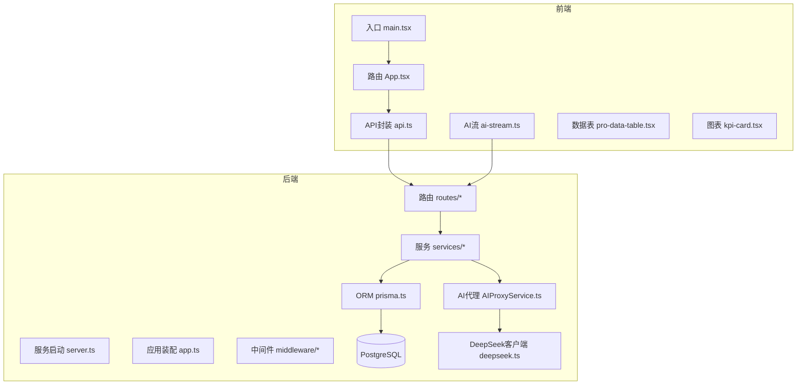
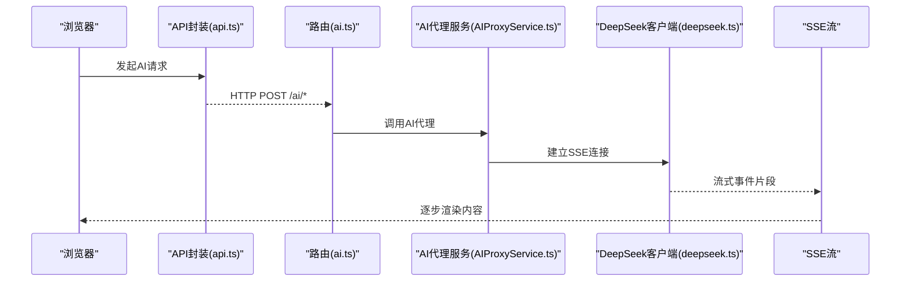
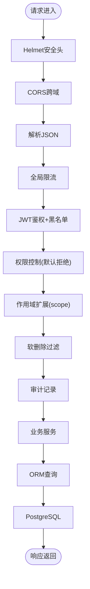
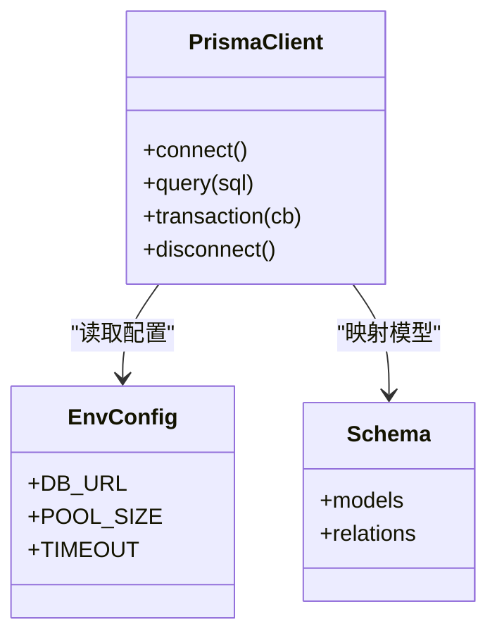
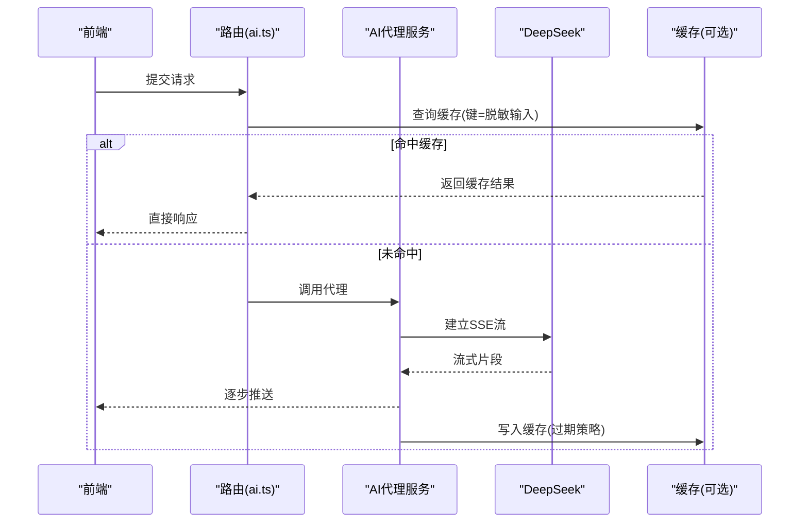
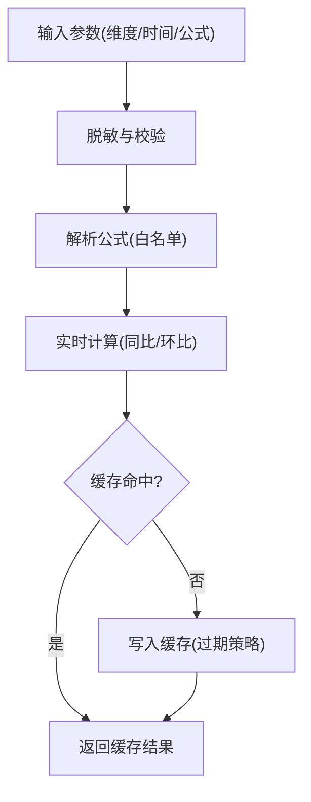
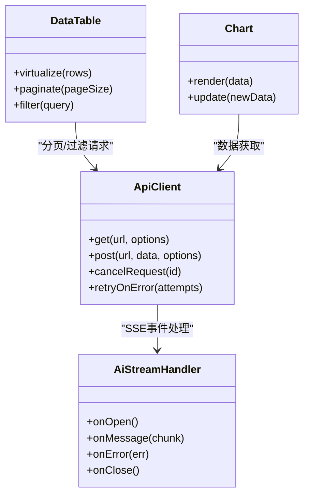
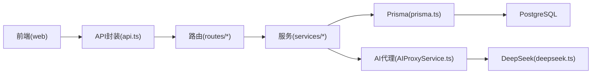

# 性能优化指导

<cite>
**本文引用的文件**   
- [server/src/app.ts](file://server/src/app.ts)
- [server/src/server.ts](file://server/src/server.ts)
- [server/src/config/env.ts](file://server/src/config/env.ts)
- [server/src/lib/prisma.ts](file://server/src/lib/prisma.ts)
- [server/src/middleware/rate-limit.ts](file://server/src/middleware/rate-limit.ts)
- [server/src/middleware/ai-rate-limit.ts](file://server/src/middleware/ai-rate-limit.ts)
- [server/src/middleware/auth.ts](file://server/src/middleware/auth.ts)
- [server/src/middleware/scope.ts](file://server/src/middleware/scope.ts)
- [server/src/middleware/error-handler.ts](file://server/src/middleware/error-handler.ts)
- [server/src/middleware/trace-id.ts](file://server/src/middleware/trace-id.ts)
- [server/src/services/AIProxyService.ts](file://server/src/services/AIProxyService.ts)
- [server/src/routes/ai.ts](file://server/src/routes/ai.ts)
- [server/src/lib/deepseek.ts](file://server/src/lib/deepseek.ts)
- [server/src/lib/formula.ts](file://server/src/lib/formula.ts)
- [server/src/lib/logger.ts](file://server/src/lib/logger.ts)
- [server/src/lib/response.ts](file://server/src/lib/response.ts)
- [server/prisma/schema.prisma](file://server/prisma/schema.prisma)
- [web/src/main.tsx](file://web/src/main.tsx)
- [web/src/App.tsx](file://web/src/App.tsx)
- [web/vite.config.ts](file://web/vite.config.ts)
- [web/src/lib/api.ts](file://web/src/lib/api.ts)
- [web/src/lib/ai-stream.ts](file://web/src/lib/ai-stream.ts)
- [web/src/components/data-table/pro-data-table.tsx](file://web/src/components/data-table/pro-data-table.tsx)
- [web/src/components/charts/kpi-card.tsx](file://web/src/components/charts/kpi-card.tsx)
- [web/src/hooks/api-queries.ts](file://web/src/hooks/api-queries.ts)
</cite>

## 目录
1. [简介](#简介)
2. [项目结构](#项目结构)
3. [核心组件](#核心组件)
4. [架构总览](#架构总览)
5. [详细组件分析](#详细组件分析)
6. [依赖关系分析](#依赖关系分析)
7. [性能考量](#性能考量)
8. [故障排查指南](#故障排查指南)
9. [结论](#结论)
10. [附录](#附录)

## 简介
本指导面向FY200项目的后端与前端性能优化，覆盖数据库查询与索引、连接池配置、内存管理、前端懒加载与渲染优化、网络请求优化、缓存策略（Redis、浏览器、API响应、公式结果）、监控指标（APM、错误率、响应时间、资源使用）、性能测试方法（压力/负载/并发/瓶颈定位），以及AI功能性能优化（LLM调用优化、流式传输优化、缓存设计）。文档基于仓库现有实现进行提炼与扩展建议，确保可落地执行。

## 项目结构
FY200采用前后端分离：
- 后端：Express + Prisma + PostgreSQL，中间件链包含安全、鉴权、限流、审计等；AI通过SSE流式调用DeepSeek。
- 前端：React + Vite，提供数据表格、图表、权限控制、API封装与AI流式处理。

**图示来源** 
- [server/src/server.ts](file://server/src/server.ts)
- [server/src/app.ts](file://server/src/app.ts)
- [web/src/main.tsx](file://web/src/main.tsx)
- [web/src/App.tsx](file://web/src/App.tsx)
- [web/src/lib/api.ts](file://web/src/lib/api.ts)
- [web/src/lib/ai-stream.ts](file://web/src/lib/ai-stream.ts)

**章节来源**
- [server/src/server.ts](file://server/src/server.ts)
- [server/src/app.ts](file://server/src/app.ts)
- [web/src/main.tsx](file://web/src/main.tsx)
- [web/src/App.tsx](file://web/src/App.tsx)

## 核心组件
- 中间件链：helmet → cors → express.json → rate-limit → auth(JWT+黑名单) → permission(默认拒绝) → scope(Prisma extension) → softDelete → audit → Service → Prisma → PostgreSQL。该顺序对性能与安全至关重要，需避免在鉴权前执行重计算或IO。
- 数据库层：Prisma ORM + PostgreSQL，建议结合索引设计与查询计划分析。
- AI管道：polish（文本→脱敏→LLM→还原）/ analyze（结构化→计算→脱敏→LLM→生成），支持SSE流式返回。
- 前端：Vite构建、按需加载、表格虚拟化、图表按需渲染、API统一封装与重试/去抖。

**章节来源**
- [server/src/app.ts](file://server/src/app.ts)
- [server/src/middleware/rate-limit.ts](file://server/src/middleware/rate-limit.ts)
- [server/src/middleware/auth.ts](file://server/src/middleware/auth.ts)
- [server/src/middleware/scope.ts](file://server/src/middleware/scope.ts)
- [server/src/lib/prisma.ts](file://server/src/lib/prisma.ts)
- [server/src/services/AIProxyService.ts](file://server/src/services/AIProxyService.ts)
- [server/src/lib/deepseek.ts](file://server/src/lib/deepseek.ts)
- [web/src/lib/api.ts](file://web/src/lib/api.ts)
- [web/src/lib/ai-stream.ts](file://web/src/lib/ai-stream.ts)

## 架构总览
后端以Express为HTTP入口，按中间件链处理请求，进入路由与服务层，最终通过Prisma访问PostgreSQL。AI请求经AIProxyService转发至DeepSeek，并采用SSE流式输出。前端通过api.ts发起REST请求，AI流通过ai-stream.ts处理SSE事件。

**图示来源** 
- [web/src/lib/api.ts](file://web/src/lib/api.ts)
- [server/src/routes/ai.ts](file://server/src/routes/ai.ts)
- [server/src/services/AIProxyService.ts](file://server/src/services/AIProxyService.ts)
- [server/src/lib/deepseek.ts](file://server/src/lib/deepseek.ts)

## 详细组件分析

### 后端中间件与请求链路
- 限流：全局rate-limit与AI专用ai-rate-limit，保护后端与外部API成本。
- 鉴权：JWT校验与黑名单检查，短access令牌提升安全性。
- 作用域：scope扩展限制数据可见范围，减少不必要的数据扫描。
- 审计与追踪：audit记录操作，trace-id贯穿日志便于问题定位。

**图示来源** 
- [server/src/app.ts](file://server/src/app.ts)
- [server/src/middleware/rate-limit.ts](file://server/src/middleware/rate-limit.ts)
- [server/src/middleware/ai-rate-limit.ts](file://server/src/middleware/ai-rate-limit.ts)
- [server/src/middleware/auth.ts](file://server/src/middleware/auth.ts)
- [server/src/middleware/scope.ts](file://server/src/middleware/scope.ts)
- [server/src/middleware/soft-delete.ts](file://server/src/middleware/soft-delete.ts)
- [server/src/middleware/audit.ts](file://server/src/middleware/audit.ts)
- [server/src/middleware/trace-id.ts](file://server/src/middleware/trace-id.ts)

**章节来源**
- [server/src/app.ts](file://server/src/app.ts)
- [server/src/middleware/rate-limit.ts](file://server/src/middleware/rate-limit.ts)
- [server/src/middleware/ai-rate-limit.ts](file://server/src/middleware/ai-rate-limit.ts)
- [server/src/middleware/auth.ts](file://server/src/middleware/auth.ts)
- [server/src/middleware/scope.ts](file://server/src/middleware/scope.ts)
- [server/src/middleware/soft-delete.ts](file://server/src/middleware/soft-delete.ts)
- [server/src/middleware/audit.ts](file://server/src/middleware/audit.ts)
- [server/src/middleware/trace-id.ts](file://server/src/middleware/trace-id.ts)

### 数据库与ORM层
- Prisma连接池：通过环境变量配置连接数、超时、空闲回收等，避免连接泄漏与高并发阻塞。
- 查询优化：优先使用select字段投影、where条件命中索引、避免N+1查询、分页与游标优化。
- 索引设计：根据高频查询条件创建复合索引，关注排序与分组列，定期分析慢查询。

**图示来源** 
- [server/src/lib/prisma.ts](file://server/src/lib/prisma.ts)
- [server/src/config/env.ts](file://server/src/config/env.ts)
- [server/prisma/schema.prisma](file://server/prisma/schema.prisma)

**章节来源**
- [server/src/lib/prisma.ts](file://server/src/lib/prisma.ts)
- [server/src/config/env.ts](file://server/src/config/env.ts)
- [server/prisma/schema.prisma](file://server/prisma/schema.prisma)

### AI代理与流式传输
- AI双管道：polish与analyze流程中，脱敏规则将绝对金额转为区间、公司名动态映射，降低敏感信息泄露风险。
- 流式传输：SSE分片返回，前端逐步渲染，提升用户体验与感知速度。
- 缓存策略：对相同输入（脱敏后）的LLM结果进行缓存，减少重复调用与成本。

**图示来源** 
- [server/src/routes/ai.ts](file://server/src/routes/ai.ts)
- [server/src/services/AIProxyService.ts](file://server/src/services/AIProxyService.ts)
- [server/src/lib/deepseek.ts](file://server/src/lib/deepseek.ts)

**章节来源**
- [server/src/routes/ai.ts](file://server/src/routes/ai.ts)
- [server/src/services/AIProxyService.ts](file://server/src/services/AIProxyService.ts)
- [server/src/lib/deepseek.ts](file://server/src/lib/deepseek.ts)

### 公式计算与结果缓存
- 安全公式解析：白名单算子（加减乘除括号），禁止eval，保障执行安全。
- 实时计算：同比/环比由后端实时计算，不持久化，保证口径一致。
- 结果缓存：对稳定输入（维度、时间窗口、公式）的结果进行缓存，缩短响应时间。

**图示来源** 
- [server/src/lib/formula.ts](file://server/src/lib/formula.ts)

**章节来源**
- [server/src/lib/formula.ts](file://server/src/lib/formula.ts)

### 前端性能优化
- 组件懒加载：路由级与组件级按需加载，减少首屏体积。
- 图片优化：使用现代格式、尺寸适配、懒加载与CDN。
- 网络请求优化：统一api.ts封装，支持重试、去抖、取消、分页与缓存。
- 渲染性能：表格虚拟化（pro-data-table）、图表按需渲染（kpi-card）、骨架屏占位。

**图示来源** 
- [web/src/lib/api.ts](file://web/src/lib/api.ts)
- [web/src/lib/ai-stream.ts](file://web/src/lib/ai-stream.ts)
- [web/src/components/data-table/pro-data-table.tsx](file://web/src/components/data-table/pro-data-table.tsx)
- [web/src/components/charts/kpi-card.tsx](file://web/src/components/charts/kpi-card.tsx)

**章节来源**
- [web/src/lib/api.ts](file://web/src/lib/api.ts)
- [web/src/lib/ai-stream.ts](file://web/src/lib/ai-stream.ts)
- [web/src/components/data-table/pro-data-table.tsx](file://web/src/components/data-table/pro-data-table.tsx)
- [web/src/components/charts/kpi-card.tsx](file://web/src/components/charts/kpi-card.tsx)

## 依赖关系分析
- 后端依赖：Express、Prisma、PostgreSQL、JWT、DeepSeek API。
- 前端依赖：React、Vite、图表库、状态管理。
- 关键耦合点：中间件链顺序、AI流式协议、ORM查询模式。

**图示来源** 
- [web/src/lib/api.ts](file://web/src/lib/api.ts)
- [server/src/routes/ai.ts](file://server/src/routes/ai.ts)
- [server/src/services/AIProxyService.ts](file://server/src/services/AIProxyService.ts)
- [server/src/lib/prisma.ts](file://server/src/lib/prisma.ts)

**章节来源**
- [web/src/lib/api.ts](file://web/src/lib/api.ts)
- [server/src/routes/ai.ts](file://server/src/routes/ai.ts)
- [server/src/services/AIProxyService.ts](file://server/src/services/AIProxyService.ts)
- [server/src/lib/prisma.ts](file://server/src/lib/prisma.ts)

## 性能考量
- 数据库查询优化
  - 使用select投影仅取必要字段，减少网络与序列化开销。
  - 针对高频where/order/group by创建复合索引，避免全表扫描。
  - 分页采用游标或limit+offset优化，避免深分页。
  - 避免N+1查询，使用关联预加载或批量查询。
- 连接池配置
  - 合理设置最大连接数、最小连接数、空闲超时与获取超时。
  - 监控连接池使用率，避免连接泄漏导致耗尽。
- 内存管理
  - 避免大对象常驻内存，及时释放临时变量。
  - 流式处理大数据集，避免一次性加载到内存。
- 前端渲染优化
  - 组件懒加载与代码分割，减少首屏包体。
  - 表格虚拟化与分页，避免大量DOM节点。
  - 图片懒加载与WebP/AVIF格式，CDN加速。
- 网络请求优化
  - 统一封装支持重试、去抖、取消、缓存。
  - 合理使用HTTP缓存头（ETag、Cache-Control）。
- 缓存策略
  - Redis缓存热点数据（用户会话、报表结果、公式计算结果）。
  - 浏览器缓存静态资源与API响应（强缓存与协商缓存）。
  - AI结果缓存（脱敏后输入作为键，设置合理过期）。
- 监控指标
  - APM接入（如OpenTelemetry），采集请求耗时、错误率、QPS。
  - 数据库慢查询日志与索引命中率。
  - 前端性能指标（FCP、LCP、TBT、CLS）。
- 性能测试
  - 压力测试：模拟高并发请求，验证系统稳定性。
  - 负载测试：逐步增加负载，观察性能拐点。
  - 并发测试：多用户同时操作，检测锁竞争与死锁。
  - 瓶颈定位：使用APM与日志追踪，定位CPU/内存/IO瓶颈。

[本节为通用指导，不直接分析具体文件]

## 故障排查指南
- 错误处理：统一error-handler捕获异常，记录堆栈与上下文。
- 追踪ID：trace-id贯穿请求链路，便于日志聚合与问题定位。
- 限流与降级：rate-limit与ai-rate-limit防止雪崩，必要时启用降级策略。
- 鉴权失败：检查JWT有效期、黑名单与权限配置。
- 数据库问题：查看慢查询、索引缺失、连接池耗尽。
- AI调用失败：检查DeepSeek可用性、流式中断与重试策略。

**章节来源**
- [server/src/middleware/error-handler.ts](file://server/src/middleware/error-handler.ts)
- [server/src/middleware/trace-id.ts](file://server/src/middleware/trace-id.ts)
- [server/src/middleware/rate-limit.ts](file://server/src/middleware/rate-limit.ts)
- [server/src/middleware/ai-rate-limit.ts](file://server/src/middleware/ai-rate-limit.ts)
- [server/src/middleware/auth.ts](file://server/src/middleware/auth.ts)

## 结论
FY200项目在架构上具备清晰的中间件链与分层设计，为性能优化提供了良好基础。通过数据库索引与查询优化、连接池调优、前端懒加载与渲染优化、多级缓存策略、全面监控与性能测试，可显著提升系统吞吐与用户体验。AI功能的流式传输与缓存设计进一步提升了交互效率与成本控制。建议在上线前完成压测与监控接入，持续迭代优化。

[本节为总结性内容，不直接分析具体文件]

## 附录
- 环境变量参考：数据库URL、连接池大小、超时、限流阈值、AI密钥等。
- 常用命令：数据库迁移、种子数据、本地调试脚本。
- 最佳实践：代码规范、日志格式、错误码定义、缓存键命名约定。

[本节为补充信息，不直接分析具体文件]