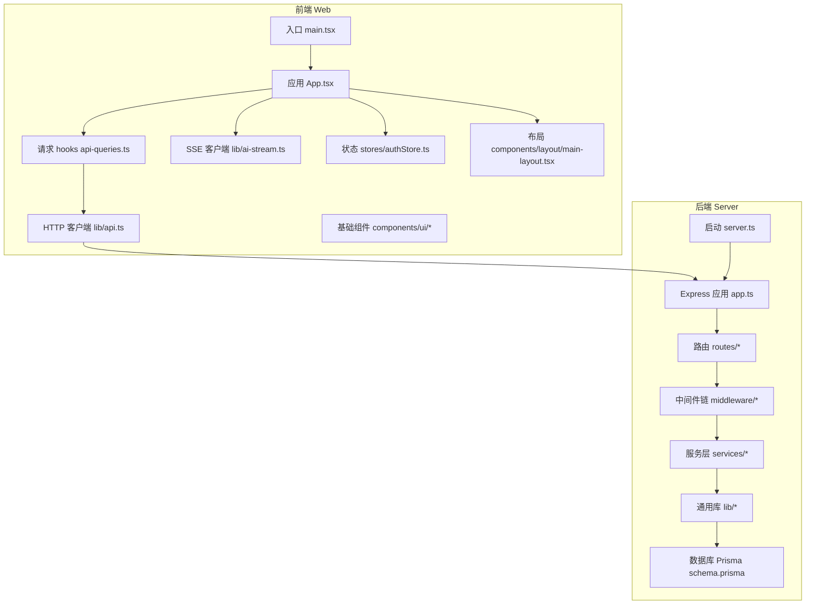
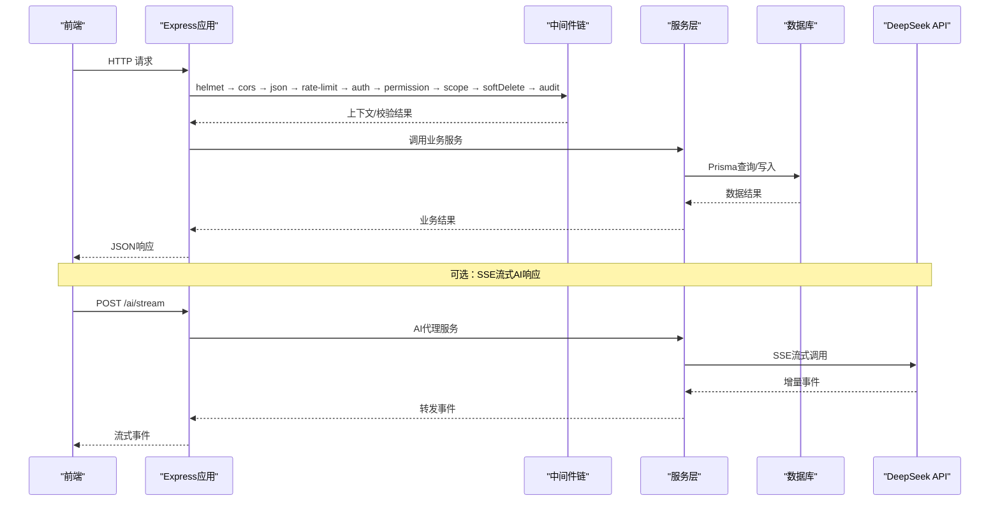
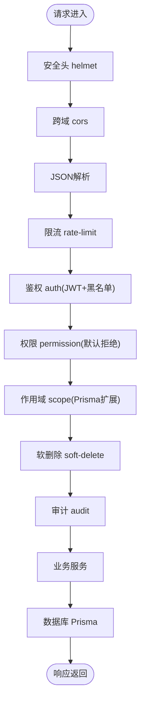
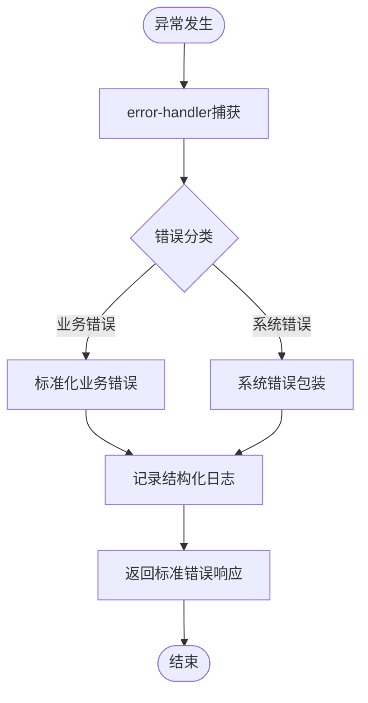
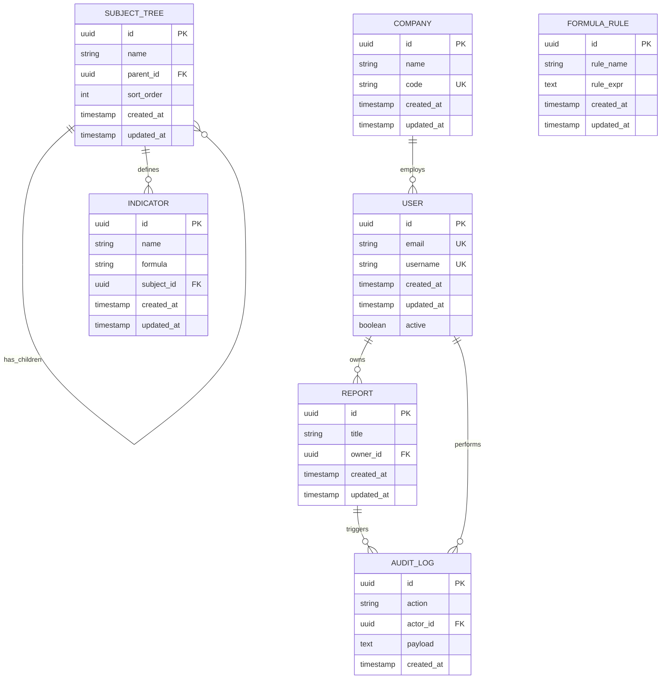
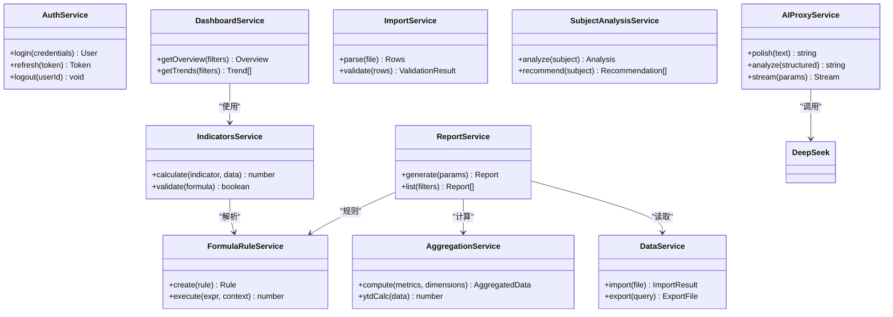
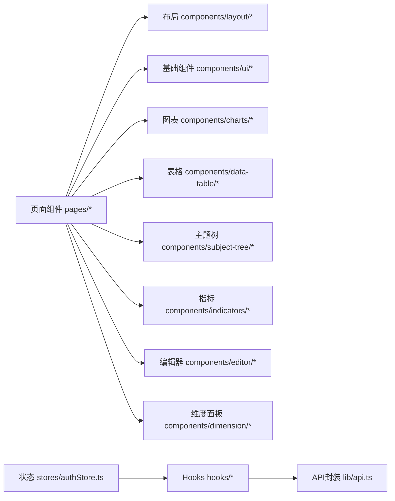
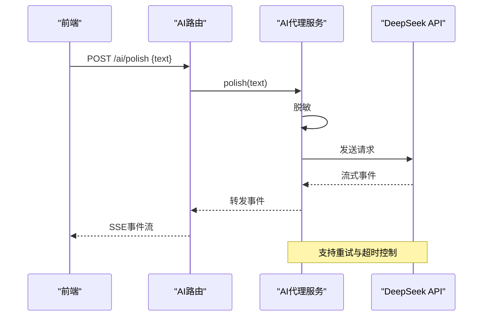
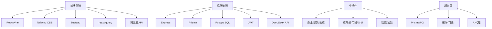

# 技术方案设计

<cite>
**本文引用的文件**   
- [server/src/app.ts](file://server/src/app.ts)
- [server/src/server.ts](file://server/src/server.ts)
- [server/src/config/env.ts](file://server/src/config/env.ts)
- [server/src/middleware/helmet.ts](file://server/src/middleware/helmet.ts)
- [server/src/middleware/cors.ts](file://server/src/middleware/cors.ts)
- [server/src/middleware/rate-limit.ts](file://server/src/middleware/rate-limit.ts)
- [server/src/middleware/auth.ts](file://server/src/middleware/auth.ts)
- [server/src/middleware/permission.ts](file://server/src/middleware/permission.ts)
- [server/src/middleware/scope.ts](file://server/src/middleware/scope.ts)
- [server/src/middleware/soft-delete.ts](file://server/src/middleware/soft-delete.ts)
- [server/src/middleware/audit.ts](file://server/src/middleware/audit.ts)
- [server/src/middleware/error-handler.ts](file://server/src/middleware/error-handler.ts)
- [server/src/middleware/trace-id.ts](file://server/src/middleware/trace-id.ts)
- [server/src/lib/errors.ts](file://server/src/lib/errors.ts)
- [server/src/lib/logger.ts](file://server/src/lib/logger.ts)
- [server/src/lib/response.ts](file://server/src/lib/response.ts)
- [server/src/lib/jwt.ts](file://server/src/lib/jwt.ts)
- [server/src/lib/prisma.ts](file://server/src/lib/prisma.ts)
- [server/src/lib/deepseek.ts](file://server/src/lib/deepseek.ts)
- [server/src/lib/formula.ts](file://server/src/lib/formula.ts)
- [server/src/lib/prompt-guard.ts](file://server/src/lib/prompt-guard.ts)
- [server/src/routes/auth.ts](file://server/src/routes/auth.ts)
- [server/src/routes/admin.ts](file://server/src/routes/admin.ts)
- [server/src/routes/ai.ts](file://server/src/routes/ai.ts)
- [server/src/routes/dashboard.ts](file://server/src/routes/dashboard.ts)
- [server/src/routes/data.ts](file://server/src/routes/data.ts)
- [server/src/routes/indicators.ts](file://server/src/routes/indicators.ts)
- [server/src/routes/reports.ts](file://server/src/routes/reports.ts)
- [server/src/services/AIProxyService.ts](file://server/src/services/AIProxyService.ts)
- [server/src/services/AuthService.ts](file://server/src/services/AuthService.ts)
- [server/src/services/DashboardService.ts](file://server/src/services/DashboardService.ts)
- [server/src/services/DataService.ts](file://server/src/services/DataService.ts)
- [server/src/services/IndicatorsService.ts](file://server/src/services/IndicatorsService.ts)
- [server/src/services/ReportService.ts](file://server/src/services/ReportService.ts)
- [server/src/services/AggregationService.ts](file://server/src/services/AggregationService.ts)
- [server/src/services/FormulaRuleService.ts](file://server/src/services/FormulaRuleService.ts)
- [server/src/services/ImportService.ts](file://server/src/services/ImportService.ts)
- [server/src/services/SubjectAnalysisService.ts](file://server/src/services/SubjectAnalysisService.ts)
- [server/prisma/schema.prisma](file://server/prisma/schema.prisma)
- [web/src/main.tsx](file://web/src/main.tsx)
- [web/src/App.tsx](file://web/src/App.tsx)
- [web/src/hooks/api-queries.ts](file://web/src/hooks/api-queries.ts)
- [web/src/lib/api.ts](file://web/src/lib/api.ts)
- [web/src/lib/ai-stream.ts](file://web/src/lib/ai-stream.ts)
- [web/src/stores/authStore.ts](file://web/src/stores/authStore.ts)
- [web/src/components/layout/main-layout.tsx](file://web/src/components/layout/main-layout.tsx)
- [web/src/components/ui/button.tsx](file://web/src/components/ui/button.tsx)
</cite>

## 目录
1. [引言](#引言)
2. [项目结构](#项目结构)
3. [核心组件](#核心组件)
4. [架构总览](#架构总览)
5. [详细组件分析](#详细组件分析)
6. [依赖关系分析](#依赖关系分析)
7. [性能考虑](#性能考虑)
8. [故障排查指南](#故障排查指南)
9. [结论](#结论)
10. [附录](#附录)

## 引言
本方案面向FY200浙江壹品慧财年经营数据分析平台，目标是形成一套可落地、可扩展、可观测的技术设计指南。平台定位“Excel进、看板/报表出”，统一单位为万元/人民币，后端采用Express 4 + Prisma 5 + PostgreSQL 15 + JWT（access 15min + refresh 7day轮转），AI集成使用DeepSeek API并通过SSE流式响应。中间件执行链顺序为：helmet → cors → express.json → rate-limit → auth(JWT+黑名单) → permission(默认拒绝) → scope(Prisma extension) → softDelete → audit → Service → Prisma → PostgreSQL。计算类指标通过安全公式解析（白名单算子 +-*/()，禁止eval），同比/环比由后端实时计算不入库。AI双管道架构：polish（文本→脱敏→LLM→还原）与 analyze（结构化→计算→脱敏→LLM→生成），脱敏规则包括绝对金额→区间、公司名→动态映射。

## 项目结构
- 前后端分离：前端位于 web 目录，基于React/Vite；后端位于 server 目录，基于Express/TypeScript。
- 后端分层清晰：routes（路由）→ middleware（中间件链）→ services（业务服务）→ lib（通用库）→ prisma（数据访问）。
- 数据库模型集中管理于 Prisma schema，迁移脚本位于 migrations。
- 前端按功能域组织页面与组件，hooks与lib提供API封装与工具函数，stores进行全局状态管理。

**图示来源** 
- [server/src/server.ts](file://server/src/server.ts)
- [server/src/app.ts](file://server/src/app.ts)
- [web/src/main.tsx](file://web/src/main.tsx)
- [web/src/App.tsx](file://web/src/App.tsx)

**章节来源**
- [server/src/server.ts](file://server/src/server.ts)
- [server/src/app.ts](file://server/src/app.ts)
- [web/src/main.tsx](file://web/src/main.tsx)
- [web/src/App.tsx](file://web/src/App.tsx)

## 核心组件
- 中间件链：安全头、跨域、限流、鉴权、权限、作用域、软删除、审计、错误处理、链路追踪。
- 服务层：认证、仪表盘、数据导入导出、指标、报表、聚合计算、公式规则、主题分析、AI代理。
- 通用库：错误定义、日志、响应封装、JWT、Prisma连接、DeepSeek调用、公式解析、提示词防护、脱敏等。
- 路由层：按领域划分REST接口，统一返回格式与错误码。

**章节来源**
- [server/src/middleware/helmet.ts](file://server/src/middleware/helmet.ts)
- [server/src/middleware/cors.ts](file://server/src/middleware/cors.ts)
- [server/src/middleware/rate-limit.ts](file://server/src/middleware/rate-limit.ts)
- [server/src/middleware/auth.ts](file://server/src/middleware/auth.ts)
- [server/src/middleware/permission.ts](file://server/src/middleware/permission.ts)
- [server/src/middleware/scope.ts](file://server/src/middleware/scope.ts)
- [server/src/middleware/soft-delete.ts](file://server/src/middleware/soft-delete.ts)
- [server/src/middleware/audit.ts](file://server/src/middleware/audit.ts)
- [server/src/middleware/error-handler.ts](file://server/src/middleware/error-handler.ts)
- [server/src/middleware/trace-id.ts](file://server/src/middleware/trace-id.ts)
- [server/src/lib/errors.ts](file://server/src/lib/errors.ts)
- [server/src/lib/logger.ts](file://server/src/lib/logger.ts)
- [server/src/lib/response.ts](file://server/src/lib/response.ts)
- [server/src/lib/jwt.ts](file://server/src/lib/jwt.ts)
- [server/src/lib/prisma.ts](file://server/src/lib/prisma.ts)
- [server/src/lib/deepseek.ts](file://server/src/lib/deepseek.ts)
- [server/src/lib/formula.ts](file://server/src/lib/formula.ts)
- [server/src/lib/prompt-guard.ts](file://server/src/lib/prompt-guard.ts)

## 架构总览
系统采用前后端分离的REST架构，结合SSE实现AI流式输出。请求进入Express后依次经过安全、鉴权、权限、作用域、审计等中间件，最终交由服务层执行业务逻辑并访问数据库。AI能力通过代理服务和外部API交互，支持重试与降级。

**图示来源** 
- [server/src/app.ts](file://server/src/app.ts)
- [server/src/middleware/auth.ts](file://server/src/middleware/auth.ts)
- [server/src/middleware/permission.ts](file://server/src/middleware/permission.ts)
- [server/src/middleware/scope.ts](file://server/src/middleware/scope.ts)
- [server/src/middleware/soft-delete.ts](file://server/src/middleware/soft-delete.ts)
- [server/src/middleware/audit.ts](file://server/src/middleware/audit.ts)
- [server/src/services/AIProxyService.ts](file://server/src/services/AIProxyService.ts)
- [server/src/lib/deepseek.ts](file://server/src/lib/deepseek.ts)

## 详细组件分析

### 中间件链设计与执行顺序
- 安全与网络：helmet设置安全头，cors配置跨域策略，express.json解析JSON请求体。
- 访问控制：rate-limit限制频率，auth验证JWT与黑名单，permission默认拒绝需显式授权，scope通过Prisma扩展注入租户/组织范围。
- 数据一致性：softDelete确保逻辑删除，audit记录关键操作。
- 错误与追踪：error-handler统一异常处理，trace-id贯穿全链路。

**图示来源** 
- [server/src/middleware/helmet.ts](file://server/src/middleware/helmet.ts)
- [server/src/middleware/cors.ts](file://server/src/middleware/cors.ts)
- [server/src/middleware/rate-limit.ts](file://server/src/middleware/rate-limit.ts)
- [server/src/middleware/auth.ts](file://server/src/middleware/auth.ts)
- [server/src/middleware/permission.ts](file://server/src/middleware/permission.ts)
- [server/src/middleware/scope.ts](file://server/src/middleware/scope.ts)
- [server/src/middleware/soft-delete.ts](file://server/src/middleware/soft-delete.ts)
- [server/src/middleware/audit.ts](file://server/src/middleware/audit.ts)

**章节来源**
- [server/src/middleware/helmet.ts](file://server/src/middleware/helmet.ts)
- [server/src/middleware/cors.ts](file://server/src/middleware/cors.ts)
- [server/src/middleware/rate-limit.ts](file://server/src/middleware/rate-limit.ts)
- [server/src/middleware/auth.ts](file://server/src/middleware/auth.ts)
- [server/src/middleware/permission.ts](file://server/src/middleware/permission.ts)
- [server/src/middleware/scope.ts](file://server/src/middleware/scope.ts)
- [server/src/middleware/soft-delete.ts](file://server/src/middleware/soft-delete.ts)
- [server/src/middleware/audit.ts](file://server/src/middleware/audit.ts)

### 错误处理机制与日志规范
- 错误类型：统一错误对象，包含code、message、details等字段，便于前端展示与监控。
- 错误处理中间件：捕获未处理异常，转换为标准响应，避免堆栈泄露。
- 日志规范：结构化日志，包含traceId、级别、模块、消息、耗时等，便于追踪与排障。

**图示来源** 
- [server/src/middleware/error-handler.ts](file://server/src/middleware/error-handler.ts)
- [server/src/lib/errors.ts](file://server/src/lib/errors.ts)
- [server/src/lib/logger.ts](file://server/src/lib/logger.ts)

**章节来源**
- [server/src/middleware/error-handler.ts](file://server/src/middleware/error-handler.ts)
- [server/src/lib/errors.ts](file://server/src/lib/errors.ts)
- [server/src/lib/logger.ts](file://server/src/lib/logger.ts)

### API接口设计规范
- 路径命名：RESTful风格，资源名词复数形式，动词用HTTP方法表达。
- 请求/响应：统一JSON结构，成功包含data，失败包含error.code/message。
- 分页与过滤：列表接口支持page、pageSize、filter、sort等参数。
- 版本化：建议通过URL前缀或Header进行版本控制。

示例接口（仅描述，不含代码内容）：
- 认证：POST /api/auth/login、POST /api/auth/refresh
- 仪表盘：GET /api/dashboard/overview
- 数据：POST /api/data/import、GET /api/data/export
- 指标：GET /api/indicators/tree、POST /api/indicators/calculate
- 报表：GET /api/reports/list、POST /api/reports/generate
- AI：POST /api/ai/polish、POST /api/ai/analyze、GET /api/ai/stream

**章节来源**
- [server/src/routes/auth.ts](file://server/src/routes/auth.ts)
- [server/src/routes/dashboard.ts](file://server/src/routes/dashboard.ts)
- [server/src/routes/data.ts](file://server/src/routes/data.ts)
- [server/src/routes/indicators.ts](file://server/src/routes/indicators.ts)
- [server/src/routes/reports.ts](file://server/src/routes/reports.ts)
- [server/src/routes/ai.ts](file://server/src/routes/ai.ts)
- [server/src/lib/response.ts](file://server/src/lib/response.ts)

### 数据库模型设计
- 实体建模：用户、公司、主题树、指标、报表、公式规则、审计日志等。
- 关联关系：多对一、一对多、多对多，外键约束保证一致性。
- 索引优化：高频查询字段建立索引，复合索引覆盖常见过滤条件。
- 软删除：逻辑删除字段deletedAt，配合中间件自动过滤。

**图示来源** 
- [server/prisma/schema.prisma](file://server/prisma/schema.prisma)

**章节来源**
- [server/prisma/schema.prisma](file://server/prisma/schema.prisma)

### 服务层架构模式
- 职责单一：每个Service负责一个业务域，如认证、仪表盘、数据导入、指标计算、报表生成、聚合计算、公式规则、主题分析、AI代理。
- 组合复用：复杂流程通过组合多个Service完成，如报表生成可能涉及数据服务、指标服务、聚合服务。
- 事务边界：写操作在Service中开启事务，保证一致性。
- 缓存策略：热点数据在服务层缓存，减少数据库压力。

**图示来源** 
- [server/src/services/AuthService.ts](file://server/src/services/AuthService.ts)
- [server/src/services/DashboardService.ts](file://server/src/services/DashboardService.ts)
- [server/src/services/DataService.ts](file://server/src/services/DataService.ts)
- [server/src/services/IndicatorsService.ts](file://server/src/services/IndicatorsService.ts)
- [server/src/services/ReportService.ts](file://server/src/services/ReportService.ts)
- [server/src/services/AggregationService.ts](file://server/src/services/AggregationService.ts)
- [server/src/services/FormulaRuleService.ts](file://server/src/services/FormulaRuleService.ts)
- [server/src/services/ImportService.ts](file://server/src/services/ImportService.ts)
- [server/src/services/SubjectAnalysisService.ts](file://server/src/services/SubjectAnalysisService.ts)
- [server/src/services/AIProxyService.ts](file://server/src/services/AIProxyService.ts)

**章节来源**
- [server/src/services/AuthService.ts](file://server/src/services/AuthService.ts)
- [server/src/services/DashboardService.ts](file://server/src/services/DashboardService.ts)
- [server/src/services/DataService.ts](file://server/src/services/DataService.ts)
- [server/src/services/IndicatorsService.ts](file://server/src/services/IndicatorsService.ts)
- [server/src/services/ReportService.ts](file://server/src/services/ReportService.ts)
- [server/src/services/AggregationService.ts](file://server/src/services/AggregationService.ts)
- [server/src/services/FormulaRuleService.ts](file://server/src/services/FormulaRuleService.ts)
- [server/src/services/ImportService.ts](file://server/src/services/ImportService.ts)
- [server/src/services/SubjectAnalysisService.ts](file://server/src/services/SubjectAnalysisService.ts)
- [server/src/services/AIProxyService.ts](file://server/src/services/AIProxyService.ts)

### React组件设计规范
- 组件结构：按功能域组织，页面级组件在pages，通用组件在components，基础UI在ui。
- 状态管理：局部状态使用useState/useReducer，全局状态使用Zustand（authStore），异步数据使用react-query（api-queries）。
- 样式组织：Tailwind CSS为主，全局样式在styles，组件内样式尽量原子化。
- 权限控制：通过RequirePermission高阶组件或Hook进行路由与按钮级权限控制。

**图示来源** 
- [web/src/pages/*](file://web/src/pages/index.tsx)
- [web/src/components/layout/main-layout.tsx](file://web/src/components/layout/main-layout.tsx)
- [web/src/components/ui/button.tsx](file://web/src/components/ui/button.tsx)
- [web/src/hooks/api-queries.ts](file://web/src/hooks/api-queries.ts)
- [web/src/lib/api.ts](file://web/src/lib/api.ts)
- [web/src/stores/authStore.ts](file://web/src/stores/authStore.ts)

**章节来源**
- [web/src/components/layout/main-layout.tsx](file://web/src/components/layout/main-layout.tsx)
- [web/src/components/ui/button.tsx](file://web/src/components/ui/button.tsx)
- [web/src/hooks/api-queries.ts](file://web/src/hooks/api-queries.ts)
- [web/src/lib/api.ts](file://web/src/lib/api.ts)
- [web/src/stores/authStore.ts](file://web/src/stores/authStore.ts)

### AI集成的技术选型与实现
- 调用方式：通过AI代理服务封装DeepSeek API，支持polish与analyze两种管道。
- 流式响应：使用SSE实现增量输出，前端通过EventSource或自定义fetch流式读取。
- 错误重试：指数退避重试，区分可重试与不可重试错误，支持熔断与降级。
- 脱敏与还原：输入先脱敏（金额→区间、公司名→映射），LLM处理后还原敏感信息。

**图示来源** 
- [server/src/routes/ai.ts](file://server/src/routes/ai.ts)
- [server/src/services/AIProxyService.ts](file://server/src/services/AIProxyService.ts)
- [server/src/lib/deepseek.ts](file://server/src/lib/deepseek.ts)
- [web/src/lib/ai-stream.ts](file://web/src/lib/ai-stream.ts)

**章节来源**
- [server/src/routes/ai.ts](file://server/src/routes/ai.ts)
- [server/src/services/AIProxyService.ts](file://server/src/services/AIProxyService.ts)
- [server/src/lib/deepseek.ts](file://server/src/lib/deepseek.ts)
- [web/src/lib/ai-stream.ts](file://web/src/lib/ai-stream.ts)

## 依赖关系分析
- 前端依赖：React生态（Vite、Tailwind、Zustand、react-query）、浏览器API（EventSource/fetch流）。
- 后端依赖：Express、Prisma、PostgreSQL、JWT库、DeepSeek SDK或HTTP客户端。
- 中间件耦合：低耦合高内聚，通过洋葱模型组合，易于测试与替换。
- 服务层依赖：Prisma客户端、第三方API（DeepSeek）、缓存（可选Redis）。

**图示来源** 
- [server/package.json](file://server/package.json)
- [web/package.json](file://web/package.json)
- [server/src/app.ts](file://server/src/app.ts)

**章节来源**
- [server/package.json](file://server/package.json)
- [web/package.json](file://web/package.json)
- [server/src/app.ts](file://server/src/app.ts)

## 性能考虑
- 缓存策略：热点数据在服务层缓存（内存或Redis），合理设置过期时间，避免雪崩。
- 查询优化：Prisma查询按需选择字段，使用include/select减少数据传输，复杂查询使用原生SQL。
- 内存管理：避免大对象驻留，及时释放引用，流式处理大数据集。
- 并发控制：限流与熔断保护下游服务，避免级联故障。
- 前端优化：组件懒加载、虚拟滚动、图片压缩、CDN加速。

[本节为通用指导，无需特定文件来源]

## 故障排查指南
- 常见问题：
  - 鉴权失败：检查JWT签名、过期时间、黑名单配置。
  - 权限不足：确认permission中间件配置与角色映射。
  - 作用域错误：检查scope扩展是否正确注入租户ID。
  - 数据库连接：验证Prisma连接字符串与PostgreSQL状态。
  - AI调用失败：检查API密钥、网络连通性、重试策略。
- 诊断工具：
  - 结构化日志：通过traceId追踪请求链路。
  - 错误上报：统一错误码与消息，便于监控告警。
  - 性能剖析：慢查询日志、CPU/内存监控。

**章节来源**
- [server/src/middleware/error-handler.ts](file://server/src/middleware/error-handler.ts)
- [server/src/lib/logger.ts](file://server/src/lib/logger.ts)
- [server/src/lib/errors.ts](file://server/src/lib/errors.ts)

## 结论
本方案围绕前后端分离、中间件链、服务层架构、组件规范、性能与安全、AI集成等方面提供了完整的技术设计指南。通过标准化的中间件执行顺序、统一错误处理与日志规范、清晰的组件结构与状态管理、以及健壮的AI集成方案，确保系统具备高可用性、可维护性与可扩展性。建议在实际开发中严格遵循本指南，并结合监控与测试持续优化。

[本节为总结性内容，无需特定文件来源]

## 附录
- 环境变量配置：参考env.ts中的配置项，如数据库连接、JWT密钥、AI API密钥等。
- 安全规范：参考docs/plans/安全与权限规范.md与docs/references/backend.md。
- 数据模型规范：参考docs/plans/数据模型规范.md与prisma/schema.prisma。
- 性能优化：参考docs/references/performance.md与后端服务层的缓存实现。

**章节来源**
- [server/src/config/env.ts](file://server/src/config/env.ts)
- [docs/plans/安全与权限规范.md](file://docs/plans/安全与权限规范.md)
- [docs/references/backend.md](file://docs/references/backend.md)
- [docs/plans/数据模型规范.md](file://docs/plans/数据模型规范.md)
- [server/prisma/schema.prisma](file://server/prisma/schema.prisma)
- [docs/references/performance.md](file://docs/references/performance.md)