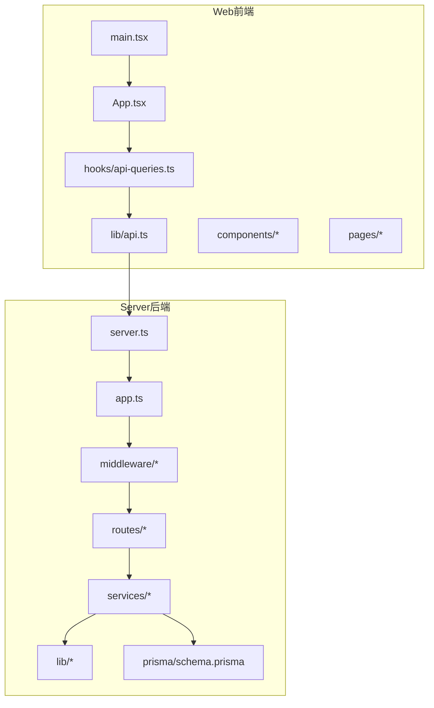
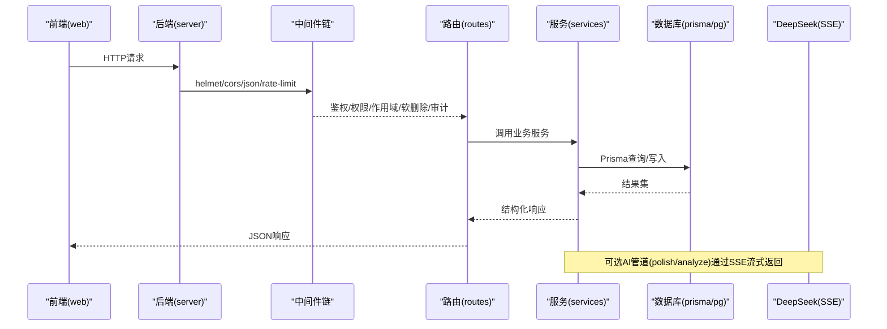
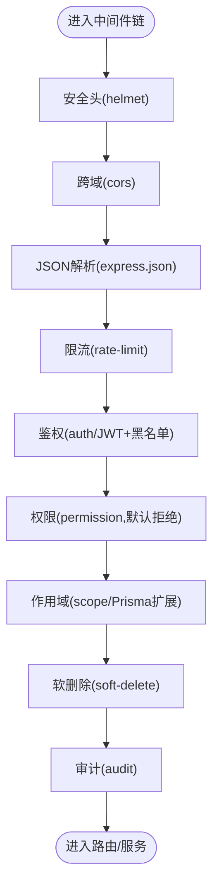
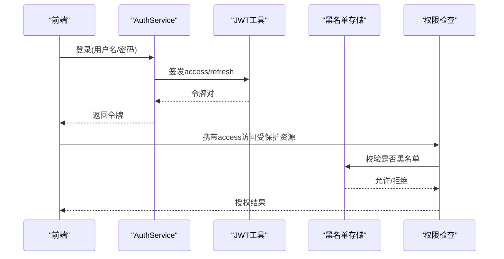
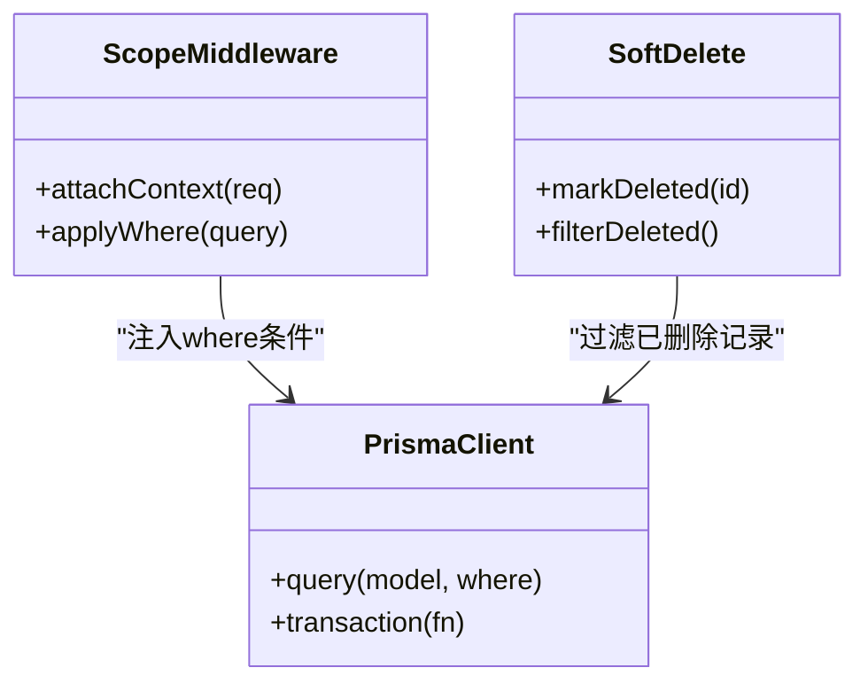
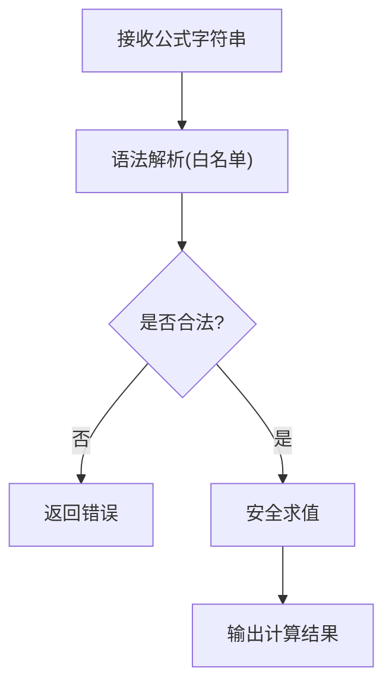
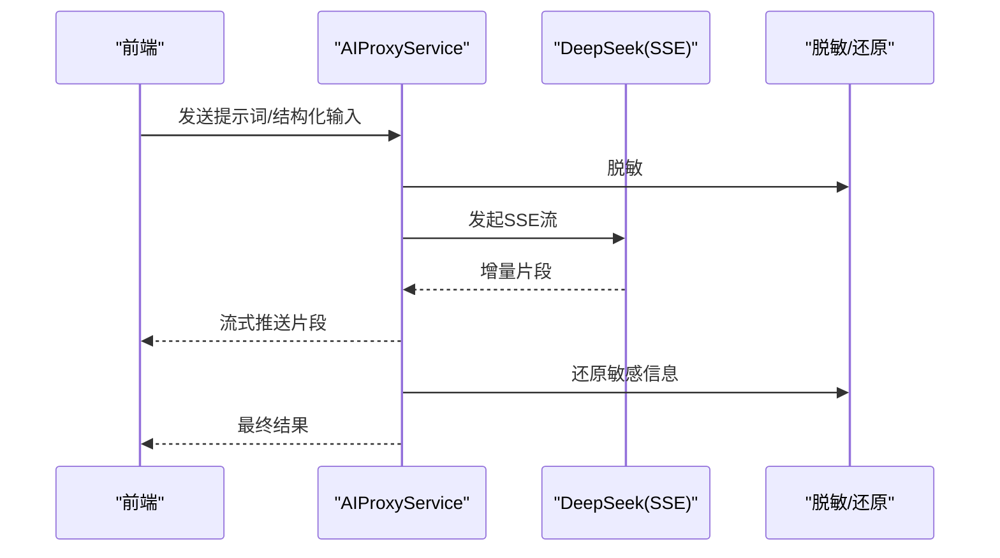
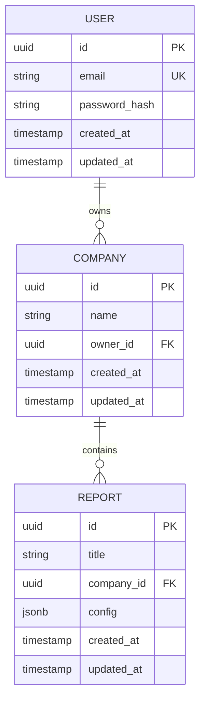
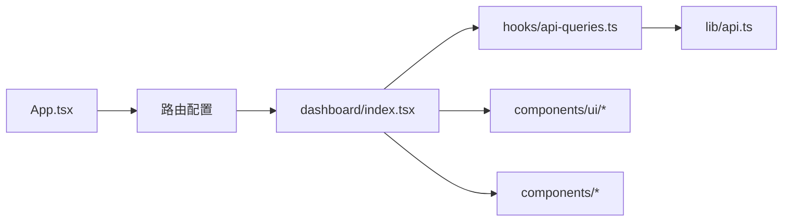
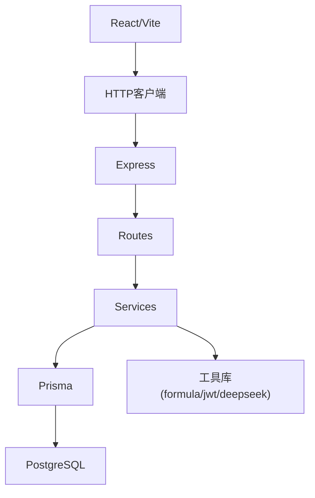

# 新功能开发

<cite>
**本文引用的文件**   
- [server/src/app.ts](file://server/src/app.ts)
- [server/src/server.ts](file://server/src/server.ts)
- [server/src/config/env.ts](file://server/src/config/env.ts)
- [server/src/middleware/helmet.ts](file://server/src/middleware/helmet.ts)
- [server/src/middleware/cors.ts](file://server/src/middleware/cors.ts)
- [server/src/middleware/rate-limit.ts](file://server/src/middleware/rate-limit.ts)
- [server/src/middleware/auth.ts](file://server/src/middleware/auth.ts)
- [server/src/middleware/permission.ts](file://server/src/middleware/permission.ts)
- [server/src/middleware/scope.ts](file://server/src/middleware/scope.ts)
- [server/src/middleware/soft-delete.ts](file://server/src/middleware/soft-delete.ts)
- [server/src/middleware/audit.ts](file://server/src/middleware/audit.ts)
- [server/src/lib/prisma.ts](file://server/src/lib/prisma.ts)
- [server/src/lib/errors.ts](file://server/src/lib/errors.ts)
- [server/src/lib/response.ts](file://server/src/lib/response.ts)
- [server/src/lib/formula.ts](file://server/src/lib/formula.ts)
- [server/src/lib/jwt.ts](file://server/src/lib/jwt.ts)
- [server/src/lib/deepseek.ts](file://server/src/lib/deepseek.ts)
- [server/src/routes/auth.ts](file://server/src/routes/auth.ts)
- [server/src/routes/data.ts](file://server/src/routes/data.ts)
- [server/src/routes/reports.ts](file://server/src/routes/reports.ts)
- [server/src/services/AuthService.ts](file://server/src/services/AuthService.ts)
- [server/src/services/DataService.ts](file://server/src/services/DataService.ts)
- [server/src/services/ReportService.ts](file://server/src/services/ReportService.ts)
- [server/src/services/AIProxyService.ts](file://server/src/services/AIProxyService.ts)
- [server/prisma/schema.prisma](file://server/prisma/schema.prisma)
- [web/src/App.tsx](file://web/src/App.tsx)
- [web/src/main.tsx](file://web/src/main.tsx)
- [web/src/hooks/api-queries.ts](file://web/src/hooks/api-queries.ts)
- [web/src/lib/api.ts](file://web/src/lib/api.ts)
- [web/src/components/ui/button.tsx](file://web/src/components/ui/button.tsx)
- [web/src/pages/dashboard/index.tsx](file://web/src/pages/dashboard/index.tsx)
- [web/vite.config.ts](file://web/vite.config.ts)
- [web/package.json](file://web/package.json)
- [server/package.json](file://server/package.json)
- [docs/references/backend.md](file://docs/references/backend.md)
- [docs/references/frontend.md](file://docs/references/frontend.md)
- [docs/references/performance.md](file://docs/references/performance.md)
- [docs/plans/数据模型规范.md](file://docs/plans/数据模型规范.md)
- [docs/plans/安全与权限规范.md](file://docs/plans/安全与权限规范.md)
</cite>

## 目录
1. [引言](#引言)
2. [项目结构](#项目结构)
3. [核心组件](#核心组件)
4. [架构总览](#架构总览)
5. [详细组件分析](#详细组件分析)
6. [依赖关系分析](#依赖关系分析)
7. [性能考量](#性能考量)
8. [故障排查指南](#故障排查指南)
9. [结论](#结论)
10. [附录](#附录)

## 引言
本指南面向FY200（浙江壹品慧财年经营数据分析平台）的新功能开发，覆盖从需求评审、技术方案设计、数据库模型设计、API接口定义，到前后端编码规范、测试驱动开发、代码审查、性能优化与发布回滚的全流程。平台定位“Excel进、看板/报表出”，单位统一为万元/人民币；后端采用Express + Prisma + PostgreSQL + JWT + DeepSeek API（SSE流式），中间件执行链顺序固定，计算类指标使用安全公式解析，AI双管道（polish/analyze）保障脱敏与合规。

## 项目结构
仓库采用前后端分离：
- server：Express服务、Prisma数据层、中间件链、路由与服务层、脚本与测试
- web：React前端、Vite构建、组件库、页面与状态管理、测试配置
- docs：参考文档、计划与规范
- .wiki：Wiki资料

图表来源
- [web/src/main.tsx](file://web/src/main.tsx)
- [web/src/App.tsx](file://web/src/App.tsx)
- [web/src/lib/api.ts](file://web/src/lib/api.ts)
- [web/src/hooks/api-queries.ts](file://web/src/hooks/api-queries.ts)
- [server/src/server.ts](file://server/src/server.ts)
- [server/src/app.ts](file://server/src/app.ts)
- [server/prisma/schema.prisma](file://server/prisma/schema.prisma)

章节来源
- [server/src/server.ts](file://server/src/server.ts)
- [server/src/app.ts](file://server/src/app.ts)
- [web/src/main.tsx](file://web/src/main.tsx)
- [web/src/App.tsx](file://web/src/App.tsx)

## 核心组件
- 中间件链：helmet → cors → express.json → rate-limit → auth(JWT+黑名单) → permission(默认拒绝) → scope(Prisma扩展) → softDelete → audit → Service → Prisma → PostgreSQL
- 路由层：按业务域划分（auth、data、reports等）
- 服务层：AuthService、DataService、ReportService、AIProxyService等
- 数据层：Prisma Schema与迁移
- 工具库：errors、response、formula、jwt、deepseek等

章节来源
- [server/src/app.ts](file://server/src/app.ts)
- [server/src/middleware/auth.ts](file://server/src/middleware/auth.ts)
- [server/src/middleware/permission.ts](file://server/src/middleware/permission.ts)
- [server/src/middleware/scope.ts](file://server/src/middleware/scope.ts)
- [server/src/middleware/soft-delete.ts](file://server/src/middleware/soft-delete.ts)
- [server/src/middleware/audit.ts](file://server/src/middleware/audit.ts)
- [server/src/lib/prisma.ts](file://server/src/lib/prisma.ts)
- [server/src/lib/formula.ts](file://server/src/lib/formula.ts)
- [server/src/lib/jwt.ts](file://server/src/lib/jwt.ts)
- [server/src/lib/deepseek.ts](file://server/src/lib/deepseek.ts)

## 架构总览
整体请求处理链路如下：

图表来源
- [server/src/app.ts](file://server/src/app.ts)
- [server/src/middleware/auth.ts](file://server/src/middleware/auth.ts)
- [server/src/middleware/permission.ts](file://server/src/middleware/permission.ts)
- [server/src/middleware/scope.ts](file://server/src/middleware/scope.ts)
- [server/src/middleware/soft-delete.ts](file://server/src/middleware/soft-delete.ts)
- [server/src/middleware/audit.ts](file://server/src/middleware/audit.ts)
- [server/src/lib/prisma.ts](file://server/src/lib/prisma.ts)
- [server/src/lib/deepseek.ts](file://server/src/lib/deepseek.ts)

## 详细组件分析

### 中间件链与安全
- helmet：设置安全响应头
- cors：跨域策略
- express.json：请求体解析
- rate-limit：限流保护
- auth：JWT校验与黑名单拦截
- permission：基于角色的访问控制（默认拒绝）
- scope：通过Prisma扩展实现数据作用域过滤
- soft-delete：软删除语义
- audit：审计日志记录

图表来源
- [server/src/middleware/helmet.ts](file://server/src/middleware/helmet.ts)
- [server/src/middleware/cors.ts](file://server/src/middleware/cors.ts)
- [server/src/middleware/rate-limit.ts](file://server/src/middleware/rate-limit.ts)
- [server/src/middleware/auth.ts](file://server/src/middleware/auth.ts)
- [server/src/middleware/permission.ts](file://server/src/middleware/permission.ts)
- [server/src/middleware/scope.ts](file://server/src/middleware/scope.ts)
- [server/src/middleware/soft-delete.ts](file://server/src/middleware/soft-delete.ts)
- [server/src/middleware/audit.ts](file://server/src/middleware/audit.ts)

章节来源
- [server/src/app.ts](file://server/src/app.ts)
- [server/src/middleware/auth.ts](file://server/src/middleware/auth.ts)
- [server/src/middleware/permission.ts](file://server/src/middleware/permission.ts)
- [server/src/middleware/scope.ts](file://server/src/middleware/scope.ts)
- [server/src/middleware/soft-delete.ts](file://server/src/middleware/soft-delete.ts)
- [server/src/middleware/audit.ts](file://server/src/middleware/audit.ts)

### 认证与授权
- JWT：access token短期（约15分钟）、refresh token长期（约7天）轮换
- 黑名单：登出或强制刷新时加入黑名单
- 权限：默认拒绝，白名单放行

图表来源
- [server/src/services/AuthService.ts](file://server/src/services/AuthService.ts)
- [server/src/lib/jwt.ts](file://server/src/lib/jwt.ts)
- [server/src/middleware/auth.ts](file://server/src/middleware/auth.ts)
- [server/src/middleware/permission.ts](file://server/src/middleware/permission.ts)

章节来源
- [server/src/services/AuthService.ts](file://server/src/services/AuthService.ts)
- [server/src/lib/jwt.ts](file://server/src/lib/jwt.ts)
- [server/src/middleware/auth.ts](file://server/src/middleware/auth.ts)
- [server/src/middleware/permission.ts](file://server/src/middleware/permission.ts)

### 数据与作用域
- Prisma扩展注入当前用户上下文，自动附加where条件（如company_id、org_scope）
- 软删除：查询默认排除已删除记录，写操作支持逻辑删除

图表来源
- [server/src/middleware/scope.ts](file://server/src/middleware/scope.ts)
- [server/src/middleware/soft-delete.ts](file://server/src/middleware/soft-delete.ts)
- [server/src/lib/prisma.ts](file://server/src/lib/prisma.ts)

章节来源
- [server/src/middleware/scope.ts](file://server/src/middleware/scope.ts)
- [server/src/middleware/soft-delete.ts](file://server/src/middleware/soft-delete.ts)
- [server/src/lib/prisma.ts](file://server/src/lib/prisma.ts)

### 安全公式与计算指标
- 白名单算子：仅允许+-*/()等安全表达式
- 禁止eval：防止任意代码执行
- 同比/环比：后端实时计算，不持久化

图表来源
- [server/src/lib/formula.ts](file://server/src/lib/formula.ts)

章节来源
- [server/src/lib/formula.ts](file://server/src/lib/formula.ts)

### AI双管道（SSE流式）
- polish管道：文本→脱敏→LLM→还原
- analyze管道：结构化→计算→脱敏→LLM→生成
- 使用SSE进行流式返回，提升交互体验

图表来源
- [server/src/services/AIProxyService.ts](file://server/src/services/AIProxyService.ts)
- [server/src/lib/deepseek.ts](file://server/src/lib/deepseek.ts)

章节来源
- [server/src/services/AIProxyService.ts](file://server/src/services/AIProxyService.ts)
- [server/src/lib/deepseek.ts](file://server/src/lib/deepseek.ts)

### 数据库模型与迁移
- 使用Prisma管理Schema与迁移
- 新增字段/表需编写迁移并验证
- 审计与软删除在模型层配合中间件生效

图表来源
- [server/prisma/schema.prisma](file://server/prisma/schema.prisma)

章节来源
- [server/prisma/schema.prisma](file://server/prisma/schema.prisma)

### 前端组件与页面
- 组件分层：UI基础组件、业务组件、页面容器
- Hooks封装API调用与缓存
- 路由与布局管理

图表来源
- [web/src/App.tsx](file://web/src/App.tsx)
- [web/src/pages/dashboard/index.tsx](file://web/src/pages/dashboard/index.tsx)
- [web/src/hooks/api-queries.ts](file://web/src/hooks/api-queries.ts)
- [web/src/lib/api.ts](file://web/src/lib/api.ts)
- [web/src/components/ui/button.tsx](file://web/src/components/ui/button.tsx)

章节来源
- [web/src/App.tsx](file://web/src/App.tsx)
- [web/src/pages/dashboard/index.tsx](file://web/src/pages/dashboard/index.tsx)
- [web/src/hooks/api-queries.ts](file://web/src/hooks/api-queries.ts)
- [web/src/lib/api.ts](file://web/src/lib/api.ts)
- [web/src/components/ui/button.tsx](file://web/src/components/ui/button.tsx)

## 依赖关系分析
- 后端依赖：Express、Prisma、PostgreSQL、JWT、DeepSeek SSE
- 前端依赖：React、Vite、Tailwind、测试框架
- 中间件强耦合于应用启动顺序，变更需谨慎

图表来源
- [server/package.json](file://server/package.json)
- [web/package.json](file://web/package.json)
- [server/src/app.ts](file://server/src/app.ts)
- [web/src/lib/api.ts](file://web/src/lib/api.ts)

章节来源
- [server/package.json](file://server/package.json)
- [web/package.json](file://web/package.json)
- [server/src/app.ts](file://server/src/app.ts)
- [web/src/lib/api.ts](file://web/src/lib/api.ts)

## 性能考量
- 查询优化：合理使用索引、分页、避免N+1查询；通过Prisma关联与select字段裁剪减少负载
- 缓存策略：热点数据缓存（如字典、维度树），注意失效与一致性
- 内存管理：大对象分块处理、避免闭包泄漏；SSE流式传输降低峰值内存
- 并发与限流：rate-limit保护后端；连接池参数调优
- 计算指标：同比/环比实时计算，避免冗余存储

[本节为通用指导，不直接分析具体文件]

## 故障排查指南
- 错误统一：使用lib/errors定义错误类型与消息，便于前端识别与展示
- 响应格式：lib/response统一成功/失败包装
- 日志与追踪：开启trace-id贯穿请求链路，结合audit中间件定位问题
- 常见问题：
  - 鉴权失败：检查JWT签名、过期时间、黑名单
  - 权限拒绝：确认角色与权限映射
  - 作用域异常：检查scope注入的上下文是否正确
  - 软删除误删：核对delete标志与查询过滤

章节来源
- [server/src/lib/errors.ts](file://server/src/lib/errors.ts)
- [server/src/lib/response.ts](file://server/src/lib/response.ts)
- [server/src/middleware/audit.ts](file://server/src/middleware/audit.ts)
- [server/src/middleware/auth.ts](file://server/src/middleware/auth.ts)
- [server/src/middleware/permission.ts](file://server/src/middleware/permission.ts)
- [server/src/middleware/scope.ts](file://server/src/middleware/scope.ts)
- [server/src/middleware/soft-delete.ts](file://server/src/middleware/soft-delete.ts)

## 结论
本指南围绕FY200项目的端到端开发流程，明确了中间件链、鉴权授权、数据作用域、安全公式、AI管道、数据库建模与前后端协作规范。遵循本指南可确保新功能在安全性、性能与可维护性上达到一致标准，并支持快速迭代与稳定上线。

## 附录

### 需求评审与技术方案设计
- 明确业务目标与口径（单位万元/人民币）
- 评估影响范围（数据模型、API、权限、AI管道）
- 输出PRD与技术方案（含时序图、数据流图）

### 数据库模型设计
- 遵循数据模型规范，字段命名与约束清晰
- 新增迁移需评审与回归验证
- 审计与软删除策略落地

章节来源
- [docs/plans/数据模型规范.md](file://docs/plans/数据模型规范.md)
- [server/prisma/schema.prisma](file://server/prisma/schema.prisma)

### API接口定义
- REST风格，统一响应格式
- 鉴权与权限标注
- 分页、排序、过滤约定

章节来源
- [server/src/routes/auth.ts](file://server/src/routes/auth.ts)
- [server/src/routes/data.ts](file://server/src/routes/data.ts)
- [server/src/routes/reports.ts](file://server/src/routes/reports.ts)
- [server/src/lib/response.ts](file://server/src/lib/response.ts)

### 前端开发规范（TypeScript与组件）
- 严格类型定义，避免any
- 组件职责单一，复用UI基础组件
- API调用封装在hooks中，统一错误处理

章节来源
- [web/src/hooks/api-queries.ts](file://web/src/hooks/api-queries.ts)
- [web/src/lib/api.ts](file://web/src/lib/api.ts)
- [web/src/components/ui/button.tsx](file://web/src/components/ui/button.tsx)
- [docs/references/frontend.md](file://docs/references/frontend.md)

### 后端开发规范（服务层架构）
- 路由薄、服务厚，业务逻辑下沉至服务层
- 中间件不可侵入业务，保持纯函数风格
- 错误与日志标准化

章节来源
- [server/src/services/AuthService.ts](file://server/src/services/AuthService.ts)
- [server/src/services/DataService.ts](file://server/src/services/DataService.ts)
- [server/src/services/ReportService.ts](file://server/src/services/ReportService.ts)
- [docs/references/backend.md](file://docs/references/backend.md)

### 测试驱动开发实践
- 单元测试：服务与工具函数（vitest）
- 集成测试：路由与数据库交互（事务隔离）
- 端到端测试：关键用户路径（登录、报表导出、AI对话）

章节来源
- [server/src/services/AuthService.test.ts](file://server/src/services/AuthService.test.ts)
- [server/src/services/DataService.test.ts](file://server/src/services/DataService.test.ts)
- [server/src/test/integration.test.ts](file://server/src/test/integration.test.ts)
- [web/src/components/data-table/__tests__/data-table.test.tsx](file://web/src/components/data-table/__tests__/data-table.test.tsx)

### 代码审查流程
- Pull Request：描述变更、影响面、测试覆盖
- 质量检查：lint、类型检查、单元测试通过率
- 安全扫描：依赖漏洞、敏感信息泄露检测

章节来源
- [docs/plans/安全与权限规范.md](file://docs/plans/安全与权限规范.md)

### 性能优化指导
- 查询优化：索引、分页、字段裁剪
- 缓存策略：热点数据、失效策略
- 内存管理：流式处理、避免大对象驻留

章节来源
- [docs/references/performance.md](file://docs/references/performance.md)

### 发布前检查与回滚机制
- 发布清单：迁移、环境变量、依赖版本、健康检查
- 灰度与回滚：蓝绿/金丝雀，一键回滚脚本
- 监控与告警：错误率、延迟、资源使用

章节来源
- [docs/references/devops.md](file://docs/references/devops.md)