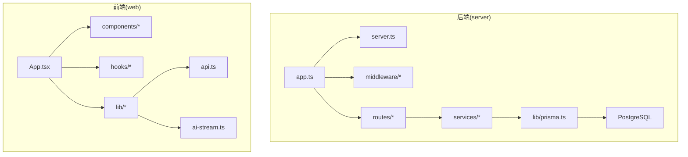
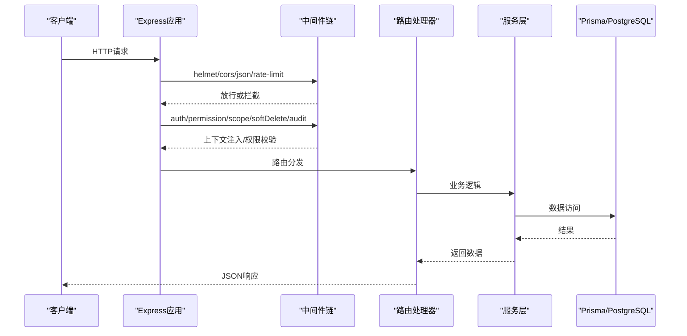
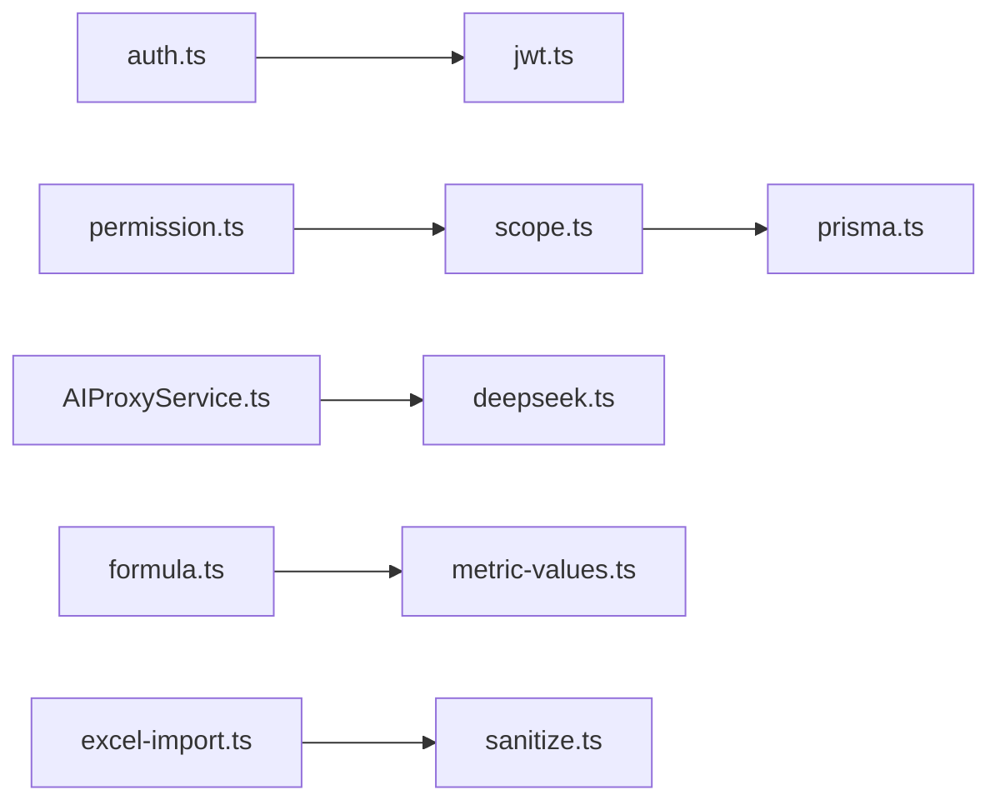

# 测试策略与实践

<cite>
**本文引用的文件**   
- [server/package.json](file://server/package.json)
- [server/vitest.config.ts](file://server/vitest.config.ts)
- [server/src/app.ts](file://server/src/app.ts)
- [server/src/server.ts](file://server/src/server.ts)
- [server/src/config/env.ts](file://server/src/config/env.ts)
- [server/src/lib/prisma.ts](file://server/src/lib/prisma.ts)
- [server/src/middleware/auth.ts](file://server/src/middleware/auth.ts)
- [server/src/middleware/permission.ts](file://server/src/middleware/permission.ts)
- [server/src/middleware/scope.ts](file://server/src/middleware/scope.ts)
- [server/src/middleware/soft-delete.ts](file://server/src/middleware/soft-delete.ts)
- [server/src/middleware/rate-limit.ts](file://server/src/middleware/rate-limit.ts)
- [server/src/middleware/helmet.ts](file://server/src/middleware/helmet.ts)
- [server/src/middleware/cors.ts](file://server/src/middleware/cors.ts)
- [server/src/middleware/error-handler.ts](file://server/src/middleware/error-handler.ts)
- [server/src/middleware/audit.ts](file://server/src/middleware/audit.ts)
- [server/src/middleware/trace-id.ts](file://server/src/middleware/trace-id.ts)
- [server/src/routes/ai.ts](file://server/src/routes/ai.ts)
- [server/src/services/AIProxyService.ts](file://server/src/services/AIProxyService.ts)
- [server/src/lib/deepseek.ts](file://server/src/lib/deepseek.ts)
- [server/src/lib/prompt-guard.ts](file://server/src/lib/prompt-guard.ts)
- [server/src/lib/formula.ts](file://server/src/lib/formula.ts)
- [server/src/lib/excel-import.ts](file://server/src/lib/excel-import.ts)
- [server/src/lib/jwt.ts](file://server/src/lib/jwt.ts)
- [server/src/lib/password.ts](file://server/src/lib/password.ts)
- [server/src/lib/metric-values.ts](file://server/src/lib/metric-values.ts)
- [server/src/lib/desensitize.ts](file://server/src/lib/desensitize.ts)
- [server/src/lib/sanitize.ts](file://server/src/lib/sanitize.ts)
- [server/src/lib/period.ts](file://server/src/lib/period.ts)
- [server/src/test/setup.ts](file://server/src/test/setup.ts)
- [server/src/test/integration.test.ts](file://server/src/test/integration.test.ts)
- [server/src/test/integration-crud.test.ts](file://server/src/test/integration-crud.test.ts)
- [server/src/test/ai-http.test.ts](file://server/src/test/ai-http.test.ts)
- [server/src/test/reports-http.test.ts](file://server/src/test/reports-http.test.ts)
- [server/src/middleware/auth.test.ts](file://server/src/middleware/auth.test.ts)
- [server/src/middleware/permission.test.ts](file://server/src/middleware/permission.test.ts)
- [server/src/middleware/scope.test.ts](file://server/src/middleware/scope.test.ts)
- [server/src/middleware/soft-delete.test.ts](file://server/src/middleware/soft-delete.test.ts)
- [server/src/lib/desensitize.test.ts](file://server/src/lib/desensitize.test.ts)
- [server/src/lib/excel-import.test.ts](file://server/src/lib/excel-import.test.ts)
- [server/src/lib/formula.test.ts](file://server/src/lib/formula.test.ts)
- [server/src/lib/jwt.test.ts](file://server/src/lib/jwt.test.ts)
- [server/src/lib/password.test.ts](file://server/src/lib/password.test.ts)
- [server/src/lib/period.test.ts](file://server/src/lib/period.test.ts)
- [server/src/lib/metric-values.test.ts](file://server/src/lib/metric-values.test.ts)
- [server/src/lib/prompt-guard.test.ts](file://server/src/lib/prompt-guard.test.ts)
- [server/src/services/AIProxyService.test.ts](file://server/src/services/AIProxyService.test.ts)
- [server/src/services/AuthService.test.ts](file://server/src/services/AuthService.test.ts)
- [server/src/services/DataService.test.ts](file://server/src/services/DataService.test.ts)
- [server/src/services/FormulaRuleService.test.ts](file://server/src/services/FormulaRuleService.test.ts)
- [server/src/services/ImportService.test.ts](file://server/src/services/ImportService.test.ts)
- [server/src/services/ReportService.test.ts](file://server/src/services/ReportService.test.ts)
- [server/src/services/SubjectAnalysisService.test.ts](file://server/src/services/SubjectAnalysisService.test.ts)
- [server/src/services/AggregationService.calc.test.ts](file://server/src/services/AggregationService.calc.test.ts)
- [server/src/services/AggregationService.static.test.ts](file://server/src/services/AggregationService.static.test.ts)
- [server/src/services/AggregationService.ytd.test.ts](file://server/src/services/AggregationService.ytd.test.ts)
- [server/src/app.test.ts](file://server/src/app.test.ts)
- [web/package.json](file://web/package.json)
- [web/vitest.config.ts](file://web/vitest.config.ts)
- [web/src/test/setup.ts](file://web/src/test/setup.ts)
- [web/src/components/data-table/__tests__/data-table.test.tsx](file://web/src/components/data-table/__tests__/data-table.test.tsx)
- [web/src/components/layout/__tests__/require-permission.test.tsx](file://web/src/components/layout/__tests__/require-permission.test.tsx)
- [web/src/hooks/__tests__/usePermission.test.tsx](file://web/src/hooks/__tests__/usePermission.test.tsx)
- [web/src/mock/data.ts](file://web/src/mock/data.ts)
- [web/src/mock/operating-analysis.ts](file://web/src/mock/operating-analysis.ts)
- [web/src/mock/static-analysis.ts](file://web/src/mock/static-analysis.ts)
- [web/src/lib/api.ts](file://web/src/lib/api.ts)
- [web/src/lib/ai-stream.ts](file://web/src/lib/ai-stream.ts)
</cite>

## 目录
1. [引言](#引言)
2. [项目结构](#项目结构)
3. [核心组件](#核心组件)
4. [架构总览](#架构总览)
5. [详细组件分析](#详细组件分析)
6. [依赖分析](#依赖分析)
7. [性能考虑](#性能考虑)
8. [故障排查指南](#故障排查指南)
9. [结论](#结论)
10. [附录](#附录)

## 引言
本指南面向FY200项目的测试实践，目标是建立可维护、可扩展的测试金字塔：以单元测试为基石，集成测试验证服务与数据库交互，端到端测试覆盖关键用户路径。结合后端Express+Prisma+PostgreSQL与前端React技术栈，明确各层测试策略、环境搭建、用例规范以及AI功能（Prompt校验、流式响应、性能基准）的专项测试方法。

## 项目结构
本项目采用前后端分离结构：
- 后端 server：Express应用、中间件链、服务层、Prisma数据访问、Vitest测试配置与用例。
- 前端 web：React应用、组件/Hooks/页面、Mock数据、Vitest测试配置与用例。

图表来源
- [server/src/app.ts](file://server/src/app.ts)
- [server/src/server.ts](file://server/src/server.ts)
- [web/src/App.tsx](file://web/src/App.tsx)
- [web/src/lib/api.ts](file://web/src/lib/api.ts)
- [web/src/lib/ai-stream.ts](file://web/src/lib/ai-stream.ts)

章节来源
- [server/package.json](file://server/package.json)
- [server/vitest.config.ts](file://server/vitest.config.ts)
- [web/package.json](file://web/package.json)
- [web/vitest.config.ts](file://web/vitest.config.ts)

## 核心组件
- 测试框架与工具
  - 后端使用Vitest进行单元与集成测试，配合Prisma客户端与Express测试工具。
  - 前端使用Vitest + React Testing Library进行组件与Hooks测试，配合Mock数据。
- 测试分层
  - 单元测试：纯函数、工具库、业务规则（公式解析、脱敏、鉴权逻辑等）。
  - 集成测试：服务层与数据库交互、API路由与中间件链、AI代理调用。
  - 端到端测试：关键用户流程（登录、报表导出、AI对话），通过HTTP请求驱动。
- 环境与数据
  - 测试数据库独立配置，事务回滚保证隔离性。
  - 环境变量集中管理，第三方服务（DeepSeek）通过Mock或本地代理模拟。

章节来源
- [server/vitest.config.ts](file://server/vitest.config.ts)
- [server/src/test/setup.ts](file://server/src/test/setup.ts)
- [web/vitest.config.ts](file://web/vitest.config.ts)
- [web/src/test/setup.ts](file://web/src/test/setup.ts)

## 架构总览
后端中间件执行顺序严格遵循：helmet → cors → express.json → rate-limit → auth(JWT+黑名单) → permission(默认拒绝) → scope(Prisma extension) → softDelete → audit → Service → Prisma → PostgreSQL。该顺序对测试设计至关重要，需在集成测试中按序验证每个环节的行为与错误处理。

图表来源
- [server/src/app.ts](file://server/src/app.ts)
- [server/src/middleware/helmet.ts](file://server/src/middleware/helmet.ts)
- [server/src/middleware/cors.ts](file://server/src/middleware/cors.ts)
- [server/src/middleware/rate-limit.ts](file://server/src/middleware/rate-limit.ts)
- [server/src/middleware/auth.ts](file://server/src/middleware/auth.ts)
- [server/src/middleware/permission.ts](file://server/src/middleware/permission.ts)
- [server/src/middleware/scope.ts](file://server/src/middleware/scope.ts)
- [server/src/middleware/soft-delete.ts](file://server/src/middleware/soft-delete.ts)
- [server/src/middleware/audit.ts](file://server/src/middleware/audit.ts)
- [server/src/lib/prisma.ts](file://server/src/lib/prisma.ts)

## 详细组件分析

### 后端测试实践
- 服务层测试
  - 目标：验证业务逻辑正确性、边界条件、异常分支、与外部依赖的交互（如AI代理、Excel导入）。
  - 要点：使用Mock替代Prisma与第三方API；断言返回值、副作用与错误类型。
  - 参考用例：
    - [server/src/services/AIProxyService.test.ts](file://server/src/services/AIProxyService.test.ts)
    - [server/src/services/AuthService.test.ts](file://server/src/services/AuthService.test.ts)
    - [server/src/services/DataService.test.ts](file://server/src/services/DataService.test.ts)
    - [server/src/services/FormulaRuleService.test.ts](file://server/src/services/FormulaRuleService.test.ts)
    - [server/src/services/ImportService.test.ts](file://server/src/services/ImportService.test.ts)
    - [server/src/services/ReportService.test.ts](file://server/src/services/ReportService.test.ts)
    - [server/src/services/SubjectAnalysisService.test.ts](file://server/src/services/SubjectAnalysisService.test.ts)
    - [server/src/services/AggregationService.calc.test.ts](file://server/src/services/AggregationService.calc.test.ts)
    - [server/src/services/AggregationService.static.test.ts](file://server/src/services/AggregationService.static.test.ts)
    - [server/src/services/AggregationService.ytd.test.ts](file://server/src/services/AggregationService.ytd.test.ts)

- 中间件测试
  - 目标：验证鉴权、权限、作用域、软删除、审计、限流等中间件的输入输出与错误处理。
  - 要点：构造Express Request/Response上下文，断言next调用、状态码、错误消息。
  - 参考用例：
    - [server/src/middleware/auth.test.ts](file://server/src/middleware/auth.test.ts)
    - [server/src/middleware/permission.test.ts](file://server/src/middleware/permission.test.ts)
    - [server/src/middleware/scope.test.ts](file://server/src/middleware/scope.test.ts)
    - [server/src/middleware/soft-delete.test.ts](file://server/src/middleware/soft-delete.test.ts)

- 数据库测试
  - 目标：验证Prisma查询、迁移、种子数据与事务行为。
  - 要点：使用独立测试数据库；测试前准备数据，测试后回滚；断言SQL语义与约束。
  - 参考实现：
    - [server/src/lib/prisma.ts](file://server/src/lib/prisma.ts)
    - [server/src/test/integration.test.ts](file://server/src/test/integration.test.ts)
    - [server/src/test/integration-crud.test.ts](file://server/src/test/integration-crud.test.ts)

- API接口测试
  - 目标：验证路由处理、参数校验、响应格式、错误码。
  - 要点：使用HTTP客户端发起请求，断言状态码与JSON结构；覆盖成功与失败路径。
  - 参考用例：
    - [server/src/test/ai-http.test.ts](file://server/src/test/ai-http.test.ts)
    - [server/src/test/reports-http.test.ts](file://server/src/test/reports-http.test.ts)
    - [server/src/app.test.ts](file://server/src/app.test.ts)

章节来源
- [server/src/services/AIProxyService.test.ts](file://server/src/services/AIProxyService.test.ts)
- [server/src/middleware/auth.test.ts](file://server/src/middleware/auth.test.ts)
- [server/src/lib/prisma.ts](file://server/src/lib/prisma.ts)
- [server/src/test/integration.test.ts](file://server/src/test/integration.test.ts)
- [server/src/test/ai-http.test.ts](file://server/src/test/ai-http.test.ts)
- [server/src/app.test.ts](file://server/src/app.test.ts)

### 前端测试方法
- 组件测试
  - 目标：验证渲染结果、事件回调、状态变化。
  - 要点：使用React Testing Library；Mock子组件与API；断言文本、属性与交互。
  - 参考用例：
    - [web/src/components/data-table/__tests__/data-table.test.tsx](file://web/src/components/data-table/__tests__/data-table.test.tsx)
    - [web/src/components/layout/__tests__/require-permission.test.tsx](file://web/src/components/layout/__tests__/require-permission.test.tsx)

- Hooks测试
  - 目标：验证自定义Hook的状态管理与副作用。
  - 要点：使用renderHook；触发更新与事件；断言返回值与副作用。
  - 参考用例：
    - [web/src/hooks/__tests__/usePermission.test.tsx](file://web/src/hooks/__tests__/usePermission.test.tsx)

- 页面交互测试
  - 目标：验证页面级工作流（登录、数据加载、导出）。
  - 要点：Mock网络请求与路由；断言UI状态与导航。

- Mock数据管理
  - 目标：提供稳定、可复用的测试数据。
  - 要点：集中管理Mock对象；区分静态与动态数据；避免硬编码。
  - 参考实现：
    - [web/src/mock/data.ts](file://web/src/mock/data.ts)
    - [web/src/mock/operating-analysis.ts](file://web/src/mock/operating-analysis.ts)
    - [web/src/mock/static-analysis.ts](file://web/src/mock/static-analysis.ts)

章节来源
- [web/src/components/data-table/__tests__/data-table.test.tsx](file://web/src/components/data-table/__tests__/data-table.test.tsx)
- [web/src/hooks/__tests__/usePermission.test.tsx](file://web/src/hooks/__tests__/usePermission.test.tsx)
- [web/src/mock/data.ts](file://web/src/mock/data.ts)

### AI功能测试策略
- Prompt效果验证
  - 目标：确保Prompt符合安全与质量要求（白名单算子、脱敏规则）。
  - 要点：使用Prompt Guard校验输入；断言输出包含必要字段且无敏感信息。
  - 参考实现：
    - [server/src/lib/prompt-guard.ts](file://server/src/lib/prompt-guard.ts)
    - [server/src/lib/prompt-guard.test.ts](file://server/src/lib/prompt-guard.test.ts)

- 流式响应测试
  - 目标：验证SSE流式响应的分块传输与错误恢复。
  - 要点：模拟SSE事件流；断言事件顺序、内容完整性与超时处理。
  - 参考实现：
    - [server/src/lib/deepseek.ts](file://server/src/lib/deepseek.ts)
    - [server/src/services/AIProxyService.ts](file://server/src/services/AIProxyService.ts)
    - [server/src/routes/ai.ts](file://server/src/routes/ai.ts)
    - [web/src/lib/ai-stream.ts](file://web/src/lib/ai-stream.ts)

- 性能基准测试
  - 目标：评估AI调用延迟、吞吐与资源占用。
  - 要点：使用压测脚本；监控CPU/内存/网络；对比不同Prompt与模型参数。
  - 参考脚本：
    - [server/scripts/ai-smoke.ts](file://server/scripts/ai-smoke.ts)
    - [server/scripts/ai-pipeline-smoke.ts](file://server/scripts/ai-pipeline-smoke.ts)
    - [server/scripts/ai-http-live.ts](file://server/scripts/ai-http-live.ts)

章节来源
- [server/src/lib/prompt-guard.ts](file://server/src/lib/prompt-guard.ts)
- [server/src/lib/deepseek.ts](file://server/src/lib/deepseek.ts)
- [server/src/services/AIProxyService.ts](file://server/src/services/AIProxyService.ts)
- [server/src/routes/ai.ts](file://server/src/routes/ai.ts)
- [web/src/lib/ai-stream.ts](file://web/src/lib/ai-stream.ts)
- [server/scripts/ai-smoke.ts](file://server/scripts/ai-smoke.ts)

### 计算与数据处理测试
- 公式解析与计算
  - 目标：验证安全公式解析（白名单算子）、同比/环比计算准确性。
  - 要点：覆盖边界值、非法字符、精度问题；断言结果与误差范围。
  - 参考实现：
    - [server/src/lib/formula.ts](file://server/src/lib/formula.ts)
    - [server/src/lib/formula.test.ts](file://server/src/lib/formula.test.ts)

- Excel导入与校验
  - 目标：验证文件解析、字段映射、数据清洗与错误提示。
  - 要点：覆盖大文件、异常格式、重复行；断言导入结果与日志。
  - 参考实现：
    - [server/src/lib/excel-import.ts](file://server/src/lib/excel-import.ts)
    - [server/src/lib/excel-import.test.ts](file://server/src/lib/excel-import.test.ts)

- 指标值与周期计算
  - 目标：验证指标聚合、时间周期（年/季/月）计算。
  - 要点：覆盖闰年、跨周期边界；断言数值与日期格式。
  - 参考实现：
    - [server/src/lib/metric-values.ts](file://server/src/lib/metric-values.ts)
    - [server/src/lib/metric-values.test.ts](file://server/src/lib/metric-values.test.ts)
    - [server/src/lib/period.ts](file://server/src/lib/period.ts)
    - [server/src/lib/period.test.ts](file://server/src/lib/period.test.ts)

章节来源
- [server/src/lib/formula.ts](file://server/src/lib/formula.ts)
- [server/src/lib/excel-import.ts](file://server/src/lib/excel-import.ts)
- [server/src/lib/metric-values.ts](file://server/src/lib/metric-values.ts)
- [server/src/lib/period.ts](file://server/src/lib/period.ts)

### 安全与鉴权测试
- JWT与密码
  - 目标：验证令牌生成/校验、黑名单机制、密码哈希与强度。
  - 要点：覆盖过期、篡改、弱密码；断言错误类型与消息。
  - 参考实现：
    - [server/src/lib/jwt.ts](file://server/src/lib/jwt.ts)
    - [server/src/lib/jwt.test.ts](file://server/src/lib/jwt.test.ts)
    - [server/src/lib/password.ts](file://server/src/lib/password.ts)
    - [server/src/lib/password.test.ts](file://server/src/lib/password.test.ts)

- 脱敏与清理
  - 目标：验证金额区间化、公司名映射、XSS清理。
  - 要点：覆盖敏感模式、边界字符串；断言输出安全合规。
  - 参考实现：
    - [server/src/lib/desensitize.ts](file://server/src/lib/desensitize.ts)
    - [server/src/lib/desensitize.test.ts](file://server/src/lib/desensitize.test.ts)
    - [server/src/lib/sanitize.ts](file://server/src/lib/sanitize.ts)

章节来源
- [server/src/lib/jwt.ts](file://server/src/lib/jwt.ts)
- [server/src/lib/password.ts](file://server/src/lib/password.ts)
- [server/src/lib/desensitize.ts](file://server/src/lib/desensitize.ts)
- [server/src/lib/sanitize.ts](file://server/src/lib/sanitize.ts)

## 依赖分析
- 模块耦合与内聚
  - 中间件高内聚、低耦合，职责单一；服务层封装业务逻辑；路由仅做分发。
  - Prisma作为数据访问抽象，便于替换与Mock。
- 外部依赖
  - DeepSeek API通过SSE流式通信；需Mock与超时重试策略。
  - PostgreSQL通过Prisma连接；测试环境需独立实例。
- 循环依赖检查
  - 避免服务层反向依赖路由；中间件不直接依赖业务逻辑。

图表来源
- [server/src/middleware/auth.ts](file://server/src/middleware/auth.ts)
- [server/src/middleware/permission.ts](file://server/src/middleware/permission.ts)
- [server/src/middleware/scope.ts](file://server/src/middleware/scope.ts)
- [server/src/lib/prisma.ts](file://server/src/lib/prisma.ts)
- [server/src/services/AIProxyService.ts](file://server/src/services/AIProxyService.ts)
- [server/src/lib/deepseek.ts](file://server/src/lib/deepseek.ts)
- [server/src/lib/formula.ts](file://server/src/lib/formula.ts)
- [server/src/lib/metric-values.ts](file://server/src/lib/metric-values.ts)
- [server/src/lib/excel-import.ts](file://server/src/lib/excel-import.ts)
- [server/src/lib/sanitize.ts](file://server/src/lib/sanitize.ts)

章节来源
- [server/src/app.ts](file://server/src/app.ts)
- [server/src/lib/prisma.ts](file://server/src/lib/prisma.ts)

## 性能考虑
- 测试性能基线
  - 对AI调用、Excel导入、指标聚合设置性能阈值；记录P95/P99延迟。
- 资源优化
  - 减少不必要的Mock开销；复用数据库连接；批量插入测试数据。
- 并发与稳定性
  - 模拟高并发场景；验证限流与熔断策略；捕获内存泄漏。

[本节为通用指导，无需引用具体文件]

## 故障排查指南
- 常见问题定位
  - 中间件顺序错误导致权限绕过：检查中间件注册顺序与错误处理。
  - 数据库连接失败：确认测试数据库配置与迁移状态。
  - AI流式响应中断：检查SSE事件流与超时重试逻辑。
- 调试技巧
  - 启用详细日志；使用Trace ID追踪请求链路；断点调试关键路径。
- 参考实现
  - [server/src/middleware/error-handler.ts](file://server/src/middleware/error-handler.ts)
  - [server/src/middleware/trace-id.ts](file://server/src/middleware/trace-id.ts)
  - [server/src/lib/logger.ts](file://server/src/lib/logger.ts)

章节来源
- [server/src/middleware/error-handler.ts](file://server/src/middleware/error-handler.ts)
- [server/src/middleware/trace-id.ts](file://server/src/middleware/trace-id.ts)
- [server/src/lib/logger.ts](file://server/src/lib/logger.ts)

## 结论
通过构建清晰的测试金字塔与严格的中间件执行顺序，FY200项目可实现高质量、可维护的测试体系。结合AI功能的专项测试策略与安全校验，确保系统在复杂业务场景下的稳定性与安全性。建议持续完善用例覆盖率与性能基线，形成自动化回归与发布门禁。

[本节为总结性内容，无需引用具体文件]

## 附录
- 测试环境搭建清单
  - 测试数据库：独立PostgreSQL实例，初始化迁移与种子数据。
  - 环境变量：集中管理于.env或CI变量，覆盖数据库、JWT密钥、AI API地址。
  - 第三方服务模拟：DeepSeek API使用本地Mock或代理；Excel导入使用固定样本文件。
- 用例编写规范
  - 命名约定：describe/it清晰表达意图；覆盖正常、边界、异常路径。
  - 断言最佳实践：精确断言状态码、数据结构、错误类型；避免模糊匹配。
  - 异步处理：正确使用async/await与超时；避免竞态条件。
- 参考配置与用例
  - [server/vitest.config.ts](file://server/vitest.config.ts)
  - [web/vitest.config.ts](file://web/vitest.config.ts)
  - [server/src/test/setup.ts](file://server/src/test/setup.ts)
  - [web/src/test/setup.ts](file://web/src/test/setup.ts)

章节来源
- [server/vitest.config.ts](file://server/vitest.config.ts)
- [web/vitest.config.ts](file://web/vitest.config.ts)
- [server/src/test/setup.ts](file://server/src/test/setup.ts)
- [web/src/test/setup.ts](file://web/src/test/setup.ts)