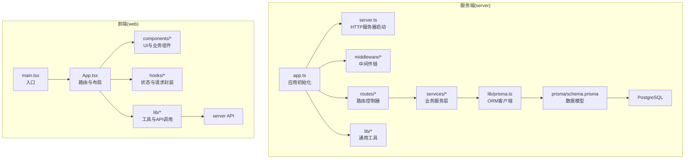
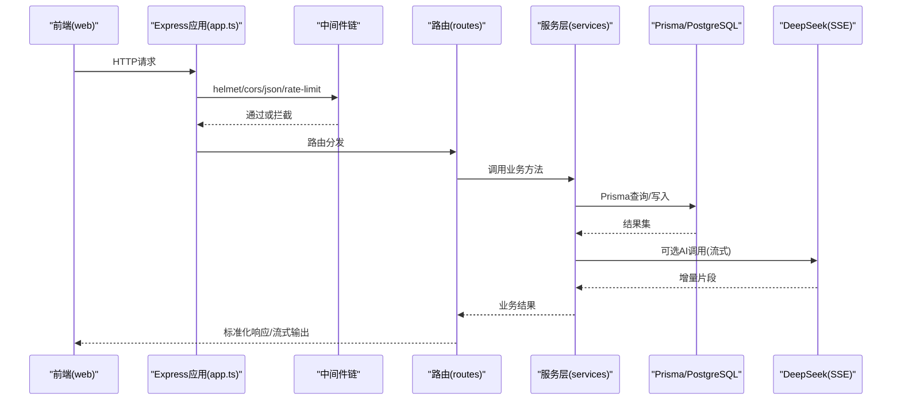
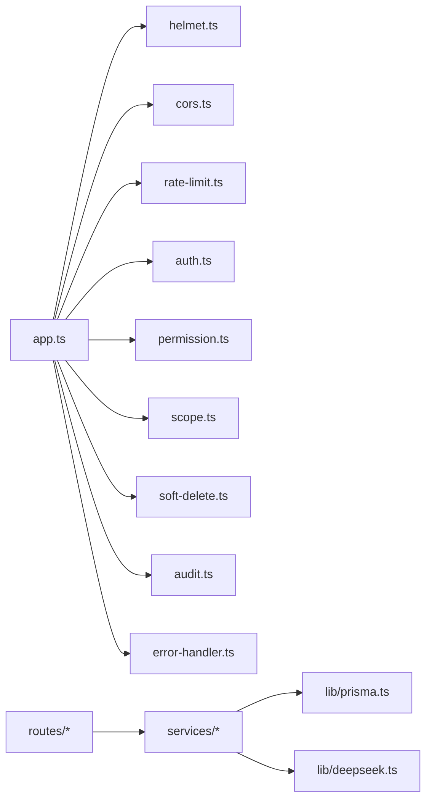

# 编码规范与实现

<cite>
**本文引用的文件**   
- [server/src/app.ts](file://server/src/app.ts)
- [server/src/server.ts](file://server/src/server.ts)
- [server/src/config/env.ts](file://server/src/config/env.ts)
- [server/src/lib/prisma.ts](file://server/src/lib/prisma.ts)
- [server/src/lib/errors.ts](file://server/src/lib/errors.ts)
- [server/src/lib/response.ts](file://server/src/lib/response.ts)
- [server/src/middleware/helmet.ts](file://server/src/middleware/helmet.ts)
- [server/src/middleware/cors.ts](file://server/src/middleware/cors.ts)
- [server/src/middleware/rate-limit.ts](file://server/src/middleware/rate-limit.ts)
- [server/src/middleware/auth.ts](file://server/src/middleware/auth.ts)
- [server/src/middleware/permission.ts](file://server/src/middleware/permission.ts)
- [server/src/middleware/scope.ts](file://server/src/middleware/scope.ts)
- [server/src/middleware/soft-delete.ts](file://server/src/middleware/soft-delete.ts)
- [server/src/middleware/audit.ts](file://server/src/middleware/audit.ts)
- [server/src/middleware/error-handler.ts](file://server/src/middleware/error-handler.ts)
- [server/src/middleware/trace-id.ts](file://server/src/middleware/trace-id.ts)
- [server/src/routes/ai.ts](file://server/src/routes/ai.ts)
- [server/src/services/AIProxyService.ts](file://server/src/services/AIProxyService.ts)
- [server/src/lib/deepseek.ts](file://server/src/lib/deepseek.ts)
- [server/src/lib/prompt-guard.ts](file://server/src/lib/prompt-guard.ts)
- [server/src/lib/formula.ts](file://server/src/lib/formula.ts)
- [server/src/lib/excel-import.ts](file://server/src/lib/excel-import.ts)
- [server/src/lib/jwt.ts](file://server/src/lib/jwt.ts)
- [server/src/lib/logger.ts](file://server/src/lib/logger.ts)
- [server/prisma/schema.prisma](file://server/prisma/schema.prisma)
- [web/src/App.tsx](file://web/src/App.tsx)
- [web/src/main.tsx](file://web/src/main.tsx)
- [web/src/hooks/useAuth.ts](file://web/src/hooks/useAuth.ts)
- [web/src/hooks/api-queries.ts](file://web/src/hooks/api-queries.ts)
- [web/src/lib/api.ts](file://web/src/lib/api.ts)
- [web/src/lib/ai-stream.ts](file://web/src/lib/ai-stream.ts)
- [web/src/components/layout/require-permission.tsx](file://web/src/components/layout/require-permission.tsx)
- [web/src/types/index.ts](file://web/src/types/index.ts)
- [web/package.json](file://web/package.json)
- [web/tsconfig.app.json](file://web/tsconfig.app.json)
- [web/vitest.config.ts](file://web/vitest.config.ts)
- [server/package.json](file://server/package.json)
- [server/tsconfig.json](file://server/tsconfig.json)
- [server/vitest.config.ts](file://server/vitest.config.ts)
</cite>

## 目录
1. [引言](#引言)
2. [项目结构](#项目结构)
3. [核心组件](#核心组件)
4. [架构总览](#架构总览)
5. [详细组件分析](#详细组件分析)
6. [依赖分析](#依赖分析)
7. [性能考虑](#性能考虑)
8. [故障排查指南](#故障排查指南)
9. [结论](#结论)
10. [附录](#附录)

## 引言
本规范面向FY200项目的开发与维护，统一TypeScript编码标准、后端服务层实现、前端组件开发、代码组织与质量工具配置，并补充AI相关功能的工程化实践。项目定位为“Excel进、看板/报表出”的内部管理口径财务数据平台，单位统一为万元/人民币；后端采用Express 4 + Prisma 5 + PostgreSQL 15 + JWT（access 15min + refresh 7day轮转）+ DeepSeek API（SSE流式）。中间件执行链顺序固定：helmet → cors → express.json → rate-limit → auth(JWT+黑名单) → permission(默认拒绝) → scope(Prisma extension) → softDelete → audit → Service → Prisma → PostgreSQL。计算类指标使用安全公式解析（白名单算子 +-*/()，禁止 eval），同比/环比由后端实时计算不存库。AI双管道架构：polish（文本→脱敏→LLM→还原）/ analyze（结构化→计算→脱敏→LLM→生成），脱敏规则：绝对金额→区间，公司名→动态映射。

## 项目结构
本项目采用前后端分离的Monorepo风格，根目录下包含服务端server与前端web两个独立应用，以及共享文档与脚本。

- server：Express后端服务，包含路由、中间件、服务层、工具库、Prisma数据库定义与迁移、测试与脚本。
- web：React前端应用，包含页面、组件、Hooks、类型、构建与测试配置。
- docs/.wiki：项目文档与API参考、数据库Schema等。

图表来源
- [server/src/app.ts](file://server/src/app.ts)
- [server/src/server.ts](file://server/src/server.ts)
- [server/prisma/schema.prisma](file://server/prisma/schema.prisma)
- [web/src/main.tsx](file://web/src/main.tsx)
- [web/src/App.tsx](file://web/src/App.tsx)

章节来源
- [server/src/app.ts](file://server/src/app.ts)
- [server/src/server.ts](file://server/src/server.ts)
- [web/src/main.tsx](file://web/src/main.tsx)
- [web/src/App.tsx](file://web/src/App.tsx)

## 核心组件
- 应用初始化与中间件链：在应用层统一注册安全、跨域、限流、鉴权、权限、作用域、软删除、审计、错误处理等中间件，确保请求生命周期一致性与可观测性。
- 路由与控制器：按领域划分路由文件，职责单一，仅做参数校验、调用服务层、返回标准化响应。
- 服务层：封装业务逻辑与外部依赖（如AI代理、Excel导入、公式计算、JWT签发与校验、指标聚合等），对上层透明。
- ORM与数据访问：通过Prisma进行类型安全的CRUD与扩展（scope），结合迁移管理数据库演进。
- AI代理与流式响应：封装DeepSeek SSE流式接口，提供双管道（polish/analyze）与降级策略。
- 前端能力：基于React Hooks与类型系统，封装API查询、权限控制、流式读取与导出能力。

章节来源
- [server/src/app.ts](file://server/src/app.ts)
- [server/src/routes/ai.ts](file://server/src/routes/ai.ts)
- [server/src/services/AIProxyService.ts](file://server/src/services/AIProxyService.ts)
- [server/src/lib/prisma.ts](file://server/src/lib/prisma.ts)
- [server/src/lib/formula.ts](file://server/src/lib/formula.ts)
- [server/src/lib/excel-import.ts](file://server/src/lib/excel-import.ts)
- [server/src/lib/jwt.ts](file://server/src/lib/jwt.ts)
- [web/src/hooks/api-queries.ts](file://web/src/hooks/api-queries.ts)
- [web/src/lib/ai-stream.ts](file://web/src/lib/ai-stream.ts)

## 架构总览
整体架构遵循分层与关注点分离原则，中间件链保障安全与合规，服务层承载业务，ORM负责数据访问，前端通过API与流式通道交互。

图表来源
- [server/src/app.ts](file://server/src/app.ts)
- [server/src/routes/ai.ts](file://server/src/routes/ai.ts)
- [server/src/services/AIProxyService.ts](file://server/src/services/AIProxyService.ts)
- [server/src/lib/prisma.ts](file://server/src/lib/prisma.ts)
- [server/src/lib/deepseek.ts](file://server/src/lib/deepseek.ts)

## 详细组件分析

### TypeScript编码标准
- 严格模式与类型安全
  - 启用strict、noImplicitAny、noUnusedLocals、noUnusedParameters等，保证编译期发现潜在问题。
  - 所有函数签名需显式标注入参与返回值类型，避免any，优先使用字面量联合类型与泛型约束。
- 接口设计原则
  - 接口以行为为中心，命名清晰，拆分细粒度接口，避免巨型DTO。
  - 对外暴露的API DTO与内部领域模型分离，使用转换器映射。
- 错误处理模式
  - 统一异常类型与错误码，服务层抛出领域错误，中间件捕获并转换为HTTP响应。
  - 异步错误通过包装器统一处理，避免未捕获Promise拒绝。
- 模块与依赖
  - 单文件单职责，按需导入，避免循环依赖；公共能力下沉至lib。
- 前端类型
  - 统一types定义，API响应与表单输入类型明确，使用Zod或运行时校验（如有）。

章节来源
- [server/tsconfig.json](file://server/tsconfig.json)
- [web/tsconfig.app.json](file://web/tsconfig.app.json)
- [server/src/lib/errors.ts](file://server/src/lib/errors.ts)
- [server/src/lib/response.ts](file://server/src/lib/response.ts)
- [web/src/types/index.ts](file://web/src/types/index.ts)

### 后端服务层实现规范
- Express路由设计
  - 路由文件按领域划分，路径简洁，动词明确；仅做参数校验、调用服务、返回响应。
  - 统一响应格式，包含code、message、data等字段。
- Prisma ORM使用
  - 使用schema.prisma定义模型，迁移驱动数据库演进；查询尽量使用select/include减少冗余。
  - 通过扩展实现scope隔离（如租户/组织维度），在服务层注入。
- 中间件开发
  - 中间件职责单一，幂等且无副作用；错误中间件置于链尾，统一格式化错误。
  - 限流、鉴权、权限、审计、追踪ID等中间件顺序固定，不可随意调整。
- 服务层最佳实践
  - 纯函数优先，外部依赖通过参数注入；复杂流程拆分为子步骤，便于测试与复用。
  - 对第三方API（如DeepSeek）封装重试、超时、降级与熔断策略。

章节来源
- [server/src/routes/ai.ts](file://server/src/routes/ai.ts)
- [server/src/lib/prisma.ts](file://server/src/lib/prisma.ts)
- [server/src/middleware/rate-limit.ts](file://server/src/middleware/rate-limit.ts)
- [server/src/middleware/auth.ts](file://server/src/middleware/auth.ts)
- [server/src/middleware/permission.ts](file://server/src/middleware/permission.ts)
- [server/src/middleware/scope.ts](file://server/src/middleware/scope.ts)
- [server/src/middleware/soft-delete.ts](file://server/src/middleware/soft-delete.ts)
- [server/src/middleware/audit.ts](file://server/src/middleware/audit.ts)
- [server/src/middleware/error-handler.ts](file://server/src/middleware/error-handler.ts)
- [server/src/middleware/trace-id.ts](file://server/src/middleware/trace-id.ts)

### 前端组件开发规范
- React Hooks使用
  - 使用useState/useEffect/useMemo/useCallback合理管理状态与副作用；避免过度渲染。
  - 自定义Hook封装通用逻辑（如鉴权、权限、API查询），提高复用性。
- 组件生命周期管理
  - 组件职责单一，props最小化；复杂页面拆分子组件，保持可读性。
  - 清理副作用（定时器、事件监听、订阅）在useEffect中正确释放。
- 事件处理
  - 事件处理器命名清晰，避免闭包陷阱；批量更新状态时使用函数式更新。
- 类型与校验
  - 组件Props使用interface定义，必填字段明确；表单提交前进行本地校验。
- 流式响应处理
  - 使用ReadableStream或EventSource处理SSE，增量渲染，支持取消与错误重试。

章节来源
- [web/src/hooks/useAuth.ts](file://web/src/hooks/useAuth.ts)
- [web/src/hooks/api-queries.ts](file://web/src/hooks/api-queries.ts)
- [web/src/lib/ai-stream.ts](file://web/src/lib/ai-stream.ts)
- [web/src/components/layout/require-permission.tsx](file://web/src/components/layout/require-permission.tsx)

### 代码组织结构
- 文件命名约定
  - 后端：路由routes/*.ts、中间件middleware/*.ts、服务services/*.ts、工具lib/*.ts，测试文件*.test.ts。
  - 前端：组件components/**、页面pages/**、hooks/**、lib/**、types/**，测试文件*.test.tsx。
- 目录结构规范
  - 按功能域组织，避免大杂烩；共享逻辑下沉到lib或common。
  - 配置文件集中管理（环境变量、构建配置、测试配置）。
- 模块依赖管理
  - 依赖声明在package.json，锁定版本；避免循环依赖，必要时引入适配器。

章节来源
- [server/package.json](file://server/package.json)
- [web/package.json](file://web/package.json)

### 代码质量工具配置
- ESLint规则
  - 启用严格规则，禁用宽松选项；统一代码风格与最佳实践。
- Prettier格式化
  - 统一缩进、引号、分号等格式，配合编辑器保存自动格式化。
- TypeScript严格模式
  - 开启strict、noUncheckedIndexedAccess等，提升类型安全。
- 测试框架
  - 后端使用Vitest，覆盖单元测试与集成测试；前端使用Vitest与React Testing Library。

章节来源
- [server/vitest.config.ts](file://server/vitest.config.ts)
- [web/vitest.config.ts](file://web/vitest.config.ts)
- [server/tsconfig.json](file://server/tsconfig.json)
- [web/tsconfig.app.json](file://web/tsconfig.app.json)

### AI相关功能实现规范
- Prompt工程
  - 模板化Prompt，变量替换前进行脱敏；敏感信息（金额、公司名）按规则转换。
  - 提供Prompt校验与白名单机制，防止注入攻击。
- 流式响应处理
  - 后端SSE推送增量片段，前端逐段渲染；支持暂停、恢复、取消与错误重连。
- 错误降级策略
  - 网络异常时回退缓存或默认值；LLM不可用时返回友好提示与离线方案。
  - 双管道（polish/analyze）分别处理文本与结构化数据，失败时降级到安全路径。

章节来源
- [server/src/routes/ai.ts](file://server/src/routes/ai.ts)
- [server/src/services/AIProxyService.ts](file://server/src/services/AIProxyService.ts)
- [server/src/lib/deepseek.ts](file://server/src/lib/deepseek.ts)
- [server/src/lib/prompt-guard.ts](file://server/src/lib/prompt-guard.ts)
- [web/src/lib/ai-stream.ts](file://web/src/lib/ai-stream.ts)

## 依赖分析
- 中间件耦合度低，职责清晰，通过应用层装配形成稳定执行链。
- 服务层依赖ORM与外部API，通过接口抽象降低耦合。
- 前端依赖后端API与流式通道，类型与契约保持一致。

图表来源
- [server/src/app.ts](file://server/src/app.ts)
- [server/src/middleware/helmet.ts](file://server/src/middleware/helmet.ts)
- [server/src/middleware/cors.ts](file://server/src/middleware/cors.ts)
- [server/src/middleware/rate-limit.ts](file://server/src/middleware/rate-limit.ts)
- [server/src/middleware/auth.ts](file://server/src/middleware/auth.ts)
- [server/src/middleware/permission.ts](file://server/src/middleware/permission.ts)
- [server/src/middleware/scope.ts](file://server/src/middleware/scope.ts)
- [server/src/middleware/soft-delete.ts](file://server/src/middleware/soft-delete.ts)
- [server/src/middleware/audit.ts](file://server/src/middleware/audit.ts)
- [server/src/middleware/error-handler.ts](file://server/src/middleware/error-handler.ts)
- [server/src/lib/prisma.ts](file://server/src/lib/prisma.ts)
- [server/src/lib/deepseek.ts](file://server/src/lib/deepseek.ts)

## 性能考虑
- 数据库查询优化：合理使用索引、分页、select/include，避免N+1查询。
- 流式处理：AI响应与大数据导出采用流式传输，降低内存占用与首屏延迟。
- 缓存策略：热点数据缓存（如字典、配置），注意失效与一致性。
- 限流与熔断：对高频接口实施限流，对不稳定外部服务实施熔断与降级。
- 前端渲染：虚拟列表、懒加载、防抖节流，减少重排重绘。

[本节为通用指导，无需特定文件引用]

## 故障排查指南
- 常见问题定位
  - 鉴权失败：检查JWT签发与校验、黑名单、过期时间。
  - 权限不足：确认角色与资源权限配置，默认拒绝策略生效。
  - 数据越权：验证scope扩展是否正确注入，租户/组织隔离是否生效。
  - AI调用失败：检查网络、密钥、限流、降级策略与日志。
- 日志与追踪
  - 使用trace-id贯穿请求链路，记录关键节点耗时与错误。
  - 结构化日志，区分info/warn/error级别，便于检索与分析。
- 错误处理
  - 统一错误码与消息，前端友好提示；服务层抛出领域错误，中间件捕获并返回。

章节来源
- [server/src/lib/jwt.ts](file://server/src/lib/jwt.ts)
- [server/src/middleware/permission.ts](file://server/src/middleware/permission.ts)
- [server/src/middleware/scope.ts](file://server/src/middleware/scope.ts)
- [server/src/lib/logger.ts](file://server/src/lib/logger.ts)
- [server/src/middleware/error-handler.ts](file://server/src/middleware/error-handler.ts)

## 结论
本规范从TypeScript编码、后端服务层、前端组件、代码组织与质量工具、AI工程化等方面提供了系统化指导。遵循本规范可提升代码质量、可维护性与安全性，支撑FY200项目的高效迭代与稳定运行。

[本节为总结性内容，无需特定文件引用]

## 附录
- 环境变量与配置：集中管理敏感信息与开关，避免硬编码。
- 数据库迁移：变更先写迁移，再同步schema，确保环境一致性。
- 测试策略：单元、集成、端到端测试分层覆盖，关键路径必须测试。
- 发布流程：CI/CD流水线自动化构建、测试、部署，灰度发布与回滚预案。

[本节为补充说明，无需特定文件引用]