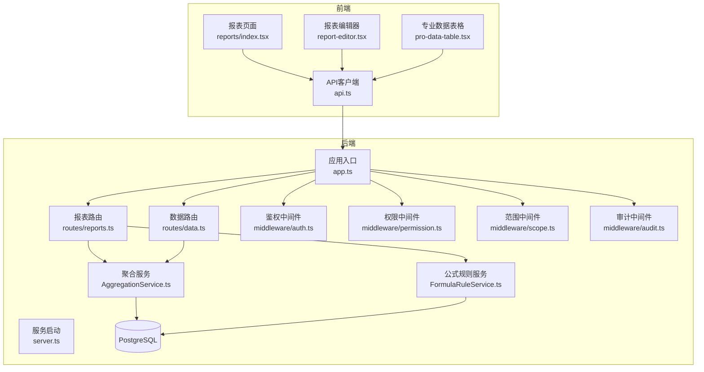
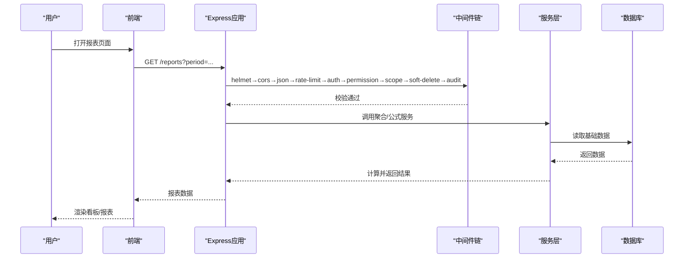
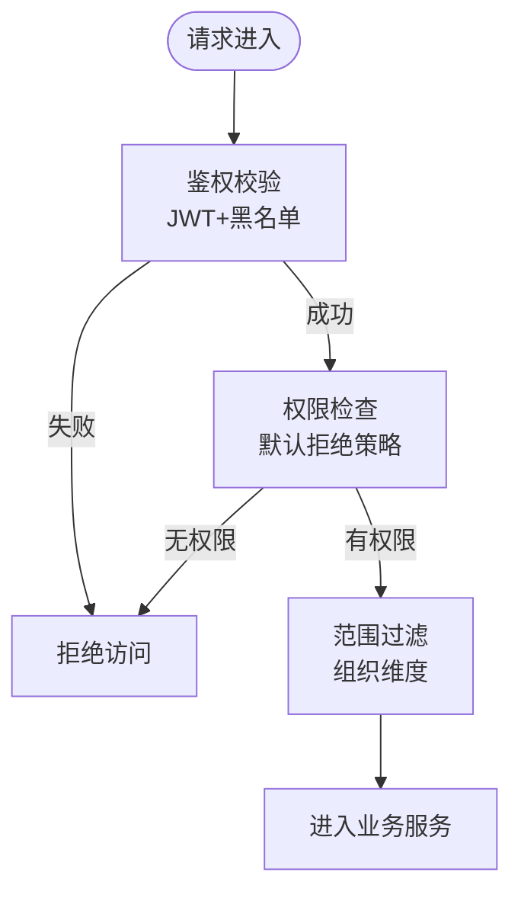
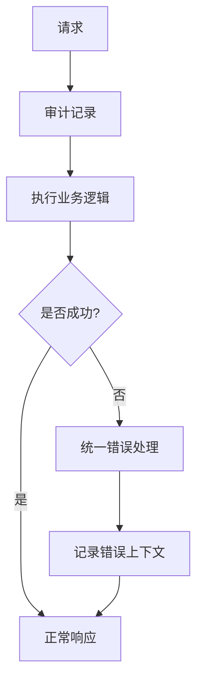
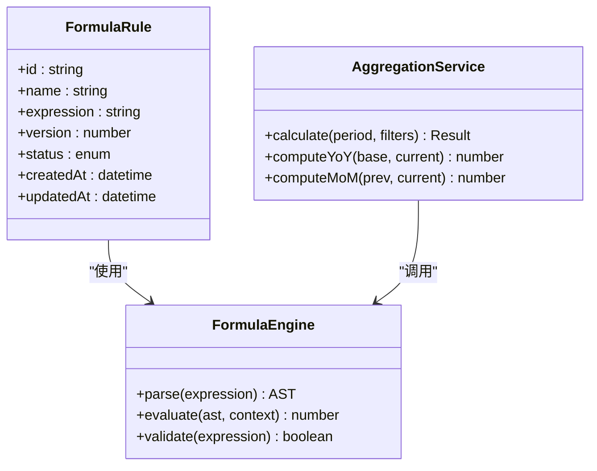
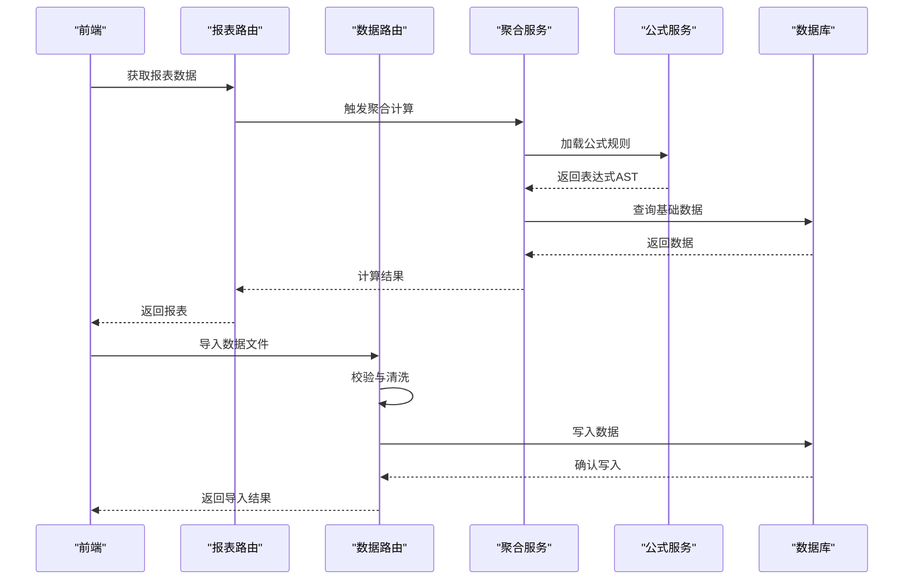
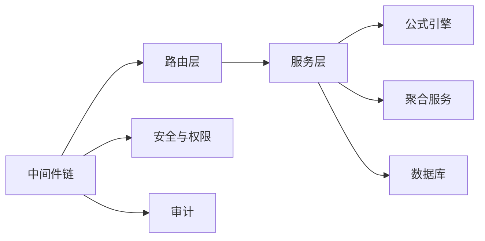

# 需求分析与评审

<cite>
**本文引用的文件**   
- [server/src/app.ts](file://server/src/app.ts)
- [server/src/server.ts](file://server/src/server.ts)
- [server/src/middleware/auth.ts](file://server/src/middleware/auth.ts)
- [server/src/middleware/permission.ts](file://server/src/middleware/permission.ts)
- [server/src/middleware/scope.ts](file://server/src/middleware/scope.ts)
- [server/src/middleware/audit.ts](file://server/src/middleware/audit.ts)
- [server/src/middleware/error-handler.ts](file://server/src/middleware/error-handler.ts)
- [server/src/lib/formula.ts](file://server/src/lib/formula.ts)
- [server/src/services/AggregationService.ts](file://server/src/services/AggregationService.ts)
- [server/src/services/FormulaRuleService.ts](file://server/src/services/FormulaRuleService.ts)
- [server/src/routes/reports.ts](file://server/src/routes/reports.ts)
- [server/src/routes/data.ts](file://server/src/routes/data.ts)
- [server/prisma/schema.prisma](file://server/prisma/schema.prisma)
- [web/src/pages/reports/index.tsx](file://web/src/pages/reports/index.tsx)
- [web/src/pages/reports/report-editor.tsx](file://web/src/pages/reports/report-editor.tsx)
- [web/src/components/data-table/pro-data-table.tsx](file://web/src/components/data-table/pro-data-table.tsx)
- [web/src/lib/api.ts](file://web/src/lib/api.ts)
</cite>

## 目录
1. [引言](#引言)
2. [项目结构](#项目结构)
3. [核心组件](#核心组件)
4. [架构总览](#架构总览)
5. [详细组件分析](#详细组件分析)
6. [依赖分析](#依赖分析)
7. [性能考虑](#性能考虑)
8. [故障排查指南](#故障排查指南)
9. [结论](#结论)
10. [附录](#附录)

## 引言
本指南面向FY200（浙江壹品慧财年经营数据分析平台）的需求分析与评审工作，目标是帮助产品、研发与测试从业务需求出发，完成功能可行性分析、技术风险评估与开发工作量估算；同时规范需求文档编写、评审会议流程、变更管理与需求跟踪机制。结合财务数据分析领域的特殊性，重点强调数据准确性、计算精度控制与审计合规性要求。

## 项目结构
FY200采用前后端分离架构：
- 后端：Express + Prisma + PostgreSQL，提供指标聚合、公式规则、报表生成等能力，并通过中间件链实现安全、权限、范围、审计与错误处理。
- 前端：React + Vite，提供看板、报表编辑、数据导入导出、权限控制等界面能力。

图表来源
- [server/src/app.ts](file://server/src/app.ts)
- [server/src/server.ts](file://server/src/server.ts)
- [server/src/routes/reports.ts](file://server/src/routes/reports.ts)
- [server/src/routes/data.ts](file://server/src/routes/data.ts)
- [server/src/services/AggregationService.ts](file://server/src/services/AggregationService.ts)
- [server/src/services/FormulaRuleService.ts](file://server/src/services/FormulaRuleService.ts)
- [server/src/middleware/auth.ts](file://server/src/middleware/auth.ts)
- [server/src/middleware/permission.ts](file://server/src/middleware/permission.ts)
- [server/src/middleware/scope.ts](file://server/src/middleware/scope.ts)
- [server/src/middleware/audit.ts](file://server/src/middleware/audit.ts)
- [web/src/pages/reports/index.tsx](file://web/src/pages/reports/index.tsx)
- [web/src/pages/reports/report-editor.tsx](file://web/src/pages/reports/report-editor.tsx)
- [web/src/components/data-table/pro-data-table.tsx](file://web/src/components/data-table/pro-data-table.tsx)
- [web/src/lib/api.ts](file://web/src/lib/api.ts)

章节来源
- [server/src/app.ts](file://server/src/app.ts)
- [server/src/server.ts](file://server/src/server.ts)
- [server/prisma/schema.prisma](file://server/prisma/schema.prisma)

## 核心组件
- 中间件链：helmet → cors → express.json → rate-limit → auth(JWT+黑名单) → permission(默认拒绝) → scope(Prisma扩展) → soft-delete → audit → Service → Prisma → PostgreSQL。该顺序确保请求在到达业务逻辑前已完成安全、权限、范围与审计前置校验。
- 公式引擎：基于白名单算子（+-*/()）的安全解析执行，禁止eval，保障计算安全与可审计。
- 聚合服务：负责同比/环比等实时计算，不持久化中间结果，保证口径一致性与时效性。
- 报表与数据路由：对外暴露REST接口，承载报表查询、数据导入导出、指标计算等能力。
- 前端报表与表格：提供报表编辑、数据展示、分页与筛选等交互能力，通过统一API客户端调用后端。

章节来源
- [server/src/middleware/auth.ts](file://server/src/middleware/auth.ts)
- [server/src/middleware/permission.ts](file://server/src/middleware/permission.ts)
- [server/src/middleware/scope.ts](file://server/src/middleware/scope.ts)
- [server/src/middleware/audit.ts](file://server/src/middleware/audit.ts)
- [server/src/lib/formula.ts](file://server/src/lib/formula.ts)
- [server/src/services/AggregationService.ts](file://server/src/services/AggregationService.ts)
- [server/src/services/FormulaRuleService.ts](file://server/src/services/FormulaRuleService.ts)
- [server/src/routes/reports.ts](file://server/src/routes/reports.ts)
- [server/src/routes/data.ts](file://server/src/routes/data.ts)
- [web/src/pages/reports/index.tsx](file://web/src/pages/reports/index.tsx)
- [web/src/pages/reports/report-editor.tsx](file://web/src/pages/reports/report-editor.tsx)
- [web/src/components/data-table/pro-data-table.tsx](file://web/src/components/data-table/pro-data-table.tsx)
- [web/src/lib/api.ts](file://web/src/lib/api.ts)

## 架构总览
系统以“Excel进、看板/报表出”为核心定位，单位统一为万元/人民币。关键流程包括：
- 用户登录与鉴权：JWT短效访问令牌与长效刷新令牌轮转，配合黑名单机制提升安全性。
- 权限与范围：默认拒绝策略，按角色与组织范围限制数据可见性。
- 审计追踪：所有关键操作记录审计日志，满足合规要求。
- 计算与报表：公式规则驱动的计算与聚合服务，确保口径一致与可追溯。

图表来源
- [server/src/app.ts](file://server/src/app.ts)
- [server/src/middleware/auth.ts](file://server/src/middleware/auth.ts)
- [server/src/middleware/permission.ts](file://server/src/middleware/permission.ts)
- [server/src/middleware/scope.ts](file://server/src/middleware/scope.ts)
- [server/src/middleware/audit.ts](file://server/src/middleware/audit.ts)
- [server/src/services/AggregationService.ts](file://server/src/services/AggregationService.ts)
- [server/src/services/FormulaRuleService.ts](file://server/src/services/FormulaRuleService.ts)

## 详细组件分析

### 鉴权与权限中间件
- 鉴权：验证JWT有效性，支持黑名单拦截，确保会话安全。
- 权限：默认拒绝策略，需显式授权；结合角色与资源维度进行细粒度控制。
- 范围：通过Prisma扩展注入组织范围过滤，避免越权访问。

图表来源
- [server/src/middleware/auth.ts](file://server/src/middleware/auth.ts)
- [server/src/middleware/permission.ts](file://server/src/middleware/permission.ts)
- [server/src/middleware/scope.ts](file://server/src/middleware/scope.ts)

章节来源
- [server/src/middleware/auth.ts](file://server/src/middleware/auth.ts)
- [server/src/middleware/permission.ts](file://server/src/middleware/permission.ts)
- [server/src/middleware/scope.ts](file://server/src/middleware/scope.ts)

### 审计与错误处理
- 审计：对关键操作进行记录，包含操作人、时间、资源与结果，便于事后追溯与合规审计。
- 错误处理：统一异常捕获与响应格式，便于前端友好提示与问题定位。

图表来源
- [server/src/middleware/audit.ts](file://server/src/middleware/audit.ts)
- [server/src/middleware/error-handler.ts](file://server/src/middleware/error-handler.ts)

章节来源
- [server/src/middleware/audit.ts](file://server/src/middleware/audit.ts)
- [server/src/middleware/error-handler.ts](file://server/src/middleware/error-handler.ts)

### 公式规则与计算引擎
- 公式规则：定义指标计算表达式，使用白名单算子确保安全执行。
- 计算引擎：解析并执行公式，支持加减乘除与括号组合，禁止任意代码执行。
- 版本管理：公式变更需保留历史版本，确保可回溯与一致性。

图表来源
- [server/src/lib/formula.ts](file://server/src/lib/formula.ts)
- [server/src/services/FormulaRuleService.ts](file://server/src/services/FormulaRuleService.ts)
- [server/src/services/AggregationService.ts](file://server/src/services/AggregationService.ts)

章节来源
- [server/src/lib/formula.ts](file://server/src/lib/formula.ts)
- [server/src/services/FormulaRuleService.ts](file://server/src/services/FormulaRuleService.ts)
- [server/src/services/AggregationService.ts](file://server/src/services/AggregationService.ts)

### 报表与数据路由
- 报表路由：提供报表查询、模板渲染、导出等功能。
- 数据路由：支持数据导入、清洗、校验与入库。
- 前端集成：报表页面与编辑器通过API客户端调用后端接口，实现数据展示与编辑。

图表来源
- [server/src/routes/reports.ts](file://server/src/routes/reports.ts)
- [server/src/routes/data.ts](file://server/src/routes/data.ts)
- [server/src/services/AggregationService.ts](file://server/src/services/AggregationService.ts)
- [server/src/services/FormulaRuleService.ts](file://server/src/services/FormulaRuleService.ts)
- [web/src/pages/reports/index.tsx](file://web/src/pages/reports/index.tsx)
- [web/src/pages/reports/report-editor.tsx](file://web/src/pages/reports/report-editor.tsx)
- [web/src/lib/api.ts](file://web/src/lib/api.ts)

章节来源
- [server/src/routes/reports.ts](file://server/src/routes/reports.ts)
- [server/src/routes/data.ts](file://server/src/routes/data.ts)
- [web/src/pages/reports/index.tsx](file://web/src/pages/reports/index.tsx)
- [web/src/pages/reports/report-editor.tsx](file://web/src/pages/reports/report-editor.tsx)
- [web/src/lib/api.ts](file://web/src/lib/api.ts)

## 依赖分析
- 模块耦合：中间件链强依赖顺序，任何环节异常都会影响后续流程。
- 外部依赖：PostgreSQL作为数据源，Prisma作为ORM，JWT用于鉴权。
- 内部依赖：路由依赖服务层，服务层依赖公式与聚合逻辑，均依赖数据库。

图表来源
- [server/src/app.ts](file://server/src/app.ts)
- [server/src/routes/reports.ts](file://server/src/routes/reports.ts)
- [server/src/routes/data.ts](file://server/src/routes/data.ts)
- [server/src/services/AggregationService.ts](file://server/src/services/AggregationService.ts)
- [server/src/services/FormulaRuleService.ts](file://server/src/services/FormulaRuleService.ts)
- [server/src/middleware/auth.ts](file://server/src/middleware/auth.ts)
- [server/src/middleware/permission.ts](file://server/src/middleware/permission.ts)
- [server/src/middleware/audit.ts](file://server/src/middleware/audit.ts)

章节来源
- [server/src/app.ts](file://server/src/app.ts)
- [server/prisma/schema.prisma](file://server/prisma/schema.prisma)

## 性能考虑
- 计算优化：同比/环比等实时计算避免持久化中间结果，减少存储压力。
- 缓存策略：对热点报表数据可引入缓存层，降低重复计算开销。
- 查询优化：合理使用索引与分页，避免全表扫描与大结果集传输。
- 并发控制：限流中间件保护后端免受突发流量冲击。

## 故障排查指南
- 鉴权失败：检查JWT有效期、黑名单状态与签名配置。
- 权限不足：确认角色与资源映射是否正确，默认拒绝策略是否被正确覆盖。
- 范围越权：核查组织范围过滤条件是否生效。
- 公式错误：验证表达式语法与白名单算子，检查上下文变量是否存在。
- 审计缺失：确认审计中间件是否注册且参数完整。
- 错误响应：查看统一错误处理器日志，定位具体异常堆栈。

章节来源
- [server/src/middleware/auth.ts](file://server/src/middleware/auth.ts)
- [server/src/middleware/permission.ts](file://server/src/middleware/permission.ts)
- [server/src/middleware/scope.ts](file://server/src/middleware/scope.ts)
- [server/src/middleware/audit.ts](file://server/src/middleware/audit.ts)
- [server/src/middleware/error-handler.ts](file://server/src/middleware/error-handler.ts)
- [server/src/lib/formula.ts](file://server/src/lib/formula.ts)

## 结论
FY200项目以安全、准确、可审计为核心目标，通过严格的中间件链、安全的公式引擎与清晰的职责分层，构建了稳健的财务数据分析平台。需求分析与评审应围绕业务价值、技术可行性与合规要求展开，确保每个需求都有明确的验收标准、边界条件与跟踪机制。

## 附录

### 需求文档编写规范
- 用户故事描述：明确角色、目标与价值，例如“作为财务分析师，我希望按期间查看利润趋势，以便进行经营决策”。
- 验收标准定义：量化可测试的条件，如“利润趋势图需支持年/季/月切换，误差率不超过0.01%”。
- 边界条件说明：包括空数据、极端值、非法输入、权限不足等场景的处理方式。
- 非功能性需求：性能、可用性、安全性、合规性等要求需明确阈值与验证方法。

### 需求评审会议流程
- 参与人员：产品经理、架构师、后端/前端开发、测试、合规代表。
- 讨论要点：业务价值、技术可行性、风险点、工作量估算、验收标准、合规要求。
- 决策记录：形成会议纪要，明确优先级、里程碑与责任人，纳入需求跟踪系统。

### 需求变更管理流程
- 变更申请：提交变更单，说明背景、影响范围与预期收益。
- 影响分析：评估对现有功能、数据结构、接口与合规的影响。
- 版本规划：确定纳入版本、回滚策略与发布计划。
- 审批与执行：经评审通过后进入开发、测试与发布流程。

### 需求跟踪机制
- 需求ID：唯一标识，贯穿设计、开发、测试与上线。
- 状态流转：待评审→已批准→开发中→测试中→已发布→已关闭。
- 关联关系：需求与任务、缺陷、变更单的关联映射。
- 一致性校验：定期比对需求与实现差异，确保交付符合预期。

### 财务数据分析特殊考虑
- 数据准确性：金额单位统一为万元/人民币，计算过程避免浮点误差，必要时使用高精度库。
- 计算精度控制：同比/环比保留小数位数一致，四舍五入规则明确。
- 审计合规性：所有关键操作留痕，支持审计追溯；敏感信息脱敏处理。
- 公式安全：仅允许白名单算子，禁止任意代码执行，防止注入攻击。