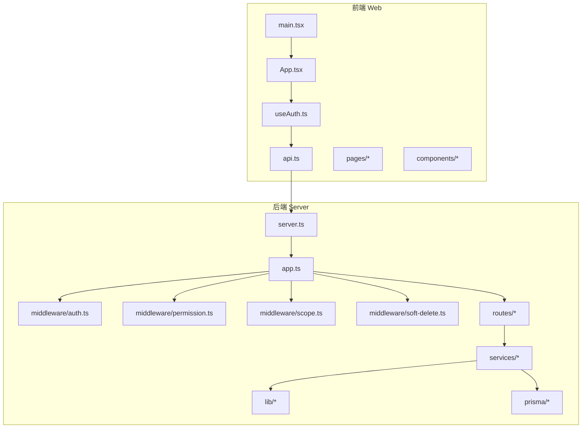
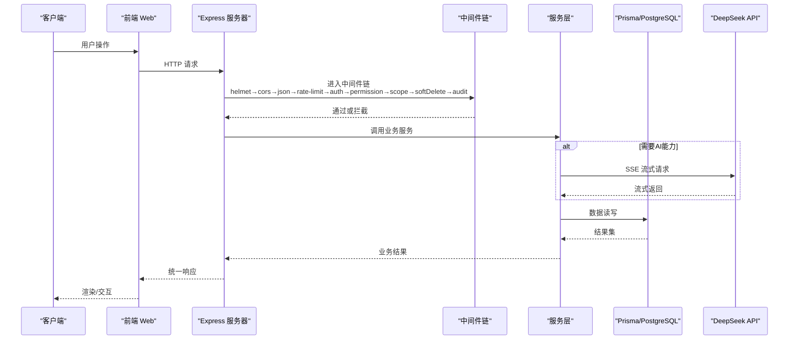
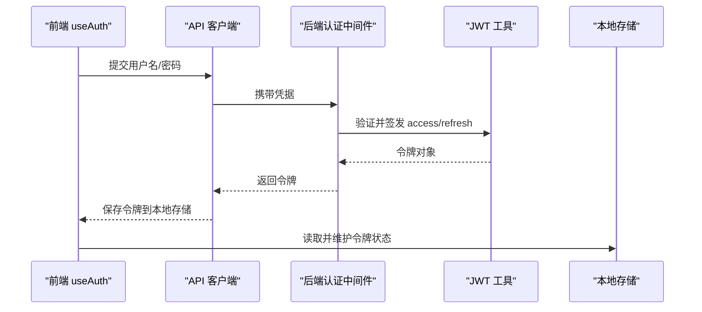
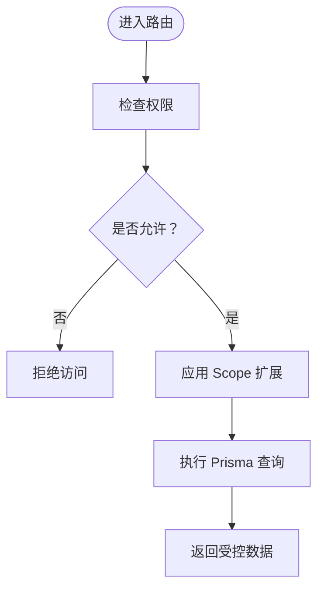
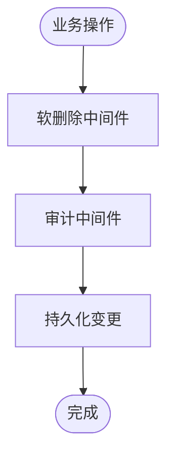
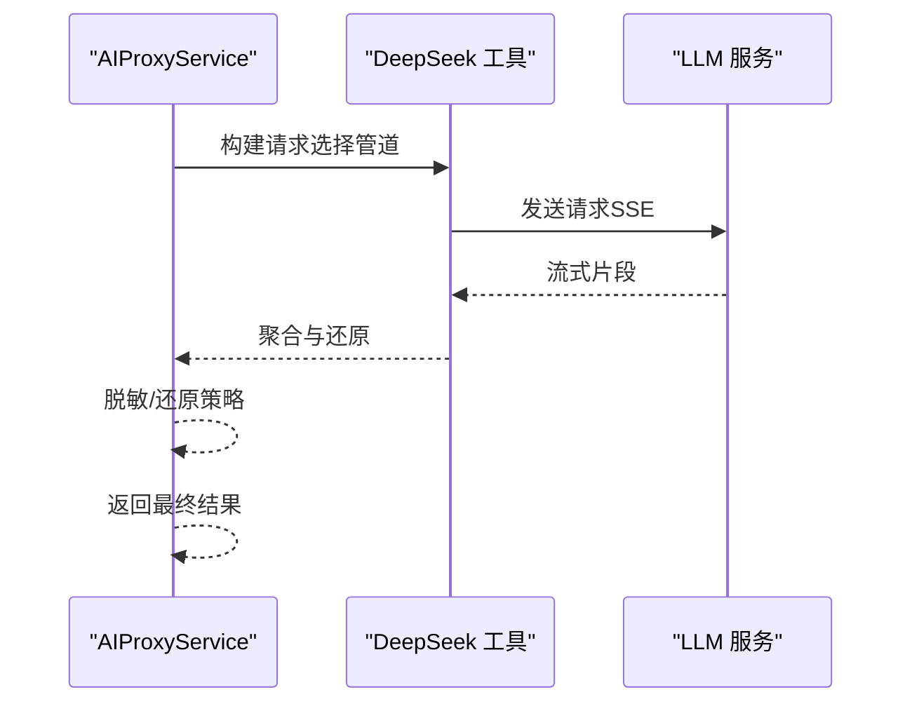
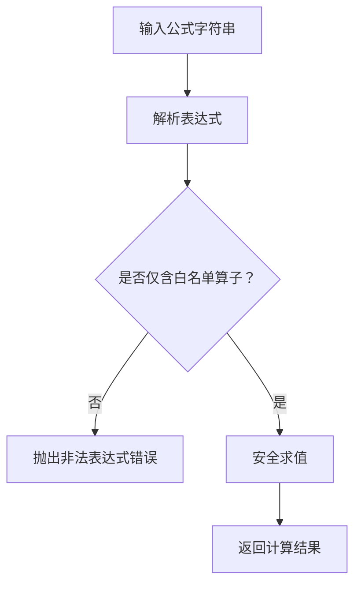
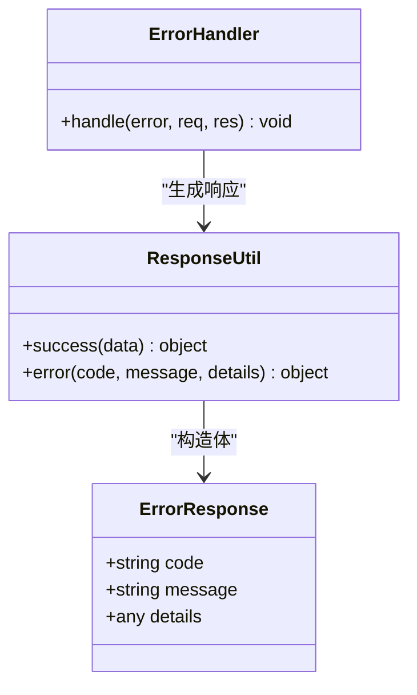
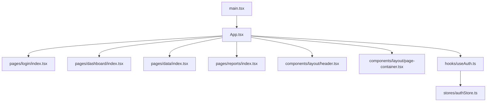
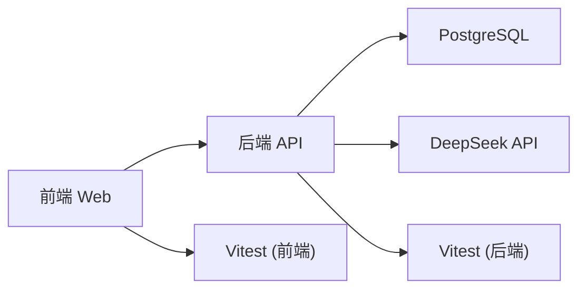

# 贡献指南

<cite>
**本文引用的文件**   
- [server/package.json](file://server/package.json)
- [web/package.json](file://web/package.json)
- [server/src/app.ts](file://server/src/app.ts)
- [server/src/server.ts](file://server/src/server.ts)
- [server/src/middleware/auth.ts](file://server/src/middleware/auth.ts)
- [server/src/middleware/permission.ts](file://server/src/middleware/permission.ts)
- [server/src/middleware/scope.ts](file://server/src/middleware/scope.ts)
- [server/src/middleware/soft-delete.ts](file://server/src/middleware/soft-delete.ts)
- [server/src/middleware/error-handler.ts](file://server/src/middleware/error-handler.ts)
- [server/src/lib/errors.ts](file://server/src/lib/errors.ts)
- [server/src/lib/response.ts](file://server/src/lib/response.ts)
- [server/src/lib/jwt.ts](file://server/src/lib/jwt.ts)
- [server/src/lib/formula.ts](file://server/src/lib/formula.ts)
- [server/src/lib/deepseek.ts](file://server/src/lib/deepseek.ts)
- [server/src/services/AIProxyService.ts](file://server/src/services/AIProxyService.ts)
- [server/prisma/schema.prisma](file://server/prisma/schema.prisma)
- [server/scripts/local-db.ts](file://server/scripts/local-db.ts)
- [web/src/App.tsx](file://web/src/App.tsx)
- [web/src/main.tsx](file://web/src/main.tsx)
- [web/src/hooks/useAuth.ts](file://web/src/hooks/useAuth.ts)
- [web/src/lib/api.ts](file://web/src/lib/api.ts)
- [web/src/lib/constants.ts](file://web/src/lib/constants.ts)
- [web/src/pages/login/index.tsx](file://web/src/pages/login/index.tsx)
- [web/src/pages/dashboard/index.tsx](file://web/src/pages/dashboard/index.tsx)
- [web/src/components/layout/header.tsx](file://web/src/components/layout/header.tsx)
- [web/src/components/layout/page-container.tsx](file://web/src/components/layout/page-container.tsx)
- [web/src/stores/authStore.ts](file://web/src/stores/authStore.ts)
- [web/src/test/setup.ts](file://web/src/test/setup.ts)
- [web/vitest.config.ts](file://web/vitest.config.ts)
- [server/vitest.config.ts](file://server/vitest.config.ts)
- [server/.gitignore](file://server/.gitignore)
- [web/.gitignore](file://web/.gitignore)
- [.gitignore](file://.gitignore)
- [docs/references/backend.md](file://docs/references/backend.md)
- [docs/references/frontend.md](file://docs/references/frontend.md)
- [docs/references/devops.md](file://docs/references/devops.md)
- [docs/references/observability.md](file://docs/references/observability.md)
- [docs/references/performance.md](file://docs/references/performance.md)
- [docs/plans/安全与权限规范.md](file://docs/plans/安全与权限规范.md)
- [docs/plans/数据模型规范.md](file://docs/plans/数据模型规范.md)
- [docs/plans/frontend-design-proposal.md](file://docs/plans/frontend-design-proposal.md)
- [docs/项目进度状态报告-2026-07-24.md](file://docs/项目进度状态报告-2026-07-24.md)
</cite>

## 目录
1. [简介](#简介)
2. [项目结构](#项目结构)
3. [核心组件](#核心组件)
4. [架构总览](#架构总览)
5. [详细组件分析](#详细组件分析)
6. [依赖关系分析](#依赖关系分析)
7. [性能考量](#性能考量)
8. [故障排查指南](#故障排查指南)
9. [结论](#结论)
10. [附录](#附录)

## 简介
本贡献指南面向所有希望参与 FY200（浙江壹品慧财年经营数据分析平台）开发的贡献者。FY200 定位为“Excel进、看板/报表出”的内部管理口径财务数据平台，单位统一为万元/人民币。后端采用 Express 4 + Prisma 5 + PostgreSQL 15 + JWT（access 15min + refresh 7day 轮转）+ DeepSeek API（SSE 流式）。中间件执行链顺序：helmet → cors → express.json → rate-limit → auth(JWT+黑名单) → permission(默认拒绝) → scope(Prisma extension) → softDelete → audit → Service → Prisma → PostgreSQL。计算类指标使用安全公式解析（白名单算子 +-*/()，禁止 eval），同比/环比由后端实时计算不存库。AI 双管道架构：polish（文本→脱敏→LLM→还原）/ analyze（结构化→计算→脱敏→LLM→生成），脱敏规则：绝对金额→区间，公司名→动态映射。

本指南将帮助你快速上手并高效协作，涵盖 Fork、分支、提交、Issue/Bug 规范、新功能开发流程、文档贡献方式、社区参与、开源协议与合规要求，以及发布流程与版本管理策略。

## 项目结构
FY200 采用前后端分离的 Monorepo 风格组织：
- server：Express 后端服务，包含路由、中间件、服务层、工具库、数据库迁移与种子数据、测试脚本等。
- web：React/Vite 前端应用，包含页面、组件、Hooks、状态管理、API 客户端、样式与测试配置等。
- docs：项目文档与参考，包括后端、前端、DevOps、可观测性、性能等参考文档，以及计划与设计文档。
- .wiki：Wiki 内容，如 API 参考、数据库 Schema、入门指南等。

图表来源
- [web/src/main.tsx](file://web/src/main.tsx)
- [web/src/App.tsx](file://web/src/App.tsx)
- [web/src/hooks/useAuth.ts](file://web/src/hooks/useAuth.ts)
- [web/src/lib/api.ts](file://web/src/lib/api.ts)
- [server/src/server.ts](file://server/src/server.ts)
- [server/src/app.ts](file://server/src/app.ts)
- [server/src/middleware/auth.ts](file://server/src/middleware/auth.ts)
- [server/src/middleware/permission.ts](file://server/src/middleware/permission.ts)
- [server/src/middleware/scope.ts](file://server/src/middleware/scope.ts)
- [server/src/middleware/soft-delete.ts](file://server/src/middleware/soft-delete.ts)
- [server/prisma/schema.prisma](file://server/prisma/schema.prisma)

章节来源
- [server/package.json](file://server/package.json)
- [web/package.json](file://web/package.json)
- [docs/references/backend.md](file://docs/references/backend.md)
- [docs/references/frontend.md](file://docs/references/frontend.md)

## 核心组件
- 认证与授权
  - JWT access/refresh 令牌轮转，黑名单校验，权限默认拒绝，基于 Prisma extension 的 scope 控制数据范围。
- 安全与合规
  - helmet/cors/rate-limit 中间件；敏感信息脱敏；公式白名单解析；审计日志。
- AI 代理
  - SSE 流式响应；双管道 polish/analyze；脱敏与还原；结构化计算。
- 数据与持久化
  - Prisma schema、迁移、种子数据；PostgreSQL 15。
- 错误处理与响应
  - 统一错误类型与响应封装。

章节来源
- [server/src/middleware/auth.ts](file://server/src/middleware/auth.ts)
- [server/src/middleware/permission.ts](file://server/src/middleware/permission.ts)
- [server/src/middleware/scope.ts](file://server/src/middleware/scope.ts)
- [server/src/middleware/soft-delete.ts](file://server/src/middleware/soft-delete.ts)
- [server/src/lib/jwt.ts](file://server/src/lib/jwt.ts)
- [server/src/lib/formula.ts](file://server/src/lib/formula.ts)
- [server/src/lib/deepseek.ts](file://server/src/lib/deepseek.ts)
- [server/src/services/AIProxyService.ts](file://server/src/services/AIProxyService.ts)
- [server/prisma/schema.prisma](file://server/prisma/schema.prisma)
- [server/src/lib/errors.ts](file://server/src/lib/errors.ts)
- [server/src/lib/response.ts](file://server/src/lib/response.ts)

## 架构总览
FY200 采用分层架构与中间件链模式，确保请求在到达业务逻辑前经过安全、鉴权、限流、审计等保障。

图表来源
- [server/src/server.ts](file://server/src/server.ts)
- [server/src/app.ts](file://server/src/app.ts)
- [server/src/middleware/auth.ts](file://server/src/middleware/auth.ts)
- [server/src/middleware/permission.ts](file://server/src/middleware/permission.ts)
- [server/src/middleware/scope.ts](file://server/src/middleware/scope.ts)
- [server/src/middleware/soft-delete.ts](file://server/src/middleware/soft-delete.ts)
- [server/src/services/AIProxyService.ts](file://server/src/services/AIProxyService.ts)
- [server/src/lib/deepseek.ts](file://server/src/lib/deepseek.ts)
- [server/prisma/schema.prisma](file://server/prisma/schema.prisma)

## 详细组件分析

### 认证与授权流程
- 登录与令牌轮转：前端登录后获取 access/refresh 令牌，按策略刷新 access 令牌，refresh 令牌有效期更长。
- 权限控制：默认拒绝，需显式授予；结合 scope 限制数据范围。
- 黑名单校验：支持登出或吊销令牌。

图表来源
- [web/src/hooks/useAuth.ts](file://web/src/hooks/useAuth.ts)
- [web/src/lib/api.ts](file://web/src/lib/api.ts)
- [server/src/middleware/auth.ts](file://server/src/middleware/auth.ts)
- [server/src/lib/jwt.ts](file://server/src/lib/jwt.ts)
- [web/src/stores/authStore.ts](file://web/src/stores/authStore.ts)

章节来源
- [server/src/middleware/auth.ts](file://server/src/middleware/auth.ts)
- [server/src/lib/jwt.ts](file://server/src/lib/jwt.ts)
- [web/src/hooks/useAuth.ts](file://web/src/hooks/useAuth.ts)
- [web/src/stores/authStore.ts](file://web/src/stores/authStore.ts)

### 权限与数据范围控制
- 权限默认拒绝，需在路由或服务层显式放行。
- Scope 通过 Prisma extension 注入查询条件，实现行级数据隔离。

图表来源
- [server/src/middleware/permission.ts](file://server/src/middleware/permission.ts)
- [server/src/middleware/scope.ts](file://server/src/middleware/scope.ts)
- [server/prisma/schema.prisma](file://server/prisma/schema.prisma)

章节来源
- [server/src/middleware/permission.ts](file://server/src/middleware/permission.ts)
- [server/src/middleware/scope.ts](file://server/src/middleware/scope.ts)

### 软删除与审计
- 软删除：逻辑删除标记，避免物理删除导致的数据不一致。
- 审计：记录关键操作上下文，便于追踪与回溯。

图表来源
- [server/src/middleware/soft-delete.ts](file://server/src/middleware/soft-delete.ts)

章节来源
- [server/src/middleware/soft-delete.ts](file://server/src/middleware/soft-delete.ts)

### AI 代理与双管道
- Polish 管道：文本输入→脱敏→LLM→还原输出。
- Analyze 管道：结构化数据→计算→脱敏→LLM→生成结果。
- SSE 流式：提升大模型响应体验。

图表来源
- [server/src/services/AIProxyService.ts](file://server/src/services/AIProxyService.ts)
- [server/src/lib/deepseek.ts](file://server/src/lib/deepseek.ts)

章节来源
- [server/src/services/AIProxyService.ts](file://server/src/services/AIProxyService.ts)
- [server/src/lib/deepseek.ts](file://server/src/lib/deepseek.ts)

### 安全公式解析
- 白名单算子：仅允许 +-*/()，禁止 eval。
- 实时计算：同比/环比在后端计算，不入库。

图表来源
- [server/src/lib/formula.ts](file://server/src/lib/formula.ts)

章节来源
- [server/src/lib/formula.ts](file://server/src/lib/formula.ts)

### 错误处理与统一响应
- 统一错误类型与响应封装，便于前端一致处理。
- 中间件捕获异常并返回标准格式。

图表来源
- [server/src/middleware/error-handler.ts](file://server/src/middleware/error-handler.ts)
- [server/src/lib/response.ts](file://server/src/lib/response.ts)
- [server/src/lib/errors.ts](file://server/src/lib/errors.ts)

章节来源
- [server/src/middleware/error-handler.ts](file://server/src/middleware/error-handler.ts)
- [server/src/lib/response.ts](file://server/src/lib/response.ts)
- [server/src/lib/errors.ts](file://server/src/lib/errors.ts)

### 前端应用与路由
- 入口与根组件：Vite 启动，挂载 React 应用。
- 页面与布局：登录、仪表盘、报表、数据管理等页面；头部与容器布局。
- 状态与鉴权：useAuth Hook 与本地存储管理令牌。

图表来源
- [web/src/main.tsx](file://web/src/main.tsx)
- [web/src/App.tsx](file://web/src/App.tsx)
- [web/src/pages/login/index.tsx](file://web/src/pages/login/index.tsx)
- [web/src/pages/dashboard/index.tsx](file://web/src/pages/dashboard/index.tsx)
- [web/src/components/layout/header.tsx](file://web/src/components/layout/header.tsx)
- [web/src/components/layout/page-container.tsx](file://web/src/components/layout/page-container.tsx)
- [web/src/hooks/useAuth.ts](file://web/src/hooks/useAuth.ts)
- [web/src/stores/authStore.ts](file://web/src/stores/authStore.ts)

章节来源
- [web/src/main.tsx](file://web/src/main.tsx)
- [web/src/App.tsx](file://web/src/App.tsx)
- [web/src/pages/login/index.tsx](file://web/src/pages/login/index.tsx)
- [web/src/pages/dashboard/index.tsx](file://web/src/pages/dashboard/index.tsx)
- [web/src/components/layout/header.tsx](file://web/src/components/layout/header.tsx)
- [web/src/components/layout/page-container.tsx](file://web/src/components/layout/page-container.tsx)
- [web/src/hooks/useAuth.ts](file://web/src/hooks/useAuth.ts)
- [web/src/stores/authStore.ts](file://web/src/stores/authStore.ts)

## 依赖关系分析
- 后端依赖：Express、Prisma、PostgreSQL、JWT、DeepSeek API。
- 前端依赖：React、Vite、Tailwind、状态管理与 API 客户端。
- 测试：Vitest 用于前后端单元测试与集成测试。

图表来源
- [server/package.json](file://server/package.json)
- [web/package.json](file://web/package.json)
- [server/vitest.config.ts](file://server/vitest.config.ts)
- [web/vitest.config.ts](file://web/vitest.config.ts)

章节来源
- [server/package.json](file://server/package.json)
- [web/package.json](file://web/package.json)
- [server/vitest.config.ts](file://server/vitest.config.ts)
- [web/vitest.config.ts](file://web/vitest.config.ts)

## 性能考量
- 中间件优化：合理设置 rate-limit 与缓存策略，减少不必要的计算。
- 公式计算：使用白名单解析，避免昂贵且危险的 eval。
- AI 流式：SSE 提升用户体验，注意服务端资源占用与超时控制。
- 数据库查询：利用 Prisma extension 的 scope 精准过滤，减少数据传输。

[本节为通用指导，无需引用具体文件]

## 故障排查指南
- 常见问题
  - 认证失败：检查 JWT 配置、黑名单、令牌过期策略。
  - 权限拒绝：确认路由权限声明与角色匹配。
  - 数据范围异常：核查 scope 扩展是否正确注入。
  - 公式解析错误：检查算子白名单与表达式合法性。
  - AI 响应异常：查看 SSE 连接与流式数据处理。
- 调试建议
  - 启用审计日志与 trace-id，定位问题链路。
  - 使用本地数据库脚本初始化环境，复现问题。
  - 前后端分别运行单元测试与集成测试，缩小问题范围。

章节来源
- [server/src/middleware/error-handler.ts](file://server/src/middleware/error-handler.ts)
- [server/src/lib/errors.ts](file://server/src/lib/errors.ts)
- [server/scripts/local-db.ts](file://server/scripts/local-db.ts)
- [web/src/test/setup.ts](file://web/src/test/setup.ts)

## 结论
FY200 以清晰的分层架构与严格的中间件链保障系统的安全性与可维护性。遵循本贡献指南，你将能够高效参与项目开发、提交高质量代码、提出有效问题与建议，并与社区共同推动项目演进。

[本节为总结，无需引用具体文件]

## 附录

### 如何参与开发（Fork、分支、提交）
- Fork 仓库到你的账户。
- 克隆本地仓库，创建功能分支（建议命名：feature/xxx、fix/xxx、docs/xxx）。
- 编写代码与测试，确保通过 lint 与测试套件。
- 提交 commit，遵循约定式提交规范（feat/fix/docs/chore 等）。
- 推送分支并发起 Pull Request，描述变更内容与影响范围。
- 等待代码审查与 CI 通过后合并。

[本节为通用流程说明，无需引用具体文件]

### Issue 报告与 Bug 提交规范
- 标题：简明扼要，包含模块与问题类型。
- 描述模板：
  - 问题概述：发生了什么，期望行为是什么。
  - 复现步骤：详细列出操作步骤。
  - 环境信息：操作系统、浏览器/Node 版本、数据库版本等。
  - 截图/日志：提供必要证据。
- 标签：根据模块与优先级打标签（bug/enhancement/documentation）。
- 跟进：及时回复维护者提问，提供补充信息。

[本节为通用规范说明，无需引用具体文件]

### 新功能开发流程
- 需求讨论：在 Issue 或讨论区明确需求背景与目标。
- 技术方案设计：输出设计文档，包含接口定义、数据模型、流程图。
- 代码实现：按模块拆分，编写单元测试与集成测试。
- 测试验证：本地与 CI 环境验证，确保无回归。
- 评审与合并：提交 PR，接受审查意见，迭代完善后合并。

[本节为通用流程说明，无需引用具体文件]

### 文档贡献方式
- 文档结构：
  - docs/references：后端、前端、DevOps、可观测性、性能等参考文档。
  - docs/plans：计划与设计文档，如安全与权限规范、数据模型规范、前端设计提案。
  - .wiki：Wiki 内容，如 API 参考、数据库 Schema、入门指南。
- 写作规范：
  - 使用 Markdown，保持标题层级清晰。
  - 提供示例与链接，确保可追溯。
  - 更新相关代码注释与 README。
- 审核流程：
  - 提交 PR，由维护者审阅结构与内容。
  - 必要时进行交叉评审，确保准确性与一致性。

章节来源
- [docs/references/backend.md](file://docs/references/backend.md)
- [docs/references/frontend.md](file://docs/references/frontend.md)
- [docs/references/devops.md](file://docs/references/devops.md)
- [docs/references/observability.md](file://docs/references/observability.md)
- [docs/references/performance.md](file://docs/references/performance.md)
- [docs/plans/安全与权限规范.md](file://docs/plans/安全与权限规范.md)
- [docs/plans/数据模型规范.md](file://docs/plans/数据模型规范.md)
- [docs/plans/frontend-design-proposal.md](file://docs/plans/frontend-design-proposal.md)

### 社区参与指南
- 讨论区使用：提出问题与建议，尊重他人观点，保持专业沟通。
- 代码审查参与：积极评论与反馈，关注安全性、性能与可维护性。
- 知识分享：撰写技术博客或教程，帮助新成员快速上手。

[本节为通用指导，无需引用具体文件]

### 开源协议与法律合规
- 遵守项目采用的开源协议，尊重知识产权。
- 提交代码需确保不包含敏感信息与第三方版权内容。
- 遵循数据安全与隐私保护法规，特别是在处理财务数据时。

[本节为通用合规指导，无需引用具体文件]

### 发布流程与版本管理策略
- 版本策略：采用语义化版本（主版本.次版本.修订号），重大变更升级主版本，新功能升级次版本，修复升级修订号。
- 发布流程：
  - 冻结代码，运行完整测试套件。
  - 更新版本号与变更日志。
  - 构建产物并签名（如适用）。
  - 部署到预生产环境验证。
  - 正式发布并通知用户。
- 回滚策略：保留历史版本，支持快速回滚。

[本节为通用发布指导，无需引用具体文件]