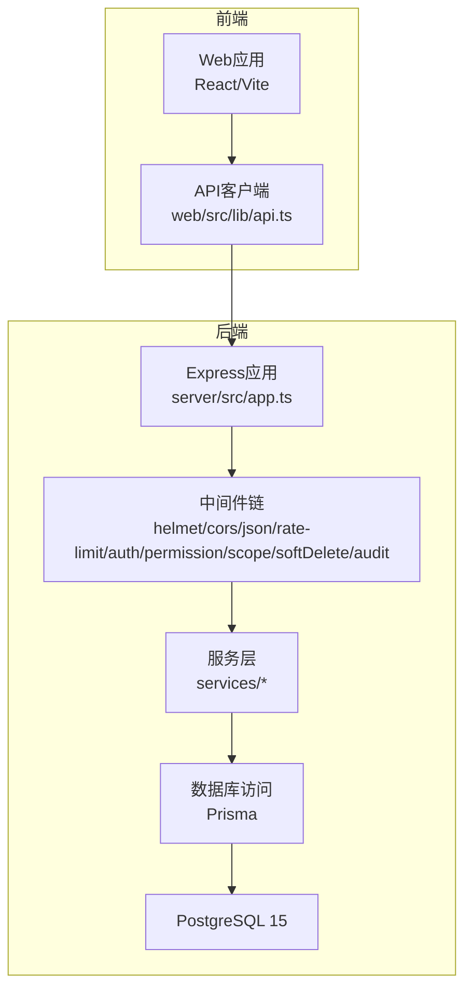
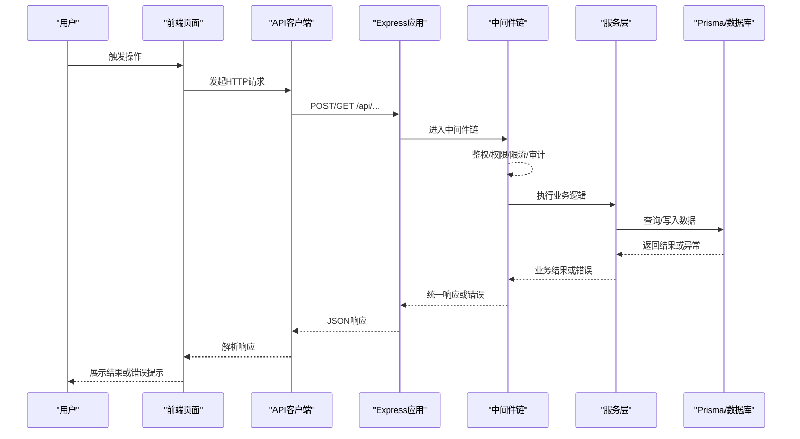
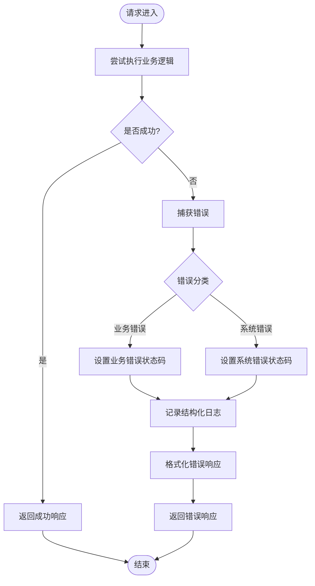
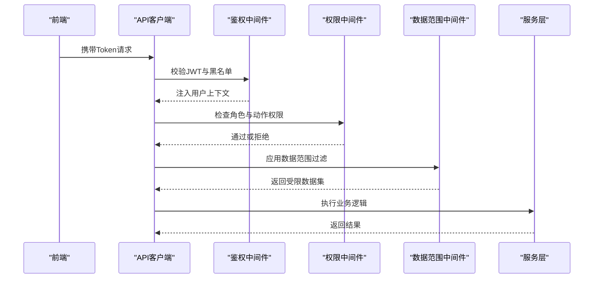
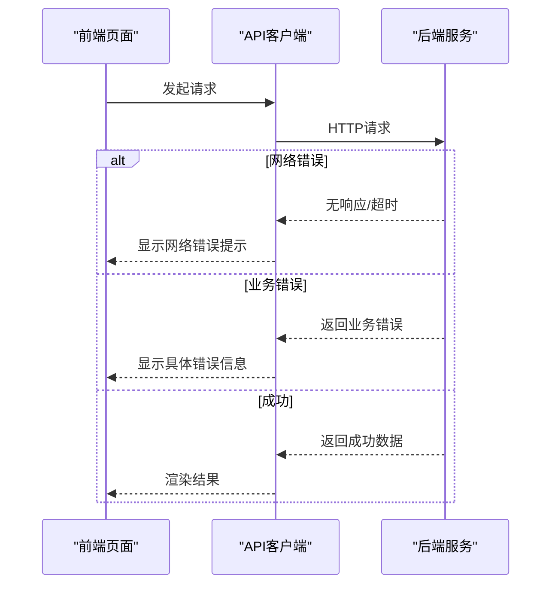
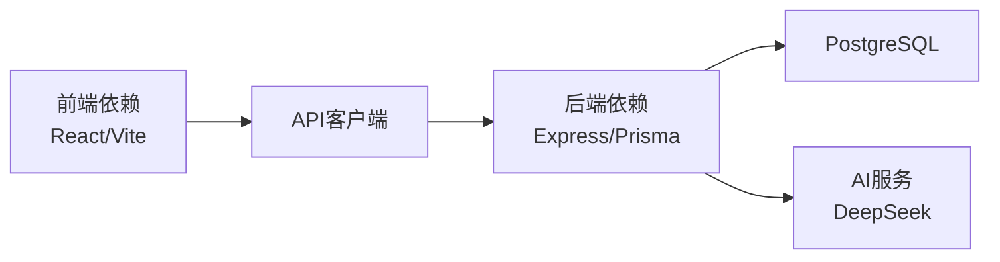

# Bug报告

<cite>
**本文引用的文件**   
- [server/src/middleware/error-handler.ts](file://server/src/middleware/error-handler.ts)
- [server/src/lib/errors.ts](file://server/src/lib/errors.ts)
- [server/src/lib/logger.ts](file://server/src/lib/logger.ts)
- [server/src/app.ts](file://server/src/app.ts)
- [server/src/server.ts](file://server/src/server.ts)
- [web/src/lib/api.ts](file://web/src/lib/api.ts)
- [web/src/hooks/useAuth.ts](file://web/src/hooks/useAuth.ts)
- [web/src/pages/login/index.tsx](file://web/src/pages/login/index.tsx)
- [server/src/middleware/auth.ts](file://server/src/middleware/auth.ts)
- [server/src/middleware/permission.ts](file://server/src/middleware/permission.ts)
- [server/src/middleware/scope.ts](file://server/src/middleware/scope.ts)
- [server/src/middleware/rate-limit.ts](file://server/src/middleware/rate-limit.ts)
- [server/src/config/env.ts](file://server/src/config/env.ts)
- [server/prisma/schema.prisma](file://server/prisma/schema.prisma)
- [server/package.json](file://server/package.json)
- [web/package.json](file://web/package.json)
</cite>

## 目录
1. [简介](#简介)
2. [项目结构](#项目结构)
3. [核心组件](#核心组件)
4. [架构总览](#架构总览)
5. [详细组件分析](#详细组件分析)
6. [依赖分析](#依赖分析)
7. [性能考虑](#性能考虑)
8. [故障排查指南](#故障排查指南)
9. [结论](#结论)
10. [附录](#附录)

## 简介
本指南面向FY200项目的开发与测试人员，统一Bug报告的提交标准与流程。目标是让问题可复现、可定位、可修复，并降低沟通成本。内容涵盖：
- 问题描述模板与复现步骤要求
- 预期行为与实际行为的对比规范
- 环境信息收集（操作系统、浏览器、Node.js、数据库等）
- 错误日志收集方法（后端堆栈、前端控制台、网络请求失败）
- Bug严重级别分类标准
- 复现视频/截图录制规范
- 临时解决方案说明要求

## 项目结构
FY200为前后端分离项目：
- 后端：Express + Prisma + PostgreSQL，中间件链包含安全、鉴权、权限、限流、审计等
- 前端：React + Vite，提供看板、报表、数据维护等页面
- 数据库：PostgreSQL 15，使用Prisma进行迁移与类型生成

图表来源
- [server/src/app.ts](file://server/src/app.ts)
- [server/src/server.ts](file://server/src/server.ts)
- [web/src/lib/api.ts](file://web/src/lib/api.ts)

章节来源
- [server/src/app.ts](file://server/src/app.ts)
- [server/src/server.ts](file://server/src/server.ts)
- [web/src/lib/api.ts](file://web/src/lib/api.ts)

## 核心组件
- 错误处理与日志
  - 全局错误处理器负责统一捕获异常、格式化响应与记录日志
  - 自定义错误类型用于区分业务异常与系统异常
  - 结构化日志输出便于追踪问题上下文
- 鉴权与权限
  - JWT鉴权与黑名单校验
  - 基于角色的权限控制与数据范围限制
- 限流与安全
  - 接口级限流防止滥用
  - Helmet/CORS等安全头配置

章节来源
- [server/src/middleware/error-handler.ts](file://server/src/middleware/error-handler.ts)
- [server/src/lib/errors.ts](file://server/src/lib/errors.ts)
- [server/src/lib/logger.ts](file://server/src/lib/logger.ts)
- [server/src/middleware/auth.ts](file://server/src/middleware/auth.ts)
- [server/src/middleware/permission.ts](file://server/src/middleware/permission.ts)
- [server/src/middleware/scope.ts](file://server/src/middleware/scope.ts)
- [server/src/middleware/rate-limit.ts](file://server/src/middleware/rate-limit.ts)

## 架构总览
请求从前端发起，经API客户端封装后进入Express应用，依次经过安全、鉴权、权限、限流、审计等中间件，最终由服务层调用Prisma访问数据库。错误在任意环节抛出都会被全局错误处理器捕获并返回统一格式。

图表来源
- [server/src/app.ts](file://server/src/app.ts)
- [server/src/middleware/error-handler.ts](file://server/src/middleware/error-handler.ts)
- [web/src/lib/api.ts](file://web/src/lib/api.ts)

## 详细组件分析

### 错误处理与日志
- 全局错误处理器
  - 捕获未处理异常与显式抛出的错误
  - 根据错误类型决定响应状态码与消息
  - 输出结构化日志，包含请求ID、路径、方法、用户信息等
- 自定义错误
  - 业务错误：如参数校验失败、权限不足、资源不存在
  - 系统错误：如数据库连接失败、外部服务超时
- 日志采集
  - 统一日志格式，便于集中收集与分析
  - 敏感信息脱敏，避免泄露

图表来源
- [server/src/middleware/error-handler.ts](file://server/src/middleware/error-handler.ts)
- [server/src/lib/errors.ts](file://server/src/lib/errors.ts)
- [server/src/lib/logger.ts](file://server/src/lib/logger.ts)

章节来源
- [server/src/middleware/error-handler.ts](file://server/src/middleware/error-handler.ts)
- [server/src/lib/errors.ts](file://server/src/lib/errors.ts)
- [server/src/lib/logger.ts](file://server/src/lib/logger.ts)

### 鉴权与权限
- 鉴权流程
  - 校验JWT令牌有效性及黑名单
  - 将用户信息注入请求上下文
- 权限控制
  - 默认拒绝策略，需显式授权
  - 结合数据范围限制实现行级安全

图表来源
- [server/src/middleware/auth.ts](file://server/src/middleware/auth.ts)
- [server/src/middleware/permission.ts](file://server/src/middleware/permission.ts)
- [server/src/middleware/scope.ts](file://server/src/middleware/scope.ts)

章节来源
- [server/src/middleware/auth.ts](file://server/src/middleware/auth.ts)
- [server/src/middleware/permission.ts](file://server/src/middleware/permission.ts)
- [server/src/middleware/scope.ts](file://server/src/middleware/scope.ts)

### 前端错误处理
- API客户端
  - 统一封装请求与响应拦截
  - 对网络错误与业务错误进行友好提示
- 登录流程
  - 处理认证失败、令牌过期等场景
  - 引导用户重新登录或刷新令牌

图表来源
- [web/src/lib/api.ts](file://web/src/lib/api.ts)
- [web/src/hooks/useAuth.ts](file://web/src/hooks/useAuth.ts)
- [web/src/pages/login/index.tsx](file://web/src/pages/login/index.tsx)

章节来源
- [web/src/lib/api.ts](file://web/src/lib/api.ts)
- [web/src/hooks/useAuth.ts](file://web/src/hooks/useAuth.ts)
- [web/src/pages/login/index.tsx](file://web/src/pages/login/index.tsx)

## 依赖分析
- 后端依赖
  - Express框架、Prisma ORM、PostgreSQL数据库
  - JWT库用于身份认证
  - 第三方AI服务（DeepSeek）用于文本处理
- 前端依赖
  - React、Vite构建工具
  - 状态管理与路由库
- 开发环境与生产环境差异
  - 环境变量配置不同
  - 日志级别与调试开关

图表来源
- [server/package.json](file://server/package.json)
- [web/package.json](file://web/package.json)
- [server/prisma/schema.prisma](file://server/prisma/schema.prisma)

章节来源
- [server/package.json](file://server/package.json)
- [web/package.json](file://web/package.json)
- [server/prisma/schema.prisma](file://server/prisma/schema.prisma)

## 性能考虑
- 数据库查询优化
  - 合理使用索引与关联查询
  - 避免N+1查询问题
- 缓存策略
  - 对热点数据进行缓存
  - 合理设置缓存过期时间
- 限流保护
  - 防止恶意请求耗尽资源
  - 分级限流策略

[本节为通用指导，无需特定文件引用]

## 故障排查指南

### Bug报告模板
请按以下模板提交Bug报告：
- 标题：简明扼要描述问题
- 问题描述：详细说明问题现象
- 复现步骤：逐步列出操作步骤
- 预期行为：期望的正确结果
- 实际行为：实际观察到的结果
- 环境信息：见下方收集规范
- 错误日志：见下方收集方法
- 严重程度：见下方分类标准
- 附件：截图或视频链接

### 环境信息收集规范
必须收集以下信息：
- 操作系统版本：Windows/macOS/Linux及版本号
- 浏览器信息：Chrome/Firefox/Safari及版本号
- Node.js版本：运行环境版本
- 数据库版本：PostgreSQL版本
- 应用版本：前端和后端版本号
- 网络环境：内网/外网/代理配置

### 错误日志收集方法
- 后端错误堆栈
  - 查看服务器日志文件
  - 复制完整的错误堆栈信息
  - 包含请求ID和时间戳
- 前端控制台错误
  - 打开浏览器开发者工具
  - 切换到Console标签页
  - 复制所有错误信息
- 网络请求失败信息
  - 打开Network标签页
  - 筛选失败的请求
  - 导出请求和响应详情

### Bug严重级别分类标准
- 致命错误（Critical）
  - 系统崩溃或无法启动
  - 数据丢失或损坏
  - 安全漏洞导致数据泄露
- 主要功能失效（Major）
  - 核心业务流程中断
  - 关键功能完全不可用
  - 影响大量用户正常使用
- 次要功能异常（Minor）
  - 非核心功能异常
  - 部分功能体验不佳
  - 不影响主要业务流程
- 界面显示问题（Trivial）
  - 样式错位或显示异常
  - 文案错误或拼写错误
  - 轻微的用户体验问题

### 复现视频与截图录制规范
- 视频录制要求
  - 完整录制从开始到问题出现的全过程
  - 包含鼠标操作和键盘输入
  - 保持画面清晰，时长不超过3分钟
  - 标注关键操作步骤
- 截图要求
  - 包含完整的错误提示信息
  - 显示相关的数据和状态
  - 必要时标注问题区域
  - 保持图片清晰可读

### 临时解决方案说明要求
- 问题规避方法
  - 提供绕过问题的操作步骤
  - 说明适用条件和限制
- 降级方案
  - 手动替代操作流程
  - 数据恢复或补偿措施
- 影响范围评估
  - 受影响的用户群体
  - 业务影响程度评估
- 预计解决时间
  - 问题修复的预估时间
  - 临时方案的持续时间

章节来源
- [server/src/middleware/error-handler.ts](file://server/src/middleware/error-handler.ts)
- [server/src/lib/logger.ts](file://server/src/lib/logger.ts)
- [web/src/lib/api.ts](file://web/src/lib/api.ts)

## 结论
通过标准化的Bug报告流程和详细的收集规范，可以显著提高问题定位和修复效率。建议团队严格执行本报告中的各项要求，确保每个Bug都能得到及时有效的处理。同时，持续完善错误处理和日志记录机制，为问题排查提供更好的支持。

## 附录

### 快速参考清单
- 必填字段：标题、描述、复现步骤、预期行为、实际行为、环境信息
- 可选字段：严重程度、临时解决方案、附件材料
- 提交渠道：内部缺陷管理系统
- 响应时效：根据严重程度设定不同的响应时间

[本节为补充信息，无需特定文件引用]