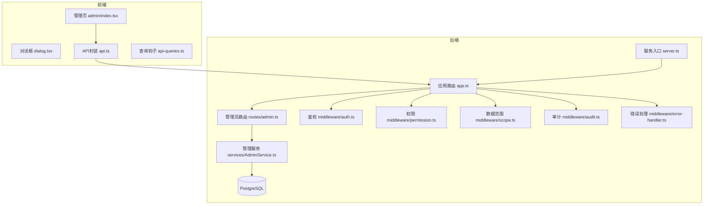
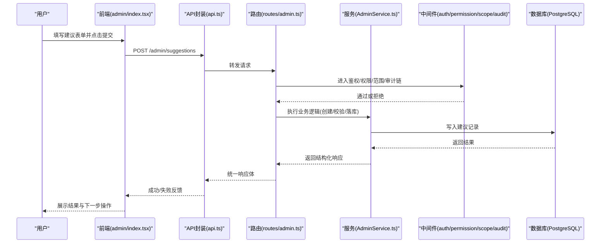
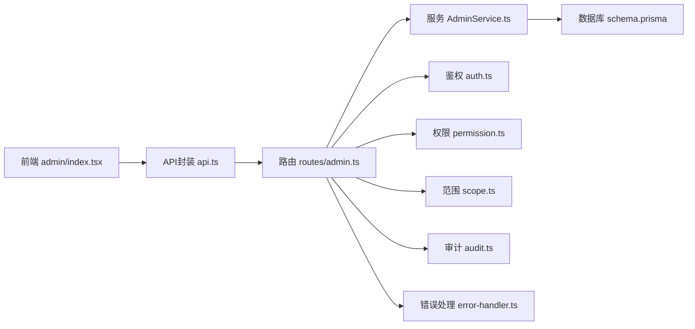

# 功能建议

<cite>
**本文引用的文件**   
- [server/src/app.ts](file://server/src/app.ts)
- [server/src/server.ts](file://server/src/server.ts)
- [server/src/middleware/auth.ts](file://server/src/middleware/auth.ts)
- [server/src/middleware/permission.ts](file://server/src/middleware/permission.ts)
- [server/src/middleware/scope.ts](file://server/src/middleware/scope.ts)
- [server/src/middleware/audit.ts](file://server/src/middleware/audit.ts)
- [server/src/middleware/error-handler.ts](file://server/src/middleware/error-handler.ts)
- [server/src/lib/errors.ts](file://server/src/lib/errors.ts)
- [server/src/lib/response.ts](file://server/src/lib/response.ts)
- [server/src/routes/admin.ts](file://server/src/routes/admin.ts)
- [server/src/services/AdminService.ts](file://server/src/services/AdminService.ts)
- [server/prisma/schema.prisma](file://server/prisma/schema.prisma)
- [web/src/pages/admin/index.tsx](file://web/src/pages/admin/index.tsx)
- [web/src/components/ui/dialog.tsx](file://web/src/components/ui/dialog.tsx)
- [web/src/components/ui/button.tsx](file://web/src/components/ui/input.tsx)
- [web/src/components/ui/card.tsx](file://web/src/components/ui/status-indicator.tsx)
- [web/src/lib/api.ts](file://web/src/lib/api.ts)
- [web/src/hooks/api-queries.ts](file://web/src/hooks/api-queries.ts)
- [web/src/types/index.ts](file://web/src/types/index.ts)
- [docs/plans/frontend-design-proposal.md](file://docs/plans/frontend-design-proposal.md)
- [docs/references/backend.md](file://docs/references/backend.md)
- [docs/references/frontend.md](file://docs/references/frontend.md)
</cite>

## 目录
1. [引言](#引言)
2. [项目结构](#项目结构)
3. [核心组件](#核心组件)
4. [架构总览](#架构总览)
5. [详细组件分析](#详细组件分析)
6. [依赖分析](#依赖分析)
7. [性能考虑](#性能考虑)
8. [故障排查指南](#故障排查指南)
9. [结论](#结论)
10. [附录](#附录)

## 引言
本文件为FY200项目“新功能建议”流程的完整规范与落地方案，覆盖需求背景、使用场景、技术讨论要点、优先级评估、原型模板、验收标准与测试指导。目标是为产品、研发、测试与运营提供统一的方法论与可执行模板，确保建议从提出到上线的全链路可控、可追溯、可度量。

## 项目结构
FY200采用前后端分离架构：
- 后端：Express + Prisma + PostgreSQL，中间件链负责安全、鉴权、权限、数据范围、审计与错误处理。
- 前端：React + Vite + Tailwind，组件库以UI基础组件与业务页面分层组织。
- 文档：plans与references沉淀设计规范与参考实现。

图示来源 
- [server/src/server.ts](file://server/src/server.ts)
- [server/src/app.ts](file://server/src/app.ts)
- [server/src/routes/admin.ts](file://server/src/routes/admin.ts)
- [server/src/services/AdminService.ts](file://server/src/services/AdminService.ts)
- [server/src/middleware/auth.ts](file://server/src/middleware/auth.ts)
- [server/src/middleware/permission.ts](file://server/src/middleware/permission.ts)
- [server/src/middleware/scope.ts](file://server/src/middleware/scope.ts)
- [server/src/middleware/audit.ts](file://server/src/middleware/audit.ts)
- [server/src/middleware/error-handler.ts](file://server/src/middleware/error-handler.ts)

章节来源
- [server/src/app.ts](file://server/src/app.ts)
- [server/src/server.ts](file://server/src/server.ts)
- [web/src/pages/admin/index.tsx](file://web/src/pages/admin/index.tsx)
- [web/src/lib/api.ts](file://web/src/lib/api.ts)

## 核心组件
围绕“新功能建议”流程，关键能力包括：
- 建议提交流（前端表单、校验、提交）
- 建议列表与状态流转（审批、驳回、采纳、下线）
- 权限与范围控制（仅授权角色可见/可编辑）
- 审计追踪（谁在何时做了什么）
- 错误与异常处理（统一返回格式与提示）

章节来源
- [web/src/pages/admin/index.tsx](file://web/src/pages/admin/index.tsx)
- [web/src/components/ui/dialog.tsx](file://web/src/components/ui/dialog.tsx)
- [web/src/components/ui/button.tsx](file://web/src/components/ui/button.tsx)
- [web/src/components/ui/input.tsx](file://web/src/components/ui/input.tsx)
- [web/src/components/ui/card.tsx](file://web/src/components/ui/card.tsx)
- [web/src/components/ui/status-indicator.tsx](file://web/src/components/ui/status-indicator.tsx)
- [web/src/lib/api.ts](file://web/src/lib/api.ts)
- [web/src/hooks/api-queries.ts](file://web/src/hooks/api-queries.ts)
- [server/src/routes/admin.ts](file://server/src/routes/admin.ts)
- [server/src/services/AdminService.ts](file://server/src/services/AdminService.ts)
- [server/src/middleware/auth.ts](file://server/src/middleware/auth.ts)
- [server/src/middleware/permission.ts](file://server/src/middleware/permission.ts)
- [server/src/middleware/scope.ts](file://server/src/middleware/scope.ts)
- [server/src/middleware/audit.ts](file://server/src/middleware/audit.ts)
- [server/src/middleware/error-handler.ts](file://server/src/middleware/error-handler.ts)

## 架构总览
“新功能建议”端到端调用序列如下：

图示来源 
- [web/src/pages/admin/index.tsx](file://web/src/pages/admin/index.tsx)
- [web/src/lib/api.ts](file://web/src/lib/api.ts)
- [server/src/routes/admin.ts](file://server/src/routes/admin.ts)
- [server/src/services/AdminService.ts](file://server/src/services/AdminService.ts)
- [server/src/middleware/auth.ts](file://server/src/middleware/auth.ts)
- [server/src/middleware/permission.ts](file://server/src/middleware/permission.ts)
- [server/src/middleware/scope.ts](file://server/src/middleware/scope.ts)
- [server/src/middleware/audit.ts](file://server/src/middleware/audit.ts)

## 详细组件分析

### 需求背景与使用场景
- 业务痛点
  - 跨部门需求分散，缺乏统一收集与跟踪渠道
  - 需求价值难以量化，评审依据不足
  - 历史建议无法复用，重复建设频发
- 使用场景
  - 业务人员在线提交建议，附带背景、目标、预期收益与影响面
  - 产品经理/负责人在线评审、打分、决策与归档
  - 研发根据采纳建议进行排期与交付，闭环追踪
- 现有方案局限性
  - 非结构化收集（邮件/群聊），检索困难
  - 无权限与范围隔离，信息泄露风险
  - 缺少审计与版本化，责任不清

### 技术方案讨论要点
- 数据模型变更影响
  - 新增“建议”实体与状态机字段，关联“提交人/评审人/版本/时间戳”
  - 索引优化：按状态、优先级、提交时间等高频查询维度建索引
  - 软删除与审计日志：保留历史轨迹，支持回溯
- API接口设计考虑
  - RESTful风格，资源命名清晰；分页、过滤、排序参数标准化
  - 统一响应体与错误码，便于前端一致化处理
  - 幂等性：对提交类接口增加幂等键，避免重复提交
- 前端组件复用性分析
  - 表单：复用输入框、选择器、富文本编辑器与校验规则
  - 列表：复用数据表格、分页、筛选面板与导出
  - 交互：复用对话框、确认弹窗、状态指示器与骨架屏

章节来源
- [server/prisma/schema.prisma](file://server/prisma/schema.prisma)
- [server/src/lib/response.ts](file://server/src/lib/response.ts)
- [web/src/components/ui/input.tsx](file://web/src/components/ui/input.tsx)
- [web/src/components/ui/select.tsx](file://web/src/components/ui/select.tsx)
- [web/src/components/data-table/pro-data-table.tsx](file://web/src/components/data-table/pro-data-table.tsx)
- [web/src/components/dimension/aggregation-map-panel.tsx](file://web/src/components/dimension/aggregation-map-panel.tsx)

### 功能优先级评估标准
- 紧急程度
  - 合规/风控相关优先
  - 直接影响收入或成本的关键路径优先
- 实现复杂度
  - 数据模型改动量、接口数量、第三方依赖
  - 计算复杂度与性能影响（如公式解析、聚合）
- 资源投入需求
  - 前后端开发、测试、运维与培训成本
  - 是否可分阶段交付与灰度发布

### 原型设计文档模板
- 界面布局草图
  - 顶部：标题与操作区（新建、导入、导出）
  - 中部：筛选条件与列表（状态、优先级、时间范围）
  - 底部：分页与统计摘要
- 交互流程说明
  - 新建：打开对话框→填写必填项→预览→提交→成功提示
  - 评审：查看详情→填写评审意见→更新状态→通知相关人员
- 数据流转示意
  - 前端表单校验→API封装→后端鉴权与权限→服务层落库→审计记录→统一响应

章节来源
- [web/src/pages/admin/index.tsx](file://web/src/pages/admin/index.tsx)
- [web/src/components/ui/dialog.tsx](file://web/src/components/ui/dialog.tsx)
- [web/src/components/ui/card.tsx](file://web/src/components/ui/card.tsx)
- [web/src/components/ui/status-indicator.tsx](file://web/src/components/ui/status-indicator.tsx)
- [docs/plans/frontend-design-proposal.md](file://docs/plans/frontend-design-proposal.md)

### 功能验收标准与测试用例编写指导
- 验收标准
  - 功能完整性：新增、查看、编辑、删除、状态流转、搜索、分页、导出
  - 权限与范围：仅授权角色可操作，数据范围隔离生效
  - 审计与可追溯：操作日志完整，不可篡改
  - 错误处理：异常捕获、友好提示、重试机制
- 测试用例指导
  - 单元测试：服务层逻辑、工具函数、权限判断
  - 集成测试：接口联调、数据库事务、中间件链
  - 端到端测试：关键用户路径（提交→评审→采纳）
  - 性能与安全：并发提交、注入防护、敏感信息脱敏

章节来源
- [server/src/services/AdminService.ts](file://server/src/services/AdminService.ts)
- [server/src/middleware/permission.ts](file://server/src/middleware/permission.ts)
- [server/src/middleware/scope.ts](file://server/src/middleware/scope.ts)
- [server/src/middleware/audit.ts](file://server/src/middleware/audit.ts)
- [web/src/lib/api.ts](file://web/src/lib/api.ts)
- [web/src/hooks/api-queries.ts](file://web/src/hooks/api-queries.ts)

## 依赖分析
“新功能建议”涉及的模块耦合关系如下：

图示来源 
- [web/src/pages/admin/index.tsx](file://web/src/pages/admin/index.tsx)
- [web/src/lib/api.ts](file://web/src/lib/api.ts)
- [server/src/routes/admin.ts](file://server/src/routes/admin.ts)
- [server/src/services/AdminService.ts](file://server/src/services/AdminService.ts)
- [server/prisma/schema.prisma](file://server/prisma/schema.prisma)
- [server/src/middleware/auth.ts](file://server/src/middleware/auth.ts)
- [server/src/middleware/permission.ts](file://server/src/middleware/permission.ts)
- [server/src/middleware/scope.ts](file://server/src/middleware/scope.ts)
- [server/src/middleware/audit.ts](file://server/src/middleware/audit.ts)
- [server/src/middleware/error-handler.ts](file://server/src/middleware/error-handler.ts)

章节来源
- [server/src/app.ts](file://server/src/app.ts)
- [server/src/server.ts](file://server/src/server.ts)

## 性能考虑
- 数据库层面
  - 针对高频查询字段建立复合索引（状态、优先级、时间）
  - 大表分页采用游标或延迟关联，避免深分页
- 接口层面
  - 合理缓存热点数据（如字典、指标定义）
  - 批量操作减少往返次数，避免N+1查询
- 前端层面
  - 列表虚拟滚动与懒加载
  - 防抖与节流，降低无效请求
- 计算与AI
  - 公式解析走白名单算子，避免eval
  - AI流式输出，提升交互体验

[本节为通用指导，不直接分析具体文件]

## 故障排查指南
- 常见问题定位
  - 鉴权失败：检查JWT有效期、黑名单、权限配置
  - 数据范围异常：确认scope扩展是否正确注入
  - 审计缺失：核查audit中间件是否挂载
  - 错误提示不明确：查看统一错误处理器与响应体
- 调试步骤
  - 开启trace-id，串联前后端日志
  - 逐步断点：路由→中间件→服务→数据库
  - 复现最小用例，隔离问题域

章节来源
- [server/src/middleware/auth.ts](file://server/src/middleware/auth.ts)
- [server/src/middleware/permission.ts](file://server/src/middleware/permission.ts)
- [server/src/middleware/scope.ts](file://server/src/middleware/scope.ts)
- [server/src/middleware/audit.ts](file://server/src/middleware/audit.ts)
- [server/src/middleware/error-handler.ts](file://server/src/middleware/error-handler.ts)
- [server/src/lib/errors.ts](file://server/src/lib/errors.ts)
- [server/src/lib/response.ts](file://server/src/lib/response.ts)

## 结论
“新功能建议”流程通过标准化的需求收集、评审与追踪，结合严格的权限、范围与审计机制，能够有效提升FY200项目的治理效率与透明度。建议在迭代中持续完善数据模型、接口契约与前端组件复用，确保可扩展性与可维护性。

## 附录
- 参考文档
  - 前端设计规范与组件约定
  - 后端接口与中间件链规范
- 术语表
  - 建议：指对新功能的提议，包含背景、目标、预期收益与影响面
  - 评审：对建议的价值、可行性与风险进行评估的过程
  - 采纳：评审通过后进入实施阶段的动作

章节来源
- [docs/references/frontend.md](file://docs/references/frontend.md)
- [docs/references/backend.md](file://docs/references/backend.md)