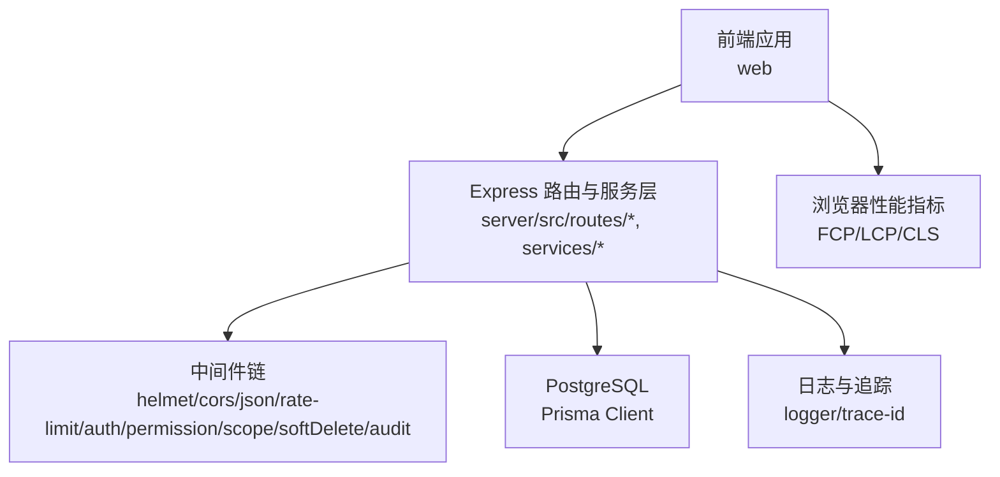
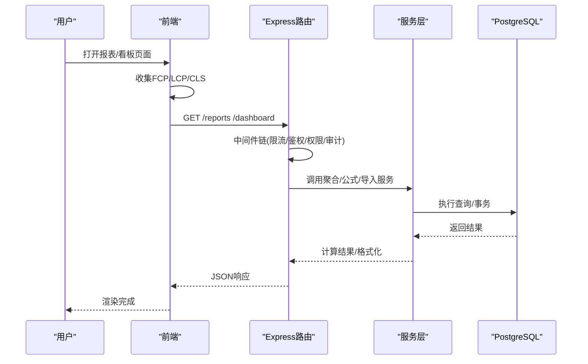
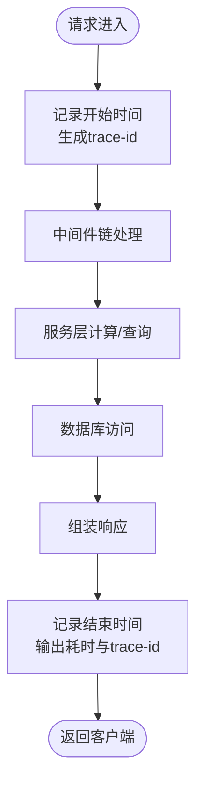
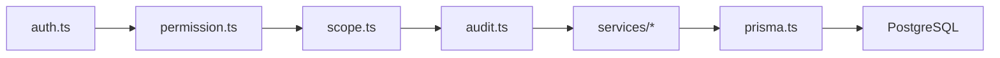

# 性能问题

<cite>
**本文引用的文件**   
- [server/src/app.ts](file://server/src/app.ts)
- [server/src/server.ts](file://server/src/server.ts)
- [server/src/middleware/error-handler.ts](file://server/src/middleware/error-handler.ts)
- [server/src/middleware/trace-id.ts](file://server/src/middleware/trace-id.ts)
- [server/src/middleware/rate-limit.ts](file://server/src/middleware/rate-limit.ts)
- [server/src/lib/logger.ts](file://server/src/lib/logger.ts)
- [server/src/lib/prisma.ts](file://server/src/lib/prisma.ts)
- [server/src/services/AggregationService.ts](file://server/src/services/AggregationService.ts)
- [server/src/services/FormulaRuleService.ts](file://server/src/services/FormulaRuleService.ts)
- [server/src/services/ImportService.ts](file://server/src/services/ImportService.ts)
- [server/src/routes/reports.ts](file://server/src/routes/reports.ts)
- [server/src/routes/data.ts](file://server/src/routes/data.ts)
- [server/src/routes/dashboard.ts](file://server/src/routes/dashboard.ts)
- [server/src/lib/formula.ts](file://server/src/lib/formula.ts)
- [server/src/lib/excel-import.ts](file://server/src/lib/excel-import.ts)
- [server/src/lib/excel.ts](file://server/src/lib/excel.ts)
- [server/src/middleware/scope.ts](file://server/src/middleware/scope.ts)
- [server/src/middleware/auth.ts](file://server/src/middleware/auth.ts)
- [server/src/middleware/permission.ts](file://server/src/middleware/permission.ts)
- [server/src/middleware/audit.ts](file://server/src/middleware/audit.ts)
- [server/src/config/env.ts](file://server/src/config/env.ts)
- [web/src/hooks/api-queries.ts](file://web/src/hooks/api-queries.ts)
- [web/src/lib/api.ts](file://web/src/lib/api.ts)
- [web/src/pages/reports/index.tsx](file://web/src/pages/reports/index.tsx)
- [web/src/pages/dashboard/index.tsx](file://web/src/pages/dashboard/index.tsx)
- [web/src/components/data-table/pro-data-table.tsx](file://web/src/components/data-table/pro-data-table.tsx)
- [web/src/components/data-table/pagination.tsx](file://web/src/components/data-table/pagination.tsx)
- [web/src/components/ui/skeleton.tsx](file://web/src/components/ui/skeleton.tsx)
- [web/src/components/ui/skeleton-blocks.tsx](file://web/src/components/ui/skeleton-blocks.tsx)
- [server/prisma/schema.prisma](file://server/prisma/schema.prisma)
- [server/scripts/local-db.ts](file://server/scripts/local-db.ts)
</cite>

## 目录
1. [引言](#引言)
2. [项目结构](#项目结构)
3. [核心组件](#核心组件)
4. [架构总览](#架构总览)
5. [详细组件分析](#详细组件分析)
6. [依赖关系分析](#依赖关系分析)
7. [性能考虑](#性能考虑)
8. [故障排查指南](#故障排查指南)
9. [结论](#结论)
10. [附录](#附录)

## 引言
本指南面向FY200项目的研发与运维团队，聚焦性能问题的识别、监控、基准测试与优化建议。内容覆盖前端页面加载缓慢、API响应超时、数据库慢查询、内存泄漏等典型问题特征；提供前端性能指标（FCP、LCP、CLS）采集方法、后端响应时间统计、数据库慢查询日志与服务器资源使用率的监控方案；给出并发压力测试、大数据量导入测试、复杂公式计算性能测试的实操步骤；并总结代码级优化、数据库索引优化、缓存策略调整等技术路径。

## 项目结构
FY200采用前后端分离架构：
- 前端（web）：基于React/Vite，包含报表、看板、数据维护等页面与通用组件，负责用户交互与前端性能指标上报。
- 后端（server）：Express + Prisma + PostgreSQL，提供REST API，内置鉴权、权限、审计、限流、错误处理等中间件链，服务层封装业务逻辑与计算。
- 数据库：PostgreSQL 15，通过Prisma进行ORM访问与迁移管理。

图表来源
- [server/src/app.ts](file://server/src/app.ts)
- [server/src/server.ts](file://server/src/server.ts)
- [server/src/middleware/trace-id.ts](file://server/src/middleware/trace-id.ts)
- [server/src/lib/logger.ts](file://server/src/lib/logger.ts)
- [server/src/lib/prisma.ts](file://server/src/lib/prisma.ts)

章节来源
- [server/src/app.ts](file://server/src/app.ts)
- [server/src/server.ts](file://server/src/server.ts)
- [server/src/config/env.ts](file://server/src/config/env.ts)

## 核心组件
- 中间件链：安全头、跨域、JSON解析、速率限制、JWT鉴权、权限校验、作用域扩展、软删除、审计、错误处理。
- 服务层：聚合计算、公式规则、导入导出、报表生成、看板数据聚合。
- 数据库访问：Prisma Client连接池、事务、扩展（scope）。
- 前端：API请求封装、分页与虚拟列表、骨架屏、性能埋点。

章节来源
- [server/src/middleware/rate-limit.ts](file://server/src/middleware/rate-limit.ts)
- [server/src/middleware/auth.ts](file://server/src/middleware/auth.ts)
- [server/src/middleware/permission.ts](file://server/src/middleware/permission.ts)
- [server/src/middleware/scope.ts](file://server/src/middleware/scope.ts)
- [server/src/middleware/audit.ts](file://server/src/middleware/audit.ts)
- [server/src/lib/prisma.ts](file://server/src/lib/prisma.ts)
- [server/src/services/AggregationService.ts](file://server/src/services/AggregationService.ts)
- [server/src/services/FormulaRuleService.ts](file://server/src/services/FormulaRuleService.ts)
- [server/src/services/ImportService.ts](file://server/src/services/ImportService.ts)
- [web/src/lib/api.ts](file://web/src/lib/api.ts)
- [web/src/components/data-table/pagination.tsx](file://web/src/components/data-table/pagination.tsx)

## 架构总览
请求从前端发起，经中间件链处理后进入路由与服务层，最终由Prisma访问数据库。关键性能节点包括：
- 前端首屏渲染与资源加载（FCP/LCP/CLS）
- 网络请求耗时与重试/取消
- 鉴权与权限校验开销
- 公式解析与聚合计算
- 数据库查询与索引命中
- 大文件导入与Excel解析

图表来源
- [server/src/routes/reports.ts](file://server/src/routes/reports.ts)
- [server/src/routes/dashboard.ts](file://server/src/routes/dashboard.ts)
- [server/src/services/AggregationService.ts](file://server/src/services/AggregationService.ts)
- [server/src/lib/prisma.ts](file://server/src/lib/prisma.ts)
- [web/src/hooks/api-queries.ts](file://web/src/hooks/api-queries.ts)

## 详细组件分析

### 前端性能指标采集与页面加载优化
- 指标定义
  - FCP（首次绘制内容）：首屏有内容可感知的时间点
  - LCP（最大内容绘制）：首屏最大元素渲染完成时间
  - CLS（累积布局偏移）：页面稳定性指标
- 采集方式
  - 使用PerformanceObserver或Web Vitals库在关键页面埋点
  - 将指标随API请求或独立上报接口提交到后端
- 优化要点
  - 首屏按需加载、懒加载图表与表格
  - 骨架屏提升感知速度
  - 减少重排重绘，避免大对象直接渲染

章节来源
- [web/src/pages/reports/index.tsx](file://web/src/pages/reports/index.tsx)
- [web/src/pages/dashboard/index.tsx](file://web/src/pages/dashboard/index.tsx)
- [web/src/components/ui/skeleton.tsx](file://web/src/components/ui/skeleton.tsx)
- [web/src/components/ui/skeleton-blocks.tsx](file://web/src/components/ui/skeleton-blocks.tsx)
- [web/src/lib/api.ts](file://web/src/lib/api.ts)

### 后端响应时间与链路追踪
- 响应时间统计
  - 在中间件层记录请求开始与结束时间，输出到日志
  - 结合trace-id贯穿全链路，便于定位慢请求
- 链路追踪
  - 为每个请求分配唯一trace-id，并在日志中统一携带
  - 对关键服务调用打点（如公式计算、聚合、导入）

图表来源
- [server/src/middleware/trace-id.ts](file://server/src/middleware/trace-id.ts)
- [server/src/lib/logger.ts](file://server/src/lib/logger.ts)
- [server/src/middleware/error-handler.ts](file://server/src/middleware/error-handler.ts)

章节来源
- [server/src/middleware/trace-id.ts](file://server/src/middleware/trace-id.ts)
- [server/src/lib/logger.ts](file://server/src/lib/logger.ts)
- [server/src/middleware/error-handler.ts](file://server/src/middleware/error-handler.ts)

### 数据库慢查询与索引优化
- 慢查询识别
  - 开启PostgreSQL慢查询日志，设置阈值（如超过500ms）
  - 使用EXPLAIN/EXPLAIN ANALYZE分析执行计划
- 索引优化
  - 针对高频过滤条件建立单列或多列索引
  - 避免过度索引导致写入性能下降
- 查询优化
  - 减少SELECT *，仅选择必要字段
  - 合理使用JOIN与子查询，避免N+1问题

章节来源
- [server/src/lib/prisma.ts](file://server/src/lib/prisma.ts)
- [server/prisma/schema.prisma](file://server/prisma/schema.prisma)

### 公式计算与聚合性能
- 公式解析
  - 使用白名单算子构建安全表达式解析器，禁止eval
  - 对复杂公式进行分步计算与缓存中间结果
- 聚合计算
  - 按维度分组聚合，尽量下推到数据库层
  - 对热点指标做短期缓存（如Redis）

章节来源
- [server/src/lib/formula.ts](file://server/src/lib/formula.ts)
- [server/src/services/AggregationService.ts](file://server/src/services/AggregationService.ts)
- [server/src/services/FormulaRuleService.ts](file://server/src/services/FormulaRuleService.ts)

### 大数据量导入与Excel解析
- Excel解析
  - 流式读取大文件，避免一次性加载到内存
  - 分批插入数据库，控制事务大小
- 导入性能
  - 启用批量写入与并行度控制
  - 对导入过程进行进度反馈与失败重试

章节来源
- [server/src/lib/excel-import.ts](file://server/src/lib/excel-import.ts)
- [server/src/lib/excel.ts](file://server/src/lib/excel.ts)
- [server/src/services/ImportService.ts](file://server/src/services/ImportService.ts)

### 前端数据表格与分页
- 分页策略
  - 服务端分页优先，避免一次性返回大量数据
  - 客户端虚拟滚动提升长列表渲染性能
- 表格优化
  - 按需加载列与行，减少DOM节点数量
  - 合并单元格与固定列时注意重排成本

章节来源
- [web/src/components/data-table/pro-data-table.tsx](file://web/src/components/data-table/pro-data-table.tsx)
- [web/src/components/data-table/pagination.tsx](file://web/src/components/data-table/pagination.tsx)

## 依赖关系分析
- 中间件依赖顺序严格，任何一环异常都会影响整体性能
- 服务层依赖Prisma与外部API（如AI），需关注其延迟与限流
- 前端依赖后端API契约，变更需保持兼容

图表来源
- [server/src/middleware/auth.ts](file://server/src/middleware/auth.ts)
- [server/src/middleware/permission.ts](file://server/src/middleware/permission.ts)
- [server/src/middleware/scope.ts](file://server/src/middleware/scope.ts)
- [server/src/middleware/audit.ts](file://server/src/middleware/audit.ts)
- [server/src/lib/prisma.ts](file://server/src/lib/prisma.ts)

章节来源
- [server/src/middleware/auth.ts](file://server/src/middleware/auth.ts)
- [server/src/middleware/permission.ts](file://server/src/middleware/permission.ts)
- [server/src/middleware/scope.ts](file://server/src/middleware/scope.ts)
- [server/src/middleware/audit.ts](file://server/src/middleware/audit.ts)
- [server/src/lib/prisma.ts](file://server/src/lib/prisma.ts)

## 性能考虑
- 前端
  - 首屏资源压缩与CDN加速
  - 图片懒加载与WebP格式
  - 第三方库按需引入
- 后端
  - 连接池大小调优（Prisma）
  - 异步任务队列化（如导入、报表生成）
  - 热点数据缓存（Redis）
- 数据库
  - 定期统计信息更新与索引重建
  - 分区表与归档策略
- 监控
  - APM工具集成（如OpenTelemetry）
  - 告警阈值配置（CPU、内存、磁盘、连接数）

## 故障排查指南
- 页面加载缓慢
  - 检查浏览器开发者工具Network与Performance面板
  - 确认是否存在阻塞脚本与大资源未压缩
- API响应超时
  - 查看后端日志中的trace-id与耗时分布
  - 检查数据库慢查询与锁等待
- 数据库慢查询
  - 使用EXPLAIN分析执行计划
  - 检查索引命中率与扫描行数
- 内存泄漏
  - 前端：检查事件监听器与定时器清理
  - 后端：监控堆内存增长，定位大对象引用

章节来源
- [server/src/middleware/error-handler.ts](file://server/src/middleware/error-handler.ts)
- [server/src/lib/logger.ts](file://server/src/lib/logger.ts)
- [server/src/lib/prisma.ts](file://server/src/lib/prisma.ts)

## 结论
通过系统化的性能监控、基准测试与优化实践，可有效识别并解决FY200项目的性能瓶颈。建议建立常态化性能回归测试与监控告警机制，确保系统在数据规模增长与并发上升场景下的稳定性与响应性。

## 附录
- 性能基准测试方法
  - 并发压力测试：使用JMeter或k6模拟多用户并发访问报表与看板接口
  - 大数据量导入测试：准备百万级Excel文件，评估导入耗时与内存占用
  - 复杂公式计算测试：构造多层嵌套公式与大规模数据集，验证计算性能
- 监控指标清单
  - 前端：FCP、LCP、CLS、TTI、FID
  - 后端：QPS、平均响应时间、P95/P99延迟、错误率
  - 数据库：慢查询数、连接数、锁等待、缓冲命中率
  - 服务器：CPU、内存、磁盘IO、网络带宽