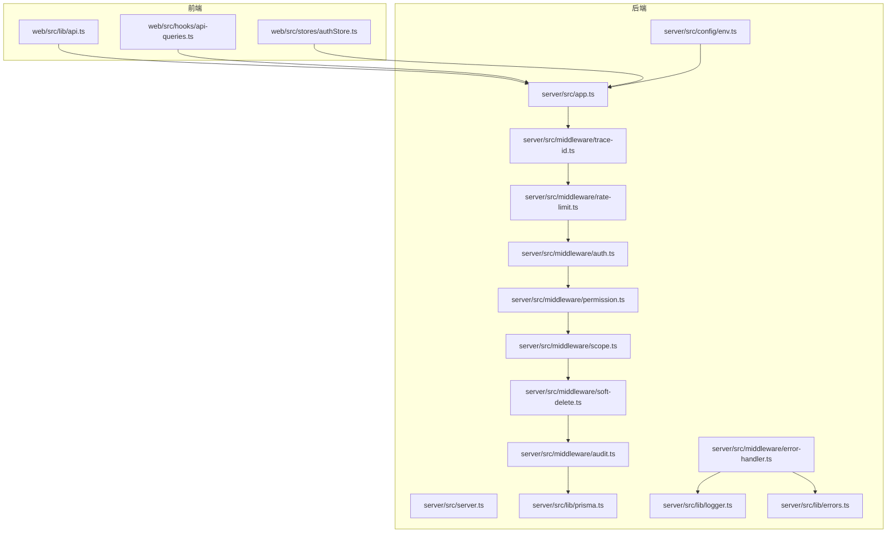
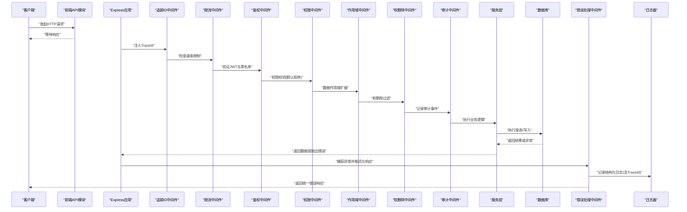
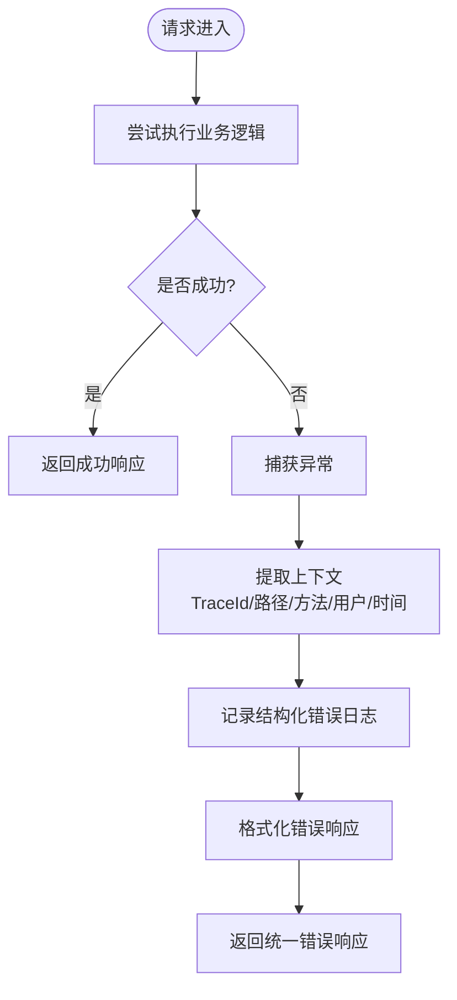
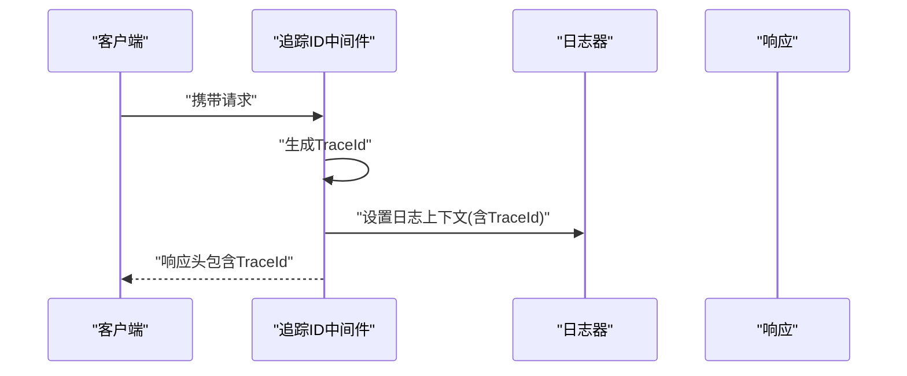
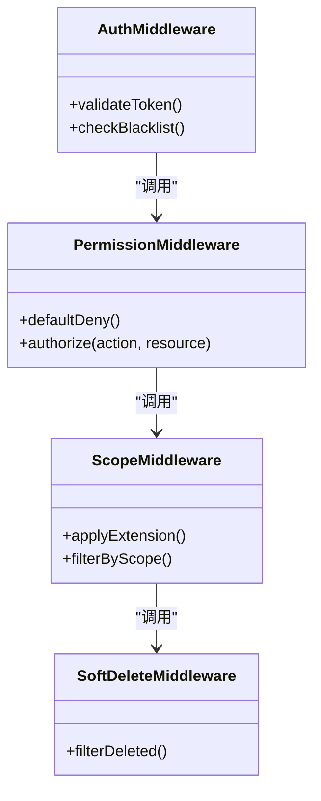
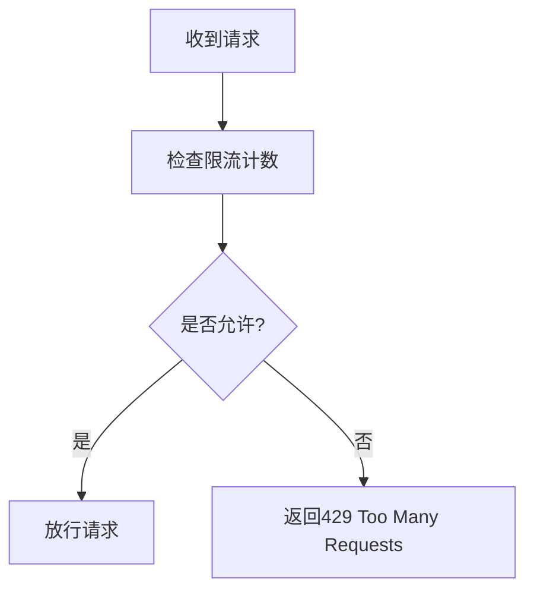
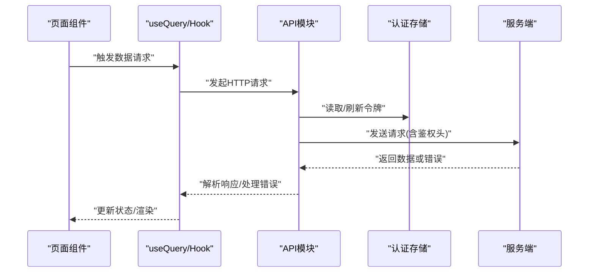
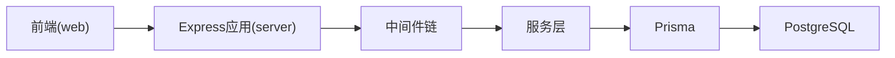

# 问题报告

<cite>
**本文引用的文件**   
- [server/src/middleware/error-handler.ts](file://server/src/middleware/error-handler.ts)
- [server/src/lib/logger.ts](file://server/src/lib/logger.ts)
- [server/src/lib/errors.ts](file://server/src/lib/errors.ts)
- [server/src/middleware/trace-id.ts](file://server/src/middleware/trace-id.ts)
- [server/src/middleware/rate-limit.ts](file://server/src/middleware/rate-limit.ts)
- [server/src/middleware/auth.ts](file://server/src/middleware/auth.ts)
- [server/src/middleware/permission.ts](file://server/src/middleware/permission.ts)
- [server/src/middleware/scope.ts](file://server/src/middleware/scope.ts)
- [server/src/middleware/soft-delete.ts](file://server/src/middleware/soft-delete.ts)
- [server/src/middleware/audit.ts](file://server/src/middleware/audit.ts)
- [server/src/app.ts](file://server/src/app.ts)
- [server/src/server.ts](file://server/src/server.ts)
- [server/src/config/env.ts](file://server/src/config/env.ts)
- [server/src/lib/prisma.ts](file://server/src/lib/prisma.ts)
- [web/src/lib/api.ts](file://web/src/lib/api.ts)
- [web/src/hooks/api-queries.ts](file://web/src/hooks/api-queries.ts)
- [web/src/stores/authStore.ts](file://web/src/stores/authStore.ts)
- [docs/references/performance.md](file://docs/references/performance.md)
- [docs/references/observability.md](file://docs/references/observability.md)
- [server/package.json](file://server/package.json)
- [web/package.json](file://web/package.json)
</cite>

## 目录
1. [简介](#简介)
2. [项目结构](#项目结构)
3. [核心组件](#核心组件)
4. [架构总览](#架构总览)
5. [详细组件分析](#详细组件分析)
6. [依赖分析](#依赖分析)
7. [性能注意事项](#性能注意事项)
8. [故障排查指南](#故障排查指南)
9. [结论](#结论)
10. [附录](#附录)

## 简介
本指南面向FY200项目的测试、产品与研发人员，统一问题上报标准与流程。内容涵盖：
- Bug报告模板与复现要求
- 环境信息收集规范（操作系统、浏览器、Node.js、数据库等）
- 性能问题报告方法（日志、错误堆栈、网络监控）
- 新功能建议提交流程（需求背景、使用场景、技术方案讨论）
- 问题分类标准（严重级别、优先级、影响范围）
- 问题跟踪流程与状态变更说明

请严格遵循本指南提交问题，有助于快速定位与修复。

## 项目结构
FY200为前后端分离项目：
- 后端：Express + Prisma + PostgreSQL，中间件链负责安全、鉴权、限流、审计与错误处理
- 前端：React/Vite应用，通过API模块与服务端交互
- 文档：参考文档包含性能与可观测性指引

图表来源
- [server/src/app.ts](file://server/src/app.ts)
- [server/src/server.ts](file://server/src/server.ts)
- [server/src/middleware/error-handler.ts](file://server/src/middleware/error-handler.ts)
- [server/src/middleware/trace-id.ts](file://server/src/middleware/trace-id.ts)
- [server/src/middleware/rate-limit.ts](file://server/src/middleware/rate-limit.ts)
- [server/src/middleware/auth.ts](file://server/src/middleware/auth.ts)
- [server/src/middleware/permission.ts](file://server/src/middleware/permission.ts)
- [server/src/middleware/scope.ts](file://server/src/middleware/scope.ts)
- [server/src/middleware/soft-delete.ts](file://server/src/middleware/soft-delete.ts)
- [server/src/middleware/audit.ts](file://server/src/middleware/audit.ts)
- [server/src/lib/prisma.ts](file://server/src/lib/prisma.ts)
- [server/src/lib/logger.ts](file://server/src/lib/logger.ts)
- [server/src/lib/errors.ts](file://server/src/lib/errors.ts)
- [server/src/config/env.ts](file://server/src/config/env.ts)
- [web/src/lib/api.ts](file://web/src/lib/api.ts)
- [web/src/hooks/api-queries.ts](file://web/src/hooks/api-queries.ts)
- [web/src/stores/authStore.ts](file://web/src/stores/authStore.ts)

章节来源
- [server/src/app.ts](file://server/src/app.ts)
- [server/src/server.ts](file://server/src/server.ts)
- [web/src/lib/api.ts](file://web/src/lib/api.ts)

## 核心组件
围绕问题报告的关键后端能力：
- 错误处理中间件：统一异常捕获、格式化响应、记录上下文
- 追踪ID中间件：为每个请求生成唯一TraceId，贯穿全链路
- 日志器：结构化日志输出，便于检索与分析
- 错误类型库：定义业务与系统错误类别
- 鉴权与权限中间件：JWT校验、黑名单、默认拒绝策略
- 限流中间件：保护接口稳定性
- 作用域与软删除：数据访问控制与审计
- 审计中间件：关键操作留痕
- 数据库连接：Prisma客户端初始化与配置

章节来源
- [server/src/middleware/error-handler.ts](file://server/src/middleware/error-handler.ts)
- [server/src/middleware/trace-id.ts](file://server/src/middleware/trace-id.ts)
- [server/src/lib/logger.ts](file://server/src/lib/logger.ts)
- [server/src/lib/errors.ts](file://server/src/lib/errors.ts)
- [server/src/middleware/auth.ts](file://server/src/middleware/auth.ts)
- [server/src/middleware/permission.ts](file://server/src/middleware/permission.ts)
- [server/src/middleware/rate-limit.ts](file://server/src/middleware/rate-limit.ts)
- [server/src/middleware/scope.ts](file://server/src/middleware/scope.ts)
- [server/src/middleware/soft-delete.ts](file://server/src/middleware/soft-delete.ts)
- [server/src/middleware/audit.ts](file://server/src/middleware/audit.ts)
- [server/src/lib/prisma.ts](file://server/src/lib/prisma.ts)

## 架构总览
请求从前端发起，经中间件链处理后进入服务层，最终访问数据库。错误在任意环节抛出，均由错误处理中间件统一捕获并返回标准化响应，同时记录带TraceId的日志。

图表来源
- [server/src/app.ts](file://server/src/app.ts)
- [server/src/middleware/trace-id.ts](file://server/src/middleware/trace-id.ts)
- [server/src/middleware/rate-limit.ts](file://server/src/middleware/rate-limit.ts)
- [server/src/middleware/auth.ts](file://server/src/middleware/auth.ts)
- [server/src/middleware/permission.ts](file://server/src/middleware/permission.ts)
- [server/src/middleware/scope.ts](file://server/src/middleware/scope.ts)
- [server/src/middleware/soft-delete.ts](file://server/src/middleware/soft-delete.ts)
- [server/src/middleware/audit.ts](file://server/src/middleware/audit.ts)
- [server/src/middleware/error-handler.ts](file://server/src/middleware/error-handler.ts)
- [server/src/lib/logger.ts](file://server/src/lib/logger.ts)

## 详细组件分析

### 错误处理与日志组件
- 错误处理中间件：捕获未处理异常，提取TraceId、请求路径、方法、用户标识、时间戳，输出结构化日志并返回统一错误格式
- 日志器：提供分级日志输出，支持JSON格式，便于集中采集
- 错误类型库：定义业务错误码与消息，便于前端提示与统计

图表来源
- [server/src/middleware/error-handler.ts](file://server/src/middleware/error-handler.ts)
- [server/src/lib/logger.ts](file://server/src/lib/logger.ts)
- [server/src/lib/errors.ts](file://server/src/lib/errors.ts)

章节来源
- [server/src/middleware/error-handler.ts](file://server/src/middleware/error-handler.ts)
- [server/src/lib/logger.ts](file://server/src/lib/logger.ts)
- [server/src/lib/errors.ts](file://server/src/lib/errors.ts)

### 追踪与可观测性
- 追踪ID中间件：为每个请求生成唯一TraceId，附加到响应头与日志上下文中
- 可观测性参考：结合日志、指标与链路追踪进行问题定位

图表来源
- [server/src/middleware/trace-id.ts](file://server/src/middleware/trace-id.ts)
- [server/src/lib/logger.ts](file://server/src/lib/logger.ts)

章节来源
- [server/src/middleware/trace-id.ts](file://server/src/middleware/trace-id.ts)
- [docs/references/observability.md](file://docs/references/observability.md)

### 鉴权与权限控制
- 鉴权中间件：校验JWT令牌有效性，检查黑名单
- 权限中间件：默认拒绝策略，需显式授权
- 作用域中间件：基于Prisma扩展的数据作用域控制
- 软删除中间件：自动过滤已删除数据

图表来源
- [server/src/middleware/auth.ts](file://server/src/middleware/auth.ts)
- [server/src/middleware/permission.ts](file://server/src/middleware/permission.ts)
- [server/src/middleware/scope.ts](file://server/src/middleware/scope.ts)
- [server/src/middleware/soft-delete.ts](file://server/src/middleware/soft-delete.ts)

章节来源
- [server/src/middleware/auth.ts](file://server/src/middleware/auth.ts)
- [server/src/middleware/permission.ts](file://server/src/middleware/permission.ts)
- [server/src/middleware/scope.ts](file://server/src/middleware/scope.ts)
- [server/src/middleware/soft-delete.ts](file://server/src/middleware/soft-delete.ts)

### 限流与稳定性
- 限流中间件：按IP或用户维度限制请求频率，防止滥用与雪崩

图表来源
- [server/src/middleware/rate-limit.ts](file://server/src/middleware/rate-limit.ts)

章节来源
- [server/src/middleware/rate-limit.ts](file://server/src/middleware/rate-limit.ts)

### 前端API与状态管理
- API模块：封装HTTP请求、错误处理、重试策略
- Hooks：数据获取与缓存
- 认证存储：维护登录态与令牌刷新

图表来源
- [web/src/lib/api.ts](file://web/src/lib/api.ts)
- [web/src/hooks/api-queries.ts](file://web/src/hooks/api-queries.ts)
- [web/src/stores/authStore.ts](file://web/src/stores/authStore.ts)

章节来源
- [web/src/lib/api.ts](file://web/src/lib/api.ts)
- [web/src/hooks/api-queries.ts](file://web/src/hooks/api-queries.ts)
- [web/src/stores/authStore.ts](file://web/src/stores/authStore.ts)

## 依赖分析
- 后端依赖：Express、Prisma、PostgreSQL、JWT、DeepSeek API
- 前端依赖：React、Vite、HTTP客户端库
- 中间件顺序：helmet → cors → express.json → rate-limit → auth → permission → scope → soft-delete → audit → service → prisma → postgresql

图表来源
- [server/package.json](file://server/package.json)
- [web/package.json](file://web/package.json)
- [server/src/app.ts](file://server/src/app.ts)

章节来源
- [server/package.json](file://server/package.json)
- [web/package.json](file://web/package.json)
- [server/src/app.ts](file://server/src/app.ts)

## 性能注意事项
- 指标与基准：关注接口耗时、吞吐、错误率、资源使用
- 日志采样：生产环境启用采样，避免日志风暴
- 慢查询定位：结合TraceId与数据库慢查询日志
- 网络监控：前端记录请求耗时与失败原因
- 容量规划：根据峰值QPS与内存占用评估扩容

章节来源
- [docs/references/performance.md](file://docs/references/performance.md)
- [docs/references/observability.md](file://docs/references/observability.md)

## 故障排查指南
- 错误定位步骤：
  - 收集前端错误堆栈与网络请求详情（URL、方法、状态码、耗时、TraceId）
  - 在后端日志中按TraceId检索完整链路日志
  - 核对鉴权与权限配置、作用域规则、软删除过滤条件
  - 检查限流阈值与数据库慢查询
- 常见问题：
  - 401/403：令牌过期、黑名单命中、权限不足
  - 429：触发限流
  - 5xx：服务异常、数据库连接失败、外部API超时
- 日志与监控：
  - 使用结构化日志字段：level、message、traceId、method、path、userId、timestamp
  - 前端开启网络面板记录，导出Har或截图
  - 后端开启错误告警与日志聚合

章节来源
- [server/src/middleware/error-handler.ts](file://server/src/middleware/error-handler.ts)
- [server/src/middleware/trace-id.ts](file://server/src/middleware/trace-id.ts)
- [server/src/lib/logger.ts](file://server/src/lib/logger.ts)
- [server/src/middleware/auth.ts](file://server/src/middleware/auth.ts)
- [server/src/middleware/permission.ts](file://server/src/middleware/permission.ts)
- [server/src/middleware/rate-limit.ts](file://server/src/middleware/rate-limit.ts)
- [server/src/lib/prisma.ts](file://server/src/lib/prisma.ts)
- [web/src/lib/api.ts](file://web/src/lib/api.ts)

## 结论
通过统一的错误处理、追踪与日志体系，配合标准化的问题报告流程，可显著提升问题定位效率与修复质量。请所有参与者遵循本指南提交问题与建议，确保信息完整、可追溯、可复现。

## 附录

### 问题分类标准
- 严重级别
  - P0：系统不可用、数据丢失、安全漏洞
  - P1：核心功能受损、影响大量用户
  - P2：一般功能异常、影响部分用户
  - P3：界面瑕疵、体验优化
- 优先级判断
  - 高：P0/P1且影响面广
  - 中：P2或影响面较小
  - 低：P3或长期优化项
- 影响范围评估
  - 全局/租户级/部门级/个人级

### 问题跟踪流程与状态变更
- 新建：填写模板，补充环境与复现信息
- 待确认：开发复核复现步骤与环境
- 进行中：分配责任人并开始修复
- 待验证：修复完成，等待测试验证
- 已关闭：验证通过，归档
- 已拒绝：非缺陷或重复问题，附原因

### Bug报告模板
- 标题：简明描述问题
- 问题描述：现象与影响
- 预期行为：期望的结果
- 实际行为：观察到的结果
- 复现步骤：逐步操作说明
- 环境信息：
  - 操作系统版本
  - 浏览器及版本
  - Node.js版本
  - 数据库版本
  - 前端构建工具版本
- 日志与堆栈：
  - 前端控制台错误与网络请求详情（含TraceId）
  - 后端结构化日志片段（含TraceId）
- 附件：截图、录屏、配置文件脱敏版

### 性能问题报告模板
- 标题：性能问题简述
- 场景描述：触发条件与频率
- 指标数据：接口耗时、吞吐、错误率、资源使用
- 日志与堆栈：TraceId关联的前后端日志
- 网络监控：请求链路耗时分布
- 初步分析：可能的瓶颈点

### 新功能建议模板
- 需求背景：业务目标与现状痛点
- 使用场景：典型用户与操作流程
- 价值与收益：效率提升、成本降低、风险减少
- 技术方案讨论：接口设计、数据模型、权限与安全
- 验收标准：可量化指标与测试用例

### 环境信息收集规范
- 操作系统：Windows/macOS/Linux及版本号
- 浏览器：Chrome/Firefox/Safari及版本号
- Node.js：版本号与运行环境（本地/CI/生产）
- 数据库：PostgreSQL版本与连接参数（脱敏）
- 前端：构建工具版本、依赖清单（package.json）
- 环境变量：必要开关与密钥（脱敏）

章节来源
- [server/src/config/env.ts](file://server/src/config/env.ts)
- [server/package.json](file://server/package.json)
- [web/package.json](file://web/package.json)