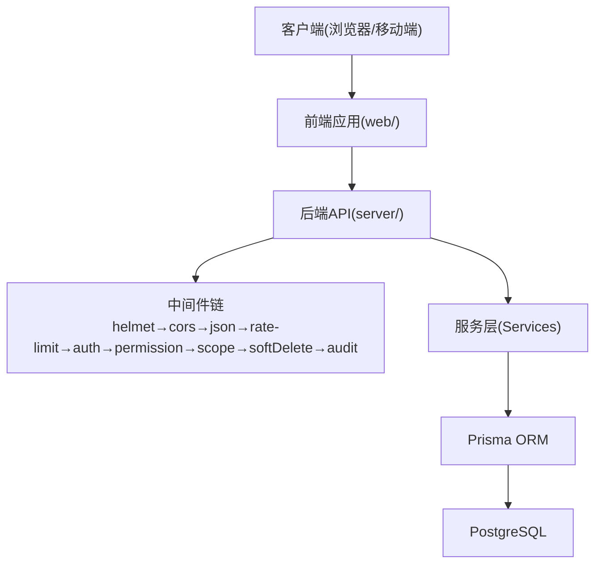
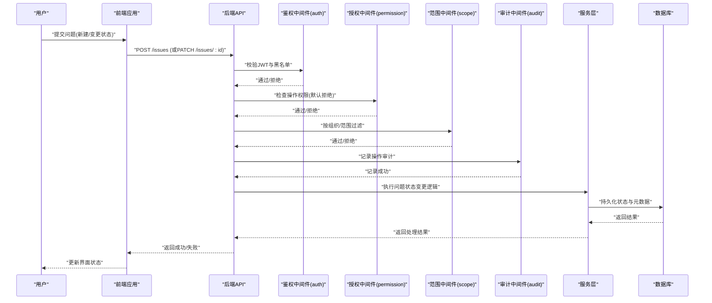
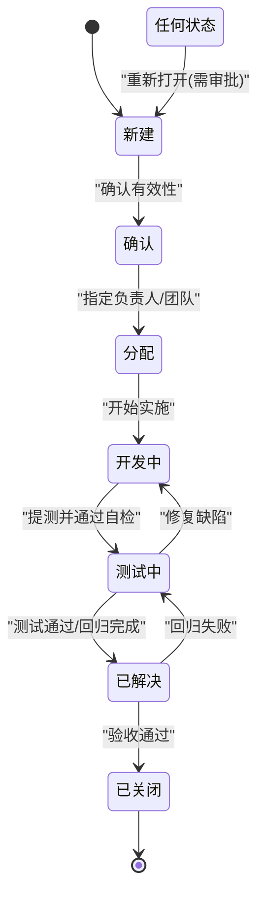
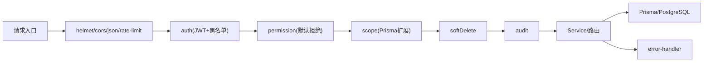

# 问题跟踪流程

<cite>
**本文引用的文件**   
- [server/src/app.ts](file://server/src/app.ts)
- [server/src/server.ts](file://server/src/server.ts)
- [server/src/middleware/auth.ts](file://server/src/middleware/auth.ts)
- [server/src/middleware/permission.ts](file://server/src/middleware/permission.ts)
- [server/src/middleware/scope.ts](file://server/src/middleware/scope.ts)
- [server/src/middleware/audit.ts](file://server/src/middleware/audit.ts)
- [server/src/middleware/error-handler.ts](file://server/src/middleware/error-handler.ts)
- [server/src/lib/errors.ts](file://server/src/lib/errors.ts)
- [server/src/lib/jwt.ts](file://server/src/lib/jwt.ts)
- [server/src/routes/admin.ts](file://server/src/routes/admin.ts)
- [server/src/services/AdminService.ts](file://server/src/services/AdminService.ts)
- [server/prisma/schema.prisma](file://server/prisma/schema.prisma)
- [web/src/lib/constants.ts](file://web/src/lib/constants.ts)
- [web/src/components/ui/status-indicator.tsx](file://web/src/components/ui/status-indicator.tsx)
- [web/src/pages/admin/index.tsx](file://web/src/pages/admin/index.tsx)
</cite>

## 目录
1. [简介](#简介)
2. [项目结构](#项目结构)
3. [核心组件](#核心组件)
4. [架构总览](#架构总览)
5. [详细组件分析](#详细组件分析)
6. [依赖关系分析](#依赖关系分析)
7. [性能考虑](#性能考虑)
8. [故障排查指南](#故障排查指南)
9. [结论](#结论)
10. [附录](#附录)

## 简介
本文件为FY200财年经营数据分析平台的问题跟踪与状态管理流程规范。目标是为“新建、确认、分配、开发中、测试中、已解决、已关闭”等生命周期状态提供统一的规则，明确分类与标签体系（模块：认证、数据、指标、AI、权限；类型：Bug、功能建议、性能问题、安全问题），定义优先级标准（P0紧急修复、P1重要功能、P2一般改进、P3优化建议），并给出SLA时效要求（响应时间、解决时限、验证周期）以及升级机制与跨团队协作流程。文档同时结合后端中间件链与权限模型，确保问题处理过程可审计、可追踪、可度量。

## 项目结构
FY200采用前后端分离架构：
- 后端Express服务通过中间件链完成鉴权、授权、范围控制、软删除、审计等操作，最终由Prisma访问PostgreSQL。
- 前端React应用负责用户交互与状态展示，包含通用UI组件（如状态指示器）、常量定义与管理页面。

图表来源
- [server/src/app.ts](file://server/src/app.ts)
- [server/src/server.ts](file://server/src/server.ts)
- [server/src/middleware/auth.ts](file://server/src/middleware/auth.ts)
- [server/src/middleware/permission.ts](file://server/src/middleware/permission.ts)
- [server/src/middleware/scope.ts](file://server/src/middleware/scope.ts)
- [server/src/middleware/audit.ts](file://server/src/middleware/audit.ts)
- [server/prisma/schema.prisma](file://server/prisma/schema.prisma)

章节来源
- [server/src/app.ts](file://server/src/app.ts)
- [server/src/server.ts](file://server/src/server.ts)

## 核心组件
- 中间件链：统一安全与治理入口，保障请求在到达业务逻辑前完成鉴权、授权、范围与审计。
- 权限模型：默认拒绝策略，需显式授予权限方可访问资源。
- 审计记录：关键操作留痕，便于问题溯源与SLA统计。
- 错误处理：集中化错误捕获与标准化返回。
- 前端状态展示：使用状态指示器与常量定义，保证状态语义一致。

章节来源
- [server/src/middleware/auth.ts](file://server/src/middleware/auth.ts)
- [server/src/middleware/permission.ts](file://server/src/middleware/permission.ts)
- [server/src/middleware/scope.ts](file://server/src/middleware/scope.ts)
- [server/src/middleware/audit.ts](file://server/src/middleware/audit.ts)
- [server/src/middleware/error-handler.ts](file://server/src/middleware/error-handler.ts)
- [server/src/lib/errors.ts](file://server/src/lib/errors.ts)
- [web/src/lib/constants.ts](file://web/src/lib/constants.ts)
- [web/src/components/ui/status-indicator.tsx](file://web/src/components/ui/status-indicator.tsx)

## 架构总览
下图展示了问题从创建到关闭的端到端流程，涵盖前端交互、后端鉴权与授权、服务层处理、数据库持久化与审计记录。

图表来源
- [server/src/middleware/auth.ts](file://server/src/middleware/auth.ts)
- [server/src/middleware/permission.ts](file://server/src/middleware/permission.ts)
- [server/src/middleware/scope.ts](file://server/src/middleware/scope.ts)
- [server/src/middleware/audit.ts](file://server/src/middleware/audit.ts)
- [server/src/routes/admin.ts](file://server/src/routes/admin.ts)
- [server/src/services/AdminService.ts](file://server/src/services/AdminService.ts)
- [server/prisma/schema.prisma](file://server/prisma/schema.prisma)

## 详细组件分析

### 问题生命周期与状态机
- 状态集合：新建、确认、分配、开发中、测试中、已解决、已关闭。
- 转换规则：
  - 新建 → 确认：由问题管理员或负责人确认问题有效性与范围。
  - 确认 → 分配：指定负责人与协作团队。
  - 分配 → 开发中：开始实施修复或实现。
  - 开发中 → 测试中：提交代码并通过基础自检后进入测试。
  - 测试中 → 已解决：测试通过且回归验证完成。
  - 已解决 → 已关闭：需求方或质量验收通过后关闭。
  - 任意状态 → 重新打开：若发现未覆盖缺陷或回归失败，退回上一阶段。
- 约束：
  - 状态变更需具备相应权限（如分配、转测、关闭）。
  - 每次变更必须记录审计日志（操作人、时间、原因、前后状态）。
  - 涉及跨团队时需在备注中说明协作方与交接点。

图表来源
- [server/src/middleware/audit.ts](file://server/src/middleware/audit.ts)
- [server/src/services/AdminService.ts](file://server/src/services/AdminService.ts)
- [server/prisma/schema.prisma](file://server/prisma/schema.prisma)

章节来源
- [server/src/services/AdminService.ts](file://server/src/services/AdminService.ts)
- [server/src/middleware/audit.ts](file://server/src/middleware/audit.ts)
- [server/prisma/schema.prisma](file://server/prisma/schema.prisma)

### 分类与标签体系
- 模块分类：认证、数据、指标、AI、权限。用于定位问题所属领域与影响面。
- 类型分类：Bug、功能建议、性能问题、安全问题。用于指导处理策略与评审路径。
- 组合规则：每个问题至少选择一个模块与一个类型；必要时可增加自定义标签（如环境、版本、影响范围）。
- 标签维护：由管理员统一维护，避免歧义与重复。

章节来源
- [web/src/lib/constants.ts](file://web/src/lib/constants.ts)
- [server/src/middleware/permission.ts](file://server/src/middleware/permission.ts)

### 优先级定义标准
- P0 紧急修复：系统不可用、数据泄露、资金风险、严重合规问题。要求立即响应与修复。
- P1 重要功能：核心业务流程受阻或重大体验问题。要求快速修复与严格回归。
- P2 一般改进：非关键功能优化或体验提升。按计划排期处理。
- P3 优化建议：长期优化、技术债清理、性能调优。纳入迭代规划。

章节来源
- [web/src/lib/constants.ts](file://web/src/lib/constants.ts)

### SLA时效要求
- 响应时间：
  - P0：15分钟内响应并评估影响面。
  - P1：30分钟内响应。
  - P2：2小时内响应。
  - P3：4小时内响应。
- 解决时限：
  - P0：4小时内修复或提供临时规避方案。
  - P1：24小时内修复。
  - P2：3个工作日内修复。
  - P3：按迭代计划推进。
- 验证周期：
  - 所有状态进入“已解决”前需完成测试验证与回归。
  - P0/P1需额外进行生产模拟验证与回滚预案演练。

章节来源
- [server/src/middleware/audit.ts](file://server/src/middleware/audit.ts)
- [web/src/components/ui/status-indicator.tsx](file://web/src/components/ui/status-indicator.tsx)

### 问题升级机制与跨团队协作
- 升级触发条件：
  - 超过SLA未响应或未解决。
  - 影响范围扩大或风险升级。
  - 需要跨部门资源协调。
- 升级路径：
  - 一线工程师 → 模块负责人 → 项目经理/技术负责人 → 管理层。
- 协作流程：
  - 明确主责人与协作方，记录在问题备注。
  - 建立临时沟通渠道（群组/会议），同步进展。
  - 跨团队交付物需通过接口契约与验收标准。

章节来源
- [server/src/middleware/audit.ts](file://server/src/middleware/audit.ts)
- [server/src/middleware/permission.ts](file://server/src/middleware/permission.ts)

### 权限与审计
- 权限模型：默认拒绝，需显式授予操作权限（如创建、分配、转测、关闭）。
- 审计记录：所有状态变更、标签修改、优先级调整均需记录操作人、时间、原因。
- 范围控制：基于组织/租户维度限制可见性与操作范围。

章节来源
- [server/src/middleware/permission.ts](file://server/src/middleware/permission.ts)
- [server/src/middleware/scope.ts](file://server/src/middleware/scope.ts)
- [server/src/middleware/audit.ts](file://server/src/middleware/audit.ts)

### 前端状态展示与交互
- 状态指示器：统一渲染问题状态，确保语义一致。
- 常量定义：集中管理状态枚举、类型、模块、优先级等字典项。
- 管理页面：提供问题列表、筛选、编辑、流转操作入口。

章节来源
- [web/src/components/ui/status-indicator.tsx](file://web/src/components/ui/status-indicator.tsx)
- [web/src/lib/constants.ts](file://web/src/lib/constants.ts)
- [web/src/pages/admin/index.tsx](file://web/src/pages/admin/index.tsx)

## 依赖关系分析
- 中间件依赖顺序：helmet → cors → express.json → rate-limit → auth → permission → scope → softDelete → audit。
- 权限与范围：permission决定操作是否允许，scope决定数据可见性。
- 审计与错误：audit记录关键操作，error-handler统一异常处理。

图表来源
- [server/src/app.ts](file://server/src/app.ts)
- [server/src/server.ts](file://server/src/server.ts)
- [server/src/middleware/auth.ts](file://server/src/middleware/auth.ts)
- [server/src/middleware/permission.ts](file://server/src/middleware/permission.ts)
- [server/src/middleware/scope.ts](file://server/src/middleware/scope.ts)
- [server/src/middleware/audit.ts](file://server/src/middleware/audit.ts)
- [server/src/middleware/error-handler.ts](file://server/src/middleware/error-handler.ts)

章节来源
- [server/src/app.ts](file://server/src/app.ts)
- [server/src/server.ts](file://server/src/server.ts)

## 性能考虑
- 中间件开销：尽量减少不必要的计算与I/O，避免阻塞主线程。
- 数据库查询：使用Prisma关联查询与分页，避免N+1问题。
- 缓存策略：对只读数据（如字典、配置）进行缓存，降低数据库压力。
- 异步处理：耗时任务（如报表生成、AI分析）采用队列与异步执行。

[本节为通用指导，不直接分析具体文件]

## 故障排查指南
- 常见问题：
  - 鉴权失败：检查JWT有效期、黑名单、签名密钥。
  - 权限不足：确认角色与权限配置是否正确。
  - 范围越界：检查scope配置与用户组织归属。
  - 审计缺失：确认audit中间件是否生效。
- 排查步骤：
  - 查看错误日志与统一错误响应。
  - 检查审计记录与状态变更记录。
  - 复现问题并逐步缩小范围。
  - 必要时启用调试模式与详细日志。

章节来源
- [server/src/middleware/error-handler.ts](file://server/src/middleware/error-handler.ts)
- [server/src/lib/errors.ts](file://server/src/lib/errors.ts)
- [server/src/middleware/audit.ts](file://server/src/middleware/audit.ts)

## 结论
本流程规范为FY200项目提供了标准化的问题跟踪与状态管理机制，结合后端中间件链与权限模型，确保问题处理过程安全、可审计、可度量。通过明确的分类、优先级与SLA要求，提升团队协作效率与问题闭环质量。建议在实际落地中持续优化流程与工具支持，以适应业务变化与技术演进。

[本节为总结性内容，不直接分析具体文件]

## 附录
- 术语表：
  - 状态：问题所处生命周期阶段。
  - 标签：描述问题属性与范围的标识。
  - 优先级：问题处理的紧急程度。
  - SLA：服务级别协议，规定响应与解决时限。
- 参考文件：
  - 中间件实现：auth、permission、scope、audit、error-handler。
  - 前端组件：status-indicator、constants、admin页面。
  - 数据库模型：schema.prisma。

[本节为补充信息，不直接分析具体文件]