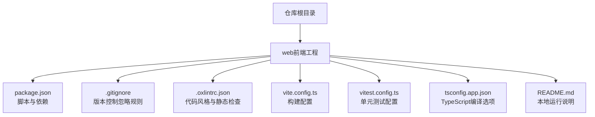
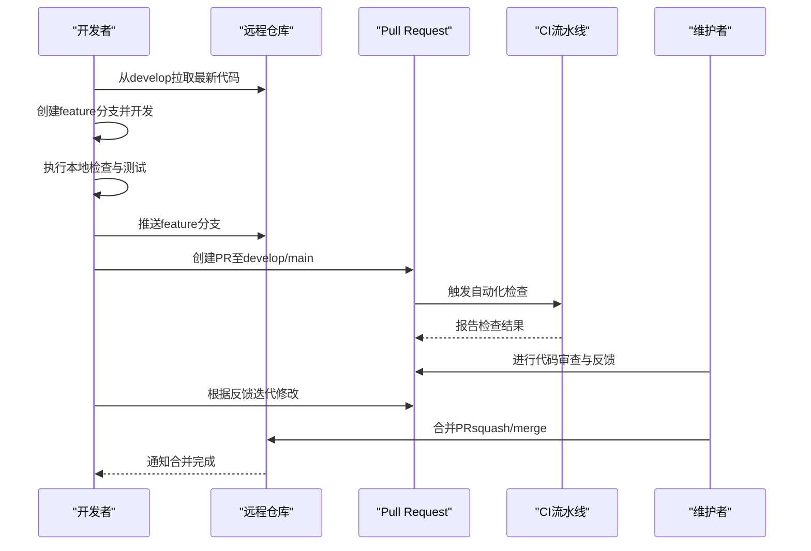
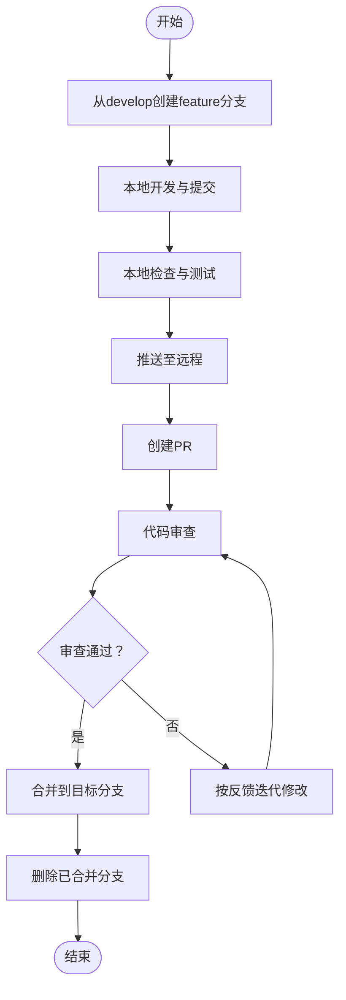
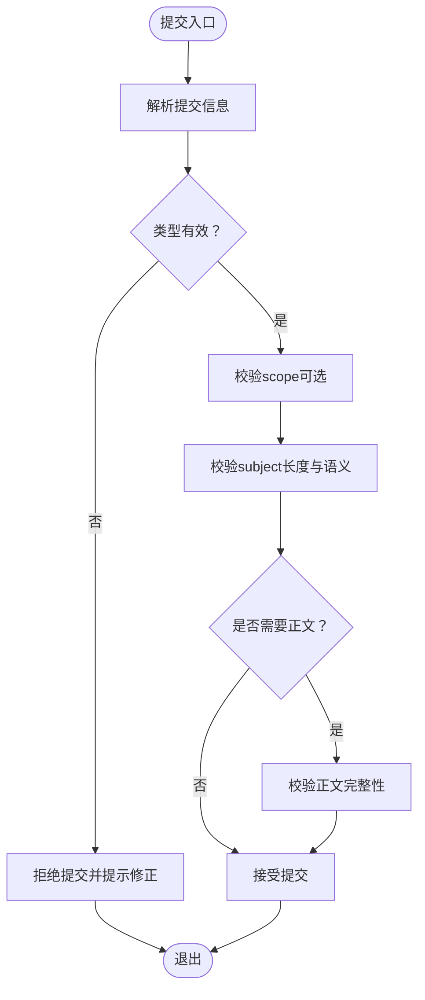
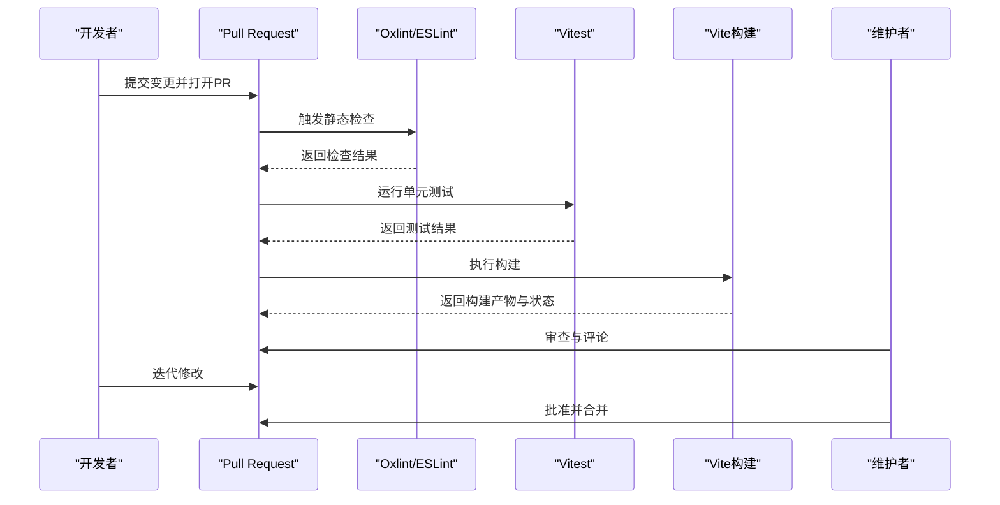
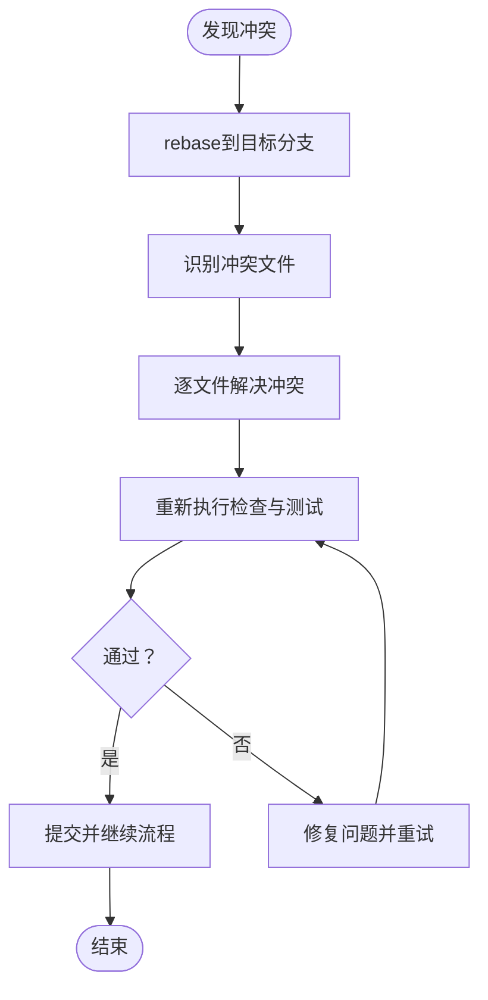
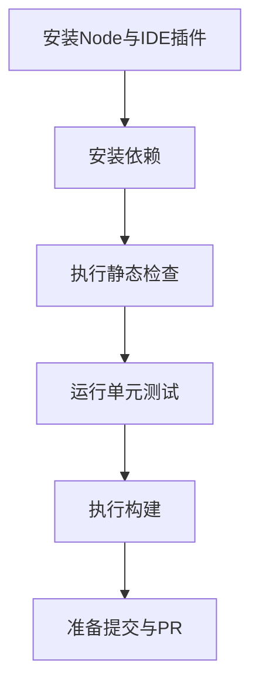
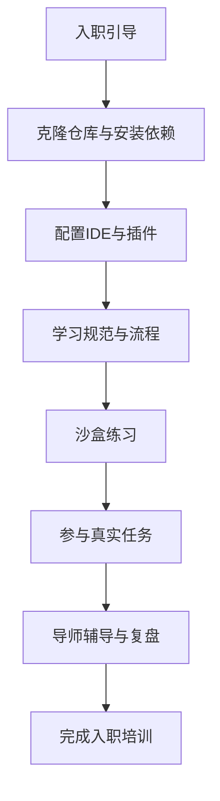
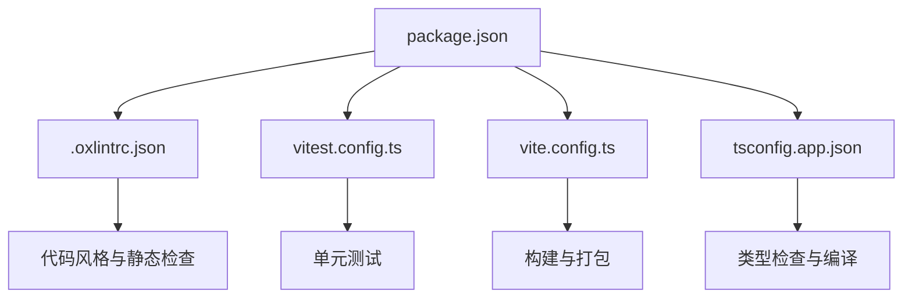

# Git工作流规范

<cite>
**本文引用的文件**   
- [package.json](file://web/package.json)
- [.gitignore](file://web/.gitignore)
- [.oxlintrc.json](file://web/.oxlintrc.json)
- [vite.config.ts](file://web/vite.config.ts)
- [vitest.config.ts](file://web/vitest.config.ts)
- [tsconfig.app.json](file://web/tsconfig.app.json)
- [README.md](file://web/README.md)
</cite>

## 目录
1. [简介](#简介)
2. [项目结构](#项目结构)
3. [核心组件](#核心组件)
4. [架构总览](#架构总览)
5. [详细组件分析](#详细组件分析)
6. [依赖分析](#依赖分析)
7. [性能考虑](#性能考虑)
8. [故障排查指南](#故障排查指南)
9. [结论](#结论)
10. [附录](#附录)

## 简介
本规范面向pj3项目的团队协作，统一Git分支管理、提交信息格式、代码审查流程、冲突解决策略与开发环境配置。目标是降低协作成本、提升交付质量与可追溯性，帮助新成员快速融入团队节奏。

## 项目结构
仓库采用前端工程化组织方式，根目录下包含文档与Web应用子模块。与Git工作流直接相关的配置文件集中在web子目录中，包括构建、测试、类型检查与忽略规则等。

**图示来源**
- [package.json](file://web/package.json)
- [.gitignore](file://web/.gitignore)
- [.oxlintrc.json](file://web/.oxlintrc.json)
- [vite.config.ts](file://web/vite.config.ts)
- [vitest.config.ts](file://web/vitest.config.ts)
- [tsconfig.app.json](file://web/tsconfig.app.json)
- [README.md](file://web/README.md)

**章节来源**
- [package.json](file://web/package.json)
- [.gitignore](file://web/.gitignore)
- [.oxlintrc.json](file://web/.oxlintrc.json)
- [vite.config.ts](file://web/vite.config.ts)
- [vitest.config.ts](file://web/vitest.config.ts)
- [tsconfig.app.json](file://web/tsconfig.app.json)
- [README.md](file://web/README.md)

## 核心组件
本节定义Git工作流的核心要素：分支模型、提交信息约定、PR与合并策略、冲突处理与开发环境配置。所有规则均围绕web子工程的构建与测试脚本展开，确保本地验证通过后再发起合并。

- 分支模型
  - 主分支保护
    - main/master：受保护，禁止直接推送；仅允许通过Pull Request合并。
    - develop：集成分支，用于日常功能集成与预发布验证。
  - 功能分支命名
    - 格式：feature/<编号>-<简述>，例如 feature/123-login-page。
    - 从develop拉取，完成后合并回develop。
  - 发布分支管理
    - 格式：release/vX.Y.Z，从develop切出，修复阻塞问题后打标签并合并到main与develop。
  - 热修复分支
    - 格式：hotfix/<编号>-<简述>，从main切出，修复后同时合并回main与develop。
  - 分支生命周期
    - 创建→开发→本地验证→提交→PR→审查→合并→清理。

- 提交信息格式
  - 类型标识：feat、fix、docs、style、refactor、perf、test、build、ci、chore、revert。
  - 结构：type(scope): subject
  - 要求：subject简明扼要；必要时在正文补充动机、影响范围与迁移步骤。
  - 建议：小步提交、原子化变更，避免一次性提交大量无关改动。

- 代码审查与合并策略
  - Pull Request模板：包含变更概述、影响范围、自测清单、截图或录屏（UI变更）。
  - 审查检查清单：
    - 是否通过全部本地检查（lint、类型检查、单测、构建）。
    - 变更是否符合规范与需求。
    - 是否存在回归风险与兼容性问题。
    - 是否需要更新文档或示例。
  - 合并策略：优先使用squash merge保持历史整洁；对需要保留完整历史的模块可使用merge commit。

- 冲突解决策略
  - 常见场景：并行修改同一文件、合并顺序不当、第三方库升级导致差异。
  - 解决步骤：
    - 先rebase到目标分支，再resolve冲突；必要时分阶段提交。
    - 冲突后重新执行本地检查与测试，确保无回归。
  - 预防措施：频繁同步上游、拆分大变更、明确文件归属与修改边界。

- 开发环境配置
  - Node.js与包管理器：遵循项目指定版本，建议使用nvm管理多版本。
  - IDE推荐：VS Code，安装ESLint/Oxlint、Prettier、TypeScript插件。
  - 快捷键与工作区设置：保存时自动格式化、开启错误提示、启用任务面板。
  - 本地验证命令：参考web/package.json中的scripts，依次执行lint、类型检查、测试与构建。

**章节来源**
- [package.json](file://web/package.json)
- [.gitignore](file://web/.gitignore)
- [.oxlintrc.json](file://web/.oxlintrc.json)
- [vite.config.ts](file://web/vite.config.ts)
- [vitest.config.ts](file://web/vitest.config.ts)
- [tsconfig.app.json](file://web/tsconfig.app.json)
- [README.md](file://web/README.md)

## 架构总览
下图展示一次典型的功能开发与合并流程，涵盖分支操作、本地验证、PR审查与合并策略。

**图示来源**
- [package.json](file://web/package.json)
- [vitest.config.ts](file://web/vitest.config.ts)
- [.oxlintrc.json](file://web/.oxlintrc.json)
- [vite.config.ts](file://web/vite.config.ts)

## 详细组件分析

### 分支管理与版本控制规范
- 主分支保护
  - 禁止直接push到main/master；必须通过PR合并。
  - 合并前需通过CI检查与至少一名维护者批准。
- 功能分支
  - 命名规范：feature/<编号>-<简述>。
  - 生命周期短小精悍，及时同步上游，减少冲突概率。
- 发布分支
  - 命名规范：release/vX.Y.Z。
  - 仅做缺陷修复与文档完善，不引入新功能。
- 热修复分支
  - 命名规范：hotfix/<编号>-<简述>。
  - 从main切出，修复后同时合并回main与develop，并打标签。

**图示来源**
- [package.json](file://web/package.json)
- [.gitignore](file://web/.gitignore)

**章节来源**
- [package.json](file://web/package.json)
- [.gitignore](file://web/.gitignore)

### 提交信息格式与协作标准
- 类型标识
  - feat：新功能
  - fix：缺陷修复
  - docs：文档更新
  - style：样式与格式调整
  - refactor：重构
  - perf：性能优化
  - test：测试相关
  - build：构建系统与外部依赖
  - ci：持续集成配置
  - chore：杂项与维护
  - revert：回滚
- 结构要求
  - type(scope): subject
  - 正文可选，但应包含动机、影响范围与迁移步骤。
- 协作沟通
  - 提交信息即变更记录，务必清晰可读。
  - 复杂变更拆分为多个原子提交，便于审查与回溯。

**图示来源**
- [package.json](file://web/package.json)

**章节来源**
- [package.json](file://web/package.json)

### 代码审查流程与质量控制
- PR模板要点
  - 变更概述：一句话描述目的与范围。
  - 影响面：涉及模块、接口、数据模型与兼容性。
  - 自测清单：lint、类型检查、单测、构建与关键路径验证。
  - 附件：截图、录屏或日志片段（适用于UI与交互变更）。
- 审查检查清单
  - 代码风格与静态检查通过。
  - 单测覆盖率与用例有效性。
  - 变更符合需求与设计文档。
  - 潜在风险与降级方案。
- 合并策略
  - 默认squash merge，保持历史简洁。
  - 对需要保留完整历史的模块使用merge commit。

**图示来源**
- [.oxlintrc.json](file://web/.oxlintrc.json)
- [vitest.config.ts](file://web/vitest.config.ts)
- [vite.config.ts](file://web/vite.config.ts)
- [package.json](file://web/package.json)

**章节来源**
- [.oxlintrc.json](file://web/.oxlintrc.json)
- [vitest.config.ts](file://web/vitest.config.ts)
- [vite.config.ts](file://web/vite.config.ts)
- [package.json](file://web/package.json)

### 冲突解决策略与预防
- 常见冲突场景
  - 多人并行修改同一文件。
  - 合并顺序不一致导致差异扩大。
  - 第三方库升级引发大范围变更。
- 解决步骤
  - 先rebase到目标分支，定位冲突文件。
  - 逐文件resolve冲突，保证逻辑正确与风格一致。
  - 重新执行本地检查与测试，确认无回归。
- 预防措施
  - 频繁同步上游，缩短分支生命周期。
  - 拆分大变更，减少冲突概率。
  - 明确文件归属与修改边界，建立模块负责人机制。

**图示来源**
- [package.json](file://web/package.json)

**章节来源**
- [package.json](file://web/package.json)

### 开发环境配置指南
- Node.js与包管理器
  - 使用nvm管理Node版本，确保与项目一致。
  - 推荐使用npm或yarn，遵循lock文件锁定依赖。
- IDE与插件
  - VS Code：安装Oxlint/ESLint、Prettier、TypeScript插件。
  - 开启保存时自动格式化与错误提示。
- 快捷键与工作区
  - 常用快捷键：查找替换、跳转到定义、运行任务。
  - 工作区设置：统一缩进、行宽、引号与分号风格。
- 本地验证命令
  - 参考web/package.json的scripts，依次执行lint、类型检查、测试与构建。
  - 建议在提交前全量执行，确保CI一次性通过。

**图示来源**
- [package.json](file://web/package.json)
- [.oxlintrc.json](file://web/.oxlintrc.json)
- [vitest.config.ts](file://web/vitest.config.ts)
- [vite.config.ts](file://web/vite.config.ts)
- [tsconfig.app.json](file://web/tsconfig.app.json)
- [README.md](file://web/README.md)

**章节来源**
- [package.json](file://web/package.json)
- [.oxlintrc.json](file://web/.oxlintrc.json)
- [vitest.config.ts](file://web/vitest.config.ts)
- [vite.config.ts](file://web/vite.config.ts)
- [tsconfig.app.json](file://web/tsconfig.app.json)
- [README.md](file://web/README.md)

### 新成员入职培训材料
- 第一天
  - 克隆仓库、安装依赖、启动本地服务。
  - 阅读README与项目结构说明。
  - 配置IDE与插件，熟悉快捷键与工作区设置。
- 第二天
  - 学习分支模型与提交信息规范。
  - 在沙盒分支上练习提交、PR与合并流程。
- 第三天
  - 参与真实任务，从小变更开始。
  - 跟随导师进行代码审查与冲突解决演练。
- 常用命令与脚本
  - 参考web/package.json的scripts，掌握lint、测试与构建命令。
  - 遇到问题先查看README与错误日志，再向团队求助。

[本图为概念性流程图，无需图示来源]

## 依赖分析
Git工作流与前端工程化工具链紧密耦合，主要依赖如下：
- Oxlint：代码风格与静态检查，确保提交前一致性。
- Vitest：单元测试框架，保障功能正确性与回归防护。
- Vite：构建工具，负责打包与资源处理。
- TypeScript：类型系统，提升代码健壮性与可维护性。
- package.json：集中定义脚本与依赖，驱动本地验证与CI流程。

**图示来源**
- [package.json](file://web/package.json)
- [.oxlintrc.json](file://web/.oxlintrc.json)
- [vitest.config.ts](file://web/vitest.config.ts)
- [vite.config.ts](file://web/vite.config.ts)
- [tsconfig.app.json](file://web/tsconfig.app.json)

**章节来源**
- [package.json](file://web/package.json)
- [.oxlintrc.json](file://web/.oxlintrc.json)
- [vitest.config.ts](file://web/vitest.config.ts)
- [vite.config.ts](file://web/vite.config.ts)
- [tsconfig.app.json](file://web/tsconfig.app.json)

## 性能考虑
- 提交粒度
  - 小步提交有助于快速审查与回滚，减少冲突与回归风险。
- 本地验证
  - 在提交前执行完整的lint、类型检查、测试与构建，避免CI反复失败。
- 分支生命周期
  - 缩短分支存活时间，频繁同步上游，降低合并复杂度。
- 依赖管理
  - 谨慎升级第三方库，评估影响面并在PR中说明。

[本节为通用指导，无需章节来源]

## 故障排查指南
- 常见问题
  - 静态检查失败：检查Oxlint配置与代码风格一致性。
  - 类型检查报错：核对tsconfig与类型定义，确保导入路径正确。
  - 单测失败：定位失败用例，补充断言或修复实现。
  - 构建失败：检查依赖版本与构建配置，清理缓存后重试。
- 排查步骤
  - 复现问题，查看错误日志与输出。
  - 逐步缩小范围，隔离变更点。
  - 参考README与配置文件，确认环境与脚本正确。
  - 如无法解决，携带日志与最小复现向团队求助。

**章节来源**
- [.oxlintrc.json](file://web/.oxlintrc.json)
- [vitest.config.ts](file://web/vitest.config.ts)
- [vite.config.ts](file://web/vite.config.ts)
- [tsconfig.app.json](file://web/tsconfig.app.json)
- [README.md](file://web/README.md)

## 结论
通过统一的分支模型、提交信息规范、PR审查流程与本地验证脚本，pj3项目能够显著提升协作效率与交付质量。建议将本规范纳入团队公约，并结合CI自动化持续改进。

[本节为总结性内容，无需章节来源]

## 附录
- 术语表
  - PR：Pull Request，拉取请求。
  - CI：持续集成，自动化检查与构建。
  - Squash Merge：压缩合并，将多次提交合并为一个。
- 参考链接
  - web/README.md：本地运行与使用说明。
  - web/package.json：脚本与依赖定义。

[本节为参考资料，无需章节来源]