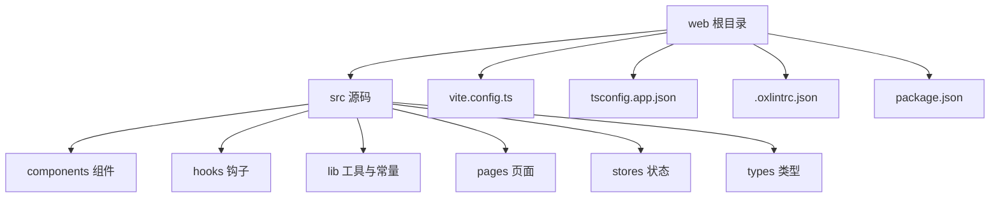
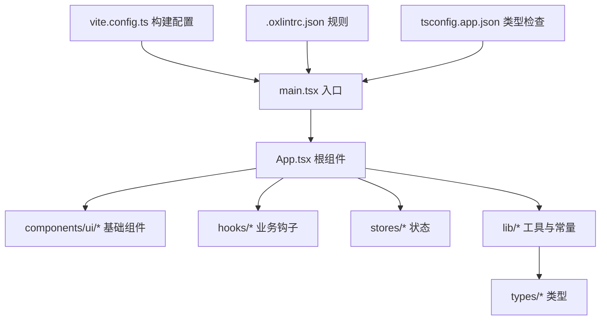
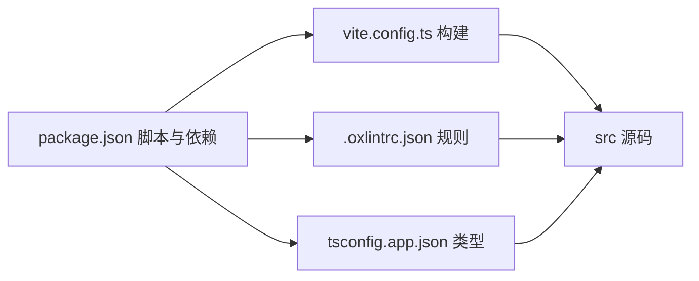

# 代码风格规范

<cite>
**本文引用的文件**   
- [web/.oxlintrc.json](file://web/.oxlintrc.json)
- [web/package.json](file://web/package.json)
- [web/vite.config.ts](file://web/vite.config.ts)
- [web/tsconfig.app.json](file://web/tsconfig.app.json)
- [web/src/main.tsx](file://web/src/main.tsx)
- [web/src/App.tsx](file://web/src/App.tsx)
- [web/src/lib/constants.ts](file://web/src/lib/constants.ts)
- [web/src/lib/utils.ts](file://web/src/lib/utils.ts)
- [web/src/components/ui/button.tsx](file://web/src/components/ui/button.tsx)
- [web/src/hooks/useAuth.ts](file://web/src/hooks/useAuth.ts)
- [web/src/stores/authStore.ts](file://web/src/stores/authStore.ts)
</cite>

## 目录
1. [简介](#简介)
2. [项目结构](#项目结构)
3. [核心组件](#核心组件)
4. [架构总览](#架构总览)
5. [详细组件分析](#详细组件分析)
6. [依赖分析](#依赖分析)
7. [性能考虑](#性能考虑)
8. [故障排查指南](#故障排查指南)
9. [结论](#结论)
10. [附录](#附录)

## 简介
本规范面向 pj3 项目的 JavaScript/TypeScript 编码与工程化实践，覆盖以下方面：
- 语言与类型约定（变量命名、函数定义、类与模块组织）
- 代码质量检查与格式化（Oxlint 规则、ESLint 集成建议）
- 注释规范（单行、多行、JSDoc）
- 文件组织结构（导入导出顺序、依赖管理、常量定义）
- 自动化检查工具集成与常见问题处理
- 正确与错误写法对比示例（以路径引用代替具体代码片段）

目标：统一团队风格、降低审查成本、提升可维护性与可读性。

## 项目结构
前端位于 web 子目录，采用 Vite + React + TypeScript 技术栈，使用 Oxlint 进行静态检查，Tailwind CSS 作为样式方案。关键目录与职责：
- src/components：可复用 UI 与业务组件
- src/hooks：React Hooks 封装
- src/lib：通用工具、常量、API 封装等
- src/pages：页面级路由入口
- src/stores：状态管理（轻量 store）
- src/types：全局类型声明
- vite.config.ts：构建配置
- tsconfig.app.json：应用编译选项
- .oxlintrc.json：Oxlint 规则配置
- package.json：脚本与依赖

**图表来源**
- [web/vite.config.ts](file://web/vite.config.ts)
- [web/tsconfig.app.json](file://web/tsconfig.app.json)
- [web/.oxlintrc.json](file://web/.oxlintrc.json)
- [web/package.json](file://web/package.json)

**章节来源**
- [web/vite.config.ts](file://web/vite.config.ts)
- [web/tsconfig.app.json](file://web/tsconfig.app.json)
- [web/.oxlintrc.json](file://web/.oxlintrc.json)
- [web/package.json](file://web/package.json)

## 核心组件
本节聚焦与代码风格强相关的“核心”工程化要素：
- Oxlint 规则与启用方式
- TypeScript 编译与严格模式
- Vite 构建与开发体验
- 包管理与脚本命令

要点：
- 通过 .oxlintrc.json 集中管理规则，确保团队一致
- 在 package.json 中提供 lint/format/build/dev 脚本，便于 CI/CD 集成
- 使用 tsconfig.app.json 开启严格类型检查，减少运行时错误
- 在 vite.config.ts 中合理配置别名、插件与优化项

**章节来源**
- [web/.oxlintrc.json](file://web/.oxlintrc.json)
- [web/package.json](file://web/package.json)
- [web/tsconfig.app.json](file://web/tsconfig.app.json)
- [web/vite.config.ts](file://web/vite.config.ts)

## 架构总览
下图展示从入口到组件与工具链的调用关系，帮助理解代码风格在各层的落地位置。

**图表来源**
- [web/src/main.tsx](file://web/src/main.tsx)
- [web/src/App.tsx](file://web/src/App.tsx)
- [web/src/components/ui/button.tsx](file://web/src/components/ui/button.tsx)
- [web/src/hooks/useAuth.ts](file://web/src/hooks/useAuth.ts)
- [web/src/stores/authStore.ts](file://web/src/stores/authStore.ts)
- [web/src/lib/constants.ts](file://web/src/lib/constants.ts)
- [web/src/lib/utils.ts](file://web/src/lib/utils.ts)
- [web/vite.config.ts](file://web/vite.config.ts)
- [web/.oxlintrc.json](file://web/.oxlintrc.json)
- [web/tsconfig.app.json](file://web/tsconfig.app.json)

## 详细组件分析

### 命名与类型约定
- 变量与函数
  - 使用小驼峰命名；避免缩写，必要时在类型或注释中说明
  - 布尔值使用 is/has/can 前缀，语义清晰
  - 异步函数名体现异步语义（如 fetchXxx、loadXxx）
- 常量
  - 全大写下划线分隔，集中定义于 lib/constants.ts
  - 按领域分组，避免散落在业务文件中
- 类型与接口
  - 使用 TypeScript 接口描述数据结构，优先显式类型而非 any
  - 泛型用于可复用逻辑，保持类型安全
- 组件与 Hook
  - 组件文件名使用 PascalCase，Hook 文件名使用 useXxx 形式
  - 组件 props 使用独立接口定义，默认值通过解构赋值设置

参考实现位置：
- [web/src/lib/constants.ts](file://web/src/lib/constants.ts)
- [web/src/lib/utils.ts](file://web/src/lib/utils.ts)
- [web/src/components/ui/button.tsx](file://web/src/components/ui/button.tsx)
- [web/src/hooks/useAuth.ts](file://web/src/hooks/useAuth.ts)

**章节来源**
- [web/src/lib/constants.ts](file://web/src/lib/constants.ts)
- [web/src/lib/utils.ts](file://web/src/lib/utils.ts)
- [web/src/components/ui/button.tsx](file://web/src/components/ui/button.tsx)
- [web/src/hooks/useAuth.ts](file://web/src/hooks/useAuth.ts)

### 函数与模块组织
- 单一职责：每个函数只做一件事，长度适中，复杂逻辑拆分为私有辅助函数
- 参数校验：对输入做前置校验，失败快速返回并抛出明确错误
- 模块化：
  - 导入顺序：第三方库 → 内部模块 → 相对路径组件/工具
  - 导出：优先具名导出，按需导出，避免 barrel 文件过度聚合
- 副作用隔离：将副作用集中在 hooks 或 utils 中，保持纯函数可测试性

参考实现位置：
- [web/src/lib/utils.ts](file://web/src/lib/utils.ts)
- [web/src/hooks/useAuth.ts](file://web/src/hooks/useAuth.ts)

**章节来源**
- [web/src/lib/utils.ts](file://web/src/lib/utils.ts)
- [web/src/hooks/useAuth.ts](file://web/src/hooks/useAuth.ts)

### 类与状态管理
- 轻量状态使用 store 模式，避免过度抽象
- 状态变更方法应幂等且可追踪，配合日志或埋点
- 跨组件共享状态需明确所有权与生命周期

参考实现位置：
- [web/src/stores/authStore.ts](file://web/src/stores/authStore.ts)

**章节来源**
- [web/src/stores/authStore.ts](file://web/src/stores/authStore.ts)

### 注释规范
- 单行注释：解释“为什么”，而非“是什么”
- 多行注释：用于复杂算法、边界条件说明
- JSDoc：对外暴露的 API、公共函数、组件 props 使用 JSDoc 标注，包含参数、返回值、异常说明
- 禁止无意义注释，随代码演进及时更新

参考实现位置：
- [web/src/lib/utils.ts](file://web/src/lib/utils.ts)
- [web/src/components/ui/button.tsx](file://web/src/components/ui/button.tsx)

**章节来源**
- [web/src/lib/utils.ts](file://web/src/lib/utils.ts)
- [web/src/components/ui/button.tsx](file://web/src/components/ui/button.tsx)

### 文件组织结构与导入导出
- 目录划分：按功能域组织，避免深层嵌套
- 导入顺序：第三方 → 内部模块 → 本地资源
- 依赖管理：尽量就近引入，避免循环依赖
- 常量与枚举：集中管理，避免魔法字符串

参考实现位置：
- [web/src/lib/constants.ts](file://web/src/lib/constants.ts)
- [web/src/App.tsx](file://web/src/App.tsx)
- [web/src/main.tsx](file://web/src/main.tsx)

**章节来源**
- [web/src/lib/constants.ts](file://web/src/lib/constants.ts)
- [web/src/App.tsx](file://web/src/App.tsx)
- [web/src/main.tsx](file://web/src/main.tsx)

### Oxlint 规则与代码质量检查
- 规则来源：.oxlintrc.json 集中配置
- 建议启用的规则类别：
  - 语法与潜在错误（no-unused-vars、no-const-assign 等）
  - 代码风格（indent、quotes、semi、curly 等）
  - 最佳实践（prefer-const、no-var、eqeqeq 等）
  - 类型相关（结合 TypeScript 严格模式）
- 运行方式：
  - 本地：npm run lint
  - 提交前：husky + lint-stages（可选）
  - CI：在流水线执行 npm run lint

参考实现位置：
- [web/.oxlintrc.json](file://web/.oxlintrc.json)
- [web/package.json](file://web/package.json)

**章节来源**
- [web/.oxlintrc.json](file://web/.oxlintrc.json)
- [web/package.json](file://web/package.json)

### ESLint 集成建议（可选）
- 若需要更丰富的生态与插件体系，可在项目中引入 ESLint，并通过 eslint-plugin-react、eslint-plugin-typescript 等扩展能力
- 与 Oxlint 共存时，建议：
  - 仅保留必要规则，避免重复冲突
  - 在 CI 中统一执行，输出报告
- 推荐流程：
  - 本地：npm run lint:eslint
  - 提交前：lint-stages 自动修复部分问题
  - CI：并行执行 Oxlint 与 ESLint，阻断合并

参考实现位置：
- [web/package.json](file://web/package.json)

**章节来源**
- [web/package.json](file://web/package.json)

### 自动格式化与编辑器集成
- 建议在编辑器中启用保存时自动修复（基于 Oxlint 或 Prettier，二选一）
- 统一换行、缩进、引号、分号等格式策略，避免人工分歧
- 在仓库根或 web 目录放置配置文件，确保团队一致性

参考实现位置：
- [web/.oxlintrc.json](file://web/.oxlintrc.json)
- [web/package.json](file://web/package.json)

**章节来源**
- [web/.oxlintrc.json](file://web/.oxlintrc.json)
- [web/package.json](file://web/package.json)

### 构建与类型检查
- 使用 tsconfig.app.json 开启严格模式，确保类型安全
- 在 vite.config.ts 中配置别名与插件，提高开发效率
- 构建产物与缓存目录纳入忽略列表

参考实现位置：
- [web/tsconfig.app.json](file://web/tsconfig.app.json)
- [web/vite.config.ts](file://web/vite.config.ts)

**章节来源**
- [web/tsconfig.app.json](file://web/tsconfig.app.json)
- [web/vite.config.ts](file://web/vite.config.ts)

### 正确与错误写法对比（示例路径）
以下为常见场景的正误对照，请根据路径查看实际实现：
- 常量定义
  - 正确：[web/src/lib/constants.ts](file://web/src/lib/constants.ts)
  - 错误：在业务文件中散落魔法字符串
- 函数参数校验
  - 正确：[web/src/lib/utils.ts](file://web/src/lib/utils.ts)
  - 错误：直接访问未校验的参数导致运行时错误
- 组件 Props 类型
  - 正确：[web/src/components/ui/button.tsx](file://web/src/components/ui/button.tsx)
  - 错误：使用 any 或缺失类型定义
- Hook 命名与职责
  - 正确：[web/src/hooks/useAuth.ts](file://web/src/hooks/useAuth.ts)
  - 错误：Hook 内包含大量无关副作用
- Store 状态更新
  - 正确：[web/src/stores/authStore.ts](file://web/src/stores/authStore.ts)
  - 错误：直接修改外部对象属性，破坏不可变性

**章节来源**
- [web/src/lib/constants.ts](file://web/src/lib/constants.ts)
- [web/src/lib/utils.ts](file://web/src/lib/utils.ts)
- [web/src/components/ui/button.tsx](file://web/src/components/ui/button.tsx)
- [web/src/hooks/useAuth.ts](file://web/src/hooks/useAuth.ts)
- [web/src/stores/authStore.ts](file://web/src/stores/authStore.ts)

## 依赖分析
下图展示主要依赖关系与工具链协作方式。

**图表来源**
- [web/package.json](file://web/package.json)
- [web/.oxlintrc.json](file://web/.oxlintrc.json)
- [web/vite.config.ts](file://web/vite.config.ts)
- [web/tsconfig.app.json](file://web/tsconfig.app.json)

**章节来源**
- [web/package.json](file://web/package.json)
- [web/.oxlintrc.json](file://web/.oxlintrc.json)
- [web/vite.config.ts](file://web/vite.config.ts)
- [web/tsconfig.app.json](file://web/tsconfig.app.json)

## 性能考虑
- 避免不必要的重渲染：合理使用 React.memo、useMemo、useCallback
- 懒加载与代码分割：页面级按需加载，减少首屏体积
- 常量与工具函数提取：减少重复计算与内存占用
- 日志与埋点：生产环境关闭冗余日志，避免 IO 瓶颈

## 故障排查指南
- 无法识别 Oxlint 命令
  - 确认已在 package.json 中安装并配置脚本
  - 参考：[web/package.json](file://web/package.json)
- 规则冲突或误报
  - 调整 .oxlintrc.json 中的规则优先级与排除项
  - 参考：[web/.oxlintrc.json](file://web/.oxlintrc.json)
- TypeScript 类型报错
  - 检查 tsconfig.app.json 的严格模式与路径别名
  - 参考：[web/tsconfig.app.json](file://web/tsconfig.app.json)
- 构建失败或缓存问题
  - 清理 node_modules 与构建缓存后重试
  - 检查 vite.config.ts 的插件与优化配置
  - 参考：[web/vite.config.ts](file://web/vite.config.ts)

**章节来源**
- [web/package.json](file://web/package.json)
- [web/.oxlintrc.json](file://web/.oxlintrc.json)
- [web/tsconfig.app.json](file://web/tsconfig.app.json)
- [web/vite.config.ts](file://web/vite.config.ts)

## 结论
通过统一的命名与类型约定、严格的 Oxlint 规则、清晰的注释与文件组织，以及完善的自动化检查与构建流程，pj3 项目能够在保证代码质量的同时提升团队协作效率。建议在新功能开发与日常维护中持续遵循本规范，并在迭代中逐步完善规则与文档。

## 附录

### 常用命令清单
- 代码检查：npm run lint
- 构建：npm run build
- 开发：npm run dev
- 类型检查：npm run type-check（如有）

参考实现位置：
- [web/package.json](file://web/package.json)

**章节来源**
- [web/package.json](file://web/package.json)