# 全面代码审查报告

<cite>
**本文引用的文件**   
- [server/src/app.ts](file://server/src/app.ts)
- [server/src/server.ts](file://server/src/server.ts)
- [server/src/config/env.ts](file://server/src/config/env.ts)
- [server/src/middleware/helmet.ts](file://server/src/middleware/helmet.ts)
- [server/src/middleware/cors.ts](file://server/src/middleware/cors.ts)
- [server/src/middleware/rate-limit.ts](file://server/src/middleware/rate-limit.ts)
- [server/src/middleware/auth.ts](file://server/src/middleware/auth.ts)
- [server/src/middleware/permission.ts](file://server/src/middleware/permission.ts)
- [server/src/middleware/scope.ts](file://server/src/middleware/scope.ts)
- [server/src/middleware/soft-delete.ts](file://server/src/middleware/soft-delete.ts)
- [server/src/middleware/audit.ts](file://server/src/middleware/audit.ts)
- [server/src/middleware/error-handler.ts](file://server/src/middleware/error-handler.ts)
- [server/src/middleware/trace-id.ts](file://server/src/middleware/trace-id.ts)
- [server/src/lib/jwt.ts](file://server/src/lib/jwt.ts)
- [server/src/lib/desensitize.ts](file://server/src/lib/desensitize.ts)
- [server/src/lib/formula.ts](file://server/src/lib/formula.ts)
- [server/src/lib/prisma.ts](file://server/src/lib/prisma.ts)
- [server/src/lib/logger.ts](file://server/src/lib/logger.ts)
- [server/src/lib/errors.ts](file://server/src/lib/errors.ts)
- [server/src/routes/auth.ts](file://server/src/routes/auth.ts)
- [server/src/routes/admin.ts](file://server/src/routes/admin.ts)
- [server/src/routes/ai.ts](file://server/src/routes/ai.ts)
- [server/src/routes/reports.ts](file://server/src/routes/reports.ts)
- [server/src/routes/data.ts](file://server/src/routes/data.ts)
- [server/src/routes/transactions.ts](file://server/src/routes/transactions.ts)
- [server/src/services/AIProxyService.ts](file://server/src/services/AIProxyService.ts)
- [server/src/services/AuthService.ts](file://server/src/services/AuthService.ts)
- [server/src/services/AggregationService.ts](file://server/src/services/AggregationService.ts)
- [server/src/services/DataService.ts](file://server/src/services/DataService.ts)
- [server/src/services/ReportService.ts](file://server/src/services/ReportService.ts)
- [server/src/services/TransactionService.ts](file://server/src/services/TransactionService.ts)
- [server/src/services/ImportService.ts](file://server/src/services/ImportService.ts)
- [server/src/services/EnterpriseInfoService.ts](file://server/src/services/EnterpriseInfoService.ts)
- [server/src/services/IndicatorsService.ts](file://server/src/services/IndicatorsService.ts)
- [server/src/services/ReclassificationService.ts](file://server/src/services/ReclassificationService.ts)
- [server/src/services/SubjectAnalysisService.ts](file://server/src/services/SubjectAnalysisService.ts)
- [server/src/services/AdminService.ts](file://server/src/services/AdminService.ts)
- [server/src/services/CollectionService.ts](file://server/src/services/CollectionService.ts)
- [server/src/services/DashboardService.ts](file://server/src/services/DashboardService.ts)
- [server/src/services/FormulaRuleService.ts](file://server/src/services/FormulaRuleService.ts)
- [server/prisma/schema.prisma](file://server/prisma/schema.prisma)
- [web/src/App.tsx](file://web/src/App.tsx)
- [web/src/main.tsx](file://web/src/main.tsx)
- [web/src/hooks/api-queries.ts](file://web/src/hooks/api-queries.ts)
- [web/src/lib/api.ts](file://web/src/lib/api.ts)
- [web/src/stores/authStore.ts](file://web/src/stores/authStore.ts)
</cite>

## 目录
1. [简介](#简介)
2. [项目结构](#项目结构)
3. [核心组件](#核心组件)
4. [架构总览](#架构总览)
5. [详细组件分析](#详细组件分析)
6. [依赖关系分析](#依赖关系分析)
7. [性能考量](#性能考量)
8. [故障排查指南](#故障排查指南)
9. [结论](#结论)
10. [附录](#附录)

## 简介
本项目为“浙江壹品慧财年经营数据分析平台”，定位为“Excel进、看板/报表出”的内部管理口径财务数据平台，单位统一为万元/人民币。后端采用 Express 4 + Prisma 5 + PostgreSQL 15，认证使用 JWT（access 15min + refresh 7day 轮转），AI 能力通过 DeepSeek API（SSE 流式）提供。中间件执行链顺序严格：helmet → cors → express.json → rate-limit → auth(JWT+黑名单) → permission(默认拒绝) → scope(Prisma extension) → softDelete → audit → Service → Prisma → PostgreSQL。计算类指标使用安全公式解析（白名单算子 +-*/()，禁止 eval），同比/环比由后端实时计算不存库。AI 双管道架构：polish（文本→脱敏→LLM→还原）/ analyze（结构化→计算→脱敏→LLM→生成），脱敏规则：绝对金额→区间，公司名→动态映射。

## 项目结构
仓库采用前后端分离的 monorepo 组织方式：
- server：Express 后端服务，包含路由、中间件、服务层、工具库与数据库迁移/种子脚本
- web：React/Vite 前端应用，包含页面、组件、状态管理与 API 封装
- docs：项目文档、规范与设计参考
- .husky：Git 钩子配置

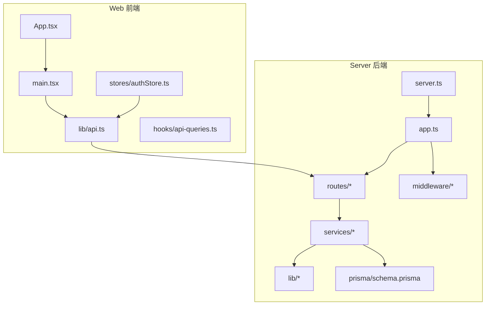

图表来源
- [server/src/server.ts:1-200](file://server/src/server.ts#L1-L200)
- [server/src/app.ts:1-200](file://server/src/app.ts#L1-L200)
- [web/src/App.tsx:1-200](file://web/src/App.tsx#L1-L200)
- [web/src/main.tsx:1-200](file://web/src/main.tsx#L1-L200)

章节来源
- [server/src/server.ts:1-200](file://server/src/server.ts#L1-L200)
- [server/src/app.ts:1-200](file://server/src/app.ts#L1-L200)
- [web/src/App.tsx:1-200](file://web/src/App.tsx#L1-L200)
- [web/src/main.tsx:1-200](file://web/src/main.tsx#L1-L200)

## 核心组件
- 中间件链：安全头、跨域、限流、鉴权、权限、数据范围、软删除、审计、错误处理、链路追踪
- 路由层：按领域划分（auth、admin、ai、reports、data、transactions、indicators、tools、dashboard）
- 服务层：业务逻辑聚合（Auth、Data、Report、Transaction、Import、EnterpriseInfo、Indicators、Reclassification、SubjectAnalysis、Admin、Collection、Dashboard、FormulaRule、AIProxy）
- 工具库：JWT、脱敏、公式解析、日志、错误定义、Prisma 客户端等
- 数据模型：Prisma schema 与迁移脚本

章节来源
- [server/src/middleware/helmet.ts:1-200](file://server/src/middleware/helmet.ts#L1-L200)
- [server/src/middleware/cors.ts:1-200](file://server/src/middleware/cors.ts#L1-L200)
- [server/src/middleware/rate-limit.ts:1-200](file://server/src/middleware/rate-limit.ts#L1-L200)
- [server/src/middleware/auth.ts:1-200](file://server/src/middleware/auth.ts#L1-L200)
- [server/src/middleware/permission.ts:1-200](file://server/src/middleware/permission.ts#L1-L200)
- [server/src/middleware/scope.ts:1-200](file://server/src/middleware/scope.ts#L1-L200)
- [server/src/middleware/soft-delete.ts:1-200](file://server/src/middleware/soft-delete.ts#L1-L200)
- [server/src/middleware/audit.ts:1-200](file://server/src/middleware/audit.ts#L1-L200)
- [server/src/middleware/error-handler.ts:1-200](file://server/src/middleware/error-handler.ts#L1-L200)
- [server/src/middleware/trace-id.ts:1-200](file://server/src/middleware/trace-id.ts#L1-L200)
- [server/src/lib/jwt.ts:1-200](file://server/src/lib/jwt.ts#L1-L200)
- [server/src/lib/desensitize.ts:1-200](file://server/src/lib/desensitize.ts#L1-L200)
- [server/src/lib/formula.ts:1-200](file://server/src/lib/formula.ts#L1-L200)
- [server/src/lib/prisma.ts:1-200](file://server/src/lib/prisma.ts#L1-L200)
- [server/src/lib/logger.ts:1-200](file://server/src/lib/logger.ts#L1-L200)
- [server/src/lib/errors.ts:1-200](file://server/src/lib/errors.ts#L1-L200)
- [server/prisma/schema.prisma:1-200](file://server/prisma/schema.prisma#L1-L200)

## 架构总览
系统遵循分层架构与严格的中间件管线，确保安全性、可观测性与可扩展性。请求从 Web 进入 Express，依次经过安全与鉴权中间件，再交由路由与服务层处理，最终通过 Prisma 访问 PostgreSQL。AI 能力以代理模式接入 DeepSeek，支持 SSE 流式响应。

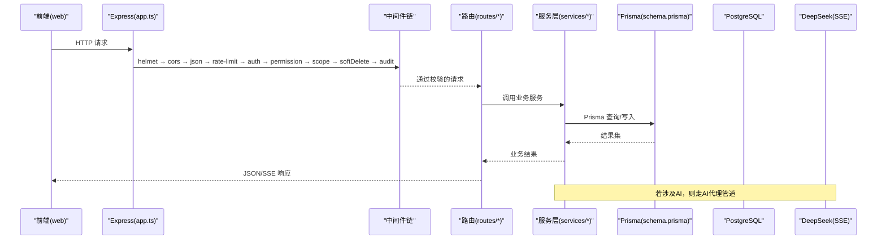

图表来源
- [server/src/app.ts:1-200](file://server/src/app.ts#L1-L200)
- [server/src/middleware/auth.ts:1-200](file://server/src/middleware/auth.ts#L1-L200)
- [server/src/middleware/permission.ts:1-200](file://server/src/middleware/permission.ts#L1-L200)
- [server/src/middleware/scope.ts:1-200](file://server/src/middleware/scope.ts#L1-L200)
- [server/src/middleware/soft-delete.ts:1-200](file://server/src/middleware/soft-delete.ts#L1-L200)
- [server/src/middleware/audit.ts:1-200](file://server/src/middleware/audit.ts#L1-L200)
- [server/src/routes/ai.ts:1-200](file://server/src/routes/ai.ts#L1-L200)
- [server/src/services/AIProxyService.ts:1-200](file://server/src/services/AIProxyService.ts#L1-L200)
- [server/prisma/schema.prisma:1-200](file://server/prisma/schema.prisma#L1-L200)

## 详细组件分析

### 中间件链与安全策略
- helmet：设置安全响应头，降低常见攻击面
- cors：控制跨域访问策略
- express.json：解析 JSON 请求体
- rate-limit：限制请求频率，防止滥用
- auth：JWT 校验与黑名单检查，维护 access/refresh 令牌生命周期
- permission：基于角色的权限控制，默认拒绝，显式放行
- scope：通过 Prisma extension 注入数据范围过滤
- softDelete：对软删除字段进行自动过滤与保护
- audit：记录关键操作审计日志
- error-handler：统一异常捕获与错误码返回
- trace-id：为每个请求分配唯一追踪 ID，便于问题定位

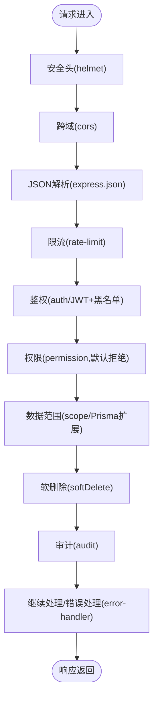

图表来源
- [server/src/middleware/helmet.ts:1-200](file://server/src/middleware/helmet.ts#L1-L200)
- [server/src/middleware/cors.ts:1-200](file://server/src/middleware/cors.ts#L1-L200)
- [server/src/middleware/rate-limit.ts:1-200](file://server/src/middleware/rate-limit.ts#L1-L200)
- [server/src/middleware/auth.ts:1-200](file://server/src/middleware/auth.ts#L1-L200)
- [server/src/middleware/permission.ts:1-200](file://server/src/middleware/permission.ts#L1-L200)
- [server/src/middleware/scope.ts:1-200](file://server/src/middleware/scope.ts#L1-L200)
- [server/src/middleware/soft-delete.ts:1-200](file://server/src/middleware/soft-delete.ts#L1-L200)
- [server/src/middleware/audit.ts:1-200](file://server/src/middleware/audit.ts#L1-L200)
- [server/src/middleware/error-handler.ts:1-200](file://server/src/middleware/error-handler.ts#L1-L200)

章节来源
- [server/src/middleware/helmet.ts:1-200](file://server/src/middleware/helmet.ts#L1-L200)
- [server/src/middleware/cors.ts:1-200](file://server/src/middleware/cors.ts#L1-L200)
- [server/src/middleware/rate-limit.ts:1-200](file://server/src/middleware/rate-limit.ts#L1-L200)
- [server/src/middleware/auth.ts:1-200](file://server/src/middleware/auth.ts#L1-L200)
- [server/src/middleware/permission.ts:1-200](file://server/src/middleware/permission.ts#L1-L200)
- [server/src/middleware/scope.ts:1-200](file://server/src/middleware/scope.ts#L1-L200)
- [server/src/middleware/soft-delete.ts:1-200](file://server/src/middleware/soft-delete.ts#L1-L200)
- [server/src/middleware/audit.ts:1-200](file://server/src/middleware/audit.ts#L1-L200)
- [server/src/middleware/error-handler.ts:1-200](file://server/src/middleware/error-handler.ts#L1-L200)

### 认证与授权流程
- 登录：用户提交凭证，服务端校验并签发 access/refresh 令牌
- 鉴权：后续请求携带 access token，服务端校验签名与有效期，并检查黑名单
- 授权：基于角色或资源权限判断是否允许访问，默认拒绝，需显式放行
- 刷新：refresh token 用于续期 access token，实现 7 天轮转

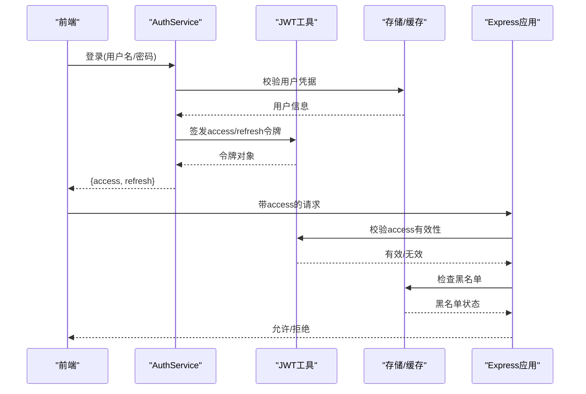

图表来源
- [server/src/services/AuthService.ts:1-200](file://server/src/services/AuthService.ts#L1-L200)
- [server/src/lib/jwt.ts:1-200](file://server/src/lib/jwt.ts#L1-L200)
- [server/src/middleware/auth.ts:1-200](file://server/src/middleware/auth.ts#L1-L200)
- [server/src/middleware/permission.ts:1-200](file://server/src/middleware/permission.ts#L1-L200)

章节来源
- [server/src/services/AuthService.ts:1-200](file://server/src/services/AuthService.ts#L1-L200)
- [server/src/lib/jwt.ts:1-200](file://server/src/lib/jwt.ts#L1-L200)
- [server/src/middleware/auth.ts:1-200](file://server/src/middleware/auth.ts#L1-L200)
- [server/src/middleware/permission.ts:1-200](file://server/src/middleware/permission.ts#L1-L200)

### 公式解析与计算引擎
- 安全解析：仅允许白名单算子（+-*/()），禁止 eval，保障输入安全
- 实时计算：同比/环比等指标在后端实时计算，不持久化
- 公式维护：公式规则由 FormulaRuleService 管理，支持版本与校验

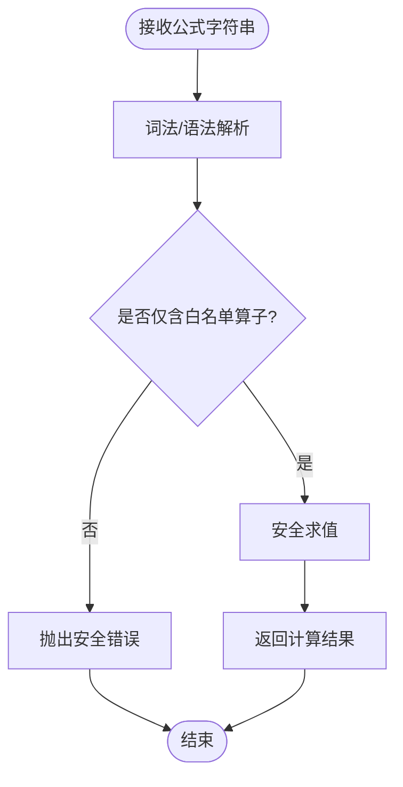

图表来源
- [server/src/lib/formula.ts:1-200](file://server/src/lib/formula.ts#L1-L200)
- [server/src/services/FormulaRuleService.ts:1-200](file://server/src/services/FormulaRuleService.ts#L1-200)

章节来源
- [server/src/lib/formula.ts:1-200](file://server/src/lib/formula.ts#L1-L200)
- [server/src/services/FormulaRuleService.ts:1-200](file://server/src/services/FormulaRuleService.ts#L1-200)

### AI 双管道架构
- polish 管道：文本输入 → 脱敏 → LLM 处理 → 还原敏感信息
- analyze 管道：结构化数据 → 计算 → 脱敏 → LLM 生成分析
- 代理层：AIProxyService 负责与 DeepSeek API 交互，支持 SSE 流式响应

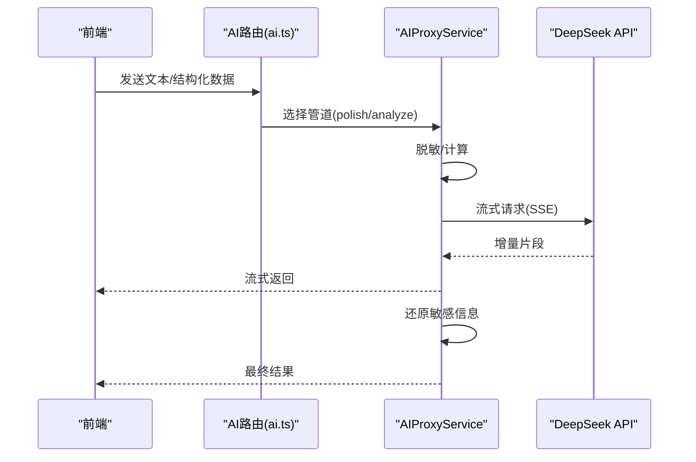

图表来源
- [server/src/routes/ai.ts:1-200](file://server/src/routes/ai.ts#L1-L200)
- [server/src/services/AIProxyService.ts:1-200](file://server/src/services/AIProxyService.ts#L1-200)
- [server/src/lib/desensitize.ts:1-200](file://server/src/lib/desensitize.ts#L1-200)

章节来源
- [server/src/routes/ai.ts:1-200](file://server/src/routes/ai.ts#L1-L200)
- [server/src/services/AIProxyService.ts:1-200](file://server/src/services/AIProxyService.ts#L1-200)
- [server/src/lib/desensitize.ts:1-200](file://server/src/lib/desensitize.ts#L1-200)

### 数据导入与处理
- Excel 导入：ImportService 负责解析、校验、批量写入
- 交易明细：TransactionService 提供趋势、覆盖率、归集等分析
- 数据服务：DataService 提供通用 CRUD 与聚合能力

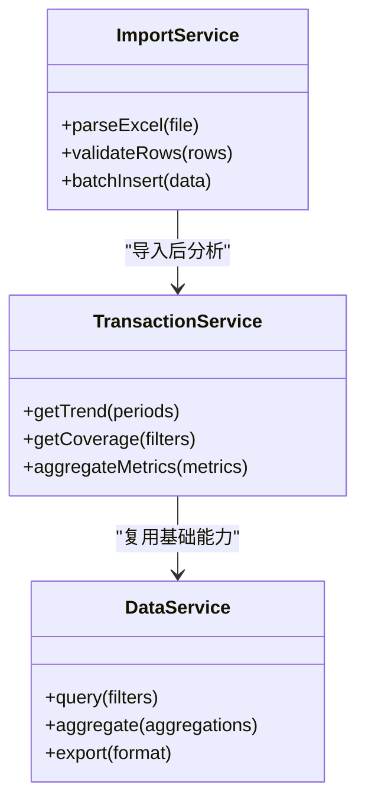

图表来源
- [server/src/services/ImportService.ts:1-200](file://server/src/services/ImportService.ts#L1-200)
- [server/src/services/TransactionService.ts:1-200](file://server/src/services/TransactionService.ts#L1-200)
- [server/src/services/DataService.ts:1-200](file://server/src/services/DataService.ts#L1-200)

章节来源
- [server/src/services/ImportService.ts:1-200](file://server/src/services/ImportService.ts#L1-200)
- [server/src/services/TransactionService.ts:1-200](file://server/src/services/TransactionService.ts#L1-200)
- [server/src/services/DataService.ts:1-200](file://server/src/services/DataService.ts#L1-200)

### 报表与指标服务
- ReportService：报表生成、版本管理、导出
- IndicatorsService：指标定义、计算、展示
- AggregationService：复杂聚合计算，支持 YTD、同比、环比

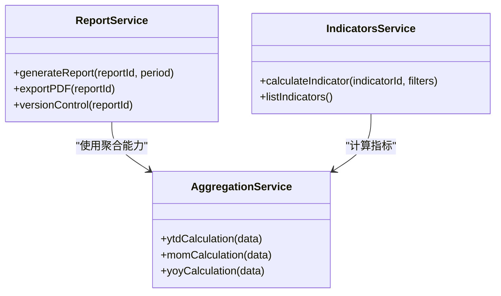

图表来源
- [server/src/services/ReportService.ts:1-200](file://server/src/services/ReportService.ts#L1-200)
- [server/src/services/IndicatorsService.ts:1-200](file://server/src/services/IndicatorsService.ts#L1-200)
- [server/src/services/AggregationService.ts:1-200](file://server/src/services/AggregationService.ts#L1-200)

章节来源
- [server/src/services/ReportService.ts:1-200](file://server/src/services/ReportService.ts#L1-200)
- [server/src/services/IndicatorsService.ts:1-200](file://server/src/services/IndicatorsService.ts#L1-200)
- [server/src/services/AggregationService.ts:1-200](file://server/src/services/AggregationService.ts#L1-200)

### 企业信息与主体分析
- EnterpriseInfoService：企业信息维护、外部查询
- SubjectAnalysisService：科目分析、重分类、回滚

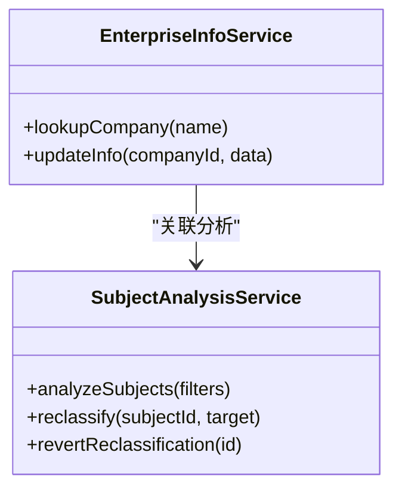

图表来源
- [server/src/services/EnterpriseInfoService.ts:1-200](file://server/src/services/EnterpriseInfoService.ts#L1-200)
- [server/src/services/SubjectAnalysisService.ts:1-200](file://server/src/services/SubjectAnalysisService.ts#L1-200)

章节来源
- [server/src/services/EnterpriseInfoService.ts:1-200](file://server/src/services/EnterpriseInfoService.ts#L1-200)
- [server/src/services/SubjectAnalysisService.ts:1-200](file://server/src/services/SubjectAnalysisService.ts#L1-200)

### 前端架构与状态管理
- App.tsx：应用根组件，路由与布局
- main.tsx：应用入口，初始化全局配置
- api.ts：API 客户端封装，统一请求拦截与错误处理
- api-queries.ts：基于 React Query 的数据获取 hooks
- authStore.ts：认证状态管理，token 存储与刷新

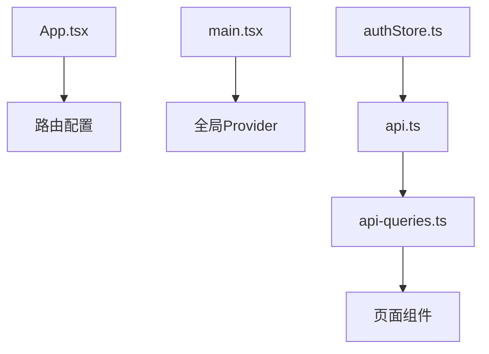

图表来源
- [web/src/App.tsx:1-200](file://web/src/App.tsx#L1-200)
- [web/src/main.tsx:1-200](file://web/src/main.tsx#L1-200)
- [web/src/lib/api.ts:1-200](file://web/src/lib/api.ts#L1-200)
- [web/src/hooks/api-queries.ts:1-200](file://web/src/hooks/api-queries.ts#L1-200)
- [web/src/stores/authStore.ts:1-200](file://web/src/stores/authStore.ts#L1-200)

章节来源
- [web/src/App.tsx:1-200](file://web/src/App.tsx#L1-200)
- [web/src/main.tsx:1-200](file://web/src/main.tsx#L1-200)
- [web/src/lib/api.ts:1-200](file://web/src/lib/api.ts#L1-200)
- [web/src/hooks/api-queries.ts:1-200](file://web/src/hooks/api-queries.ts#L1-200)
- [web/src/stores/authStore.ts:1-200](file://web/src/stores/authStore.ts#L1-200)

## 依赖关系分析
- 模块内聚性：服务层按业务领域划分，职责清晰
- 中间件耦合度：低耦合，通过标准 Express 接口组合
- 外部依赖：Prisma、PostgreSQL、DeepSeek API、JWT 库
- 循环依赖：未发现明显循环依赖，服务间通过接口调用

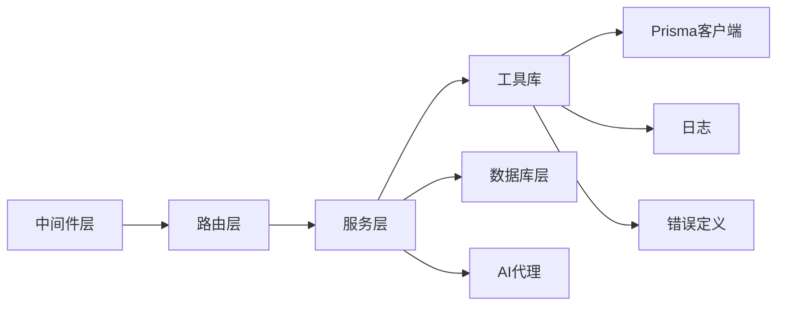

图表来源
- [server/src/app.ts:1-200](file://server/src/app.ts#L1-200)
- [server/src/lib/prisma.ts:1-200](file://server/src/lib/prisma.ts#L1-200)
- [server/src/lib/logger.ts:1-200](file://server/src/lib/logger.ts#L1-200)
- [server/src/lib/errors.ts:1-200](file://server/src/lib/errors.ts#L1-200)

章节来源
- [server/src/app.ts:1-200](file://server/src/app.ts#L1-200)
- [server/src/lib/prisma.ts:1-200](file://server/src/lib/prisma.ts#L1-200)
- [server/src/lib/logger.ts:1-200](file://server/src/lib/logger.ts#L1-200)
- [server/src/lib/errors.ts:1-200](file://server/src/lib/errors.ts#L1-200)

## 性能考量
- 数据库优化：合理使用索引、避免 N+1 查询、分页加载大数据集
- 缓存策略：热点数据缓存、Redis 缓存会话与限流计数
- 异步处理：大量计算任务异步化，避免阻塞主线程
- 流式响应：AI 响应使用 SSE，提升用户体验
- 连接池：Prisma 连接池配置优化，避免连接泄漏

## 故障排查指南
- 日志查看：集中式日志收集，按 trace-id 追踪请求链路
- 错误码：统一错误码定义，便于前端处理与问题定位
- 健康检查：服务健康检查接口，监控依赖服务状态
- 调试工具：开发环境启用详细日志，生产环境关闭敏感信息输出
- 常见问题：数据库连接失败、JWT 过期、权限不足、限流触发

章节来源
- [server/src/lib/logger.ts:1-200](file://server/src/lib/logger.ts#L1-200)
- [server/src/lib/errors.ts:1-200](file://server/src/lib/errors.ts#L1-200)
- [server/src/middleware/error-handler.ts:1-200](file://server/src/middleware/error-handler.ts#L1-200)

## 结论
本项目采用清晰的层次架构与严格的中间件管线，确保了安全性、可维护性与可扩展性。AI 双管道架构提供了灵活的智能处理能力，公式解析引擎保障了计算安全。建议进一步优化数据库查询性能，引入缓存机制，完善监控告警体系，提升系统整体稳定性与用户体验。

## 附录
- 环境变量配置：server/src/config/env.ts
- 数据库迁移：server/prisma/migrations/*
- 测试用例：各服务层的 *.test.ts 文件
- 部署脚本：scripts 目录下的运维脚本

章节来源
- [server/src/config/env.ts:1-200](file://server/src/config/env.ts#L1-200)
- [server/prisma/migrations/20260722121714_init/migration.sql:1-200](file://server/prisma/migrations/20260722121714_init/migration.sql#L1-200)
- [server/scripts/local-db.ts:1-200](file://server/scripts/local-db.ts#L1-200)