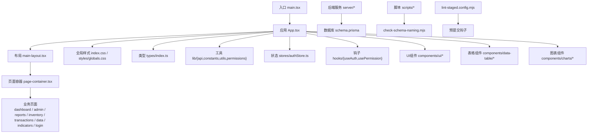
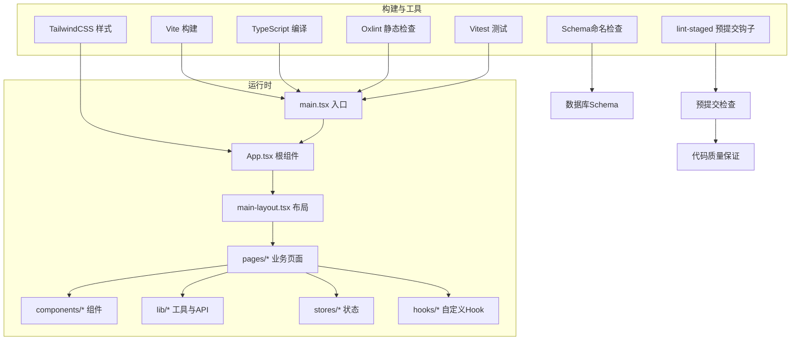
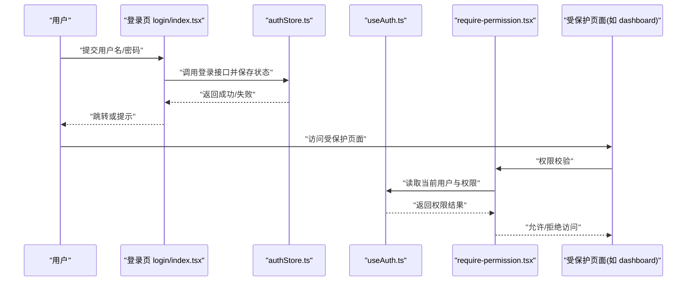
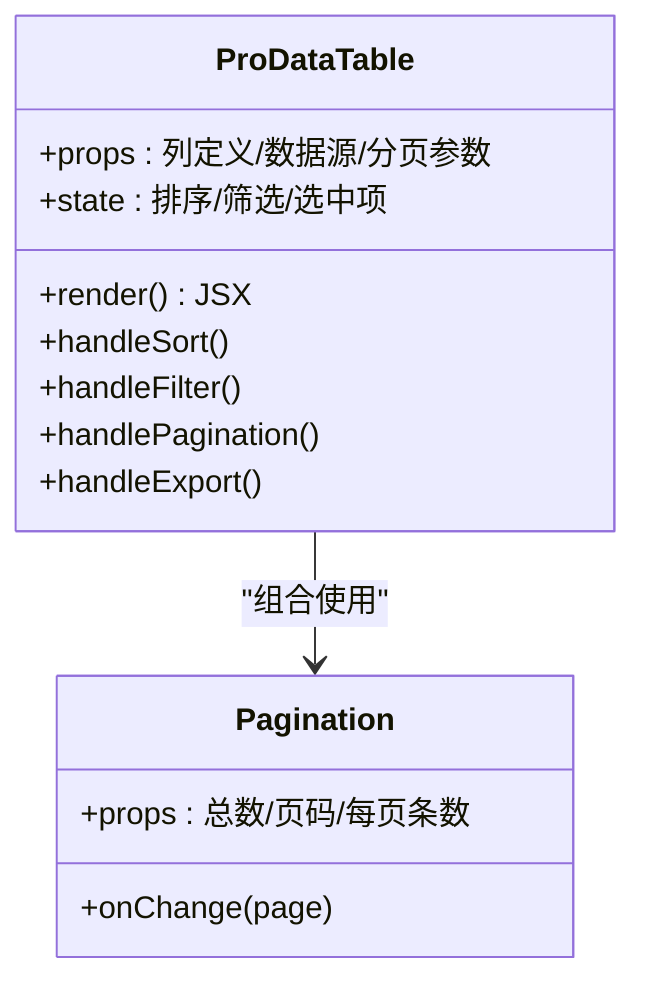
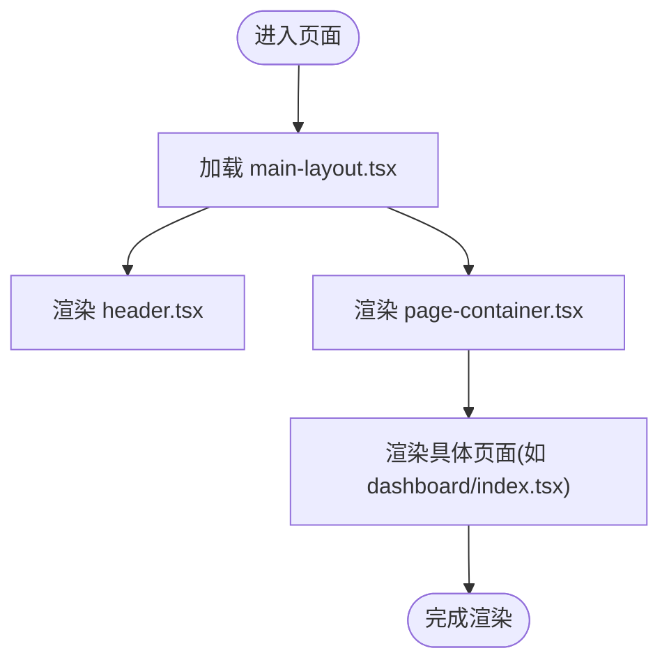
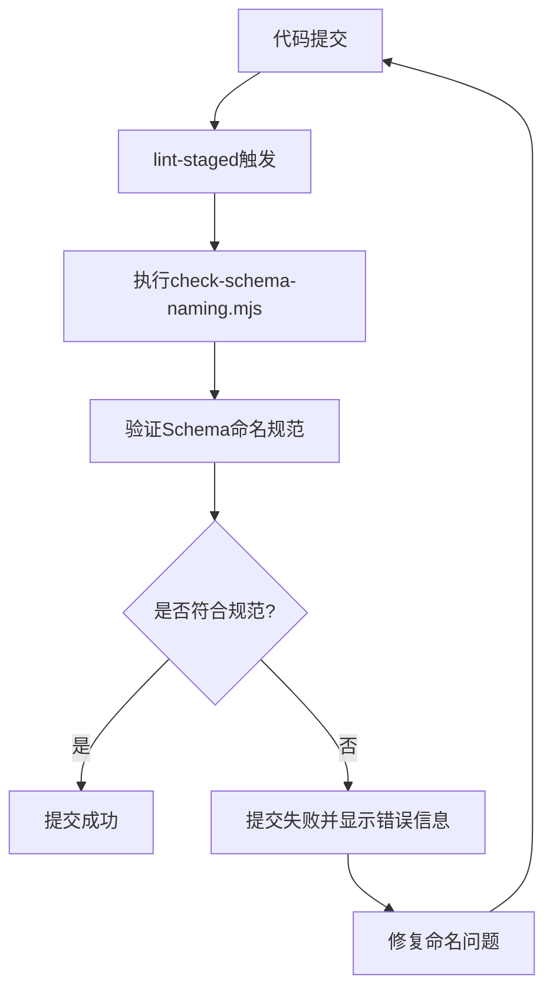
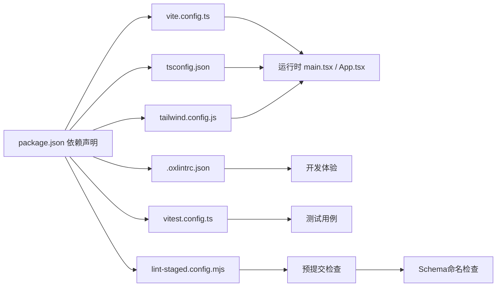

# 开发规范

<cite>
**本文引用的文件**   
- [web/package.json](file://web/package.json)
- [web/tsconfig.json](file://web/tsconfig.json)
- [web/vite.config.ts](file://web/vite.config.ts)
- [web/tailwind.config.js](file://web/tailwind.config.js)
- [web/postcss.config.js](file://web/postcss.config.js)
- [web/.oxlintrc.json](file://web/.oxlintrc.json)
- [web/src/main.tsx](file://web/src/main.tsx)
- [web/src/App.tsx](file://web/src/App.tsx)
- [web/src/styles/globals.css](file://web/src/styles/globals.css)
- [web/src/types/index.ts](file://web/src/types/index.ts)
- [web/src/lib/api.ts](file://web/src/lib/api.ts)
- [web/src/lib/constants.ts](file://web/src/lib/constants.ts)
- [web/src/lib/utils.ts](file://web/src/lib/utils.ts)
- [web/src/lib/permissions.ts](file://web/src/lib/permissions.ts)
- [web/src/stores/authStore.ts](file://web/src/stores/authStore.ts)
- [web/src/hooks/useAuth.ts](file://web/src/hooks/useAuth.ts)
- [web/src/hooks/usePermission.ts](file://web/src/hooks/usePermission.ts)
- [web/src/components/layout/main-layout.tsx](file://web/src/components/layout/main-layout.tsx)
- [web/src/components/layout/page-container.tsx](file://web/src/components/layout/page-container.tsx)
- [web/src/components/layout/header.tsx](file://web/src/components/layout/header.tsx)
- [web/src/components/layout/require-permission.tsx](file://web/src/components/layout/require-permission.tsx)
- [web/src/components/ui/button.tsx](file://web/src/components/ui/button.tsx)
- [web/src/components/data-table/pro-data-table.tsx](file://web/src/components/data-table/pro-data-table.tsx)
- [web/src/pages/dashboard/index.tsx](file://web/src/pages/dashboard/index.tsx)
- [web/src/pages/admin/index.tsx](file://web/src/pages/admin/index.tsx)
- [web/src/pages/login/index.tsx](file://web/src/pages/login/index.tsx)
- [web/src/pages/reports/index.tsx](file://web/src/pages/reports/index.tsx)
- [web/src/pages/inventory/index.tsx](file://web/src/pages/inventory/index.tsx)
- [web/src/pages/transactions/index.tsx](file://web/src/pages/transactions/index.tsx)
- [web/src/pages/data/index.tsx](file://web/src/pages/data/index.tsx)
- [web/src/pages/indicators/index.tsx](file://web/src/pages/indicators/index.tsx)
- [web/src/test/setup.ts](file://web/src/test/setup.ts)
- [web/vitest.config.ts](file://web/vitest.config.ts)
- [web/README.md](file://web/README.md)
- [server/scripts/check-schema-naming.mjs](file://server/scripts/check-schema-naming.mjs)
- [lint-staged.config.mjs](file://lint-staged.config.mjs)
- [package.json](file://package.json)
- [docs/plans/安全与权限规范.md](file://docs/plans/安全与权限规范.md)
- [docs/plans/数据模型规范.md](file://docs/plans/数据模型规范.md)
- [docs/references/backend.md](file://docs/references/backend.md)
- [docs/references/testing.md](file://docs/references/testing.md)
- [docs/references/performance.md](file://docs/references/performance.md)
</cite>

## 更新摘要
**所做更改**
- 新增Schema命名规范检查机制，通过check-schema-naming.mjs脚本强制执行数据库schema命名约定
- 集成lint-staged预提交钩子，实现代码质量自动化检查
- 扩展测试覆盖范围，增强前后端测试用例完整性
- 更新Git工作流规范，包含新的代码审查和质量保证流程

## 目录
1. [引言](#引言)
2. [项目结构](#项目结构)
3. [核心组件](#核心组件)
4. [架构总览](#架构总览)
5. [详细组件分析](#详细组件分析)
6. [依赖分析](#依赖分析)
7. [性能考虑](#性能考虑)
8. [故障排查指南](#故障排查指南)
9. [结论](#结论)
10. [附录](#附录)

## 引言
本规范面向pj3全栈工程，目标是统一代码风格、组件设计、协作流程与调试排错方法，提升可维护性与交付质量。内容覆盖：
- JavaScript/TypeScript编码标准、命名约定、注释规范
- 组件设计与实现最佳实践（Props、事件、样式组织）
- Git工作流与代码审查流程
- 调试与排错方法论（工具、日志、性能分析）
- 工程化与目录组织原则
- 新成员入职与环境配置指引
- **新增** Schema命名规范与数据库质量保证

## 项目结构
本项目采用基于功能域的目录划分，结合通用能力层与UI原子组件库，便于扩展与维护。

图示来源
- [web/src/main.tsx:1-200](file://web/src/main.tsx#L1-L200)
- [web/src/App.tsx:1-200](file://web/src/App.tsx#L1-L200)
- [web/src/components/layout/main-layout.tsx:1-200](file://web/src/components/layout/main-layout.tsx#L1-L200)
- [web/src/components/layout/page-container.tsx:1-200](file://web/src/components/layout/page-container.tsx#L1-L200)
- [web/src/styles/globals.css:1-200](file://web/src/styles/globals.css#L1-L200)
- [web/src/types/index.ts:1-200](file://web/src/types/index.ts#L1-L200)
- [web/src/lib/api.ts:1-200](file://web/src/lib/api.ts#L1-L200)
- [web/src/lib/constants.ts:1-200](file://web/src/lib/constants.ts#L1-L200)
- [web/src/lib/utils.ts:1-200](file://web/src/lib/utils.ts#L1-L200)
- [web/src/lib/permissions.ts:1-200](file://web/src/lib/permissions.ts#L1-L200)
- [web/src/stores/authStore.ts:1-200](file://web/src/stores/authStore.ts#L1-L200)
- [web/src/hooks/useAuth.ts:1-200](file://web/src/hooks/useAuth.ts#L1-L200)
- [web/src/hooks/usePermission.ts:1-200](file://web/src/hooks/usePermission.ts#L1-L200)
- [web/src/components/ui/button.tsx:1-200](file://web/src/components/ui/button.tsx#L1-L200)
- [web/src/components/data-table/pro-data-table.tsx:1-200](file://web/src/components/data-table/pro-data-table.tsx#L1-L200)
- [server/scripts/check-schema-naming.mjs:1-200](file://server/scripts/check-schema-naming.mjs#L1-L200)
- [lint-staged.config.mjs:1-200](file://lint-staged.config.mjs#L1-L200)

章节来源
- [web/src/main.tsx:1-200](file://web/src/main.tsx#L1-L200)
- [web/src/App.tsx:1-200](file://web/src/App.tsx#L1-L200)
- [web/src/components/layout/main-layout.tsx:1-200](file://web/src/components/layout/main-layout.tsx#L1-L200)
- [web/src/components/layout/page-container.tsx:1-200](file://web/src/components/layout/page-container.tsx#L1-L200)
- [web/src/styles/globals.css:1-200](file://web/src/styles/globals.css#L1-L200)
- [web/src/types/index.ts:1-200](file://web/src/types/index.ts#L1-L200)
- [web/src/lib/api.ts:1-200](file://web/src/lib/api.ts#L1-L200)
- [web/src/lib/constants.ts:1-200](file://web/src/lib/constants.ts#L1-L200)
- [web/src/lib/utils.ts:1-200](file://web/src/lib/utils.ts#L1-L200)
- [web/src/lib/permissions.ts:1-200](file://web/src/lib/permissions.ts#L1-L200)
- [web/src/stores/authStore.ts:1-200](file://web/src/stores/authStore.ts#L1-L200)
- [web/src/hooks/useAuth.ts:1-200](file://web/src/hooks/useAuth.ts#L1-L200)
- [web/src/hooks/usePermission.ts:1-200](file://web/src/hooks/usePermission.ts#L1-L200)
- [web/src/components/ui/button.tsx:1-200](file://web/src/components/ui/button.tsx#L1-L200)
- [web/src/components/data-table/pro-data-table.tsx:1-200](file://web/src/components/data-table/pro-data-table.tsx#L1-L200)
- [server/scripts/check-schema-naming.mjs:1-200](file://server/scripts/check-schema-naming.mjs#L1-L200)
- [lint-staged.config.mjs:1-200](file://lint-staged.config.mjs#L1-L200)

## 核心组件
- 布局与路由承载
  - 主布局负责整体框架、导航与权限守卫的挂载点。
  - 页面容器提供统一的页面级包装（如标题、面包屑、操作区）。
- UI原子组件
  - 按钮、输入、卡片等基础控件，遵循一致的Props与样式策略。
- 业务组件
  - 专业数据表格封装分页、排序、筛选与导出等能力。
- 状态与鉴权
  - 认证状态集中管理，提供登录态与权限判断的Hook。
- API与常量
  - 统一API请求封装、错误处理与常量定义。
- **新增** Schema验证
  - 数据库schema命名规范检查，确保数据模型一致性。

章节来源
- [web/src/components/layout/main-layout.tsx:1-200](file://web/src/components/layout/main-layout.tsx#L1-L200)
- [web/src/components/layout/page-container.tsx:1-200](file://web/src/components/layout/page-container.tsx#L1-L200)
- [web/src/components/ui/button.tsx:1-200](file://web/src/components/ui/button.tsx#L1-L200)
- [web/src/components/data-table/pro-data-table.tsx:1-200](file://web/src/components/data-table/pro-data-table.tsx#L1-L200)
- [web/src/stores/authStore.ts:1-200](file://web/src/stores/authStore.ts#L1-L200)
- [web/src/hooks/useAuth.ts:1-200](file://web/src/hooks/useAuth.ts#L1-L200)
- [web/src/hooks/usePermission.ts:1-200](file://web/src/hooks/usePermission.ts#L1-L200)
- [web/src/lib/api.ts:1-200](file://web/src/lib/api.ts#L1-L200)
- [web/src/lib/constants.ts:1-200](file://web/src/lib/constants.ts#L1-L200)
- [server/scripts/check-schema-naming.mjs:1-200](file://server/scripts/check-schema-naming.mjs#L1-L200)

## 架构总览
前端采用Vite + React + TypeScript构建，TailwindCSS进行样式编排，Oxlint进行静态检查，Vitest进行单元测试。后端集成Schema命名规范检查和lint-staged预提交钩子。

图示来源
- [web/vite.config.ts:1-200](file://web/vite.config.ts#L1-L200)
- [web/tsconfig.json:1-200](file://web/tsconfig.json#L1-L200)
- [web/tailwind.config.js:1-200](file://web/tailwind.config.js#L1-L200)
- [web/.oxlintrc.json:1-200](file://web/.oxlintrc.json#L1-L200)
- [web/vitest.config.ts:1-200](file://web/vitest.config.ts#L1-L200)
- [web/src/main.tsx:1-200](file://web/src/main.tsx#L1-L200)
- [web/src/App.tsx:1-200](file://web/src/App.tsx#L1-L200)
- [web/src/components/layout/main-layout.tsx:1-200](file://web/src/components/layout/main-layout.tsx#L1-L200)
- [lint-staged.config.mjs:1-200](file://lint-staged.config.mjs#L1-L200)
- [server/scripts/check-schema-naming.mjs:1-200](file://server/scripts/check-schema-naming.mjs#L1-L200)

## 详细组件分析

### 认证与权限流程
认证与权限贯穿登录、鉴权与受保护页面的访问控制。

图示来源
- [web/src/pages/login/index.tsx:1-200](file://web/src/pages/login/index.tsx#L1-L200)
- [web/src/stores/authStore.ts:1-200](file://web/src/stores/authStore.ts#L1-L200)
- [web/src/hooks/useAuth.ts:1-200](file://web/src/hooks/useAuth.ts#L1-L200)
- [web/src/components/layout/require-permission.tsx:1-200](file://web/src/components/layout/require-permission.tsx#L1-L200)
- [web/src/pages/dashboard/index.tsx:1-200](file://web/src/pages/dashboard/index.tsx#L1-L200)

章节来源
- [web/src/pages/login/index.tsx:1-200](file://web/src/pages/login/index.tsx#L1-L200)
- [web/src/stores/authStore.ts:1-200](file://web/src/stores/authStore.ts#L1-L200)
- [web/src/hooks/useAuth.ts:1-200](file://web/src/hooks/useAuth.ts#L1-L200)
- [web/src/components/layout/require-permission.tsx:1-200](file://web/src/components/layout/require-permission.tsx#L1-L200)
- [web/src/pages/dashboard/index.tsx:1-200](file://web/src/pages/dashboard/index.tsx#L1-L200)

### 专业数据表格组件
专业表格组件封装分页、排序、筛选、选择与导出等能力，供各业务页面复用。

图示来源
- [web/src/components/data-table/pro-data-table.tsx:1-200](file://web/src/components/data-table/pro-data-table.tsx#L1-L200)
- [web/src/components/data-table/pagination.tsx:1-200](file://web/src/components/data-table/pagination.tsx#L1-L200)

章节来源
- [web/src/components/data-table/pro-data-table.tsx:1-200](file://web/src/components/data-table/pro-data-table.tsx#L1-L200)
- [web/src/components/data-table/pagination.tsx:1-200](file://web/src/components/data-table/pagination.tsx#L1-L200)

### 页面与布局关系
页面通过布局容器渲染，统一头部、侧边栏与内容区域。

图示来源
- [web/src/components/layout/main-layout.tsx:1-200](file://web/src/components/layout/main-layout.tsx#L1-L200)
- [web/src/components/layout/header.tsx:1-200](file://web/src/components/layout/header.tsx#L1-L200)
- [web/src/components/layout/page-container.tsx:1-200](file://web/src/components/layout/page-container.tsx#L1-L200)
- [web/src/pages/dashboard/index.tsx:1-200](file://web/src/pages/dashboard/index.tsx#L1-L200)

章节来源
- [web/src/components/layout/main-layout.tsx:1-200](file://web/src/components/layout/main-layout.tsx#L1-L200)
- [web/src/components/layout/header.tsx:1-200](file://web/src/components/layout/header.tsx#L1-L200)
- [web/src/components/layout/page-container.tsx:1-200](file://web/src/components/layout/page-container.tsx#L1-L200)
- [web/src/pages/dashboard/index.tsx:1-200](file://web/src/pages/dashboard/index.tsx#L1-L200)

### Schema命名规范检查机制
**新增** 项目引入了数据库Schema命名规范检查机制，通过check-schema-naming.mjs脚本强制执行命名约定。

图示来源
- [server/scripts/check-schema-naming.mjs:1-200](file://server/scripts/check-schema-naming.mjs#L1-200)
- [lint-staged.config.mjs:1-200](file://lint-staged.config.mjs#L1-200)

章节来源
- [server/scripts/check-schema-naming.mjs:1-200](file://server/scripts/check-schema-naming.mjs#L1-200)
- [lint-staged.config.mjs:1-200](file://lint-staged.config.mjs#L1-200)

## 依赖分析
- 构建与工具链
  - Vite作为开发与构建工具，TypeScript用于类型检查与编译，TailwindCSS提供原子化样式，Oxlint执行静态检查，Vitest运行单测。
  - **新增** lint-staged集成预提交钩子，check-schema-naming.mjs执行Schema命名检查。
- 运行时依赖
  - React生态（组件、Hooks、状态），自定义状态与权限模块，API封装与常量。

图示来源
- [web/package.json:1-200](file://web/package.json#L1-200)
- [web/vite.config.ts:1-200](file://web/vite.config.ts#L1-200)
- [web/tsconfig.json:1-200](file://web/tsconfig.json#L1-200)
- [web/tailwind.config.js:1-200](file://web/tailwind.config.js#L1-200)
- [web/.oxlintrc.json:1-200](file://web/.oxlintrc.json#L1-200)
- [web/vitest.config.ts:1-200](file://web/vitest.config.ts#L1-200)
- [lint-staged.config.mjs:1-200](file://lint-staged.config.mjs#L1-200)
- [web/src/main.tsx:1-200](file://web/src/main.tsx#L1-200)
- [web/src/App.tsx:1-200](file://web/src/App.tsx#L1-200)

章节来源
- [web/package.json:1-200](file://web/package.json#L1-200)
- [web/vite.config.ts:1-200](file://web/vite.config.ts#L1-200)
- [web/tsconfig.json:1-200](file://web/tsconfig.json#L1-200)
- [web/tailwind.config.js:1-200](file://web/tailwind.config.js#L1-200)
- [web/.oxlintrc.json:1-200](file://web/.oxlintrc.json#L1-200)
- [web/vitest.config.ts:1-200](file://web/vitest.config.ts#L1-200)
- [lint-staged.config.mjs:1-200](file://lint-staged.config.mjs#L1-200)

## 性能考虑
- 构建优化
  - 合理拆分路由与组件，按需引入第三方库，避免打包体积膨胀。
- 运行时优化
  - 列表渲染使用稳定key，减少不必要的重渲染；大数据表格启用虚拟滚动或分页加载。
- 网络优化
  - 合并请求、缓存热点数据、对图片等资源启用压缩与懒加载。
- 监控与分析
  - 使用浏览器性能面板与网络面板定位瓶颈；在关键路径埋点统计耗时。
- **新增** 预提交检查优化
  - lint-staged仅检查暂存文件，提高提交速度；Schema检查避免不规范的数据库变更。

[本节为通用指导，不直接分析具体文件]

## 故障排查指南
- 常见问题定位
  - 启动失败：检查Node版本、端口占用、环境变量与配置文件。
  - 样式异常：确认Tailwind指令与全局样式导入顺序。
  - 权限问题：核对权限常量与后端返回字段一致性。
  - **新增** 提交失败：检查lint-staged配置和Schema命名规范。
- 日志与断点
  - 在关键函数入口与分支处添加结构化日志；使用浏览器断点与React DevTools追踪状态变化。
- 测试辅助
  - 使用Vitest编写单元与集成测试，覆盖边界条件与错误分支。
- **新增** Schema检查问题
  - 查看check-schema-naming.mjs输出信息；确保表名、字段名符合命名约定。

章节来源
- [web/src/test/setup.ts:1-200](file://web/src/test/setup.ts#L1-200)
- [web/vitest.config.ts:1-200](file://web/vitest.config.ts#L1-200)
- [docs/references/testing.md:1-200](file://docs/references/testing.md#L1-200)
- [server/scripts/check-schema-naming.mjs:1-200](file://server/scripts/check-schema-naming.mjs#L1-200)
- [lint-staged.config.mjs:1-200](file://lint-staged.config.mjs#L1-200)

## 结论
本规范从代码风格、组件设计、协作流程到调试排错形成闭环，配合工程化工具链与文档体系，帮助团队高效协作与持续交付。**新增的Schema命名规范检查和lint-staged预提交钩子进一步提升了代码质量和数据库一致性**。建议在新需求与重构中持续迭代完善。

[本节为总结性内容，不直接分析具体文件]

## 附录

### 代码风格与命名约定
- 语言与工具
  - 使用TypeScript，开启严格模式；使用Oxlint进行静态检查；使用Vite进行构建。
- 命名约定
  - 组件与文件使用帕斯卡命名；变量与函数使用小驼峰；常量使用全大写加下划线；类型与接口使用帕斯卡命名。
  - **新增** 数据库Schema命名：表名使用复数形式，字段名使用小写加下划线，遵循Prisma命名规范。
- 注释规范
  - 公共API与复杂逻辑需添加JSDoc或行内注释，说明意图、参数与返回值。
- 代码组织
  - 按功能域组织页面与组件；通用能力下沉至lib与components；类型集中于types。

章节来源
- [web/.oxlintrc.json:1-200](file://web/.oxlintrc.json#L1-200)
- [web/tsconfig.json:1-200](file://web/tsconfig.json#L1-200)
- [web/src/types/index.ts:1-200](file://web/src/types/index.ts#L1-200)
- [web/src/lib/constants.ts:1-200](file://web/src/lib/constants.ts#L1-200)
- [server/scripts/check-schema-naming.mjs:1-200](file://server/scripts/check-schema-naming.mjs#L1-200)

### 组件开发规范
- 设计原则
  - 单一职责、可组合、可测试；尽量无副作用，将副作用放入Hooks或页面层。
- Props定义
  - 使用TypeScript接口明确Props类型；可选属性使用?；默认值通过解构赋值设置。
- 事件处理
  - 事件回调命名以on开头；避免在渲染期执行昂贵计算。
- 样式组织
  - 优先使用Tailwind原子类；复杂主题与全局样式放在styles目录；避免内联样式滥用。

章节来源
- [web/src/components/ui/button.tsx:1-200](file://web/src/components/ui/button.tsx#L1-200)
- [web/src/components/layout/page-container.tsx:1-200](file://web/src/components/layout/page-container.tsx#L1-200)
- [web/src/styles/globals.css:1-200](file://web/src/styles/globals.css#L1-200)
- [web/tailwind.config.js:1-200](file://web/tailwind.config.js#L1-200)

### Git工作流与代码审查
- 分支策略
  - 主干分支保护；新功能在feature分支开发；修复在hotfix分支；发布前创建release分支。
- 提交信息格式
  - 使用约定式提交：type(scope): subject，包含feat/fix/docs/style/refactor/test/chore等类型。
- 代码审查
  - 所有变更需经过至少一人审查；关注可读性、安全性与性能；CI通过后合并。
- **新增** 预提交检查
  - lint-staged自动执行代码检查和测试；Schema命名规范检查防止不合规的数据库变更。

章节来源
- [lint-staged.config.mjs:1-200](file://lint-staged.config.mjs#L1-200)
- [server/scripts/check-schema-naming.mjs:1-200](file://server/scripts/check-schema-naming.mjs#L1-200)

### 调试与排错方法论
- 常用工具
  - 浏览器开发者工具、React DevTools、网络面板、性能面板。
- 日志记录
  - 分级输出（info/warn/error），包含上下文标识与必要堆栈；生产环境避免敏感信息泄露。
- 性能分析
  - 使用Performance录制与火焰图分析；对长任务与重渲染进行优化。
- **新增** 预提交问题排查
  - 检查lint-staged配置；查看check-schema-naming.mjs输出；验证Schema文件命名规范。

章节来源
- [docs/references/performance.md:1-200](file://docs/references/performance.md#L1-200)
- [server/scripts/check-schema-naming.mjs:1-200](file://server/scripts/check-schema-naming.mjs#L1-200)

### 工程化与目录组织
- 目录结构
  - pages按业务域划分；components按层级划分（ui、layout、业务组件）；lib存放工具与API；stores集中状态；hooks封装复用逻辑。
- 依赖管理
  - 统一在package.json声明依赖；定期更新与审计；避免重复依赖。
- 构建与脚本
  - 使用Vite命令进行开发、构建与预览；配置Tailwind与PostCSS插件。
- **新增** 质量保障脚本
  - check-schema-naming.mjs执行Schema命名检查；lint-staged集成预提交钩子。

章节来源
- [web/package.json:1-200](file://web/package.json#L1-200)
- [web/vite.config.ts:1-200](file://web/vite.config.ts#L1-200)
- [web/tailwind.config.js:1-200](file://web/tailwind.config.js#L1-200)
- [web/postcss.config.js:1-200](file://web/postcss.config.js#L1-200)
- [server/scripts/check-schema-naming.mjs:1-200](file://server/scripts/check-schema-naming.mjs#L1-200)
- [lint-staged.config.mjs:1-200](file://lint-staged.config.mjs#L1-200)

### 新成员入职与环境配置
- 环境准备
  - 安装Node LTS版本；克隆仓库；安装依赖；配置本地环境变量。
- 启动与调试
  - 使用开发命令启动服务；打开浏览器访问本地地址；使用调试工具进行断点与日志查看。
- 快速上手
  - 阅读README了解项目概览；参考现有页面与组件实现方式；在feature分支上完成首个任务。
- **新增** 质量检查配置
  - 理解lint-staged工作原理；学习Schema命名规范；掌握check-schema-naming.mjs使用方法。

章节来源
- [web/README.md:1-200](file://web/README.md#L1-200)
- [server/scripts/check-schema-naming.mjs:1-200](file://server/scripts/check-schema-naming.mjs#L1-200)
- [lint-staged.config.mjs:1-200](file://lint-staged.config.mjs#L1-200)

### 安全与权限规范
- 权限模型
  - 基于角色与资源的权限控制；前后端一致校验；最小权限原则。
- 安全要点
  - 输入校验与输出转义；敏感信息加密存储；HTTPS与CSP策略。

章节来源
- [docs/plans/安全与权限规范.md:1-200](file://docs/plans/安全与权限规范.md#L1-200)
- [web/src/lib/permissions.ts:1-200](file://web/src/lib/permissions.ts#L1-200)
- [web/src/hooks/usePermission.ts:1-200](file://web/src/hooks/usePermission.ts#L1-200)

### 数据模型与API对接
- 数据模型
  - 统一类型定义；字段命名与约束清晰；枚举与联合类型表达业务语义。
  - **新增** Schema命名规范：遵循Prisma命名约定，确保数据库一致性。
- API对接
  - 统一请求封装；错误码映射；重试与超时策略；Mock数据支持本地开发。

章节来源
- [docs/plans/数据模型规范.md:1-200](file://docs/plans/数据模型规范.md#L1-200)
- [web/src/lib/api.ts:1-200](file://web/src/lib/api.ts#L1-200)
- [docs/references/backend.md:1-200](file://docs/references/backend.md#L1-200)
- [server/scripts/check-schema-naming.mjs:1-200](file://server/scripts/check-schema-naming.mjs#L1-200)

### 测试覆盖与质量保证
- **新增** 测试策略
  - 单元测试：使用Vitest覆盖核心逻辑；集成测试：验证API接口和数据流；端到端测试：模拟用户操作流程。
- **新增** 预提交检查
  - lint-staged自动执行代码检查和测试；Schema命名规范检查防止不合规的数据库变更。
- **新增** 质量门禁
  - 所有代码变更必须通过静态检查、单元测试和Schema验证才能提交。

章节来源
- [web/vitest.config.ts:1-200](file://web/vitest.config.ts#L1-200)
- [docs/references/testing.md:1-200](file://docs/references/testing.md#L1-200)
- [lint-staged.config.mjs:1-200](file://lint-staged.config.mjs#L1-200)
- [server/scripts/check-schema-naming.mjs:1-200](file://server/scripts/check-schema-naming.mjs#L1-200)