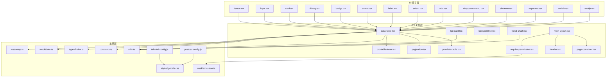
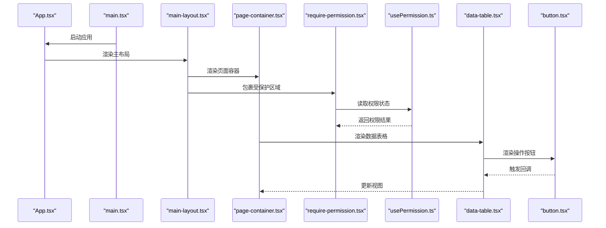
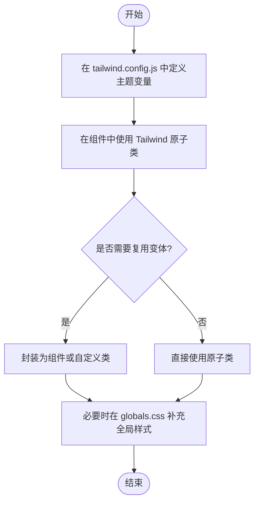
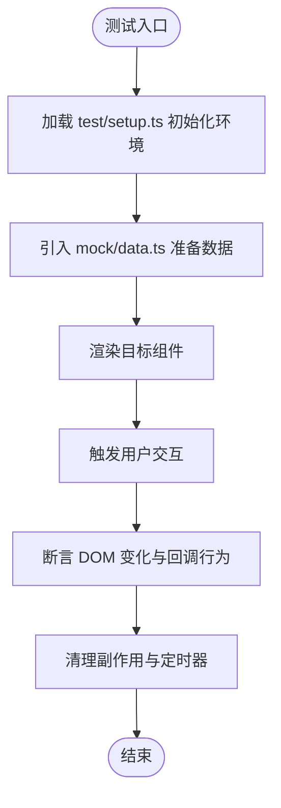
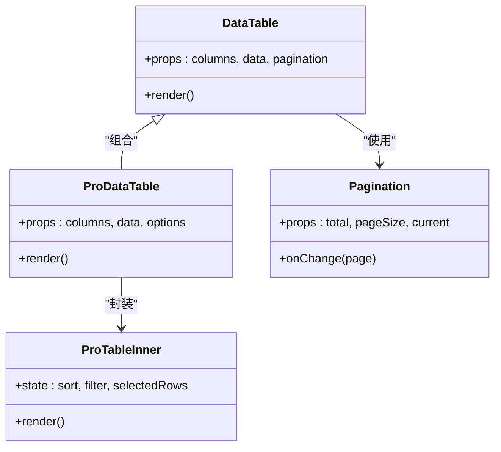
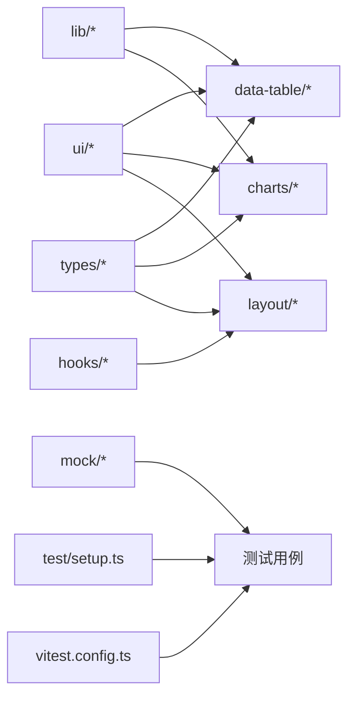

# 组件开发规范

<cite>
**本文引用的文件**   
- [web/src/components/ui/button.tsx](file://web/src/components/ui/button.tsx)
- [web/src/components/ui/input.tsx](file://web/src/components/ui/input.tsx)
- [web/src/components/ui/card.tsx](file://web/src/components/ui/card.tsx)
- [web/src/components/ui/dialog.tsx](file://web/src/components/ui/dialog.tsx)
- [web/src/components/ui/badge.tsx](file://web/src/components/ui/badge.tsx)
- [web/src/components/ui/avatar.tsx](file://web/src/components/ui/avatar.tsx)
- [web/src/components/ui/label.tsx](file://web/src/components/ui/label.tsx)
- [web/src/components/ui/select.tsx](file://web/src/components/ui/select.tsx)
- [web/src/components/ui/tabs.tsx](file://web/src/components/ui/tabs.tsx)
- [web/src/components/ui/dropdown-menu.tsx](file://web/src/components/ui/dropdown-menu.tsx)
- [web/src/components/ui/skeleton.tsx](file://web/src/components/ui/skeleton.tsx)
- [web/src/components/ui/separator.tsx](file://web/src/components/ui/separator.tsx)
- [web/src/components/ui/switch.tsx](file://web/src/components/ui/switch.tsx)
- [web/src/components/ui/tooltip.tsx](file://web/src/components/ui/tooltip.tsx)
- [web/src/components/data-table/data-table.tsx](file://web/src/components/data-table/data-table.tsx)
- [web/src/components/data-table/pro-data-table.tsx](file://web/src/components/data-table/pro-data-table.tsx)
- [web/src/components/data-table/pagination.tsx](file://web/src/components/data-table/pagination.tsx)
- [web/src/components/data-table/pro-table-inner.tsx](file://web/src/components/data-table/pro-table-inner.tsx)
- [web/src/components/charts/kpi-card.tsx](file://web/src/components/charts/kpi-card.tsx)
- [web/src/components/charts/kpi-sparkline.tsx](file://web/src/components/charts/kpi-sparkline.tsx)
- [web/src/components/charts/trend-chart.tsx](file://web/src/components/charts/trend-chart.tsx)
- [web/src/components/layout/main-layout.tsx](file://web/src/components/layout/main-layout.tsx)
- [web/src/components/layout/page-container.tsx](file://web/src/components/layout/page-container.tsx)
- [web/src/components/layout/header.tsx](file://web/src/components/layout/header.tsx)
- [web/src/components/layout/require-permission.tsx](file://web/src/components/layout/require-permission.tsx)
- [web/src/hooks/usePermission.ts](file://web/src/hooks/usePermission.ts)
- [web/src/lib/utils.ts](file://web/src/lib/utils.ts)
- [web/src/lib/constants.ts](file://web/src/lib/constants.ts)
- [web/src/types/index.ts](file://web/src/types/index.ts)
- [web/src/mock/data.ts](file://web/src/mock/data.ts)
- [web/src/test/setup.ts](file://web/src/test/setup.ts)
- [web/vitest.config.ts](file://web/vitest.config.ts)
- [web/tailwind.config.js](file://web/tailwind.config.js)
- [web/postcss.config.js](file://web/postcss.config.js)
- [web/src/styles/globals.css](file://web/src/styles/globals.css)
- [web/src/App.tsx](file://web/src/App.tsx)
- [web/src/main.tsx](file://web/src/main.tsx)
</cite>

## 目录
1. [引言](#引言)
2. [项目结构](#项目结构)
3. [核心组件](#核心组件)
4. [架构总览](#架构总览)
5. [详细组件分析](#详细组件分析)
6. [依赖分析](#依赖分析)
7. [性能考虑](#性能考虑)
8. [故障排查指南](#故障排查指南)
9. [结论](#结论)
10. [附录](#附录)

## 引言
本规范面向 pj3 项目的 React 组件开发，目标是统一设计原则、接口约定、交互与样式组织方式，并建立可复用的测试策略。文档覆盖：
- 设计原则：单一职责、可复用性、组合式架构
- Props 规范：类型定义、默认值、验证、可选参数
- 事件处理：回调设计、冒泡控制、性能优化
- 样式规范：Tailwind CSS 使用约定、CSS-in-JS 方案、主题定制
- 测试规范：单元测试、Mock 数据、边界条件
- 完整示例：从需求到实现的端到端流程

## 项目结构
项目采用“按功能域分层 + 原子 UI 组件”的组织方式：
- ui：基础原子组件（按钮、输入、卡片等）
- data-table：表格能力（基础表、增强表、分页、内部实现）
- charts：图表展示（KPI 卡片、迷你图、趋势图）
- layout：页面布局与权限控制容器
- hooks：通用逻辑钩子（如权限判断）
- lib：工具函数、常量、导出等
- types：全局类型定义
- mock：测试用模拟数据
- test：测试环境初始化
- styles：全局样式与 Tailwind 配置

图示来源
- [web/src/components/ui/button.tsx](file://web/src/components/ui/button.tsx)
- [web/src/components/ui/input.tsx](file://web/src/components/ui/input.tsx)
- [web/src/components/ui/card.tsx](file://web/src/components/ui/card.tsx)
- [web/src/components/ui/dialog.tsx](file://web/src/components/ui/dialog.tsx)
- [web/src/components/ui/badge.tsx](file://web/src/components/ui/badge.tsx)
- [web/src/components/ui/avatar.tsx](file://web/src/components/ui/avatar.tsx)
- [web/src/components/ui/label.tsx](file://web/src/components/ui/label.tsx)
- [web/src/components/ui/select.tsx](file://web/src/components/ui/select.tsx)
- [web/src/components/ui/tabs.tsx](file://web/src/components/ui/tabs.tsx)
- [web/src/components/ui/dropdown-menu.tsx](file://web/src/components/ui/dropdown-menu.tsx)
- [web/src/components/ui/skeleton.tsx](file://web/src/components/ui/skeleton.tsx)
- [web/src/components/ui/separator.tsx](file://web/src/components/ui/separator.tsx)
- [web/src/components/ui/switch.tsx](file://web/src/components/ui/switch.tsx)
- [web/src/components/ui/tooltip.tsx](file://web/src/components/ui/tooltip.tsx)
- [web/src/components/data-table/data-table.tsx](file://web/src/components/data-table/data-table.tsx)
- [web/src/components/data-table/pro-data-table.tsx](file://web/src/components/data-table/pro-data-table.tsx)
- [web/src/components/data-table/pagination.tsx](file://web/src/components/data-table/pagination.tsx)
- [web/src/components/data-table/pro-table-inner.tsx](file://web/src/components/data-table/pro-table-inner.tsx)
- [web/src/components/charts/kpi-card.tsx](file://web/src/components/charts/kpi-card.tsx)
- [web/src/components/charts/kpi-sparkline.tsx](file://web/src/components/charts/kpi-sparkline.tsx)
- [web/src/components/charts/trend-chart.tsx](file://web/src/components/charts/trend-chart.tsx)
- [web/src/components/layout/main-layout.tsx](file://web/src/components/layout/main-layout.tsx)
- [web/src/components/layout/page-container.tsx](file://web/src/components/layout/page-container.tsx)
- [web/src/components/layout/header.tsx](file://web/src/components/layout/header.tsx)
- [web/src/components/layout/require-permission.tsx](file://web/src/components/layout/require-permission.tsx)
- [web/src/hooks/usePermission.ts](file://web/src/hooks/usePermission.ts)
- [web/src/lib/utils.ts](file://web/src/lib/utils.ts)
- [web/src/lib/constants.ts](file://web/src/lib/constants.ts)
- [web/src/types/index.ts](file://web/src/types/index.ts)
- [web/src/mock/data.ts](file://web/src/mock/data.ts)
- [web/src/test/setup.ts](file://web/src/test/setup.ts)
- [web/tailwind.config.js](file://web/tailwind.config.js)
- [web/postcss.config.js](file://web/postcss.config.js)
- [web/src/styles/globals.css](file://web/src/styles/globals.css)

章节来源
- [web/src/App.tsx](file://web/src/App.tsx)
- [web/src/main.tsx](file://web/src/main.tsx)

## 核心组件
本节总结各层级组件的职责与协作关系，明确“原子 → 复合 → 页面”的组合路径。

- 原子组件（ui/*）
  - 职责：最小粒度的 UI 元素，仅负责自身渲染与基础交互
  - 设计要点：Props 语义清晰、无副作用、纯渲染优先、样式通过 Tailwind 或 className 透传
  - 典型成员：button、input、card、dialog、badge、avatar、label、select、tabs、dropdown-menu、skeleton、separator、switch、tooltip

- 复合组件（data-table/*、charts/*、layout/*）
  - 职责：组合原子组件完成复杂场景；封装状态与行为；暴露稳定 API
  - 设计要点：组合优于继承；将可变部分以 props 或 children 注入；保持高内聚低耦合

- 支撑层（lib/*、hooks/*、types/*、mock/*、test/*）
  - 职责：提供工具函数、常量、类型、权限钩子、测试数据与环境初始化
  - 设计要点：幂等、可测试、无副作用；类型先行

章节来源
- [web/src/components/ui/button.tsx](file://web/src/components/ui/button.tsx)
- [web/src/components/ui/input.tsx](file://web/src/components/ui/input.tsx)
- [web/src/components/ui/card.tsx](file://web/src/components/ui/card.tsx)
- [web/src/components/ui/dialog.tsx](file://web/src/components/ui/dialog.tsx)
- [web/src/components/ui/badge.tsx](file://web/src/components/ui/badge.tsx)
- [web/src/components/ui/avatar.tsx](file://web/src/components/ui/avatar.tsx)
- [web/src/components/ui/label.tsx](file://web/src/components/ui/label.tsx)
- [web/src/components/ui/select.tsx](file://web/src/components/ui/select.tsx)
- [web/src/components/ui/tabs.tsx](file://web/src/components/ui/tabs.tsx)
- [web/src/components/ui/dropdown-menu.tsx](file://web/src/components/ui/dropdown-menu.tsx)
- [web/src/components/ui/skeleton.tsx](file://web/src/components/ui/skeleton.tsx)
- [web/src/components/ui/separator.tsx](file://web/src/components/ui/separator.tsx)
- [web/src/components/ui/switch.tsx](file://web/src/components/ui/switch.tsx)
- [web/src/components/ui/tooltip.tsx](file://web/src/components/ui/tooltip.tsx)
- [web/src/components/data-table/data-table.tsx](file://web/src/components/data-table/data-table.tsx)
- [web/src/components/data-table/pro-data-table.tsx](file://web/src/components/data-table/pro-data-table.tsx)
- [web/src/components/data-table/pagination.tsx](file://web/src/components/data-table/pagination.tsx)
- [web/src/components/data-table/pro-table-inner.tsx](file://web/src/components/data-table/pro-table-inner.tsx)
- [web/src/components/charts/kpi-card.tsx](file://web/src/components/charts/kpi-card.tsx)
- [web/src/components/charts/kpi-sparkline.tsx](file://web/src/components/charts/kpi-sparkline.tsx)
- [web/src/components/charts/trend-chart.tsx](file://web/src/components/charts/trend-chart.tsx)
- [web/src/components/layout/main-layout.tsx](file://web/src/components/layout/main-layout.tsx)
- [web/src/components/layout/page-container.tsx](file://web/src/components/layout/page-container.tsx)
- [web/src/components/layout/header.tsx](file://web/src/components/layout/header.tsx)
- [web/src/components/layout/require-permission.tsx](file://web/src/components/layout/require-permission.tsx)
- [web/src/hooks/usePermission.ts](file://web/src/hooks/usePermission.ts)
- [web/src/lib/utils.ts](file://web/src/lib/utils.ts)
- [web/src/lib/constants.ts](file://web/src/lib/constants.ts)
- [web/src/types/index.ts](file://web/src/types/index.ts)
- [web/src/mock/data.ts](file://web/src/mock/data.ts)
- [web/src/test/setup.ts](file://web/src/test/setup.ts)

## 架构总览
下图展示了从应用入口到页面布局、再到复合组件与原子组件的调用链，以及权限控制的贯穿点。

图示来源
- [web/src/main.tsx](file://web/src/main.tsx)
- [web/src/App.tsx](file://web/src/App.tsx)
- [web/src/components/layout/main-layout.tsx](file://web/src/components/layout/main-layout.tsx)
- [web/src/components/layout/page-container.tsx](file://web/src/components/layout/page-container.tsx)
- [web/src/components/layout/require-permission.tsx](file://web/src/components/layout/require-permission.tsx)
- [web/src/hooks/usePermission.ts](file://web/src/hooks/usePermission.ts)
- [web/src/components/data-table/data-table.tsx](file://web/src/components/data-table/data-table.tsx)
- [web/src/components/ui/button.tsx](file://web/src/components/ui/button.tsx)

## 详细组件分析

### 设计原则
- 单一职责
  - 每个组件只负责一个明确的职责，避免承担过多逻辑
  - 复杂逻辑下沉至 hooks 或 lib 工具函数
- 可复用性
  - 通过 props 暴露可控能力，尽量不直接依赖外部状态
  - 对第三方库进行薄封装，保留扩展点
- 组合式架构
  - 使用 children、插槽模式、高阶组件或 Render Props 组合能力
  - 复合组件由原子组件拼装而成，对外暴露简洁 API

章节来源
- [web/src/components/ui/button.tsx](file://web/src/components/ui/button.tsx)
- [web/src/components/ui/input.tsx](file://web/src/components/ui/input.tsx)
- [web/src/components/ui/card.tsx](file://web/src/components/ui/card.tsx)
- [web/src/components/ui/dialog.tsx](file://web/src/components/ui/dialog.tsx)
- [web/src/components/ui/badge.tsx](file://web/src/components/ui/badge.tsx)
- [web/src/components/ui/avatar.tsx](file://web/src/components/ui/avatar.tsx)
- [web/src/components/ui/label.tsx](file://web/src/components/ui/label.tsx)
- [web/src/components/ui/select.tsx](file://web/src/components/ui/select.tsx)
- [web/src/components/ui/tabs.tsx](file://web/src/components/ui/tabs.tsx)
- [web/src/components/ui/dropdown-menu.tsx](file://web/src/components/ui/dropdown-menu.tsx)
- [web/src/components/ui/skeleton.tsx](file://web/src/components/ui/skeleton.tsx)
- [web/src/components/ui/separator.tsx](file://web/src/components/ui/separator.tsx)
- [web/src/components/ui/switch.tsx](file://web/src/components/ui/switch.tsx)
- [web/src/components/ui/tooltip.tsx](file://web/src/components/ui/tooltip.tsx)
- [web/src/components/data-table/data-table.tsx](file://web/src/components/data-table/data-table.tsx)
- [web/src/components/data-table/pro-data-table.tsx](file://web/src/components/data-table/pro-data-table.tsx)
- [web/src/components/data-table/pagination.tsx](file://web/src/components/data-table/pagination.tsx)
- [web/src/components/data-table/pro-table-inner.tsx](file://web/src/components/data-table/pro-table-inner.tsx)
- [web/src/components/charts/kpi-card.tsx](file://web/src/components/charts/kpi-card.tsx)
- [web/src/components/charts/kpi-sparkline.tsx](file://web/src/components/charts/kpi-sparkline.tsx)
- [web/src/components/charts/trend-chart.tsx](file://web/src/components/charts/trend-chart.tsx)
- [web/src/components/layout/main-layout.tsx](file://web/src/components/layout/main-layout.tsx)
- [web/src/components/layout/page-container.tsx](file://web/src/components/layout/page-container.tsx)
- [web/src/components/layout/header.tsx](file://web/src/components/layout/header.tsx)
- [web/src/components/layout/require-permission.tsx](file://web/src/components/layout/require-permission.tsx)
- [web/src/hooks/usePermission.ts](file://web/src/hooks/usePermission.ts)

### Props 定义规范
- 类型定义
  - 使用 TypeScript 接口描述所有 props，命名遵循 PascalCase
  - 公共类型放入 types/index.ts，避免重复定义
- 默认值
  - 使用解构默认值或 defaultProps 为必要字段提供安全默认值
- 验证规则
  - 在运行时对关键字段进行校验（如必填、枚举），失败时给出友好提示
- 可选参数
  - 明确标注可选字段，并提供合理的降级显示或行为
- 事件回调
  - 回调命名以 on 开头，参数包含事件对象与上下文信息
  - 回调应为稳定引用（必要时 memoize），避免不必要的重渲染

章节来源
- [web/src/types/index.ts](file://web/src/types/index.ts)
- [web/src/components/ui/button.tsx](file://web/src/components/ui/button.tsx)
- [web/src/components/ui/input.tsx](file://web/src/components/ui/input.tsx)
- [web/src/components/ui/select.tsx](file://web/src/components/ui/select.tsx)
- [web/src/components/ui/dialog.tsx](file://web/src/components/ui/dialog.tsx)
- [web/src/components/ui/tabs.tsx](file://web/src/components/ui/tabs.tsx)
- [web/src/components/ui/switch.tsx](file://web/src/components/ui/switch.tsx)
- [web/src/components/ui/dropdown-menu.tsx](file://web/src/components/ui/dropdown-menu.tsx)

### 事件处理机制
- 回调设计
  - 将用户交互转化为回调，组件不持有副作用状态
  - 回调参数应包含最小必要信息，便于上层聚合处理
- 事件冒泡
  - 在需要阻止冒泡时显式调用 stopPropagation，避免父级误响应
- 性能优化
  - 使用 useCallback/memo 稳定回调与子组件引用
  - 大数据列表使用虚拟滚动或分页加载
  - 避免在渲染路径中执行昂贵计算

章节来源
- [web/src/components/ui/button.tsx](file://web/src/components/ui/button.tsx)
- [web/src/components/ui/input.tsx](file://web/src/components/ui/input.tsx)
- [web/src/components/ui/select.tsx](file://web/src/components/ui/select.tsx)
- [web/src/components/ui/dialog.tsx](file://web/src/components/ui/dialog.tsx)
- [web/src/components/ui/tabs.tsx](file://web/src/components/ui/tabs.tsx)
- [web/src/components/ui/switch.tsx](file://web/src/components/ui/switch.tsx)
- [web/src/components/ui/dropdown-menu.tsx](file://web/src/components/ui/dropdown-menu.tsx)
- [web/src/components/data-table/data-table.tsx](file://web/src/components/data-table/data-table.tsx)
- [web/src/components/data-table/pro-data-table.tsx](file://web/src/components/data-table/pro-data-table.tsx)
- [web/src/components/data-table/pagination.tsx](file://web/src/components/data-table/pagination.tsx)
- [web/src/components/data-table/pro-table-inner.tsx](file://web/src/components/data-table/pro-table-inner.tsx)

### 样式组织规范
- Tailwind CSS 使用约定
  - 优先使用原子类构建界面，保持样式局部化
  - 将常用变体抽取为自定义类或组件 props，避免重复
- CSS-in-JS 方案
  - 如需动态样式，使用稳定的样式对象或模板字符串，避免每次渲染创建新对象
- 主题定制
  - 通过 tailwind.config.js 扩展颜色、字号、间距等主题变量
  - 全局样式集中在 styles/globals.css，避免散落

图示来源
- [web/tailwind.config.js](file://web/tailwind.config.js)
- [web/postcss.config.js](file://web/postcss.config.js)
- [web/src/styles/globals.css](file://web/src/styles/globals.css)
- [web/src/components/ui/button.tsx](file://web/src/components/ui/button.tsx)
- [web/src/components/ui/card.tsx](file://web/src/components/ui/card.tsx)
- [web/src/components/ui/dialog.tsx](file://web/src/components/ui/dialog.tsx)

章节来源
- [web/tailwind.config.js](file://web/tailwind.config.js)
- [web/postcss.config.js](file://web/postcss.config.js)
- [web/src/styles/globals.css](file://web/src/styles/globals.css)
- [web/src/components/ui/button.tsx](file://web/src/components/ui/button.tsx)
- [web/src/components/ui/card.tsx](file://web/src/components/ui/card.tsx)
- [web/src/components/ui/dialog.tsx](file://web/src/components/ui/dialog.tsx)

### 组件测试规范
- 单元测试编写
  - 使用 Vitest 与 React Testing Library，聚焦用户可见行为
  - 断言渲染结果、交互反馈与错误提示
- Mock 数据准备
  - 将固定数据放入 mock/data.ts，保证测试稳定性
  - 对异步请求或外部依赖进行隔离
- 边界条件测试
  - 空数据、超长文本、非法输入、权限不足等场景
- 测试环境初始化
  - 在 test/setup.ts 中配置全局环境与 polyfill
  - vitest.config.ts 中启用必要的插件与别名

图示来源
- [web/src/test/setup.ts](file://web/src/test/setup.ts)
- [web/vitest.config.ts](file://web/vitest.config.ts)
- [web/src/mock/data.ts](file://web/src/mock/data.ts)
- [web/src/components/ui/button.tsx](file://web/src/components/ui/button.tsx)
- [web/src/components/ui/input.tsx](file://web/src/components/ui/input.tsx)
- [web/src/components/ui/dialog.tsx](file://web/src/components/ui/dialog.tsx)
- [web/src/components/data-table/data-table.tsx](file://web/src/components/data-table/data-table.tsx)

章节来源
- [web/src/test/setup.ts](file://web/src/test/setup.ts)
- [web/vitest.config.ts](file://web/vitest.config.ts)
- [web/src/mock/data.ts](file://web/src/mock/data.ts)
- [web/src/components/ui/button.tsx](file://web/src/components/ui/button.tsx)
- [web/src/components/ui/input.tsx](file://web/src/components/ui/input.tsx)
- [web/src/components/ui/dialog.tsx](file://web/src/components/ui/dialog.tsx)
- [web/src/components/data-table/data-table.tsx](file://web/src/components/data-table/data-table.tsx)

### 完整组件开发示例（端到端）
以下以“数据表格”为例，展示从需求到实现的流程。

- 需求分析
  - 支持列定义、分页、排序、筛选、行选择、操作按钮
  - 提供基础版与专业版两种形态
- 设计决策
  - 基础版 data-table 暴露最小 API，专业版 pro-data-table 组合更多能力
  - 分页 pagination 独立组件，便于复用
  - 内部实现 pro-table-inner 承载复杂状态
- 接口设计
  - 列定义类型集中管理，确保类型安全
  - 分页参数与回调分离，便于上层控制
- 交互实现
  - 点击页码触发 onChange 回调，由上层更新当前页
  - 行选择状态由上层维护，组件只负责同步
- 样式组织
  - 表格结构与对齐使用 Tailwind 原子类
  - 主题色通过 tailwind.config.js 扩展
- 测试策略
  - 渲染列与分页控件
  - 点击页码后断言回调被调用且参数正确
  - 空数据与异常数据的容错展示

图示来源
- [web/src/components/data-table/data-table.tsx](file://web/src/components/data-table/data-table.tsx)
- [web/src/components/data-table/pro-data-table.tsx](file://web/src/components/data-table/pro-data-table.tsx)
- [web/src/components/data-table/pagination.tsx](file://web/src/components/data-table/pagination.tsx)
- [web/src/components/data-table/pro-table-inner.tsx](file://web/src/components/data-table/pro-table-inner.tsx)

章节来源
- [web/src/components/data-table/data-table.tsx](file://web/src/components/data-table/data-table.tsx)
- [web/src/components/data-table/pro-data-table.tsx](file://web/src/components/data-table/pro-data-table.tsx)
- [web/src/components/data-table/pagination.tsx](file://web/src/components/data-table/pagination.tsx)
- [web/src/components/data-table/pro-table-inner.tsx](file://web/src/components/data-table/pro-table-inner.tsx)

## 依赖分析
组件间的依赖关系如下：
- ui 原子组件之间尽量无依赖，避免循环引用
- 复合组件依赖 ui 原子组件与 lib 工具
- layout 依赖 hooks 与 ui 组件
- charts 依赖 lib 工具与 ui 组件

图示来源
- [web/src/components/ui/button.tsx](file://web/src/components/ui/button.tsx)
- [web/src/components/data-table/data-table.tsx](file://web/src/components/data-table/data-table.tsx)
- [web/src/components/charts/kpi-card.tsx](file://web/src/components/charts/kpi-card.tsx)
- [web/src/components/layout/main-layout.tsx](file://web/src/components/layout/main-layout.tsx)
- [web/src/lib/utils.ts](file://web/src/lib/utils.ts)
- [web/src/hooks/usePermission.ts](file://web/src/hooks/usePermission.ts)
- [web/src/types/index.ts](file://web/src/types/index.ts)
- [web/src/mock/data.ts](file://web/src/mock/data.ts)
- [web/src/test/setup.ts](file://web/src/test/setup.ts)
- [web/vitest.config.ts](file://web/vitest.config.ts)

章节来源
- [web/src/components/ui/button.tsx](file://web/src/components/ui/button.tsx)
- [web/src/components/data-table/data-table.tsx](file://web/src/components/data-table/data-table.tsx)
- [web/src/components/charts/kpi-card.tsx](file://web/src/components/charts/kpi-card.tsx)
- [web/src/components/layout/main-layout.tsx](file://web/src/components/layout/main-layout.tsx)
- [web/src/lib/utils.ts](file://web/src/lib/utils.ts)
- [web/src/hooks/usePermission.ts](file://web/src/hooks/usePermission.ts)
- [web/src/types/index.ts](file://web/src/types/index.ts)
- [web/src/mock/data.ts](file://web/src/mock/data.ts)
- [web/src/test/setup.ts](file://web/src/test/setup.ts)
- [web/vitest.config.ts](file://web/vitest.config.ts)

## 性能考虑
- 渲染优化
  - 使用 React.memo 包裹纯展示组件
  - 使用 useMemo 缓存计算结果，useCallback 稳定回调引用
- 列表与大数据
  - 分页、懒加载、虚拟滚动减少首屏压力
- 事件与状态
  - 避免在高频事件中创建新对象
  - 将频繁变化的状态提升到最近共同祖先，减少跨层传递
- 样式与主题
  - 合理拆分 Tailwind 类，避免过度嵌套
  - 主题变量集中管理，减少运行时计算

[本节为通用指导，无需具体文件来源]

## 故障排查指南
- 常见问题定位
  - 检查 props 类型是否匹配，缺失必填字段会导致渲染异常
  - 确认事件回调是否被正确绑定与调用
  - 核对 Tailwind 类名是否正确，是否存在拼写错误或未生效的主题变量
- 调试建议
  - 在关键分支添加日志输出，区分正常与异常路径
  - 使用浏览器开发者工具检查组件树与样式计算
  - 针对边界条件编写回归测试，防止问题复发

章节来源
- [web/src/components/ui/button.tsx](file://web/src/components/ui/button.tsx)
- [web/src/components/ui/input.tsx](file://web/src/components/ui/input.tsx)
- [web/src/components/ui/dialog.tsx](file://web/src/components/ui/dialog.tsx)
- [web/src/components/data-table/data-table.tsx](file://web/src/components/data-table/data-table.tsx)
- [web/src/styles/globals.css](file://web/src/styles/globals.css)
- [web/tailwind.config.js](file://web/tailwind.config.js)

## 结论
本规范围绕“单一职责、可复用性、组合式架构”三大原则，建立了清晰的 Props 接口、事件处理、样式组织与测试策略。通过原子 → 复合 → 页面的分层设计与严格的类型约束，pj3 项目的组件体系具备高内聚、低耦合与强可测性的特征。建议在后续迭代中持续完善类型定义与测试覆盖率，逐步沉淀更多复合组件与最佳实践。

[本节为总结性内容，无需具体文件来源]

## 附录
- 相关配置文件
  - tailwind.config.js：主题与插件配置
  - postcss.config.js：PostCSS 处理链
  - vitest.config.ts：测试框架配置
  - tsconfig.*：TypeScript 编译选项
- 全局样式与入口
  - styles/globals.css：全局样式
  - main.tsx / App.tsx：应用入口与根组件

章节来源
- [web/tailwind.config.js](file://web/tailwind.config.js)
- [web/postcss.config.js](file://web/postcss.config.js)
- [web/vitest.config.ts](file://web/vitest.config.ts)
- [web/src/styles/globals.css](file://web/src/styles/globals.css)
- [web/src/main.tsx](file://web/src/main.tsx)
- [web/src/App.tsx](file://web/src/App.tsx)