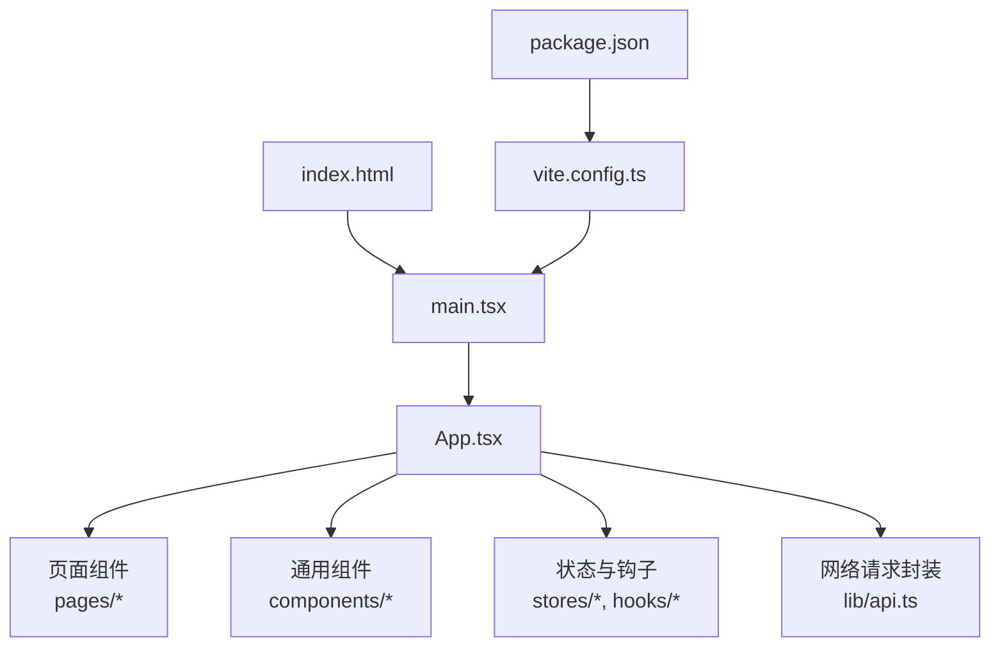
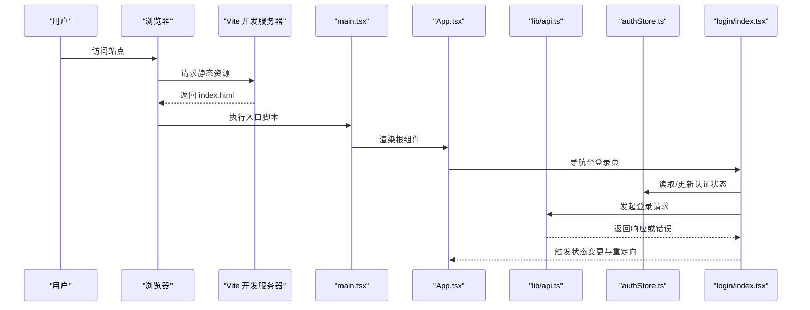
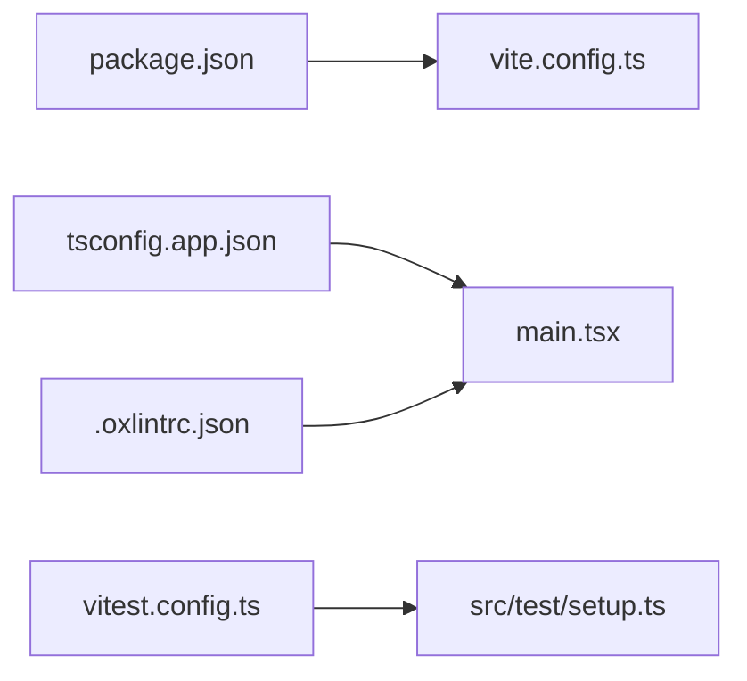

# 调试与排错指南

<cite>
**本文引用的文件**   
- [web/vite.config.ts](file://web/vite.config.ts)
- [web/package.json](file://web/package.json)
- [web/index.html](file://web/index.html)
- [web/src/main.tsx](file://web/src/main.tsx)
- [web/src/App.tsx](file://web/src/App.tsx)
- [web/src/lib/api.ts](file://web/src/lib/api.ts)
- [web/src/stores/authStore.ts](file://web/src/stores/authStore.ts)
- [web/src/hooks/useAuth.ts](file://web/src/hooks/useAuth.ts)
- [web/src/pages/login/index.tsx](file://web/src/pages/login/index.tsx)
- [web/src/components/layout/require-permission.tsx](file://web/src/components/layout/require-permission.tsx)
- [web/tsconfig.app.json](file://web/tsconfig.app.json)
- [web/.oxlintrc.json](file://web/.oxlintrc.json)
- [web/vitest.config.ts](file://web/vitest.config.ts)
- [web/src/test/setup.ts](file://web/src/test/setup.ts)
</cite>

## 目录
1. [简介](#简介)
2. [项目结构](#项目结构)
3. [核心组件](#核心组件)
4. [架构总览](#架构总览)
5. [详细组件分析](#详细组件分析)
6. [依赖分析](#依赖分析)
7. [性能考虑](#性能考虑)
8. [故障排查手册](#故障排查手册)
9. [结论](#结论)
10. [附录](#附录)

## 简介
本指南面向 pj3 项目的开发者，聚焦于“如何高效调试与排错”。内容覆盖：
- 浏览器开发者工具、VS Code 调试配置、Vite 开发服务器调试技巧
- 日志记录规范（console.log 最佳实践、结构化日志输出、错误信息标准化）
- 性能分析方法（监控指标、内存泄漏检测、渲染性能优化）
- 错误处理策略（异常捕获、错误边界、用户友好提示）
- 常见问题排查（构建错误、运行时异常、兼容性问题）
- 调试方法论与实战技巧

## 项目结构
本项目为基于 Vite + React + TypeScript 的前端工程。关键入口与配置文件如下：
- 应用入口：src/main.tsx
- 根组件：src/App.tsx
- 开发服务器与构建配置：web/vite.config.ts
- 脚本与依赖：web/package.json
- HTML 模板：web/index.html
- 类型与检查：web/tsconfig.app.json、web/.oxlintrc.json
- 测试框架：web/vitest.config.ts、web/src/test/setup.ts

图表来源
- [web/index.html:1-50](file://web/index.html#L1-L50)
- [web/src/main.tsx:1-50](file://web/src/main.tsx#L1-L50)
- [web/src/App.tsx:1-50](file://web/src/App.tsx#L1-L50)
- [web/vite.config.ts:1-50](file://web/vite.config.ts#L1-L50)
- [web/package.json:1-50](file://web/package.json#L1-L50)

章节来源
- [web/index.html:1-50](file://web/index.html#L1-L50)
- [web/src/main.tsx:1-50](file://web/src/main.tsx#L1-L50)
- [web/src/App.tsx:1-50](file://web/src/App.tsx#L1-L50)
- [web/vite.config.ts:1-50](file://web/vite.config.ts#L1-L50)
- [web/package.json:1-50](file://web/package.json#L1-L50)

## 核心组件
- 应用启动流程
  - index.html 加载 main.tsx，main.tsx 初始化 React 应用并挂载到 DOM。
  - App.tsx 作为根组件，组织路由、布局、全局状态与错误边界等。
- 网络层
  - lib/api.ts 提供统一的请求封装，便于集中处理请求头、错误码、重试与日志。
- 认证与权限
  - stores/authStore.ts 管理登录态与用户信息。
  - hooks/useAuth.ts 暴露认证相关状态与操作。
  - components/layout/require-permission.tsx 实现权限守卫逻辑。
  - pages/login/index.tsx 负责登录流程与跳转。

章节来源
- [web/src/main.tsx:1-50](file://web/src/main.tsx#L1-L50)
- [web/src/App.tsx:1-50](file://web/src/App.tsx#L1-L50)
- [web/src/lib/api.ts:1-50](file://web/src/lib/api.ts#L1-L50)
- [web/src/stores/authStore.ts:1-50](file://web/src/stores/authStore.ts#L1-L50)
- [web/src/hooks/useAuth.ts:1-50](file://web/src/hooks/useAuth.ts#L1-L50)
- [web/src/components/layout/require-permission.tsx:1-50](file://web/src/components/layout/require-permission.tsx#L1-L50)
- [web/src/pages/login/index.tsx:1-50](file://web/src/pages/login/index.tsx#L1-L50)

## 架构总览
下图展示从浏览器到应用内部的关键调用链，以及开发与调试的切入点。

图表来源
- [web/index.html:1-50](file://web/index.html#L1-L50)
- [web/src/main.tsx:1-50](file://web/src/main.tsx#L1-L50)
- [web/src/App.tsx:1-50](file://web/src/App.tsx#L1-L50)
- [web/src/pages/login/index.tsx:1-50](file://web/src/pages/login/index.tsx#L1-L50)
- [web/src/stores/authStore.ts:1-50](file://web/src/stores/authStore.ts#L1-L50)
- [web/src/lib/api.ts:1-50](file://web/src/lib/api.ts#L1-L50)

## 详细组件分析

### 开发环境调试（浏览器、VS Code、Vite）
- 浏览器开发者工具
  - Sources 面板：设置断点、单步执行、查看调用栈、监视变量。
  - Network 面板：过滤 XHR/Fetch、查看请求/响应体、模拟弱网。
  - Performance/Memory 面板：录制性能、分析长任务、堆快照对比定位内存泄漏。
  - Console 面板：使用分组、标签、条件日志；避免在生产环境输出敏感信息。
- VS Code 调试配置
  - 使用 Chrome/Edge 调试器连接本地开发服务，支持断点同步与变量预览。
  - 在 launch.json 中配置前端调试，确保 sourceMap 可用。
- Vite 开发服务器调试
  - 启用 sourcemap 提升源码映射质量。
  - 通过环境变量控制日志级别与功能开关。
  - 使用热重载快速验证修复效果。

章节来源
- [web/vite.config.ts:1-50](file://web/vite.config.ts#L1-L50)
- [web/package.json:1-50](file://web/package.json#L1-L50)
- [web/index.html:1-50](file://web/index.html#L1-L50)

### 日志记录规范
- console.log 最佳实践
  - 使用分类标签与层级，避免刷屏；仅在开发环境输出。
  - 对复杂对象使用结构化字段，便于检索与聚合。
- 结构化日志输出
  - 统一日志格式：时间戳、模块名、方法名、上下文键值对、错误堆栈。
  - 将业务事件与系统事件分离，便于不同渠道采集。
- 错误信息标准化
  - 定义错误码与消息字典，保证前后端一致。
  - 保留原始错误上下文（URL、参数、用户ID），但脱敏敏感数据。
- 建议落地位置
  - 网络层集中打印请求/响应摘要与错误。
  - 权限与认证流程记录关键步骤。
  - 页面级错误边界收集未捕获异常。

章节来源
- [web/src/lib/api.ts:1-50](file://web/src/lib/api.ts#L1-L50)
- [web/src/stores/authStore.ts:1-50](file://web/src/stores/authStore.ts#L1-L50)
- [web/src/hooks/useAuth.ts:1-50](file://web/src/hooks/useAuth.ts#L1-L50)
- [web/src/components/layout/require-permission.tsx:1-50](file://web/src/components/layout/require-permission.tsx#L1-L50)
- [web/src/pages/login/index.tsx:1-50](file://web/src/pages/login/index.tsx#L1-L50)

### 性能分析方法
- 性能监控指标
  - 首屏与交互指标：FCP、LCP、INP、CLS 等。
  - 自定义埋点：关键路径耗时、接口 RTT、失败率。
- 内存泄漏检测
  - 使用 Performance/Memory 面板进行堆快照对比，关注 Detached Nodes、Closure 增长。
  - 清理定时器、事件监听、订阅与缓存引用。
- 渲染性能优化
  - 减少不必要的重渲染，合理使用 memo、useMemo、useCallback。
  - 大列表虚拟化、按需加载与代码分割。
- 建议落地位置
  - 在入口与关键页面埋点上报。
  - 在 API 层统计接口耗时与错误分布。

章节来源
- [web/src/main.tsx:1-50](file://web/src/main.tsx#L1-L50)
- [web/src/App.tsx:1-50](file://web/src/App.tsx#L1-L50)
- [web/src/lib/api.ts:1-50](file://web/src/lib/api.ts#L1-L50)

### 错误处理策略
- 异常捕获机制
  - 全局错误监听：window.onerror、unhandledrejection。
  - 异步错误：Promise.catch 与 try/catch 结合。
- 错误边界设计
  - 在页面或模块级包裹错误边界，降级渲染并提供重试入口。
- 用户友好提示
  - 将技术错误转换为可理解文案，提供反馈与重试按钮。
  - 区分网络错误、鉴权错误、服务端错误，给出差异化引导。
- 建议落地位置
  - App.tsx 顶层错误边界。
  - require-permission.tsx 权限失败处理。
  - login/index.tsx 登录失败提示与重试。

章节来源
- [web/src/App.tsx:1-50](file://web/src/App.tsx#L1-L50)
- [web/src/components/layout/require-permission.tsx:1-50](file://web/src/components/layout/require-permission.tsx#L1-L50)
- [web/src/pages/login/index.tsx:1-50](file://web/src/pages/login/index.tsx#L1-L50)

### 认证与权限调试要点
- 登录流程断点
  - 在登录页提交处、API 层、认证 Store 设置断点，观察状态流转。
- 权限守卫
  - 在未授权页面断点，确认权限判断与跳转逻辑。
- 常见陷阱
  - Token 过期、跨域、Cookie/Storage 不一致、路由守卫顺序问题。

章节来源
- [web/src/pages/login/index.tsx:1-50](file://web/src/pages/login/index.tsx#L1-L50)
- [web/src/stores/authStore.ts:1-50](file://web/src/stores/authStore.ts#L1-L50)
- [web/src/hooks/useAuth.ts:1-50](file://web/src/hooks/useAuth.ts#L1-L50)
- [web/src/components/layout/require-permission.tsx:1-50](file://web/src/components/layout/require-permission.tsx#L1-L50)

### 网络请求调试
- 请求链路
  - 在 api.ts 统一拦截请求头、错误码与重试策略。
- 常见问题
  - 跨域、签名校验失败、超时、重复请求。
- 调试技巧
  - 使用 Network 面板筛选特定域名与类型，查看 Payload 与 Headers。
  - 在控制台打印结构化摘要，避免泄露敏感信息。

章节来源
- [web/src/lib/api.ts:1-50](file://web/src/lib/api.ts#L1-L50)

### 测试辅助调试
- Vitest 配置与测试环境
  - vitest.config.ts 与 src/test/setup.ts 提供测试环境与全局桩。
- 单元测试断点
  - 在测试用例中打断点，快速验证函数行为与边界条件。

章节来源
- [web/vitest.config.ts:1-50](file://web/vitest.config.ts#L1-L50)
- [web/src/test/setup.ts:1-50](file://web/src/test/setup.ts#L1-L50)

## 依赖分析
- 构建与运行依赖
  - package.json 声明脚本与依赖，vite.config.ts 驱动开发与构建。
- 类型与检查
  - tsconfig.app.json 控制编译选项与路径别名。
  - .oxlintrc.json 配置代码风格与规则。
- 测试依赖
  - vitest.config.ts 与 setup.ts 提供测试能力。

图表来源
- [web/package.json:1-50](file://web/package.json#L1-L50)
- [web/vite.config.ts:1-50](file://web/vite.config.ts#L1-L50)
- [web/tsconfig.app.json:1-50](file://web/tsconfig.app.json#L1-L50)
- [web/.oxlintrc.json:1-50](file://web/.oxlintrc.json#L1-L50)
- [web/vitest.config.ts:1-50](file://web/vitest.config.ts#L1-L50)
- [web/src/test/setup.ts:1-50](file://web/src/test/setup.ts#L1-L50)

章节来源
- [web/package.json:1-50](file://web/package.json#L1-L50)
- [web/vite.config.ts:1-50](file://web/vite.config.ts#L1-L50)
- [web/tsconfig.app.json:1-50](file://web/tsconfig.app.json#L1-L50)
- [web/.oxlintrc.json:1-50](file://web/.oxlintrc.json#L1-L50)
- [web/vitest.config.ts:1-50](file://web/vitest.config.ts#L1-L50)
- [web/src/test/setup.ts:1-50](file://web/src/test/setup.ts#L1-L50)

## 性能考虑
- 建议开启生产模式下的性能埋点与错误上报。
- 对热点页面与关键接口建立基线指标，持续回归。
- 定期审查 bundle 体积与懒加载策略，避免首屏过大。
- 使用浏览器 Memory 面板进行周期性巡检，发现潜在泄漏。

[本节为通用指导，不直接分析具体文件]

## 故障排查手册

### 构建错误
- 症状
  - 启动失败、TS 报错、插件冲突、端口占用。
- 排查步骤
  - 清理缓存与 node_modules，重装依赖。
  - 检查 vite.config.ts 与 tsconfig.app.json 配置一致性。
  - 查看终端完整堆栈，定位首个错误。
- 常见原因
  - 版本不兼容、路径别名未生效、环境变量缺失。

章节来源
- [web/vite.config.ts:1-50](file://web/vite.config.ts#L1-L50)
- [web/tsconfig.app.json:1-50](file://web/tsconfig.app.json#L1-L50)
- [web/package.json:1-50](file://web/package.json#L1-L50)

### 运行时异常
- 症状
  - 白屏、页面崩溃、接口 4xx/5xx、权限拒绝。
- 排查步骤
  - 打开浏览器控制台与 Network，定位错误来源。
  - 在 App.tsx 与页面组件添加错误边界与日志。
  - 在 api.ts 增加请求/响应摘要与错误码映射。
- 常见原因
  - 未捕获 Promise 拒绝、空指针、跨域、Token 失效。

章节来源
- [web/src/App.tsx:1-50](file://web/src/App.tsx#L1-L50)
- [web/src/lib/api.ts:1-50](file://web/src/lib/api.ts#L1-L50)
- [web/src/components/layout/require-permission.tsx:1-50](file://web/src/components/layout/require-permission.tsx#L1-L50)

### 兼容性问题
- 症状
  - 老浏览器样式错乱、API 不可用、Polyfill 缺失。
- 排查步骤
  - 检查目标浏览器范围与 polyfill 策略。
  - 使用 Can I Use 查询特性支持情况。
  - 在开发环境切换 UA 模拟多端。
- 常见原因
  - 新语法未转译、CSS 特性不支持、Web API 差异。

章节来源
- [web/tsconfig.app.json:1-50](file://web/tsconfig.app.json#L1-L50)
- [web/vite.config.ts:1-50](file://web/vite.config.ts#L1-L50)

### 认证与权限问题
- 症状
  - 登录后仍被重定向、菜单无权限、接口 401/403。
- 排查步骤
  - 在 login/index.tsx 与 authStore.ts 设置断点，核对状态更新时机。
  - 在 require-permission.tsx 检查权限判定逻辑。
  - 在 api.ts 确认请求头携带与错误码处理。
- 常见原因
  - Token 未持久化、刷新失败、权限数据不同步。

章节来源
- [web/src/pages/login/index.tsx:1-50](file://web/src/pages/login/index.tsx#L1-L50)
- [web/src/stores/authStore.ts:1-50](file://web/src/stores/authStore.ts#L1-L50)
- [web/src/hooks/useAuth.ts:1-50](file://web/src/hooks/useAuth.ts#L1-L50)
- [web/src/components/layout/require-permission.tsx:1-50](file://web/src/components/layout/require-permission.tsx#L1-L50)
- [web/src/lib/api.ts:1-50](file://web/src/lib/api.ts#L1-L50)

### 网络与跨域问题
- 症状
  - CORS 错误、预检失败、证书问题。
- 排查步骤
  - 在 Network 面板查看预检请求与响应头。
  - 检查后端跨域配置与代理设置。
- 常见原因
  - 缺少必要 Header、方法不在允许列表、Cookie 跨域限制。

章节来源
- [web/src/lib/api.ts:1-50](file://web/src/lib/api.ts#L1-L50)
- [web/vite.config.ts:1-50](file://web/vite.config.ts#L1-L50)

### 性能问题定位
- 症状
  - 页面卡顿、滚动掉帧、内存持续增长。
- 排查步骤
  - 使用 Performance 录制，定位长任务与重绘区域。
  - 使用 Memory 做堆快照对比，查找泄漏源。
  - 在关键组件添加渲染计数与耗时埋点。
- 常见原因
  - 过度渲染、大对象频繁创建、未清理副作用。

章节来源
- [web/src/App.tsx:1-50](file://web/src/App.tsx#L1-L50)
- [web/src/lib/api.ts:1-50](file://web/src/lib/api.ts#L1-L50)

## 结论
- 以“断点+日志+指标”三位一体定位问题，优先在网络层与错误边界收敛。
- 建立统一的日志与错误规范，提高可观测性与协作效率。
- 将性能与兼容性纳入日常巡检，持续优化用户体验。

[本节为总结性内容，不直接分析具体文件]

## 附录

### 常用命令与脚本
- 启动开发服务、构建产物、运行测试等命令参考 package.json 中的 scripts。
- 若需调整端口或代理，可在 vite.config.ts 中配置。

章节来源
- [web/package.json:1-50](file://web/package.json#L1-L50)
- [web/vite.config.ts:1-50](file://web/vite.config.ts#L1-L50)

### 调试清单
- 启动前
  - 确认端口未被占用、依赖安装完成、环境变量正确。
- 启动后
  - 打开控制台与 Network，验证资源加载与接口连通。
- 复现问题
  - 最小化复现场景，逐步缩小范围。
- 修复验证
  - 补充单元测试与回归用例，避免回退。

[本节为通用指导，不直接分析具体文件]