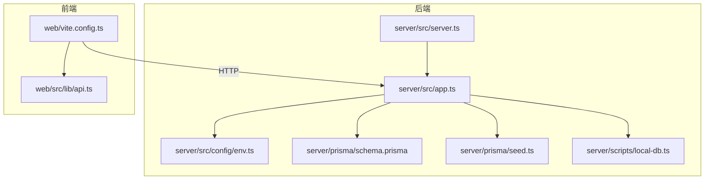
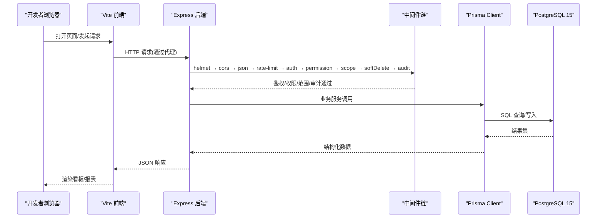
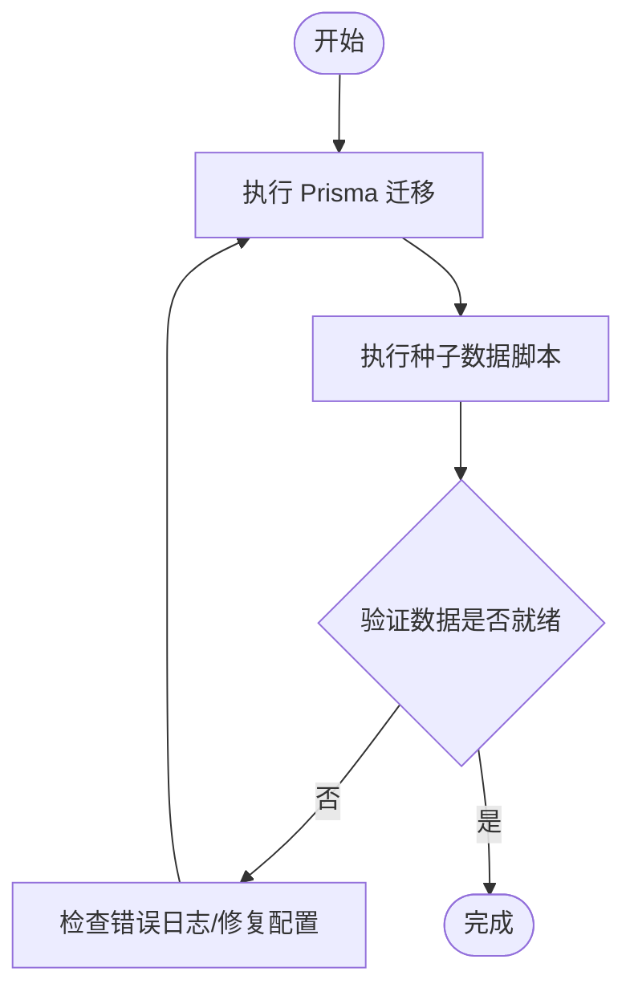
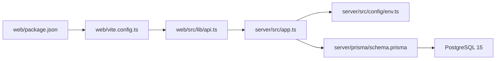

# 快速开始

<cite>
**本文引用的文件**   
- [server/package.json](file://server/package.json)
- [web/package.json](file://web/package.json)
- [server/src/server.ts](file://server/src/server.ts)
- [server/src/app.ts](file://server/src/app.ts)
- [server/src/config/env.ts](file://server/src/config/env.ts)
- [server/prisma/schema.prisma](file://server/prisma/schema.prisma)
- [server/prisma/seed.ts](file://server/prisma/seed.ts)
- [server/scripts/local-db.ts](file://server/scripts/local-db.ts)
- [web/vite.config.ts](file://web/vite.config.ts)
- [web/src/lib/api.ts](file://web/src/lib/api.ts)
- [.wiki/Getting-Started.md](file://.wiki/Getting-Started.md)
</cite>

## 目录
1. [简介](#简介)
2. [项目结构](#项目结构)
3. [核心组件](#核心组件)
4. [架构总览](#架构总览)
5. [详细组件分析](#详细组件分析)
6. [依赖分析](#依赖分析)
7. [性能注意事项](#性能注意事项)
8. [故障排除指南](#故障排除指南)
9. [结论](#结论)
10. [附录](#附录)

## 简介
本快速开始指南面向首次加入 FY200（浙江壹品慧财年经营数据分析平台）项目的开发者，目标是帮助你在最短时间内完成本地开发环境搭建、数据库初始化与种子数据加载，并成功启动前后端服务进行联调。项目定位为“Excel进、看板/报表出”的内部管理口径财务数据平台，单位统一为万元/人民币。后端采用 Express + Prisma + PostgreSQL 15 + JWT + DeepSeek API（SSE 流式），中间件执行链顺序固定，计算类指标使用安全公式解析，AI 提供双管道架构（polish/analyze）。

## 项目结构
FY200 为前后端分离的 monorepo：
- server：Express 后端、Prisma 数据层、脚本与测试
- web：Vite + React 前端应用
- .wiki：Wiki 文档（含 Getting Started）
- docs：设计与参考文档

图表来源
- [server/src/server.ts](file://server/src/server.ts)
- [server/src/app.ts](file://server/src/app.ts)
- [server/src/config/env.ts](file://server/src/config/env.ts)
- [server/prisma/schema.prisma](file://server/prisma/schema.prisma)
- [server/prisma/seed.ts](file://server/prisma/seed.ts)
- [server/scripts/local-db.ts](file://server/scripts/local-db.ts)
- [web/vite.config.ts](file://web/vite.config.ts)
- [web/src/lib/api.ts](file://web/src/lib/api.ts)

章节来源
- [server/package.json](file://server/package.json)
- [web/package.json](file://web/package.json)
- [.wiki/Getting-Started.md](file://.wiki/Getting-Started.md)

## 核心组件
- 后端入口与路由挂载：Express 应用初始化、中间件链、路由注册
- 配置与环境变量：PostgreSQL 连接、JWT、DeepSeek API、CORS、速率限制等
- 数据层：Prisma Schema、迁移与种子数据
- 前端：Vite 开发服务器、API 客户端封装、代理到后端

章节来源
- [server/src/server.ts](file://server/src/server.ts)
- [server/src/app.ts](file://server/src/app.ts)
- [server/src/config/env.ts](file://server/src/config/env.ts)
- [server/prisma/schema.prisma](file://server/prisma/schema.prisma)
- [server/prisma/seed.ts](file://server/prisma/seed.ts)
- [web/vite.config.ts](file://web/vite.config.ts)
- [web/src/lib/api.ts](file://web/src/lib/api.ts)

## 架构总览
下图展示了从浏览器到数据库的关键调用路径，以及中间件执行顺序与安全策略。

图表来源
- [server/src/app.ts](file://server/src/app.ts)
- [server/src/middleware/auth.ts](file://server/src/middleware/auth.ts)
- [server/src/middleware/permission.ts](file://server/src/middleware/permission.ts)
- [server/src/middleware/scope.ts](file://server/src/middleware/scope.ts)
- [server/src/middleware/soft-delete.ts](file://server/src/middleware/soft-delete.ts)
- [server/src/middleware/audit.ts](file://server/src/middleware/audit.ts)
- [server/src/middleware/rate-limit.ts](file://server/src/middleware/rate-limit.ts)
- [server/src/middleware/cors.ts](file://server/src/middleware/cors.ts)
- [server/src/middleware/helmet.ts](file://server/src/middleware/helmet.ts)
- [server/src/lib/prisma.ts](file://server/src/lib/prisma.ts)
- [server/prisma/schema.prisma](file://server/prisma/schema.prisma)

## 详细组件分析

### 环境与依赖准备
- Node.js 版本要求：请根据 server 与 web 的 package.json 中 engines 或 scripts 推断所需版本；建议使用 LTS 版本以确保兼容性。
- 安装包管理器：推荐使用 npm 或 pnpm/yarn（与仓库一致即可）。
- 克隆仓库后，分别进入 server 与 web 目录安装依赖。

章节来源
- [server/package.json](file://server/package.json)
- [web/package.json](file://web/package.json)

### 数据库准备（PostgreSQL 15）
- 安装 PostgreSQL 15，确保可本地访问（端口默认 5432）。
- 创建数据库与用户（建议命名与项目一致），并授予足够权限。
- 若本地无数据库，可使用内置脚本拉起临时实例（用于快速验证）。

章节来源
- [server/scripts/local-db.ts](file://server/scripts/local-db.ts)

### 环境变量配置
- 在 server 根目录创建 .env 文件，至少包含以下键：
  - DATABASE_URL：PostgreSQL 连接串（含用户名、密码、主机、端口、库名）
  - JWT_SECRET：JWT 签名密钥
  - DEEPSEEK_API_KEY：DeepSeek API 密钥（如需 AI 功能）
  - CORS_ORIGIN：允许的前端域名（开发时通常为 http://localhost:端口）
  - RATE_LIMIT_*：速率限制相关参数（可选）
- 环境变量由 server/src/config/env.ts 读取并校验。

章节来源
- [server/src/config/env.ts](file://server/src/config/env.ts)

### 数据库初始化与种子数据
- 运行 Prisma 迁移以创建表结构。
- 执行种子脚本填充基础数据（如公司、主题树等）。
- 若需重置数据库，请先回滚迁移再重新生成。

图表来源
- [server/prisma/schema.prisma](file://server/prisma/schema.prisma)
- [server/prisma/seed.ts](file://server/prisma/seed.ts)

章节来源
- [server/prisma/schema.prisma](file://server/prisma/schema.prisma)
- [server/prisma/seed.ts](file://server/prisma/seed.ts)

### 启动后端服务
- 安装依赖后，运行后端开发脚本（通常包含热重载与调试支持）。
- 后端将自动读取 .env 中的配置，连接数据库，并暴露 REST API。
- 常见命令：
  - 安装依赖：在 server 目录执行包管理器 install
  - 启动开发模式：执行对应的 dev 脚本
  - 构建生产包：执行 build 脚本（按需）

章节来源
- [server/package.json](file://server/package.json)
- [server/src/server.ts](file://server/src/server.ts)
- [server/src/app.ts](file://server/src/app.ts)

### 启动前端服务
- 安装依赖后，运行前端开发脚本。
- 前端通过 Vite 提供热更新，并通过代理将 /api 请求转发至后端。
- 常见命令：
  - 安装依赖：在 web 目录执行包管理器 install
  - 启动开发模式：执行对应的 dev 脚本
  - 构建生产包：执行 build 脚本（按需）

章节来源
- [web/package.json](file://web/package.json)
- [web/vite.config.ts](file://web/vite.config.ts)
- [web/src/lib/api.ts](file://web/src/lib/api.ts)

### 常用开发脚本
- 后端：
  - 迁移：prisma migrate deploy/dev/reset（依据实际脚本）
  - 种子：执行 seed.ts 对应脚本
  - 本地数据库：使用 local-db.ts 脚本快速拉起
- 前端：
  - 开发：vite dev
  - 构建：vite build
  - 测试：vitest（如有）

章节来源
- [server/package.json](file://server/package.json)
- [web/package.json](file://web/package.json)
- [server/scripts/local-db.ts](file://server/scripts/local-db.ts)
- [server/prisma/seed.ts](file://server/prisma/seed.ts)

### 基本验证步骤
- 启动后端后，访问健康检查或登录接口，确认返回正常。
- 启动前端后，打开首页，观察是否能正确拉取数据。
- 尝试登录流程，验证 JWT 签发与刷新机制。
- 若涉及 AI 能力，发送一条简单提示词，确认 SSE 流式响应。

章节来源
- [server/src/app.ts](file://server/src/app.ts)
- [web/src/lib/api.ts](file://web/src/lib/api.ts)

## 依赖分析
- 后端依赖：Express、Prisma、PostgreSQL 驱动、JWT、DeepSeek SDK（可选）、Helmet/CORS/RateLimit 等中间件
- 前端依赖：Vite、React、Axios/Fetch 封装、状态管理与 UI 库
- 关键耦合点：
  - 前端通过 vite.config.ts 的代理指向后端
  - 后端通过 env.ts 读取环境变量
  - Prisma 与 PostgreSQL 的连接由 schema.prisma 与 DATABASE_URL 控制

图表来源
- [web/package.json](file://web/package.json)
- [web/vite.config.ts](file://web/vite.config.ts)
- [web/src/lib/api.ts](file://web/src/lib/api.ts)
- [server/src/app.ts](file://server/src/app.ts)
- [server/src/config/env.ts](file://server/src/config/env.ts)
- [server/prisma/schema.prisma](file://server/prisma/schema.prisma)

章节来源
- [server/package.json](file://server/package.json)
- [web/package.json](file://web/package.json)

## 性能注意事项
- 中间件链顺序严格：helmet → cors → express.json → rate-limit → auth → permission → scope → softDelete → audit → Service → Prisma → PostgreSQL
- 计算类指标使用安全公式解析（白名单算子），避免 eval 带来的性能与安全风险
- AI 双管道：polish（文本→脱敏→LLM→还原）/ analyze（结构化→计算→脱敏→LLM→生成），注意 SSE 流式传输的缓冲与背压
- 数据库连接池与慢查询监控：合理设置 Prisma 连接池大小，关注慢查询日志

[本节为通用指导，不直接分析具体文件]

## 故障排除指南
- 无法连接数据库
  - 检查 DATABASE_URL 是否正确，PostgreSQL 服务是否启动
  - 使用 local-db.ts 脚本快速拉起本地实例进行验证
- 前端无法访问后端 API
  - 检查 vite.config.ts 的代理配置是否与后端端口一致
  - 确认 CORS 配置允许前端域名
- 登录失败或 Token 无效
  - 检查 JWT_SECRET 是否一致
  - 查看服务端日志，确认认证与权限中间件是否放行
- 种子数据未生效
  - 确认已执行迁移与种子脚本
  - 检查数据库权限与用户角色
- AI 功能异常
  - 检查 DEEPSEEK_API_KEY 是否配置正确
  - 确认网络可达与 API 配额

章节来源
- [server/scripts/local-db.ts](file://server/scripts/local-db.ts)
- [web/vite.config.ts](file://web/vite.config.ts)
- [server/src/config/env.ts](file://server/src/config/env.ts)
- [server/src/app.ts](file://server/src/app.ts)

## 结论
按照本指南完成环境准备、数据库初始化与种子数据加载后，即可顺利启动前后端服务并进行联调。建议在本地开发阶段优先保证数据库连通性与环境变量正确性，再逐步启用 AI 与高级功能。遇到问题时，优先检查中间件链与代理配置，结合日志定位问题。

[本节为总结性内容，不直接分析具体文件]

## 附录
- 获取更详细的入门说明，请参考 Wiki 中的 Getting Started 文档。

章节来源
- [.wiki/Getting-Started.md](file://.wiki/Getting-Started.md)