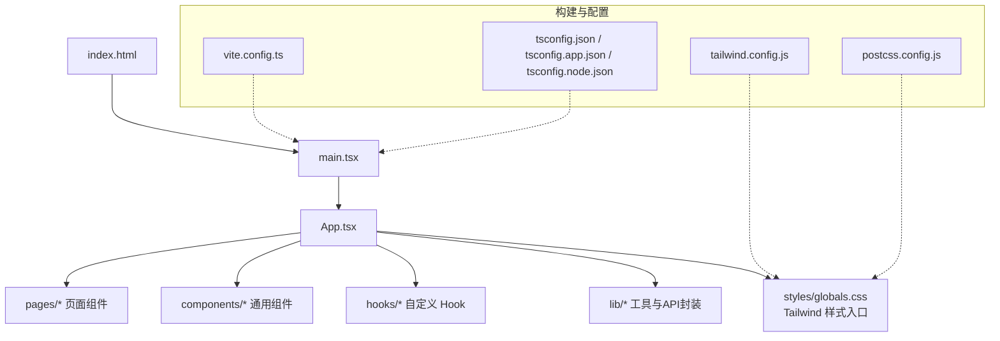
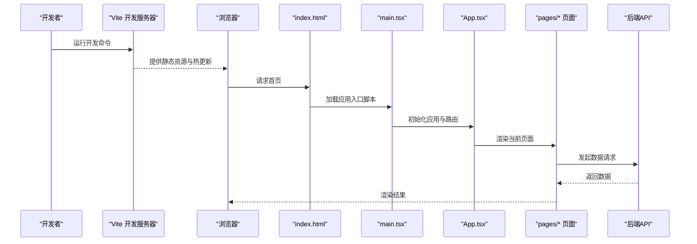
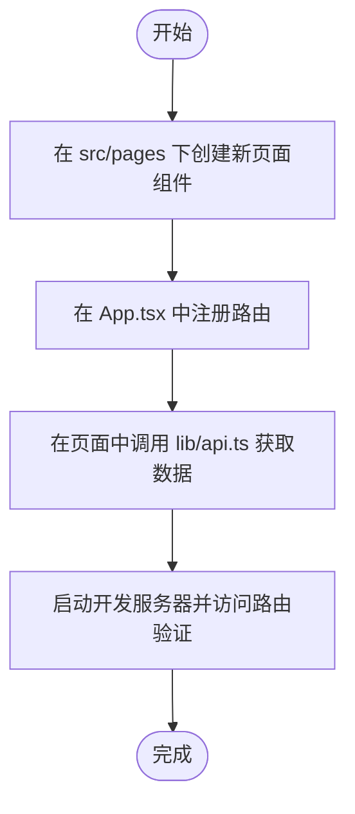
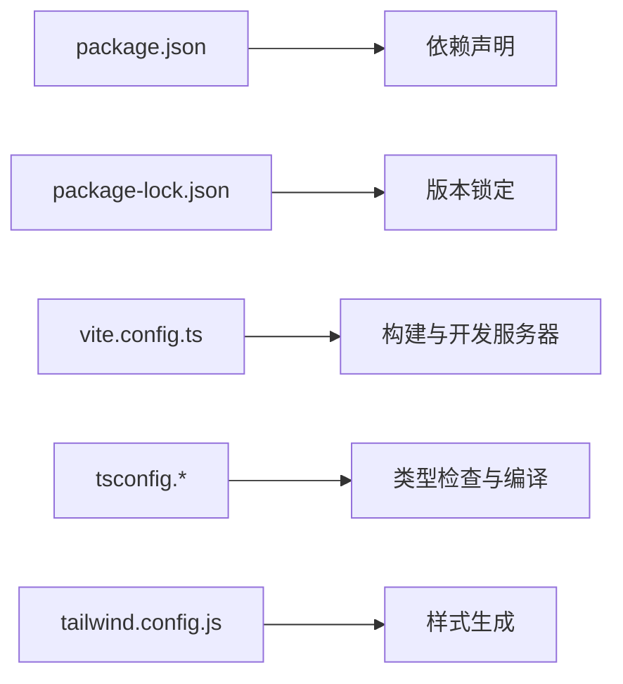

# 快速开始

<cite>
**本文引用的文件**   
- [web/package.json](file://web/package.json)
- [web/vite.config.ts](file://web/vite.config.ts)
- [web/tsconfig.json](file://web/tsconfig.json)
- [web/tsconfig.app.json](file://web/tsconfig.app.json)
- [web/tsconfig.node.json](file://web/tsconfig.node.json)
- [web/tailwind.config.js](file://web/tailwind.config.js)
- [web/postcss.config.js](file://web/postcss.config.js)
- [web/index.html](file://web/index.html)
- [web/src/main.tsx](file://web/src/main.tsx)
- [web/src/App.tsx](file://web/src/App.tsx)
- [web/src/pages/login/index.tsx](file://web/src/pages/login/index.tsx)
- [web/src/pages/dashboard/index.tsx](file://web/src/pages/dashboard/index.tsx)
- [web/src/lib/api.ts](file://web/src/lib/api.ts)
</cite>

## 目录
1. [简介](#简介)
2. [项目结构](#项目结构)
3. [核心组件](#核心组件)
4. [架构总览](#架构总览)
5. [详细组件分析](#详细组件分析)
6. [依赖分析](#依赖分析)
7. [性能考虑](#性能考虑)
8. [故障排查指南](#故障排查指南)
9. [结论](#结论)
10. [附录](#附录)

## 简介
本指南面向首次接触 pj3 项目的开发者，目标是在 30 分钟内完成环境准备、安装依赖、启动开发服务器，并理解关键配置文件的作用。你将学会：
- 如何克隆仓库、安装依赖、启动本地开发服务
- vite.config.ts、tsconfig.*、tailwind.config.js 等关键配置的含义与常用调整点
- 如何新增页面路由、创建组件、调用 API 的基本流程
- 常见环境问题的定位与解决思路

## 项目结构
本项目采用前端工程化标准结构，核心位于 web 目录：
- 构建与工具链：vite、TypeScript、Tailwind CSS、PostCSS、Vitest
- 源码组织：src 下按功能域划分（pages、components、hooks、lib、stores、styles、types）
- 入口文件：index.html 作为应用根模板，main.tsx 挂载 React 应用，App.tsx 定义全局布局与路由

图表来源
- [web/index.html](file://web/index.html)
- [web/src/main.tsx](file://web/src/main.tsx)
- [web/src/App.tsx](file://web/src/App.tsx)
- [web/vite.config.ts](file://web/vite.config.ts)
- [web/tsconfig.json](file://web/tsconfig.json)
- [web/tsconfig.app.json](file://web/tsconfig.app.json)
- [web/tsconfig.node.json](file://web/tsconfig.node.json)
- [web/tailwind.config.js](file://web/tailwind.config.js)
- [web/postcss.config.js](file://web/postcss.config.js)

章节来源
- [web/package.json](file://web/package.json)
- [web/index.html](file://web/index.html)
- [web/src/main.tsx](file://web/src/main.tsx)
- [web/src/App.tsx](file://web/src/App.tsx)

## 核心组件
- 应用入口与挂载
  - index.html：提供 HTML 骨架与脚本加载入口
  - main.tsx：初始化 React 应用并挂载到 DOM
  - App.tsx：定义全局布局、路由与权限相关逻辑
- 页面与路由
  - pages/*：每个子目录对应一个页面模块，如 login、dashboard
- 样式系统
  - tailwind.config.js：Tailwind 主题与插件配置
  - postcss.config.js：PostCSS 处理链（含 Tailwind 插件）
  - styles/globals.css：全局样式与 Tailwind 指令导入
- 类型与构建
  - tsconfig.json：项目级 TypeScript 配置
  - tsconfig.app.json：应用代码的 TS 编译选项
  - tsconfig.node.json：Node 侧工具链的 TS 编译选项
  - vite.config.ts：Vite 构建与开发服务器配置

章节来源
- [web/index.html](file://web/index.html)
- [web/src/main.tsx](file://web/src/main.tsx)
- [web/src/App.tsx](file://web/src/App.tsx)
- [web/tailwind.config.js](file://web/tailwind.config.js)
- [web/postcss.config.js](file://web/postcss.config.js)
- [web/tsconfig.json](file://web/tsconfig.json)
- [web/tsconfig.app.json](file://web/tsconfig.app.json)
- [web/tsconfig.node.json](file://web/tsconfig.node.json)
- [web/vite.config.ts](file://web/vite.config.ts)

## 架构总览
下图展示了从浏览器访问到页面渲染的关键路径，以及开发与构建阶段的工具链协作关系。

图表来源
- [web/index.html](file://web/index.html)
- [web/src/main.tsx](file://web/src/main.tsx)
- [web/src/App.tsx](file://web/src/App.tsx)
- [web/src/pages/login/index.tsx](file://web/src/pages/login/index.tsx)
- [web/src/pages/dashboard/index.tsx](file://web/src/pages/dashboard/index.tsx)
- [web/src/lib/api.ts](file://web/src/lib/api.ts)

## 详细组件分析

### 构建与开发环境
- Node.js 与包管理器
  - 建议使用 Node.js LTS 版本（推荐 18.x 或 20.x），包管理器可选 npm、yarn 或 pnpm
  - 项目脚本与依赖声明位于 web/package.json，包含开发、构建、测试等命令
- 安装与启动
  - 进入 web 目录后执行依赖安装命令
  - 使用开发命令启动本地服务，默认监听端口可在 vite.config.ts 中查看或修改
- 环境变量与代理
  - 若需对接后端接口，可在 vite.config.ts 中配置开发代理或环境变量

章节来源
- [web/package.json](file://web/package.json)
- [web/vite.config.ts](file://web/vite.config.ts)

### 关键配置文件说明
- vite.config.ts
  - 作用：定义开发服务器、插件、别名、构建输出等
  - 常见调整：端口号、代理规则、路径别名、生产构建优化
- tsconfig.json / tsconfig.app.json / tsconfig.node.json
  - 作用：统一与分场景的 TypeScript 编译选项
  - 常见调整：严格模式、模块解析策略、JSX 支持、路径映射
- tailwind.config.js
  - 作用：Tailwind 主题、扩展、插件与内容扫描范围
  - 常见调整：自定义颜色/字体、启用插件、扫描路径
- postcss.config.js
  - 作用：PostCSS 处理链，集成 Tailwind 与兼容前缀等
- index.html
  - 作用：应用根模板，注入脚本与全局变量

章节来源
- [web/vite.config.ts](file://web/vite.config.ts)
- [web/tsconfig.json](file://web/tsconfig.json)
- [web/tsconfig.app.json](file://web/tsconfig.app.json)
- [web/tsconfig.node.json](file://web/tsconfig.node.json)
- [web/tailwind.config.js](file://web/tailwind.config.js)
- [web/postcss.config.js](file://web/postcss.config.js)
- [web/index.html](file://web/index.html)

### 第一个页面开发示例（从零到可运行）
以下流程帮助你快速创建一个新页面并添加到路由中：
- 步骤一：创建页面组件
  - 在 src/pages 下新建目录与 index.tsx 文件，编写页面 UI 与交互
- 步骤二：注册路由
  - 在 App.tsx 中添加新的路由项，指向新页面组件
- 步骤三：调用 API
  - 在页面组件中通过 lib/api.ts 提供的封装方法发起请求
- 步骤四：本地验证
  - 启动开发服务器，访问对应路由确认页面正常渲染与数据加载

章节来源
- [web/src/App.tsx](file://web/src/App.tsx)
- [web/src/pages/login/index.tsx](file://web/src/pages/login/index.tsx)
- [web/src/pages/dashboard/index.tsx](file://web/src/pages/dashboard/index.tsx)
- [web/src/lib/api.ts](file://web/src/lib/api.ts)

### 组件与样式体系
- 组件组织
  - components/ui：基础 UI 组件（按钮、卡片、输入框等）
  - components/layout：布局与权限控制组件
  - components/charts：图表相关组件
- 样式体系
  - Tailwind + PostCSS：原子化样式与构建期处理
  - globals.css：全局样式与 Tailwind 指令导入

章节来源
- [web/tailwind.config.js](file://web/tailwind.config.js)
- [web/postcss.config.js](file://web/postcss.config.js)
- [web/src/styles/globals.css](file://web/src/styles/globals.css)

## 依赖分析
- 运行时依赖
  - React 生态：react、react-dom、react-router（若使用）
  - 状态管理：zustand（根据 stores/authStore.ts 推断）
- 开发时依赖
  - 构建与工具：vite、typescript、@vitejs/plugin-react
  - 样式：tailwindcss、postcss、autoprefixer
  - 测试：vitest、@testing-library/react
- 依赖安装与锁定
  - package-lock.json 用于锁定依赖版本，确保团队一致性

图表来源
- [web/package.json](file://web/package.json)
- [web/vite.config.ts](file://web/vite.config.ts)
- [web/tsconfig.json](file://web/tsconfig.json)
- [web/tsconfig.app.json](file://web/tsconfig.app.json)
- [web/tsconfig.node.json](file://web/tsconfig.node.json)
- [web/tailwind.config.js](file://web/tailwind.config.js)

章节来源
- [web/package.json](file://web/package.json)
- [web/package-lock.json](file://web/package-lock.json)

## 性能考虑
- 开发体验
  - 合理配置 Vite 插件与别名，减少不必要的解析开销
  - 按需引入第三方库，避免打包体积过大
- 构建产物
  - 开启生产环境的代码分割与压缩
  - 对静态资源进行缓存策略优化
- 样式与渲染
  - 使用 Tailwind 的 JIT 模式，仅生成用到的样式
  - 避免在高频渲染路径中进行复杂计算

[本节为通用建议，不直接分析具体文件]

## 故障排查指南
- Node.js 版本不匹配
  - 症状：安装依赖时报错或构建失败
  - 处理：切换至推荐的 LTS 版本（18.x 或 20.x），清理 node_modules 后重新安装
- 端口占用
  - 症状：开发服务器无法启动或报端口冲突
  - 处理：修改 vite.config.ts 中的端口配置，或释放占用端口
- 代理或跨域问题
  - 症状：本地请求后端接口失败
  - 处理：在 vite.config.ts 中配置开发代理或设置环境变量
- 样式未生效
  - 症状：Tailwind 类名无效
  - 处理：检查 tailwind.config.js 的内容扫描路径是否正确；确认 postcss.config.js 已启用 Tailwind 插件；确认全局样式已导入
- 类型错误
  - 症状：TS 报错导致无法启动或构建
  - 处理：检查 tsconfig.* 的模块与 JSX 配置；修复类型定义缺失或不一致

章节来源
- [web/vite.config.ts](file://web/vite.config.ts)
- [web/tailwind.config.js](file://web/tailwind.config.js)
- [web/postcss.config.js](file://web/postcss.config.js)
- [web/tsconfig.json](file://web/tsconfig.json)
- [web/tsconfig.app.json](file://web/tsconfig.app.json)
- [web/tsconfig.node.json](file://web/tsconfig.node.json)

## 结论
通过以上步骤，你已完成 pj3 项目的本地搭建与基本开发流程。建议后续：
- 熟悉 pages 与 components 的组织方式，逐步扩展业务页面
- 结合 lib/api.ts 统一封装接口调用，保持前后端联调顺畅
- 根据团队规范完善类型定义与单元测试

[本节为总结性内容，不直接分析具体文件]

## 附录
- 常用命令（以 npm 为例，其他包管理器等价）
  - 安装依赖：在 web 目录下执行安装命令
  - 启动开发服务器：执行开发命令
  - 构建生产包：执行构建命令
  - 运行测试：执行测试命令
- 参考入口
  - 应用入口：index.html、main.tsx
  - 路由与布局：App.tsx
  - 示例页面：login、dashboard
  - API 封装：lib/api.ts

章节来源
- [web/package.json](file://web/package.json)
- [web/index.html](file://web/index.html)
- [web/src/main.tsx](file://web/src/main.tsx)
- [web/src/App.tsx](file://web/src/App.tsx)
- [web/src/pages/login/index.tsx](file://web/src/pages/login/index.tsx)
- [web/src/pages/dashboard/index.tsx](file://web/src/pages/dashboard/index.tsx)
- [web/src/lib/api.ts](file://web/src/lib/api.ts)