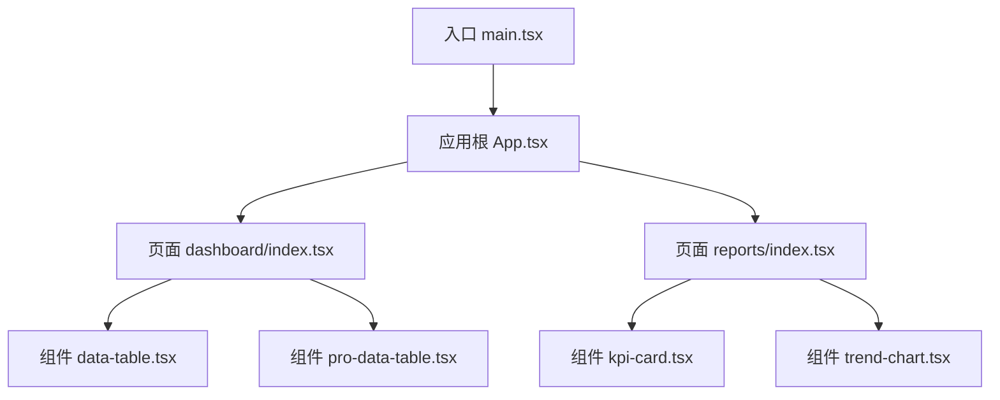
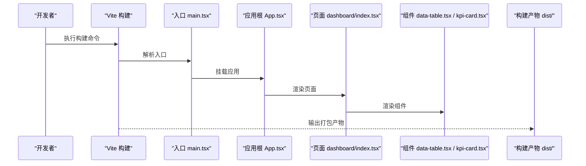
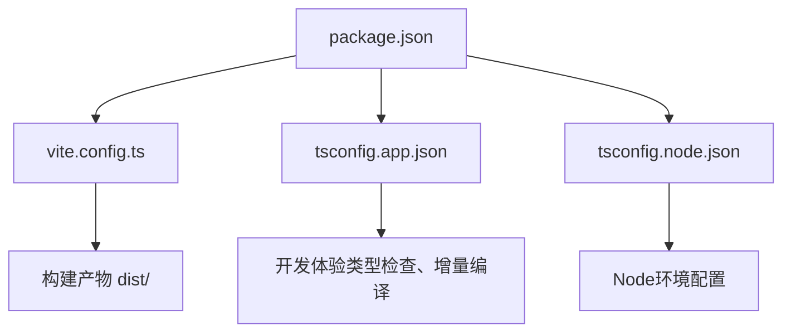

# 代码优化

<cite>
**本文引用的文件**   
- [vite.config.ts](file://web/vite.config.ts)
- [package.json](file://web/package.json)
- [tsconfig.app.json](file://web/tsconfig.app.json)
- [tsconfig.node.json](file://web/tsconfig.node.json)
- [App.tsx](file://web/src/App.tsx)
- [main.tsx](file://web/src/main.tsx)
- [data-table.tsx](file://web/src/components/data-table/data-table.tsx)
- [pro-data-table.tsx](file://web/src/components/data-table/pro-data-table.tsx)
- [kpi-card.tsx](file://web/src/components/charts/kpi-card.tsx)
- [trend-chart.tsx](file://web/src/components/charts/trend-chart.tsx)
- [dashboard/index.tsx](file://web/src/pages/dashboard/index.tsx)
- [reports/index.tsx](file://web/src/pages/reports/index.tsx)
</cite>

## 目录
1. [简介](#简介)
2. [项目结构](#项目结构)
3. [核心组件](#核心组件)
4. [架构总览](#架构总览)
5. [详细组件分析](#详细组件分析)
6. [依赖分析](#依赖分析)
7. [性能考虑](#性能考虑)
8. [故障排查指南](#故障排查指南)
9. [结论](#结论)
10. [附录](#附录)

## 简介
本指南面向pj3项目的开发与维护团队，聚焦构建与运行时的性能优化。内容覆盖：
- Vite构建配置的性能优化选项（代码分割、Tree Shaking、压缩等）
- React组件性能优化技巧（React.memo、useMemo、useCallback等记忆化Hook的使用场景与最佳实践）
- TypeScript编译优化（增量编译、类型检查优化等开发体验提升）
- 具体重构案例（将性能瓶颈代码进行优化改造）
- Bundle分析与依赖包优化策略

## 项目结构
本项目采用Vite作为前端构建工具，使用TypeScript与React技术栈，组件按功能域组织在src目录下，页面位于pages目录，图表与数据表格等通用组件集中在components目录。

图示来源
- [main.tsx:1-50](file://web/src/main.tsx#L1-L50)
- [App.tsx:1-50](file://web/src/App.tsx#L1-L50)
- [dashboard/index.tsx:1-50](file://web/src/pages/dashboard/index.tsx#L1-L50)
- [reports/index.tsx:1-50](file://web/src/pages/reports/index.tsx#L1-L50)
- [data-table.tsx:1-50](file://web/src/components/data-table/data-table.tsx#L1-L50)
- [pro-data-table.tsx:1-50](file://web/src/components/data-table/pro-data-table.tsx#L1-L50)
- [kpi-card.tsx:1-50](file://web/src/components/charts/kpi-card.tsx#L1-L50)
- [trend-chart.tsx:1-50](file://web/src/components/charts/trend-chart.tsx#L1-L50)

章节来源
- [main.tsx:1-50](file://web/src/main.tsx#L1-L50)
- [App.tsx:1-50](file://web/src/App.tsx#L1-L50)
- [dashboard/index.tsx:1-50](file://web/src/pages/dashboard/index.tsx#L1-L50)
- [reports/index.tsx:1-50](file://web/src/pages/reports/index.tsx#L1-L50)
- [data-table.tsx:1-50](file://web/src/components/data-table/data-table.tsx#L1-L50)
- [pro-data-table.tsx:1-50](file://web/src/components/data-table/pro-data-table.tsx#L1-L50)
- [kpi-card.tsx:1-50](file://web/src/components/charts/kpi-card.tsx#L1-L50)
- [trend-chart.tsx:1-50](file://web/src/components/charts/trend-chart.tsx#L1-L50)

## 核心组件
- 数据表格组件族
  - data-table.tsx：基础数据展示与分页能力
  - pro-data-table.tsx：增强版，包含高级筛选、排序、导出等特性
- 图表组件族
  - kpi-card.tsx：关键指标卡片
  - trend-chart.tsx：趋势折线图
- 页面级集成
  - dashboard/index.tsx：仪表盘页面，组合数据表格与图表
  - reports/index.tsx：报表页面，聚合KPI与趋势图

章节来源
- [data-table.tsx:1-50](file://web/src/components/data-table/data-table.tsx#L1-L50)
- [pro-data-table.tsx:1-50](file://web/src/components/data-table/pro-data-table.tsx#L1-L50)
- [kpi-card.tsx:1-50](file://web/src/components/charts/kpi-card.tsx#L1-L50)
- [trend-chart.tsx:1-50](file://web/src/components/charts/trend-chart.tsx#L1-L50)
- [dashboard/index.tsx:1-50](file://web/src/pages/dashboard/index.tsx#L1-L50)
- [reports/index.tsx:1-50](file://web/src/pages/reports/index.tsx#L1-L50)

## 架构总览
下图展示了从入口到页面与组件的调用关系，以及构建产物（dist）的生成路径。

图示来源
- [main.tsx:1-50](file://web/src/main.tsx#L1-L50)
- [App.tsx:1-50](file://web/src/App.tsx#L1-L50)
- [dashboard/index.tsx:1-50](file://web/src/pages/dashboard/index.tsx#L1-L50)
- [data-table.tsx:1-50](file://web/src/components/data-table/data-table.tsx#L1-L50)
- [kpi-card.tsx:1-50](file://web/src/components/charts/kpi-card.tsx#L1-L50)

## 详细组件分析

### 数据表格组件（data-table.tsx）
- 职责：提供表格渲染、分页、列定义、行选择等基础能力
- 性能关注点：
  - 列表渲染时避免不必要的重渲染，可通过React.memo包裹
  - 计算属性或派生状态使用useMemo缓存
  - 事件处理函数使用useCallback稳定引用，减少子组件重渲染
- 建议优化：
  - 对大型数据集启用虚拟滚动（如react-window），降低DOM节点数量
  - 将列定义与行数据分离，避免每次渲染创建新对象导致Tree Shaking失效

章节来源
- [data-table.tsx:1-50](file://web/src/components/data-table/data-table.tsx#L1-L50)

### 专业数据表格（pro-data-table.tsx）
- 职责：在基础表格之上增加高级筛选、排序、导出等功能
- 性能关注点：
  - 复杂筛选逻辑应延迟计算或使用防抖/节流
  - 导出操作可异步执行并反馈进度，避免阻塞主线程
- 建议优化：
  - 将筛选条件与结果集解耦，使用useMemo缓存筛选结果
  - 对导出模块进行动态导入，按需加载以减少首屏体积

章节来源
- [pro-data-table.tsx:1-50](file://web/src/components/data-table/pro-data-table.tsx#L1-L50)

### KPI卡片（kpi-card.tsx）
- 职责：展示关键指标数值与简要趋势
- 性能关注点：
  - 数值格式化与单位转换可使用useMemo缓存
  - 图标或样式变化通过props传递，避免内部状态频繁更新
- 建议优化：
  - 若需动画效果，使用CSS过渡而非JS动画，减少重排重绘

章节来源
- [kpi-card.tsx:1-50](file://web/src/components/charts/kpi-card.tsx#L1-L50)

### 趋势图（trend-chart.tsx）
- 职责：绘制时间序列趋势图
- 性能关注点：
  - 大数据量绘图时需采样或降采样
  - 图表库实例复用，避免重复初始化
- 建议优化：
  - 使用Web Worker处理大量数据计算，避免阻塞UI
  - 按需引入图表库的子模块，配合Tree Shaking减小体积

章节来源
- [trend-chart.tsx:1-50](file://web/src/components/charts/trend-chart.tsx#L1-L50)

### 仪表盘页面（dashboard/index.tsx）
- 职责：整合数据表格与图表，呈现整体业务概览
- 性能关注点：
  - 页面内多个重型组件并行渲染可能导致卡顿
  - 数据获取与渲染耦合，影响可测试性与性能
- 建议优化：
  - 使用React.lazy与Suspense对重型组件进行懒加载
  - 将数据获取逻辑下沉至自定义Hook，结合错误边界与重试机制

章节来源
- [dashboard/index.tsx:1-50](file://web/src/pages/dashboard/index.tsx#L1-L50)

### 报表页面（reports/index.tsx）
- 职责：聚合KPI与趋势图，生成报表视图
- 性能关注点：
  - 多图表同时渲染可能引发内存压力
  - 数据刷新频率高，需控制更新粒度
- 建议优化：
  - 使用IntersectionObserver实现可视区域懒加载
  - 对高频更新的数据使用requestAnimationFrame分批处理

章节来源
- [reports/index.tsx:1-50](file://web/src/pages/reports/index.tsx#L1-L50)

## 依赖分析
本节分析项目依赖与构建配置之间的关系，重点关注Vite配置、TypeScript配置与包管理。

图示来源
- [package.json:1-50](file://web/package.json#L1-L50)
- [vite.config.ts:1-50](file://web/vite.config.ts#L1-L50)
- [tsconfig.app.json:1-50](file://web/tsconfig.app.json#L1-L50)
- [tsconfig.node.json:1-50](file://web/tsconfig.node.json#L1-L50)

章节来源
- [package.json:1-50](file://web/package.json#L1-L50)
- [vite.config.ts:1-50](file://web/vite.config.ts#L1-L50)
- [tsconfig.app.json:1-50](file://web/tsconfig.app.json#L1-L50)
- [tsconfig.node.json:1-50](file://web/tsconfig.node.json#L1-L50)

## 性能考虑

### Vite构建配置优化
- 代码分割策略
  - 使用动态导入（import()）对重型组件或第三方库进行拆分，减少首屏体积
  - 针对路由级别进行懒加载，结合React.lazy与Suspense
- Tree Shaking配置
  - 确保使用ESM模块语法，避免CommonJS混用导致无法摇树
  - 清理未使用的导出，保持模块边界清晰
- 压缩优化
  - 启用生产环境的JS/CSS压缩与混淆
  - 图片资源使用现代格式（WebP/AVIF）并进行尺寸优化
- 缓存与增量构建
  - 利用Vite的预构建与依赖缓存，加速冷启动与热更新
  - 合理设置external依赖，避免重复打包

章节来源
- [vite.config.ts:1-50](file://web/vite.config.ts#L1-L50)

### React组件性能优化
- React.memo
  - 适用于纯展示型组件，避免props未变化时的重渲染
  - 注意比较函数的开销，必要时自定义比较逻辑
- useMemo
  - 用于昂贵计算或派生状态，避免每次渲染重新计算
  - 仅当计算成本高于比较成本时使用
- useCallback
  - 用于传递给子组件的事件处理函数，保持引用稳定
  - 避免过度使用，仅在子组件依赖引用稳定性时使用

章节来源
- [data-table.tsx:1-50](file://web/src/components/data-table/data-table.tsx#L1-L50)
- [pro-data-table.tsx:1-50](file://web/src/components/data-table/pro-data-table.tsx#L1-L50)
- [kpi-card.tsx:1-50](file://web/src/components/charts/kpi-card.tsx#L1-L50)
- [trend-chart.tsx:1-50](file://web/src/components/charts/trend-chart.tsx#L1-L50)

### TypeScript编译优化
- 增量编译
  - 启用incremental与tsBuildInfoFile，提升二次编译速度
- 类型检查优化
  - 使用skipLibCheck跳过第三方库的类型检查，加快构建
  - 合理划分tsconfig，区分应用与Node环境配置
- 开发体验提升
  - 结合Vite的HMR与TS类型提示，提高迭代效率

章节来源
- [tsconfig.app.json:1-50](file://web/tsconfig.app.json#L1-L50)
- [tsconfig.node.json:1-50](file://web/tsconfig.node.json#L1-L50)

### Bundle分析与依赖包优化
- 使用Bundle分析工具
  - 推荐rollup-plugin-visualizer或webpack-bundle-analyzer（通过插件适配Vite）
  - 定期分析包体积，识别大依赖与重复依赖
- 依赖包优化策略
  - 替换大体积库为轻量替代方案（如lodash-es替代lodash）
  - 按需引入UI组件库，避免全量打包
  - 使用CDN或外部化第三方库，减少应用包体积

章节来源
- [package.json:1-50](file://web/package.json#L1-L50)

## 故障排查指南
- 构建失败
  - 检查Vite配置中的路径别名与插件兼容性
  - 确认TypeScript版本与依赖匹配
- 运行时性能问题
  - 使用浏览器性能面板定位重渲染热点
  - 检查是否存在闭包导致的内存泄漏
- 类型检查错误
  - 逐步缩小范围，定位具体文件与类型定义
  - 临时禁用严格模式以定位问题根源

章节来源
- [vite.config.ts:1-50](file://web/vite.config.ts#L1-L50)
- [tsconfig.app.json:1-50](file://web/tsconfig.app.json#L1-L50)

## 结论
通过合理的Vite构建配置、React组件优化与TypeScript编译调优，pj3项目在构建速度与运行时性能方面可获得显著提升。建议持续监控Bundle体积与组件渲染性能，结合Bundle分析工具进行迭代优化。

## 附录
- 常用优化清单
  - 启用代码分割与懒加载
  - 使用React.memo、useMemo、useCallback进行记忆化
  - 启用增量编译与类型检查优化
  - 定期分析Bundle体积并优化依赖
- 参考文档
  - Vite官方文档：https://vitejs.dev/
  - React性能优化指南：https://react.dev/learn/render-and-commit
  - TypeScript编译选项：https://www.typescriptlang.org/tsconfig