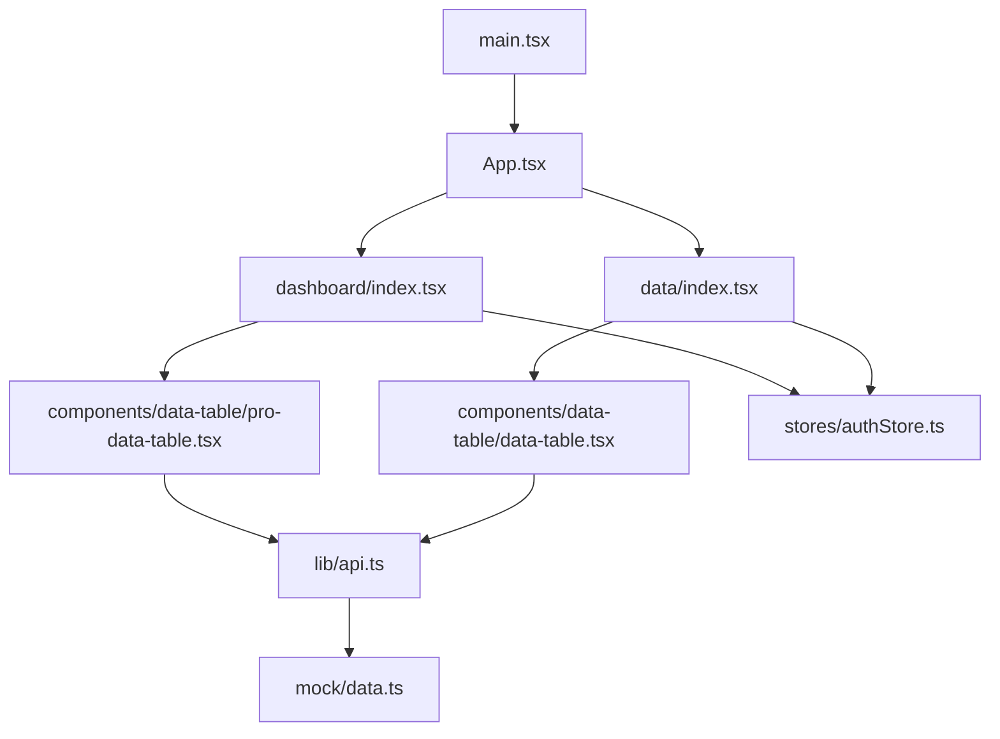
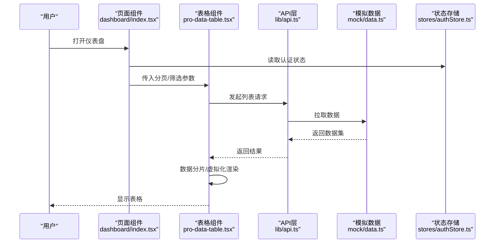
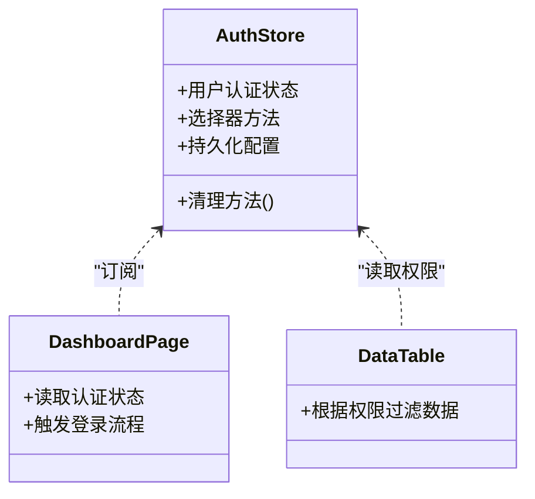
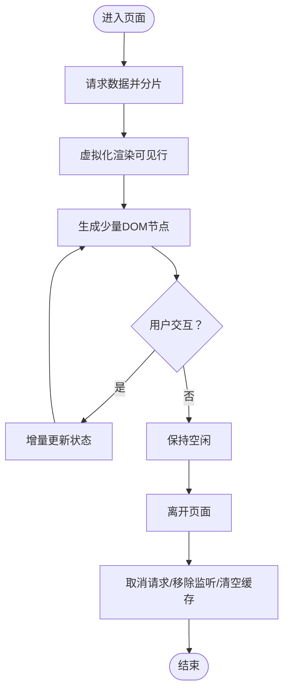
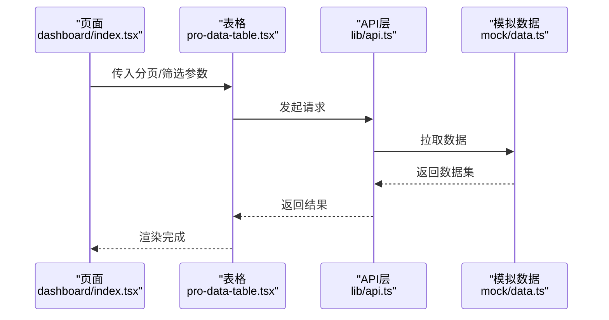
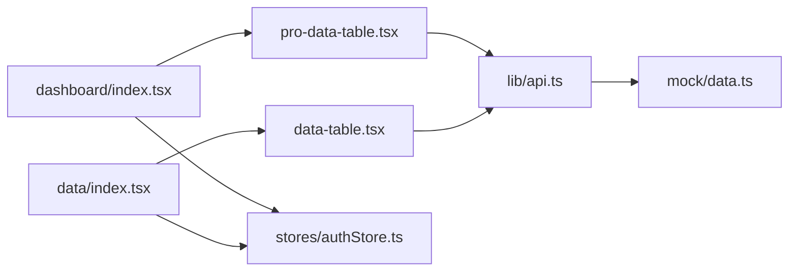

# 内存管理

<cite>
**本文引用的文件**   
- [web/src/stores/authStore.ts](file://web/src/stores/authStore.ts)
- [web/src/components/data-table/pro-data-table.tsx](file://web/src/components/data-table/pro-data-table.tsx)
- [web/src/components/data-table/data-table.tsx](file://web/src/components/data-table/data-table.tsx)
- [web/src/pages/dashboard/index.tsx](file://web/src/pages/dashboard/index.tsx)
- [web/src/pages/data/index.tsx](file://web/src/pages/data/index.tsx)
- [web/src/lib/api.ts](file://web/src/lib/api.ts)
- [web/src/mock/data.ts](file://web/src/mock/data.ts)
- [web/src/hooks/useAuth.ts](file://web/src/hooks/useAuth.ts)
- [web/src/App.tsx](file://web/src/App.tsx)
- [web/src/main.tsx](file://web/src/main.tsx)
</cite>

## 目录
1. [简介](#简介)
2. [项目结构](#项目结构)
3. [核心组件](#核心组件)
4. [架构总览](#架构总览)
5. [详细组件分析](#详细组件分析)
6. [依赖分析](#依赖分析)
7. [性能考量](#性能考量)
8. [故障排查指南](#故障排查指南)
9. [结论](#结论)
10. [附录](#附录)

## 简介
本指南面向pj3项目的内存管理与优化，聚焦以下目标：
- JavaScript内存管理机制与垃圾回收原理
- 常见内存泄漏原因与检测方法
- Zustand状态管理的内存优化策略（状态切片、订阅优化、持久化）
- 大型数据集的内存管理方案（数据分片、懒加载、清理）
- 基于Chrome DevTools Memory面板的检测与修复案例
- 前端应用内存优化的最佳实践与监控策略

## 项目结构
本项目为React + Vite前端工程，关键与内存相关的代码集中在：
- 状态管理：stores/authStore.ts（Zustand store）
- 大数据表格：components/data-table/（pro-data-table.tsx、data-table.tsx）
- 页面层：pages/dashboard/index.tsx、pages/data/index.tsx
- 数据获取：lib/api.ts、mock/data.ts
- 入口与路由：main.tsx、App.tsx

图表来源
- [web/src/main.tsx](file://web/src/main.tsx)
- [web/src/App.tsx](file://web/src/App.tsx)
- [web/src/pages/dashboard/index.tsx](file://web/src/pages/dashboard/index.tsx)
- [web/src/pages/data/index.tsx](file://web/src/pages/data/index.tsx)
- [web/src/components/data-table/pro-data-table.tsx](file://web/src/components/data-table/pro-data-table.tsx)
- [web/src/components/data-table/data-table.tsx](file://web/src/components/data-table/data-table.tsx)
- [web/src/lib/api.ts](file://web/src/lib/api.ts)
- [web/src/mock/data.ts](file://web/src/mock/data.ts)
- [web/src/stores/authStore.ts](file://web/src/stores/authStore.ts)

章节来源
- [web/src/main.tsx](file://web/src/main.tsx)
- [web/src/App.tsx](file://web/src/App.tsx)
- [web/src/pages/dashboard/index.tsx](file://web/src/pages/dashboard/index.tsx)
- [web/src/pages/data/index.tsx](file://web/src/pages/data/index.tsx)
- [web/src/components/data-table/pro-data-table.tsx](file://web/src/data-table/pro-data-table.tsx)
- [web/src/components/data-table/data-table.tsx](file://web/src/components/data-table/data-table.tsx)
- [web/src/lib/api.ts](file://web/src/lib/api.ts)
- [web/src/mock/data.ts](file://web/src/mock/data.ts)
- [web/src/stores/authStore.ts](file://web/src/stores/authStore.ts)

## 核心组件
- Zustand Store（authStore.ts）
  - 职责：集中管理认证相关状态，供页面和组件订阅。
  - 内存关注点：避免在store中持有大对象或闭包引用；按需选择器订阅最小字段；谨慎使用持久化插件带来的额外缓存。
- 专业数据表格（pro-data-table.tsx、data-table.tsx）
  - 职责：展示大量行数据的表格，支持分页、筛选、排序等交互。
  - 内存关注点：渲染虚拟化、数据分片、事件监听清理、中间态缓存控制。
- 页面容器（dashboard/index.tsx、data/index.tsx）
  - 职责：组织业务逻辑与UI组合，触发数据加载与状态更新。
  - 内存关注点：生命周期内资源申请与释放、副作用清理、避免全局强引用。
- 数据访问（api.ts、mock/data.ts）
  - 职责：统一请求封装与模拟数据源。
  - 内存关注点：响应体大小控制、错误路径不保留冗余数据、取消未完成的请求。

章节来源
- [web/src/stores/authStore.ts](file://web/src/stores/authStore.ts)
- [web/src/components/data-table/pro-data-table.tsx](file://web/src/components/data-table/pro-data-table.tsx)
- [web/src/components/data-table/data-table.tsx](file://web/src/components/data-table/data-table.tsx)
- [web/src/pages/dashboard/index.tsx](file://web/src/pages/dashboard/index.tsx)
- [web/src/pages/data/index.tsx](file://web/src/pages/data/index.tsx)
- [web/src/lib/api.ts](file://web/src/lib/api.ts)
- [web/src/mock/data.ts](file://web/src/mock/data.ts)

## 架构总览
下图展示了从页面到状态与数据层的调用关系，以及潜在内存热点位置。

图表来源
- [web/src/pages/dashboard/index.tsx](file://web/src/pages/dashboard/index.tsx)
- [web/src/components/data-table/pro-data-table.tsx](file://web/src/components/data-table/pro-data-table.tsx)
- [web/src/lib/api.ts](file://web/src/lib/api.ts)
- [web/src/mock/data.ts](file://web/src/mock/data.ts)
- [web/src/stores/authStore.ts](file://web/src/stores/authStore.ts)

## 详细组件分析

### Zustand状态管理（authStore.ts）
- 设计要点
  - 将认证状态拆分为最小必要字段，避免整块大对象被订阅。
  - 使用选择器订阅具体字段，减少不必要的重渲染与闭包引用。
  - 持久化存储仅在必要时启用，注意序列化体积与过期清理。
- 内存优化建议
  - 避免在store中保存DOM节点、定时器ID、事件回调等易泄漏引用。
  - 对敏感信息设置合理的生命周期与清理时机。
  - 在页面卸载时主动清除临时状态或取消未完成操作。

图表来源
- [web/src/stores/authStore.ts](file://web/src/stores/authStore.ts)
- [web/src/pages/dashboard/index.tsx](file://web/src/pages/dashboard/index.tsx)
- [web/src/components/data-table/data-table.tsx](file://web/src/components/data-table/data-table.tsx)

章节来源
- [web/src/stores/authStore.ts](file://web/src/stores/authStore.ts)
- [web/src/pages/dashboard/index.tsx](file://web/src/pages/dashboard/index.tsx)
- [web/src/components/data-table/data-table.tsx](file://web/src/components/data-table/data-table.tsx)

### 专业数据表格（pro-data-table.tsx、data-table.tsx）
- 设计要点
  - 采用虚拟化渲染，仅渲染可视区域行，降低DOM与JS对象数量。
  - 数据分片：按页/窗口大小切分数据集，避免一次性加载全部数据。
  - 事件与副作用：在组件卸载时移除监听器、取消请求、清空定时器。
- 内存优化建议
  - 使用稳定的键值与不可变更新，避免重复创建对象导致GC压力。
  - 对大对象进行惰性计算与延迟初始化。
  - 提供“重置/清空”接口，在切换视图或退出页面时主动释放内存。

图表来源
- [web/src/components/data-table/pro-data-table.tsx](file://web/src/components/data-table/pro-data-table.tsx)
- [web/src/components/data-table/data-table.tsx](file://web/src/components/data-table/data-table.tsx)
- [web/src/lib/api.ts](file://web/src/lib/api.ts)

章节来源
- [web/src/components/data-table/pro-data-table.tsx](file://web/src/components/data-table/pro-data-table.tsx)
- [web/src/components/data-table/data-table.tsx](file://web/src/components/data-table/data-table.tsx)
- [web/src/lib/api.ts](file://web/src/lib/api.ts)

### 页面与数据流（dashboard/index.tsx、data/index.tsx）
- 设计要点
  - 页面负责编排数据加载与状态同步，避免在组件内部持有长生命周期的大对象。
  - 通过hooks或上下文传递最小必要数据，减少跨层级传播的引用链。
- 内存优化建议
  - 在useEffect中注册清理函数，确保离开页面时释放资源。
  - 对频繁更新的列表使用稳定key与不可变更新策略。
  - 避免在页面级缓存未使用的历史快照。

图表来源
- [web/src/pages/dashboard/index.tsx](file://web/src/pages/dashboard/index.tsx)
- [web/src/components/data-table/pro-data-table.tsx](file://web/src/components/data-table/pro-data-table.tsx)
- [web/src/lib/api.ts](file://web/src/lib/api.ts)
- [web/src/mock/data.ts](file://web/src/mock/data.ts)

章节来源
- [web/src/pages/dashboard/index.tsx](file://web/src/pages/dashboard/index.tsx)
- [web/src/pages/data/index.tsx](file://web/src/pages/data/index.tsx)
- [web/src/components/data-table/pro-data-table.tsx](file://web/src/components/data-table/pro-data-table.tsx)
- [web/src/lib/api.ts](file://web/src/lib/api.ts)
- [web/src/mock/data.ts](file://web/src/mock/data.ts)

### 认证钩子与入口（useAuth.ts、main.tsx、App.tsx）
- 设计要点
  - useAuth.ts封装认证逻辑，避免在多处重复实现与持有冗余引用。
  - main.tsx与App.tsx作为应用入口，应尽早初始化必要的轻量资源，避免阻塞首屏。
- 内存优化建议
  - 在认证完成后及时清理临时令牌或会话数据。
  - 路由切换时确保旧页面的副作用已清理，防止隐式引用链阻止GC。

章节来源
- [web/src/hooks/useAuth.ts](file://web/src/hooks/useAuth.ts)
- [web/src/main.tsx](file://web/src/main.tsx)
- [web/src/App.tsx](file://web/src/App.tsx)

## 依赖分析
- 组件耦合
  - 页面组件依赖表格组件与API层，表格组件依赖API层与模拟数据。
  - Zustand store被多个页面与表格组件订阅，需保证选择器粒度足够细。
- 外部依赖
  - 网络请求与模拟数据源可能产生大对象，需在API层做裁剪与去重。
- 循环依赖风险
  - 避免在store中直接引用组件实例或DOM节点，防止形成强引用环。

图表来源
- [web/src/pages/dashboard/index.tsx](file://web/src/pages/dashboard/index.tsx)
- [web/src/pages/data/index.tsx](file://web/src/pages/data/index.tsx)
- [web/src/components/data-table/pro-data-table.tsx](file://web/src/components/data-table/pro-data-table.tsx)
- [web/src/components/data-table/data-table.tsx](file://web/src/components/data-table/data-table.tsx)
- [web/src/lib/api.ts](file://web/src/lib/api.ts)
- [web/src/mock/data.ts](file://web/src/mock/data.ts)
- [web/src/stores/authStore.ts](file://web/src/stores/authStore.ts)

章节来源
- [web/src/pages/dashboard/index.tsx](file://web/src/pages/dashboard/index.tsx)
- [web/src/pages/data/index.tsx](file://web/src/pages/data/index.tsx)
- [web/src/components/data-table/pro-data-table.tsx](file://web/src/components/data-table/pro-data-table.tsx)
- [web/src/components/data-table/data-table.tsx](file://web/src/components/data-table/data-table.tsx)
- [web/src/lib/api.ts](file://web/src/lib/api.ts)
- [web/src/mock/data.ts](file://web/src/mock/data.ts)
- [web/src/stores/authStore.ts](file://web/src/stores/authStore.ts)

## 性能考量
- 渲染性能
  - 使用虚拟化与数据分片，显著降低DOM节点数量与布局抖动。
  - 稳定key与不可变更新，减少不必要的重渲染。
- 内存占用
  - 控制缓存大小与生命周期，避免长期持有大对象。
  - 在页面切换或组件卸载时主动清理监听器、定时器与请求。
- 网络与数据
  - 对响应数据进行裁剪与去重，避免传输与缓存冗余字段。
  - 使用取消机制处理超时或用户快速切换场景的请求。

[本节为通用指导，无需特定文件来源]

## 故障排查指南
- Chrome DevTools Memory面板使用方法
  - 录制堆快照：在“堆快照”中对比不同时间点的差异，定位未被释放的对象。
  - 分配时间线：观察内存增长曲线，关联用户操作与内存峰值。
  - 保留树：检查对象被哪些引用链持有，识别泄漏源头。
- 常见泄漏模式与修复
  - 全局变量与闭包：避免在模块级或闭包中保存大对象或DOM引用。
  - 事件监听未移除：在useEffect或组件卸载时移除监听器。
  - 定时器未清理：在清理函数中clearTimeout/clearInterval。
  - 第三方库实例未销毁：如图表、地图等，需在卸载时调用销毁方法。
  - 缓存无上限：为缓存设置最大条目数与过期策略。
- 针对本项目的排查建议
  - 在dashboard与data页面间切换，观察表格组件是否释放数据与监听。
  - 检查authStore是否在登出后清理敏感信息与临时状态。
  - 验证API层是否正确取消未完成的请求，避免残留Promise与响应体。

章节来源
- [web/src/components/data-table/pro-data-table.tsx](file://web/src/components/data-table/pro-data-table.tsx)
- [web/src/components/data-table/data-table.tsx](file://web/src/components/data-table/data-table.tsx)
- [web/src/stores/authStore.ts](file://web/src/stores/authStore.ts)
- [web/src/lib/api.ts](file://web/src/lib/api.ts)

## 结论
- 通过Zustand的状态切片与选择器订阅，可显著降低不必要渲染与闭包引用。
- 大数据表格应采用虚拟化与数据分片，并在生命周期内严格清理副作用。
- 结合Chrome DevTools Memory面板，系统化定位与修复内存泄漏。
- 建立统一的内存优化规范与监控策略，持续提升应用稳定性与用户体验。

[本节为总结性内容，无需特定文件来源]

## 附录
- 术语
  - 垃圾回收：运行时自动回收不再被引用的对象所占用的内存。
  - 选择器：从状态中选择最小必要字段，减少订阅范围。
  - 虚拟化：仅渲染可视区域的元素，降低DOM与对象数量。
- 参考实践
  - 在页面级维护最小状态，复杂逻辑下沉至自定义hooks。
  - 对大对象进行惰性初始化与按需加载。
  - 为所有异步操作提供取消与清理能力。

[本节为概念性内容，无需特定文件来源]