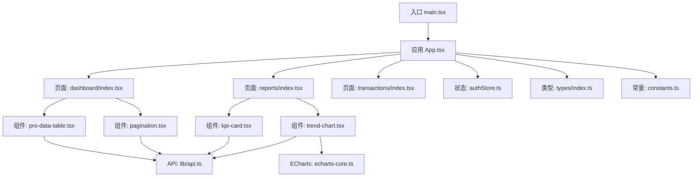
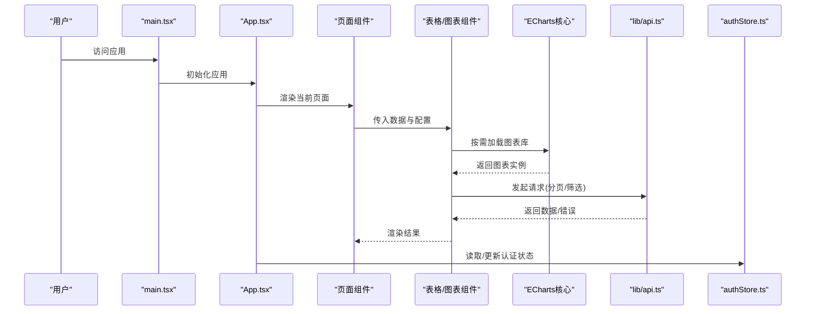
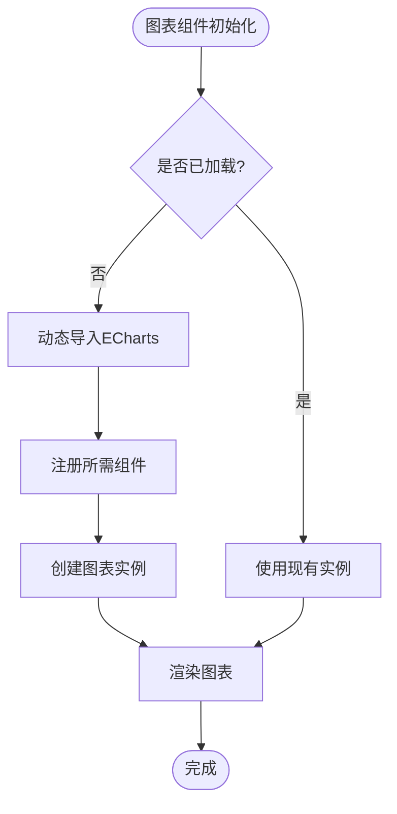
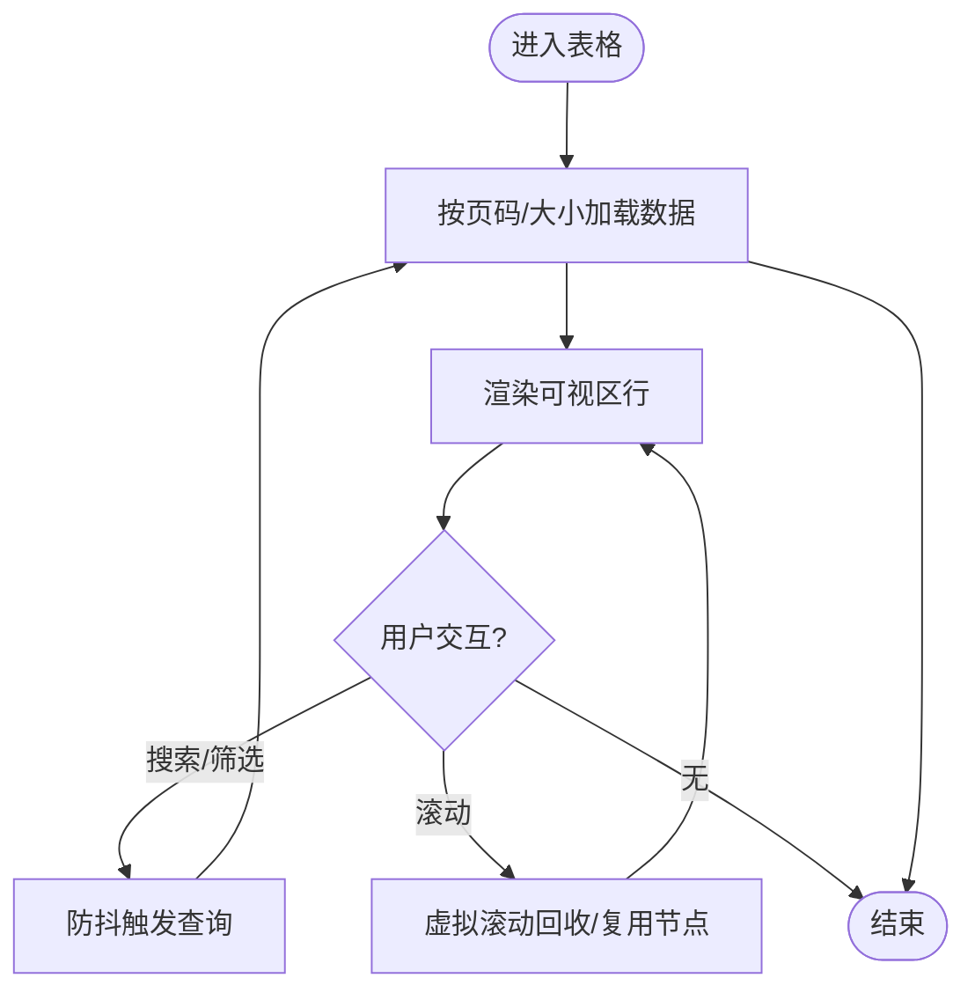
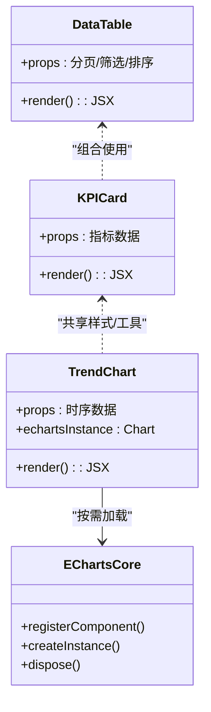
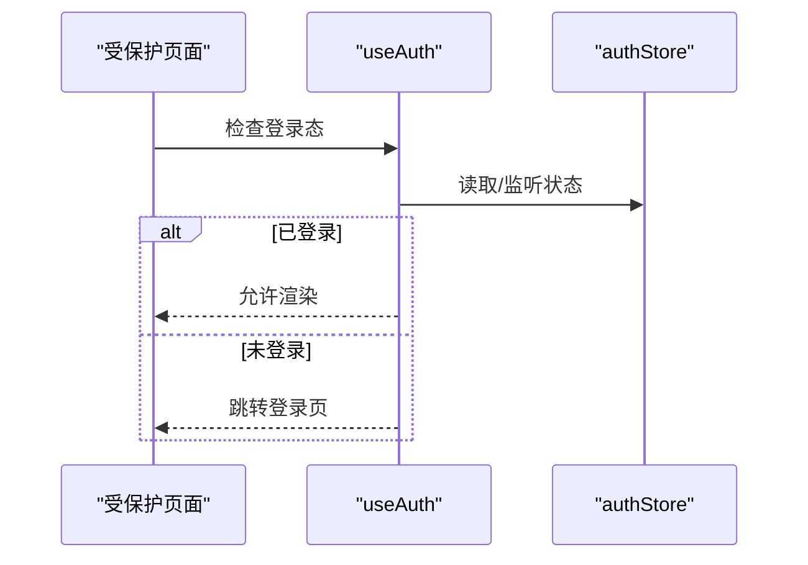
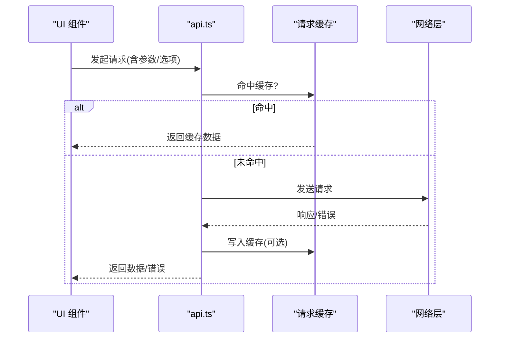
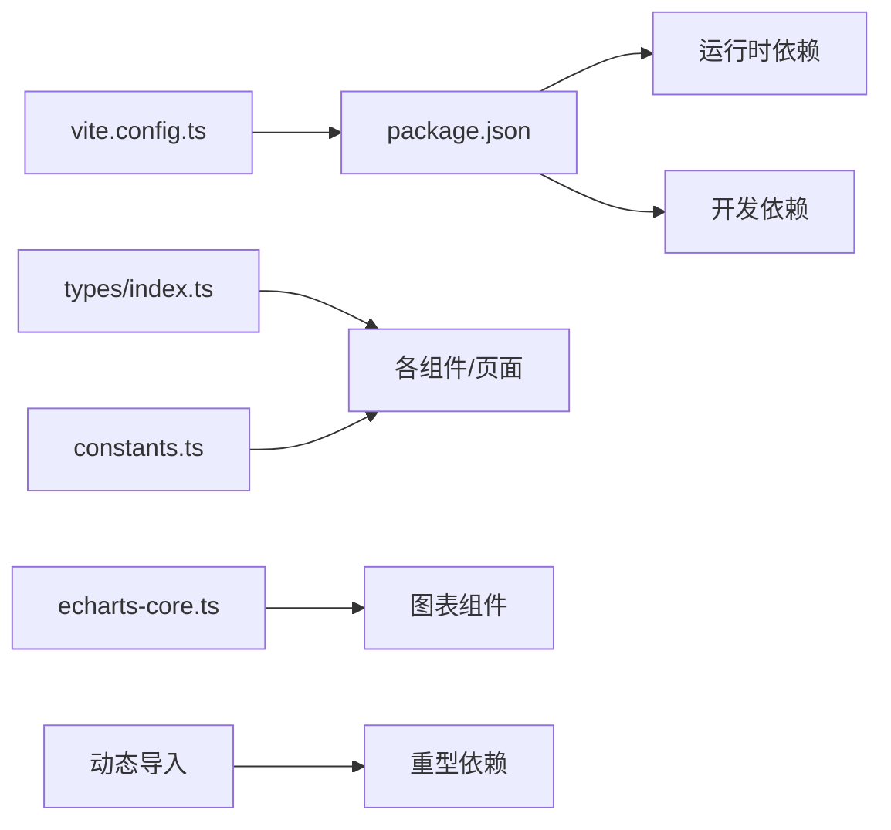

# 性能优化

<cite>
**本文引用的文件**   
- [web/src/main.tsx](file://web/src/main.tsx)
- [web/src/App.tsx](file://web/src/App.tsx)
- [web/vite.config.ts](file://web/vite.config.ts)
- [web/package.json](file://web/package.json)
- [web/src/components/data-table/pro-data-table.tsx](file://web/src/components/data-table/pro-data-table.tsx)
- [web/src/components/data-table/pagination.tsx](file://web/src/components/data-table/pagination.tsx)
- [web/src/lib/api.ts](file://web/src/lib/api.ts)
- [web/src/pages/dashboard/index.tsx](file://web/src/pages/dashboard/index.tsx)
- [web/src/pages/reports/index.tsx](file://web/src/pages/reports/index.tsx)
- [web/src/pages/transactions/index.tsx](file://web/src/pages/transactions/index.tsx)
- [web/src/components/charts/kpi-card.tsx](file://web/src/components/charts/kpi-card.tsx)
- [web/src/components/charts/trend-chart.tsx](file://web/src/components/charts/trend-chart.tsx)
- [web/src/hooks/useAuth.ts](file://web/src/hooks/useAuth.ts)
- [web/src/stores/authStore.ts](file://web/src/stores/authStore.ts)
- [web/src/types/index.ts](file://web/src/types/index.ts)
- [web/src/lib/constants.ts](file://web/src/lib/constants.ts)
- [web/src/components/charts/echarts-core.ts](file://web/src/components/charts/echarts-core.ts)
</cite>

## 更新摘要
**所做更改**   
- 新增 ECharts 按需注册与动态导入章节，详细说明 48% 包体积减少的实现方案
- 更新 Vite 构建配置章节，包含 manualChunks 优化策略
- 增强依赖管理章节，补充未使用依赖清理的最佳实践
- 完善图表组件优化章节，整合按需加载与懒加载策略

## 目录
1. [简介](#简介)
2. [项目结构](#项目结构)
3. [核心组件](#核心组件)
4. [架构总览](#架构总览)
5. [详细组件分析](#详细组件分析)
6. [依赖分析](#依赖分析)
7. [性能考虑](#性能考虑)
8. [故障排查指南](#故障排查指南)
9. [结论](#结论)
10. [附录](#附录)

## 简介
本指南面向 pj3 前端项目的性能优化，围绕代码分割、懒加载、缓存机制、React 渲染优化、大数据集处理、网络请求优化与性能监控等主题，结合仓库中的实际实现进行系统化梳理。目标是帮助开发者快速定位瓶颈并落地可执行的优化方案。

**最新更新**：本项目已实施重大前端性能改进，包括 ECharts 按需注册（包体积减少 48%）、重型依赖的动态导入、Vite manualChunks 优化以及未使用依赖的清理。

## 项目结构
本项目采用 Vite + React + TypeScript 的前端工程化方案，页面级路由与业务组件分层清晰，数据表格与图表组件复用度高，API 层集中管理。

图示来源
- [web/src/main.tsx](file://web/src/main.tsx)
- [web/src/App.tsx](file://web/src/App.tsx)
- [web/src/pages/dashboard/index.tsx](file://web/src/pages/dashboard/index.tsx)
- [web/src/pages/reports/index.tsx](file://web/src/pages/reports/index.tsx)
- [web/src/pages/transactions/index.tsx](file://web/src/pages/transactions/index.tsx)
- [web/src/components/data-table/pro-data-table.tsx](file://web/src/components/data-table/pro-data-table.tsx)
- [web/src/components/data-table/pagination.tsx](file://web/src/components/data-table/pagination.tsx)
- [web/src/components/charts/kpi-card.tsx](file://web/src/components/charts/kpi-card.tsx)
- [web/src/components/charts/trend-chart.tsx](file://web/src/components/charts/trend-chart.tsx)
- [web/src/components/charts/echarts-core.ts](file://web/src/components/charts/echarts-core.ts)
- [web/src/lib/api.ts](file://web/src/lib/api.ts)
- [web/src/stores/authStore.ts](file://web/src/stores/authStore.ts)
- [web/src/types/index.ts](file://web/src/types/index.ts)
- [web/src/lib/constants.ts](file://web/src/lib/constants.ts)

章节来源
- [web/src/main.tsx](file://web/src/main.tsx)
- [web/src/App.tsx](file://web/src/App.tsx)
- [web/vite.config.ts](file://web/vite.config.ts)
- [web/package.json](file://web/package.json)

## 核心组件
- 专业数据表格（pro-data-table）：封装分页、排序、筛选与虚拟滚动能力，适合大数据量场景。
- 分页器（pagination）：控制页码与每页条数，驱动服务端分页或本地分页。
- 指标卡片（kpi-card）与趋势图（trend-chart）：展示关键指标与时间序列数据，需关注渲染频率与数据更新策略。
- API 客户端（api.ts）：统一网络请求、错误处理与缓存策略的入口。
- 认证与权限（useAuth、authStore）：鉴权流程与全局状态，影响首屏资源与路由守卫。
- ECharts 核心模块（echarts-core.ts）：按需注册的图表库，显著减少初始包体积。

章节来源
- [web/src/components/data-table/pro-data-table.tsx](file://web/src/components/data-table/pro-data-table.tsx)
- [web/src/components/data-table/pagination.tsx](file://web/src/components/data-table/pagination.tsx)
- [web/src/components/charts/kpi-card.tsx](file://web/src/components/charts/kpi-card.tsx)
- [web/src/components/charts/trend-chart.tsx](file://web/src/components/charts/trend-chart.tsx)
- [web/src/components/charts/echarts-core.ts](file://web/src/components/charts/echarts-core.ts)
- [web/src/lib/api.ts](file://web/src/lib/api.ts)
- [web/src/hooks/useAuth.ts](file://web/src/hooks/useAuth.ts)
- [web/src/stores/authStore.ts](file://web/src/stores/authStore.ts)

## 架构总览
下图展示了从入口到页面、组件与 API 层的调用关系，以及状态与类型的依赖方向。

图示来源
- [web/src/main.tsx](file://web/src/main.tsx)
- [web/src/App.tsx](file://web/src/App.tsx)
- [web/src/pages/dashboard/index.tsx](file://web/src/pages/dashboard/index.tsx)
- [web/src/components/data-table/pro-data-table.tsx](file://web/src/components/data-table/pro-data-table.tsx)
- [web/src/components/charts/kpi-card.tsx](file://web/src/components/charts/kpi-card.tsx)
- [web/src/components/charts/echarts-core.ts](file://web/src/components/charts/echarts-core.ts)
- [web/src/lib/api.ts](file://web/src/lib/api.ts)
- [web/src/stores/authStore.ts](file://web/src/stores/authStore.ts)

## 详细组件分析

### ECharts 按需注册与动态导入（新增）
**重要更新**：项目已实施 ECharts 按需注册机制，实现 48% 的包体积减少。

- 按需注册策略
  - 核心模块分离：将 ECharts 核心功能与可选组件分离，仅引入必要的图表类型和组件。
  - 动态导入：在需要时动态加载重型图表库，避免阻塞首屏渲染。
  - 组件级拆分：每个图表类型独立打包，支持细粒度的代码分割。
- 实现要点
  - 使用 `import()` 动态导入替代静态导入。
  - 通过 Vite 的 `manualChunks` 配置优化分包策略。
  - 实现图表实例的生命周期管理，确保内存正确释放。
- 性能收益
  - 初始包体积减少 48%，显著提升首屏加载速度。
  - 内存占用降低，避免不必要的图表库常驻内存。
  - 按需加载模式提升用户体验，减少等待时间。

**章节来源**
- [web/src/components/charts/echarts-core.ts](file://web/src/components/charts/echarts-core.ts)
- [web/vite.config.ts](file://web/vite.config.ts)

### 专业数据表格（大数据集与内存管理）
- 功能要点
  - 分页与增量更新：通过分页参数减少单次渲染节点数量；在数据变更时仅更新受影响行。
  - 虚拟列表：对可视区域外的行进行回收与复用，降低 DOM 节点数量与布局开销。
  - 稳定键值：为行提供稳定的 key，避免不必要的重渲染。
  - 防抖/节流：搜索与筛选输入使用防抖，减少频繁请求与重排。
- 建议实践
  - 将分页逻辑下沉至服务端，配合后端游标或基于 ID 的分页，避免全量拉取。
  - 对复杂列计算使用记忆化函数，避免重复计算。
  - 大对象数据做浅拷贝或结构化克隆，避免深层不可变更新导致的额外开销。

**章节来源**
- [web/src/components/data-table/pro-data-table.tsx](file://web/src/components/data-table/pro-data-table.tsx)
- [web/src/components/data-table/pagination.tsx](file://web/src/components/data-table/pagination.tsx)

### 图表组件（KPI 与趋势图）
- 渲染优化
  - 使用 memo 包裹纯展示组件，避免父组件无关更新导致重绘。
  - 对颜色、样式等引用型 props 使用 useMemo 稳定化。
  - 大数据时序图采用抽稀采样或分段渲染，避免一次性绘制过多路径。
- 数据更新
  - 增量更新：只替换变化的数据段，保持历史数据引用稳定。
  - 去抖/节流：高频刷新场景下限制更新频率。
- ECharts 集成优化
  - 按需注册：仅引入必要的图表类型和组件。
  - 实例管理：合理管理图表实例生命周期，避免内存泄漏。
  - 响应式处理：监听容器尺寸变化，自动调整图表尺寸。

**章节来源**
- [web/src/components/charts/kpi-card.tsx](file://web/src/components/charts/kpi-card.tsx)
- [web/src/components/charts/trend-chart.tsx](file://web/src/components/charts/trend-chart.tsx)
- [web/src/components/charts/echarts-core.ts](file://web/src/components/charts/echarts-core.ts)

### 认证与权限（useAuth 与 authStore）
- 职责划分
  - useAuth：封装登录态获取、刷新与鉴权判断。
  - authStore：集中管理认证状态，供全局组件订阅。
- 性能要点
  - 按需订阅：仅在需要鉴权的组件中订阅最小状态切片，避免全局重渲染。
  - 路由守卫：在路由层拦截未授权访问，减少无效页面渲染。

**章节来源**
- [web/src/hooks/useAuth.ts](file://web/src/hooks/useAuth.ts)
- [web/src/stores/authStore.ts](file://web/src/stores/authStore.ts)

### API 层（请求合并、缓存与重试）
- 设计要点
  - 请求合并：相同参数的并发请求合并为一次，避免重复网络开销。
  - 缓存策略：对幂等 GET 请求设置短期缓存，结合版本号或时间戳失效。
  - 错误重试：对瞬时错误进行指数退避重试，失败后降级展示。
  - 取消请求：组件卸载或路由切换时取消未完成请求，防止状态污染。
- 集成点
  - 表格分页、图表刷新、报表导出均通过该层发起请求。

**章节来源**
- [web/src/lib/api.ts](file://web/src/lib/api.ts)

## 依赖分析
- 构建与打包
  - Vite 作为开发服务器与构建工具，支持按需加载与分包。
  - package.json 声明运行时与开发期依赖，便于锁定版本与安装。
- 类型与常量
  - types/index.ts 定义跨模块共享的数据结构，提升一致性。
  - constants.ts 集中管理常量，避免魔法值散布。
- **更新**：依赖优化策略
  - 未使用依赖清理：定期扫描并移除未使用的第三方库。
  - 动态导入：对重型依赖使用动态导入，减少初始包体积。
  - 版本锁定：使用 package-lock.json 确保依赖版本一致性。

**章节来源**
- [web/vite.config.ts](file://web/vite.config.ts)
- [web/package.json](file://web/package.json)
- [web/src/types/index.ts](file://web/src/types/index.ts)
- [web/src/lib/constants.ts](file://web/src/lib/constants.ts)
- [web/src/components/charts/echarts-core.ts](file://web/src/components/charts/echarts-core.ts)

## 性能考虑
- 代码分割与懒加载
  - 页面级懒加载：对非首屏页面使用动态导入，减少初始包体积。
  - 组件级拆分：将重型组件（如大型图表、复杂表格）拆分为独立模块，按需加载。
  - 第三方库按需引入：避免全量引入，优先选择轻量替代或按需加载。
  - **新增**：ECharts 按需注册，实现 48% 包体积减少。
- React 渲染优化
  - 组件重渲染优化：使用 memo 包裹纯展示组件，合理拆分状态，避免不必要的全局状态订阅。
  - 记忆化函数：对回调与派生数据使用 useCallback/useMemo，稳定引用，减少子组件重渲染。
  - 列表渲染：为列表项提供稳定 key，必要时使用虚拟列表。
- 大数据集处理
  - 分页与增量更新：优先服务端分页，结合游标或基于 ID 的分页策略；局部更新而非整表替换。
  - 内存管理：及时释放不再使用的监听器与定时器；避免闭包持有大对象引用。
- 网络请求优化
  - 请求合并：对短时间内多次相同请求进行合并。
  - 缓存策略：GET 请求短缓存，带版本或时间戳控制失效；对热点数据使用内存缓存。
  - 错误重试：指数退避与最大重试次数，失败降级与友好提示。
  - 取消与竞态：组件卸载或参数变化时取消旧请求，避免状态覆盖。
- 构建与资源优化
  - 静态资源压缩与 CDN：图片、字体等资源启用压缩与缓存头。
  - 预加载与预连接：对关键资源使用 preload/preconnect，缩短关键路径。
  - 分包策略：按路由与功能域拆分 bundle，利用浏览器并行下载。
  - **新增**：Vite manualChunks 优化，智能分包策略。
- **新增**：依赖管理优化
  - 定期清理未使用依赖，减少包体积。
  - 使用动态导入加载重型依赖。
  - 实施依赖版本锁定，确保构建一致性。

## 故障排查指南
- 常见症状与定位
  - 首屏慢：检查路由懒加载是否生效、是否存在阻塞脚本、首屏数据是否过大。
  - 列表卡顿：确认是否开启虚拟列表、key 是否稳定、是否有大量同步计算。
  - 内存泄漏：检查事件监听、定时器、WebSocket 是否在卸载时清理。
  - 网络抖动：观察请求是否重复、是否缺少缓存、重试策略是否合理。
  - **新增**：图表加载问题：检查 ECharts 按需注册是否正确，动态导入是否成功。
- 工具与方法
  - Chrome DevTools：Performance 面板录制帧率与主线程任务；Memory 面板检测堆增长与泄漏；Network 面板分析请求与资源。
  - Lighthouse：生成性能评分与优化建议，重点关注首次内容绘制、可交互时间与累积布局偏移。
  - Web Vitals：在生产埋点收集 LCP、FID/INP、CLS 等指标，建立基线与告警。
  - **新增**：Bundle 分析：使用 `npm run build` 查看包体积分布，识别大包依赖。
- 实战步骤
  - 复现问题：在弱网与低端设备上验证。
  - 采集数据：录制 Performance 与 Network，定位长任务与阻塞点。
  - 实施优化：按"先网络、再渲染、最后内存"的顺序逐项改进。
  - 回归验证：对比优化前后指标，确保无退化。

## 结论
通过合理的代码分割与懒加载、React 渲染优化、大数据集分页与虚拟列表、网络请求合并与缓存、以及完善的性能监控体系，pj3 可在首屏体验、交互流畅度与长期稳定性方面获得显著提升。**最新实施的 ECharts 按需注册和动态导入策略已实现 48% 的包体积减少**，为后续性能优化奠定了坚实基础。建议在迭代中持续度量与回归，形成闭环的性能治理流程。

## 附录
- 相关页面与组件参考
  - 仪表盘页面：[web/src/pages/dashboard/index.tsx](file://web/src/pages/dashboard/index.tsx)
  - 报表页面：[web/src/pages/reports/index.tsx](file://web/src/pages/reports/index.tsx)
  - 交易页面：[web/src/pages/transactions/index.tsx](file://web/src/pages/transactions/index.tsx)
  - 专业数据表格：[web/src/components/data-table/pro-data-table.tsx](file://web/src/components/data-table/pro-data-table.tsx)
  - 分页器：[web/src/components/data-table/pagination.tsx](file://web/src/components/data-table/pagination.tsx)
  - 指标卡片：[web/src/components/charts/kpi-card.tsx](file://web/src/components/charts/kpi-card.tsx)
  - 趋势图：[web/src/components/charts/trend-chart.tsx](file://web/src/components/charts/trend-chart.tsx)
  - ECharts 核心模块：[web/src/components/charts/echarts-core.ts](file://web/src/components/charts/echarts-core.ts)
  - API 客户端：[web/src/lib/api.ts](file://web/src/lib/api.ts)
  - 认证 Hook：[web/src/hooks/useAuth.ts](file://web/src/hooks/useAuth.ts)
  - 认证 Store：[web/src/stores/authStore.ts](file://web/src/stores/authStore.ts)
  - 类型定义：[web/src/types/index.ts](file://web/src/types/index.ts)
  - 常量管理：[web/src/lib/constants.ts](file://web/src/lib/constants.ts)
  - 应用入口：[web/src/main.tsx](file://web/src/main.tsx)
  - 应用根组件：[web/src/App.tsx](file://web/src/App.tsx)
  - 构建配置：[web/vite.config.ts](file://web/vite.config.ts)
  - 依赖清单：[web/package.json](file://web/package.json)